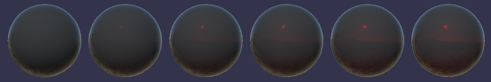

# EXT\_materials\_specular\_edge\_color

## Contributors

- Gary Hsu, Microsoft [@bghgary](https://twitter.com/bghgary)
- Mike Bond, Adobe, [@miibond](https://github.com/MiiBond)

## Status

Draft

## Dependencies

Written against the glTF 2.0 spec.
Must be defined as a sub-extension under the `KHR_materials_specular`

## Exclusions

- This extension must not be used on a material that also uses `KHR_materials_pbrSpecularGlossiness`.
- This extension must not be used on a material that also uses `KHR_materials_unlit`.

## Overview

`KHR_materials_specular` defines how light is specularly reflected from a surface. However, this behaviour is different from that of some other material models. This sub extension defines an interpretation of the specular parameters that is compatible with OpenPBR, the open material standard developed under the [Academy Software Foundation](https://academysoftwarefoundation.github.io/OpenPBR/index.html).

This extension adds a single additional parameter that turns on the functionality of this extension, changing how the parameters of `KHR_materials_specular` are used.

## Extending Materials

The `EXT_materials_specular_edge_color` extension must be added to any existing instance of `KHR_materials_specular` to convert the material's specular model to the new one.

```json
{
    "materials": [
        {
            "extensions": {
                "KHR_materials_specular": {
                    "specularFactor": 1.0,
                    "specularColorFactor": [1.0, 1.0, 1.0],
                    "extensions": {
                        "EXT_materials_specular_edge_color": {
                            "specularEdgeColorEnabled": true
                        }
                    }
                }
            }
        }
    ]
}
```

| |Type|Description|Required|
|-|----|-----------|--------|
| **specularEdgeColorEnabled** | `boolean` | Whether to enable this extension or not. | No, default: `false`|

The factors and textures from `KHR_materials_specular` are combined in the same way as defined by that extension. The difference will be in how these properties are applied to the material.

## OpenPBR's Specular Model

There are two key differences between the glTF specular model and that of OpenPBR. The first is that, `KHR_materials_specular` only applies to dielectric materials (i.e. non-metals) whereas this sub extension will also affect conductors (i.e. metals). The second difference is that the specular model defined here potentially changes the color of specular lighting at glancing angles whereas, in `KHR_materials_specular`, glancing angles are always colored white.

### Dielectrics

In `KHR_materials_specular`, the specular color is applied only to reflectance at normal incidence (i.e. F0). In OpenPBR, this will be applied at all angles of incidence out to F90.

```
dielectric_brdf =
  fresnel_mix(
    spec_color = specularColor.rgb,
    ior = 1.5,
    weight = specularFactor,
    base = diffuse_brdf(color = baseColor),
    layer = specular_brdf(α = roughness^2))
```

The `fresnel_mix` function mixes two BSDFs according to a Fresnel term. The `layer` is weighted with `weight * fresnel(ior)`. The `base` is weighted with `1 - weight * fresnel(ior)`. This differs from `KHR_materials_specular` only in that the fresnel term does not take specular color into account. The specular color is then applied to the specular lobe at the end, thereby coloring the entire specular lobe rather than just F0.

The following images show specular color increasing from [0,0,0] to [1,1,1] for `KHR_materials_specular` and for this new extension.

#### KHR_materials_specular

#### EXT_materials_specular_edge_color


Here is the same comparison for colored specular, increasing from [0,0,0] to [1,0,0] (bottom).

#### KHR_materials_specular

#### EXT_materials_specular_edge_color


In OpenPBR, specular_weight can exceed 1.0 but not specular_color. In KHR_materials_specular, the opposite is true. In this extension, we inherit the same properties so proper clamping needs to be used to ensure energy conservation and compatibility with OpenPBR. For specular color factor values greater than 1.0, we increase the specular factor by that amount and then normalize the specular color factor. This new weight is then clamped so that the fresnel mix does not result in diffuse dropping below 0.0 or specular going above 1.0. Please refer to [Implementation](#Implementation) for an example on where to place the clamping operations.

### Conductors

In OpenPBR, metals use the [F82 reflectance model](https://academysoftwarefoundation.github.io/OpenPBR/index.html#model/basesubstrate/metal) (see also the Adobe Standard Material [technical specifications](https://helpx.adobe.com/content/dam/substance-3d/general-knowledge/asm/Adobe%20Standard%20Material%20-%20Technical%20Documentation%20-%20May2023.pdf) for information on F82).  This allows the specular color to be applied at grazing angles to simulate metals with complex IOR's. Many real-world metals exhibit dips in brightness or subtle hue changes at grazing angles.

Here are three real-world metals and one made up, "Unobtainium", to demonstrate the edge-coloring.


For real-world metals, the effect can be hard to see. To make it more visible, here are the results of rendering in a white furnace.


This model adds an extra term to the Schlick approximation to accomplish this. 

Let $\mu$ be the cosine of the incident angle and $\overline{\mu}$ is $\cos(82) \approx \frac{1}{7}$. $F(\overline{\mu})$ is the specular color at $F_{{82}}$:

From the OpenPBR specs:


## Implementation

*This section is non-normative.*

[Appendix B](https://www.khronos.org/registry/glTF/specs/2.0/glTF-2.0.html#appendix-b-brdf-implementation) defines the function `fresnel_mix`. In this extension, apply this function to the dielectric lobe only and we add two additional arguments called `weight` and `specular_color`.

```
function fresnel_mix(specular_color, ior, weight, base, layer) {
  f0 = ((1-ior)/(1+ior))^2
  fr = f0 + (1 - f0)*(1 - abs(VdotH))^5
  max_specular = max_value(specular_color)
  if (max_specular > 1.0) {
    weight *= max_specular
    specular_color /= max_specular
  }
  return max(1 - weight * fr, 0.0) * base + min(weight * fr * specular_color, 1.0) * layer
}
```

Note that the specular color is being applied to the entire lobe, rather than only for F0.

For the metals, we will define a different function. `F0` is the base color of the material and `specular_color` is the specular color defined by this extension.

```
function fresnel_f82(specular_color, weight, F0, roughness) {
    const cos_theta_max = 0.142857143; // 1/7
    const one_minus_cos_theta_max_to_the_fifth = 0.462664366; // (1 - cos_theta_max)^5
    const one_minus_cos_theta_max_to_the_sixth = 0.396569457; // (1 - cos_theta_max)^6
    vec3 white_minus_F0 = 1 - F0;
    vec3 b_numerator = (F0 + white_minus_F0 * one_minus_cos_theta_max_to_the_fifth) * (1 - specular_color * weight);
    const b_denominator = cos_theta_max * one_minus_cos_theta_max_to_the_sixth;
    const b_denominator_reciprocal = 1.0 / b_denominator;
    vec3 b = b_numerator * b_denominator_reciprocal; // analogous to "a" in the "Fresnel Equations Considered Harmful" slides
    cos_theta = max(roughness, NdotV);
    one_minus_cos_theta = 1.0 - cos_theta;
    vec3 offset_from_F0 = (white_minus_F0 - b * cos_theta * one_minus_cos_theta) * pow(one_minus_cos_theta, 5.0);
    return clamp(F0 + offset_from_F0, 0.0, 1.0);
}
```
All that remains is a simple lerp between the dielectric and metallic lobes based on the metallic value.
```
dielectric_specular = fresnel_mix(specular_color, ior, specular_weight, base, layer);
metallic_specular = fresnel_f82(specular_color, specular_weight, F0, roughness);
final_spec = mix(dielectric_specular, metallic_specular, metallic);
```

## Interaction with other extensions

`EXT_materials_specular_edge_color` has the same interactions as `KHR_materials_specular`.

## Schema

- [material.EXT_materials_specular_edge_color.schema.json](schema/material.EXT_materials_specular_edge_color.schema.json)
