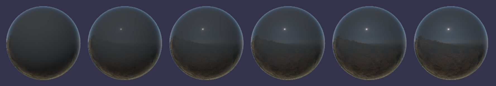
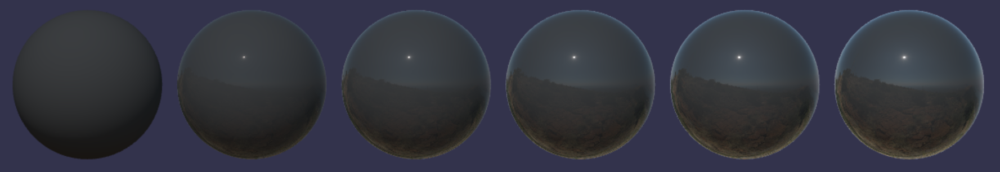
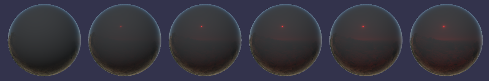
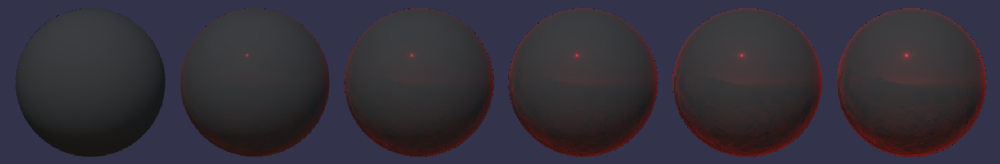
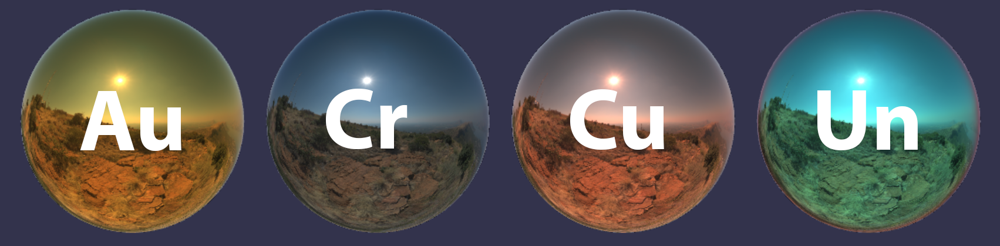
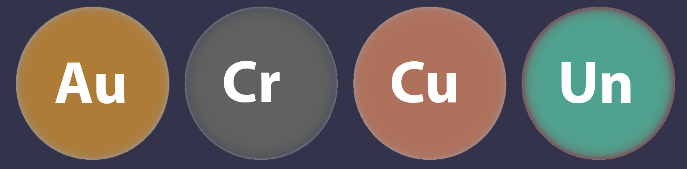
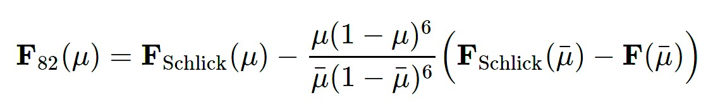

# EXT\_materials\_specular\_openpbr

## Contributors

- Mike Bond, Adobe, [@miibond](https://github.com/MiiBond)

## Status

Draft

## Dependencies

Written against the glTF 2.0 spec.
Must be defined as a sub-extension under the `KHR_materials_specular`

## Exclusions

- This extension must not be used on a material that also uses `KHR_materials_pbrSpecularGlossiness`.
- This extension must not be used on a material that also uses `KHR_materials_unlit`.

## Overview

Specular reflectance in glTF as defined by `KHR_materials_specular`  behaves a bit different than in OpenPBR. This extension defines an interpretation of the specular parameters that is compatible with OpenPBR's specular reflectance for both dielectrics and metals.

This extension adds no additional parameters. Its presence merely changes how the parameters of `KHR_materials_specular` are used.

## Extending Materials

The `EXT_materials_specular_openpbr` extension must be added to any existing instance of `KHR_materials_specular` to convert the material from glTF's specular model to that of OpenPBR's.

```json
{
    "materials": [
        {
            "extensions": {
                "KHR_materials_specular": {
                    "specularFactor": 1.0,
                    "specularColorFactor": [1.0, 1.0, 1.0],
                    "extensions": {
                        "EXT_materials_specular_openpbr": {
                        }
                    }
                }
            }
        }
    ]
}
```

The specular factor (i.e. stregnth) and specular color are defined and combined with the texture properties the same way they are in `KHR_materials_specular`. The difference will be in how the specular colour is applied to the material.

## OpenPBR's Specular Model

Whereas `KHR_materials_specular` only applies to dielectric materials (i.e. non-metals), this extension will also affect conductors (i.e. metals).

### Dielectrics

In `KHR_materials_specular`, the specular color is applied only to reflectance at normal incidence (i.e. F0). In OpenPBR, this will be applied at all angles of incidence.

```
dielectric_brdf =
  fresnel_mix(
    spec_color = specularColor.rgb,
    ior = 1.5,
    weight = specular,
    base = diffuse_brdf(color = baseColor),
    layer = specular_brdf(α = roughness^2))
```

The `fresnel_mix` function mixes two BSDFs according to a Fresnel term. The `layer` is weighted with `weight * fresnel(ior)`. The `base` is weighted with `1 - weight * fresnel(ior)`. This differs from `KHR_materials_specular` only in that the fresnel term does not take specular color into account. The specular color is then applied to the specular lobe at the end, thereby coloring the entire specular lobe rather than just F0.

The following images show specular color increasing from [0,0,0] to [1,1,1] for `KHR_materials_specular` and for this new extension.

#### Previous glTF

#### OpenPBR


Here is the same comparison for colored specular, increasing from [0,0,0] to [1,0,0] (bottom).

#### Previous glTF

#### OpenPBR


The specular color factor is allowed to be set to values greater than [1, 1, 1]. Thus, the reflection amount can go beyond what is determined by the index of refraction (IOR). To still ensure energy conservation, the product of specular color factor, specular color texture, and f0 reflectance from IOR is clamped to 1. Please refer to [Implementation](#Implementation) for an example on where to place the clamping operation.

### Conductors

In OpenPBR, metals use the [F82 reflectance model](https://academysoftwarefoundation.github.io/OpenPBR/index.html#model/basesubstrate/metal) (see also the Adobe Standard Material [technical specifications](https://helpx.adobe.com/content/dam/substance-3d/general-knowledge/asm/Adobe%20Standard%20Material%20-%20Technical%20Documentation%20-%20May2023.pdf)).  This allows the specular color to be applied at grazing angles to simulate metals with complex IOR's. Many real-world metals exhibit dips in brightness or sublte hue changes at grazing angles.

Here are three real-world metals and one made up, "Unobtainium", to demonstrate the edge-coloring.


For real-world metals, the effect can be hard to see. To make it more visible, here are the results of rendering in a white furnace.


This model adds an extra term to the Schlick approximation to accomplish this. If `μ` is the cosine of the incident angle and `μ¯` is `cos(82) ~= 1/7`. `F(μ¯)` is the specular color at F82:

From the OpenPBR specs:


## Implementation

*This section is non-normative.*

[Appendix B](https://www.khronos.org/registry/glTF/specs/2.0/glTF-2.0.html#appendix-b-brdf-implementation) defines the function `fresnel_mix`. In this extension, apply this function to the dielectric lobe only and we add two additional arguments called `weight` and `specular_color`.

```
function fresnel_mix(specular_color, ior, weight, base, layer) {
  f0 = ((1-ior)/(1+ior))^2
  f0 = min(f0, float3(1.0))
  fr = f0 + (1 - f0)*(1 - abs(VdotH))^5
  return (1 - weight * fr) * base + weight * fr * specular_color * layer
}
```

Note that the specular color is being applied to the entire lobe, rather than only for F0.

For the metals, we will define a different function. `F0` is the base color of the material and `specular_color` is the specular color defined by this extension.

```
function fresnel_f82(specular_color, weight, F0, roughness) {
    const cos_theta_max = 0.142857143; // 1/7
    const one_minus_cos_theta_max_to_the_fifth = 0.462664366; // (1 - cos_theta_max)^5
    const one_minus_cos_theta_max_to_the_sixth = 0.396569457; // (1 - cos_theta_max)^6
    vec3 white_minus_F0 = 1 - F0;
    vec3 b_numerator = (F0 + white_minus_F0 * one_minus_cos_theta_max_to_the_fifth) * (1 - specular_color * weight);
    const b_denominator = cos_theta_max * one_minus_cos_theta_max_to_the_sixth;
    const b_denominator_reciprocal = 1.0 / b_denominator;
    vec3 b = b_numerator * b_denominator_reciprocal; // analogous to "a" in the "Fresnel Equations Considered Harmful" slides
    cos_theta = max(roughness, NdotV);
    one_minus_cos_theta = 1.0 - cos_theta;
    vec3 offset_from_F0 = (white_minus_F0 - b * cos_theta * one_minus_cos_theta) * pow(one_minus_cos_theta, 5.0);
    return clamp(F0 + offset_from_F0, 0.0, 1.0);
}
```

## Interaction with other extensions

`EXT_materials_specular_openpbr` has the same interactions as `KHR_materials_specular`.

## Schema

- [material.EXT_materials_specular_openpbr.schema.json](schema/material.EXT_materials_specular_openpbr.schema.json)
