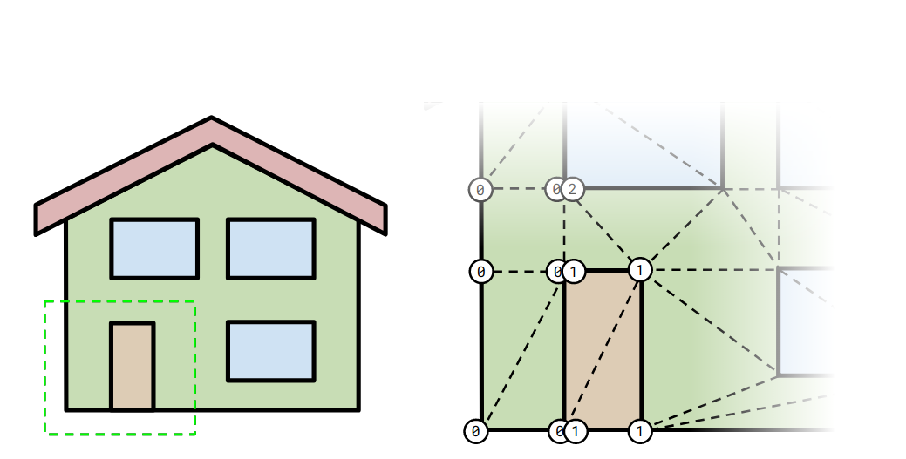
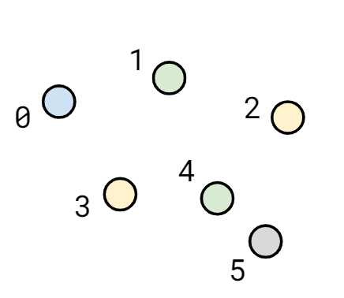
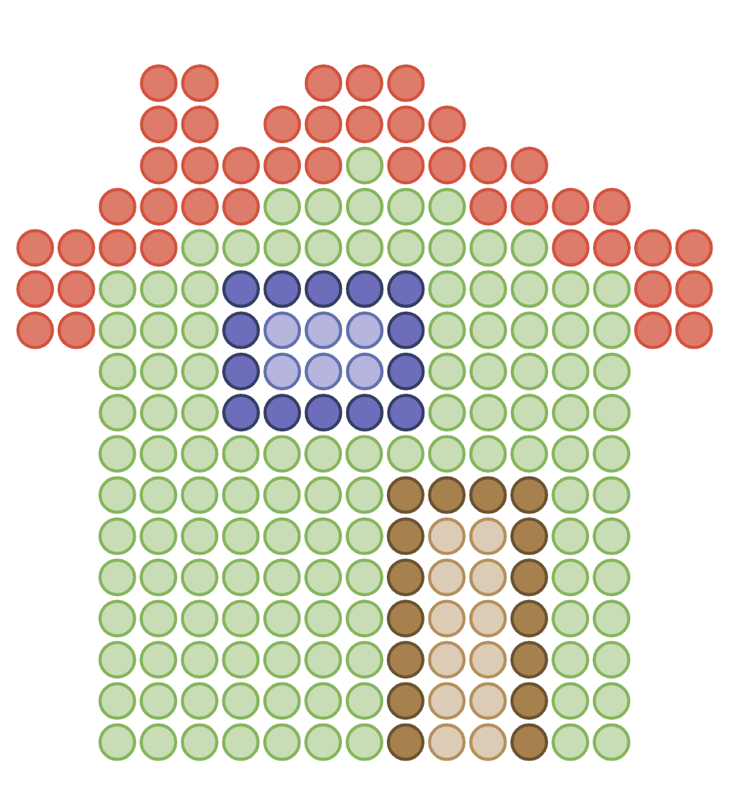
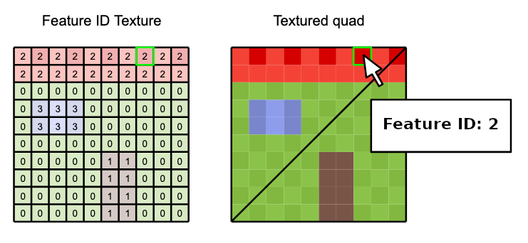

<!-- omit in toc -->
# EXT_mesh_features

<!-- omit in toc -->
## Contributors

* Peter Gagliardi, Cesium
* Sean Lilley, Cesium
* Sam Suhag, Cesium
* Don McCurdy, Independent
* Marco Hutter, Cesium
* Bao Tran, Cesium
* Samuel Vargas, Cesium
* Patrick Cozzi, Cesium

<!-- omit in toc -->
## Status

Draft

<!-- omit in toc -->
## Dependencies

Written against the glTF 2.0 specification.

<!-- omit in toc -->
## Table of Contents

- [Overview](#overview)
- [Feature IDs](#feature-ids)
  - [Overview](#overview-1)
  - [Feature ID by Vertex](#feature-id-by-vertex)
  - [Feature ID by Texture Coordinates](#feature-id-by-texture-coordinates)
  - [Specifying Feature IDs](#specifying-feature-ids)
    - [Referencing Property Tables with Feature IDs](#referencing-property-tables-with-feature-ids)
    - [Referencing External Resources with Feature IDs](#referencing-external-resources-with-feature-ids)
- [Optional vs. Required](#optional-vs-required)
- [Schema](#schema-1)
- [Examples](#examples)
- [Revision History](#revision-history)

## Overview

This extension defines a means of assigning identifiers to geometry and subcomponents of geometry within a glTF 2.0 asset.

In most realtime 3D contexts, performance requirements demand minimizing the number of nodes and meshes in an asset. These requirements compete with interactivity, as applications may wish to merge static objects while still supporting interaction or inspection on those objects. Common performance optimizations for GPU rendering — like merging geometry or GPU instancing to reduce CPU overhead — may destroy references to distinct objects, their attributes, and their behaviors.

By defining a representation of conceptual objects ("features") distinct from rendered geometry, this extension allows applications to preserve important details of 3D assets for inspection and interaction without compromising runtime performance and draw calls.

See [Examples](#examples) for a more detailed list of use cases for this extension.


## Feature IDs

### Overview

A **feature** is a conceptual object associated with both geometry and properties. Similar concepts exist in various industries and domains. In Geographic Information Systems (GIS) a feature is an entity such as a point, polyline, or polygon that represents some element on a map. In another domain like CAD/BIM, a feature might be a component of a design model, such as a pipe. A feature could also be a 3D building in a city, a tree in a forest, a sample point in a weather model, or a patch of texels on a 3D asset.

Features are identified within a 3D asset by **Feature IDs** (unique identifiers) associated with parts of the asset in one of two ways:

* **Feature ID by Vertex:** Per-vertex ID, in a vertex attribute or derived from the vertex index
* **Feature ID by Texture Coordinates:** Per-texel ID, in a texture channel

### Feature ID by Vertex

*Defined in [mesh.primitive.EXT_mesh_features.schema.json](./schema/mesh.primitive.EXT_mesh_features.schema.json) and [featureIdAttribute.schema.json](./schema/featureIdAttribute.schema.json).*

Per-vertex feature IDs may be defined explicitly in a vertex attribute accessor.

Names of feature ID attribute semantics follow the naming convention `_FEATURE_ID_n` where `n` must start with 0 and continue with consecutive positive integers: `_FEATURE_ID_0`, `_FEATURE_ID_1`, etc. Indices must not use leading zeroes to pad the number of digits (e.g., `_FEATURE_ID_01` is not allowed).

The attribute's accessor `type` must be `"SCALAR"` and `normalized` must be false. The accessor's `componentType` is not restricted.

> **Implementation note:** Because glTF accessors do not support `UNSIGNED_INT` types for 32-bit integers in vertex attributes, `FLOAT` may be used instead allowing integer feature IDs up to 2<sup>24</sup>. For smaller ranges of feature IDs, `UNSIGNED_BYTE` or `UNSIGNED_SHORT` may be used. As with other vertex attributes, each element of a feature ID accessor must align to 4-byte boundaries.

> **Implementation note:** For a primitive with feature ID attributes, points in the interior of a triangle or line segment should be considered to belong to the feature associated with the nearest vertex.

> **Example:** A primitive defines two quads, where each quad is a distinct feature. The quads are composed of four vertices, distinguished by different `_FEATURE_ID_0` vertex attribute values.
>
> Note that the `attribute` value is a set index `n` that refers to the `_FEATURE_ID_n` vertex attribute semantic. For example, `"attribute": 0` corresponds to `_FEATURE_ID_0`.
>
> 
>
> ```jsonc
> {
>   "primitives": [
>     {
>       "attributes": {
>         "POSITION": 0,
>         "_FEATURE_ID_0": 1
>       },
>       "indices": 2,
>       "mode": 4,
>       "extensions": {
>         "EXT_mesh_features": {
>           "featureIds": [ {
>             "featureCount": 2,
>             "attribute": 0
>           } ]
>         }
>       }
>     }
>   ]
> }
> ```

### Feature ID by Texture Coordinates

*Defined in [mesh.primitive.EXT_mesh_features.schema.json](./schema/mesh.primitive.EXT_mesh_features.schema.json) and [featureIdTexture.schema.json](./schema/featureIdTexture.schema.json).*

Feature ID textures classify the pixels of an image into different features. Some use cases include image segmentation or marking regions on a map. Often per-texel feature IDs provide finer granularity than per-vertex feature IDs, as in the example below.

> **Example:** A building facade, represented by a single quad. The primitive's `baseColorTexture` displays the visible appearance of the building, and its feature ID texture identifies regions of the quad (walls, door, roof, window) as distinct features. Both textures use the same texture coordinates, `TEXCOORD_0`, in this example.
>
> 
>
> ```jsonc
> {
>   "primitives": [
>     {
>       "attributes": {
>         "POSITION": 0,
>         "TEXCOORD_0": 1
>       },
>       "indices": 2,
>       "material": 0,
>       "extensions": {
>         "EXT_mesh_features": {
>           "featureIds": [ {
>             "featureCount": 4,     
>             "texture" : {
>               "index": 0, 
>               "texCoord": 0, 
>               "channels": [0, 1]
>             }
>           } ]
>         }
>       }
>     }
>   ]
> }
> ```

A `featureId` pointing to a feature ID texture extends the glTF [`textureInfo`](../../../../specification/2.0/schema/textureInfo.schema.json) object. The `channels` array contains non-negative integer values corresponding to channels of the source texture that the feature ID consists of. Channels of an `RGBA` texture are numbered 0–3 respectively, although specialized texture formats may allow additional channels. The values from the selected channels are treated as unsigned 8 bit integers, and represent the bytes of the actual feature ID, in little-endian order. 

> **Example:** 
> If a feature ID defines `"channels": [0, 1]`, then the actual feature ID can be computed as `id = channel[0] | (channel[1] << 8);`. 
> If a feature ID defines `"channels": [1, 0, 2]`, then the actual feature ID can be computed as `id = channel[1] | (channel[0] << 8) | (channel[2] << 16);`.

Texture filtering must be `9728` (NEAREST), or undefined, for any texture object referenced as a feature ID texture.


### Specifying Feature IDs

A primitive or node may specify multiple feature IDs using one or more of the methods above. With multiple feature IDs, an asset might (for example) identify features at different levels of abstraction: per-vertex feature IDs for individual buildings, and per-texel feature IDs for parts of each building.

Each feature ID definition may include only a single source, so the following are mutually exclusive:

- `featureId.attribute` for a Feature ID Attribute
- `featureId.texture` for a Feature ID Texture

Primitives may contain `featureIds` entries for vertex attribute and texture-based feature IDs.

#### Referencing Property Tables with Feature IDs

When combined with the `EXT_structural_metadata` extension, feature IDs can be associated with property tables. A property table maps each feature ID to a set of values that are associated with the respective feature. The feature ID in this case serves as an _index_ for the row of the table. The the index of the property table that a certain set of feature IDs is associated with is stored in the `propertyTable` of the feature ID definition.

> **Example:** This example assumes that an array of property tables is defined in the asset, using the `EXT_structural_metadata` extension. The example shows a primitive with multiple feature ID set. The first one uses a feature ID texture that contains 4 different features. The second one is defined via an attribute, and defines 2 different features. The first ID is associated with the property table with index 1. The second one is associated with the property table with index 0. 
>
> ```jsonc
> // Primitive:
> "extensions": {
>   "EXT_mesh_features": {
>     "featureIds": [ {
>       "featureCount": 4,     
>       "texture" : {
>         "index": 0, 
>         "texCoord": 0, 
>         "channels": [0]
>       }, 
>       "propertyTable": 1
>     }, {
>       "featureCount": 2,
>       "attribute": 0,
>       "propertyTable": 0
>     } ]
>   }
> }
> ```

#### Referencing External Resources with Feature IDs

Feature IDs may identify features for use in other extensions or in custom applications. Use cases for these IDs could include identifying features for styling or picking, or looking up metadata externally in a REST API or database.

> 

## Optional vs. Required

This extension is optional, meaning it should be placed in the `extensionsUsed` list, but not in the `extensionsRequired` list.

## Schema

* [mesh.primitive.EXT_mesh_features.schema.json](./schema/mesh.primitive.EXT_mesh_features.schema.json)

## Examples

_This section is non-normative_

The examples below shows the breadth of possible use cases for this extension.

Example|Description|Image
--|--|--
Triangle mesh|Feature IDs are assigned to each vertex to distinguish components of a building.|
Per-point feature IDs|A feature ID is assigned to each point of a point cloud.|
Multi-point features|A point cloud where groups of points are associated with different feature IDs.|
Material classification|A textured mesh using a feature ID texture.|

## Revision History

* **Version 0.0.0** December 4, 2020
  * Initial draft
* **Version 1.0.0** February 24, 2021
  * Changes to class properties
    * Removed `FLOAT16` type
    * Removed `BLOB` type
    * Added `ENUM` to the list of supported types and component types and added `enumType` to refer to the chosen enum
    * `min` and `max` are now numbers instead of single-element arrays for non-`ARRAY` properties
  * Changes to property table
    * Removed `offsetBufferViews`, replaced with `arrayOffsetBufferView` and `stringOffsetBufferView`
    * Removed `blobByteLength`
    * Removed `stringByteLength`
    * Removed `name` and `description`
    * Removed `elementCount` and redefined `count` to mean the element count
    * Added optional `semantic` property
  * Changes to feature ID attribute
    * Removed `vertexStride` and `instanceStride`
    * Added `divisor` for incrementing feature IDs at fixed intervals, e.g. per-triangle or per-quad
  * Changes to `EXT_feature_metadata` object
    * Removed `classes` dictionary. Classes and enums are now contained in the `schema` object.
    * Added `schema` and `schemaUri`. The schema object contains class and enum definitions. `schemaUri` refers to an external schema JSON file. `schema` and `schemaUri` are mutually exclusive.
    * Added optional `statistics` object which provides aggregate information about select properties within the model
  * Other changes
    * Added `EXT_feature_metadata` extension to the [`EXT_mesh_gpu_instancing`](../EXT_mesh_gpu_instancing) extension for assigning metadata to instances
* **Version 2.0.0** September 2021
  * Renamed extension from `EXT_feature_metadata` to `EXT_mesh_features`
  * Renamed `constant` to `offset`, and `divisor` to `repeat`
  * Removed `statistics` specification, to be considered as a future extension
  * Renamed `featureTable` to `propertyTable` and `featureTexture` to `propertyTexture`
  * Removed `featureIdAttributes` and `featureIdTextures`, replaced with `featureIds`
    * Primitives and Nodes may now have feature IDs without associated property tables
  * Removed string ID references to property tables and textures, replaced with integer IDs
  * Removed `optional` and added `required`. Properties are now assumed to be optional unless `required` is true.
  * Added `noData` for specifying a sentinel value that indicates missing data
  * Removed `default`
  * Feature ID values outside the range `[0, count - 1]` now indicate "no associated feature"
  * `NaN` and `Infinity` are now explicitly disallowed as property values
  * Binary alignment, offset, and padding changes:
    * Byte offsets for buffer views in a GLB-stored BIN chunk are no longer different from the core glTF specification
    * Relaxed buffer view alignment to component size, rather than strict 8-byte boundaries
  * Renamed `_FEATURE_ID_#` to `FEATURE_ID_#`
  * Added vector and matrix types: `VEC2`, `VEC3`, `VEC4`, `MAT2`, `MAT3`, `MAT4`
  * Refactored `type` and `componentType` to avoid overlap. Properties that store a single value now have a `type` of `SINGLE` and a `componentType` of the desired type (e.g. `type: "SINGLE", componentType: "UINT8"`)
  * Class IDs, enum IDs, and property IDs must now contain only alphanumeric and underscore characters
  * Clarified that nodes with GPU instancing cannot reference property textures
  * For GPU instance metadata, the `EXT_mesh_features` extension is now scoped to the `node` extensions instead of nesting inside the `EXT_mesh_gpu_instancing` extension.
  * Split `offsetType` into `arrayOffsetType` and `stringOffsetType`
  * Refactored the property texture schema so it is now a glTF `textureInfo` object.
  * Each property texture now contains only a single texture
  * Property textures are now assumed to be in linear space, and must use nearest or linear filtering
  * Added a `schema.id` property
* **Version 3.0.0** February 2022
  * Elements in the property texture `properties` dictionary are now objects containing a `channels` property rather than an array of channels directly.
  * Split the `EXT_mesh_features` extension into one that only defines the concept of feature IDs, and a separate `EXT_structural_metadata` extension that allows associating the features with metadata, including the following changes:
    * Renamed `FEATURE_ID_#` back to `_FEATURE_ID_#`
    * Removed the "Implicit Feature IDs" concept


