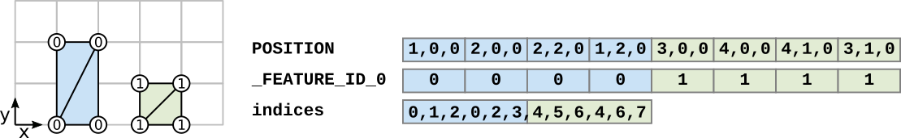

# EXT_mesh_features

## Contributors

* Peter Gagliardi, Cesium
* Sean Lilley, Cesium
* Sam Suhag, Cesium
* Don McCurdy, Independent
* Marco Hutter, Cesium
* Bao Tran, Cesium
* Samuel Vargas, Cesium
* Patrick Cozzi, Cesium

## Status

Draft

## Dependencies

Written against the glTF 2.0 specification.

## Optional vs. Required

This extension is optional, meaning it should be placed in the `extensionsUsed` list, but not in the `extensionsRequired` list.

## Overview

This extension defines a means of assigning identifiers to geometry and subcomponents of geometry within a glTF 2.0 asset.

In most realtime 3D contexts, performance requirements demand minimizing the number of nodes and meshes in an asset. These requirements compete with interactivity, as applications may wish to merge static objects while still supporting interaction or inspection on those objects. Common performance optimizations for GPU rendering — like merging geometry or GPU instancing to reduce CPU overhead — may destroy references to distinct objects, their attributes, and their behaviors.

By defining a representation of conceptual objects ("features") distinct from rendered geometry, this extension allows applications to preserve important details of 3D assets for inspection and interaction without compromising runtime performance and draw calls.

### Features

A **feature** is a conceptual object in a virtual environment. Similar concepts exist in various industries and domains. In Geographic Information Systems (GIS) a feature is an entity such as a point, polyline, or polygon that represents some element on a map. In another domain like CAD/BIM, a feature might be a component of a design model, such as a pipe. A feature could also be a 3D building in a city, a tree in a forest, a sample point in a weather model, or a patch of texels on a 3D asset.

### Feature IDs

*Defined in [mesh.primitive.EXT_mesh_features.schema.json](./schema/mesh.primitive.EXT_mesh_features.schema.json) and [featureId.schema.json](./schema/featureId.schema.json)*

Features are identified within a 3D asset by **Feature IDs**. A mesh primitive may specify multiple sets of feature IDs. These feature ID sets might (for example) identify features at different levels of abstraction: there may be feature IDs that identify individual buildings, and feature IDs that identify different parts of each building.

Each feature ID set is defined as a set of values that are associated with the conceptual parts of the model. The definition of the feature ID set may include a `nullFeatureId`, which is a value that indicates that a certain part is not considered to be an identifiable object. The definition also includes a `featureCount` value, which is the number of unique features that are identified.

The feature ID set may also include a `label`, an alphanumeric string used to identify feature ID sets across different glTF primitives. Labels must match the regular expression `^[a-zA-Z_][a-zA-Z0-9_]*$`.

Feature IDs can be associated with parts of a model in one of three ways:

* **Feature ID by Vertex:** Feature IDs that are stored as a vertex attribute, using a standard glTF accessor. The `featureId.attribute` refers to this accessor, and allows defining feature IDs for each individual vertex.
* **Feature ID by Texture Coordinates:** Feature IDs that are stored in the channels of a standard glTF texture. The `featureId.texture` refers to this texture, and allows defining feature IDs for regions on the surface of a mesh.
* **Feature ID by Index**: Feature IDs that are assigned implicitly to the vertices. In this case, the feature ID is given by the index of the vertex.

These concepts are explained in more detail in the following sections.

#### Feature ID by Vertex

*Defined [featureIdAttribute.schema.json](./schema/featureIdAttribute.schema.json).*

Per-vertex feature IDs are defined in a vertex attribute accessor.

Names of feature ID attribute semantics follow the naming convention `_FEATURE_ID_n` where `n` must start with 0 and continue with consecutive positive integers: `_FEATURE_ID_0`, `_FEATURE_ID_1`, etc. Indices must not use leading zeroes to pad the number of digits (e.g., `_FEATURE_ID_01` is not allowed).

The attribute's accessor `type` must be `"SCALAR"` and `normalized` must be false. The accessor's `componentType` is not restricted.

> **Implementation note:** Because glTF accessors do not support `UNSIGNED_INT` types for 32-bit integers in vertex attributes, `FLOAT` may be used instead allowing integer feature IDs up to 2<sup>24</sup>. For smaller ranges of feature IDs, `UNSIGNED_BYTE` or `UNSIGNED_SHORT` may be used. As with other vertex attributes, each element of a feature ID accessor must align to 4-byte boundaries.

> **Implementation note:** For a primitive with feature ID attributes, points in the interior of a triangle or line segment should be considered to belong to the feature associated with the nearest vertex.

Per-vertex feature IDs can be used to identify individual objects that have been combined into a single mesh primitive, as shown in the example below.

> **Example:** A primitive defines two quads, where each quad is a distinct feature. The quads are composed of four vertices, distinguished by different `_FEATURE_ID_0` vertex attribute values.
>
> Note that the `attribute` value is a set index `n` that refers to the `_FEATURE_ID_n` vertex attribute semantic. For example, `"attribute": 0` corresponds to `_FEATURE_ID_0`.
>
> 
>
> ```jsonc
> {
>   "primitives": [
>     {
>       "attributes": {
>         "POSITION": 0,
>         "_FEATURE_ID_0": 1
>       },
>       "indices": 2,
>       "mode": 4,
>       "extensions": {
>         "EXT_mesh_features": {
>           "featureIds": [{
>             "featureCount": 2,
>             "attribute": 0
>           }]
>         }
>       }
>     }
>   ]
> }
> ```

#### Feature ID by Texture Coordinates

*Defined in [featureIdTexture.schema.json](./schema/featureIdTexture.schema.json).*

Feature ID textures classify the pixels of an image into different features. Some use cases include image segmentation or marking regions on a map. Often per-texel feature IDs provide finer granularity than per-vertex feature IDs, as in the example below.

> **Example:** A building facade, represented by a single quad. The primitive's `baseColorTexture` displays the visible appearance of the building, and its feature ID texture identifies regions of the quad (door, roof, window) as distinct features. Both textures use the same texture coordinates, `TEXCOORD_0`, in this example. Texels assigned `nullFeatureId` do not belong to a feature. 
>
> 
>
> ```jsonc
> {
>   "primitives": [
>     {
>       "attributes": {
>         "POSITION": 0,
>         "TEXCOORD_0": 1
>       },
>       "indices": 2,
>       "material": 0,
>       "extensions": {
>         "EXT_mesh_features": {
>           "featureIds": [{
>             "nullFeatureId": 0,
>             "featureCount": 3,    
>             "texture" : {
>               "index": 0, 
>               "texCoord": 0, 
>               "channels": [0]
>             }
>           }]
>         }
>       }
>     }
>   ]
> }
> ```

The `texture` object of a `featureId` extends the glTF [`textureInfo`](../../../../specification/2.0/schema/textureInfo.schema.json) object. The `channels` array contains non-negative integer values corresponding to channels of the source texture that the feature ID consists of. Channels of an `RGBA` texture are numbered 0–3 respectively, although specialized texture formats may allow additional channels. 

The values from the selected channels are treated as unsigned 8 bit integers, and represent the bytes of the actual feature ID, in little-endian order. 

> **Example:** 
> If a `featureID.texture` defines `"channels": [0, 1]`, then the actual feature ID can be computed as `id = channel[0] | (channel[1] << 8)`. 
> If a `featureID.texture` defines `"channels": [1, 0, 2]`, then the actual feature ID can be computed as `id = channel[1] | (channel[0] << 8) | (channel[2] << 16)`.

Texture filtering must be `9728` (NEAREST), or undefined, for any texture object referenced as a feature ID texture. Texture values must be encoded with a linear transfer function.

#### Feature ID by Index

When both `featureId.attribute` and `featureId.texture` are undefined, then the feature ID value for each vertex is given implicitly, via the index of the vertex. In this case, the `featureCount` must match the number of vertices of the mesh primitive. 


### Using Feature IDs

The feature ID sets that are associated with mesh primitives can be accessed by client applications, and can be used to look up addition information that is associated with these features. Two possible ways of associating features with additional information are presented here.

#### Referencing Property Tables with Feature IDs

When combined with the [`EXT_structural_metadata`](../EXT_structural_metadata/) extension, feature ID sets can be associated with property tables. A property table maps each feature ID to a set of values that are associated with the respective feature. The feature ID in this case serves as an _index_ for the row of the table. The index of the property table that a certain set of feature IDs is associated with is stored in the `propertyTable` of the feature ID set definition.

> **Example:** This example assumes that an array of property tables is defined in the asset, using the `EXT_structural_metadata` extension. The example shows a primitive with multiple feature ID sets. The first one uses a feature ID texture that contains 4 different features. The second one is defined via a vertex attribute, and defines 2 different features. The first ID set is associated with the property table with index 1. The second one is associated with the property table with index 0. 
>
> ```jsonc
> // Primitive:
> "extensions": {
>   "EXT_mesh_features": {
>     "featureIds": [
>       {
>         "featureCount": 4,     
>         "texture" : {
>           "index": 0, 
>           "texCoord": 0, 
>           "channels": [0]
>         }, 
>         "propertyTable": 1,
>         "label": "classification"
>       },
>       {
>         "featureCount": 2,
>         "attribute": 0,
>         "propertyTable": 0,
>         "label": "components"
>       }
>     ]
>   }
> }
> ```

#### Referencing External Resources with Feature IDs

Feature IDs may identify features for use in other extensions or in custom applications. Use cases for these IDs could include identifying features for styling or picking, or looking up metadata externally in a REST API or database.

> 

## Schema

* [mesh.primitive.EXT_mesh_features.schema.json](./schema/mesh.primitive.EXT_mesh_features.schema.json)
* [featureId.schema.json](./schema/featureId.schema.json)
* [featureIdAttribute.schema.json](./schema/featureIdAttribute.schema.json)
* [featureIdTexture.schema.json](./schema/featureIdTexture.schema.json)

## Revision History

The revision history of this extension can be found in the [common revision history of the 3D Tiles Next extensions](https://github.com/CesiumGS/3d-tiles/blob/main/next/REVISION_HISTORY.md).
