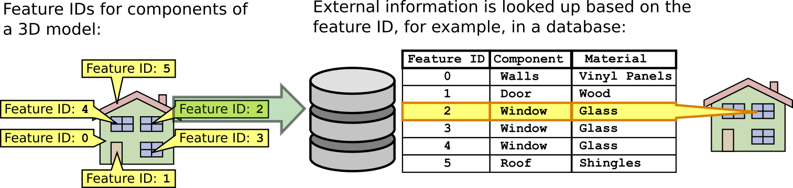

<!-- omit in toc -->
# EXT_mesh_features

<!-- omit in toc -->
## Contributors

* Peter Gagliardi, Cesium
* Sean Lilley, Cesium
* Sam Suhag, Cesium
* Don McCurdy, Independent
* Marco Hutter, Cesium
* Bao Tran, Cesium
* Samuel Vargas, Cesium
* Patrick Cozzi, Cesium

<!-- omit in toc -->
## Status

Draft

<!-- omit in toc -->
## Dependencies

Written against the glTF 2.0 specification.

Optionally, this extension may be used in conjunction with [`EXT_mesh_gpu_instancing`](../EXT_mesh_gpu_instancing). When used together, certain GPU instance attributes defined by `EXT_mesh_gpu_instancing` are used as [instance feature IDs](#feature-id-by-gpu-instance).

<!-- omit in toc -->
## Table of Contents

- [Overview](#overview)
- [Feature IDs](#feature-ids)
  - [Overview](#overview-1)
  - [Feature ID by Vertex](#feature-id-by-vertex)
    - [Vertex Attribute](#vertex-attribute)
    - [Implicit Vertex Attribute](#implicit-vertex-attribute)
  - [Feature ID by Texture Coordinates](#feature-id-by-texture-coordinates)
  - [Feature ID by GPU Instance](#feature-id-by-gpu-instance)
  - [Specifying Feature IDs](#specifying-feature-ids)
- [Feature Properties](#feature-properties)
  - [Overview](#overview-2)
  - [Schema Definitions](#schema-definitions)
    - [Overview](#overview-3)
    - [Schema](#schema)
    - [Class](#class)
    - [Class Property](#class-property)
    - [Enum](#enum)
    - [Enum Value](#enum-value)
  - [Property Tables](#property-tables)
  - [Property Textures](#property-textures)
- [Binary Data Storage](#binary-data-storage)
- [Optional vs. Required](#optional-vs-required)
- [Schema](#schema-1)
- [Examples](#examples)
- [Revision History](#revision-history)

## Overview

This extension defines a means of storing structured metadata associated with geometry and subcomponents of geometry within a glTF 2.0 asset.

In most realtime 3D contexts, performance requirements demand minimizing the number of nodes and meshes in an asset. These requirements compete with interactivity, as applications may wish to merge static objects while still supporting interaction or inspection on those objects. Common performance optimizations for GPU rendering — like merging geometry or GPU instancing to reduce CPU overhead — may destroy references to distinct objects, their attributes, and their behaviors.

By defining a representation of conceptual objects ("features") distinct from rendered geometry, and a means of associating structured metadata ("properties") with those features, this extension allows applications to preserve important details of 3D assets for inspection and interaction without compromising runtime performance and draw calls.

Concepts and terminology used throughout this document refer to the [3D Metadata Specification](https://github.com/CesiumGS/3d-tiles/tree/main/specification/Metadata), which should be considered a normative reference for definitions and requirements. This document provides inline definitions of terms where appropriate.

See [Examples](#examples) for a more detailed list of use cases for this extension.

> **Disambiguation:** glTF has other methods of storing details that could similarly be described as metadata or properties, including [`KHR_xmp_json_ld`](../../Khronos/KHR_xmp_json_ld), Extras, and Extensions. While those methods associate data with discrete objects in a glTF asset — nodes, materials, etc. — `EXT_mesh_features` is uniquely suited for properties of more granular conceptual features in subregions composed of vertices or texels.

## Feature IDs

### Overview

A **feature** is a conceptual object associated with both geometry and properties. Similar concepts exist in various industries and domains. In Geographic Information Systems (GIS) a feature is an entity such as a point, polyline, or polygon that represents some element on a map. In another domain like CAD/BIM, a feature might be a component of a design model, such as a pipe. A feature could also be a 3D building in a city, a tree in a forest, a sample point in a weather model, or a patch of texels on a 3D asset.

Features are identified within a 3D asset by **Feature IDs** (unique identifiers) associated with parts of the asset in one of three ways:

* **Feature ID by Vertex:** Per-vertex ID, in a vertex attribute or derived from the vertex index
* **Feature ID by Texture Coordinates:** Per-texel ID, in a texture channel
* **Feature ID by GPU Instance:** Per-instance ID, in an instance attribute (requires [`EXT_mesh_gpu_instancing`](../EXT_mesh_gpu_instancing))

### Feature ID by Vertex

#### Vertex Attribute

*Defined in [mesh.primitive.EXT_mesh_features.schema.json](./schema/mesh.primitive.EXT_mesh_features.schema.json) and [featureIdAttribute.schema.json](./schema/featureIdAttribute.schema.json).*

Per-vertex feature IDs may be defined explicitly in a vertex attribute accessor.

Names of feature ID attribute semantics follow the naming convention `FEATURE_ID_n` where `n` must start with 0 and continue with consecutive positive integers: `FEATURE_ID_0`, `FEATURE_ID_1`, etc. Indices must not use leading zeroes to pad the number of digits (e.g., `FEATURE_ID_01` is not allowed).

When associated with a [property table](#property-tables), values of feature IDs are non-negative integers in the range `[0, count - 1]` (inclusive), where `count` is the total number of features in the property table. Values outside this range indicate that no feature is associated. Feature IDs may be provided without an associated property table, in which case the property value lookup method and range of valid IDs are undefined.

The attribute's accessor `type` must be `"SCALAR"` and `normalized` must be false. The accessor's `componentType` is not restricted.

> **Implementation note:** Because glTF accessors do not support `UNSIGNED_INT` types for 32-bit integers in vertex attributes, `FLOAT` may be used instead allowing integer feature IDs up to 2<sup>24</sup>. For smaller ranges of feature IDs, `UNSIGNED_BYTE` or `UNSIGNED_SHORT` may be used. As with other vertex attributes, each element of a feature ID accessor must align to 4-byte boundaries.

> **Implementation note:** For a primitive with feature ID attributes, points in the interior of a triangle or line segment should be considered to belong to the feature associated with the nearest vertex.

> **Example:** A primitive defines two quads, where each quad is a distinct feature. The quads are composed of four vertices, distinguished by different `FEATURE_ID_0` vertex attribute values. Each feature is associated with "Name", "Year", and "Coordinates" values in a [property table](#property-tables).
>
> Note that the `attribute` value is a set index `n` that refers to the `FEATURE_ID_n` vertex attribute semantic. For example, `"attribute": 0` corresponds to `FEATURE_ID_0`.
>
> 
>
> ```jsonc
> {
>   "primitives": [
>     {
>       "attributes": {
>         "POSITION": 0,
>         "FEATURE_ID_0": 1
>       },
>       "indices": 2,
>       "mode": 4,
>       "extensions": {
>         "EXT_mesh_features": {
>           "propertyTables": [0],
>           "featureIds": [{"attribute": 0}]
>         }
>       }
>     }
>   ]
> }
> ```

#### Implicit Vertex Attribute

*Defined in [mesh.primitive.EXT_mesh_features.schema.json](./schema/mesh.primitive.EXT_mesh_features.schema.json) and [featureIdAttribute.schema.json](./schema/featureIdAttribute.schema.json).*

Per-vertex feature IDs may also be defined implicitly, as a function of vertex index within the primitive. Implicit feature IDs reduce storage costs in several common cases, such as when all vertices in a primitive share the same feature ID, or each sequential group of `N` vertices (e.g. each triangle face) share the same feature ID.

Implicit feature IDs are a monotonically increasing function of the vertex index, configured by `offset` and `repeat` parameters:

* `offset` specifies the initial value for the vertex feature ID range. The default is `0`.
* `repeat`, if defined, specifies the number of vertices for which to repeat each feature ID before incrementing the ID by 1. If `repeat` is undefined, the feature ID for all vertices is `offset`.

For example

* If `offset` is 0 or undefined and `repeat` is undefined, the feature IDs are `[0, 0, 0, ...]`
* If `offset` is 0 and `repeat` is 1, the feature IDs are `[0, 1, 2, ...]`
* If `offset` is 0 and `repeat` is 2, the feature IDs are `[0, 0, 1, 1, 2, 2, ...]`
* If `offset` is 2 and `repeat` is 3, the feature IDs are `[2, 2, 2, 3, 3, 3, 4, 4, 4, ...]`
* If `offset` is 2 and `repeat` is undefined, the feature IDs are `[2, 2, 2, ...]`
> **Example:** Each point in the point cloud below represents a distinct feature. Points are identified by feature IDs 0–5. Each point is associated with "Name" and "Elevation" values in a [property table](#property-tables).
>
> 
>
> ```jsonc
> {
>   "primitives": [
>     {
>       "attributes": {
>         "POSITION": 0
>       },
>       "mode": 0,
>       "extensions": {
>         "EXT_mesh_features": {
>           "propertyTables": [0],
>           "featureIds": [{"offset": 0, "repeat": 1}]
>         }
>       }
>     }
>   ]
> }
> ```

### Feature ID by Texture Coordinates

*Defined in [mesh.primitive.EXT_mesh_features.schema.json](./schema/mesh.primitive.EXT_mesh_features.schema.json) and [featureIdTexture.schema.json](./schema/featureIdTexture.schema.json).*

Feature ID textures classify the pixels of an image into different features. Some use cases include image segmentation or marking regions on a map. Often per-texel feature IDs provide finer granularity than per-vertex feature IDs, as in the example below.

> **Example:** A building facade, represented by a single quad. The primitive's `baseColorTexture` displays the visible appearance of the building, and its feature ID texture identifies regions of the quad (walls, door, roof, window) as distinct features. Both textures use the same texture coordinates, `TEXCOORD_0`, in this example. Each feature is associated with "Component" and "Year Built" values in a [property table](#property-tables).
>
> 
>
> ```jsonc
> {
>   "primitives": [
>     {
>       "attributes": {
>         "POSITION": 0,
>         "TEXCOORD_0": 1
>       },
>       "indices": 2,
>       "material": 0,
>       "extensions": {
>         "EXT_mesh_features": {
>           "propertyTables": [0],
>           "featureIds": [
>             {"index": 0, "texCoord": 0, "channel": 0}
>           ]
>         }
>       }
>     }
>   ]
> }
> ```

A `featureId` pointing to a feature ID texture extends the glTF [`textureInfo`](../../../../specification/2.0/schema/textureInfo.schema.json) object. Its `channel` must be a non-negative integer corresponding to a channel of the source texture. Channels of an `RGBA` texture are numbered 0–3 respectively, although specialized texture formats may allow additional channels.

When associated with a [property table](#property-tables), feature ID values stored in a texture are non-negative integers in the range `[0, count - 1]` (inclusive), stored in linear space, where `count` is the total number of features in the property table. Values outside this range indicate that no feature is associated. Feature IDs may be provided without an associated property table, in which case the property value lookup method and range of valid IDs are undefined.

Texture filtering must be `9728` (NEAREST), or undefined, for any texture object referenced as a feature ID texture.

### Feature ID by GPU Instance

*Defined in [node.EXT_mesh_features.schema.json](./schema/node.EXT_mesh_features.schema.json) and [featureIdAttribute.schema.json](./schema/featureIdAttribute.schema.json).*

Feature IDs may also be assigned to individual GPU instances when using the [`EXT_mesh_gpu_instancing`](../EXT_mesh_gpu_instancing) extension. Similar to per-vertex IDs, per-instance IDs are stored in instance attributes or generated implicitly by instance index. Nodes with `EXT_mesh_features` must also define an `EXT_mesh_gpu_instancing` extension, and are invalid without this dependency.

> **Example:** A node defining instances of mesh `0`, with each instance having a feature ID in the `FEATURE_ID_0` instance attribute.
>
> ```jsonc
> {
>   "nodes": [
>     {
>       "mesh": 0,
>       "extensions": {
>         "EXT_mesh_gpu_instancing": {
>           "attributes": {
>             "TRANSLATION": 0,
>             "ROTATION": 1,
>             "SCALE": 2,
>             "FEATURE_ID_0": 3
>           },
>         },
>         "EXT_mesh_features": {
>           "propertyTables": [0],
>           "featureIds": [{"attribute": 0}]
>         }
>       }
>     }
>   ]
> }
> ```

### Specifying Feature IDs

A primitive or node may specify multiple feature IDs using one or more of the methods above. With multiple feature IDs, an asset might (for example) identify features at different levels of abstraction: per-vertex feature IDs for individual buildings, and per-texel feature IDs for parts of each building, with each level of abstraction having its own properties.

Each feature ID definition may include only a single source, so the following are mutually exclusive:

- `featureId.attribute` (for a Feature ID Attribute)
- `featureId.offset` and `featureId.repeat` (for a Feature ID Attribute)
- `featureId.index` (for a Feature ID Texture)

Primitives may contain `featureIds` entries for vertex attribute and texture-based feature IDs, and Nodes may contain `featureIds` entries for GPU instance attributes.

#### Referencing Property Tables with Feature IDs

When feature IDs are associated with property tables, then every `propertyTables` index must have an associated `featureIds` definition. The `propertyTables` entry at index `i` corresponds to the `featureIds` entry at the same index. As a result, the length of the `featureIds` array must be greater than or equal to the length of the `propertyTables` array. Each (`featureId`, `propertyTable`) pair must be unique, but individual feature IDs and property tables may be repeated within a primitive or node.

Empty feature IDs (e.g. `{}`) are disallowed — a feature ID must explicitly set at least one property.

> **Example:** Multiple property tables and feature IDs may be defined on a single primitive.
>
> ```jsonc
> // Primitive:
> "extensions": {
>   "EXT_mesh_features": {
>     "propertyTables": [0, 1, 2],
>     "featureIds": [
>       {"attribute": 0},
>       {"offset": 1},
>       {"index": 0, "texCoord": 0, "channel": 0},
>     ]
>   }
> }
> ```

#### Referencing External Resources with Feature IDs

Feature IDs do not have to be associated with a property table. Without a property table, IDs may identify features for use in other extensions or in custom applications. Use cases for these IDs extend beyond the scope of this extension, but could include identifying features for styling or picking, or looking up metadata externally in a REST API or database.

> 

## Feature Properties

### Overview

Feature properties describe attributes or characteristics of a feature. Classes, defined by a schema, are templates describing the data types and meanings of properties, where each feature is a single instance of that template with specific values. Property values may be associated with features in one of two ways:

- **Property Tables** store property values as numeric arrays in a parallel, column-based binary layout. Property tables are indexed by Feature IDs, used as the index of a given feature into each property array.
- **Property Textures** store property values in channels of a texture, suitable for very high-frequency data mapped to less-detailed 3D surfaces. Property textures are indexed by texture coordinates, and do not have associated Feature IDs.

Both storage formats are appropriate for efficiently transmitting large quantities of property values.

### Schema Definitions

#### Overview

Data types and meanings of properties are provided by a schema, as defined in the [3D Metadata Specification](https://github.com/CesiumGS/3d-tiles/tree/main/specification/Metadata/) and summarized below.

#### Schema

*Defined in [schema.schema.json](./schema/schema.schema.json).*

Top-level definitions for the structure and data types of properties. The schema provides a set of [classes](#class) and [enums](#enum) the asset can reference.

A schema may be embedded in the extension directly or referenced externally with the `schemaUri` property. Multiple glTF assets may refer to the same external schema to avoid duplication. A schema is defined by an `EXT_mesh_features` extension attached to the glTF root object.

> **Example:** A simple schema defining enums and classes.
>
> ```jsonc
> {
>   "extensions": {
>     "EXT_mesh_features": {
>       "schema": {
>         "name": "Schema 001",
>         "description": "An example schema.",
>         "version": "3.5.1",
>         "enums": { ... },
>         "classes": { ... }
>       }
>     }
>   }
> }
> ```

#### Class

*Defined in [class.schema.json](./schema/class.schema.json).*

Template for features. Classes provide a list of property definitions. Every feature must be associated with a class, and the feature's properties must conform to the class's property definitions. Features whose properties conform to a class are considered instances of that class.

Classes are defined as entries in the `schema.classes` dictionary, indexed by an alphanumeric class ID.

> **Example:** A "Tree" class, which might describe a table of tree measurements taken in a park. Property definitions are abbreviated here, and introduced in the next section.
>
> ```jsonc
> {
>   "extensions": {
>     "EXT_mesh_features": {
>       "schema": {
>         "classes": {
>           "tree": {
>             "name": "Tree",
>             "description": "Woody, perennial plant.",
>             "properties": {
>               "species": { ... },
>               "height": { ... },
>               "diameter": { ... }
>             }
>           }
>         }
>       }
>     }
>   }
> }
> ```

#### Class Property

*Defined in [class.property.schema.json](./schema/class.property.schema.json).*

Properties are defined abstractly in a class, and are instantiated in a feature with specific values conforming to that definition. Properties support a richer variety of data types than glTF accessors or GPU shading languages allow, defined by `property.componentType`.

Allowed values for `componentType`:

- `"BOOLEAN"`
- `"STRING"`
- `"ENUM"`
- `"INT8"`, `"INT16"`, `"INT32"`, `"INT64"`
- `"UINT8"`, `"UINT16"`, `"UINT32"`, `"UINT64"`
- `"FLOAT32"`, `"FLOAT64"`

A property may compose multiple components into higher-level types (vector, matrix, and array), defined by `property.type`.

Allowed values for `type`:

- `"SINGLE"` (default)
- `"ARRAY"`
- `"VEC2"`, `"VEC3"`, `"VEC4"`
- `"MAT2"`, `"MAT3"`, `"MAT4"`

`"SINGLE"` and `"ARRAY"` types may contain any component type; `"VECN"` and `"MATN"` must contain only numeric component types.

Class properties are defined as entries in the `class.properties` dictionary, indexed by an alphanumeric property ID.

> **Example:** A "Tree" class, which might describe a table of tree measurements taken in a park. Properties include species, height, and diameter of each tree, as well as the number of birds observed in its branches.
>
> ```jsonc
> {
>   "extensions": {
>     "EXT_mesh_features": {
>       "schema": {
>         "classes": {
>           "tree": {
>             "name": "Tree",
>             "description": "Woody, perennial plant.",
>             "properties": {
>               "species": {
>                 "description": "Type of tree.",
>                 "componentType": "ENUM",
>                 "enumType": "speciesEnum",
>                 "required": true
>               },
>               "birdCount": {
>                 "description": "Number of birds perching on the tree",
>                 "componentType": "UINT8",
>                 "required": true
>               },
>               "height": {
>                 "description": "Height of tree measured from ground level, in meters.",
>                 "componentType": "FLOAT32"
>               },
>               "diameter": {
>                 "description": "Diameter at trunk base, in meters.",
>                 "componentType": "FLOAT32"
>               }
>             }
>           }
>         }
>       }
>     }
>   }
> }
> ```

#### Enum

*Defined in [enum.schema.json](./schema/enum.schema.json).*

Set of categorical types, defined as `(name, value)` pairs. Enum properties use an enum as their component type.

Enums are defined as entries in the `schema.enums` dictionary, indexed by an alphanumeric enum ID.

> **Example:** A "Species" enum defining types of trees. An "Unspecified" enum value is optional, but when provided as the `noData` value for a property (see: [3D Metadata → No Data Values](https://github.com/CesiumGS/3d-tiles/tree/main/specification/Metadata#required-properties-and-no-data-values)) may be helpful to identify missing data.
>
> ```jsonc
> {
>   "extensions": {
>     "EXT_mesh_features": {
>       "schema": {
>         "enums": {
>           "speciesEnum": {
>             "name": "Species",
>             "description": "An example enum for tree species.",
>             "values": [
>               {"name": "Unspecified", "value": 0},
>               {"name": "Oak", "value": 1},
>               {"name": "Pine", "value": 2},
>               {"name": "Walnut", "value": 3}
>             ]
>           }
>         }
>       }
>     }
>   }
> }
> ```

#### Enum Value

*Defined in [enum.value.schema.json](./schema/enum.value.schema.json).*

Pairs of `(name, value)` entries representing possible values of an enum property.

Enum values are defined as entries in the `enum.values` array. Duplicate names or duplicate integer values are not allowed.

### Property Tables

*Defined in [propertyTable.schema.json](./schema/propertyTable.schema.json).*

Each property table defines a specified number (`count`) of features conforming to a particular class (`class`), with property values stored as parallel arrays in a column-based binary layout. Property tables support a richer variety of data types than glTF accessors or GPU shading languages allow, and are suitable for datasets that can be expressed in a tabular layout.

Property tables are defined as entries in the `propertyTables` array of the root-level `EXT_mesh_features` extension, and may be referenced by extensions on primitive or node objects.

The property table may provide value arrays for only a subset of the properties of its class, but class properties marked `required: true` must not be omitted. Each property value array given by the property table must be defined by a class property with the same alphanumeric property ID, with values matching the data type of the class property.

> **Example:** A `tree_survey_2021-09-29` property table, implementing the `tree` class defined in earlier examples. The table contains observations for 10 trees, with each property defined by a buffer view containing 10 values.
>
> ```jsonc
> {
>   "extensions": {
>     "EXT_mesh_features": {
>       "schema": { ... },
>       "propertyTables": [{
>         "name": "tree_survey_2021-09-29",
>         "class": "tree",
>         "count": 10,
>         "properties": {
>           "species": {
>             "bufferView": 2,
>             "stringOffsetBufferView": 3
>           },
>           "birdCount": {
>             "bufferView": 1
>           },
>           "height": {
>             "bufferView": 0
>           },
>           // "diameter" is not required and has been omitted from this table.
>         }
>       }]
>     }
>   }
> }
> ```

Property arrays are stored in glTF buffer views and use the binary encoding defined in the [Binary Table Format](https://github.com/CesiumGS/3d-tiles/tree/main/specification/Metadata#binary-table-format) section of the [3D Metadata Specification](https://github.com/CesiumGS/3d-tiles/tree/main/specification/Metadata).

As in the core glTF specification, values of NaN, +Infinity, and -Infinity are never allowed.

Each buffer view `byteOffset` must be aligned to a multiple of its component size.

> **Implementation note:** Authoring tools may choose to align all buffer views to 8-byte boundaries for consistency, but client implementations should only depend on 8-byte alignment for buffer views containing 64-bit component types.

### Property Textures

*Defined in [propertyTexture.schema.json](./schema/propertyTexture.schema.json).*

Property textures use texture channels to store property values conforming to a particular class (identified by ID `class`), with those values accessed directly by texture coordinates. Property textures do not require feature IDs, and are especially useful when texture mapping high frequency data to less detailed 3D surfaces. Unlike textures used in glTF materials, property textures are not necessarily visible in a rendered scene. Like property tables, property textures are implementations of the [3D Metadata Specification](https://github.com/CesiumGS/3d-tiles/tree/main/specification/Metadata).

Property textures are defined as entries in the `propertyTextures` array of the root-level `EXT_mesh_features` extension, and may be referenced by extensions on primitive objects. Property textures do not provide per-instance values with `EXT_mesh_gpu_instancing`, and must not be used by extensions on node objects.

A property texture may provide channels for only a subset of the properties of its class, but class properties marked `required: true` must not be omitted.

Several constraints are imposed to ensure compatibility of texture storage with various property types:

* A scalar property cannot be encoded into multiple channels. For example, it is not possible to encode a `UINT32` property in an `RGBA8` texture.
* Components of array and vector properties must be separate channels within a texture.
* Variable-length arrays are not supported.
* Data type and bit depth of the image must be compatible with the property type.

For example, an 8-bit per pixel RGB image may only contain `SINGLE`, fixed-length `ARRAY` (length ≤3), `VEC2`, or `VEC3` values composed of 8-bit component types.

Enum values may be encoded in images, as integer values according to their enum value type (see [Enum](#enum)).

> **Implementation note:** Use of floating-point properties in a property texture would require a floating point-compatible image format like KTX2, provided by an additional extension.

> **Example:** Property texture implementing a "wall" class, with property values stored in a glTF texture at index 0 and indexed by `TEXCOORD_0`.
>
> 
>
> _Class and property texture_
>
> ```jsonc
> {
>   "extensions": {
>     "EXT_mesh_features": {
>       "schema": {
>         "classes": {
>           "wall": {
>             "name": "Wall Temperature vs. Insulation",
>             "properties": {
>               "insideTemperature": {
>                 "name": "Inside Temperature",
>                 "componentType": "UINT8"
>               },
>               "outsideTemperature": {
>                 "name": "Outside Temperature",
>                 "componentType": "UINT8"
>               },
>               "insulation": {
>                 "name": "Insulation Thickness",
>                 "componentType": "UINT8",
>                 "normalized": true
>               },
>             }
>           }
>         }
>       },
>       "propertyTextures": [{
>         "class": "wall",
>         "index": 0,
>         "texCoord": 0,
>         "properties": {
>           "insideTemperature": [0],
>           "outsideTemperature": [1],
>           "insulation": [2]
>         }
>       }]
>     }
>   }
> }
> ```
>
> _Primitive_
>
> ```jsonc
> {
>   "primitives": [
>     {
>       "attributes": {
>         "POSITION": 0,
>         "TEXCOORD_0": 1
>       },
>       "indices": 2,
>       "material": 0,
>       "extensions": {
>         "EXT_mesh_features": {
>           "propertyTextures": [0]
>         }
>       }
>     }
>   ]
> }
> ```


A `propertyTexture` object extends the glTF [`textureInfo`](../../../../specification/2.0/schema/textureInfo.schema.json) object. `texCoord` specifies a texture coordinate set in the referring primitive.

The `properties` map specifies the texture channels providing data for available properties. An array of integer index values identifies channels, where multiple channels may be used only for fixed-length arrays of 2, 3, or 4 components. Channels of an `RGBA` texture are numbered 0–3 respectively, although specialized texture formats may allow additional channels. All values are stored in linear space.

> **Example:** A property texture for wind velocity samples. The "speed" property values are stored in the red channel, and "direction" property values are stored as a unit-length vector, with X/Y components in the green and blue channels. Both properties are indexed by UV coordinates in a `TEXCOORD_0` attribute.
>
> ```jsonc
> // Root EXT_mesh_features extension:
> {
>   "propertyTextures": [{
>     "class": "wind",
>     "index": 0,
>     "texCoord": 0,
>     "properties": {
>       "speed": [0],
>       "direction": [1, 2]
>     }
>   }]
> }

Texture filtering must be `9728` (NEAREST), `9729` (LINEAR), or undefined, for any texture object referenced as a property texture.

## Binary Data Storage

Feature properties are stored in a compact binary tabular format described in the [3D Metadata Specification](https://github.com/CesiumGS/3d-tiles/tree/main/specification/Metadata), with each property table array occupying a glTF buffer view. `EXT_mesh_features` imposes 8-byte binary data alignment requirements on an asset, allowing support for 64-bit data types while remaining compatible with the 4-byte alignments in the core glTF specification:

- GLB-stored `JSON` chunk must be padded with trailing `Space` characters (`0x20`) to 8-byte boundary.
- GLB-stored `BIN` chunk must be padded with trailing zeroes (`0x00`) to 8-byte boundary.

As a result, byte length of the `BIN` chunk may be up to 7 bytes larger than JSON-defined `buffer.byteLength` to satisfy alignment requirements.

## Optional vs. Required

This extension is optional, meaning it should be placed in the `extensionsUsed` list, but not in the `extensionsRequired` list.

## Schema

* [glTF.EXT_mesh_features.schema.json](./schema/glTF.EXT_mesh_features.schema.json)
* [mesh.primitive.EXT_mesh_features.schema.json](./schema/mesh.primitive.EXT_mesh_features.schema.json)
* [node.EXT_mesh_features.schema.json](./schema/node.EXT_mesh_features.schema.json)

## Examples

_This section is non-normative_

The examples below shows the breadth of possible use cases for this extension.

Example|Description|Image
--|--|--
Triangle mesh|Feature IDs are assigned to each vertex to distinguish components of a building.|
Per-vertex properties|An implicit feature ID is assigned to each vertex. The property table stores `FLOAT64` accuracy values. |
Per-triangle properties|An implicit feature ID is assigned to each set of three vertices. The property table stores `FLOAT64` area values.|
Per-point properties|An implicit feature ID is assigned to each point. The property table stores `FLOAT64` , `STRING`, and `ENUM` properties, which are not possible through glTF vertex attribute accessors alone.|
Per-node properties|Vertices in node 0 and node 1, not batched together, are assigned different `offset` feature IDs.|
Multi-point features|A point cloud with two property tables, one storing properties for groups of points and the other storing properties for individual points.|
Multi-instance features|Instanced tree meshes, where trees are assigned to groups with a per-GPU-instance feature ID attribute. One property table stores per-group properties and the other stores per-tree properties.|
Material classification|A textured mesh using a property texture to store both material enums and normalized `UINT8` insulation values.|
Composite|A glTF containing a 3D mesh (house), a point cloud (tree), and instanced meshes (fencing) with three property tables.|

## Revision History

* **Version 0.0.0** December 4, 2020
  * Initial draft
* **Version 1.0.0** February 24, 2021
  * Changes to class properties
    * Removed `FLOAT16` type
    * Removed `BLOB` type
    * Added `ENUM` to the list of supported types and component types and added `enumType` to refer to the chosen enum
    * `min` and `max` are now numbers instead of single-element arrays for non-`ARRAY` properties
  * Changes to property table
    * Removed `offsetBufferViews`, replaced with `arrayOffsetBufferView` and `stringOffsetBufferView`
    * Removed `blobByteLength`
    * Removed `stringByteLength`
    * Removed `name` and `description`
    * Removed `elementCount` and redefined `count` to mean the element count
    * Added optional `semantic` property
  * Changes to feature ID attribute
    * Removed `vertexStride` and `instanceStride`
    * Added `divisor` for incrementing feature IDs at fixed intervals, e.g. per-triangle or per-quad
  * Changes to `EXT_feature_metadata` object
    * Removed `classes` dictionary. Classes and enums are now contained in the `schema` object.
    * Added `schema` and `schemaUri`. The schema object contains class and enum definitions. `schemaUri` refers to an external schema JSON file. `schema` and `schemaUri` are mutually exclusive.
    * Added optional `statistics` object which provides aggregate information about select properties within the model
  * Other changes
    * Added `EXT_feature_metadata` extension to the [`EXT_mesh_gpu_instancing`](../EXT_mesh_gpu_instancing) extension for assigning metadata to instances
* **Version 2.0.0** September 2021
  * Renamed extension from `EXT_feature_metadata` to `EXT_mesh_features`
  * Renamed `constant` to `offset`, and `divisor` to `repeat`
  * Removed `statistics` specification, to be considered as a future extension
  * Renamed `featureTable` to `propertyTable` and `featureTexture` to `propertyTexture`
  * Removed `featureIdAttributes` and `featureIdTextures`, replaced with `featureIds`
    * Primitives and Nodes may now have feature IDs without associated property tables
  * Removed string ID references to property tables and textures, replaced with integer IDs
  * Removed `optional` and added `required`. Properties are now assumed to be optional unless `required` is true.
  * Added `noData` for specifying a sentinel value that indicates missing data
  * Removed `default`
  * Feature ID values outside the range `[0, count - 1]` now indicate "no associated feature"
  * `NaN` and `Infinity` are now explicitly disallowed as property values
  * Binary alignment, offset, and padding changes:
    * Byte offsets for buffer views in a GLB-stored BIN chunk are no longer different from the core glTF specification
    * Relaxed buffer view alignment to component size, rather than strict 8-byte boundaries
  * Renamed `_FEATURE_ID_#` to `FEATURE_ID_#`
  * Added vector and matrix types: `VEC2`, `VEC3`, `VEC4`, `MAT2`, `MAT3`, `MAT4`
  * Refactored `type` and `componentType` to avoid overlap. Properties that store a single value now have a `type` of `SINGLE` and a `componentType` of the desired type (e.g. `type: "SINGLE", componentType: "UINT8"`)
  * Class IDs, enum IDs, and property IDs must now contain only alphanumeric and underscore characters
  * Clarified that nodes with GPU instancing cannot reference property textures
  * For GPU instance metadata, the `EXT_mesh_features` extension is now scoped to the `node` extensions instead of nesting inside the `EXT_mesh_gpu_instancing` extension.
  * Split `offsetType` into `arrayOffsetType` and `stringOffsetType`
  * Refactored the property texture schema so it is now a glTF `textureInfo` object.
  * Each property texture now contains only a single texture
  * Property textures are now assumed to be in linear space, and must use nearest or linear filtering
  * Added a `schema.id` property
