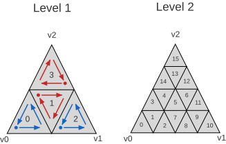

<!--
Copyright 2018-2026 The Khronos Group Inc.
SPDX-License-Identifier: LicenseRef-KhronosSpecCopyright
-->

# EXT\_mesh\_opacity\_micromap

## Contributors

- Christoph Kubisch, NVIDIA, [@pixeljetstream](https://github.com/pixeljetstream)
- Nia Bickford, NVIDIA, [@NBickford-NV](https://github.com/NBickford-NV)
- Arseny Kapoulkine, Independent, [@zeuxcg](https://zeux.io/)
- Pyarelal Knowles, NVIDIA, [@pknowlesnv](https://github.com/pknowlesnv)
- Martin-Karl Lefrançois, NVIDIA, [@mklefrancois](https://github.com/mklefrancois)

Copyright 2018-2026 The Khronos Group Inc. All Rights Reserved. glTF is a trademark of The Khronos Group Inc.
See [Appendix](#appendix-full-khronos-copyright-statement) for full Khronos Copyright Statement.

## Status

Draft

## Dependencies

Written against the glTF 2.0 spec.

## Overview

An *opacity micromap* stores a coarse, pre-computed opacity classification for the surface of a triangle. The triangle is uniformly subdivided into *microtriangles*, and each microtriangle stores one of up to four opacity states (transparent, opaque, unknown-transparent, unknown-opaque). Ray-tracing hardware uses these states to accept or reject ray-triangle intersections without invoking an any-hit shader, which greatly reduces the cost of tracing rays through alpha-tested geometry such as foliage.

This extension stores opacity micromaps in a glTF asset in the form of **build inputs**: the packed microtriangle states, one record per micromap triangle, and a usage summary. The stored layout is binary-compatible with the build inputs of Vulkan [`VK_KHR_opacity_micromap`](https://docs.vulkan.org/refpages/latest/refpages/source/VK_KHR_opacity_micromap.html) and of DirectX 12 opacity micromaps ([`D3D12_RAYTRACING_TIER_1_2`](https://microsoft.github.io/DirectX-Specs/d3d/Raytracing.html#opacity-micromaps)), so that the data can be passed to the graphics API without conversion. This extension does not store the opaque, implementation-specific micromap objects that a graphics API produces from these inputs.

The extension consists of two parts:

1. An array of `micromaps` in the glTF root extension object. Each micromap references the buffer views that hold its data.
2. A mesh primitive extension object that associates each triangle of the primitive with a micromap triangle, or with a uniform opacity state.

How opacity states affect ray traversal (for example, when an any-hit shader is invoked for unknown states) is defined by the graphics API and is outside the scope of this extension.

## Extending the glTF Root

Micromaps are defined in the `micromaps` array of the `EXT_mesh_opacity_micromap` extension object in the glTF root.

```json
{
  "extensions": {
    "EXT_mesh_opacity_micromap": {
      "micromaps": [
        {
          "data": 8,
          "triangles": 9,
          "usageCounts": [4, 42, 84, 26],
          "usageLevels": [4, 5, 6, 7],
          "usageFormats": [2, 2, 2, 2]
        }
      ]
    }
  },
  "extensionsUsed": [ "EXT_mesh_opacity_micromap" ]
}
```

Each micromap object has the following properties:

| | Type | Description | Required |
|-|------|-------------|----------|
| **data** | `integer` | The index of the buffer view containing the packed microtriangle states. See [Microtriangle Data](#microtriangle-data). | :white_check_mark: Yes |
| **triangles** | `integer` | The index of the buffer view containing the micromap triangle records. See [Micromap Triangle Records](#micromap-triangle-records). | :white_check_mark: Yes |
| **usageCounts** | `integer[1-*]` | The number of micromap triangles for each usage entry. | :white_check_mark: Yes |
| **usageLevels** | `integer[1-*]` | The subdivision level of each usage entry. | :white_check_mark: Yes |
| **usageFormats** | `integer[1-*]` | The opacity format of each usage entry. | :white_check_mark: Yes |
| **name** | `string` | The user-defined name of this object. | No |

The `usageCounts`, `usageLevels`, and `usageFormats` arrays together form a list of *usage entries*: entry `i` states that `usageCounts[i]` micromap triangles of the micromap have subdivision level `usageLevels[i]` and format `usageFormats[i]`. The following requirements apply:

- `usageCounts`, `usageLevels`, and `usageFormats` **MUST** have the same length.
- Each element of `usageCounts` **MUST** be greater than or equal to `1`.
- Each element of `usageLevels` **MUST** be in the range `[0, 12]`.
- Each element of `usageFormats` **MUST** be `1` or `2`.
- For each distinct pair of subdivision level and format, the sum of `usageCounts[i]` over all entries `i` with that pair **MUST** equal the number of micromap triangle records with that subdivision level and format.

> [!NOTE]
> As a consequence, the sum of all `usageCounts` elements equals the number of micromap triangle records. The usage entries let an implementation compute the memory required to build a micromap without reading the records.

The buffer views referenced by `data` and `triangles` **MUST NOT** define `byteStride`.

## Extending Mesh Primitives

A mesh primitive references a micromap through the `EXT_mesh_opacity_micromap` extension object.

```json
{
  "meshes": [
    {
      "primitives": [
        {
          "attributes": { "POSITION": 0, "TEXCOORD_0": 1 },
          "indices": 2,
          "material": 0,
          "extensions": {
            "EXT_mesh_opacity_micromap": {
              "micromap": 0,
              "micromapIndices": 3
            }
          }
        }
      ]
    }
  ]
}
```

The extension object has the following properties:

| | Type | Description | Required |
|-|------|-------------|----------|
| **micromap** | `integer` | The index of the micromap in the root `micromaps` array. | :white_check_mark: Yes |
| **micromapIndices** | `integer` | The index of the accessor containing one micromap index per triangle of the primitive. See [Micromap Indices](#micromap-indices). | No |
| **micromapBaseTriangle** | `integer` | The offset added to each micromap index that is not a special index. | No, default: `0` |

A primitive using this extension **MUST** have a `mode` of `4` (TRIANGLES).

## Micromap Data

### Base Triangles and Barycentric Coordinates

For each triangle `t` of a mesh primitive, the *base triangle* vertices `v0`, `v1`, and `v2` are the vertices of that triangle in the order defined by the glTF 2.0 specification for the TRIANGLES topology: when the primitive defines `indices`, they are the vertices referenced by index elements `3t`, `3t + 1`, and `3t + 2`; otherwise, they are vertices `3t`, `3t + 1`, and `3t + 2`.

A point `p` on the base triangle has barycentric coordinates $(u, v)$ such that

$$
p = (1 - u - v) \cdot v_0 + u \cdot v_1 + v \cdot v_2
$$

All microtriangle positions and orderings in this extension are defined in terms of $(u, v)$.

> [!NOTE]
> This is the barycentric convention used by ray-tracing hit attributes in Vulkan and DirectX 12. Because the association between geometry and micromap data depends on the triangle order and on the order of the vertices within each triangle, any processing that reorders triangles, rotates the vertices of a triangle, or changes its winding invalidates the association. Such processing has to update `micromapIndices` (and the micromap data, when the vertex order changes) or remove this extension from the primitive.

### Subdivision and Microtriangle Order

A micromap triangle with subdivision level $L$ divides its base triangle into $4^L$ congruent microtriangles by recursively connecting edge midpoints. The subdivision level **MUST** be in the range `[0, 12]`.

Microtriangles are numbered from `0` to $4^L - 1$ along a hierarchical space-filling curve. The index of the microtriangle containing barycentric coordinates $(u, v)$ is the value returned by the reference function in [Appendix A](#appendix-a-microtriangle-indexing).

### Opacity Formats and States

Each micromap triangle uses one of the following formats:

| Format | Bits per microtriangle | Allowed states |
|-------:|-----------------------:|----------------|
| `1` | 1 | `0` (transparent), `1` (opaque) |
| `2` | 2 | `0` (transparent), `1` (opaque), `2` (unknown-transparent), `3` (unknown-opaque) |

### Microtriangle Data

The buffer view referenced by `data` contains the packed microtriangle states of all micromap triangles of the micromap. The states of a micromap triangle with subdivision level $L$ and format $F$ occupy

$$
\left\lceil \frac{4^L \cdot b}{8} \right\rceil
$$

bytes, starting at the byte offset `dataOffset` of its [record](#micromap-triangle-records), where $b$ is `1` for format `1` and `2` for format `2`.

Within this region, the state of microtriangle `i` occupies bits `i * b` to `i * b + b - 1`, where bit `0` is the least significant bit of the first byte. Bits in the final byte beyond the last microtriangle are unused, and their values **MUST** be ignored.

The region of each micromap triangle **MUST** lie entirely within the `data` buffer view, and regions of different micromap triangles **MUST NOT** overlap.

### Micromap Triangle Records

The buffer view referenced by `triangles` contains a tightly packed array of 8-byte records, one per micromap triangle. Its `byteLength` **MUST** be a multiple of `8`. Micromap triangles are numbered by their position in this array, starting at `0`.

| Byte offset | Type | Name | Description |
|------------:|------|------|-------------|
| `0` | `uint32` | `dataOffset` | Byte offset of the micromap triangle's states, relative to the start of the `data` buffer view. |
| `4` | `uint16` | `subdivisionLevel` | Subdivision level. **MUST** be in the range `[0, 12]`. |
| `6` | `uint16` | `format` | Opacity format. **MUST** be `1` or `2`. |

## Micromap Indices

### Lookup

Each triangle `t` of a primitive is associated with a lookup value `m`:

- When `micromapIndices` is defined, `m` is element `t` of the accessor.
- When `micromapIndices` is undefined, `m` is equal to `t`.

If `m` is a [special index](#special-indices), triangle `t` has the uniform opacity state given by that index and does not reference a micromap triangle. Otherwise, triangle `t` uses micromap triangle `m + micromapBaseTriangle` of the referenced micromap. This value **MUST** be less than the number of micromap triangle records of the micromap.

> [!NOTE]
> When `micromapIndices` is undefined, this requires the number of micromap triangle records to be at least the primitive's triangle count plus `micromapBaseTriangle`.

Several triangles, including triangles of different primitives, **MAY** use the same micromap triangle.

### Special Indices

| Special index | Uniform state |
|--------------:|---------------|
| `-1` | Transparent |
| `-2` | Opaque |
| `-3` | Unknown-transparent |
| `-4` | Unknown-opaque |

### Accessor Requirements

When defined, the `micromapIndices` accessor **MUST** meet the following requirements:

- Its `type` **MUST** be `SCALAR`.
- Its `componentType` **MUST** be `5121` (UNSIGNED_BYTE), `5123` (UNSIGNED_SHORT), `5125` (UNSIGNED_INT), `5122` (SHORT), or `5124` (INT).
- Its `normalized` property **MUST NOT** be set to `true`.
- Its `count` **MUST** be equal to the number of triangles of the primitive.

As for all accessors that do not contain vertex attributes, the elements of this accessor are tightly packed and its buffer view **MUST NOT** define `byteStride`.

For signed component types, special indices are stored as their signed values, and every element **MUST** be greater than or equal to `-4`.

For unsigned component types, special indices are stored as the two's-complement bit patterns of their signed values (for example, `-1` is stored as `255`, `65535`, or `4294967295` for UNSIGNED_BYTE, UNSIGNED_SHORT, or UNSIGNED_INT, respectively). Elements that are not special indices are therefore less than $2^n - 4$, where $n$ is the bit width of the component type.

> [!NOTE]
> Signed and unsigned component types of the same width have identical bit patterns for all valid values, so the data can be passed to a graphics API as an unsigned index buffer of that width.

## Interaction with Materials

*This section is non-normative.*

This extension does not define a relationship between the micromap and the primitive's material. Opacity micromaps are typically created by baking the alpha coverage of the material (its base color alpha, `alphaMode`, and `alphaCutoff`) using format `2`, so that microtriangles straddling an alpha edge are marked as unknown and resolved by the renderer's alpha test, and the result matches rendering without the extension.

Renderers that do not support this extension, including rasterizers, render the primitive using its material alone. A micromap that does not match the material's coverage therefore produces different results across renderers.

Data that changes the material's coverage after baking, such as `KHR_materials_variants`, `KHR_texture_transform`, or animations of texture coordinates or `alphaCutoff` through `KHR_animation_pointer`, is not reflected in the micromap.

## Interaction with Other Extensions

When a primitive uses a mesh compression extension, such as `KHR_draco_mesh_compression` or `EXT_meshopt_compression`, triangles and their vertex order are defined by the decompressed data. Encoders that reorder triangles or rotate triangle vertices have to update the micromap association accordingly (see [Base Triangles and Barycentric Coordinates](#base-triangles-and-barycentric-coordinates)).

Because micromaps are defined in barycentric space, they remain associated with the same surface under skinning, morph targets, and instancing with `EXT_mesh_gpu_instancing`.

## Optional vs. Required

This extension **SHOULD NOT** be listed in `extensionsRequired`. The primitive's geometry and material remain a complete description of the asset when the extension is ignored.

## Graphics API Correspondence

*This section is non-normative.*

The following table lists the graphics API inputs that correspond to the data defined by this extension.

| glTF | Vulkan `VK_KHR_opacity_micromap` | DirectX 12 |
|------|----------------------------------|------------|
| Micromap | `VkAccelerationStructureGeometryMicromapDataKHR` | `D3D12_RAYTRACING_OPACITY_MICROMAP_ARRAY_DESC` |
| `data` | `data` | `InputBuffer` |
| `triangles` | `triangleArray` (`triangleArrayStride` = `8`) | `PerOmmDescs` (stride `8`) |
| Usage entries | `pUsageCounts` (`VkMicromapUsageKHR`) | `pOmmHistogram` (`D3D12_RAYTRACING_OPACITY_MICROMAP_HISTOGRAM_ENTRY`) |
| `usageCounts[i]`, `usageLevels[i]`, `usageFormats[i]` | `count`, `subdivisionLevel`, `format` | `Count`, `SubdivisionLevel`, `Format` |
| Micromap triangle record | `VkMicromapTriangleKHR` | `D3D12_RAYTRACING_OPACITY_MICROMAP_DESC` |
| Mesh primitive extension | `VkAccelerationStructureTrianglesOpacityMicromapKHR` | `D3D12_RAYTRACING_GEOMETRY_OMM_LINKAGE_DESC` |
| `micromap` | `micromap` | `OpacityMicromapArray` |
| `micromapIndices` | `indexBuffer`, `indexType`, `indexStride` | `OpacityMicromapIndexBuffer`, `OpacityMicromapIndexFormat` |
| `micromapIndices` undefined | `indexType` = `VK_INDEX_TYPE_NONE_KHR` | `OpacityMicromapIndexFormat` = `DXGI_FORMAT_UNKNOWN` |
| `micromapBaseTriangle` | `baseTriangle` | `OpacityMicromapBaseLocation` |
| Format `1`, `2` | `VK_OPACITY_MICROMAP_FORMAT_2_STATE_KHR`, `VK_OPACITY_MICROMAP_FORMAT_4_STATE_KHR` | `D3D12_RAYTRACING_OPACITY_MICROMAP_FORMAT_OC1_2_STATE`, `D3D12_RAYTRACING_OPACITY_MICROMAP_FORMAT_OC1_4_STATE` |
| Special indices `-1` to `-4` | `VkOpacityMicromapSpecialIndexKHR` | `D3D12_RAYTRACING_OPACITY_MICROMAP_SPECIAL_INDEX` |

The `micromap` and `OpacityMicromapArray` fields refer to the micromap object that the application builds from the referenced micromap, not to the stored data. Graphics APIs may support lower maximum subdivision levels than this extension allows; Vulkan reports them in `VkPhysicalDeviceOpacityMicromapPropertiesKHR`.

## Schema

- [glTF.EXT_mesh_opacity_micromap.schema.json](schema/glTF.EXT_mesh_opacity_micromap.schema.json)
- [mesh.primitive.EXT_mesh_opacity_micromap.schema.json](schema/mesh.primitive.EXT_mesh_opacity_micromap.schema.json)

## Known Implementations

- [nvpro-samples/vk_gltf_renderer](https://github.com/nvpro-samples/vk_gltf_renderer): loads the extension and builds opacity micromaps for Vulkan ray tracing.
- [nvpro-samples/gltf_omm_baker](https://github.com/nvpro-samples/gltf_omm_baker): bakes opacity micromaps from material alpha coverage and writes them using this extension.

## Resources

*This section is non-normative.*

- [Vulkan `VK_KHR_opacity_micromap`](https://docs.vulkan.org/refpages/latest/refpages/source/VK_KHR_opacity_micromap.html)
- [DirectX Raytracing: Opacity Micromaps](https://microsoft.github.io/DirectX-Specs/d3d/Raytracing.html#opacity-micromaps)
- [SPIR-V `SPV_KHR_opacity_micromap`](https://github.khronos.org/SPIRV-Registry/extensions/KHR/SPV_KHR_opacity_micromap.html)
- [NVIDIA Opacity Micromap SDK](https://github.com/NVIDIA-RTX/OMM)

## Appendix A: Microtriangle Indexing

### Reference Function

The following function maps barycentric coordinates $(u, v)$ on a base triangle to the index of the microtriangle containing them, for subdivision level `level`. It is reproduced from the reference code of the Vulkan `VK_KHR_opacity_micromap` specification and is normative for this extension.

```cpp
uint32_t BarycentricsToSpaceFillingCurveIndex(float u, float v, uint32_t level)
{
    u = clamp(u, 0.0f, 1.0f);
    v = clamp(v, 0.0f, 1.0f);

    uint32_t iu, iv, iw;

    // Quantize barycentric coordinates
    float fu = u * (1u << level);
    float fv = v * (1u << level);

    iu = (uint32_t)fu;
    iv = (uint32_t)fv;

    float uf = fu - float(iu);
    float vf = fv - float(iv);

    if (iu >= (1u << level)) iu = (1u << level) - 1u;
    if (iv >= (1u << level)) iv = (1u << level) - 1u;

    uint32_t iuv = iu + iv;

    if (iuv >= (1u << level))
        iu -= iuv - (1u << level) + 1u;

    iw = ~(iu + iv);

    if (uf + vf >= 1.0f && iuv < (1u << level) - 1u) --iw;

    uint32_t b0 = ~(iu ^ iw);
    b0 &= ((1u << level) - 1u);
    uint32_t t = (iu ^ iv) & b0;

    uint32_t f = t;
    f ^= f >> 1u;
    f ^= f >> 2u;
    f ^= f >> 4u;
    f ^= f >> 8u;
    uint32_t b1 = ((f ^ iu) & ~b0) | t;

    // Interleave bits
    b0 = (b0 | (b0 << 8u)) & 0x00ff00ffu;
    b0 = (b0 | (b0 << 4u)) & 0x0f0f0f0fu;
    b0 = (b0 | (b0 << 2u)) & 0x33333333u;
    b0 = (b0 | (b0 << 1u)) & 0x55555555u;
    b1 = (b1 | (b1 << 8u)) & 0x00ff00ffu;
    b1 = (b1 | (b1 << 4u)) & 0x0f0f0f0fu;
    b1 = (b1 | (b1 << 2u)) & 0x33333333u;
    b1 = (b1 | (b1 << 1u)) & 0x55555555u;

    return b0 | (b1 << 1u);
}
```

### Illustration

*This section is non-normative.*

The resulting order follows a recursive space-filling curve. Each triangle is split into four sub-triangles, which are visited in the following order:

1. The sub-triangle nearest `v0`.
2. The middle sub-triangle, with its child order flipped.
3. The sub-triangle nearest `v1`.
4. The sub-triangle nearest `v2`, with its child order flipped.

The figure below shows the resulting microtriangle indices for subdivision levels 1 (left) and 2 (right), with `v0` at the bottom left, `v1` at the bottom right, and `v2` at the top. Blue arrows show the default child order and red arrows show flipped child order.



## Appendix: Full Khronos Copyright Statement

Copyright 2018-2026 The Khronos Group Inc.

Some parts of this Specification are purely informative and do not define requirements
necessary for compliance and so are outside the Scope of this Specification. These
parts of the Specification are marked as being non-normative, or identified as
**Implementation Notes**.

Where this Specification includes normative references to external documents, only the
specifically identified sections and functionality of those external documents are in
Scope. Requirements defined by external documents not created by Khronos may contain
contributions from non-members of Khronos not covered by the Khronos Intellectual
Property Rights Policy.

This specification is protected by copyright laws and contains material proprietary
to Khronos. Except as described by these terms, it or any components
may not be reproduced, republished, distributed, transmitted, displayed, broadcast
or otherwise exploited in any manner without the express prior written permission
of Khronos.

This specification has been created under the Khronos Intellectual Property Rights
Policy, which is Attachment A of the Khronos Group Membership Agreement available at
www.khronos.org/files/member_agreement.pdf. Khronos grants a conditional
copyright license to use and reproduce the unmodified specification for any purpose,
without fee or royalty, EXCEPT no licenses to any patent, trademark or other
intellectual property rights are granted under these terms. Parties desiring to
implement the specification and make use of Khronos trademarks in relation to that
implementation, and receive reciprocal patent license protection under the Khronos
IP Policy must become Adopters and confirm the implementation as conformant under
the process defined by Khronos for this specification;
see https://www.khronos.org/adopters.

Khronos makes no, and expressly disclaims any, representations or warranties,
express or implied, regarding this specification, including, without limitation:
merchantability, fitness for a particular purpose, non-infringement of any
intellectual property, correctness, accuracy, completeness, timeliness, and
reliability. Under no circumstances will Khronos, or any of its Promoters,
Contributors or Members, or their respective partners, officers, directors,
employees, agents or representatives be liable for any damages, whether direct,
indirect, special or consequential damages for lost revenues, lost profits, or
otherwise, arising from or in connection with these materials.

Vulkan is a registered trademark and Khronos, OpenXR, SPIR, SPIR-V, SYCL, WebGL,
WebCL, OpenVX, OpenVG, EGL, COLLADA, glTF, NNEF, OpenKODE, OpenKCAM, StreamInput,
OpenWF, OpenSL ES, OpenMAX, OpenMAX AL, OpenMAX IL, OpenMAX DL, OpenML and DevU are
trademarks of The Khronos Group Inc. ASTC is a trademark of ARM Holdings PLC,
OpenCL is a trademark of Apple Inc. and OpenGL and OpenML are registered trademarks
and the OpenGL ES and OpenGL SC logos are trademarks of Silicon Graphics
International used under license by Khronos. All other product names, trademarks,
and/or company names are used solely for identification and belong to their
respective owners.
