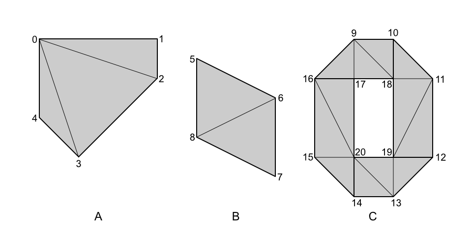

<!--
Copyright 2025 Bentley Systems, Incorporated
SPDX-License-Identifier: CC-BY-4.0
-->

# EXT_mesh_polygon

## Contributors

- Don McCurdy, Bentley Systems, [@donmccurdy](https://github.com/donmccurdy)
- TODO

## Status

Draft

## Dependencies

Written against the glTF 2.0 spec.

## Overview

Extends glTF mesh primitives, adding an encoding of polygon primitive topology, including triangle indices for backwards-compatible rendering. While the core glTF 2.0 specification already allows polygons to be triangulated and encoded as TRIANGLES, TRIANGLE_STRIP, or TRIANGLE_FAN primitive modes, the original topology would be lost without the additional specification and metadata provided by this extension.

## Extending Mesh Primitives

The `EXT_mesh_polygon` extension may be added to a mesh primitive, indicating that the primitive represents a series of polygons.

An extended mesh primitive **MUST** include `primitive.mode = 2` ("LINE_LOOP").

Each polygon is composed of 1 or more loops. The first loop in each polygon represents the polygon's exterior ring, or boundary. Additional loops, if any, represent interior rings ("holes") within the polygon. Polygons must be fully-connected: holes cannot intersect the exterior ring, and additional exterior rings ("islands") are not allowed, whether outside the exterior ring or within holes.

Each loop must be separated by a primitive restart value, including loops associated with different polygons. Primitive restart values applicable to each accessor type are:

| `accessor.componentType`     | restart value             |
| ---------------------------- | ------------------------- |
| `5121`&nbsp;(UNSIGNED_BYTE)  | `255` (0xFF)              |
| `5123`&nbsp;(UNSIGNED_SHORT) | `65535` (0xFFFF)          |
| `5125`&nbsp;(UNSIGNED_INT)   | `4294967295` (0xFFFFFFFF) |

A single mesh primitive may contain any number of line loops, defining exterior and interior rings for any number of polygons. Each polygon is associated with its loop(s) within the mesh primitive according to the `indicesOffsets` extension property.

Winding order of exterior rings is counterclockwise; winding order of interior rings (holes) is clockwise.

An extended mesh primitive **MUST** include `indices`. Indices for each polygon must be contiguous: for a polygon composed of 4 loops (1 exterior, 3 holes), indices defining these loops must occupy an uninterrupted range within the primitive's indices accessor. Only indices, not vertex attributes, are required to be contiguous.

The `EXT_mesh_polygon` extension includes the following additional properties.

### count

Integer number of polygons encoded in the mesh primitive.

- **Type:** `number`
- **Required:** ✓ Yes
- **Minimum:** ≥ 1

### indicesOffsets

Index of an accessor containing one integer offset per polygon in the primitive, indicating the first index of the first line loop associated with the polygon. The accessor **MUST** have `SCALAR` type and an unsigned integer component type, and the accessor's `count` **MUST** be the same as `EXT_mesh_polygon.count` for the primitive.

All line loop indices associated with a polygon MUST be contiguous: one exterior ring followed immediately by zero or more interior rings.

- **Type:** `number`
- **Required:** ✓ Yes
- **Minimum:** ≥ 0

### triangleIndices

Index of an accessor containing indices satisfying all requirements associated with `primitive.mode = 4` ("TRIANGLES"), defining the tessellated surface of the polygon as a series of triangles. These indices refer to the same vertex attributes as the primitive's line loop indices. The accessor **MUST** have `SCALAR` type and an unsigned integer component type.

When omitted, client implementations **MUST** compute a tessellation for the polygon, or fall back on another method of rendering the polygon.

> [!NOTE]
> Runtime tessellation of polygons is expensive and not uniquely-defined for all 3D line loops; authoring implementations should include `triangleIndices` whenever practical.

- **Type:** `number`
- **Required:** No
- **Minimum:** ≥ 0

### triangleIndicesOffsets

Index of an accessor containing one integer offset per polygon in the primitive, indicating the first index of the first triangle in the `triangleIndices` accessor associated with that polygon. The accessor **MUST** have `SCALAR` type and an unsigned integer component type, and the accessor's `count` **MUST** be the same as `EXT_mesh_polygon.count` for the primitive.

All triangles associated with a polygon MUST be contiguous.

When `triangleIndices` is defined, `triangleIndicesOffsets` is required. When `triangleIndices` is omitted, `triangleIndicesOffsets` must be undefined.

> [!NOTE]
> The range of loop indices for the `nth` polygon is `loopIndicesOffsets[n]` to `loopIndicesOffsets[n+1]` if `n < count - 1`, otherwise `loopIndicesOffsets[n]` to the end of the `loopIndices` accessor.

- **Type:** `number`
- **Required:** No
- **Minimum:** ≥ 0

## Additional Restrictions

Triangles in the extended mesh primitive **MUST** be associated with exactly one polygon. Loose triangles cannot be included, and a single triangle cannot be associated with multiple polygons.

Polygon `indices` values **MUST** be associated with at least one triangle. Exterior and interior loops may not contain additional vertex indices missing from triangulation.

Polygon `indices` values **MUST** be unique within each exterior or interior loop. The same vertex index cannot be used twice within a loop.

> [!NOTE]
> Unlike in some geospatial formats, it is NOT necessary that the first index be repeated at the end of the loop to indicate a closed ring, and doing so would violate the requirement above. The first and last index are implicitly connected, as defined for line loop indices in the core glTF 2.0 specification.

## Example

_This section is non-normative._

The JSON example below shows a mesh having one mesh primitive, which contains 100 polygon primitives. The `indices` accessor defines `LINE_LOOP` indices delimiting the exterior (and interior, if holes are present) rings of each polygon. The `triangleIndices` accessor defines triangle indices available to draw the polygons as filled surfaces. `indicesOffsets` and `triangleIndicesOffsets` accessors enable random access, allowing implementations to immediately find the particular indices (for loops and triangles, respectively) associated with the Nth polygon.

```jsonc
{
  "extensionsUsed": ["EXT_mesh_polygon"],
  ...
  "meshes": [{
    "name": "MyMesh",
    "primitives": [{
      "mode": 2, // LINE_LOOP
      "indices": 0,
      "attributes": {
        "POSITION": 1,
      },
      "extensions": {
        "EXT_mesh_polygon": {
          "count": 100,
          "indicesOffsets": 2,
          "triangleIndices": 3,
          "triangleIndicesOffsets": 4
        }
      }
    }]
  }]
}
```

Consider a simple mesh primitive containing three polygons, one with a single hole, and two without:



One valid encoding of `EXT_mesh_polygon` for this polygon set, based on `UNSIGNED_SHORT` indices and restart values, would be as follows:

## JSON Schema

The `"EXT_mesh_polygon"` string must be added to the root-level `extensionsUsed` array. Where preservation of polygon topology — not just display of equivalent triangles — is required, the string should also be added to the root-level `extensionsRequired` array. As the extension is intentionally backwards-compatible for rendering purposes, the extension is expected to be optional in most cases.

## Known Implementations

- TODO
