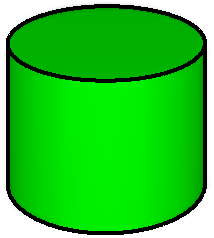
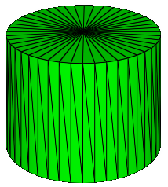
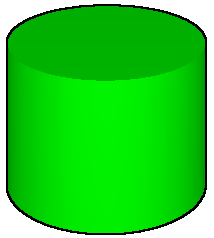
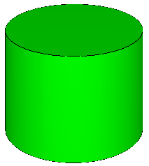
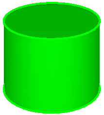

<!--
Copyright 2025 The Khronos Group Inc.
SPDX-License-Identifier: CC-BY-4.0
-->

# EXT_mesh_primitive_edge_visibility

## Contributors

* Paul Connelly, Bentley Systems, [@pmconne](https://github.com/pmconne)

## Status

Draft

## Dependencies

Written against the glTF 2.0 spec.

## Overview

3D modeling and computer-aided drafting environments like SketchUp, MicroStation, and Revit provide non-photorealistic visualizations that render 3D objects with their edges visible. The edges can improve the readability of complex models and convey semantics of the underlying topology. The `EXT_mesh_primitive_edge_visibility` extension augments a triangle mesh primitive with sufficient information to enable engines to produce such visualizations. The information is encoded in a compact form to minimize the impact on the size of the glTF asset.

Figure 1 illustrates a typical rendering of a cylinder with its edges. The width of the edges has been exaggerated for emphasis.

<figure>

<figcaption><em><b>Figure 1</b> Cylinder mesh with visible edges</em></figcaption>
</figure>

This image shows both of the two types of edges described by `EXT_mesh_primitive_edge_visibility`.
- A [silhouette edge](https://en.wikipedia.org/wiki/Silhouette_edge) is any edge separating a front-facing triangle from a back-facing triangle. In Figure 1, one silhouette is visible along each of the curved left and right sides of the cylinder. Silhouette edges are *conditionally visible* - their visibility is determined at display time based on the orientations of the adjacent triangles relative to the camera. In Figure 2, each of the vertical edges encircling the cylinder represents a potential silhouette edge.
- A hard edge is any edge attached to only a single triangle, or any edge between two logical faces of the 3D object. In Figure 1, hard edges are visible around the perimeters of the cylinder's circular end caps. Hard edges are *always visible* regardless of the camera direction.

## Shortcomings of Existing Techniques

Various techniques can be applied to a glTF asset to approximate the rendering in Figure 1. The approach illustrated in Figure 2 uses a wiremesh shader to render every edge of every triangle. While the interior edges can be useful for visualizing the structure of the triangle mesh, they obscure the underlying cylinder topology.

<figure>

<figcaption><em><b>Figure 2</b> Triangle edges drawn using a wiremesh technique</em></figcaption>
</figure>

Screen-space techniques (e.g., "toon" or "outline" shaders) can be applied to add edges during image post-processing. Because they operate on pixels rather than geometry, such techniques can only approximate the actual edges. The technique used in Figure 3, for example, fails to reconstruct the edges along the upper end cap of the cylinder where they fall inside the cylinder's volume projected onto the image plane.

<figure>

<figcaption><em><b>Figure 3</b> Edges drawn using a screen-space technique</em></figcaption>
</figure>

The hard edges could be encoded explicitly into the glTF asset as additional primitives to be drawn together with the triangle mesh. However, this will generally produce a "stippling" effect where the edges and triangles collide in the depth buffer, as shown in Figure 4.

<figure>

<figcaption><em><b>Figure 4</b> Edges drawn as separate primitives</em></figcaption>
</figure>

The [CESIUM_primitive_outline](https://github.com/KhronosGroup/glTF/tree/main/extensions/2.0/Vendor/CESIUM_primitive_outline) extension provides an additional index buffer describing each hard edge as a line segment (a pair of indices into the triangle mesh's list of vertices). The extension leaves the details of how to render the edges up to the engine, requiring only that they render without depth-fighting. This approach satisfies the use case for which it was intended - displaying the edges of boxy, low-resolution buildings - but suffers some limitations:
- The surface geometry must be represented as indexed triangles.
- It only supports hard edges, not silhouettes.
- The representation of the edges as pairs of vertex indices can significantly increase the size of the glTF asset.
- The edges cannot specify their own materials.

<figure>

<figcaption><em><b>Figure 5</b> Hard edges encoded using CESIUM_primitive_outline</em></figcaption>
</figure>

## glTF Schema Updates

The `EXT_mesh_primitive_edge_visibility` extension is applied to a mesh primitive of topology type 4 (triangles), 5 (triangle strip), or 6 (triangle fan) that uses indexed or non-indexed geometry. It provides the information required for engines to produce a rendering of the primitive's edges. Engines are not required to *always* render the edges - they may, for example, permit the user to toggle edge display on and off. When rendering the edges, engines may use any techniques that meet the requirements specified below.

### Edge Visibility

The visibility of a single edge is specified using 2 bits as one of the following visibility values:
- 0: Hidden edge - the edge should never be drawn.
- 1: Silhouette edge - the edge should be drawn only in silhouette (i.e., when separating a front-facing triangle from a back-facing triangle).
- 2: Hard edge - the edge should always be drawn.
- 3: Repeated hard edge - the edge should always be drawn, and its visibility is already encoded as `2` for an adjoining triangle.

The extension's `visibility` property specifies the index of an accessor of `SCALAR` type and component type 5121 (unsigned byte) that encodes as a bitfield the visibility of every edge of every triangle in the mesh. The ordering of triangles and vertices is as described by [Section 3.7.2.1](https://www.khronos.org/registry/glTF/specs/2.0/glTF-2.0.html#meshes-overview) of the glTF 2.0 specification. For each triangle `(v0, v1, v2)`, the bitfield encodes three visibility values for the edges `(v0:v1, v1:v2, v2:v0)` in that order. Therefore, the accessor's `count` **MUST** be `6 * N / 8` rounded up to the nearest whole number, where `N` is the number of triangles in the primitive. Any unused bits in the last byte **MUST** be set to zero.

Edges are often shared between multiple adjacent triangles, which could lead to redunant encoding of their visibilities. For example, if the shared edge between two triangles was encoded as `2` twice, an engine might produce two graphical representations of the edge when one would suffice, or be forced to manually detect and rectify the redundancy. The following rules enable engines to handle shared edges more efficiently:
- A hard edge **MUST** be encoded as `2` exactly once in `visibility`. All other occurrences of the same edge **MUST** be encoded as `3`.
- A silhouette edge **MUST** be encoded as `1` exactly once in `visibility`. All other occurrences of the same edge **MUST** be encoded as `0`. Silhouette edges are shared by definition, and engines can directly access the opposite triangle via the [silhouetteMates](#silhouette-mates) property.

The bitfield **MUST** contain at least one non-zero visibility value.

The `visibility` property **MUST** be defined if `lineStrings` is not defined - otherwise, the extension would encode no edges.

#### Examples

Consider the simple example of a pair of adjacent triangles described by the index list `[0,1,2, 0,2,3]`:
```
  0______3
  |＼    |
  |  ＼  |
  |____＼|
  1      2
```

With 2 bits per edge, encoding the visibility of two triangles requires 12 bits. So the visibility buffer must be 2 bytes long, with 4 bits of the second byte going unused. The diagram below shows which edge's visibility will be encoded into each pair of bits.

```
Byte    0                 1
       ┌───┬───┬───┬───┐ ┌───┬───┬───┬───┐
       │0:2│2:0│1:2│0:1│ │   │   │3:0│2:3│
       └───┴───┴───┴───┘ └───┴───┴───┴───┘
Bit        6   4   2   0     14  12  10  8
```

##### Shared silhouette edge

Assume that the vertical edges `0:1` and `2:3` are hard edges, the horizontal edges `3:0` and `1:2` are hidden edges, and the shared diagonal edge `0:2` is a silhouette edge. Then the corresponding visibility values would be `[2,0,1, 1,2,0]`. However, we must ensure that the visibility of the silhouette edge is encoded only once, so after replacing one of the redundant `1`s the visibility values are `[2,0,1, 0,2,0]`. Encoding the edge visibility produces the sequence of bytes `[18, 2]`, as illustrated below.

```
Byte    0                 1
       ┌───┬───┬───┬───┐ ┌───┬───┬───┬───┐   
Binary │ 00│ 01│ 00│ 10│ │ 00│ 00│ 00│ 10│
       └───┴───┴───┴───┘ └───┴───┴───┴───┘   
Decimal              18                 2
```

##### Shared hard edge

Assume that the vertical edges `0:1` and `2:3` and the shared diagonal edge `0:2` are all hard edges, and the horizontal edges `3:0` and `1:2` are hidden edges. Then the corresponding visibility values would be `[2,0,2, 2,2,0]`. However, we must ensure that the visibility of the shared hard edge is encoded only once as `2`, with the other occurrence encoded as `3`, resulting in visibility values `[2,0,2, 3,2,0]`. Encoding the edge visibility produces the sequence of bytes `[226, 2]`, as illustrated below.
```
Byte    0                 1
       ┌───┬───┬───┬───┐ ┌───┬───┬───┬───┐   
Binary │ 11│ 10│ 00│ 10│ │ 00│ 00│ 00│ 10│
       └───┴───┴───┴───┘ └───┴───┴───┴───┘   
Decimal             226                 2
```

### Material

The extension's `material` property optionally specifies the index of a glTF material with which the edges are to be drawn. If unspecified, the edges should be drawn using the same material as the triangle mesh primitive.

### Line Strings

The representation of hard edges in the `visibility` property - while compact - presents some drawbacks for certain use cases: it requires that all of the encoded edges draw using the same material, and it does not capture the connectivity between individual line segments. For example, the perimeters of the top and bottom faces of the cylinder in Figure 1 are each logically a single continuous circle. Perhaps the outline of the top face should be drawn in a different color than that of the bottom face, which would require a way to specify a different material. Or perhaps the outlines are to be drawn with a dash pattern along their entire lengths, or as wide lines into which an engine might insert additional triangles to smooth out the joints between line segments - both of which require connectivity information.

The extension's `lineStrings` property provides an alternate representation for some or all of the hard edges that would otherwise be encoded in `visibility`. It is an array in which each entry is an object with the following properties:
- `indices` (required): the index of an accessor of type `SCALAR` and component type `UNSIGNED_BYTE` (5121), `UNSIGNED_SHORT` (5123), or `UNSIGNED_INT` (5125) encoding one or more line strings as indices into the triangle mesh's vertex attribute array. Each line string is encoded as a series of two or more indices. Multiple line strings can be encoded by inserting a "primitive restart" value (that is, the maximal possible value for the accessor's component type, like 255 for `UNSIGNED_BYTE`) between each line string. The `indices` buffer **MUST NOT** begin or end with a primitive restart value, and **MUST NOT** contain consecutive primitive restart values.
- `material` (optional): the index of the material with which the edges encoded by `indices` are to be drawn. If omitted, the extension's own `material` property is used, if defined; otherwise, the material of the triangle mesh primitive is used.

A hard edge encoded in `lineStrings` **MUST NOT** also be encoded in `visibility`.

The `lineStrings` property **MUST** be defined if `visibility` is not defined - otherwise, the extension would encode no edges.

#### Examples

Consider the following simple triangle fan with triangles described by the index list `[0,1,2, 0,2,3, 0,3,4, 0,4,5]`:
```
  2______3______4
  |＼    |    ／|
  |  ＼  |  ／  |
  |____＼|／____|
  1      0      5
```

Assume that the top and bottom edges are hard edges, to be encoded as a pair of line strings with indices `[2,3,4]` and `[1,0,5]`, respectively; and the vertical edges are hard edges, to be encoded as simple line segments. Then the `visibility` bitfield should encode only the vertical edges, with visibility values `[0,2,0, 0,0,2, 3,0,0, 0,2,0]`.

##### Single material

Assume that the top and bottom edges are to be drawn using the same material, different from the material used to draw the vertical edges, and the indices are encoded as unsigned bytes. Then the index buffer would look like `[2,3,4, 255, 1,0,5]`, where `255` is the primitive restart value separating the two line strings. The `lineStrings` property would look something like this:
```
{
    "lineStrings": [
        {
            "indices": 5,
            "material": 1
        }
    ]
}
```

##### Two materials

Assume that the top edge is to be drawn using the same material as the vertical edges, and the bottom edge is to be drawn using a different material. Then there would be two index buffers - `[2,3,4]` and `[1,0,5]` - and the `lineStrings` property would look something like this:
```
{
    "lineStrings": [
        {
            "indices": 5
        },
        {
            "indices": 6,
            "material": 1
        }
    ]
}
```

### Silhouette Mates

A silhouette edge represents the edge between two vertices shared by a pair of adjacent triangles. An engine can directly obtain the indices of one of those triangles based on the `visibility` encoding, but to conditionally render the silhouette it also needs to know the third (unshared) vertex of the other triangle so that it can determine each triangle's facing relative to the camera.

The extension's `silhouetteMates` property specifices the index of an accessor of `SCALAR` type and component type `UNSIGNED_BYTE` (5121), `UNSIGNED_SHORT` (5123), or `UNSIGNED_INT` (5125) encoding indices into the triangle mesh's vertex attribute array. Each index refers to the unshared vertex of the other triangle adjacent to the `nth` silhouette edge encoded in `visibility`. The accessor's `count` **MUST** be equal to the number of edges encoded with visibility value `1`.

The `silhouetteMates` property **MUST** be defined *if and only if* at least one edge is encoded with visibility value `1` in `visibility`.

Engines **MUST** render a silhouette edge unless both adjacent triangles are front-facing or both are back-facing, as determined by their normal vectors.

## Rendering requirements

- Engines **MUST** render all edges according to their specified visibility values, though some engines may permit the user to toggle the display of edges on and off.
- The edges **MUST** draw in front of their corresponding triangles with no depth-fighting.
- The edges **MUST** draw using the materials specified by the extension by default, though some engines may provide options for the user to override those materials.
- Each silhouette edge **MUST** be rendered unless both adjacent triangles are front-facing or both are back-facing, as determined by their normal vectors.

## JSON Schema

- [primitive.EXT_mesh_primitive_edge_visibility.schema.json](./schema/primitive.EXT_mesh_primitive_edge_visibility.schema.json)
- [lineString.schema.json](./schema/lineString.schema.json)

## Implementation Notes

The [pull request](https://github.com/iTwin/itwinjs-core/pull/5581) that informed the design of this extension provides [an iterator](https://github.com/iTwin/itwinjs-core/blob/03b760e1e91bde5221aa7370ea45c52f966e3368/core/frontend/src/common/imdl/CompactEdges.ts#L42) over the `visibility` buffer.

iTwin.js [implements](https://github.com/iTwin/itwinjs-core/blob/03b760e1e91bde5221aa7370ea45c52f966e3368/core/frontend/src/internal/render/webgl/glsl/Edge.ts#L107) conditional display of silhouette edges. It also draws edges in a separate pass from surfaces to [mitigate z-fighting](https://github.com/iTwin/itwinjs-core/blob/03b760e1e91bde5221aa7370ea45c52f966e3368/core/frontend/src/internal/render/webgl/glsl/FeatureSymbology.ts#L426).
