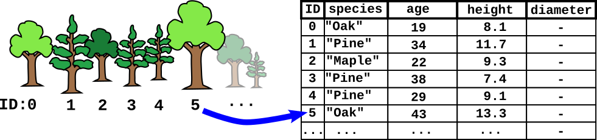
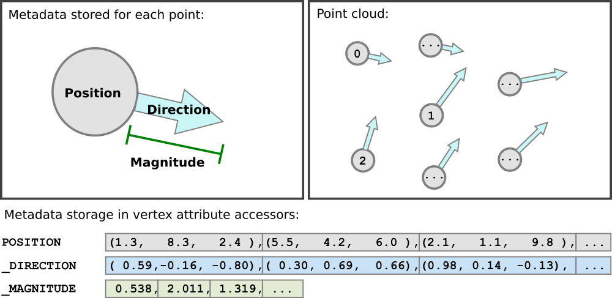
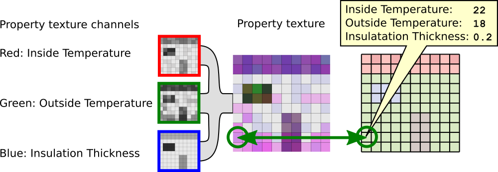

<!-- omit in toc -->
# EXT_structural_metadata

<!-- omit in toc -->
## Contributors

* Peter Gagliardi, Cesium
* Sean Lilley, Cesium
* Sam Suhag, Cesium
* Don McCurdy, Independent
* Marco Hutter, Cesium
* Bao Tran, Cesium
* Samuel Vargas, Cesium
* Patrick Cozzi, Cesium

<!-- omit in toc -->
## Status

Draft

<!-- omit in toc -->
## Dependencies

Written against the glTF 2.0 specification.

<!-- omit in toc -->
## Table of Contents

- [Overview](#overview)
- [Schema Definitions](#schema-definitions)
    - [Overview](#overview-1)
    - [Schema](#schema)
    - [Class](#class)
    - [Class Property](#class-property)
    - [Enum](#enum)
    - [Enum Value](#enum-value)
- [Metadata Storage](#metadata-storage)
  - [Property Tables](#property-tables)
  - [Property Attributes](#property-attributes)
  - [Property Textures](#property-textures)
    - [Property Texture Data Storage](#property-texture-data-storage)
- [Binary Data Storage](#binary-data-storage)
- [Optional vs. Required](#optional-vs-required)
- [Schema](#schema-1)
- [Revision History](#revision-history)

## Overview

This extension defines a means of storing structured metadata within a glTF 2.0 asset. The key concepts of this extension are the definition of a schema that describes the structure of the metadata, and methods for storing and associating metadata with different entities within the asset.

The metadata schema definition includes a JSON representation of the schema structure, suitable for being stored inside a glTF asset. The storage formats that are defined in this extension allow storing metadata in standard glTF vertex attributes, or in the channels of a texture. Both representations are compact binary storage formats that are appropriate for efficiently transmitting large quantities of metadata. 

The schema definition and the storage formats in this extension are implementations of the [3D Metadata Specification](https://github.com/CesiumGS/3d-tiles/tree/main/specification/Metadata). This specification should be considered a normative reference for definitions and requirements. This document provides inline definitions of terms where appropriate.

> **Disambiguation:** glTF has other methods of storing details that could similarly be described as metadata or properties, including [`KHR_xmp_json_ld`](../../Khronos/KHR_xmp_json_ld), Extras, and Extensions. While those methods associate data with discrete objects in a glTF asset — nodes, materials, etc. — `EXT_structural_metadata` is uniquely suited for properties of more granular conceptual features in subregions composed of vertices or texels.

## Schema Definitions

#### Overview

Data types and meanings of properties are provided by a schema, as defined in the [3D Metadata Specification](https://github.com/CesiumGS/3d-tiles/tree/main/specification/Metadata/) and summarized below.

#### Schema

*Defined in [schema.schema.json](./schema/schema.schema.json).*

Top-level definitions for the structure and data types of properties. The schema provides a set of [classes](#class) and [enums](#enum) the asset can reference.

A schema may be embedded in the extension directly or referenced externally with the `schemaUri` property. Multiple glTF assets may refer to the same external schema to avoid duplication. A schema is defined by an `EXT_structural_metadata` extension attached to the glTF root object.

> **Example:** A simple schema defining enums and classes.
>
> ```jsonc
> {
>   "extensions": {
>     "EXT_structural_metadata": {
>       "schema": {
>         "id": "schema-001",
>         "name": "Schema 001",
>         "description": "An example schema.",
>         "version": "3.5.1",
>         "enums": { ... },
>         "classes": { ... }
>       }
>     }
>   }
> }
> ```

#### Class

*Defined in [class.schema.json](./schema/class.schema.json).*

Template for metadata entities. Classes provide a list of property definitions. Instances of a class can be created from property values that conform to the class's property definitions. 

Classes are defined as entries in the `schema.classes` dictionary, indexed by an alphanumeric class ID.

> **Example:** A "Tree" class, which might describe a table of tree measurements taken in a park. Property definitions are abbreviated here, and introduced in the next section.
>
> ```jsonc
> {
>   "extensions": {
>     "EXT_structural_metadata": {
>       "schema": {
>         "classes": {
>           "tree": {
>             "name": "Tree",
>             "description": "Woody, perennial plant.",
>             "properties": {
>               "species": { ... },
>               "age": { ... },
>               "height": { ... },
>               "diameter": { ... }
>             }
>           }
>         }
>       }
>     }
>   }
> }
> ```

#### Class Property

*Defined in [class.property.schema.json](./schema/class.property.schema.json).*

Class properties are defined abstractly in a class. The class is instantiated with specific values conforming to these properties. Class properties support a richer variety of data types than glTF accessors or GPU shading languages allow. Details about the supported types can be found in the [3D Metadata Specification](https://github.com/CesiumGS/3d-tiles/tree/main/specification/Metadata#property).

Class properties are defined as entries in the `class.properties` dictionary, indexed by an alphanumeric property ID. 

> **Example:** A "Tree" class, which might describe a table of tree measurements taken in a park. Properties include species, height, and diameter of each tree, as well as the number of birds observed in its branches.
>
> ```jsonc
> {
>   "extensions": {
>     "EXT_structural_metadata": {
>       "schema": {
>         "classes": {
>           "tree": {
>             "name": "Tree",
>             "description": "Woody, perennial plant.",
>             "properties": {
>               "species": {
>                 "description": "Type of tree.",
>                 "type": "ENUM",
>                 "enumType": "speciesEnum",
>                 "required": true
>               },
>               "age": {
>                 "description": "The age of the tree, in years",
>                 "type": "SCALAR",
>                 "componentType": "UINT8",
>                 "required": true
>               },
>               "height": {
>                 "description": "Height of tree measured from ground level, in meters.",
>                 "type": "SCALAR",
>                 "componentType": "FLOAT32"
>               },
>               "diameter": {
>                 "description": "Diameter at trunk base, in meters.",
>                 "type": "SCALAR",
>                 "componentType": "FLOAT32"
>               }
>             }
>           }
>         }
>       }
>     }
>   }
> }
> ```

#### Enum

*Defined in [enum.schema.json](./schema/enum.schema.json).*

Set of categorical types, defined as `(name, value)` pairs. Enum properties use an enum as their type.

Enums are defined as entries in the `schema.enums` dictionary, indexed by an alphanumeric enum ID.

> **Example:** A "Species" enum defining types of trees. An "Unspecified" enum value is optional, but when provided as the `noData` value for a property (see: [3D Metadata → No Data Values](https://github.com/CesiumGS/3d-tiles/tree/main/specification/Metadata#required-properties-and-no-data-values)) may be helpful to identify missing data.
>
> ```jsonc
> {
>   "extensions": {
>     "EXT_structural_metadata": {
>       "schema": {
>         "enums": {
>           "speciesEnum": {
>             "name": "Species",
>             "description": "An example enum for tree species.",
>             "values": [
>               {"name": "Unspecified", "value": 0},
>               {"name": "Oak", "value": 1},
>               {"name": "Pine", "value": 2},
>               {"name": "Maple", "value": 3}
>             ]
>           }
>         }
>       }
>     }
>   }
> }
> ```

#### Enum Value

*Defined in [enum.value.schema.json](./schema/enum.value.schema.json).*

Pairs of `(name, value)` entries representing possible values of an enum property.

Enum values are defined as entries in the `enum.values` array. Duplicate names or duplicate integer values are not allowed.


## Metadata Storage

The classes defined in the schema are templates describing the data types and meanings of properties. An instance of such a metadata class is referred to as a _metadata entity_, and can be created from a set of values that conform to the structure of the class. This extension defines different ways of storing large amounts of property values inside a glTF asset, in compact binary forms: 

- **Property Tables** store property values as parallel arrays in a column-based binary layout, using standard glTF buffer views. These tables can be accessed with a row index, and allow associating complex, structured metadata with arbitrary types with entities of a glTF asset on different levels of granularity.
- **Property Attributes** are a way of storing metadata as vertex attributes, using standard glTF accessors. They can be used to associate certain forms of metadata with vertices of a mesh primitive. 
- **Property Textures** store property values in channels of a texture, suitable for very high-frequency data mapped to less-detailed 3D surfaces. 

The following sections describe these storage formats in more detail.

Each storage type refers to a metadata class, and contains a dictionary of `properties`. Each of these properties corresponds to one property of the metadata class. Each of these properties define the way how the actual property data is stored. These property storage definitions allow to override the [`minimum` and `maximum` values](https://github.com/CesiumGS/3d-tiles/tree/main/specification/Metadata#minimum-and-maximum-values) and the [`offset` and `scale`](https://github.com/CesiumGS/3d-tiles/tree/main/specification/Metadata#offset-and-scale) from the property definition in the class, to account for the actual range of values that is stored for each property.

### Property Tables

*Defined in [propertyTable.schema.json](./schema/propertyTable.schema.json).*

Each property table defines a specified number (`count`) of metadata entities conforming to a particular class (`class`), with property values stored as parallel arrays in a column-based binary layout. Property tables support a richer variety of data types than glTF accessors or GPU shading languages allow, and are suitable for datasets that can be expressed in a tabular layout.

Property tables are defined as entries in the `propertyTables` array of the root-level `EXT_structural_metadata` extension, and may be referenced by other extensions. 

The property table may provide value arrays for only a subset of the properties of its class, but class properties marked `required: true` must not be omitted. Each property value array given by the property table must be defined by a class property with the same alphanumeric property ID, with values matching the data type of the class property.

> **Example:** A `tree_survey_2021-09-29` property table, implementing the `tree` class defined in earlier examples. The table contains observations for 10 trees, with each property defined by a buffer view containing 10 values.
>
> The glTF asset contains multiple objects (trees) that are associated with unique identifiers. These identifiers can be assigned to the objects in different ways. For example, using the [`EXT_mesh_features`](../EXT_mesh_features) extension, the [`EXT_instance_features`](../EXT_instance_features) extension, or an application-specific mechanism for identifying the objects. The identifiers then serve as an index into the property table row that stores the property values for the properties that are defined in the `tree` class.
> 
> > 
> 
>
> ```jsonc
> {
>   "extensions": {
>     "EXT_structural_metadata": {
>       "schema": { ... },
>       "propertyTables": [{
>         "name": "tree_survey_2021-09-29",
>         "class": "tree",
>         "count": 10,
>         "properties": {
>           "species": {
>             "values": 2,
>             "stringOffsets": 3
>           },
>           "age": {
>             "values": 1
>           },
>           "height": {
>             "values": 0
>           },
>           // "diameter" is not required and has been omitted from this table.
>         }
>       }]
>     }
>   }
> }
> ```

Property arrays are stored in glTF buffer views and use the binary encoding defined in the [Binary Table Format](https://github.com/CesiumGS/3d-tiles/tree/main/specification/Metadata#binary-table-format) section of the [3D Metadata Specification](https://github.com/CesiumGS/3d-tiles/tree/main/specification/Metadata).

As in the core glTF specification, values of NaN, +Infinity, and -Infinity are never allowed.

Each buffer view `byteOffset` must be aligned to a multiple of its component size.

> **Implementation note:** Authoring tools may choose to align all buffer views to 8-byte boundaries for consistency, but client implementations should only depend on 8-byte alignment for buffer views containing 64-bit component types.

### Property Attributes

*Defined in [propertyAttribute.schema.json](./schema/propertyAttribute.schema.json).*

Property attributes provide a mechanism to store property values for each vertex of a mesh primitive directly as vertex attributes. They refer to a certain class from the schema definition, via their `class` property, and contain a `properties` dictionary that defines a set of properties that conform to this class. Each property refers to an attribute that may be stored in a mesh primitive. 

The property types that are supported via property attributes are therefore restricted to the types that are supported by standard glTF accessors. These types are a strict subset of the types that are supported with the schema definitions in this extension.

> **Example:** 
>
> An example of a property attribute that represents information about the movement of points in a point cloud. 
> 
> The schema defines a class called `movement`. It has a `direction` property that is a normalized 3D float vector for the movement direction, and a `magnitude` property that describes the magnitude of the movement. 
>
> The top-level `propertyAttributes` array contains a property attribute that refers to this class. The `movement` and `direction` properties of the class are associated with attributes called `_DIRECTION` and `_MAGNITUDE`. 
> 
> The mesh primitive defines (non-indexed) vertices with primitive mode 0, and thus, represents a simple point cloud, with the positions of the points being stored in the `POSITION` attribute. Additionally, it defines vertex attributes `_DIRECTION` and `_MAGNITUDE`, which contain the data for the properties from the property attribute. 
> 
> 
> 
> _Top-level extension object:_
> ```jsonc
> {
>   "extensions": {
>     "EXT_structural_metadata": {
>       "schema": {  
>         "classes": {
>           "movement": {
>             "name": "movement",
>             "description": "The movement of points in a point cloud",
>             "properties": {
>               "direction": {
>                 "description": "The movement direction, as a normalized 3D vector",
>                 "type": "VEC3",
>                 "componentType": "FLOAT32",
>                 "required": true
>               },
>               "magnitude": {
>                 "description": "The magnitude of the movement",
>                 "type": "SCALAR",
>                 "componentType": "FLOAT32",
>                 "required": true
>               }
>             }
>           }
>         }
>       },
>       "propertyAttributes": [{
>         "class": "movement",
>         "properties": {
>           "direction": {
>             "attribute": "_DIRECTION",
>           },
>           "magnitude": {
>             "attribute": "_MAGNITUDE",
>           }
>         }
>       }]
>     }
>   }
> }
> ```
> _Primitive_
>
> ```jsonc
> {
>   "primitives": [
>     {
>       "mode:": 0, 
>       "attributes": {
>         "POSITION": 0,
>         "_DIRECTION": 1,
>         "_MAGNITUDE": 2,
>       },
>       "extensions": {
>         "EXT_structural_metadata": {
>           "propertyAttributes": [0]
>         }
>       }
>     }
>   ]
> }
> ```


### Property Textures

*Defined in [propertyTexture.schema.json](./schema/propertyTexture.schema.json).*

Property textures use texture channels to store property values conforming to a particular class (identified by ID `class`), with those values accessed directly by texture coordinates. Property textures are especially useful when texture mapping high frequency data to less detailed 3D surfaces. Unlike textures used in glTF materials, property textures are not necessarily visible in a rendered scene. Like property tables, property textures are implementations of the [3D Metadata Specification](https://github.com/CesiumGS/3d-tiles/tree/main/specification/Metadata).

Property textures are defined as entries in the `propertyTextures` array of the root-level `EXT_structural_metadata` extension, and may be referenced by extensions on primitive objects. 

A property texture may provide channels for only a subset of the properties of its class, but class properties marked `required: true` must not be omitted.

> **Example:** Property texture implementing a "wall" class, with property values stored in a glTF texture at index 0 and indexed by `TEXCOORD_0`. Each property of the `"wall"` class is stored in one channel of the texture.
>
> 
>
> _Class and property texture_
>
> ```jsonc
> {
>   "extensions": {
>     "EXT_structural_metadata": {
>       "schema": {
>         "classes": {
>           "wall": {
>             "name": "Wall Temperature vs. Insulation",
>             "properties": {
>               "insideTemperature": {
>                 "name": "Inside Temperature",
>                 "type": "SCALAR",
>                 "componentType": "UINT8"
>               },
>               "outsideTemperature": {
>                 "name": "Outside Temperature",
>                 "type": "SCALAR",
>                 "componentType": "UINT8"
>               },
>               "insulation": {
>                 "name": "Insulation Thickness",
>                 "type": "SCALAR",
>                 "componentType": "UINT8",
>                 "normalized": true
>               }
>             }
>           }
>         }
>       },
>       "propertyTextures": [
>         {
>           "class": "wall",
>           "properties": {
>             "insideTemperature": {
>               "index": 0,
>               "texCoord": 0,
>               "channels": [0]
>             },
>             "outsideTemperature": {
>               "index": 0,
>               "texCoord": 0,
>               "channels": [1]
>             },
>             "insulation": {
>               "index": 0,
>               "texCoord": 0,
>               "channels": [2]
>             }
>           }
>         }
>       ]
>     }
>   }
> }
> ```
>
> _Primitive_
>
> ```jsonc
> {
>   "primitives": [
>     {
>       "attributes": {
>         "POSITION": 0,
>         "TEXCOORD_0": 1
>       },
>       "indices": 2,
>       "material": 0,
>       "extensions": {
>         "EXT_structural_metadata": {
>           "propertyTextures": [0]
>         }
>       }
>     }
>   ]
> }
> ```

Each property that is defined in the `propertyTexture` object extends the glTF [`textureInfo`](../../../../specification/2.0/schema/textureInfo.schema.json) object. The `texCoord` specifies a texture coordinate set in the referring primitive. The `index` is the index of the glTF texture object that stores the actual data. Additionally, each property specifies an array of `channels`, which are the indices of the texture channels providing data for the respective property. Channels of an `RGBA` texture are numbered 0–3 respectively. 

Texture filtering must be `9728` (NEAREST), `9729` (LINEAR), or undefined, for any texture object referenced as a property texture. Texture values must be encoded with a linear transfer function.

> **Example:** A property texture for 2D wind velocity samples. The "speed" property values are stored in the red channel. The "direction" property values are stored as a unit-length vector, with X/Y components in the green and blue channels. Both properties are indexed by UV coordinates in a `TEXCOORD_0` attribute.
>
> ```jsonc
> // Root EXT_structural_metadata extension:
> {
>   "propertyTextures": [
>     {
>       "class": "wind",
>       "properties": {
>         "speed": {
>           "index": 0,
>           "texCoord": 0,
>           "channels": [0]
>         },
>         "direction": {
>           "index": 0,
>           "texCoord": 0,
>           "channels": [1, 2]
>         }
>       }
>     }
>   ]
> }

#### Property Texture Data Storage

Multiple channels of a property texture can be used to represent individual bytes of larger data types. The values from the selected channels represent the bytes of the actual property value, in little-endian order.

> **Implementation note:** Specialized texture formats may allow additional channels, or channels with a higher number of bits per channel. The usage of such texture formats for property textures has to be defined by additional extensions.

Certain property types cannot be encoded in property textures. For example, variable-length arrays or strings are not supported. Enum values may be encoded as integer values according to their enum value type (see [Enum](#enum)). For other property types, the number of channels that are selected must match the number of bytes of the property type.

> **Example:** 
> 
> If a property is defined to store (single) `FLOAT32` components, then these values can be stored in the 4 channels of a property texture. The raw bits of the property value can be computed as 
> ```
> vec4<uint8> rgba = texture(sampler, coordinates);
> uint8 byte0 = rgba[channels[0]];
> uint8 byte1 = rgba[channels[1]];
> uint8 byte2 = rgba[channels[2]];
> uint8 byte3 = rgba[channels[3]];
> int32 rawBits = byte0 | (byte1 << 8) | (byte2 << 16) | (byte3 << 24);
> float32 value = intBitsToFloat(rawBits);
> ```
> 
> If a property has the type `VEC2` with `UIN16` components, or an array with a fixed length of 2 and `UINT16` components, then the respective property can be represented with 4 channels as well:
> ```
> vec4<uint8> rgba = texture(sampler, coordinates);
> uint8 byte0 = rgba[channels[0]];
> uint8 byte1 = rgba[channels[1]];
> uint8 byte2 = rgba[channels[2]];
> uint8 byte3 = rgba[channels[3]];
> value[0] = byte0 | (byte1 << 8);
> value[1] = byte2 | (byte3 << 8);
> ```

## Binary Data Storage

Property values are stored in a compact binary tabular format described in the [3D Metadata Specification](https://github.com/CesiumGS/3d-tiles/tree/main/specification/Metadata), with each property table array occupying a glTF buffer view. `EXT_structural_metadata` imposes 8-byte binary data alignment requirements on an asset, allowing support for 64-bit data types while remaining compatible with the 4-byte alignments in the core glTF specification:

- GLB-stored `JSON` chunk must be padded with trailing `Space` characters (`0x20`) to 8-byte boundary.
- GLB-stored `BIN` chunk must be padded with trailing zeroes (`0x00`) to 8-byte boundary.

As a result, byte length of the `BIN` chunk may be up to 7 bytes larger than JSON-defined `buffer.byteLength` to satisfy alignment requirements.

## Optional vs. Required

This extension is optional, meaning it should be placed in the `extensionsUsed` list, but not in the `extensionsRequired` list.

## Schema

* [glTF.EXT_structural_metadata.schema.json](./schema/glTF.EXT_structural_metadata.schema.json)
* [mesh.primitive.EXT_structural_metadata.schema.json](./schema/mesh.primitive.EXT_structural_metadata.schema.json)

## Revision History

The revision history of this extension can be found in the [common revision history of the 3D Tiles Next extensions](https://github.com/CesiumGS/3d-tiles/blob/extension-revisions/next/REVISION_HISTORY.md).
