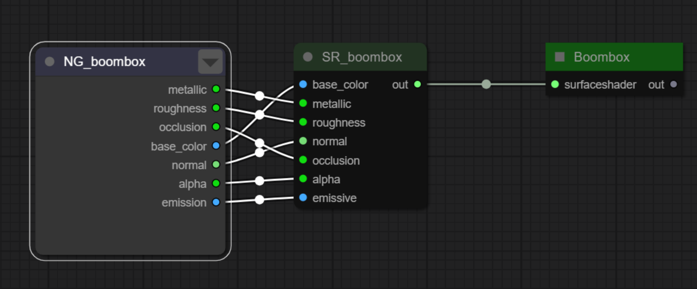
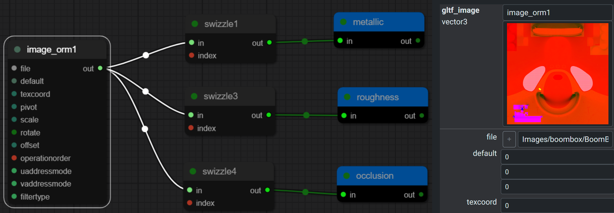
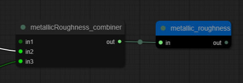
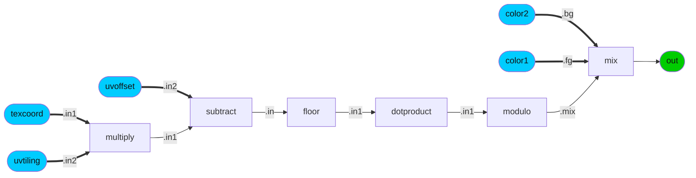
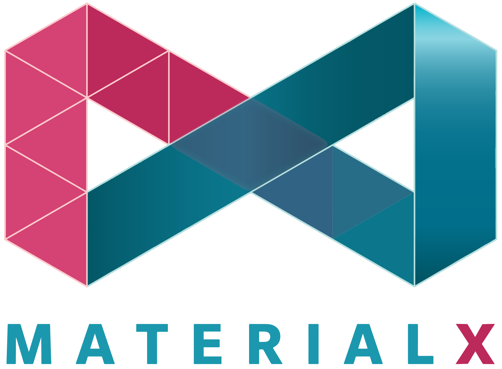
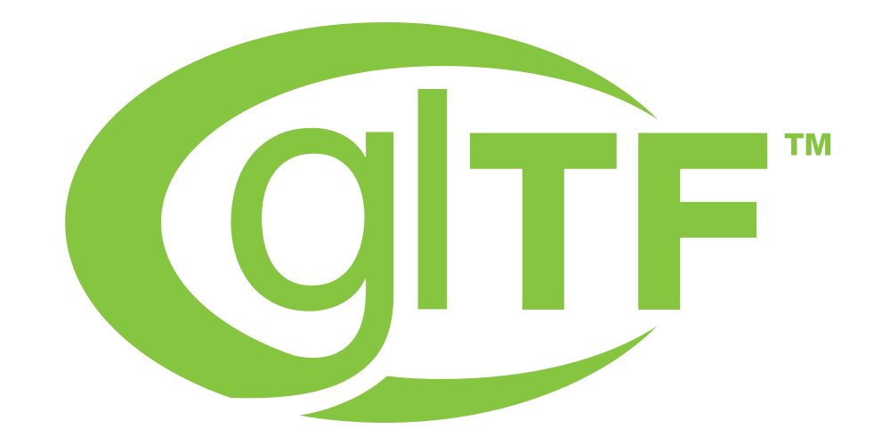

# EXT\_texture\_procedurals\_mx\_1\_39

## Contributors

- Ashwin Bhat, Autodesk, ashwin.bhat@autodesk.com
- Alexey Knyazev, Individual Contributor, [@lexaknyazev](https://github.com/lexaknyazev)
- Bernard Kwok, Individual Contributor, [@kwokcb](https://github.com/kwokcb)  
- Ed Mackey, AGI, [@emackey](https://twitter.com/emackey)
- Lutz Kettner, NVIDIA, lkettner@nvidia.com
- Richard Sahlin, IKEA [@rsahlin](https://github.com/rsahlin)
- Timothy Blut, NVIDIA, tblut@nvidia.com

Copyright 2024 The Khronos Group Inc.
See [Appendix](#appendix-full-khronos-copyright-statement) for full Khronos Copyright Statement.

## Status

Draft

## Dependencies

Written against the glTF 2.0 spec and KHR_texture_procedurals

## Overview

This extension provides a mechanism to author procedural pattern graphs using node elements defined in MaterialX Specification 1.39.

### Table of Contents

- [Motivation](#motivation)
- [Extension Declaration](#extension-declaration)
- [JSON Schema](#json-schema)
- [Example](#Example)
- [Resources](#resources)

### Motivation

While `KHR_texture_procedurals` defines the schema to represent a procedural graph to extend the capabilities of glTF materials beyond what is possible with traditional texture maps. 

For seamless interoperability this extension defines the schema for nodes or elements of the procedural graph. 

More specifically this extension defines support for nodes in the MaterialX 1.39 specification. This ensures that the procedural graphs can be easily converted to MaterialX and USDShade graphs.


## Extension Declaration

Usage of the procedural structure is indicated by adding the `EXT_texture_procedurals_mx_<version>` extension identifier to the `extensionsUsed` array. Where `<version>` corresponds to the MaterialX version separated by an underscores. For example version 1.39 is represented as `EXT_texture_procedurals_mx_1_39`.

It is required that `KHR_texture_procedurals` also be defined as this specifies the JSON schema for the procedural graphs.

Note that: 

1. This is the only location that the `EXT_texture_procedurals_mx_1_39` extension identifier is allowed
to be specified. The explicit meaning is that definitions from this version of MaterialX are used for the entire glTF asset. 

  Below is an example specifiy usage of MaterialX version 1.39.
  ```json
  {
      "extensionsUsed": [
          "KHR_texture_procedurals",
          "EXT_texture_procedurals_mx_1_39"
      ]
  }
  ``` 

2. It is invalid to specify more than one version of MaterialX in the same glTF asset.

Usage of a given extension is defined in the `extensions` object as follows:
```json
{
    "extensions": {
        "KHR_texture_procedurals": {
            "procedurals": []
        }
    }
}
```
The `procedurals` array specifies the procedural graphs for a given set of nodes that matching the MaterialX version specified.

## Handling MaterialX glTF PBR Nodes

The glTF PBR node specified within MaterialX exposes a number of input ports which may not map 1:1 with the glTF PBR material for texture mapping. That is, `texture_info` mappings in glTF PBR may not map directly to the input ports of the MaterialX PBR node.

One example is the mismatch of `metalicRoughnessTexture` which is a single packed 3 or 4  channel image which is minimally split into two input ports `metallic` and `roughness` on a glTF PBR shader in MaterialX.

Below is the Boombox glTF example as expressed in MaterialX. The top image shows the mapping to the shader port connects and the bottom a subgraph which shows how an ORM image is split to the `metallic` and `roughness` and `occlusion` ports.




Any channels mapped on the MaterialX glTF PBR node which do not correspond to a `texture_info` mapping should be ignored as being invalid or pre-processed to insert the appropriate node within the procedural graph to combine the outputs so that they are mappable. For the example, a `combine` node has been added. The 
split outputs can be reconstituted when converted back (e.g. to MaterialX) for an integration which uses separated inputs.



## JSON Schema

The JSON schema for this extension is defined in the schema folder. 

[material.EXT_texture_procedurals_mx_1_39.schema.json](schema/material.EXT_texture_procedurals_mx_1_39_schema.json)

## Example

The following is a "checkerboard" pattern which is defined as a procedural graph. This graph is mapped to the "base color" on a material.


<sub>Example `checkerboard` graph from MaterialX</sub>

<details>
<summary>glTF Graph</summary>

```JSON
{
  "materials": [
    {
      "name": "gltf_pbr_surfaceshader",
      "pbrMetallicRoughness": {
        "baseColorTexture": {
          "index": 0,
          "extensions": {
            "KHR_texture_procedurals": {
              "index": 0
            }
          }
        }
      }
    }
  ],
  "textures": [
    {
      "source": 0
    }
  ],
  "images": [
    {
      "uri": "data:image/png;base64,iVBORw0KGgoAAAANSUhEUgAAAAEAAAABCAIAAACQd1PeAAAADElEQVQI12P4z/AfAAQAAf/zKSWvAAAAAElFTkSuQmCC",
      "name": "KHR_texture_procedural_fallback"
    }
  ],
  "extensionsUsed": [
    "EXT_texture_procedurals_mx_1_39",
    "KHR_texture_procedurals"
  ],
  "extensions": {
    "KHR_texture_procedurals": {
      "procedurals": [
        {
          "name": "My_Checker",
          "nodetype": "nodegraph",
          "type": "color3",
          "inputs": [
            {
              "name": "color1",
              "nodetype": "input",
              "type": "color3",
              "value": [
                1.0,
                0.0,
                0.0
              ]
            },
            {
              "name": "color2",
              "nodetype": "input",
              "type": "color3",
              "value": [
                0.0,
                1.0,
                0.0
              ]
            },
            {
              "name": "uvtiling",
              "nodetype": "input",
              "type": "vector2",
              "value": [
                8.0,
                8.0
              ]
            },
            {
              "name": "uvoffset",
              "nodetype": "input",
              "type": "vector2",
              "value": [
                0.0,
                0.0
              ]
            }
          ],
          "outputs": [
            {
              "name": "out",
              "nodetype": "output",
              "type": "color3",
              "node": 5
            }
          ],
          "nodes": [
            {
              "name": "N_mtlxmult",
              "nodetype": "multiply",
              "type": "vector2",
              "inputs": [
                {
                  "name": "in1",
                  "nodetype": "input",
                  "type": "vector2",
                  "node": 6
                },
                {
                  "name": "in2",
                  "nodetype": "input",
                  "type": "vector2",
                  "input": 2
                }
              ],
              "outputs": [
                {
                  "nodetype": "output",
                  "name": "out",
                  "type": "vector2"
                }
              ]
            },
            {
              "name": "N_mtlxsubtract",
              "nodetype": "subtract",
              "type": "vector2",
              "inputs": [
                {
                  "name": "in1",
                  "nodetype": "input",
                  "type": "vector2",
                  "node": 0
                },
                {
                  "name": "in2",
                  "nodetype": "input",
                  "type": "vector2",
                  "input": 3
                }
              ],
              "outputs": [
                {
                  "nodetype": "output",
                  "name": "out",
                  "type": "vector2"
                }
              ]
            },
            {
              "name": "N_mtlxfloor",
              "nodetype": "floor",
              "type": "vector2",
              "inputs": [
                {
                  "name": "in",
                  "nodetype": "input",
                  "type": "vector2",
                  "node": 1
                }
              ],
              "outputs": [
                {
                  "nodetype": "output",
                  "name": "out",
                  "type": "vector2"
                }
              ]
            },
            {
              "name": "N_mtlxdotproduct",
              "nodetype": "dotproduct",
              "type": "float",
              "inputs": [
                {
                  "name": "in1",
                  "nodetype": "input",
                  "type": "vector2",
                  "node": 2
                },
                {
                  "name": "in2",
                  "nodetype": "input",
                  "type": "vector2",
                  "value": [
                    1.0,
                    1.0
                  ]
                }
              ],
              "outputs": [
                {
                  "nodetype": "output",
                  "name": "out",
                  "type": "float"
                }
              ]
            },
            {
              "name": "N_modulo",
              "nodetype": "modulo",
              "type": "float",
              "inputs": [
                {
                  "name": "in1",
                  "nodetype": "input",
                  "type": "float",
                  "node": 3
                },
                {
                  "name": "in2",
                  "nodetype": "input",
                  "type": "float",
                  "value": 2.0
                }
              ],
              "outputs": [
                {
                  "nodetype": "output",
                  "name": "out",
                  "type": "float"
                }
              ]
            },
            {
              "name": "N_mtlxmix",
              "nodetype": "mix",
              "type": "color3",
              "inputs": [
                {
                  "name": "bg",
                  "nodetype": "input",
                  "type": "color3",
                  "input": 1
                },
                {
                  "name": "fg",
                  "nodetype": "input",
                  "type": "color3",
                  "input": 0
                },
                {
                  "name": "mix",
                  "nodetype": "input",
                  "type": "float",
                  "node": 4
                }
              ],
              "outputs": [
                {
                  "nodetype": "output",
                  "name": "out",
                  "type": "color3"
                }
              ]
            },
            {
              "name": "texcoord",
              "nodetype": "texcoord",
              "type": "vector2",
              "inputs": [
                {
                  "name": "index",
                  "nodetype": "input",
                  "type": "integer",
                  "value": 1
                }
              ],
              "outputs": [
                {
                  "nodetype": "output",
                  "name": "out",
                  "type": "vector2"
                }
              ]
            }
          ]
        }
      ]
    }
  }
}
```

</details>
<p>

The equivalent MaterialX representation is:

<details>
<summary>MaterialX Graph</summary>

```XML
<?xml version="1.0"?>
<materialx version="1.38">
  <nodegraph name="My_Checker">
    <input name="color1" type="color3" uiname="Color 1" value="1, 0, 0" doc="The first color used in the checkerboard pattern." />
    <input name="color2" type="color3" uiname="Color 2" value="0, 1, 0" doc="The second color used in the checkerboard pattern."  />
    <input name="uvtiling" type="vector2" uiname="UV Tiling" value="8, 8" doc="The tiling of the checkerboard pattern along each axis, with higher values producing smaller squares. Default is (8, 8)." />
    <input name="uvoffset" type="vector2" uiname="UV Offset" value="0, 0" doc="The offset of the checkerboard pattern along each axis. Default is (0, 0)." />
    <multiply name="N_mtlxmult" type="vector2" >
      <input name="in1" type="vector2" nodename="texcoord" />
      <input name="in2" type="vector2" interfacename="uvtiling" />
    </multiply>
    <subtract name="N_mtlxsubtract" type="vector2">
      <input name="in1" type="vector2" nodename="N_mtlxmult" />
      <input name="in2" type="vector2" interfacename="uvoffset" />
    </subtract>
    <floor name="N_mtlxfloor" type="vector2">
      <input name="in" type="vector2" nodename="N_mtlxsubtract" />
    </floor>
    <dotproduct name="N_mtlxdotproduct" type="float">
      <input name="in1" type="vector2" nodename="N_mtlxfloor" />
      <input name="in2" type="vector2" value="1, 1" />
    </dotproduct>
    <modulo name="N_modulo" type="float">
      <input name="in1" type="float" nodename="N_mtlxdotproduct" />
      <input name="in2" type="float" value="2" />
    </modulo>
    <mix name="N_mtlxmix" type="color3">
      <input name="bg" type="color3" interfacename="color2" />
      <input name="fg" type="color3" interfacename="color1" />
      <input name="mix" type="float" nodename="N_modulo" />
    </mix>
    <output name="out" type="color3" nodename="N_mtlxmix"/>
    <texcoord name="texcoord" type="vector2">
      <input name="index" type="integer" value="1" />
    </texcoord>
  </nodegraph>
  <gltf_pbr name="gltf_pbr_surfaceshader" type="surfaceshader" >
    <input name="base_color" type="color3" nodegraph="My_Checker" />
  </gltf_pbr>
  <surfacematerial name="surfacematerial" type="material">
    <input name="surfaceshader" type="surfaceshader" nodename="gltf_pbr_surfaceshader" />
  </surfacematerial>
</materialx>
```

</details>

<p>
The OpenUSD representation looks like this:

<details>
<summary>OpenUSD Graph</summary>

```c++
def "NodeGraphs"
    {
        def Shader "N_mtlxmix"
        {
            uniform token info:id = "ND_mix_color3"
            color3f inputs:bg = (0, 0, 0)
            color3f inputs:fg = (1, 1, 1)
            float inputs:mix = 0
            float inputs:mix.connect = </MaterialX/NodeGraphs/N_modulo.outputs:out>
            color3f outputs:out
        }

        def Shader "N_mtlxdotproduct"
        {
            uniform token info:id = "ND_dotproduct_vector2"
            float2 inputs:in1 = (0, 0)
            float2 inputs:in1.connect = </MaterialX/NodeGraphs/N_mtlxfloor.outputs:out>
            float2 inputs:in2 = (1, 1)
            float outputs:out
        }

        def Shader "N_mtlxmult"
        {
            uniform token info:id = "ND_multiply_vector2"
            float2 inputs:in1 = (0, 0)
            float2 inputs:in1.connect = </MaterialX/NodeGraphs/Texcoord.outputs:out>
            float2 inputs:in2 = (8, 8)
            float2 outputs:out
        }

        def Shader "N_mtlxsubtract"
        {
            uniform token info:id = "ND_subtract_vector2"
            float2 inputs:in1 = (0, 0)
            float2 inputs:in1.connect = </MaterialX/NodeGraphs/N_mtlxmult.outputs:out>
            float2 inputs:in2 = (0, 0)
            float2 outputs:out
        }

        def Shader "N_mtlxfloor"
        {
            uniform token info:id = "ND_floor_vector2"
            float2 inputs:in = (0, 0)
            float2 inputs:in.connect = </MaterialX/NodeGraphs/N_mtlxsubtract.outputs:out>
            float2 outputs:out
        }

        def Shader "N_modulo"
        {
            uniform token info:id = "ND_modulo_float"
            float inputs:in1 = 0
            float inputs:in1.connect = </MaterialX/NodeGraphs/N_mtlxdotproduct.outputs:out>
            float inputs:in2 = 2
            float outputs:out
        }

        def Shader "Texcoord"
        {
            uniform token info:id = "ND_texcoord_vector2"
            int inputs:index = 0
            float2 outputs:out
        }
    }
```

</details>

#### Checkerboard Variants

In the example below we create variants by declaring custom `checkerboard definition and using instances of this definition instances within a graph.

The inputs on each node instance are specified to to create a “red” and “green” variants.

<details>
<summary>Variants</summary>

```JSON
{
 "procedurals": [
   // Checkerboard variants graph 
   {      
     "name": "checkboard_variants",
     "nodetype": "nodegraph",
      "nodes": [
        {
          "name": "green_checkerboard",
          "nodetype": "checkerboard", 
          "type": "color3",
          "inputs": [
            {
              "name": "color1",
              "type": "color3",
              "value": [
                0,
                1,
                0
              ]
            }
          ],
          "outputs": [
            {
              "name": "out",
              "type": "color3"
            }
          ]
        },
        {
          "name" : "red_checkboard",
          "nodetype": "checkerboard",
          "type": "color3",
          "inputs": [
            {
              "name": "color1",
              "type": "color3",
              "value": [
                1,
                0,
                0
              ]
            }
          ],
          "outputs": [
            {
              "name": "out",
              "type": "color3"
            }
          ]
        }
      ],
        // Route the outputs of the checkerboard nodes
        "outputs": [
        {
          "name": "green_out",
          "type": "color3",
          "node": 0
        },
        {
          "name": "red_out",
          "type": "color3",
          "node": 1
        }
      ]    
   }
 ]
}
```

</details>
<br>
These procedural graphs can be bound to downstream materials as desired by choosing the appropriate output node.

<details>
<summary>Variant Binding</summary>

```JSON
{
 // Material references
 "materials": [
   {
     "name": "green_checker",
     "pbrMetallicRoughness": {
       "baseColorTexture": {
         "index": 0,
         "extensions": {
           "KHR_texture_procedurals": {
             "index": 0, // graph with variants
             "output": 0 // "green checker" variant
           }
         }
       }
     },
     "name": "red_checker",
     "pbrMetallicRoughness": {
       "baseColorTexture": {
         "index": 0,
         "extensions": {
           "KHR_texture_procedurals": {
             "index": 0, // graph with variants
             "output": 1 // "red checker" variant
           }
         }
       }
     }
   }
 ]
}
```

</details>

## Resources

- [MaterialX Specification Documents](https://github.com/AcademySoftwareFoundation/MaterialX/blob/main/documents/Specification/MaterialX.Specification.md). 
- OpenUSD
  - [USDShade Schema](https://openusd.org/dev/api/usd_shade_page_front.html)
  - [Shader Definition Registry](https://openusd.org/docs/api/sdr_page_front.html)
- glTF
  - [glTF stream names](https://registry.khronos.org/glTF/specs/2.0/glTF-2.0.html). Note that currently there are no stream names for multiple sets of _tangents_, _bitangents_, _normals_ or _positions_.

### glTF Versus MaterialX and OpenUSD

The aim is (as  much as possible) to preserve the"simplest" most consistent conventions from glTF, MaterialX and OpenUSD.

| Feature |  |  |  |
| --- | --- | --- | --- |
| **Object String Identifiers** | Yes | Yes | Optional |
| **Numeric Tuples** | string | list () | array [] |
| **Connection Syntax**" | string (name in context) | Absolute Path | numeric index |
| **Explicit Node Outputs** | No | Yes | Yes |
| **Node Type Grouping** | No | No | Yes |
| **Reference to nodedef on node instance** | Yes | Yes | No |
| **NodeGraph Nesting** | "Yes" (not implemented) | Yes | No |
| **Optional Input Overrides on Nodes** | Yes | Yes | Yes |
| **Referencing** | Yes | Yes | No |
| **Definition Versioning** | Yes | Yes | Yes |
| **Meta-Data** | Yes | Yes | Yes |
| **Node Definition** | Yes | Yes | Yes |

## Appendix: Full Khronos Copyright Statement

Copyright 2024 The Khronos Group Inc.

This Specification is protected by copyright laws and contains material proprietary to Khronos. Except as described by these terms, it or any components may not be reproduced, republished, distributed, transmitted, displayed, broadcast or otherwise exploited in any manner without the express prior written permission of Khronos.

Khronos grants a conditional copyright license to use and reproduce the unmodified Specification for any purpose, without fee or royalty, EXCEPT no licenses to any patent, trademark or other intellectual property rights are granted under these terms.

Khronos makes no, and expressly disclaims any, representations or warranties, express or implied, regarding this Specification, including, without limitation: merchantability, fitness for a particular purpose, non-infringement of any
intellectual property, correctness, accuracy, completeness, timeliness, and reliability. Under no circumstances will Khronos, or any of its Promoters, Contributors or Members, or their respective partners, officers, directors, employees, agents or representatives be liable for any damages, whether direct, indirect, special or consequential damages for lost revenues, lost profits, or otherwise, arising from or in connection with these materials.

This specification has been created under the Khronos Intellectual Property Rights Policy, which is Attachment A of the Khronos Group Membership Agreement available at https://www.khronos.org/files/member_agreement.pdf. Khronos grants a conditional copyright license to use and reproduce the unmodified specification for any purpose, without fee or royalty, EXCEPT no licenses to any patent, trademark or other intellectual property rights are granted under these terms. Parties desiring to implement the specification and make use of Khronos trademarks in relation to that implementation, and receive reciprocal patent license protection under the Khronos IP Policy must become Adopters and confirm the implementation as conformant under
the process defined by Khronos for this specification; see https://www.khronos.org/conformance/adopters/file-format-adopter-program.

Where this Specification identifies specific sections of external references, only those specifically identified sections define normative functionality. The Khronos Intellectual Property Rights Policy excludes external references to materials and associated enabling technology not created by Khronos from the Scope of this Specification, and any licenses that may be required to implement such referenced materials and associated technologies must be obtained separately and may involve royalty payments.

Khronos® is a registered trademark, and glTF™ is a trademark of The Khronos Group Inc. All other product names, trademarks, and/or company names are used solely for identification and belong to their respective owners.
