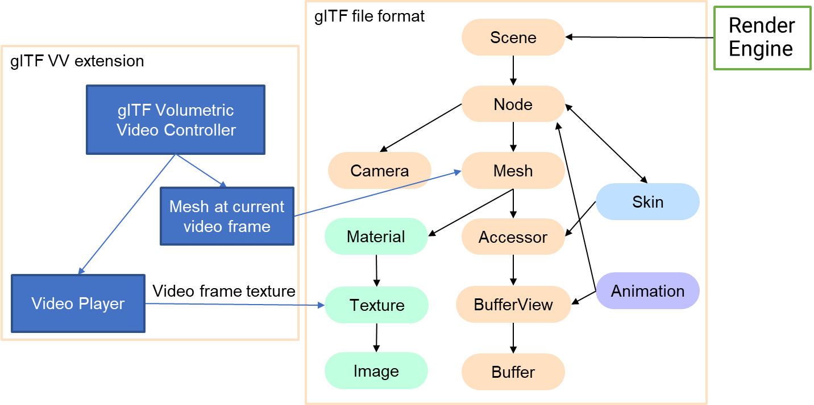

# EXT_volumetricvideo

## Contributors

* Kit Yung Lam, HSLU, kityung.lam@hslu.ch
* Smolic Aljosa, HSLU, aljosa.smolic@hslu.ch
* Croci Simone, HSLU, simone.croci@hslu.ch
* Haslbauer Philipp, HSLU, philipp.haslbauer@hslu.ch

## Status

Proposal

## Dependencies

Written against the glTF 2.0 spec.

## Overview
This extension is designed for simple playback of mesh based Volumetric Video in form of a video textures apply to a sequence of 3D meshes, to enable Volumetric Video playback with the glTF 2.0 standard.

Typically, glTF renderer only shows the node elements with meshID specified in the scene description. Despite the mesh elements included in the glTF file,  the mesh elements absent in the scene and node structure will be ignored. We apply this feature to achieve efficient playback of Volumetric Video with glTF. 

Same as other 3D mesh in the glTF file, all meshes of a Volumetric Video sequence are stored in the glTF buffer, but only one mesh should be displayed per video frame in the Volumetric Video node and apply the corresponding video texture to it, controlled by the video playback.

A Volumetric Video controller should be developed with the glTF 3D render engine, and control the Volumetric Video playback as shown as below structure. It creates a 3D object for the node contains EXT_volumetricvideo extension and switches the mesh following the video playback, get the video texture from video player and apply it to the Volumetric Video mesh material,
<p align="center">

</p>

Certain research works generate 3D meshes with textures from images, including PIFu and ICON. When it comes to video, these works can generate mesh and texture sequences that, when combined with this extension, can be created as Volumetric Video.

### Volumetric Video Properties

The Volumetric Video node contains EXT_volumetricvideo extension properties, which keeps the MPEG media information including the media URI address and a list of mesh IDs in `meshAccessorList` corresponding to the sequence of the video. 

| Property | Type| Description | Required |
|:---------|:----|:------------|:---------|
| `MPEG_media` | MPEG_media | provides an array of MPEG media items referenced by Volumetric Video controller.| No |
| `meshAccessorList` |integer[1-*]| The ID of the meshes that belong to the Volumetric Video node. | Yes |
| `meshStep` |integer[1-*]| The number of video frames texture apply to each Volumetric Video mesh. | No |

## Adding Volumetric Video Instances to Nodes
 
A Volumetric Video node has the `extensions.EXT_volumetricvideo` property and, within that, `meshAccessorList` array contains a list of `meshID` property  . Optionally, the `MPEG_media` properties can be defined to provide additional information of video textures. 
```javascript
  "extensions": {
        "EXT_volumetricvideo": {
          "mpeg_media": {
            "MPEG_media": {
              "name": "Levi",
              "media": [
                {
                  "name": null,
                  "startTime": 0,
                  "startTimeOffset": 0,
                  "endTimeOffset": 0,
                  "autoplay": true,
                  "autoplayGroup": 0,
                  "loop": true,
                  "controls": false,
                  "alternatives": [
                    {
                      "uri": "Levi.mp4",
                      "mimeType": "video/mp4",
                      "tracks": [
                        {
                          "track": "track",
                          "codec": "h264"
                        }
                      ]
                    }
                  ]
                }
              ]
            }
          },
          "meshAccessorList": [
            1,
            2,
            3,
            ...
            149,
          ],
          "meshStep":[
            2
          ]
        }
      }
```
## Defining Volumetric Video Mesh Accessor List and MPEG_media
The Volumetric Video glTF exporter should assign a unique mesh ID and primitive description for each Volumetric Video mesh frame in the glTF file, add the mesh IDs to the Volumetric Video Mesh Accessor List and export the list to this extension. The list provides mesh accessor Ids for Volumetric Video controller to import the right Volumetric Video meshes from the 3D scenes containing other non-Volumetric Video meshes. 

The textures of each meshes should be collected together and exported as texture video with the codec and format supported by the video player in glTF renderer. The texture video information such as the codec and URI address should be recorded to the MPEG_media extension and export to this extension.

## Implementation Details

We modified the official [UnityGLTF plugin](https://github.com/KhronosGroup/UnityGLTF) to export and import mesh based Volumetric Video in glTF file format with this extension. The Unity project can be found in [irc-hslu/EXTVolumetricVideoUnity](https://github.com/irc-hslu/EXTvolumetricvideoUnity)

The Volumetric Video controller was written in Unity 3D Csharp script. It creates the 3D object with the Volumetric Video node configuration. It get the video address from MPEG_media and uses the Unity 3D video player component to playback the texture video. For each video frame update, 
Volumetric Video controllers retrieve mesh IDs from Mesh Accessor List with the video frame index. Next, it obtains the mesh data from glTF importer and assigns the mesh data to the 3D object mesh filter. The mesh data will be keep in cache for faster loading time. It converts the video frame to texture and assigns them to the material of the 3D object. 
 
* The 3D object created by the controller and its all mesh frames will inherit the transform of the node. 
* The mesh should update immediately follow the video frame rate of the texture video, then the playback speed should be able to adjust as usual as the 2D video. 
* meshStep is optional; by default, each video texture frame applies to one mesh. When it comes to array data, its length ought to match that of meshAccessorList.
 

## JSON Schema

* [gltf.EXT_volumetricvideo.scheme.json](schema/gltf.EXT_volumetricvideo.scheme.json)

## Resources

* [glTF 2.0 Extensions in MPEG and 3GPP � Real-time exchange formats for 3D Experiences, IES Computer Committee](https://www.khronos.org/assets/uploads/developers/presentations/glTF_2.0_Extensions_in_MPEG_and_3GPP_.pdf)

