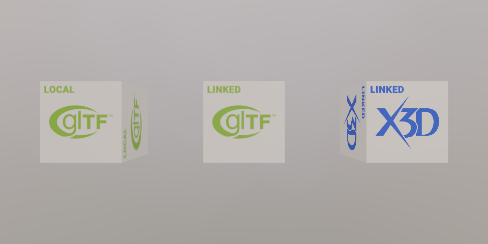

# FRAUNHOFER_external_model

## Contributors

* Johannes Behr, Threedy GmbH, [@jbehr](https://github.com/jbehr)
* Timo Sturm, Threedy GmbH, [@tsturm](https://github.com/tsturm)
* Manuel Olbrich, Fraunhofer IGD [@dschie](https://github.com/dschie)

## Status

Fraunhofer Vendor Extension - Currently supported by [X3DOM](https://github.com/x3dom/x3dom) 1.8.0+ and [instant3Dhub](https://www.threedy.io/) 3.0.0+.

## Dependencies

Written against the glTF 2.0 spec.

## Overview

State representation containing domain related payload and links to further resources are the key concept of data on the web. The abstract RFC2077 [1] definition for the “model/\*” domain include 3D objects as payload and links inside the “model/\*” domain. Some registered standards (e.g. X3D) include links to other 3D-Models as base concepts. 

Those links allow a natural distribution of 3d data into more than one resource which support different change rates, reuse and logical packaging. 

Unfortunately referencing external models is not provided by the current glTF Specification. With our FRAUNHOFER_external_model extension we want to propose a simple way to support this.

Client implementations of the FRAUNHOFER_external_model extension must support at least one glTF format but can support and negotiate any number of glTF and non-glTF encodings as long as those follow
* the abstract model definition RFC2077 [1],
* provide a registered content type (e.g. model/gltf+json) [2]
* and can be determinate with some form of content negotiation [3].

Figure 1 shows a screenshot of our public available FRAUNHOFER_external_model [example](https://examples.x3dom.org/FRAUNHOFER_external_model/).

<figure>

<figcaption><em>Figure 1: A glTF with FRAUNHOFER_external_model extension loaded in X3DOM. Left: local glTF mesh. middle: external glTF model, right: external X3D model (content negotiation).</em></figcaption>
</figure>

## glTF Schema Updates

The proposed extension requires only a small amount of glTF Schema Updates.

### Model Storage

Models are stored in the newly introduced models array of the asset.

Where each model contains one of

* a URI to an external file in one of the supported model formats, or
* a URI with embedded base64-encoded data, or
* a reference to a bufferView; in that case mimeType must be defined.
  
The following example shows three different ways of defining a model.
* The first model is defined as a direct link to an external glTF file.
* The second model is also defined as a direct link to an external model file, but without any suffix. This allows the Loader to use content negotiation [3] to fetch a preffered model format.
* The third model is defined as a reference to a bufferview which contains glTF-Binary data.

```
"models":
[
    {
        "uri": "https://modeldatabase.io/primitives/box.gltf"
    },
    {
        "uri": "https://modeldatabase.io/primitives/box"
    },
    {
        "bufferView": 33,
        "mimeType" : "model/gltf-binary"
    }
]
```

> **Implementation Note:** When model data is provided by uri and mimeType is defined, client implementations should prefer JSON-defined MIME Type over one provided by transport layer.

### Model Instantiation

A model is instantiated by node.model property. The same model could be used by many nodes, which could have different transformations. For example:

```
"nodes":
[
    {
        "name": "Untransformed External Model",
        "model": 0
    },
    {
        "name": "Transformed External Model",
        "model": 0,
        "translation": [
            20,
            0,
            0
        ]  
    }
]
```

### JSON Schema

* [glTF.schema.json](schema/glTF.schema.json)
* [model.schema.json](schema/model.schema.json)
* [node.schema.json](schema/node.schema.json)

## Known Implementations

* [X3DOM](https://github.com/x3dom/x3dom) 1.8.0+
* [instant3Dhub](https://www.threedy.io/) 3.0.0+

## Resources

* [1] RFC2077. 1997. Model Primary Content Type. (1997). Retrieved Jan 28, 2018 from https://tools.ietf.org/html/rfc2077
* [2] IANA. 2018. IANA Model Registration. (2018). Retrieved Jan 28, 2018 from https://www.iana.org/assignments/media-types/media-types.xhtml#model
* [3] HTTP. 2018. HTTP Content Negotiation. (2018). Retrieved Jan 28, 2018 from https://www.w3.org/Protocols/rfc2616/rfc2616-sec12.html
* [4] Johannes Behr, Max Limper, and Timo Sturm. 2018. MoST: a 3D web architectural style for hybrid model data. In Proceedings of the 23rd International ACM Conference on 3D Web Technology (Web3D '18). ACM, New York, NY, USA, Article 21, 8 pages. DOI: https://doi.org/10.1145/3208806.3208823
