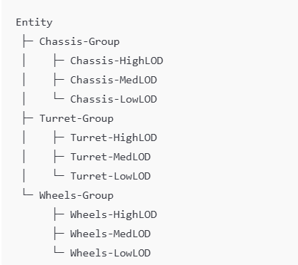
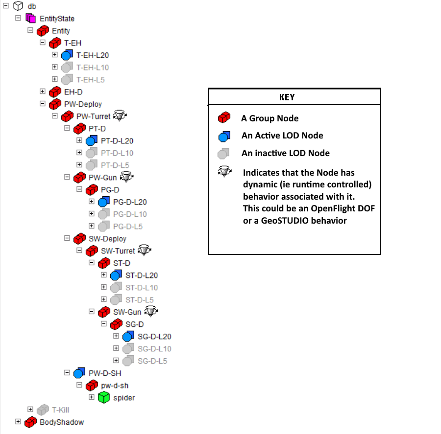
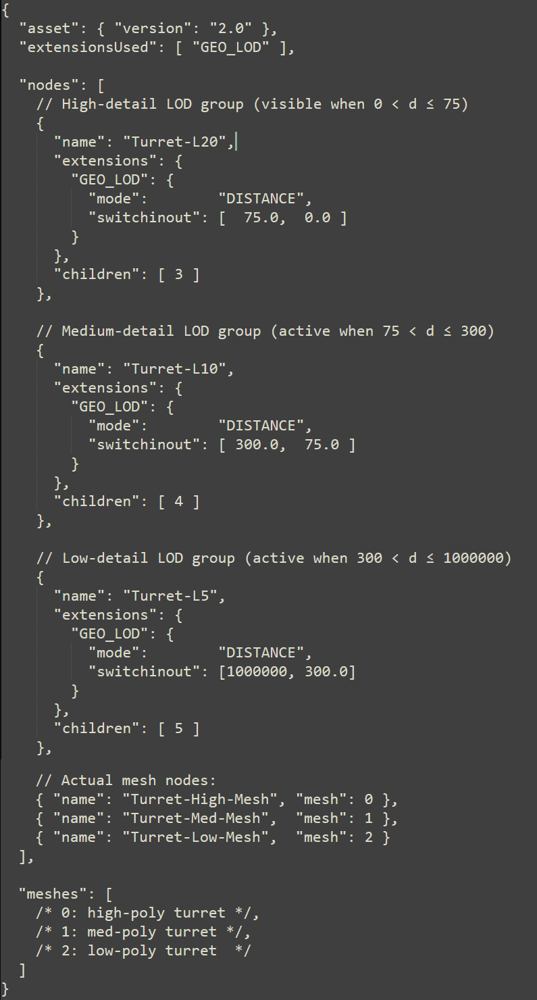
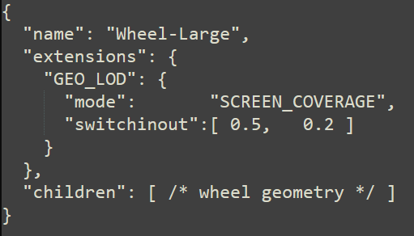
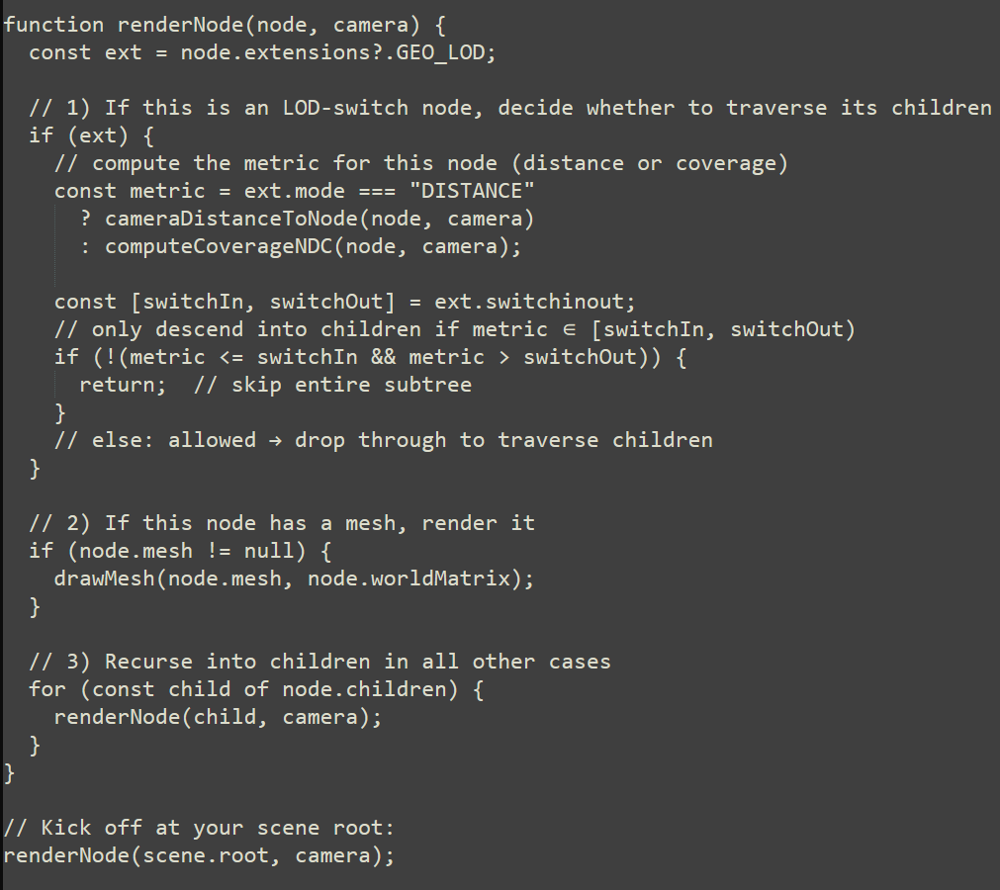

# Bringing OpenFlight/GeoSTUDIO-Style, Per-Part LODs into glTF with GEO_LOD

In visual-simulation toolchains (e.g. OpenFlight/Aechelon/Geo STUDIO), it’s routine to define per-part LOD variants directly in the model hierarchy. You might have a tank’s chassis split into high/med/low meshes under one grouping node, its turret under another, its wheels under yet another—all within a single file. No “root-only” swapping, and no need to carve your model into separate glTFs for each LOD.
By contrast, glTF’s built-in LOD patterns (e.g. MSFT_lod) expect a single node that is the LOD switcher, listing mesh indices. That works, but it can’t express “here’s a chassis, with three mesh children,” or “here’s a turret behavior, with its own LOD children,” in one neat file.
Enter GEO_LOD—a small vendor extension that you attach to any grouping node (having no mesh of its own) whose children (the entire sub-tree parented by the LOD node) are considered the LOD variant for that part. Your loader/runtime software then simply activates that LOD node (and its children) based on it passing the distance or screen-coverage switchin & switchout criteria. Any dynamic transformation applied above the LOD in the hierarchy will automatically be applied to the active LOD.

                                          
Each “Group” (in the above example) has no mesh itself. Holds three mesh-children for each LOD, and you can still animate or transform the group (rotate turret, deploy wheels, etc.) without rebinding when the LOD changes. 
The following Geo STUDIO snapshot shows a more complex tank model as seen in Geo's tree view...
                     
 

## Proposed JSON-Schema
For the full machine-readable JSON Schema, see  
[`schema.json`](schema.json)

 
mode chooses your LOD metric
switchinout = [ switchIn, switchOut ], with hysteresis built-in

## Authoring Example (DISTANCE)
 

## Authoring Example (SCREEN_COVERAGE)
 

## Runtime pseudocode
 

## Why this works

LOD nodes (with GEO_LOD) are pure grouping: no drawMesh call on them, they just gate traversal.
Mesh nodes (without GEO_LOD) always render when reached.
Nested LODs are supported naturally—if you have a behavior node above, you’ll traverse into it, hit its LOD child only when its thresholds match, and then render that child’s mesh subtree.
Overlaps/blends happen automatically if two sibling LOD?groups both pass their tests—you could extend drawMesh to cross-fade in that case, or add extra logic in the traversal.
This pattern exactly matches how GeoSTUDIO /OpenFlight engines embed LOD logic in grouping nodes and prune the tree as they walk it (building per-frame renderables).

## Lastly

I believe the introduction of this simple extension would hasten the adoption of glTF in the military training and simulation market -bringing with it all the inherent benefits of glTF/glb to that space.

Creator, and OpenFlight were developed by, and are registered trademarks of, Multigen-Paradigm (MPI) & currently maintained by Presagis Inc.