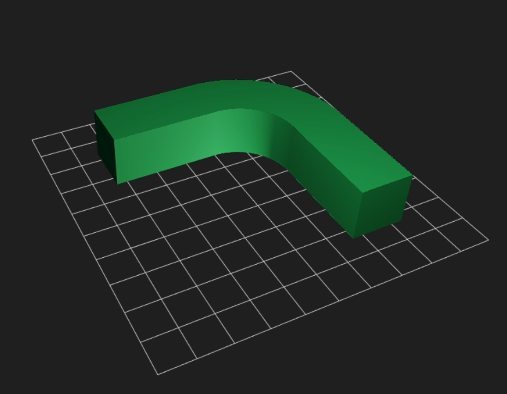
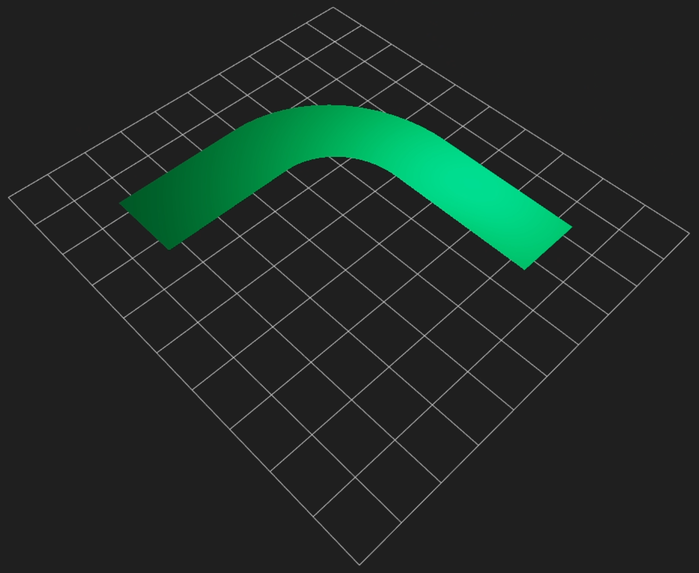
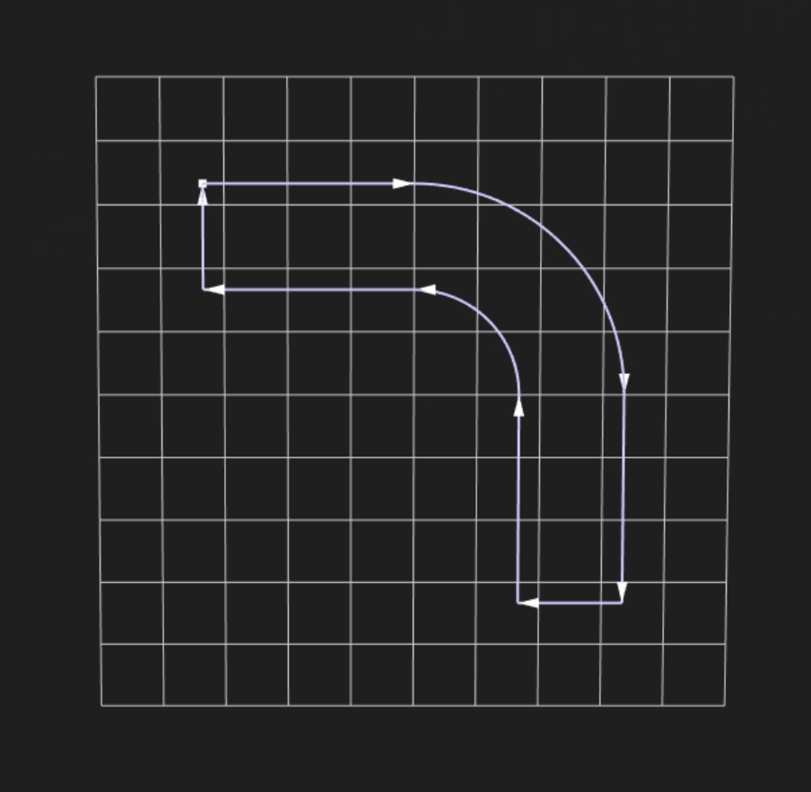

# KITTYCAD\_boundary\_representation

## Contributors

* David Harvey-Macaulay, KittyCAD [@alteous](https://github.com/alteous)

## Status

Draft

## Dependencies

Written against the glTF 2.0 spec.

## Overview

A [boundary representation](https://en.wikipedia.org/wiki/Boundary_representation) (abbreviated as 'B-rep') provides an exact definition of solid volumes. B-reps can represent smooth surfaces such as spheres more precisely than polygonal meshes.

B-reps must be tessellated to be able to be rendered using standard graphics APIs such as Vulkan and OpenGL. For this reason, this extension is intended to be used as supplementary information to meshes. Alternatively, to reduce the file size, solids defined using this extension may be used in place of meshes; in this case, the extension must be listed in the `extensionsRequired` property.

### Basic usage

#### Instantiation of a mesh with supplementary B-rep information.

```json
{
    "meshes": [
        {
           "name": "a normal mesh approximating a solid volume",
           ...
        }
    ],
    "nodes": [
        {
            "mesh": 0,
            "extensions": {
                "KITTYCAD_boundary_representation": {
                    "solid": 0
                }
            }
        }
    ]
    "extensionsUsed": [
        "KITTYCAD_boundary_representation"
    ],
    "extensions": {
        "KITTYCAD_boundary_representation": {
            "solids": [
                {
                    "name": "a B-rep expressing an exact solid volume",
                    "mesh": 0,
                    ...
                }
            ],
            ...
        }
    }
}
```

Solids are instantiated in the same way as meshes; however, applications are free to process either the mesh or the B-rep. In this case, `"KITTYCAD_boundary_representation"` must appear under `extensionsUsed` but not under `extensionsRequired`.

#### Instantiation of a solid without a mesh approximation

```json
{
    ...,
    "nodes": [
        {
            "extensions": {
                "KITTYCAD_boundary_representation": {
                    "solid": 0
                }
            }
        }
    ]
    "extensionsUsed": ["KITTYCAD_boundary_representation"],
    "extensionsRequired": ["KITTYCAD_boundary_representation"],
    "extensions": {
        "KITTYCAD_boundary_representation": {
            "solids": [
                {
                    "name": "a B-rep expressing an exact solid volume",
                    ...
                }
            ],
            ...
        }
    }
}
```

The file size may be reduced by omitting the mesh approximation. In this case, `"KITTYCAD_boundary_representation"` must appear under both `extensionsUsed` and `extensionsRequired`. Applications process B-rep data directly.

Note: conversion from B-rep to mesh is a non-trivial operation. Mesh approximations should be provided for optimal interoperability.

#### Root extension structure

Boundary representation data extends the root data structure of the JSON portion of the glTF document. Each entry at the root may be referenced by index by other data structures.

```json
{
    ...,
    "extensions": {
        "KITTYCAD_boundary_representation": {
            "solids": [],
            "shells": [],
            "faces": [],
            "loops": [],
            "edges": [],
            "vertices": [],
            "curves2D": [],
            "curves3D": [],
            "surfaces": []
        }
    }
}
```

The `shells`, `faces`, `loops`, and `edges` arrays define _orientable_ objects. An important detail of this extension is that orientable objects are referenced along with their desired orientation using a pair of integers: the first is the index and the second the desired orientation represented by ±1.

```json
{
    ...,
    "extensions": {
        "KITTYCAD_boundary_representation": {
            ...,
            "faces": [
                {
                    "loops": [[0, 1]],
                    "surface": [0, 1]
                }
            ],
            "loops": [
                {
                    "edges": [[0, 1], [1, 1], [2, -1]]
                }
            ],
            "edges": [
                {
                    "start": 0,
                    "end": 1,
                    "curve": [0, 1]
                    "t": [-1, 1]
                },
                {
                    "start": 1,
                    "end": 2,
                    "curve": [1, 1],
                    "t": [0, 2.236]
                },
                {
                    "start": 0,
                    "end": 2,
                    "curve": [2, -1],
                    "t": [0, 2.236]
                }
            ],
            "curves": [
                {
                    "type": "line",
                    "line": {
                        "origin": [0, -1, 0],
                        "direction": [1, 0, 0]
                    }
                },
                {
                    "type": "line",
                    "line": {
                        "origin": [1, -1, 0],
                        "direction": [-0.4472, 0.8944, 0]
                    }
                },
                {
                    "type": "line",
                    "line": {
                        "origin": [0, 1, 0],
                        "direction": [-0.4472, -0.8944, 0]
                    }
                }
            ],
            "surfaces": [
                {
                    "type": "plane",
                    "origin": [0, 0, 0],
                    "xAxis": [1, 0, 0],
                    "yAxis": [0, 1, 0]
                }
            ],
            "vertices": [
                [-1, -1, 0],
                [1, -1, 0],
                [0, 1, 0]
            ]
        }
    }
}
```

This example demonstrates how a single triangle could be represented using the B-rep method, demonstrating the use of index/orientation pairs for same-sense and reverse-sense orientation.

Note: this is an incomplete example as a single triangle is insufficient to represent a solid volume.

## Boundary Representation Concepts

### Solid



A _solid_ represents a single volume of solid material. The boundary of the volume is called the solid's _outer shell_. In addition to its outer shell, a solid may have internal hollow regions; such regions are called _inner shells_. Both outer shells and inner shells are represented by the `Shell` data structure.

#### Example

The interior hollow space of a tennis ball would be represented by an inner shell. The surface of the tennis ball would be represented by its outer shell.


### Shell

A _shell_ is a collection of _faces_ in 3D space which form a 'watertight' volume. A shell is represented by the `Shell` data structure.

### Face

A _face_ is a portion of a _surface_ in 3D space. Multiple faces are referenced to form _shells_.

Faces are associated with the 3D surface they are defined on. The boundary of faces are defined by a set of _edges_ which form a closed _loop_ in 3D space, following the contours of its associated surface. The boundary of a face is defined by its _outer loop_. In a similar manner to _shells_, faces may have internal hollow regions; such regions are called _inner loops_. Both outer loops and inner loops are represented by the `Loop` data structure.



#### Example

This face is formed by a closed loop of 3D curves which are coincident to its associated planar surface. The grid visualizes the associated planar surface.

### Loop

A _loop_ is a set of _edges_ that combine to form a closed circuit. Edges are referenced in the loop so that their direction may be reversed.



### Curve

A _curve_ defines a function that evaluates a single parameter to a point in either 2D or 3D space, depending on context.

Curves are referenced by _edges_ to define the boundary between _faces_ in 3D space. Supplementary curves may be referenced by _loops_ to define the same boundary between _faces_ in 2D _surface_ parameter space.

#### Base structure

```json
{
  "type": "curveType",
  "curveType": {
    "curveSpecificValue": 1
  }
}
```

#### Line

```json
"line": {
  "origin": [-1, -1, -1],
  "direction": [1, 1, 1],
}
```

#### Circle


```json
"circle": {
  "radius": 1,
  "origin": [0, 0, 0],
  "xAxis": [0, 0, 1],
  "yAxis": [1, 0, 0]
}
```

#### [NURBS](https://en.wikipedia.org/wiki/Non-uniform_rational_B-spline)
    
```json
"nurbs": {
  "controlPoints": [
    [1.0, 0.0, 0.0],
    [1.0, 1.0, 0.0],
    [0.0, 1.0, 0.0]
  ],
  "knotVector": [0, 0, 0, 1, 1, 1],
  "order": 3,
  "weights": [1.0, 0.7071, 1.0]
}
```

## Surface

A _surface_ defines a function that evaluates two parameters to a point in 3D space.

Surfaces are referenced by _faces_ to define the implicit geometry bounded by _loops_.

#### Base structure

```json
{
  "type": "surfaceType",
  "surfaceType": {
    "surfaceSpecificValue": 1
  }
}
```

#### Plane

```json
"plane": {
  "origin": [0, 0, 1],
  "xAxis": [1, 0, 0],
  "yAxis": [0, 1, 0]
}
```

#### Cylinder

```json
"cylinder": {
  "radius": 1,
  "origin": [0, 0, 0],
  "xAxis": [0, 0, 1],
  "yAxis": [1, 0, 0]
}
```

#### Torus

```json
"torus": {
  "origin": [0, 0, 0],
  "minorRadius": 5,
  "majorRadius": 1,
  "xAxis": [0, 0, 1],
  "yAxis": [1, 0, 0]
}
```

#### Sphere

```json
"sphere": {
  "origin": [0, 0, 0],
  "radius": 1,
  "xAxis": [0, 0, 1],
  "yAxis": [1, 0, 0]
}
```

#### [NURBS](https://en.wikipedia.org/wiki/Non-uniform_rational_B-spline)

```json
"nurbs": {
  "controlPoints": [
    [0, 0, -1]
    [0, 2, -1],
    [1, 0, -1],
    [1, 2, -1],
    [1, 0, 0],
    [1, 2, 0],
  ],
  "numControlPoints": [3, 2],
  "numKnots": [6, 4],
  "knotVector": [3, 3, 3, 4, 4, 4, 0, 0, 2, 2],
  "weights": [1, 1, 0.7071, 0.7071, 1, 1],
  "order": [3, 2]
}
```

## Orientation

Many objects in boundary representation have two _orientation states_. Such objects are called _orientable_ objects. These are often given colloquial terms such as 'right/wrong side', 'up/down', 'in/out', 'forward/backward', et cetera. When referencing orientable objects, it is important to state which orientation of the object is desired. The orientation of a referenced object is described as being 'same-sense' or 'opposite-sense'. This extension uses index/orientation pairs where orientation is important where +1 selects the 'same-sense' and -1 selects the 'opposite-sense'.

#### Example

```json
"loops": [
  {
    "edges": [[0, 1], [1, 1], [2, -1]]
  },
  {
    "edges": [[0, -1], [1, -1], [2, 1]]
  }
]
```

### Shell

Outer shells have all their faces oriented to point outside of the shell interior. Inner shells have all their faces oriented towards the shell interior. A shell could be referenced in its opposite sense when used to form a hollow region in a _solid_.

### Face

The circuit direction of the outer loop of a face determines its orientation. A face is typically oriented facing 'outwards' from the interior of its parent shell. This is the case when the outer loop forms a counter-clockwise circuit when viewed from above and outside the material. This circuit direction is often called its _winding order_. A face could be be referenced its in opposite sense when used to form an inner shell.

### Surface

The orientation of a surface refers to the normal vector evaluated at any point on the surface. In the opposite-sense, the normal vector evaluated at any point on the surface is inverted, i.e., all components are multiplied by -1.

### Edges

Edges are always oriented in the same sense as their associated 3D or 2D curves.

Edges are referenced in their opposite sense to form loops with a specific _winding order_ (see faces).

### Curve

Curves are oriented in the direction of increasing values of their evaluation parameter.