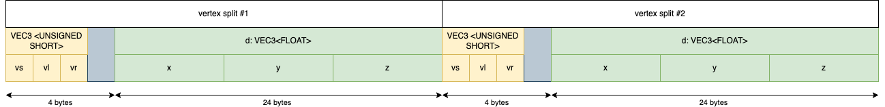
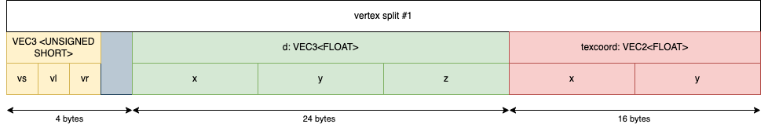

# MANYFOLD\_mesh\_progressive

## Contributors

* James Smith, Manyfold, [james@floppy.org.uk](mailto:james@floppy.org.uk)

## Status

Draft

## Dependencies

Written against the glTF 2.0 spec.

## Overview

This extension adds a progressive transmission format for meshes, which allows a low-resolution version to be rendered quickly and then refined as more of the file is loaded. It uses the "Progressive Meshes" algorithm by Hugues Hoppe. To quote the original paper, the algorithm is:

> efficient, lossless, continuous-resolution [and] addresses several practical problems in graphics: smooth geomorphing of level-of-detail approximations, progressive transmission, mesh compression, and selective refinement.

## Progressive Meshes

We start with a _base mesh_, which is a standard triangle mesh, represented in the normal glTF format. A renderer that does not understand the extension can simply render this base mesh. This extension uses additional buffer views to encode a series of _vertex splits_, which are applied one after another to enhance the detail of the base mesh.

### Mesh creation

This extension does not define how detailed the base mesh should be, how it is generated, nor the order of vertex splits; those are up to the creator of the file. Here, we simply define how the resulting structures should be transmitted and reconstructed for rendering.

### Applying Vertex Splits

Each vertex split contains four pieces of information:

* `vs`: the vertex index to be split
* `vl`: the left neighbour vertex index
* `vr`: the right neighbour vertex index
* `d`: the displacement vector that defines the new vertex positions.
* Optionally, other vertex attributes may also be included in each record, such as texture coordinates.

To apply a vertex split:

1. Create a new vertex at the end of the vertex array; the new index is `vt`. The position of this new vertex is `vs` plus the displacement vector: `vertices[vt] = vertices[vs] + d`. Other attribute data such as texture coordinates, normals, or colors should be applied to this new vertex, leaving the original unchanged.

2. Move the original vertex `vs` by applying the _inverse_ of the displacement vector to move it in the opposite direction: `vertices[vs] = vertices[vs] - d`
3. Create two new faces with vertex indices `(vs, vt, vl)` and `(vt, vs, vr)`. _!CHECK HANDEDNESS!_
4. Update existing faces that contain `vs` to use `vt` if appropriate. _!NOT CURRENTLY SURE HOW THIS WORKS!_

## glTF Schema Updates

The definitions of a progressive mesh in glTF consists of a small extension to mesh nodes, which reference bufferViews and accessors with a specific structure.

### Accessors and Buffer Views

The progressive mesh data buffer is a series of vertex split records. This data is represented as two interleaved `bufferViews`, one with triples of vertex indices, stored as a `VEC3` of the same data type as the base mesh indices, and the other with a displacement vector which should be the same type as the base mesh vertex position data.

Note that in a binary encoding, there will be only one `buffer`, which should contain the base mesh data, followed by the vertex split data.

For instance, if index data is `UNSIGNED_SHORT` and position is `FLOAT`:



In this case, the bufferViews would be defined with a `byteStride` of 28, as there are 28 bytes of data per vertex (including padding). If we assume the base mesh vertex and face data take up the first 1000 bytes of the buffer, the progressive vertex bufferView would have an offset of 1000, and the displacement vector bufferView would have a byteOffset of 4 more; 3 bytes for the vertex indices, plus padding.

```
bufferViews: [
	{
		... base mesh vertex data ...
	},
	{
		... base mesh face data ...
	},
	{
		buffer: 0,
		byteOffset: 1000,
		byteStride: 28
	},
	{
		buffer: 0,
		byteOffset: 1004,
		byteStride: 28
	}

]
```
Two accessors are then defined that use these bufferViews. `count` should be the same in both cases, and be the number of vertex splits in the complete stream.
```
accessors: [
	{...},
	{...},
	{
		"bufferView": 2,
		"componentType": 5123,
		"count": 16,
		"type": "VEC3"
	},
	{
		"bufferView": 3,
		"componentType": 5126,
		"count": 16,
		"type": "VEC3"
	}
]
```

Other attribute data may also be interleaved using appropriate accessor definitions.



In this case, the bufferView would have a `byteStride` of 44, and another accessor would be defined for the texture coordinate attribute:

```
{
	"bufferView": 1,
	"byteOffset": 28,
	"componentType": 5126,
	"count": 16,
	"type": "VEC2"
}
```

## Buffer

The progressive mesh data buffer MUST be the last buffer in the file; any data that comes after it will not be available until the entire progressive mesh has loaded, thus defeating the purpose of the format.

### Mesh Primitive

```
{
	"attributes": {
		"POSITION": 1
	},
	"indices": 0,
	"mode": 4,
	"extensions": {
		"MANYFOLD_mesh_progressive": {
			"attributes": {
				"POSITION": 3
			},
			"indices": 2
		}
	}
}

```

In a mesh primitive, the `indices` and `POSITION` attributes reference accessors for their data streams. We take the same approach; progressive meshes MUST define `POSITION` and `indices` accessors for vertex split data.

Other attributes can be included, such as `TEXCOORD_0` or `NORMAL`, if their data is also interleaved in the buffer and an accessor is provided.

```
"MANYFOLD_mesh_progressive": {
	"attributes": {
		"POSITION": 3,
		"TEXCOORD_0": 4
	},
	"indices": 2
}
```

### JSON Schema

TODO: Links to the JSON schema for the new extension properties.

## Known Implementations

* TODO: [Mittsu exporter](https://github.com/manyfold3d/manyfold/issues/1687)
* TODO: [THREE.js loader](https://github.com/manyfold3d/manyfold/issues/1688)

## Resources

* [Progressive Meshes](https://hhoppe.com/proj/pm/), Hugues Hoppe, ACM SIGGRAPH 1996 Proceedings, 99-108.
