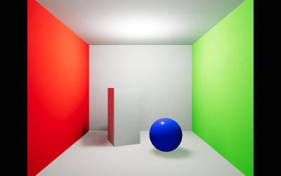

# MOZ\_lightmap

## Contributors

* Takahiro Aoyagi, Mozilla, [@takahirox](https://github.com/takahirox)
* Ben Houston, [@bhouston](https://github.com/bhouston)

## Status

Complete

## Dependencies

Written against the glTF 2.0 spec.

This extension may be used together with `KHR_texture_transform`, `KHR_materials_unlit`, and `KHR_lights_punctual`.

## Overview

A light map is a texture containing precomputed (baked) diffuse lighting for a surface. Light maps let real-time renderers display global illumination effects such as indirect bounce lighting, color bleeding, and soft shadowing at the cost of a single texture lookup. They are widely used in games, architectural visualization, and web and XR scenes where the scene's static geometry and lighting are known ahead of time.

This extension adds a light map to a glTF material. The light map stores sRGB-encoded RGB baked diffuse lighting, usually in a dedicated, non-overlapping texture coordinate set. The renderer decodes these values to linear RGB before shading. For PBR materials, the renderer interprets the decoded values, scaled by `intensity`, as diffuse irradiance and adds them to the material's diffuse lighting. Unlit materials use the multiplication convention defined in [Unlit Materials](#unlit-materials). Light maps do not affect specular reflections.

The baked irradiance may contain either:

* **indirect diffuse lighting only**, for scenes where direct lighting from some or all lights is still computed at runtime, or
* **total diffuse lighting** (direct and indirect), for fully baked scenes.

Both are diffuse irradiance and are rendered the same way. The content creator chooses which one to bake and which lights to keep in the scene (see [Baked and Dynamic Lights](#baked-and-dynamic-lights)).

<figure>

<figcaption><em>A Cornell box with baked indirect diffuse lighting stored using <code>MOZ_lightmap</code>, combined with a dynamic <code>KHR_lights_punctual</code> point light.</em></figcaption>
</figure>

## Extending Materials

A light map is added to a material by adding the `MOZ_lightmap` extension to the material's `extensions` property.

```json
"materials": [
    {
        "pbrMetallicRoughness": {
            "baseColorFactor": [ 1.0, 0.0, 0.0, 1.0 ],
            "metallicFactor": 0.0,
            "baseColorTexture": {
                "index": 0
            }
        },
        "extensions": {
            "MOZ_lightmap": {
                "index": 1,
                "texCoord": 1,
                "intensity": 1.0
            }
        }
    }
]
```

The extension object is a [`textureInfo`](../../../../specification/2.0/Specification.adoc#reference-textureinfo) with an extra `intensity` property.

| Property | Type | Description | Required |
|:---------|:-----|:------------|:---------|
| **index** | `integer` | The index of the texture that contains the light map. | :white_check_mark: Yes |
| **texCoord** | `integer` | The set index of the texture's `TEXCOORD` attribute used for texture coordinate mapping. | No, default: `1` |
| **intensity** | `number` | A linear multiplier applied to the light map's RGB values. Must be greater than or equal to `0`. | No, default: `1.0` |

### Texture Coordinates

Light maps usually need a unique, non-overlapping UV layout, which is generally different from the layout used for the material's other textures. For this reason `texCoord` defaults to `1` (`TEXCOORD_1`), **unlike** core `textureInfo`, where it defaults to `0`. This matches existing light-mapped content, which has always used the second texture coordinate set. Exporters **SHOULD** always write `texCoord` explicitly.

Mesh primitives that use a material with this extension **MUST** provide the `TEXCOORD_<texCoord>` attribute.

The light map `textureInfo` may use `KHR_texture_transform`. One use is placing several materials into one shared light map atlas.

## Light Map Content

The light map texture's RGB values **MUST** be encoded with the sRGB transfer function, using the same encoding convention as the core `emissiveTexture`. Implementations **MUST** decode these values to linear RGB before applying `intensity` or performing shading computations. To achieve correct filtering, the transfer function **SHOULD** be decoded before performing linear interpolation. The alpha channel, if present, **MUST** be ignored.

In the equations below, `lightmapLinear` is the sampled RGB value after sRGB decoding:

```
lightmapLinear = sRGBToLinear(lightmap.rgb)
```

For PBR materials, the diffuse irradiance `E` incident on the surface is:

```
E = intensity * lightmapLinear
```

`E` is expressed in lux (lm/m²). This is the same photometric convention as `KHR_lights_punctual`, where a directional light's intensity is the illuminance on a surface facing the light. So a baked light and the same light kept dynamic produce the same result. Some baking tools produce values already divided by π (so that "outgoing color = albedo × value"). When exporting for PBR materials, exporters **MUST** convert such values to irradiance by multiplying them, or `intensity`, by π. Unlit materials use the separate normalization defined below.

### Shading

Light map irradiance is diffuse irradiance arriving from the hemisphere above the surface. Implementations **MUST** treat it like diffuse irradiance from image-based lighting: it goes through the material's diffuse BRDF and is weighted by everything that weights the diffuse lobe (for example metallic, Fresnel, and layering terms from extensions such as `KHR_materials_clearcoat` or `KHR_materials_sheen`). For the core metallic-roughness material, ignoring those weights, the light map adds:

```
f_lightmap = (c_diff / π) * E
c_diff = lerp(baseColor.rgb, black, metallic)
```

Light maps contain no directional information and do not contribute to specular reflection. Emission is unaffected.

The core `occlusionTexture` applies to indirect lighting. For this purpose, light map irradiance counts as indirect lighting, so occlusion **MUST** be applied to it. Bakes usually already contain occlusion, so content creators **SHOULD** make sure the occlusion texture does not darken the same regions twice. Either omit it or limit it to detail finer than the light map resolution.

### Unlit Materials

When a material also uses `KHR_materials_unlit`, the light map multiplies the unlit base color. Before applying occlusion, the RGB result is:

```
color = baseColor.rgb * lightmapLinear * intensity
```

Here `baseColor` is the linear RGB product of `baseColorFactor`, the decoded `baseColorTexture`, and vertex color, as defined by `KHR_materials_unlit`. The occlusion rule above still applies. Alpha coverage and `doubleSided` behavior are unchanged.

This normalization preserves the deployed Mozilla Hubs behavior: unlit materials **MUST NOT** divide the light map contribution by π. It differs from the PBR diffuse BRDF normalization above. An unlit light map is a color multiplier rather than a physically normalized Lambertian irradiance input; exporters **MUST NOT** apply the PBR π conversion to it.

This allows fully baked scenes to be rendered with unlit materials at minimal cost. Without this extension, an unlit material displays `baseColor` unchanged.

> **Implementation Note:** Renderers whose unlit material internally divides light maps by π can implement this equation by multiplying their internal light map intensity by π. This is a renderer conversion, not a change to the extension's serialized `intensity`; exporters must reverse it when writing the extension.

### Baked and Dynamic Lights

The renderer always adds light map irradiance on top of whatever lighting it computes at runtime. To avoid counting the same light twice, the content creator decides which lighting is baked and which is dynamic:

* If the light map contains **indirect diffuse lighting only**, the scene's lights (for example, defined with `KHR_lights_punctual`) remain in the asset and supply direct lighting and all specular lighting at runtime.
* If the light map contains **total diffuse lighting**, lights whose direct contribution was baked **SHOULD NOT** also illuminate the light-mapped surfaces at runtime. They can be removed from the asset or kept only for specular highlights or unbaked objects, depending on what the target renderer supports.

Light maps usually include light from the environment (sky) as well. Applications **SHOULD NOT** also add diffuse image-based lighting from the same environment to light-mapped materials. Specular image-based lighting is unaffected.

## Implementation Notes

*This section is non-normative.*

* **Unwrapping and padding.** Light map UV charts should not overlap, and should be padded and dilated so that bilinear filtering and mipmapping don't bleed between charts.
* **Dynamic range.** Irradiance often exceeds `1.0`. With 8-bit formats such as PNG and JPEG, normalize the linear lighting values, encode the normalized values with the sRGB transfer function, and put the linear scale factor in `intensity`. Store dark scenes with care to avoid banding. Any texture extension used for the referenced texture must preserve the sRGB decoding convention defined above.
* **Static content.** Light maps only describe the lighting of the geometry and lights at bake time. They are suited to static geometry. A light map on a moving or deforming mesh stays attached to the surface and will look incorrect.
* **Instancing.** The light map belongs to the material and is addressed through mesh texture coordinates. A mesh referenced by several nodes therefore shares one light map region. To give instances unique lighting, use distinct meshes or primitives with their own `TEXCOORD` data, or distinct materials with different `KHR_texture_transform` offsets.

## Fallback

This extension is optional. Assets using it **SHOULD NOT** add `MOZ_lightmap` to `extensionsRequired`. Clients that don't support it render the material without baked lighting, using only the lights and environment available at runtime. Assets that bake total lighting and remove the baked lights will look darker in such clients. Content creators targeting both kinds of client may want to keep an approximate runtime lighting setup.

## glTF Schema Updates

* **JSON schema**: [material.MOZ_lightmap.schema.json](schema/material.MOZ_lightmap.schema.json)

## Known Implementations

* [three.js](https://github.com/mrdoob/three.js/pull/34950): loader and exporter plugins (pull request).
* [Mozilla Hubs](https://github.com/Hubs-Foundation/hubs/blob/master/src/components/gltf-model-plus.js): loader.
* [Hubs Blender Exporter](https://github.com/Hubs-Foundation/hubs-blender-exporter): Blender import and export.
* [Spoke](https://github.com/Hubs-Foundation/Spoke/tree/master/src/editor/gltf/extensions): Hubs scene editor, import and export.
* [hubs-glb-tools](https://github.com/Hubs-Foundation/hubs-glb-tools/blob/master/src/MozLightmap.ts): glTF-Transform extension.
* [iR Engine (formerly Ethereal Engine)](https://github.com/ir-engine/ir-engine): loader and glTF-Transform extension.
* [EE Bridge Unity Exporter](https://github.com/EtherealEngine/EE-Bridge-Unity-Export): Unity export.

## Sample Assets

* [LightmappedCornellBox.glb](https://github.com/bhouston/three.js/tree/gltf-light-map/examples/models/gltf/LightmappedCornellBox): Cornell box with baked indirect diffuse lighting in a shared light map atlas and a dynamic `KHR_lights_punctual` point light.

## Resources

* [Original draft of `MOZ_lightmap`](https://github.com/takahirox/MOZ_lightmap)
* [`MX_lightmap`](https://thirdroom.io/docs/gltf/mx_lightmap/readme), a related extension that adds per-node atlas transforms and RGBM encoding.
