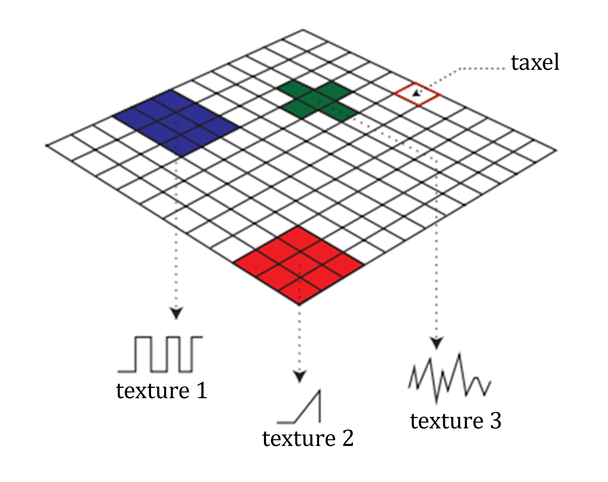

# MPEG_haptics_material

## Contributors

* ISO/IEC SC29 WG3 (MPEG Systems) - Scene Description Breakout Group
* Contacts
  * Thomas Stockhammer (MPEG-I Scene Description BoG Chair, tsto@qti.qualcomm.com)

## Status

Based on [ISO/IEC DIS 23090-14 2nd Edition](https://www.iso.org/standard/90191.html)

## Dependencies

Written against the glTF 2.0 spec.

## Overview

The MPEG_haptic and MPEG_haptic material extensions provide the ability to define the integration of haptics in a glTF scene .

At the [glTF file level](#mpeg_haptic_material-gltf-extension): The MPEG_haptic_material extension contains an array defining all texture-based haptic data.

At the [mesh level](#mpeg_haptic_material-mesh-extension): The MPEG_haptic_material extension contains a single reference to the array of the same extension at the glTF file level.

The haptic texture associated with a 3D object does not contain RGB values but haptic values. These values are exploited directly by the haptic renderer. The extension also uses the concept of taxels. Each pixel of the texture can be mapped to a distinct spatial (or temporal) signal as illustrated in the following figure. 
<figure>

<figcaption><em>Grid of taxels, mapping pixels to different haptic textures.</em></figcaption>
</figure>
An array of textures for each haptic property is used. An haptic texture can be provided both as a traditional 2D texture and as a taxel map in the same file, giving the possibility to the rendering engine to choose the most appropriate. 
Additional information is added to each element of the haptic texture arrays for the rendering engine to adequately interpret a texture. 

---------------------------------------

## MPEG_haptic_material glTF extension

glTF extension to specify haptic materials

**`MPEG_haptic_material glTF level extension` Properties**

|   |Type|Description|Required|
|---|---|---|---|
|**materials**|[`MPEG_haptic_material.material`](#mpeg_haptic_materialmaterial) `[1-*]`|Provides a list of haptic materials at the glTF file level to enable haptic support.| &#10003; Yes|
|**extensions**|`any`||No|
|**extras**|`any`||No|

Additional properties are allowed.

* **JSON schema**: [glTF.MPEG_haptic_material.schema.json](./schema/glTF.MPEG_haptic_material.schema.json)

### MPEG_haptic_material.materials

Provides a list of haptic materials at the glTF file level to enable haptic support.

* **Type**: [`MPEG_haptic_material.material`](#mpeg_haptic_materialmaterial) `[1-*]`
* **Required**:  &#10003; Yes

### MPEG_haptic_material.extensions

* **Type**: `any`
* **Required**: No

### MPEG_haptic_material.extras

* **Type**: `any`
* **Required**: No

---------------------------------------

## MPEG_haptic_material mesh extension

mesh extension to specify an haptic material

**`MPEG_haptic_material mesh level extension` Properties**

|   |Type|Description|Required|
|---|---|---|---|
|**hapticMaterialIndex**|`glTFid`|Reference to an item in the materials array of the MPEG_haptic_material extension defined at glTF file level| &#10003; Yes|
|**extensions**|`any`||No|
|**extras**|`any`||No|

Additional properties are allowed.

* **JSON schema**: [MPEG_haptic_material.schema.json](./schema/MPEG_haptic_material.schema.json)

### MPEG_haptic_material mesh extension.hapticMaterialIndex

Reference to an item in the materials array of the MPEG_haptic_material extension defined at glTF file level

* **Type**: `glTFid`
* **Required**:  &#10003; Yes
* **Minimum**: ` >= 0`

### MPEG_haptic_material mesh extension.extensions

* **Type**: `any`
* **Required**: No

### MPEG_haptic_material mesh extension.extras

* **Type**: `any`
* **Required**: No

---------------------------------------

## MPEG_haptic_material.material

A haptic material.

**`MPEG_haptic_material.material` Properties**

|   |Type|Description|Required|
|---|---|---|---|
|**haptic**|`integer`|Index to an element of the hapticObjects array of the MPEG_haptic extension. This is used for ???Reference??? textures to access the haptic information.|No|
|**stiffness**|[`MPEG_haptic_material.material.texture`](#mpeg_haptic_materialmaterialtexture) `[]`|An array of items describing the textures that store the stifness coefficients. Each texture determines the perceived stiffness of a surface. Which means the force perceived by the user opposed to the normal penetration of a material by a body part.|No|
|**friction**|[`MPEG_haptic_material.material.texture`](#mpeg_haptic_materialmaterialtexture) `[]`|An array of items describing the textures that store the coefficients of friction. Each texture indicates the perceived friction, which is a force opposing the movement of a body part sliding on a surface.|No|
|**vibrotactileTexture**|[`MPEG_haptic_material.material.texture`](#mpeg_haptic_materialmaterialtexture) `[]`|An array of items describing the textures that indicates the perceived texture by a body part while sliding on a surface. |No|
|**temperature**|[`MPEG_haptic_material.material.texture`](#mpeg_haptic_materialmaterialtexture) `[]`|An array of items describing the textures that stores the temperature distribution. It indicates the perceived temperature of an object.|No|
|**vibration**|[`MPEG_haptic_material.material.texture`](#mpeg_haptic_materialmaterialtexture) `[]`|An array of items describing the textures that stores the amplitude and / or frequency of the vibration signal.|No|
|**custom**|[`MPEG_haptic_material.material.texture`](#mpeg_haptic_materialmaterialtexture) `[]`|An array of items describing the textures that stores custom haptic data.|No|
|**name**|`string`||No|
|**extensions**|`any`||No|
|**extras**|`any`||No|

Additional properties are allowed.

### MPEG_haptic_material material.haptic

Index to an element of the hapticObjects array of the MPEG_haptic extension. This is used for ???Reference??? textures to access the haptic information.

* **Type**: `integer`
* **Required**: No

### MPEG_haptic_material material.stiffness

An array of items describing the textures that store the stifness coefficients. Each texture determines the perceived stiffness of a surface. Which means the force perceived by the user opposed to the normal penetration of a material by a body part.

* **Type**: [`MPEG_haptic_material.material.texture`](#mpeg_haptic_materialmaterialtexture) `[]`
* **Required**: No

### MPEG_haptic_material material.friction

An array of items describing the textures that store the coefficients of friction. Each texture indicates the perceived friction, which is a force opposing the movement of a body part sliding on a surface.

* **Type**: [`MPEG_haptic_material.material.texture`](#mpeg_haptic_materialmaterialtexture) `[]`
* **Required**: No

### MPEG_haptic_material material.vibrotactileTexture

An array of items describing the textures that indicates the perceived texture by a body part while sliding on a surface. 

* **Type**: [`MPEG_haptic_material.material.texture`](#mpeg_haptic_materialmaterialtexture) `[]`
* **Required**: No

### MPEG_haptic_material material.temperature

An array of items describing the textures that stores the temperature distribution. It indicates the perceived temperature of an object.

* **Type**: [`MPEG_haptic_material.material.texture`](#mpeg_haptic_materialmaterialtexture) `[]`
* **Required**: No

### MPEG_haptic_material material.vibration

An array of items describing the textures that stores the amplitude and / or frequency of the vibration signal.

* **Type**: [`MPEG_haptic_material.material.texture`](#mpeg_haptic_materialmaterialtexture) `[]`
* **Required**: No

### MPEG_haptic_material material.custom

An array of items describing the textures that stores custom haptic data.

* **Type**: [`MPEG_haptic_material.material.texture`](#mpeg_haptic_materialmaterialtexture) `[]`
* **Required**: No

### MPEG_haptic_material material.name

* **Type**: `string`
* **Required**: No

### MPEG_haptic_material material.extensions

* **Type**: `any`
* **Required**: No

### MPEG_haptic_material material.extras

* **Type**: `any`
* **Required**: No

---------------------------------------

## MPEG_haptic_material.material.texture

Texture for haptic material.

**`## MPEG_haptic_material.material.texture` Properties**

|   |Type|Description|Required|
|---|---|---|---|
|**texture**|`textureInfo`|A texture information.| &#10003; Yes|
|**type**|`string`|Indicates the type of texture| &#10003; Yes|
|**extensions**|`extension`|JSON object with extension-specific objects.|No|
|**extras**|`extras`|Application-specific data.|No|

Additional properties are allowed.

### MPEG_haptic_material.material.texture.texture

Haptic texture described with a 2D texture.

* **Type**: `textureInfo`
* **Required**:  &#10003; Yes

### MPEG_haptic_material.material.texture.type

Indicates the type of texture

* **Type**: `string`
* **Required**:  &#10003; Yes
* **Allowed values**:
    * `"High_Resolution"`
    * `"Low_Resolution"`
    * `"Reference"`
    * `"Other"`

### MPEG_haptic_material.material.texture.extensions

JSON object with extension-specific objects.

* **Type**: `extension`
* **Required**: No
* **Type of each property**: Extension

### MPEG_haptic_material.material.texture.extras

Application-specific data.

* **Type**: `extras`
* **Required**: No

## Known Implementations

* [ISO/IEC WD 23090-24](https://www.iso.org/standard/83696.html)

## Resources

* [ISO/IEC DIS 23090-14 2nd Edition](https://www.iso.org/standard/90191.html), Information technology — Coded representation of immersive media — Part 14: Scene Description
* [ISO/IEC WD 23090-24](https://www.iso.org/standard/83696.html), Information technology — Coded representation of immersive media — Part 24: Conformance and Reference Software for Scene Description for MPEG Media

## License

Copyright ISO/IEC 2025

The use of the "MPEG scene description extensions" is subject to the license as accessible here: https://standards.iso.org/ and is subject to the IPR policy as accessible here: https://www.iso.org/iso-standards-and-patents.html.
