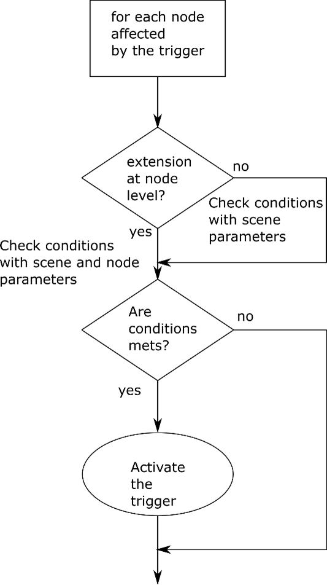

# Interactivity

## Contributors

* ISO/IEC SC29 WG3 (MPEG Systems) - Scene Description Breakout Group
* Contacts
  * Thomas Stockhammer (MPEG-I Scene Description BoG Chair, tsto@qti.qualcomm.com)

## Status

Based on [ISO/IEC DIS 23090-14 2nd Edition](https://www.iso.org/standard/80900.html)

## Dependencies

Written against the glTF 2.0 spec.

##  Overview

Interactivity is supported at the scene level and at the node level through the definition of two extensions MPEG_scene_interactivity and MPEG_node_interactivity. 
When present, the MPEG_scene_interactivity extension shall be included as extension to the scene object.
When present, the MPEG_node_interactivity extension shall be included as extension to a node object. 
The MPEG_node_interactivity extension is used to complement the interactivity extension defined at the scene level. One particular case is the definition of the parameters for a physics engine. That is, when an MPEG_node_interactivity extension contains a trigger of type TRIGGER_COLLISION without being referenced by a trigger of type TRIGGER_COLLISION at the MPEG_scene_interactivity extension, this node shall not be considered for collision detection and instead only be used by the physics engine.

## 	Semantics

### [Semantics at scene level](#semantics-at-scene-level-1) 
### [Semantics at node level](#semantics-at-node-level-1) 

### Semantics at scene level

The semantic of the MPEG_scene_interactivity extension is based on the definition of trigger, action and behavior objects as shown in Table 1.

Table 1: Semantic of the MPEG_scene_interactivity extension
| Name | Type | Required | Default | Description |
|--|--|--|--|--|
| triggers | [`MPEG_scene_interactivity.trigger`](#reference-mpeg_scene_interactivity-trigger) `[1-*]` | &#10003; Yes|  | Contains the definition of all the triggers used in that scene. |
| actions | [`MPEG_scene_interactivity.action`](#reference-mpeg_scene_interactivity-action) `[1-*]` | &#10003; Yes|  | Contains the definition of all the actions used in that scene. |
| behaviors | [`MPEG_scene_interactivity.behavior`](#reference-mpeg_scene_interactivity-behavior) `[1-*]`  | &#10003; Yes|  | Contains the definition of all the behaviors used in that scene. A behavior is composed of a pair of (triggers, actions), control parameters of triggers and actions, a priority weight and an optional interrupt action. |
| recommendedPhysicsHighPrecision | Boolean | No | false | Determines whether the application should enable a more deterministic and precise physic simulation |
| gravity | Number | No | -9.81 | Determine the gravity for the whole scene. In meter per second square (m.s-2) as defined in the international unit system. |
| recommendedPhysicsFrameRate | Number | No | 50 | Provides the recommended frame rate at which the Physics Engine should operate. In frame per second as defined in the international unit system. |
| bounceThreshold | number | No | 1 | A contact with a relative velocity below this threshold will not result in a bounce. In meter per second (m.s-1) as defined in the international unit system. |

The semantic of a trigger is provided in Table 2.

Table 2: Semantic of a trigger
| Name | Type | Required | Default | Description |
|--|--|--|--|--|
| type | enumeration | &#10003; Yes|  | One element of Table 3 that defines the type of the trigger. |
| if (type == TRIGGER_COLLISION){ |  |  |  |  |
| nodes | array | &#10003; Yes|  | Indices of the nodes in the nodes array to be considered for collision determination. Any detection of collision shall activate the trigger |
| primitives | array(Primitive) | No | N/A | List of primitives used to activate the proximity or collision trigger. Semantics of Primitive are presented in Table 4. |
| } |  |  |  |  |
| if (type == TRIGGER_PROXIMITY){ |  |  |  |  |
| referenceNode | number | No | N/A | Index in the nodes array, of the node to consider for the proximity evaluation. In the absence of the referenceNode attribute, the active camera managed by the application shall be used. |
| distanceLowerLimit | number | No | 0 | Threshold minimum in meters for the proximity calculation, based on the distance between the nodes and the referenceNode. |
| distanceUpperLimit | number | &#10003; Yes|  | Threshold maximum in meters for the proximity calculation, based on the distance between the nodes and the referenceNode. |
| nodes | array | &#10003; Yes|  | Indices of the nodes in the nodes array to be considered. All the nodes shall have a distance from the origin of their local space to  the referenceNode above the distanceLowerLimit and below the distanceUpperLimit to activate the trigger |
| primitives | array(Primitive) | No | N/A | List of primitives used to activate the proximity or collision trigger. Semantics of Primitive are presented in Table 4. |
| } |  |  |  |  |
| if (type== TRIGGER_USER_INPUT){ |  |  |  |  |
| userInputDescription | string | &#10003; Yes|  | Describes the user body part and gesture related to the input. The format shall follow the OpenXR input path description as defined in [OpenXR] section 6. An example is:  “/user/hand/left/grip”. |
| nodes | array | No | N/A | Indices of the nodes in the nodes array to be considered for this user input. |
| } |  |  |  |  |
| if (type== TRIGGER_VISIBILITY){ |  |  |  |  |
| cameraNode | number | &#10003; Yes|  | Index to the node containing a camera in the nodes array for which the visibilities are determined. The visibility trigger shall be evaluated only if the related camera is active. |
| nodes | array | &#10003; Yes|  | Indices of the nodes in the nodes array to be considered. All the nodes shall be visible by the camera to activate the trigger. |
| } |  |  |  |  |

Table 3: type of trigger
| Trigger type | Description |
|--|--|
| TRIGGER_COLLISION=0 | Collision Trigger |
| TRIGGER_PROXIMITY | Proximity Trigger |
| TRIGGER_USER_INPUT | User_Input Trigger |
| TRIGGER_VISIBILITY | Visibility Trigger |

The semantics of a trigger primitive are defined in Table 9.

Table 4: Semantics of MPEG_scene_interactive.trigger.primitive properties
| Name | Type | Required | Default | Description |
|--|--|--|--|--|
| type | enumeration | No | BV_SPHEROID | Describes the type of primitive used to activate the proximity trigger. The available options are: BV_CUBOID = 0,  BV_PLANE_REGION = 1, BV_CYLINDER_REGION = 2, BV_CAPSULE_REGION = 3, BV_SPHEROID = 4  The default is BV_SPHEROID. Semantics are presented in Table 5. |
| boundary | number | No | 0.0 | Defines the region of intersection within the primitive. if zero, then all area of the primitive activates the trigger. Otherwise, the region of intersection decreases following the normal direction of all sides of the primitive from its centroid. For the capsule primitive, it should be applied over the radius, top, and base attributes. |
| transformationMatrix | array | No | [1.0,0.0,0.0,0.0, 0.0,1.0,0.0,0.0, 0.0,0.0,1.0,0.0, 0.0,0.0,0.0,1.0] | Floating-point 4x4 matrix that defines the initial orientation, translation, and scale of a primitive. Formatted in column-major order. The primitive shall follow x+ for width, y+ for height, z+ for length . The matrix transformation allows to transform any primitive after initialization. |

Table 5: Semantical description of each primitive region
| Name | Type | Required | Default | Description |
|--|--|--|--|--|
| if (type == BV_CUBOID) { |  |  |  |  |
| width | number | &#10003; Yes|  | Width of the box. |
| height | number | &#10003; Yes|  | Height of the box. |
| length | number | &#10003; Yes|  | Length of the box. |
| centroid | VEC3 | &#10003; Yes|  | Centroid 3D coordinate (x,y,z) of the cube. |
| } |  |  |  |  |
| if (type == BV_PLANE_REGION) { |  |  |  |  |
| width | number | &#10003; Yes|  | Width of the plane. |
| height | number | &#10003; Yes|  | Height of the plane. |
| centroid | VEC2 | &#10003; Yes|  | Centroid 2D coordinate (x,y) or (x,z) or (y,z) of the plane. |
| } |  |  |  |  |
| if (type == BV_CYLINDER_REGION) { |  |  |  |  |
| radius | number | &#10003; Yes|  | Radius of the cylinder. |
| length | number | &#10003; Yes|  | Length of the cylinder. |
| centroid | VEC3 | &#10003; Yes|  | Centroid 3D coordinate (x,y,z) of the cylinder |
| } |  |  |  |  |
| if (type == BV_CAPSULE_REGION) { |  |  |  |  |
| radius | number | &#10003; Yes|  | Radius of the capsule. |
| baseCentroid | VEC3 | &#10003; Yes|  | Centroid 3D coordinate (x,y,z) of the base semi-sphere of the capsule. |
| topCentroid | VEC3 | &#10003; Yes|  | Centroid 3D coordinate (x,y,z) of the top semi-sphere of the capsule. |
| } |  |  |  |  |
| if (type == BV_SPHEROID) { |  |  |  |  |
| radius | number | &#10003; Yes|  | Radius of the sphere. |
| centroid | VEC3 | &#10003; Yes|  | Centre 3D coordinate (x,y,z) of the sphere. |
| } |  |  |  |  |

The semantic of an action is provided in Table 6.

Table 6: Semantic of action
| Name | Type | Required | Default | Description |
|--|--|--|--|--|
| type | enumeration | &#10003; Yes|  | One element of Table 7 that defines the type of the action. |
| delay | number | No | 0.0 | Duration of delay in second before executing the action. |
| if (type== ACTION_ACTIVATE){ |  |  |  |  |
| activationStatus | enumeration | &#10003; Yes|  | ENABLED=0: the node shall be processed by the application DISABLED =1: the node shall be skipped by the application. |
| nodes | array | &#10003; Yes|  | Indices of the nodes in the nodes array to set the activation status. |
| } |  |  |  |  |
| if (type== ACTION_TRANSFORM){ |  |  |  |  |
| transform |  | &#10003; Yes|  | A 4x4 transformation matrix to apply to the nodes. |
| nodes | array | &#10003; Yes|  | Indices of the nodes in the nodes array to be transformed. |
| } |  |  |  |  |
| if (type== ACTION_BLOCK){ |  |  |  |  |
| nodes | array | &#10003; Yes|  | Indices of the nodes in the nodes array to lock their related transforms. |
| } |  |  |  |  |
| if (type == ACTION_ANIMATION){ |  |  |  |  |
| animation | number | &#10003; Yes|  | Index of the animation in the animations array to be considered. |
| animationControl | enumeration | &#10003; Yes|  | One element of Table 8 that defines the control of the animation. |
| } |  |  |  |  |
| if (type == ACTION_MEDIA){ |  |  |  |  |
| media | number | &#10003; Yes|  | Index of the media in the MPEG_media array to be considered. |
| mediaControl | enumeration | &#10003; Yes|  | One element of Table 9 that defines the control of the media. |
| } |  |  |  |  |
| if (type == ACTION_MANIPULATE){ |  |  |  |  |
| manipulateActionType | enumeration | &#10003; Yes|  | One element of Table 10 that defines the action manipulate type. |
| axis | array | No | Up | (x,y,z) coordinates of the axis used for rotation and sliding. These coordinates are relative to the local space created by the user input described in the userInputDescription. For example a “/user/hand/left/pose” user input trigger creates a local space attached to the user left hand. |
| userInputDescription | string | &#10003; Yes|  | Describe the user input related to the manipulation action. The format shall follow the OpenXR input path description as defined in [OpenXR] section 6. An example is:  “/user/hand/left/aim/pose”. |
| nodes | array | &#10003; Yes|  | Indices of the nodes in the nodes array to be manipulated. |
| } |  |  |  |  |
| if (type == ACTION_SET_MATERIAL){ |  |  |  |  |
| material | number | &#10003; Yes|  | Index of the material in the materials array to apply to the set of nodes. |
| nodes | array | &#10003; Yes|  | Indices of the nodes in the nodes array to set their material. |
| } |  |  |  |  |
| if (type == ACTION_HAPTIC){ |  |  |  |  |
| hapticActionNodes | array(HapticActionNode) | &#10003; Yes|  | List of haptic action nodes as defined in  Table 13. |
| } |  |  |  |  |
| if (type == ACTION_SET_AVATAR) { |  |  |  |  |
| avatarAction | string | &#10003; Yes|  | The avatarAction is a URN that uniquely identifies the avatar action. For the MPEG reference Avatar, a set  of avatar actions and their respective URNs is defined in Table H.4.3.2 of Annex H. For example, the URN “urn:mpeg:sd:2023:avatar:actionslist/speech” referenced in Table H.4.3.2 of Annex H sets the optional attributes “microphone” and “media”. Considering only the boolean attribute “microphone”, the nodes in the node array will activate/deactivate their “microphone” ability accordingly when this action is launched. |
| nodes | array | &#10003; Yes|  | Indices of the nodes in the nodes array to launch their avatar actions. |
| } |  |  |  |  |

Table 7: Type of action 
| Action type | Description |
|--|--|
| ACTION_ACTIVATE=0 | Set activation status of a node |
| ACTION_TRANSFORM | Set transform to a node |
| ACTION_BLOCK | Block the transform of a node |
| ACTION_ANIMATION | Select and control an animation |
| ACTION_MEDIA | Select and control a media |
| ACTION_MANIPULATE | Select a manipulate action |
| ACTION_SET_MATERIAL | Set new material to nodes |
| ACTION_HAPTIC | Get haptic feedbacks on a set of nodes |
| ACTION_SET_AVATAR | Get avatar related actions |

Table 8: Control of animation
| Animation Control | Description |
|--|--|
| ANIMATION_PLAY=0 | Play the animation from time 0 or from any other time provided by a control. |
| ANIMATION_PAUSE | Pause the animation |
| ANIMATION_RESUME | Resume the animation from the last pause position. |
| ANIMATION_STOP | Stop the animation |

Table 9: control of media
| Media Control | Description |
|--|--|
| MEDIA_PLAY=0 | Play the media from time 0 or from any other time provided by a control. |
| MEDIA_PAUSE | Pause the media |
| MEDIA_RESUME | Resume the media from the last pause position. |
| MEDIA_STOP | Stop the media |

Table 10: Action Manipulate Type
| Action Manipulate Type | description |
|--|--|
| ACTION_MANIPULATE_FREE=0 | The nodes follow the user pointing device and its rotation. |
| ACTION_MANIPULATE_SLIDE | The nodes move linearly along the provided axis by following the user pointing device. |
| ACTION_MANIPULATE_TRANSLATE | The nodes translate by following the user pointing device. |
| ACTION_MANIPULATE_ROTATE | The nodes rotate around the provided axis by following the user pointing device. |
| ACTION_MANIPULATE_SCALE | Performs a central scaling of the nodes by following the user pointing device. |

The semantics of a behavior is provided in Table 11.

Table 11: semantic of behavior
| Name | Type | Required | Default | Description |
|--|--|--|--|--|
| triggers | array | &#10003; Yes|  | Indices of the triggers in the triggers array considered for this behavior |
| actions | array | &#10003; Yes|  | Indices of the actions in the actions array considered for this behavior. |
| triggersCombinationControl | string | &#10003; Yes|  | Set of logical operations to apply to the triggers A ‘#’ indicates the trigger index, ‘&’ indicates a logical AND operation, ‘\|’ a logical OR operation and ‘~’ a NOT operation. Parenthesis are used to group some operations. Such a syntax may give the following string: “#1&~#2\|(#3&#4)”. An empty string is understood as a logical OR between all the triggers. A regex expression (https://json-schema.org/understanding-json-schema/reference/regular_expressions.html) is specified in the JSON schema to validate this string. |
| triggersActivationControl | enumeration | &#10003; Yes|  | Indicates when the combination of the triggers shall be activated for launching the actions. One element of Table 12 that defines when the combination of the triggers shall be activated for launching the actions. |
| actionsControl | enumeration | &#10003; Yes|  | Defines the way to execute the defined actions. SEQUENTIAL=0: each defined action is executed sequentially in the order of the actions array. PARALLEL=1: the defined actions are executed concurrently. |
| interruptAction | number | No | N/A | Index of the action in the actions array to be executed if the behavior is still on-going and is no more defined in a newly received scene update. |
| priority | number | No | 0 | Integer value defining the priority associated to the behavior When several behaviors are in concurrence to affect the same node(s) at the same time, the behavior having the highest priority value shall be processed. The lower priority behavior(s) shall not be processed. In the case of behaviors having the same priority, the application should apply its own criteria. |

Table 12:Trigger Activation Control
| Trigger Activation Control | Description |
|--|--|
| TRIGGER_ACTIVATE_FIRST_ENTER=0 | Activated when the conditions are first met |
| TRIGGER_ACTIVATE_EACH_ENTER | Activated each time the conditions are first met |
| TRIGGER_ACTIVATE_ON | Activated as long as the conditions are met |
| TRIGGER_ACTIVATE_FIRST_EXIT | Activated when the conditions are first no longer met |
| TRIGGER_ACTIVATE_EACH_EXIT | Activated each time the conditions are no longer met |
| TRIGGER_ACTIVATE_OFF | Activated as long as the conditions are not met |

Table 13: Semantic of HapticActionNode object
| Property | Type | Required | Default | Description |
|--|--|--|--|--|
| node | integer | &#10003; Yes|  | Identifier of the node in the glTF nodes array. |
| hapticObject | integer | No | N/A | Index to a haptic object in the hapticObjects array of the MPEG_haptic extension. |
| actionLocation | integer | No | 0xFFFFFFFF | Body part mask specifying where on the body the signal can be rendered. Possible values are detailed in Table 17. |
| washout | boolean | No | False | Specifies whether the action should trigger a washout (reset to the origin) of the associated devices. |
| useCollider | boolean | No | False | Used with a Collision trigger. If True, the rendering engine shall use collision information to estimate the desired location of the haptic feedback on the body. For haptic materials, the presentation engine retrieves the associated haptic texture media and generates haptic feedback based on texture information and collision position. If false, the signal shall be rendered based on the information specified in the Haptic file. |
| materialHapticModality | array(enumeration) | No | N/A | List of haptic material modalities that shall be rendered. Possible values are detailed in Table 16. |
| hapticActionMedias | array(HapticActionMedia) | &#10003; Yes|  | List of Haptic Action Media. |

Table 14: Semantic of the HapticActionMedia object
| Property | Type | Required | Default | Description |
|--|--|--|--|--|
| mediaIndex | integer | &#10003; Yes|  | Index in the accessors array of the associated haptic data. |
| perceptionIndices | array(integer) | &#10003; Yes|  | Indices of the perceptions of the media that shall be rendered. If the list if empty all perceptions shall be rendered |
| hapticModality | array(enumeration) | No | N/A | List of haptic modalities that can be rendered. Possible values are described in Table 15. |
| hapticControl | enumeration | No | HAPTIC_PLAY | One element of Table 49 that defines the control of the haptic rendering. |
| loop | boolean | No | False | Specifies if the haptic rendering of the data should be continuously looping. |

Table 15: List of haptic modalities 
| Pressure = 0 |
|--|
| Acceleration |
| Velocity |
| Position |
| Temperature |
| Vibrotactile |
| Water |
| Wind |
| Force |
| Electrotactile |
| Vibrotactile Texture |
| Stiffness |
| Friction |
| Other |

Table 16: List of haptic Material Modalities
| Stiffness = 0 |
|--|
| Friction |
| Vibrotactile Texture |
| Temperature |
| Vibration |
| Custom |

Table 17: Body part masks
|  | Name | Body_part_mask (binary) | Hexadecimal | Decimal |
|--|--|--|--|--|
| 0 | Unspecified | 00000000000000000000000000000000 | 0x00000000 | 0 |
| 1 | Head Face | 00000000000000000000000000000001 | 0x00000001 | 1 |
| 2 | Head Back/Neck/Ears | 00000000000000000000000000000010 | 0x00000002 | 2 |
| 3 | Mouth Bag | 00000000000000000000000000000100 | 0x00000004 | 4 |
| 4 | Lower Jaw | 00000000000000000000000000001000 | 0x00000008 | 8 |
| 5 | Upper Jaw | 00000000000000000000000000010000 | 0x00000010 | 16 |
| 6 | Eye Left | 00000000000000000000000000100000 | 0x00000020 | 32 |
| 7 | Eye Right | 00000000000000000000000001000000 | 0x00000040 | 64 |
| 8 | Chest Front | 00000000000000000000000010000000 | 0x00000080 | 128 |
| 9 | Chest Back | 00000000000000000000000100000000 | 0x00000100 | 256 |
| 10 | Upper Arm Left | 00000000000000000000001000000000 | 0x00000200 | 512 |
| 11 | Lower Arm Left | 00000000000000000000010000000000 | 0x00000400 | 1 024 |
| 12 | Hand Left | 00000000000000000000100000000000 | 0x00000800 | 2 048 |
| 13 | Upper Arm Right | 00000000000000000001000000000000 | 0x00001000 | 4 096 |
| 14 | Lower Arm Right | 00000000000000000010000000000000 | 0x00002000 | 8 192 |
| 15 | Hand Right | 00000000000000000100000000000000 | 0x00004000 | 16 384 |
| 16 | Abdomen Front | 00000000000000001000000000000000 | 0x00008000 | 32 768 |
| 17 | Abdomen Back | 00000000000000010000000000000000 | 0x00010000 | 65 536 |
| 18 | Upper Leg Left | 00000000000000100000000000000000 | 0x00020000 | 131 072 |
| 19 | Lower Leg Left | 00000000000001000000000000000000 | 0x00040000 | 262 144 |
| 20 | Foot Left | 00000000000010000000000000000000 | 0x00080000 | 524 288 |
| 21 | Upper Leg Right | 00000000000100000000000000000000 | 0x00100000 | 1 048 576 |
| 22 | Lower Leg Right | 00000000001000000000000000000000 | 0x00200000 | 2 097 152 |
| 23 | Foot Right | 00000000010000000000000000000000 | 0x00400000 | 4 194 304 |
| 24-32 | Reserved | 00000000010000000000000000000000 - 10000000000000000000000000000000 | 0x00800000 -0x80000000 | 8 388 608 - 2 147 483 648 |

Table 18: Examples of body part combinations
| Name | Body_part_mask (binary) | Hexadecimal | Decimal |
|--|--|--|--|
| Right arm | 00000000000000000111000000000000 | 0x00007000 | 28 672 |
| Left arm | 00000000000000000000111000000000 | 0x00000E00 | 3 584 |
| Right leg | 00000000011100000000000000000000 | 0x00700000 | 7 340 032 |
| Left leg | 00000000000011100000000000000000 | 0x000E0000 | 917 504 |
| Upper body | 00000000000000011111111111111111 | 0x0001FFFF | 131 071 |
| Lower body | 00000000011111100000000000000000 | 0x007E0000 | 8 257 536 |
| Full body | 11111111111111111111111111111111 | 0xFFFFFFFF | 4 294 967 295 |

Table 19: List of Haptic controls
| Haptic Control | Description |
|--|--|
| HAPTIC_PLAY = 0 | Start the rendering of the haptic data from time 0 or from any other time provided by a control |
| HAPTIC_PAUSE | Pause the rendering of the haptic data |
| HAPTIC_RESUME | Resume the rendering of the haptic data from the last pause position. |
| HAPTIC_STOP | Stop the rendering of the haptic data |

### Semantics at node level

In complement to the interactivity objects defined in the glTF scene-level extension, some additional data could be provided at the level of the affected glTF nodes to specialize the trigger activation.
The semantic of the MPEG_node_interactivity extension is shown in Table 50.

Table 20: Semantic of the MPEG_node_interactivity extension
| Name | Type | Required | Default | Description |
|--|--|--|--|--|
| triggers | array | &#10003; Yes|  | Array of node triggers (as defined in Table 21). Only distinct types are allowed. The minimum size of this array is 1, and the maximum size is size of trigger types as defined in this specification. |

 
Table 21: Semantic of the MPEG_node_interactivity.trigger extension
| Name | Type | Required | Default | Description |
|--|--|--|--|--|
| type | enumeration | &#10003; Yes|  | One element of Table 3 that defines the type of the trigger. |
| if (type == TRIGGER_COLLISION){ |  |  |  |  |
| collider | integer | &#10003; Yes|  | the index of the mesh element that provides the collider geometry for the current node. The collider mesh may reference a material. |
| isStatic | boolean | &#10003; Yes|  | If True, the collider is defined as a static collider. |
| usePhysics | boolean | &#10003; Yes|  | Indicates if the object shall be considered by the physics simulation. |
| if (usePhysics) { |  |  |  |  |
| needPreciseCollisionDetection | Boolean | No | false | If true, the physics engine should handle the collision detection more accurately by increasing the detection rate for this node. |
| linearDamping | Number | No | 0 | A non-negative value, in second-1 (s-1), as defined in the international unit system. It defines the linear drag coefficient which corresponds to the rate of decrease of the linear velocity over time.  It is used to compute a new velocity value V(t) at each simulation step (dt): V(t+dt) = V(t)*(1-linearDamping*dt), the velocity being clamped to 0. |
| angularDamping | number | No | 0 | A non-negative value, in second-1 (s-1), as defined in the international unit system. It defines the angular drag coefficient which corresponds to the rate of decrease of the angular velocity over time.  It is used to compute a new velocity value V(t) at each simulation step (dt): V(t+dt) = V(t)*(1-angularDamping*dt), the velocity being clamped to 0. |
| useGravity | boolean | &#10003; Yes|  | Indicates if the gravity affects the object |
| mass | number | &#10003; Yes|  | Mass of the object in kilogram as defined in the international unit system.. |
| restitution | number | &#10003; Yes|  | Provides the ratio of the final to initial relative velocity between two objects after they collide. |
| staticFriction | number | &#10003; Yes|  | Unitless friction coefficient as defined in the Coulomb friction model. Friction is the quantity which prevents surfaces from sliding off each other. StaticFriction is used when the object is lying still. It will prevent the object from starting to move. |
| dynamicFriction | number | &#10003; Yes|  | Unitless friction coefficient as defined in the Coulomb friction model. When a large enough force is applied to the object, the dynamicFriction is used, and will attempt to slow down the object while in contact with another. |
| } |  |  |  |  |
| primitives | array(Primitive) | No | N/A | List of primitives used to activate the proximity or collision trigger. Semantics of Primitive are presented in Table 9. |
| } |  |  |  |  |
| if (type == TRIGGER_PROXIMITY){ |  |  |  |  |
| allowOcclusion | boolean | &#10003; Yes|  | Indicates if occlusion by other nodes should be considered |
| upperDistanceWeight | number | No | 1 | The weight applied to the distanceUpperLimit parameter defined at scene level |
| lowerDistanceWeight | number | No | 1 | The weight applied to the distanceLowerLimit parameter defined at scene level |
| primitives | array(Primitive) | No | N/A | List of primitives used to activate the proximity or collision trigger. Semantics of Primitive are presented in Table 9. |
| } |  |  |  |  |
| if (type ==TRIGGER_USER_INPUT){ |  |  |  |  |
| userInputParameters | array | &#10003; Yes|  | Provides additional information related to the user inputs (eg “max speed = 0.5”) |
| } |  |  |  |  |
| if (type== TRIGGER_VISIBILITY){ |  |  |  |  |
| allowsPartialOcclusion | boolean | &#10003; Yes|  | The visibility computation shall take into account both the occultation by other node(s) and the camera frustrum. If the allowsPartialOcclusion Boolean is TRUE, then a partial visibility of this node activates the trigger. If the allowsPartialOcclusion Boolean is FALSE, then this node shall be fully in the camera frustrum and not be occluded by any other node(s) except the nodes listed in the nodes array to activate the trigger. |
| nodes | array | No | N/A | Set of nodes that shall not be considered for the visibility computation, when the allowsPartialOcclusion is FALSE. |
| mesh | number | No | N/A | Index of the mesh in the scene meshes array that will be used to compute visibility. |
| } |  |  |  |  |

## 	Processing model

When a scene description file becomes available, the Presentation Engine
* parses the related glTF file
* creates each behavior composed of triggers and actions described at the interactivity scene level extension
* specializes the trigger for each affected node with the additional data provided at the interactivity node level extension if present
At runtime, the presentation Engine iterates on each behavior and performs the following tasks:
* checks the activation status of each trigger of this behavior by following the procedure detailed in the figure below,
* checks the logical combination of these trigger status,
* if this status satisfies the triggersActivationControl value, launches the corresponding actions.
   
<figure>

<figcaption><em>processing model for the activation of a single trigger.</em></figcaption>
</figure>

When several behaviors are in concurrence to affect the same node(s) at the same time, the behavior having the highest priority value shall be processed. The lower priority behavior(s) shall not be processed. In the case of behaviors having the same priority, the application should apply its own criteria.
When a new scene description update is received, the application follows the procedure detailed in the figure below. An on-going behavior corresponds to a behavior:
* having its triggers status verifying the triggersActivationControl value for that frame,
* or having previously launched a play action related to a media/animation,
* or having previously launched an action with a delay not yet expired.
To check if the behavior is still defined, the application should check if the scene description update leads to:
* removal of this behavior in the behaviors array.
* modification of any parameter of this behavior (e.g. by adding a new trigger, by changing the trigger activation control,…).
* removal of any of the referenced nodes by the action.
The application shall process the interrupt action only if the timing requirement of the scene description update is met.

<figure>

<figcaption><em>Processing model when a new scene description update is received.</em></figcaption>
</figure>

If the scene description document contains a description of physics properties based on another physics model, then that physics model shall take precedence in the processing of the scene. 

Otherwise, the application shall handle a physics simulation if the usePhysics Boolean is TRUE on any of the collision trigger extensions defined at the node level. When a collision occurs between two nodes, the application should calculate the combination of the restitution, static friction and dynamic friction values based on the values provided by the collision trigger extension of the two nodes.

## Schema

* **JSON schema**: [MPEG_scene_interactivity.schema.json](./schema/MPEG_interactivity.schema.json)
* **JSON schema**: [MPEG_node_interactivity.schema.json](./schema/MPEG_node_interactivity.schema.json)

## Known Implementations

* [ISO/IEC WD 23090-24](https://www.iso.org/standard/83696.html)

## Resources

* [ISO/IEC FDIS 23090-14](https://www.iso.org/standard/80900.html), Information technology — Coded representation of immersive media — Part 14: Scene Description 
* [ISO/IEC WD 23090-24](https://www.iso.org/standard/83696.html), Information technology — Coded representation of immersive media — Part 24: Conformance and Reference Software for Scene Description for MPEG Media

## License

Copyright ISO/IEC 2022

The use of the "MPEG scene description extensions" is subject to the license as accessible here: https://standards.iso.org/ and is subject to the IPR policy as accessible here: https://www.iso.org/iso-standards-and-patents.html.

