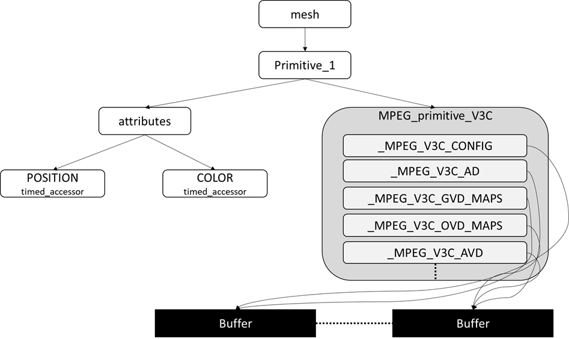

# MPEG_primitive_V3C 

## Contributors

* ISO/IEC SC29 WG3 (MPEG Systems) - Scene Description Breakout Group
* Contacts
  * Thomas Stockhammer (MPEG-I Scene Description BoG Chair, tsto@qti.qualcomm.com)

## Status

Based on [ISO/IEC FDIS 23090-14/AMD 1](https://www.iso.org/standard/84769.html)

## Dependencies

Written against the glTF 2.0 specification and ISO/IEC FDIS 23090-14.

## Overview

In order to support V3C compressed objects in MPEG-I scene description, the `MPEG_media` extension is used to refer to V3C compressed bitstreams. 
The presentation engine may support the operations to perform the 3D reconstruction of decoded V3C components as indicated in the following Figure. 

The presentation engine accesses the decoded V3C data through buffers. 
A syntax of the V3C object is provided as an extension to mesh.primitive in a scene description format. The extension refers to the decoded data of a V3C object. Each decoded V3C component is signalled using properties defined in the MPEG_primitive_V3C extension. The extension is specific to objects coded with a V3C compression scheme (i.e. ISO/IEC 23090-5 [1] or ISO/IEC 23090-12 [2]).

The V3C extension is identified by `MPEG_primitive_V3C`. 

## glTF Schema Updates

The format of the `MPEG_primitive_V3C` glTF extension is as follows:

**`MPEG_primitive_V3C` Properties**

|   |Type|Description|Required|
|---|---|---|---|
|**_MPEG_V3C_CONFIG**|`integer`|This property shall provide a reference to a timed accessor that contains configuration information that is applicable to a sequence of frames of the V3C decoded mesh primitive.|Yes|
|**_MPEG_V3C_AD**|[`MPEG_primitive_V3C.atlas`](#reference-MPEG_primitive_V3C.atlas)|This property shall provide a reference to a timed accessor that provides the V3C atlas data buffer. |Yes|
|**_MPEG_V3C_GVD_MAPS**|`integer` `[1-*]`|This property provides provides an array of video texture references, each of which corresponds to one map of the decoded geometry video data.|Yes|
|**_MPEG_V3C_OVD_MAPS**|`integer` `[1-*]`|This property provides an array of video texture references each of which corresponds to one maps of the decoded occupancy video data.|No|
|**_MPEG_V3C_AVD**|[`MPEG_primitive_V3C.attribute`](#reference-MPEG_primitive_V3C.attribute) `[0-*]`|this component shall provide an array of objects, each of which describing an attribute component of the V3C compressed mesh primitive. The properties of the components are described in Table G.1.|No|
|**extensions**|`object`|JSON object with extension-specific objects.|No|
|**extras**|[`any`](#reference-any)|Application-specific data.|No|

Additional properties are allowed.

* **JSON schema**: [MPEG_primitive_V3C.schema.json](/Extensions/MPEG_primitive_V3C/schema/MPEG_primitive_V3C.schema.json)

### MPEG_primitive_V3C._MPEG_V3C_CONFIG

The _MPEG_V3C_CONFIG component provides a reference to a timed accessor that contains configuration information that is applicable to a sequence of frames of the V3C decoded mesh primitive. 

* **Type**: `integer`
* **Required**: Yes
* **Minimum**: ` >= 0`

### MPEG_primitive_V3C._MPEG_V3C_AD

The _MPEG_V3C_AD component references a timed accessor that provides the V3C atlas data buffer.

* **Type**: `integer`
* **Required**: No
* **Minimum**: ` >= 0`

### MPEG_primitive_V3C._MPEG_V3C_GVD_MAPS

The _MPEG_V3C_GVD_MAPS array provides an array of video texture references, each of which corresponds to one map of the decoded geometry video data.

* **Type**: `integer` `[1-*]`
* **Required**: Yes
* **Minimum**: ` >= 0`

### MPEG_primitive_V3C.OVD_MAPS

The _MPEG_V3C_OVD_MAPS array provides an array of video texture references each of which corresponds to one maps of the decoded occupancy video data.

* **Type**: `integer` `[0-*]`
* **Required**: No
* **Minimum**: ` >= 0`

### MPEG_primitive_V3C._MPEG_V3C_AVD

The _MPEG_V3C_AVD array provides an array of objects, each of which describing an attribute component of the V3C compressed mesh primitive. 

* **Type**: `MPEG_primitive_V3C.attribute` `[0-*]`
* **Required**: No
* **Minimum**: ` >= 0`

### MPEG_primitive_V3C.extensions

JSON object with extension-specific objects.

* **Type**: `object`
* **Required**: No
* **Type of each property**: Extension

### MPEG_primitive_V3C.extras

Application-specific data.

* **Type**: [`any`](#reference-any)
* **Required**: No

---------------------------------------

## MPEG_primitive_V3C.atlas.

The atlas object provides information about the version number of the atlas. It also provides the accessor that provides access to the atlas data.

**`MPEG_primitive.attribute.` Properties**

|   |Type|Description|Required|
|---|---|---|---|
|**version**|`integer`| This provides a version that identifies the associated configuration and atlas data buffer format.  |No, default: `1`|
|**accessor**|`integer`|The accessor provides the index of the timed accessor that provides access to the atlas data buffer. |Yes`|

### MPEG_primitive_V3C.attribute.version

The version provides a version that identifies the associated configuration and atlas data buffer format. The current version of specification defines version “1”, with the buffer formats specified in clause G.1.3 and G.1.4.

* **Type**: `integer`
* **Required**: No, default: 1
* **Minimum**: ` >= 0`

### MPEG_primitive_V3C.attribute.accessor

The accessor provides the index of the timed accessor that provides access to the atlas data buffer

* **Type**: `integer`
* **Required**: Yes
* **Minimum**: ` >= 0`

---------------------------------------

## MPEG_primitive_V3C.attribute.

Media used to create a texture, audio source, or any other media type.

**`MPEG_primitive.attribute.` Properties**

|   |Type|Description|Required|
|---|---|---|---|
|**type**|`integer`|This provides the type of the attribute as defined in Table-3 of ISO/IEC 23090-5. |No|
|**maps**|`integer` `[1-*]`| This array shall provide a list of video texture references, each of which corresponds to one map of the decoded attribute video data. |Yes|

### MPEG_primitive_V3C.attribute.type

The type provides the type of the attribute as defined in Table-3 of ISO/IEC 23090-5.

* **Type**: `integer`
* **Required**: No, default: 1
* **Minimum**: ` >= 0`

### MPEG_primitive_V3C.attribute.maps

The maps array provides a list of video texture references, each of which corresponds to one map of the decoded attribute video data

* **Type**: `integer` `[1-*]`
* **Required**: Yes

## Known Implementations

* [ISO/IEC WD 23090-24](https://www.iso.org/standard/83696.html)

## Resources

* [ISO/IEC IS 23090-10](https://www.iso.org/standard/78991.html), Information technology — Coded representation of immersive media — Part 10: Carriage of visual volumetric video-based coding data
* [ISO/IEC IS 23090-5](https://www.iso.org/standard/73025.html), Information technology – Coded Representation of Immersive Media – Part 5: Visual Volumetric Video-based Coding (V3C) and Video-based Point Cloud Compression (V-PCC)

