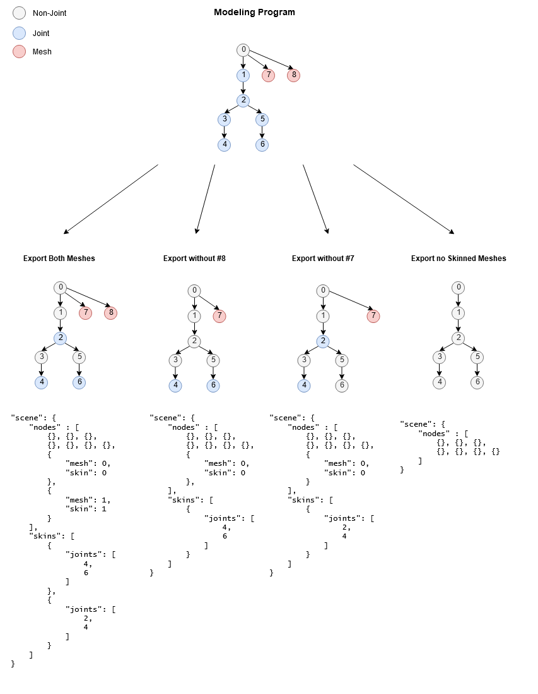

# STAIK_skeletons

## Contributors

* Marios Staikopoulos, <mailto:marios@staik.net>

## Status

Draft

## Dependencies

Written against the glTF 2.0 spec.

## Overview

This extension adds strict skeleton definitions to the glTF model. This allows renderers with skeletal based systems to avoid the ambiguity involved currently with skeleton derivation from skins.

It also prevents the loss of joint data on export of specific skinned meshes:
<p align="center">

</p>

Unlike the base glTF 2.0 spec, the `joints` in the scene graph are no longer defined by a `skin`, they are now defined by the `skeleton`.
Joints are unique to skeletons, and cannot be reused. While multiple skins can still use joints, the node ids in the skins `joints` array must all be nodes which belong to the skeletons `joints` array.

This extension is meant to be *optional*. The current definitions allow imorters which do not care about skeletons to fall back to their default skin-only implementation.

## Nodes and Joints

A node is a `joint` if the `skeleton` property is marked, and its value is the Id in the array of `skeletons` for which the joint is a member of.

```json
"nodes" : [
    {
        "name": "joint_0",
        "extensions": {
            "STAIK_skeletons": {
                "skeleton": 0
            }
        }
    }
]
```

* **JSON schema**: [node.STAIK_skeletons.schema.json](schema/node.STAIK_skeletons.schema.json)

## Skeletons

Skeletons are composed of a tree of nodes, whose joints are nodes marked with the `skeleton` property.

The subtree must:
* Be a complete subtree (no non-joints lie in between joints of the skeleton)
* Have a single root
* The root must be joint
* The root must be in the `joints` array.


> **Note:** While many importers support multi-rooted trees, the decision to use a single root comes from the fact that it is less complex and more portable. While many importers that support multi-rooted skeletons can trivially support single-rooted skeletons, the reverse may not be true. Also, a single root makes the decision of the meshes inheriting transform a trivial matter.

The `root` property points to the root node of the connected joint tree, and it is unique. The `skinned mesh` which uses said skeleton will use the parent of the `root`'s transform.

The `skeleton` can also contain `inverseBindMatrices` which behave in the exact way as they do in skins. They are used to compute the default bind pose of the skeleton.

> **Implementation Note:** If the inverseBindMatrices are not defined, the default bind pose of the skeleton should be obtained directly from the joint nodes in the scene graph.

```json
"skeletons": [
    {
        "name": "skeleton_0",
        "root": 2,
        "joints": [
            2,
            3,
            4,
            5,
            6
        ],
        "inverseBindMatrices": 0
    }
]
```

### Properties

|Name|Required|Description|
|----|--------|-----------|
|`root`|Yes|The root node of the skeleton joint tree.|
|`joints`|Yes|The array of nodes which are joints, and form a complete subtree in the scene graph.|
|`inverseBindMatrices`|No|The inverseBindMatrices of the default skeleton bind pose.|
|`name`|No|The name of the skeleton.|

* **JSON schema**: [skeleton.schema.json](schema/skeleton.schema.json)

## Skins

### Modifications

* Skins belong to a unique Skeleton.
* The `skeleton_owner` property in `extensions` is marked with the skeleton id the current skin belongs to.
* All `joints` in the skin are `joints` (`nodes` with the `skeleton` property).
* All `joints` in the skin belong to the same skeleton.
* The `skeleton` optional property is now required and its value is the skeletons `root` joint.

> **Implementation Note:** If the `inverseBindMatrices` are present in a skin and different that the IBM's defined in the skeleton, they *override* the default bind pose of the skeleton. If the inverse bind matrices are *not* present, the binds are derived from the scene (not the skeletons default bind pose).

> **Note:** The below json refers to the json in the skeleton definition. The `skeleton` *property* is the `root` of the skeleton. The `skeleton_owner` property is the id of the `skeleton`. All joints are also members of the skeltons joints.

```json
"skins": [
    {
        "name": "skin_0",
        "inverseBindMatrices": 1,
        "joints": [ 4, 5 ],
        "skeleton": 2, 
        "extensions": {
            "STAIK_skeletons": {
                "skeleton_owner": 0
            }
        }
    }
]
```

* **JSON schema**: [skin.STAIK_skeletons.schema.json](schema/skin.STAIK_skeletons.schema.json)
