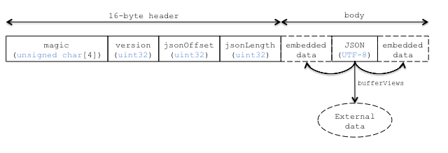

# CESIUM_binary_glTF

## Contributors

* Patrick Cozzi, [@pjcozzi](https://twitter.com/pjcozzi)
* Tom Fili, [@CesiumFili](https://twitter.com/CesiumFili)

## Status

Experimental

## Dependencies

Written against the glTF 0.8 spec.

## Overview

glTF provides two delivery options that can be also be used together:
* glTF JSON points to external binary data (geometry, key frames, skins), images, and shaders.
* glTF JSON has base64-encoded binary data, images, and shaders using data uris.

Base64-encoding increases the file size and requires extra decoding.  glTF is commonly criticized for requiring separate requests or extra space due to base64-encoding.

To solve this, this extension introduces a container format, _Binary glTF_.  In Binary glTF, glTF resources (JSON, .bin, images, and shaders) are stored in a binary blob.  The `TextDecoder` JavaScript API can be used to extract the JSON from the binary blob, which can be parses with `JSON.parse` as usual, and then the binary blog is treated as a glTF `buffer`. Informally, this is like embedding the JSON, images, and shaders in the .bin file.

## Binary glTF Layout

The binary blob is little endian.  It has a 16-byte header followed by the glTF resources, including the JSON:

**Figure 1**: Binary glTF layout.


`magic` is the ANSI string `'glTF'`, and can be used to identify the binary blob as Binary glTF.  `version` is an `uint32` that indicates the version of the Binary glTF container format, which is currently `1`.  `jsonOffset` is the offset, in bytes, from the start of the binary blog to the start of the glTF JSON.  `jsonLength` is the length of the glTF JSON in bytes.

`jsonOffset` and `jsonLength` are used to access the JSON.  This extension does not define where the JSON is in the binary blog, other that it is past the 16-byte header and is continious, nor does it define where the JSON is stored relative to the embedded data.  Figure 1 illistrates that the embedded data may come before or after the JSON (or both).  Pragmatically, exporter implementations will find it easier to write the JSON after the embedded data to make computing `byteOffset` and `byteLength` for bufferviews straightforward.

Given an `arrayBuffer` with Binary glTF, Example 1 shows how to parse the header and access the JSON.

**Example 1**: Parsing Binary glTF.  This uses a `TextDecoder` wrapper in Cesium, [`getStringFromTypedArray`](https://github.com/AnalyticalGraphicsInc/cesium/blob/bgltf/Source/Core/getStringFromTypedArray.js).  Cesium's [`loadImageFromTypedArray`](https://github.com/AnalyticalGraphicsInc/cesium/blob/bgltf/Source/Core/loadImageFromTypedArray.js) helper function is also useful to extracting images from Binary glTF.
```javascript
var sizeOfUnit32 = Uint32Array.BYTES_PER_ELEMENT;

var magic = getStringFromTypedArray(arrayBuffer, 0, 4);
if (magic !== 'glTF') {
    // Not Binary glTF
}

var view = new DataView(arrayBuffer);
var byteOffset = sizeOfUnit32;  // Skip magic number

var version = view.getUint32(byteOffset, true);
byteOffset += sizeOfUnit32;
if (version !== 1) {
    // This only handles version 1.
}

var jsonOffset = view.getUint32(byteOffset, true);
byteOffset += sizeOfUnit32;

var jsonLength = view.getUint32(byteOffset, true);
byteOffset += sizeOfUnit32;

var jsonString = getStringFromTypedArray(arrayBuffer, jsonOffset, jsonLength);
var json = JSON.parse(jsonString)
```

## glTF Schema Updates

This required some minor spec additions (which are up for discussion):
* `"self"` is the buffer that references the binary glTF file.
* `shader` can have a `uri` (as usual) or a `bufferView` so the text can be extracted from the typed array (binary glTF).
* `image` can have a `uri` (as usual) or `bufferView`, `mimeType`, `width`, and `height`, which allows users to create a JavaScript image like [this](https://github.com/AnalyticalGraphicsInc/cesium/blob/2d4b2f8694d525e65a29b8b524b1c07b9abd609c/Source/Core/loadImageFromTypedArray.js).

**File size and number of files**

Tested with our [aircraft model](https://github.com/AnalyticalGraphicsInc/cesium/tree/master/Apps/SampleData/models/CesiumAir) (we need to test with me).

            | dae               | glTF              | glTF (base64-encoded bin/png/glsl) | Binary glTF
------------|-------------------|-------------------|------------------------------------|------------
size        | 1.07 MB (3 files) | 802 KB (8 files)  | 1.03 MB                            |  806 KB
size (gzip) | 728 KB            | 677 KB            | 706 KB                             |  707 KB

(Not impressed by gzip size for this example)

Binary glTF still supports external resources and embedded base64 ones.  For example, I think a common case will be to embed .bin and shaders into a binary glTF and then have external images.

Questions
* Do we want this to become core glTF?  Or a container format?
* Any recommended tweaks to the schema?

## Known Implementations

* Cesium ([code](https://github.com/AnalyticalGraphicsInc/cesium/blob/bgltf/Source/Scene/Model.js))

## Resources

* Discussion - [#357](https://github.com/KhronosGroup/glTF/issues/357)
* base64-encoded data in glTF - [#68](https://github.com/KhronosGroup/glTF/issues/68)
