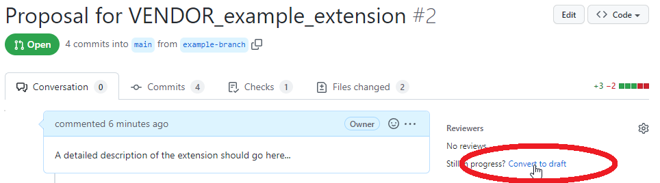
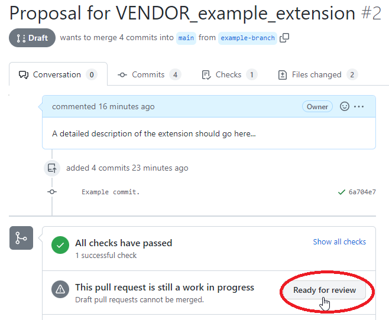

<!--
Copyright 2015-2021 The Khronos Group Inc.
SPDX-License-Identifier: CC-BY-4.0
-->

# Extension Development - States

In the following, extensions are roughly classified by their maturity. This description focusses on the _methods_ that are used in the development process. Further details about the _technical_ process (e.g. the proper format for the specification) or the _formal_ process (e.g. for ratification) will be given in later sections.

## States Overview

- **Extension Ideas:** This refers to high-level ideas about the _features_ that may be supported by glTF via an extension. 
- **Draft Extension Proposals:** This refers an early phase of the development of a technical solution for an extension.
- **Extension Proposals:** A proposal for an extension that includes a proper technical specification, and is supposed to become an official, complete specification in the Khronos repository.
- **Complete Extensions:** An extension that has been marked as complete and final, and is now hosted in the Khronos glTF GitHub repository.
- **Ratified Extensions:** An extension that went through the formal process of being ratified by Khronos. More details on that are given in section [TODO LINK].
- **Promoted to Core:** An extension that has become part of the glTF core specification (hypothetical)
- **Archived Axtensions:** An extension that is kept for compatibility reasons, but should no longer be used in new glTF assets.
  
An extension will usually go through all these states. Most of the development will happen when the extension is in the _Draft extension proposal_ state. 

A special case is when vendors implement their own extensions internally, and later decide to make these extension publicly available in the Khronos repository. This basically means that the _Extension Idea_ state and _Draft Extension Proposal_ states have been skipped. In these cases, special care as to be taken - for example, to make sure that the given _Extension Proposal_ does not have a significant overlap with other extensions. These considerations will be described in more detail in [TODO Link to Format or Technical part].

## State Descriptions

### Extension Ideas

Extension ideas should be discussed in a dedicated GitHub Issue. 

It is important to discuss these ideas _early_ and _publicly_: Others might have the same idea, and making the idea public makes it easier to gather early feedback, find collaborators, and eventually reach a consensus. The first post of the GitHub issue should therefore outline the idea in a form that enables this sort of feedback: The post has to state a clear, high-level _goal_. It should describe the _domain_ in which the extension will be applied, including possible _use-cases_. It should clearly define the _scope_ and the _limits_ of the extension idea.

On this level, the idea does not yet have to include approaches for a technical _solution_.

### Draft Extension Proposals

Draft extension proposals should be mainained in GitHub Pull Requests that are marked as _'Draft'_. 

After an extension idea has been discussed, possible collaborators have been identified, and when the idea is interesting for the broader community, a first draft of a technical solution can be created. Contributors and collaborators can provide feedback. Alternatives for technical solutions - and their advantages and disadvantages - are discussed. The goal of this work is to develop a robust technical specification of the extension. The technical requirements for such a specification are described in section [TODO LINK].

### Extension Proposals

Extension proposals that are finalized (and no longer in _draft_ state) should be in GitHub Pull Requests that are marked as _'Ready for Review'_. 

In this state, the collaborators are convinced that the proposal fulfills all the technical reqirements that are described in section [TODO LINK]. 

The Khronos 3D Formats Working Group is informed, and assigns one or more reviewers for the proposal (TODO... and we have no idea how to do that yet. LOL.) The reviewers will give feedback that will be integrated by the collaborators, until all quality criteria and technical requirements are met. Then, the Pull Request is merged into the Khronos glTF repository. 

### Complete Extensions

Complete extensions are extensions that have been merged into the Khronos glTF repository. 

These extensions are supposed to be **_final_**. There is no concept for _versioning_ in extensions. This means that any normative change in the extension would make it necessary to create a new extension, with a new name, undergoing a new review process.

The _formal_ status of a Complete Extension may still change, when it becomes _ratified_. 

### Ratified Extensions

Extensions that have been ratified by the Khronos Group, and are covered by the Khronos IP framework.

TODO More details here? Probably just a link to the section that will describe the ratification _process_ (see "Extension Development -Formal" below)

### Promoted To Core

Extensions that cover a functionality that has become part of a new glTF version, and therefore does no longer require an extension. 

This is a hypothetical scenario. There are no plans for major glTF version updates for the near future.

### Archived Extensions

Extensions that had been Complete or Ratified, but are no longer recommended for creating new glTF assets. 

These extensions are kept for backward compatibility, and may be required for reading older glTF assets that used these extensions. 

