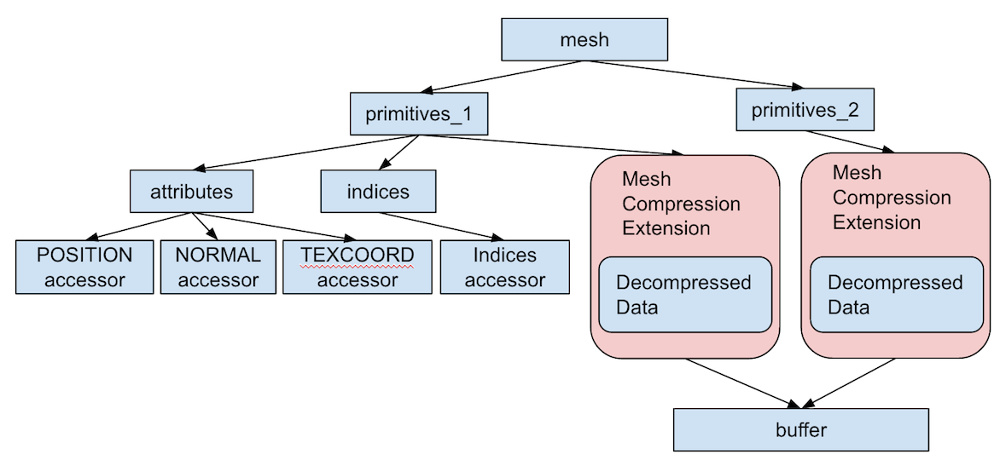

# KHR_draco_mesh_compression

## Contributors

* Fan Zhang, Google, <mailto:zhafang@google.com>
* Ondrej Stava, Google, <mailto:ostava@google.com>
* Frank Galligan, Google, <mailto:fgalligan@google.com>
* Kai Ninomiya, Google, <mailto:kainino@google.com>
* Patrick Cozzi, Cesium, [@pjcozzi](https://twitter.com/pjcozzi)

## Status

Draft

## Dependencies

Written against the glTF 2.0 spec.

## Overview

This extension defines a schema to use Draco geometry compression libraries in glTF format. This allows glTF to support streaming compressed geometry data instead of the raw data.

The [conformance](#conformance) section specifies what an implementation must do when encountering this extension, and how the extension interacts with the attributes defined in the base specification.

## glTF Schema Updates

Draco geometry compression library could be used for `primitive` by adding an `extension` property to a primitive, and defining its `KHR_draco_mesh_compression` property.

The following picture shows the structure of the schema update. 

**Figure 1**: Structure of geometry compression extension.


In general, we will use the extension to point to the buffer that contains the compressed data. The major change is that the `accessor` in an extended `primitive` no
longer points to a `bufferView`. Instead, the `attributes` of a primitive will use the decompressed data. This is valid because in glTF 2.0, `bufferView` is not required in `accessor`, although if it is not present, it will be used with `sparse` field to act as a sparse accessor. In this extension, we will ignore the `bufferView` property.

Usage of the extension must be listed in the `extensionUsed` and `extensionsRequired`. 

```javascript
"extensionsUsed" : [
    "KHR_draco_mesh_compression"
]

"extensionsRequired" : [
    "KHR_draco_mesh_compression"
]

```

The extension then could be used like the following, note that all other nodes stay the same
except `primitives`:

```javascript

"mesh" : {
    "primitives" : [
        {
            "attributes" : {
                "POSITION" : 11,
                "NORMAL" : 12,
                "TEXCOORD_0" : 13,
            },
            "indices" : 10,
            "mode" : 4
            "extensions" : {
                "KHR_draco_mesh_compression" : {
                    "bufferView" : 5,
                    "attributesOrder" : [
                        "POSITION",
                        "NORMAL",
                        "TEXCOORD_0"
                    ],
                    "version" : "0.9.1"
                }
            }
        },
    ]
}

"bufferViews" : [
    // ...
    // bufferView of Id 5
    {
        "buffer" : 10,
        "byteOffset" : 1024,
        "byteLength" : 10000
    }
    // ...
}

```
We will explain each of the property in the following sections.
#### bufferView
The `bufferView` property points to the buffer containing compressed data. The data should be passed to a mesh decoder and decompressed to a
mesh.

#### version
The version of Draco encoder used to compress the mesh. This is used for verifying compatibility of Draco encoder and decoder. With this property, the loader could easily determine if the current decoder supports decoding the data.

### attributesOrder
`attributesOrder` defines the order of attributes stored in the decompressed geometry. E.g, in the example above, `POSITION` will have attribute id 0 in the decoded mesh, and `NORMAL` as 1, `TEXCOORD_0` as 2. The id should be used along with `accessors` to correctly load all attributes from extension.

#### Restrictions on geometry type
When using this extension, the `mode` of `primitive` could only be one of
`POINTS`, `TRIANGLES` and `TRIANGLE_STRIP` and the mesh data will be decoded accordingly. For example, if `mode` is `POINTS`, then the
decompressed geometry will be a point cloud.

### JSON Schema

For full details on the `KHR_draco_mesh_compression` extension properties, see the schema:

* [extension property](schema/node.KHR_draco_mesh_compression.schema.json) `KHR_draco_mesh_compression` extensions object.

## Conformance

To process this extension, there are some changes need to be made in loading a glTF asset.
* Check `version` property and verify the version of encoder used for the mesh
  is compatible with the current decoder.
* When encountering a `primitive` with the extension the first time, you must process the extension first. Get the data from the pointed `bufferView` in the extension and decompress the data to a geometry of a specific format, e.g. Draco geometry.
* Then, process `attributes` and `indices` properties of the `primitive`. When loading each `accessor`, if there is no `bufferView` then go to the previously decoded geometry in the `primitive` to get indices and attributes data. To load an attriute in extension, it is required to first determine the id of this attribute in using `attributesOrder`, then use the id to get the attribute from decoded mesh.

It is pretty straigtforward for top-down loading of a glTF asset, e.g. only
decompress the geometry data when a `primitive` is met for the first time. However, for
bottom-up loading, loading `accessor` before `primitive` will not get the data. It could only be handled when processing its parent `primitive`. This is based on the consideration that it will rarely happen that
loading an `accessor` without knowing its parent `primitive`. And it should be
easy enough to change the loader to ignore `accessor` without `bufferView` in glTF 2.0. But we are
definitely open to change this if there actually are some use cases that require
loading `accessor` independently. 

## Resources

* [Draco Open Source Library](https://github.com/google/draco)
* [ThreeJS
  Loader](https://github.com/mrdoob/three.js/blob/dev/examples/js/loaders/DRACOLoader.js)
  and
  [example](https://github.com/mrdoob/three.js/blob/dev/examples/webgl_loader_draco.html)


# Appendix: Alternative Approach

See [ALTERNATIVE.md](ALTERNATIVE.md).
