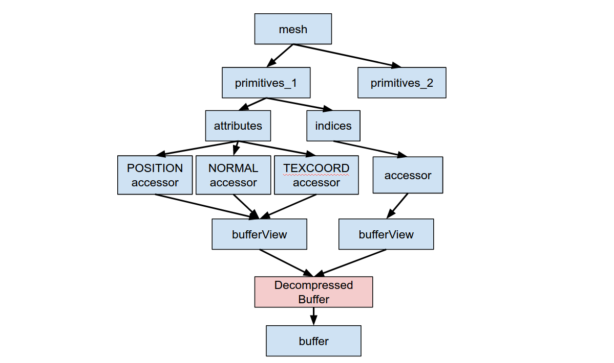

# KHR_draco_geometry_compression

## Contributors

* Fan Zhang, Google, <mailto:zhafang@google.com>
* Ondrej Stava, Google, <mailto:ostava@google.com>
* Frank Galligan, Google, <mailto:fgalligan@google.com>
* Kai Ninomiya, Google, <mailto:kainino@google.com>
* Patrick Cozzi, Cesium, [@pjcozzi](https://twitter.com/pjcozzi)

## Status

Draft

## Dependencies

Written against the glTF 2.0 spec.

## Overview

This extension defines an schema to use Draco geometry compression libraries in glTF format. This allows glTF to support streaming compressed geometry data instead of the raw data.

The [conformance](#conformance) section specifies what an implementation must to do when encountering this extension, and how the extension interacts with the attributes defined in the base specification.

## glTF Schema Updates

Draco geometry compression library could be used for `primitive` by adding an `extension` property to a primitive, and defining its `KHR_draco_geometry_compression` property.

The following picture shows the structure of the schema update. 

**Figure 1**: Structure of geometry compression extension.


In general, we will use the extension to point to the buffer that contains the compressed data. The major change is that `accessor` in extended `primitive` no
longer point to a `bufferView`. Instead, the `attributes` of a primitive will use the decompressed data. This is valid because in glTF 2.0, `bufferView` is not required in `accessor`, although if it is not present or the id is 0, it will be used with `sparse` field to act as a sparse accessor. In this extension, we will ignore the `bufferView` property.

Usage of the extension must be listed in the `extensionUsed` and `extensionsRequired`. 

```javascript
"extensionsUsed" : [
    "KHR_draco_geometry_compression"
]

"extensionsRequired" : [
    "KHR_draco_geometry_compression"
]

```

The extension then could be used like, not that all other nodes stay the same
except `primitives`:

```javascript

"mesh" : {
    "primitives" : [
        {
            "attributes" : {
                "POSITION" : 11,
                "NORMAL" : 12,
                "TEXCOORD_0" : 13,
            },
            "indices" : 10,
            "mode" : 4
            "extensions" : {
                "KHR_draco_geometry_compression" : {
                    "bufferView" : 5,
                    "indicesCount" : 1000,
                    "vertexCount" : 500,
                    "attributes" : [
                        {
                            "semantic" : "POSITION",
                            "componentType" : 5126,
                            "type" : "VEC3",
                        },
                        {
                            "semantic" : "NORMAL",
                            "componentType" : 5126,
                            "type" : "VEC3",
                        },
                        {
                            "semantic" : "TEXCOORD_0",
                            "componentType" : 5126,
                            "type" : "VEC2",
                        },
                    ]
                }
            }
        },
    ]
}

"bufferViews" : [
    // ...
    // bufferView of Id 5
    {
        "buffer" : 10,
        "byteOffset" : 1024,
        "byteLength" : 10000
    }
    // ...
}

```
We will explain each of the property in the following sections.
#### bufferView
The `bufferView` property points to the buffer containing compressed data. The data should be passed to a mesh decoder and decompressed to a
mesh.

#### indicesCount, vertexCount
`indicesCount` and `vertexCount` are references for verifying the decompression of
mesh.

#### attributes
The decompressed mesh needs to be write to the memory for uploading to GPU,
including indices and attributes data. `attributes` is used to define the
order of the attributes. For example, if we have the above `attributes`, then we need to write the attributes to vertex buffer like

     --------------------------------------------------
    |    POSITION    |    NORMAL    |    TEXCOORD_0    |  
     --------------------------------------------------

`componentType` and `type` are duplicated properties in
`accessor` of `attributes`. The purpose of having these in the extension is to
define how to write the decompressed mesh to buffer for uploading to GPU without
refering to the sibling `attributes` node.

The extension currently don't support morph targets, e.g. `targets` is used in
`primitive`. 

#### Restrictions on geometry type
When using this extension, the `mode` of `primitive` could only be one of
`POINTS`, `TRIANGLES` and `TRIANGLE_STRIP` and the mesh data will be decoded accordingly. For example, if `mode` is `POINTS`, then the
decompressed geometry will be a point cloud.

### JSON Schema

For full details on the `KHR_binary_glTF` extension properties, see the schema:

* [extension property](schema/node.KHR_draco_geometry_compression.schema.json) `KHR_draco_geometry_compression` extensions object.

## Conformance

To process this extension, there are some changes need to be made in loading
glTF.
* When encounter a `primitive` with the extension the first time, must process the extension first. Get the data from the pointed `buffer` in the extension and decompress the data to a geometry of a specific format, e.g. Draco geometry.
* Write the indices and vertex data of the mesh to separate buffers. This allows for uploading data with different target including ARRAY_BUFFER and ELEMENT_ARRAY_BUFFER. When writing attributes to a buffer, the order should follow property `attributesOrder` as discribed above.
* Then, process `attributes` and `indices` properties of the `primitive`. When handling `accessor`, insteading of getting data from the regular `bufferView --> buffer`, get the data from the buffers created in previous step.

It is pretty straigtforward for top-down loading of glTF file, e.g. only
decompress the geometry data when a `primitive` is met the first time. However, for
bottom-up loading, loading `accessor` before `primitive` will not get the data. It could only be handled when processing its parent `primitive`. This is based on the consideration that it will rarely happen that
loading an `accessor` without knowing its parent `primitive`. And it should be
easy enought to change the loader to ignore `accessor` without `bufferView` in glTF 2.0. But we are
definitely open to change this if there actually is some use cases that require
loading `accessor` independently. 

## Alternative Approach

We also thought about other designs for adding geometry compression as an extension, but we don't think they are as good as the proposed one. We will describe one here in case someone is interested.


The idea is to add an extension object `decompressedBuffer` to `bufferView` instead of `primitive`. See the following picture for the structure of the alternative approach.
`decompressedBuffer` will work like `bufferView` but pointing to compressed data. The extension will basically declare that the data pointed by the `bufferView` is compressed geometry data. Then for bottom-up loading, the process is to decompress the data when the `bufferView` is loaded, and store the data as a normal buffer of `bufferView`. So after decompression `bufferView` should work the same with or without the extension. For top-down loading, when `accessor` requires the data through `bufferView` the first time, the loader needs to look at the decompressed mesh data of `bufferView` instead of regular `bufferView` --> `buffer` approach.


The advantage of this alternative approch is that it has less impact on the modularity of layers of standard glTF spec. For example, for bottom-up loading, it only requires to load `decompressedBuffer` between `buffer` and `bufferView` so that it could replace the data used by `bufferView`. However, it will change the `bufferView` that its `buffer` property will not be used any more. Another disadvantage is that it is not good for high level understanding and looks hacky. The proposed approach is mush easier to understand and the structure is clear since the compression is applied on the mesh/primitive objects. But we are definitely open to discussions about the choice we made.


**Figure 2**: Structure of extension.

