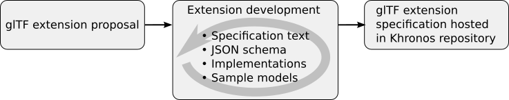

<!--
Copyright 2015-2021 The Khronos Group Inc.
SPDX-License-Identifier: CC-BY-4.0
-->

# glTF Extensions

Extensions are an important element of the glTF ecosystem. They can extend the core glTF model format with new properties and functionalities. 

## Existing glTF Extensions

The [glTF Extension Registry](ExtensionRegistry.md) shows all extensions that are currently tracked in this repository.

## Developing glTF Extensions

Everybody can propose new extensions for glTF. But in order to ensure high quality, robustness, and interoperability of the extensions that are hosted in the Khronos glTF repository, some guidelines have to to followed. 

### Extension Development - 1-minute summary

The high-level outline of the process of publishing a glTF extension specification in the Khronos glTF repository is shown here:

- A glTF extension is proposed. 
  
  This means that the idea or proposal for the extension is made _public_. This can happen in different ways - for example, as a GitHub issue or pull request, depending on the maturity of the proposal. 

- The glTF extension is developed.

  This is usually an iterative process. The goal of this process is to make sure that all conditions that are required for hosting the extension specification in the Khronos repository are met. The most important conditions are 

  - A well-written specification text, as a Markdown- or AsciiDoc file
  - A complete JSON schema for the elements that are supposed to be added to the glTF JSON
  - A proof that there are at least two independent implementations of the extension. This means that at least two libraries or applications from different vendors must support the extension.
  - Sample models. Examples of glTF assets that show how the extension is used.

- The glTF extension is hosted in the Khronos glTF repository.

  When all conditions are met and the extension specification has been reviewed, it will be integrated into the Khronos glTF repository, and be listed in the [glTF Extension Registry](ExtensionRegistry.md).

### Extension Development - Details

The following sections describe the extension development process in more detail:

- [Extension Development - States](ExtensionDevelopmentStates.md) - Describes the differences between extension ideas, draft extension proposals, extension proposals, completed extensions, and ratified extensions.

- [Extension Development - Technical](ExtensionDevelopmentTechnical.md) - Describes the technical process for creating an extension proposal, and the requirements that must be met before an extension is completed and added to the glTF Extension Registry.

- [Extension Development - Formal](ExtensionDevelopmentFormal.md) - Describes the process of converting a complete extension into a ratified extension

