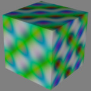
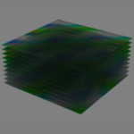
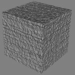
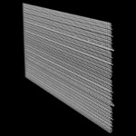
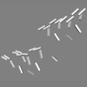
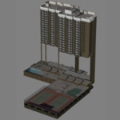
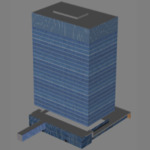

# Benchmarking Procedure

Each `BenchData` directory contains a COLLADA `.dae` file.  Each of these was converted to several different glTF formats (below).  All files except for stand-alone textures were pre-gzipped, and the resulting files were served using `Content-Encoding: gzip`.

* glTF, all resources separate
* glTF, textures separate, other resources embedded (as data uri)
* glTF, all resources embedded (as data uri)
* Binary glTF, textures separate, other resources embedded (as binary)
* Binary glTF, all resources embedded (as binary)

Finally, these files were loaded and timed in Cesium 1.11 using the HelloWorld minimal Cesium application, with the code in Listing A1.  
All data and applications were served locally.
Tests were run in Google Chrome 43.0, using device emulation at 1920x1080 with WiFi network emulation (30 Mbps 2ms RTT).
Each test was run 5 times, and the mean of the results for each test is reported.

## Detailed results

| Model        | Model            | Format                      |  Load time | Size (gzip\*) | # files | 
| ------------ | ---------------- | --------------------------- | ---------- | ------------- | ------- | 
| Cesium_Air   | Cesium Air       |    |            |               |         | 
|              |                  | gltf, separate              |   0.32 s   |   538 KiB     |   8     | 
|              |                  | gltf, tex-separate          | **0.30 s** |   559 KiB     |   3     | 
|              |                  | gltf, all-embedded          |   0.41 s   |   540 KiB     | **1**   | 
|              |                  | bgltf, tex-separate         | **0.30 s** |   538 KiB     |   3     | 
|              |                  | bgltf, all-embedded         | **0.29 s** | **513 KiB**   | **1**   | 
| LargeTex     | Large Tex        |      |            |               |         | 
|              |                  | gltf, separate              |   3.07 s   |   8.48 MiB    |   5     | 
|              |                  | gltf, tex-separate          |   3.08 s   |   8.48 MiB    |   2     | 
|              |                  | gltf, all-embedded          |   4.62 s   |   8.41 MiB    | **1**   | 
|              |                  | bgltf, tex-separate         | **3.04 s** |   8.48 MiB    |   2     | 
|              |                  | bgltf, all-embedded         | **3.05 s** | **8.31 MiB**  | **1**   | 
| TenTex       | Ten Tex          |        |            |               |         | 
|              |                  | gltf, separate              |   1.58 s   |   4.91 MiB    |   16    | 
|              |                  | gltf, tex-separate          | **1.48 s** |   4.91 MiB    |   11    | 
|              |                  | gltf, all-embedded          |   2.48 s   |   4.95 MiB    | **1**   | 
|              |                  | bgltf, tex-separate         | **1.51 s** |   4.91 MiB    |   11    | 
|              |                  | bgltf, all-embedded         |   1.63 s   | **4.90 MiB**  | **1**   | 
| 100kTris     | 100k Tris        |      |            |               |         | 
|              |                  | gltf, separate              |   0.97 s   | **2.98 MiB**  |   4     | 
|              |                  | gltf, tex-separate          |   1.39 s   |   3.25 MiB    | **1**   | 
|              |                  | gltf, all-embedded          |   ^        |   ^           | **^**   | 
|              |                  | bgltf, tex-separate         | **0.91 s** | **2.98 MiB**  | **1**   | 
|              |                  | bgltf, all-embedded         | **^**      | **^**         | **^**   | 
| BinaryTree   | Binary Tree      |    |            |               |         | 
|              |                  | gltf, separate              | **0.70 s** | **184 KiB**   |   4     | 
|              |                  | gltf, tex-separate          |   0.87 s   | **184 KiB**   | **1**   | 
|              |                  | gltf, all-embedded          |   ^        | **^**         | **^**   | 
|              |                  | bgltf, tex-separate         | **0.69 s** | **184 KiB**   | **1**   | 
|              |                  | bgltf, all-embedded         | **^**      | **^**         | **^**   | 
| SpinningTree | Spinning Tree    |  |            |               |         | 
|              |                  | gltf, separate              |   0.64 s   | **1.24 MiB**  |   4     | 
|              |                  | gltf, tex-separate          |   0.73 s   |   1.34 MiB    | **1**   | 
|              |                  | gltf, all-embedded          |   ^        |   ^           | **^**   | 
|              |                  | bgltf, tex-separate         | **0.59 s** | **1.24 MiB**  | **1**   | 
|              |                  | bgltf, all-embedded         | **^**      | **^**         | **^**   | 
| 1200_12th    | 1200 12th Ave    |     |            |               |         | 
|              |                  | gltf, separate              | **0.85 s** |   1.25 MiB    |   31    | 
|              |                  | gltf, tex-separate          |   0.87 s   |   1.31 MiB    |   22    | 
|              |                  | gltf, all-embedded          |   1.25 s   |   1.30 MiB    | **1**   | 
|              |                  | bgltf, tex-separate         | **0.84 s** |   1.25 MiB    |   22    | 
|              |                  | bgltf, all-embedded         |   1.02 s   | **1.23 MiB**  | **1**   | 
| EauClaire    | Eau Claire Tower |     |            |               |         | 
|              |                  | gltf, separate              |   0.55 s   |   609 KiB     |   23    | 
|              |                  | gltf, tex-separate          | **0.52 s** |   610 KiB     |   16    | 
|              |                  | gltf, all-embedded          |   0.66 s   |   539 KiB     | **1**   | 
|              |                  | bgltf, tex-separate         | **0.53 s** |   608 KiB     |   16    | 
|              |                  | bgltf, all-embedded         |   0.56 s   | **538 KiB**   | **1**   | 

^ Results are excluded for "embedded" for files with no textures, as this is exactly the same as "tex-separate".

\* All files compressed except for stand-alone texture files.

### Benchmarked formats

All files except for stand-alone textures are always pre-gzipped.

| Format       | Description                                      |
| :----------- | :----------------------------------------------- |
| gltf         | Standard glTF                                    |
| bgltf        | Binary glTF                                      |
| separate     | all resources as separate files                  |
| tex-separate | only textures as separate files, others embedded |
| all-embedded | all resources embedded                           |

For standard glTF, files are embedded as base64-encoded data uris.
For binary glTF, files are embedded as binary.

### Model statistics

These statistics are for the optimized models which are then converted to the various glTF formats.

| Model            | Type                        | Images | Draw calls | Tris, rendered | Tris, stored | Nodes | Meshes | Materials | Animations |
| :--------------- | :-------------------------- | -----: | ---------: | -------------: | -----------: | ----: | -----: | --------: | ---------: |
| Cesium Air       | Typical model               |      2 |          5 |          5,984 |       ~5,984 |     7 |      2 |         2 |          2 |
| LargeTex         | Large texture               |      1 |          1 |             12 |           12 |     2 |      1 |         1 |          0 |
| TenTex           | Multiple textures           |     10 |         10 |             20 |           20 |    11 |     10 |        10 |          0 |
| 100kTris         | Many triangles              |      0 |          5 |         99,372 |       99,372 |     2 |      5 |         1 |          0 |
| BinaryTree       | Many objects                |      0 |       8191 |         98,292 |           12 | 8,192 |      1 |         1 |          0 |
| SpinningTree     | Many animations & keyframes |      0 |         31 |            372 |           12 |    32 |      1 |         1 |         93 |
| 1200 12th Ave    | Building data, complex      |     21 |       3827 |         30,235 |              |    17 |  1,197 |        26 |          0 |
| Eau Claire Tower | Building data, simpler      |     15 |         61 |            387 |              |    45 |     47 |        17 |          0 |

### Appendix

**Listing A1**: Code used for benchmarking.
```javascript
// Add to HelloWorld.html.
var viewer = new Cesium.Viewer('cesiumContainer', {globe: false, skyBox: false, skyAtmosphere: false});
var scene = viewer.scene;

var timeModelLoad = function(url) {
    var origin = Cesium.Cartesian3.fromDegrees(0.0, 0.0, 0.0);
    var modelMatrix = Cesium.Transforms.headingPitchRollToFixedFrame(origin, 0.0, 0.0, 0.0);

    var timings = [];

    var f = function() {
        var t0 = performance.now();
        var model = scene.primitives.add(Cesium.Model.fromGltf({
            url : url,
            modelMatrix : modelMatrix,
            asynchronous : true,
            minimumPixelSize : 128
        }));

        model.readyPromise.then(function(model) {
            var t1 = performance.now();
            console.log(t1 - t0);
            model.activeAnimations.addAll({
                loop : Cesium.ModelAnimationLoop.REPEAT
            });
        });
    };

    f();
};

timeModelLoad('/BenchData/Cesium_Air/fmt/CesiumAir.gltf');
```

```javascript
// Add to server.js when using Node.js.
    app.get('*.bin'  , function(req, res, next) { res.header('Content-Encoding', 'gzip'); next(); });
    app.get('*.glsl' , function(req, res, next) { res.header('Content-Encoding', 'gzip'); next(); });
    app.get('*.gltf' , function(req, res, next) { res.header('Content-Encoding', 'gzip'); next(); });
    app.get('*.bin'  , function(req, res, next) { res.header('Content-Encoding', 'gzip'); next(); });
    app.get('*.bgltf', function(req, res, next) { res.header('Content-Encoding', 'gzip'); next(); });
```

### References

[1] Models provided by Cube Cities.
