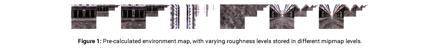
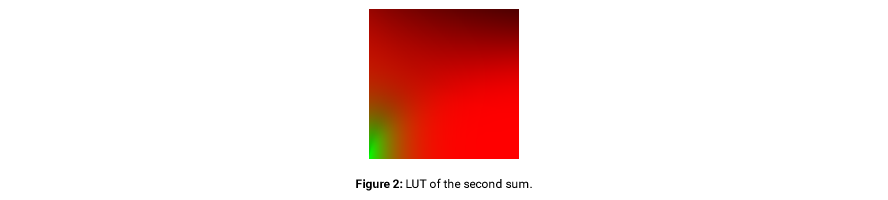

## Physically-based rendering

Physically-based rendering attempts to produce realistic images by accurately modeling light-matter interaction. Material definitions for PBR usually consist of compact sets of parameters suitable to represent a large range of real-world materials.
This extension defines two `techniques` which represent two commonly used PBR material models.

Physically-based rendering (PBR) refers to the concept of using realistic shading/lighting models along with measured surface values to accurately represent real-world materials. PBR is more of a concept than a strict set of rules, and as such, the exact implementations of PBR systems tend to vary. Still, as they are based on the same principal idea (improve realism by approximating physical laws), they are similar across implementations.

Some of the main goals behind PBR are:

**Simplicity**

PBR uses an easy to understand material description defined by a small set of intuitive parameters instead of a large array of parameters, which results in decision paralysis, trial and error, or inter connected properties that require many values to be changed for a single intended effect.

**Extensiveness**

PBR can cover up most of the materials that occur in the real world with a single shading model. As deferred shading limits the number of shading models that can be used, this is highly beneficial. On forward renderers it improves performance by reducing shader switching.

**Consistency**

By using physically-based shading models, which follow real physical laws, materials will look accurate and consistent in all lighting conditions without changing an immense list of parameters and settings.

## Shading model

### Specular BRDF

The most common choice for a physically-based specular BRDF is the Cook-Torrance reflectance model [4]. It is based on the microfacet theory in which surfaces are composed of small-scale planar detail surfaces of varying orientation. Each of these small planes, so called microfacets, reflects light in a single direction based on its normal.

The Cook-Torrance specular BRDF is defined as follows:

Where l is the light direction, v is the view direction, h is the half vector, n is the normal, F is the Fresnel term, G is the geometry term, and D is the normal distribution function (NDF).

**Specular D**

Specular D is represented by the normal distribution function which is used to describe the statistical orientation of the micro facets at a given point. The first PBR implementations used distributions such as Phong or Beckmann, but recently the GGX distribution [Walter et al. 2007] has become a popular choice. 

It is defined by:

Where h is the half-vector(microfacet normal), n is the normal and &alpha; is the roughness of the material.

**Specular F**

The specular F term represents the Fresnel function. The Fresnel function is used to simulate the way light interacts with a surface at different viewing angles. We adopt Schlicks Approximation [7] for the Fresnel term which is the most commonly used in 3D graphics.

Where F0 is the specular reflectance at normal incidence.

#### Specular G

Specular G represents the geometry shadowing function used to describe the attenuation of the light due to microfacets shadowing each other. This is once again a statistical approximation which models the probability of energy loss. This may occur due to microfacets being occluded by each other or light bouncing between multiple microfacets, before reaching the observer's eye. The geometry attenuation is derived from the normal distribution function. Most implementations use Smith's shadowing function [9] or Schlick's model [7].

The complete geometry shadowing function is composed of the two partial functions G_1(n,l) and G_1(n,v) as follows:

The partial Smith shadowing function is defined as:

and the partial Schlick shadowing function is defined by:

where k is defined by:

### Diffuse BRDF

The Lambertian diffuse BRDF is still the first choice. Even though other models (e.g. [2]) are more accurate, the visual improvements are arguably insufficient for justifying the extra computation in real-time applications.

The Lambertian diffuse is defined as:

Where cdiff is the diffuse reflected color of the material. In order to ensure energy conservation, the diffuse term should be balanced using the inverse of the Fresnel term from the specular component [8]:

### Imaged-based Lighting

Image-based lighting (IBL) is the most common technique to simulate indirect lighting in the current PBR engines. It uses environment maps from real-world light probes or rendered scenes to illuminate objects.

#### Importance Sampling

To use the presented shading model with imaged-based lighting, the radiance integral needs to be solved, which can be achieved by using importance sampling. Importance sampling substantially improves the Monte Carlo algorithm by introducing a guided approach to the sampling. The idea is that we can define a Probability Distribution Function (PDF) that describes where we want to sample more and where we want to sample less.

The following equation describes the numerical integration:

which can be solved in real-time directly on the GPU [3].

But even with importance sampling, many samples are still needed to produce acceptable results. In simple scenes with only a few objects and a single environment map this is not a problem. But in more complex scenes with many different objects and multiple environmental light sources the pure importance sampling approach is not suitable anymore for real-time rendering.

This problem can be solved using a split sum approximation [6]. This new technique is employed in the Unreal Engine 4 for real-time PBR of complex scenes.

#### Split Sum Approximation

The split sum approximation splits the sum from (10) into a product of two sums, both of which can be pre-calculated, see (11). This approximation is exact for a constant Li(l) and fairly accurate for common environments.

The first sum is pre-calculated for different roughness values by convolving the environment map with the GGX distribution using importance sampling and storing the results in individual mipmap levels of an environment map texture.

The second sum in (11) includes the remainder and is equivalent to integrating the specular BRDF with a solid-white environment. By substituting in Schlick's Fresnel approximation (3) into the left hand side of (10) F0 can be factored out of the integral. This leaves two inputs (roughness and cos &theta;v) and two outputs (a scale and bias to F0), which can also be pre-calculated and stored in a 2D Look-Up Texture (LUT).

The main advantage of the pre-calculated LUT is that it is constant for white light and it does not depend on a specific environment. So it has to be pre-calculated only once for a particular shading model and can be reused in every shader.

Thus the split sum approximation only two texture fetches per pixel are needed to get the corresponding specular color. This is a significant improvement over the importance sample method, which requires multiple samples per pixel.

### Reflectance Values

Since PBR is based on physical laws one cannot use arbitrary inputs for the reflectance values. Especially for the specular-glossiness model where the parameters allow full control over the reflectance of both metals and non-metals. The values must be correct and measured from real world data. Fortunately, several reference charts exist such as the one from [5] which provides sets of values for specific materials.

## Resources

* [1] ALLEGORITHMIC, 2015. The comprehensive pbr guide vol. 2. [https://www.allegorithmic.com/pbr-guide](https://www.allegorithmic.com/pbr-guide).
* [2] BURLEY, B. 2012. Physically-based shading at disney, part of Practical Physically Based Shading in Film and Game Production. In ACM SIGGRAPH 2012 Courses, SIGGRAPH '12.
* [3] COLBERT, M., AND KIVNEK, J. 2008. Gpu-based importance sampling. In GPU Gems 3, H. Nguyen, Ed. Addison-Wesley, 459-475.
* [4] COOK, R. L., AND TORRANCE, K. E. 1982. A reflectance model for computer graphics. ACM Trans. Graph. 1, 1 (Jan.), 7-24.
* [5] DONTNOD. 2014, [https://seblagarde.files.wordpress.com/2014/04/dontnodgraphicchartforunrealengine4.png](https://seblagarde.files.wordpress.com/2014/04/dontnodgraphicchartforunrealengine4.png).
* [6] KARIS, B. 2013. Real shading in unreal engine 4. In ACM SIGGRAPH 2013 Courses, SIGGRAPH '13. [http://blog.selfshadow.com/publications/s2013-shading-course/karis/s2013_pbs_epic_notes_v2.pdf](http://blog.selfshadow.com/publications/s2013-shading-course/karis/s2013_pbs_epic_notes_v2.pdf)
* [7] SCHLICK, C. 1994. An inexpensive brdf model for physically based rendering. Computer Graphics Forum 13, 233-246.
* [8] SHIRLEY, P., SMITS, B. E., HU, H. H., AND LAFORTUNE, E. P. 1997. A practitioners' assessment of light reflection models. In 5th Pacific Conference on Computer Graphics and Applications(PG '97), IEEE Computer Society, 40.
* [9] WALTER, B., MARSCHNER, S. R., LI, H., AND TORRANCE, K. E. 2007. Microfacet models for refraction through rough surfaces. In Proceedings of the 18th Eurographics Conference on Rendering Techniques, Eurographics Association, Aire-la-Ville, Switzerland, Switzerland, EGSR'07, 195-206.

