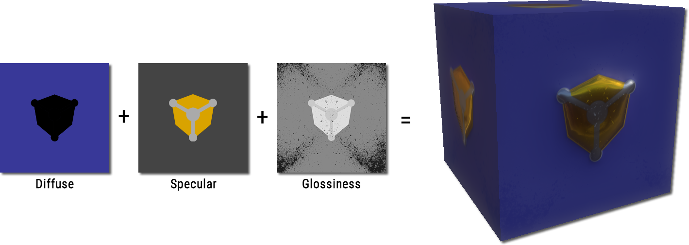
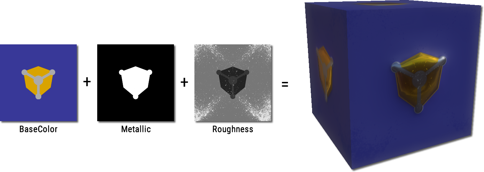

# WEB3D_materials_pbr

## Contributors

* Timo Sturm, Fraunhofer IGD, [@\_tsturm\_](https://twitter.com/\_tsturm\_)
* Miguel Sousa, Fraunhofer IGD, [@mfportela](https://twitter.com/mfportela)
* Maik Th&ouml;ner, Fraunhofer IGD, [@mthoener](https://twitter.com/mthoener)
* Max Limper, Fraunhofer IGD, [@mlimper_cg](https://twitter.com/mlimper_cg)

## Status

Draft

## Dependencies

Written against the glTF 1.0 spec.

## Overview

The glTF 1.0 allows the definition of materials by instancing `techniques`. A `technique`, as defined in glTF 1.0, is a verbose description of shader parameters combined with actual shader code. Typically, shader code is engine specific and, as such, may not be used across systems which do not share the same rendering pipeline.

This extension provides two new `techniques` consisting of a well defined set of parameters which are sufficient for representing a wide range of materials. These techniques are based on widely used material representations for Physically-Based Rendering (PBR) content creation pipelines.


## Material models

<p style="text-align:justify;">A material model defines a set of parameters used to describe a material. This extension supports two material models commonly used in PBR, namely the specular-glossiness and the metal-roughness models. An implementation of this extension should support both models.</p>

### Specular - Glossiness

The specular-glossiness material model is defined by the following properties:

| Property | Type | Range | Description |
|:------------:|:----:|:-----:|:-----------:|
| `diffuse`| `FLOAT_VEC4` | [0, 1] for all components | The RGB components of the reflected diffuse color of the material. For raw metals the diffuse color is black (0.0). The fourth component is the `opacity` of the material. |
| `specular`| `FLOAT_VEC3` | [0, 1] for all components | The Specular color of the material. |
| `glossiness`| `FLOAT` | [0, 1] | The glossiness of the material surface. |


<p style="text-align:justify;">The diffuse value represents the reflected diffuse color of the material. Raw metals have a diffuse value of (0, 0, 0). The specular value defines specular reflectance at normal incidence (F0). The Glossiness value is a factor between 0.0 (rough surface) and 1.0 (perfectly smooth surface) and represents the surface irregularities that cause light diffusion. Figure 3 shows the three components of the specular-glossiness model and the rendered result.</p>


<b style="display: block; margin: 0 auto; text-align: center; font-size: 10px;"><strong>Figure 3:</strong> Illustration of the Specular-Glossiness model.</b>

### Metal - Roughness

The metal-roughness material model is defined by the following properties:

| Property | Type | Range | Description |
|:------------:|:----:|:-----:|:-----------:|
| `base`| `FLOAT_VEC4` | [0, 1] for all components | The RGB components of the base color of the material (described below). The fourth component is the `opacity` of the material. |
| `metallic`| `FLOAT` | [0, 1] | The metallic-ness the material. 1 for metals, 0 for non-metals. |
| `roughness`| `FLOAT` | [0, 1] | The roughness of the material surface. |

The `base` color has two different interpretations depending on the value of `metallic`, which is defined as `0` for dielectrics and `1` for metals. For `metallic = 1`, `base` is the specific measured reflectance value F0. For `metallic = 0`, `base` represents the reflected diffuse color of the material. In this model it is not possible to specify a reflectance value for non-metals and a reflectance value of 4% (0.04) is often used. The `roughness` property is related with the `glossiness` parameter in the specular-glossiness model and is defined as `roughness = 1 - glossiness`. Figure 4 shows the three components of the metal-roughness model and the rendered result.


<b style="display: block; margin: 0 auto; text-align: center; font-size: 10px;"><strong>Figure 4:</strong>Illustration of the Metal-Roughness model.</b>


## glTF Schema Updates

TODO

```javascript
"materials": {
    "rough_gold": {
        "extensions": {
            "KHR_materials_pbr" : {
                "technique" : "PBR_metal_roughness",
                "values": {
                    "base": [ 0.5, 0.5, 0.5, 1 ],
                    "metallic": 0.0,
                    "roughness": 0.2
                }
            }
        }
    }
    "rough_gold2": {
        "extensions": {
            "KHR_materials_pbr" : {
                "technique" : "PBR_specular_glossiness",
                "values": {
                    "diffuse": [ 0.5, 0.5, 0.5, 1 ],
                    "specular": [ 0.0, 0.0, 0.0 ],
                    "glossiness": 0.8
                }
            }
        }
    }
}
```

```javascript
"extensions": {
    "KHR_materials_pbr" : {
        "lights": {
            "env_light": {
                "diffuse": "env_diffuse_texture"
                "specular": "env_specular_texture"
                "type": "environment"
            }
        }
    }
}
```

### JSON Schema

TODO: Links to the JSON schema for the new extension properties.

## Known Implementations

* TODO: List of known implementations, with links to each if available.

## Resources

* [1] ALLEGORITHMIC, 2015. The comprehensive pbr guide vol. 2. [https://www.allegorithmic.com/pbr-guide](https://www.allegorithmic.com/pbr-guide).
* [2] BURLEY, B. 2012. Physically-based shading at disney, part of Practical Physically Based Shading in Film and Game Production. In ACM SIGGRAPH 2012 Courses, SIGGRAPH '12.
* [3] COLBERT, M., AND KIVNEK, J. 2008. Gpu-based importance sampling. In GPU Gems 3, H. Nguyen, Ed. Addison-Wesley, 459-475.
* [4] COOK, R. L., AND TORRANCE, K. E. 1982. A reflectance model for computer graphics. ACM Trans. Graph. 1, 1 (Jan.), 7-24.
* [5] DONTNOD. 2014, [https://seblagarde.files.wordpress.com/2014/04/dontnodgraphicchartforunrealengine4.png](https://seblagarde.files.wordpress.com/2014/04/dontnodgraphicchartforunrealengine4.png).
* [6] KARIS, B. 2013. Real shading in unreal engine 4. In ACM SIGGRAPH 2013 Courses, SIGGRAPH '13. [http://blog.selfshadow.com/publications/s2013-shading-course/karis/s2013_pbs_epic_notes_v2.pdf](http://blog.selfshadow.com/publications/s2013-shading-course/karis/s2013_pbs_epic_notes_v2.pdf)
* [7] SCHLICK, C. 1994. An inexpensive brdf model for physically based rendering. Computer Graphics Forum 13, 233-246.
* [8] SHIRLEY, P., SMITS, B. E., HU, H. H., AND LAFORTUNE, E. P. 1997. A practitioners' assessment of light reflection models. In 5th Pacific Conference on Computer Graphics and Applications(PG '97), IEEE Computer Society, 40.
* [9] WALTER, B., MARSCHNER, S. R., LI, H., AND TORRANCE, K. E. 2007. Microfacet models for refraction through rough surfaces. In Proceedings of the 18th Eurographics Conference on Rendering Techniques, Eurographics Association, Aire-la-Ville, Switzerland, Switzerland, EGSR'07, 195-206.


