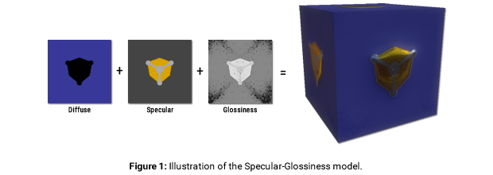
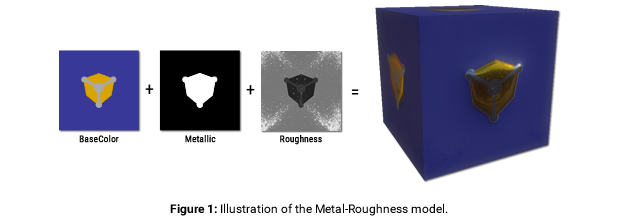

# WEB3D_materials_pbr

## Contributors

* Timo Sturm, Fraunhofer IGD, [@\_tsturm\_](https://twitter.com/\_tsturm\_)
* Miguel Sousa, Fraunhofer IGD, [@mfportela](https://twitter.com/mfportela)
* Maik Th&ouml;ner, Fraunhofer IGD, [@mthoener](https://twitter.com/mthoener)
* Max Limper, Fraunhofer IGD, [@mlimper_cg](https://twitter.com/mlimper_cg)

## Status

Draft

## Dependencies

Written against the glTF 1.0 spec.

## Overview

The glTF 1.0 allows the definition of materials by instancing `techniques`. A `technique`, as defined in glTF 1.0, is a verbose description of shader parameters combined with actual shader code. Typically, shader code is engine specific and, as such, may not be used across systems which do not share the same rendering pipeline.

This extension provides two new `techniques` consisting of a well defined set of parameters which are sufficient for representing a wide range of materials. These techniques are based on widely used material representations for Physically-Based Rendering (PBR) content creation pipelines.


## Material models

<p style="text-align:justify;">A material model defines a set of parameters used to describe a material. This extension supports two material models commonly used in PBR, namely the specular-glossiness and the metal-roughness models. An implementation of this extension should support both models.</p>

### Specular - Glossiness



The specular-glossiness material model is defined by the following properties:
* Diffuse:    Reflected diffuse color of the material
* Specular:   Specular color of the material
* Glossiness: Glossiniess of the material

<p style="text-align:justify;">The diffuse value represents the reflected diffuse color of the material. Raw metals have a diffuse value of (0, 0, 0). The specular value defines specular reflectance at normal incidence (F0). The Glossiness value is a factor between 0.0 (rough surface) and 1.0 (perfectly smooth surface) and represents the surface irregularities that cause light diffusion. Figure 1 shows the three components of the specular-glossiness model and the rendered result.</p>

The following table lists the allowed types and ranges for the specular-glossiness model:

| Property | Type | Range | Default Value | Description |
|:------------:|:----:|:-----:|:-:|:-----:|:-----------:|
| `diffuseFactor`   | `FLOAT_VEC4` | [0, 1] for all components | [1,1,1,1] | The RGB components of the reflected diffuse color of the material. For raw metals the diffuse color is black (0.0). The fourth component (A) is the `opacity` of the material. |
| `specularFactor`  | `FLOAT_VEC3` | [0, 1] for all components | [1,1,1]   | The specular RGB color of the material. |
| `glossinessFactor`| `FLOAT`      | [0, 1]                    | 1         | The glossiness of the material surface (0 is glossiness, 1 is full glossiness). |
| `diffuseTexture`  | string       | valid texture identifier  |           | Texture with RGB components of the reflected diffuse color of the material. For raw metals the diffuse color is black (0.0). If the fourth component (A) is present, it represents the `opacity` of the material. Otherwise, an `opacity` of 1 is assumed. |
| `specularGlossinessTexture` | string       | valid texture identifier  | | RGBA texture, containing the specular color of the material (RGB components) and its glossiness (A component).|

The factors (diffuseFactor, specularFactor, glossinessFactor) scale the components given in the respective textures (diffuseTexture, specularGlossinessTexture).
If a texture is not given, all respective texture components are assumed to have a value of 1.

For example, assume a value of `(1.0, 0.5, 0.5)` is read from an RGB `diffuseTexture`, and assume that `diffuseFactor` would be given as `(0.1, 1.0, 0.1, 1.0)`.
Then, the result would be `(1.0 * 0.1, 0.5 * 1.0, 0.5 * 0.1, 1.0 * 1.0) = (0.1, 0.5, 0.05, 1.0)`;


<strong>Usage Example:</strong>

```javascript
"materials": {    
    "rough_gold2": {
        "extensions": {
            "KHR_materials_pbr" : {
                "technique" : "PBR_specular_glossiness",
                "values": {
                    "diffuseFactor": [ 0.5, 0.5, 0.5, 1 ],
                    "specularFactor": [ 0.0, 0.0, 0.0 ],
                    "glossinessFactor": 0.8
                }
            }
        }
    }
}
```

### Metal - Roughness



The metal-roughness material model is defined by the following properties:
* Base Color: The base color of the material
* Metallic-ness: A value between 0 and 1, indicating if the material is metallic (1) or not (0)
* Roughness: Roughness of the material surface


The `base` color has two different interpretations depending on the value of `metallic`, which is defined as `0` for dielectrics and `1` for metals.
For `metallic = 1`, `base` is the specific measured reflectance value (F0).
For `metallic = 0`, `base` represents the reflected diffuse color of the material.

In this model it is not possible to specify a reflectance value for non-metals, where a reflectance value of 4% (0.04) is often used.
The `roughness` property is related with the `glossiness` parameter in the specular-glossiness model and is defined as `roughness = 1 - glossiness`. Figure 2 shows the three components of the metal-roughness model and the rendered result.

The following table lists the allowed types and ranges for the metal-roughness model:

| Property | Type | Range | Default Value | Description |
|:------------:|:----:|:-----:|:-:|:-----:|:-----------:|
| `baseColorFactor`           | `FLOAT_VEC4` | [0, 1] for all components | [1,1,1,1] | The RGBA components of the base color (RGB) of the material. The fourth component (A) is the `opacity` of the material. |
| `metallicFactor`            | `FLOAT`      | [0, 1]                    | 1         | The metallic-ness the material (1 for metals, 0 for non-metals). |
| `roughnessFactor`           | `FLOAT`      | [0, 1]                    | 1         |The roughness of the material surface. |
| `baseColorTexture`          | string       | valid texture identifier  |           |Texture with the RGBA components of the base color (RGB) of the material. If the fourth component (A) is present, it represents the `opacity` of the material. Otherwise, an `opacity` of 1 is assumed. |
| `metallicRoughnessTexture`  | string       | valid texture identifier  |           |Texture with two (or more) components, containing the metallic-ness of the material (first component) and its roughness (second component). |

The factors (baseColorFactor, metallicFactor, roughnessFactor) scale the components given in the respective textures (baseColorTexture, metallicRoughnessTexture).
If a texture is not given, all respective texture components are assumed to have a value of 1. This is similar to the handling of factors and texture within the specular-glossiness model.


<strong>Usage Example:</strong>

```javascript
"materials": {
    "rough_gold": {
        "extensions": {
            "KHR_materials_pbr" : {
                "technique" : "PBR_metal_roughness",
                "values": {
                    "baseColorFactor": [ 0.5, 0.5, 0.5, 1 ],
                    "metallicFactor": 0.0,
                    "roughnessFactor": 0.2
                }
            }
        }
    }
}
```


## glTF Schema


* [specular-glossiness](materials_pbr_specular_glossiness.schema.json)
* [metal-roughness](schema/materials_pbr_metal_roughness.schema.json)


## Appendix

An introduction to PBR concepts is provided in the [appendix](Appendix.md).


## Known Implementations

* TODO: List of known implementations, with links to each if available.

## Resources

TODO: check what should go here
