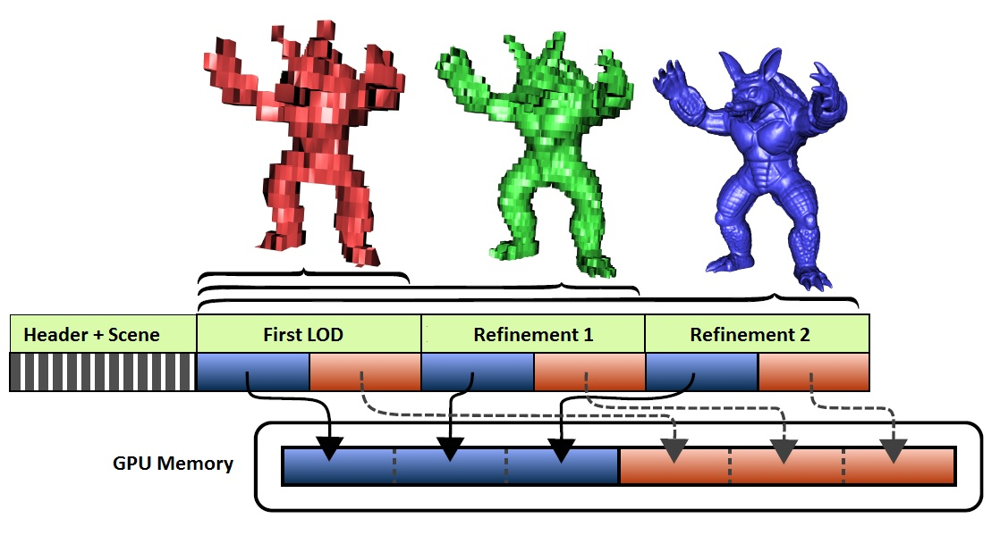

# WEB3D_streaming


## Contributors

* Max Limper, Fraunhofer IGD, [@mlimper_cg](https://twitter.com/mlimper_cg)
* Maik Thöner, Fraunhofer IGD, [@mthoener](https://twitter.com/mthoener)


## Dependencies

Written against the glTF draft 1.0 spec.

Required extensions:
* KHR_binary_glTF


## Overview

With today's browser technology, basically any buffer can be progressively downloaded, using XHR and streaming APIs.
Therefore, one can argue that Binary glTF can also be used for progressive streaming of mesh data.
However, in practice, this only works for non-indexed meshes.
A buffer of vertex positions, for example, can be progressively retrieved, and partial results can already be displayed.
If the corresponding buffers for vertex normals, for example, should also be progressively retrieved, a second download, performed in parallel, is necessary.
Moreover, to make use of a partial result, the intermediate results of both downloads need to match with each other.
This drawback of having to parallelize (and align) downloads for a progressive retrieval of mesh data also potentially has an impact on application performance, since it is not possible to send all data in a single file (as it can be done with binary_glTF, for example).

This extension introduces the concept of `bufferChunks`. By interleaving content for transmission, buffers can be retrieved progressively, using a limited amount of steps for progression.
By arranging the `bufferChunks` accordingly inside the body of the file, the writer of a Binary glTF file has explicit control over the order in which data is received.
Therefore, it is possible to progressively retrieve parts of indices and corresponding vertex attributes, as shown in Figure 1.

**Figure 1**: A binary glTF file, progressively streamed to the GPU by interleaving chunks for transmission.




## glTF Schema Updates

A `bufferChunk` is a simple reference to a section within the binary body of a binary glTF file.
It has the following two properties:

* `byteLength` - the length of the chunk inside the binary file body, in bytes
* `byteOffset` - the offset into the binary file body, in bytes

The following rules apply to valid buffer chunks:

* The full binary file body is divided into disjoint buffer chunks. This means that each byte within the binary body belongs to exactly one `bufferChunk`.
  
* The `bufferChunk` objects appear in a list entitled `bufferChunks`, which is a top-level object within the glTF scene description.

* The order of the `bufferChunk` objects within the list matches exactly the order in which chunks are stored within the binary file body.

* The `byteOffset` property is a (required) convenience property.
  Actually, since the `bufferChunk` objects are given in their order within the binary body, an implementation could compute this value for each `bufferChunk`, knowing that the first `bufferChunk` will start at an offset of zero, and taking into account the individual lenghts of the `bufferChunk` objects.
  However, providing this information explicitly as the `byteOffset` property eases implementation of this feature.

`bufferChunks` are introduced as a basic layer for addressing binary data, and the standard glTF layer of `bufferViews` must refer to those as an array of indices, entitled `chunks`, to address binary data within the binary file body.
Note that, this way, `bufferChunk` objects can only be used for the special buffer that represents the binary file body, entitled `"binary_glTF"`.


Example:

```
"extensionsUsed" : [
    "KHR_binary_glTF",
    "WEB3D_streaming"
]
// ...
"bufferChunks" : [
    {
        "byteOffset" : 0,
        "byteLength" : 1024
    },
    {
        "byteOffset" : 1024,
        "byteLength" : 1024
    },
    {
        "byteOffset" : 2048,
        "byteLength" : 2048,
    },
    {
        "byteOffset" : 4096,
        "byteLength" : 2048,
    }
]
// ...
"bufferViews" : {
    "indexDataView0" : {
        "buffer"     : "binary_glTF",
        "target"     : 34963,  //ELEMENT_ARRAY_BUFFER
        "byteOffset" : 0,      //will be ignored by reader
        "byteLength" : 3072,
        "extensions" : {
            "WEB3D_streaming" : {
                "chunks" : [0, 2]
            }
    }
    "attribDataView0" : {
        "buffer"     : "binary_glTF",
        "target"     : 34962, //ARRAY_BUFFER
        "byteOffset" : 1024,  //will be ignored by reader
        "byteLength" : 3072,
        "extensions" : {
            "WEB3D_streaming" : {
                "chunks" : [1, 3]
            }
    }
}
```

As can be seen from the example, a `bufferView` uses the new property `chunks` to specify a list of indices to `bufferChunk` objects.
If a `bufferView` refers to the special `buffer` that is the binary file body (`"binary_glTF"`), it has to use this list of `bufferChunk` objects.
Apart from that, as usual, a `bufferView` can still refer to other `buffer` objects than the binary file body.

When a list of indices `bufferChunk` objects is used to refer to the binary file body from a `bufferView`, the (required) parameter `byteOffset` can be ignored, since this information is already contained within the first referenced `bufferChunk`.
Still, for clarity, it is recommended that the value of `byteOffset` should always match this value.
If the optional property `byteLength` of `bufferView` is used, the value must match the sum of the `byteLength` properties of all referenced `bufferChunk` objects.
This value can be used to conveniently pre-allocate a buffer that is able to exactly accommodate all chunks of the `bufferView`, without having to explicity compute the size.

Be aware that, unlike for regular binary glTF content, the bytes referred to by a `bufferView` can in general _not_ be retrieved as a range (`byteOffset`, `byteOffset` + `byteLength`),
since the chunks referred to by the `bufferView` might be interleaved with other buffer chunks.


## JSON Schema


### WEB3D_streaming glTF extension

**Properties**

|   |Type|Description|Required|
|---|----|-----------|--------|
|**bufferChunks**|`array[]`|Chunks that are combined into the binary body of this binary glTF file.| :white_check_mark: Yes|

Additional properties are not allowed.

#### WEB3D_streaming glTF extension.bufferChunks :white_check_mark: 

Chunks that are combined into the binary body of this binary glTF file.

* **Type**: `array[]`
* **Required**: Yes


# WEB3D_streaming bufferChunk extension

**Properties**

|   |Type|Description|Required|
|---|----|-----------|--------|
|**byteOffset**|`integer`|The offset into the binary body in bytes.| :white_check_mark: Yes|
|**byteLength**|`integer`|The length of the chunk in bytes.| :white_check_mark: Yes|

Additional properties are not allowed.

## WEB3D_streaming bufferChunk extension.byteOffset :white_check_mark: 

The offset into the binary body in bytes.

* **Type**: `integer`
* **Required**: Yes
* **Minimum**:` >= 0`

## WEB3D_streaming bufferChunk extension.byteLength :white_check_mark: 

The length of the chunk in bytes.

* **Type**: `integer`
* **Required**: Yes
* **Minimum**:` >= 0`


# WEB3D_streaming bufferView extension

**Properties**

|   |Type|Description|Required|
|---|----|-----------|--------|
|**chunks**|`number[1-*]`|Array of chunk indices, defining the chunks of this bufferView.| :white_check_mark: Yes|

Additional properties are not allowed.

## WEB3D_streaming bufferView extension.chunks :white_check_mark: 

Array of chunk indices, defining the chunks of this bufferView.

* **Type**: `number[1-*]`
* **Required**: Yes


Also see the schema files:

* [glTF](schema/WEB3D_streaming.glTF.schema.json) update to the root `glTF` schema (`bufferChunks` property)
* [bufferChunk](schema/WEB3D_streaming.bufferChunk.schema.json) `bufferChunk` schema
* [bufferView](schema/WEB3D_streaming.bufferView.schema.json) update to the `bufferView` schema (`chunks` property)


## Known Implementations

The [SRC](http://x3dom.org/src/) implementation by Fraunhofer IGD has served as a basis for this proposal.


## Resources
* [SRC project](http://x3dom.org/src/) (paper, background, basic writer)
* SRC writer ([code](http://x3dom.org/src/files/src_writer_source.zip))
