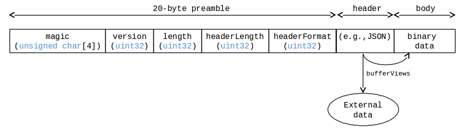
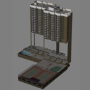

# binary_glTF

## Contributors

* Patrick Cozzi, [@pjcozzi](https://twitter.com/pjcozzi)
* Tom Fili, [@CesiumFili](https://twitter.com/CesiumFili)
* Kai Ninomiya, [@kainino0x](https://twitter.com/kainino0x)
* Max Limper, [@mlimper_cg](https://twitter.com/mlimper_cg)
* Maik Thöner, [@mthoener](https://twitter.com/mthoener)

## Status

Draft

## Dependencies

Written against the glTF 0.8 spec.

## Overview

glTF provides two delivery options that can be also be used together:

* glTF JSON points to external binary data (geometry, key frames, skins), images, and shaders.
* glTF JSON embeds base64-encoded binary data, images, and shaders inline using data URIs.

glTF is commonly criticized for requiring either separate requests or extra space due to base64-encoding.  Base64-encoding requires extra processing to decode and increases the file size (by ~33% for encoded resources).  While gzip mitigates the file size increase, decompression and decoding still add significant loading time.

To solve this, this extension introduces a container format, _Binary glTF_.  In Binary glTF, glTF resources (JSON, .bin, images, and shaders) can be stored in a binary blob accessed in JavaScript as an `ArrayBuffer`.  The `TextDecoder` JavaScript API can be used to extract the glTF JSON from the arraybuffer.  The JSON can be parses with `JSON.parse` as usual, and then the arraybuffer is treated as a glTF `buffer`. Informally, this is like embedding the JSON, images, and shaders in the .bin file.

## Binary glTF Layout

Binary glTF is little endian.  It has a binary 20-byte preamble followed by the structured header and the binary body, containing the glTF resources:

**Figure 1**: Binary glTF layout.



`magic` is the ASCII string `'glTF'`, and can be used to identify the arraybuffer as Binary glTF.

`version` is an `uint32` that indicates the version of the Binary glTF container format, which is `1` for this version of the extension.

`length` is the total length of the Binary glTF, including the header, in bytes.

`headerLength` is the length, in bytes, of the structured header.

`headerFormat` specifies the format of the structured header. Currently, the only allowed value is '0', which stands for JSON.

The structured header holds the structured glTF description, as it would usually be provided within a .gltf file.
By reading the header first, an implementation is able to progressively retrieve resources from the binary body.
This way, it is also possible to read only a selected subset of resources from a binary glTF file (for instance, the coarsest LOD).

The start of the binary body data is 4-byte aligned to ease its use with JavaScript Typed Arrays.

Given an `arrayBuffer` with Binary glTF, Listing 1 shows how to parse the header and access the JSON.

_TODO: the code below is out-of-sync with Cesium and the Frauhofer SRC implementations_

**Listing 1**: Parsing Binary glTF.  This uses a `TextDecoder` wrapper in Cesium, [`getStringFromTypedArray`](https://github.com/AnalyticalGraphicsInc/cesium/blob/1.11/Source/Core/getStringFromTypedArray.js).
```javascript
var sizeOfUint32 = Uint32Array.BYTES_PER_ELEMENT;

var magic = getStringFromTypedArray(arrayBuffer, 0, 4);
if (magic !== 'glTF') {
    // Not Binary glTF
}

var view = new DataView(arrayBuffer);
var byteOffset = sizeOfUint32;  // Skip magic number

var version = view.getUint32(byteOffset, true);
byteOffset += sizeOfUint32;
if (version !== 1) {
    // This only handles version 1.
}

byteOffset += sizeOfUint32;  // Skip length

var jsonOffset = view.getUint32(byteOffset, true);
byteOffset += sizeOfUint32;

var jsonLength = view.getUint32(byteOffset, true);
byteOffset += sizeOfUint32;

var jsonString = getStringFromTypedArray(arrayBuffer, jsonOffset, jsonLength);
var json = JSON.parse(jsonString)
```

Strings in the Binary glTF, i.e., JSON or shaders, are UTF-8.

Binary glTF still supports external resources.  For example, an application that wants to download textures on demand may embed everything except images in the Binary glTF.

Binary glTF also supported embedded base64-encoded resources, but it would be inefficient to use them.  An advantage of Binary glTF over glTF is that resources can be embedded without paying the size and client-side decoding costs of base64-encoding.

## glTF Schema Updates

This extension introduces an explicitly named `buffer` called `binary_glTF`.  This buffer is an implicit reference to the arraybuffer that is the Binary glTF.  It only has one property, `"type": "arraybuffer"`.  When a runtime encounters this, it should use the already loaded Binary glTF arrayBuffer as the buffer.  `bufferViews` that reference this `buffer` work as usual.

To support embedded shaders and images, `shader` and `image` glTF properties have new `binary_glTF` extension properties and no longer require the `uri` property.  See Listings 2 and 3.

**Listing 2**: A `shader` referencing a `bufferview` to access an embedded shader source.
```json
"a_shader" : {
    "extensions" : {
        "binary_glTF" : {
            "bufferview" : ...
        }
    }
}
```

**Listing 3**: An `image` referencing a `bufferview` and with metadata useful for loading the image from the arrayBuffer.  In JavaScript, `Blob` can be used as the source for an `Image` to extract an image from the arraybuffer.  See Cesium's [`loadImageFromTypedArray`](https://github.com/AnalyticalGraphicsInc/cesium/blob/bgltf/Source/Core/loadImageFromTypedArray.js) helper function.
```json
"an_image" : {
    "extensions" : {
        "binary_glTF" : {
            "bufferview" : ...,
            "mimeType" : "image/png",
            "height" : 256,
            "width" : 512
        }
    }
}
```

## Schema

TODO

## File Extension

`.bgltf`

## MIME Type

Use `model/vnd.gltf.binary`.

## Experimental Results

Based on extensive experimentation (below & [[1]](#BenchData)) using Cesium's glTF loader, different configurations are recommended for different scenarios.

* To minimize file size and number of files, use Binary glTF (gzipped), and external compressed image files (PNG, JPEG, etc.) to avoid significant decompression overhead.
* If a single file is desired, use Binary glTF (gzipped) with all files embedded.
* For files with very little non-texture data, the difference in loading time is minimal, but Binary glTF can reduce the number of requests without overhead.

The following observations are made from file size and benchmark data:

* JSON, mesh data, and animation data are highly compressible.
* Already-compressed textures (PNG, JPEG) are not very compressible.  Adding compression (e.g. by embedding them into a Binary glTF file which will be gzipped) adds significant CPU overhead with little size benefit.

Using the Cesium [aircraft model](https://github.com/AnalyticalGraphicsInc/cesium/tree/master/Apps/SampleData/models/CesiumAir), which contains 5,984 triangles with two texture atlases and a simple animation without skinning, statistics and results for the common glTF setups are:

| Cesium Air                            | # files |     size | size (gzip\*) |  load time |
| :------------------------------------ | ------: | -------: | ------------: | ---------: |
| COLLADA                               |     3   |  922 KiB |     591 KiB   |            |
| glTF                                  |     8   |  608 KiB |     538 KiB   |   0.32 s   |
| glTF, base64-encoded bin/jpg/png/glsl |   **1** |  808 KiB |     540 KiB   |   0.41 s   |
| Binary glTF, embedded textures        |   **1** |  609 KiB |   **513 KiB** | **0.29 s** |
| Binary glTF, separate textures        |     3   |  609 KiB |     538 KiB   | **0.30 s** |


Using the 1200 12th Ave model (thanks to [Cube Cities](http://cubecities.com/)), which contians 30,235 triangles with 21 textures and no animations, statistics and results for the common glTF setups are:

| 1200 12th Ave                         | # files |     size | size (gzip\*) |  load time | 
| :------------------------------------ | ------: | -------: | ------------: | ---------: | 
| COLLADA                               |    22   | 5.93 MiB |    1.36 MiB   |            |
| glTF                                  |    31   | 2.99 MiB |    1.25 MiB   | **0.85 s** |
| glTF, base64-encoded bin/jpg/png/glsl |   **1** | 3.64 MiB |    1.30 MiB   |   1.25 s   |
| Binary glTF, embedded textures        |   **1** | 2.99 MiB |  **1.23 MiB** |   1.03 s   |
| Binary glTF, separate textures        |    22   | 2.99 MiB |    1.25 MiB   | **0.84 s** |



\* All files gzipped except for stand-alone images.

These tests were performed with the CESIUM_binary_glTF implementation.
With SRC [[2]](#SRCPaper), there is another, slightly different implementation of Binary glTF, but the difference of benchmark results is insignificant.


## Known Implementations

### Runtime

* Cesium ([code](https://github.com/AnalyticalGraphicsInc/cesium/blob/master/Source/Scene/Model.js))

### Tools

* Cesium COLLADA-to-glTF Converter ([app](http://cesiumjs.org/convertmodel.html))
* colladaToBglTFConverter ([code](https://github.com/virtualcitySYSTEMS/colladaToBglTFConverter))
* SRC writer source code ([code](http://x3dom.org/src/files/src_writer_source.zip))

## Resources

* Discussion - [#357](https://github.com/KhronosGroup/glTF/issues/357)
* base64-encoded data in glTF - [#68](https://github.com/KhronosGroup/glTF/issues/68)
* [Faster 3D Models with Binary glTF](http://cesiumjs.org/2015/06/01/Binary-glTF/) article on the Cesium blog
* SRC project page (paper, background, basic writer) - [http://x3dom.org/src/](http://x3dom.org/src/)

<a name="BenchData">
* [1] Raw data for benchmarks using compression available in [BenchData](BenchData/README.md) supplemental.

<a name="SRCPaper">
* [2] SRC paper [http://x3dom.org/src/files/Web3d2014_SRC.pdf](http://x3dom.org/src/files/Web3d2014_SRC.pdf)
