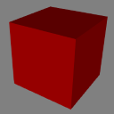

# Box Without Indices
## Screenshot

## License Information

Donated by [Cesium](http://cesiumjs.org/) for glTF testing.

## Additional Information

This version of the box model has all the indices in order 0-35. When you convert it to glTF, you need to remove the mesh.primitive.indices, so it just renders all vertices in order.
