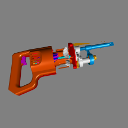
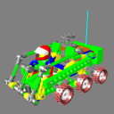
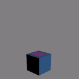
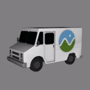
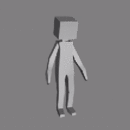
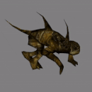
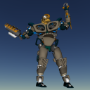

Sample models are provided in as many of the following formats as possible:
* glTF (.gltf) with separate resources: .bin (geometry, animation, skins), .glsl (shaders), and image files
* glTF (.gltf) with embedded resources
* Binary glTF (.glb) using the [KHR_binary_glTF](https://github.com/KhronosGroup/glTF/blob/master/extensions/Khronos/KHR_binary_glTF/README.md) extension
* glTF (.gltf) using the [KHR_materials_common](https://github.com/KhronosGroup/glTF/blob/master/extensions/Khronos/KHR_materials_common/README.md) extension
* Original COLLADA (.dae) or other source format

See the `README.txt` in each model's directory for usage restrictions.

Sample models help the glTF ecosystem, if you are able to contribute a model, see the [contributing section](#contributing-sample-models) below.

| Model                                         | Screenshot                                       | Description|
|-----------------------------------------------|--------------------------------------------------|------------|
| [Box](Box)                                    |                | One mesh and one material. Start with this. |
| [Box Without Indices](BoxWithoutIndices)      |  | Box without indices for testing the `drawArrays` path. |
| [Box Textured](BoxTextured)                   |        | Box with one texture. Start with this to test textures. |
| [Box Semantics](BoxSemantics)                 |       | Includes extra uniforms to test all uniform semantics. |
| [Duck](Duck)                                  |               | The COLLADA duck. One texture. |
| [2 Cylinder Engine](2CylinderEngine)          |    | Small CAD data set, including hierarchy. |
| [Reciprocating Saw](ReciprocatingSaw)         |   | Small CAD data set, including hierarchy. |
| [Gearbox Assy](GearboxAssy)                   |        | Medium-sized CAD data set, including hierarchy. |
| [Buggy](Buggy)                                |              | Medium-sized CAD data set, including hierarchy |
| [Box Animated](BoxAnimated)                    |        | Rotation and Translation Animations. Start with this to test animations. |
| [Cesium Milk Truck](CesiumMilkTruck)            |    | Textured. Multiple nodes/meshes. Animations. |
| [Rigged Simple](RiggedSimple)                  |       | Animations. Skins. Start with this to test skinning. |
| [Rigged Figure](RiggedFigure)                  |       | Animations. Skins. |
| [Cesium Man](CesiumMan)                        |          | Textured. Animations. Skins. |
| [Monster](Monster)                            |            | Textured. Animations. Skins. |
| [Brainsteam](Brainsteam)                      |         | Animations. Skins. |
| [Virtual City](VC)                            |                 | Textured. Animations. Skins. |

## Flightradar24 Models

For addition glTF models, see Flightradar24's [GitHub repo](https://github.com/kalmykov/fr24-3d-models) of aircrafts.

## Contributing Sample Models

We appreciate sample model contributions; they help ensure a consistent glTF ecosystem.

To contribute a model, open a pull request with:
* A new subdirectory containing
   * The model in as many glTF variations as possible (using the same directory structure as the others ([example](example))).  Tools for converting to glTF are [here](https://github.com/KhronosGroup/glTF#converters).
   * A README.txt with any usage restrictions.
* Add the new model to the above table.

If you have any questions, submit an [issue](https://github.com/KhronosGroup/glTF/issues).
