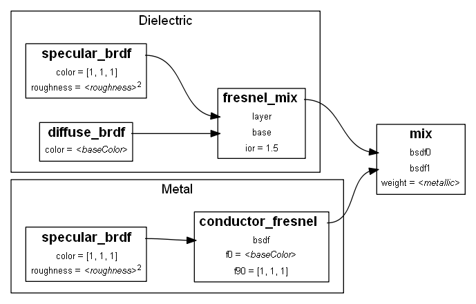

// Copyright (c) 2013-2020 Khronos Group.
//
// SPDX-License-Identifier: CC-BY-4.0

// :regtitle: is explained in
// https://discuss.asciidoctor.org/How-to-add-markup-to-author-information-in-document-title-td6488.html
= glTF 2.0 Specification (Last Updated June 9, 2017)
:tmtitle: pass:q,r[^™^]
:regtitle: pass:q,r[^®^]
The Khronos{regtitle} glTF{tmtitle} Working Group
:data-uri:
:icons: font
:toc2:
:toclevels: 10
:sectnumlevels: 10
:max-width: 100%
:numbered:
:source-highlighter: coderay
:title-logo-image: image:../figures/gltf.png[Logo,pdfwidth=4in,align=right]
:stem:

// This causes cross references to chapters, sections, and tables to be
// rendered as "Section A.B" (for example) rather than rendering the reference
// as the text of the section title.  It also enables cross references to
// [source] blocks as "Listing N", but only if the [source] block has a title.
:xrefstyle: short
:listing-caption: Listing

// Table of contents is inserted here
toc::[]

:leveloffset: 1

[[preamble]]
= Preamble

The GL Transmission Format (glTF) is an API-neutral runtime asset delivery format.  glTF bridges the gap between 3D content creation tools and modern 3D applications by providing an efficient, extensible, interoperable format for the transmission and loading of 3D content.

Editors

* Saurabh Bhatia, Microsoft
* Patrick Cozzi, Cesium
* Alexey Knyazev, Individual Contributor
* Tony Parisi, Unity

Khronos 3D Formats Working Group and Alumni

* Remi Arnaud, Starbreeze Studios
* Emiliano Gambaretto, Adobe
* Gary Hsu, Microsoft
* Max Limper, Fraunhofer IGD
* Scott Nagy, Microsoft
* Marco Hutter, Individual Contributor
* Uli Klumpp, Individual Contributor
* Ed Mackey, Individual Contributor
* Don McCurdy, Google
* Norbert Nopper, UX3D
* Fabrice Robinet, Individual Contributor (Previous Editor and Incubator)
* Neil Trevett, NVIDIA
* Jan Paul Van Waveren, Oculus
* Amanda Watson, Oculus

Copyright 2013-2020 The Khronos Group Inc. All Rights Reserved. glTF is a trademark of The Khronos Group Inc.

[[introduction]]
= Introduction

The GL Transmission Format (glTF) is an API-neutral runtime asset delivery format.  glTF bridges the gap between 3D content creation tools and modern graphics applications by providing an efficient, extensible, interoperable format for the transmission and loading of 3D content.

[[motivation]]
== Motivation

*This section is non-normative.*

Traditional 3D modeling formats have been designed to store data for offline use, primarily to support authoring workflows on desktop systems. Industry-standard 3D interchange formats allow for sharing assets between different modeling tools, and within the content pipeline in general. However, neither of these types of formats is optimized for download speed or fast loading at runtime. Files tend to grow very large, and applications need to do a significant amount of processing to load such assets into GPU-accelerated applications.

Applications seeking high performance rarely load modeling formats directly; instead, they process models offline as part of a custom content pipeline, converting the assets into a proprietary format optimized for their runtime application.  This has led to a fragmented market of incompatible proprietary runtime formats and duplicated efforts in the content creation pipeline. 3D assets exported for one application cannot be reused in another application without going back to the original modeling, tool-specific source and performing another proprietary export step.

With the advent of mobile- and web-based 3D computing, new classes of applications have emerged that require fast, dynamic loading of standardized 3D assets. Digital marketing solutions, e-commerce product visualizations, and online model-sharing sites are just a few of the connected 3D applications being built today using WebGL or OpenGL ES. Beyond the need for efficient delivery, many of these online applications can benefit from a standard, interoperable format to enable sharing and reuse of assets between users, between applications, and within heterogeneous, distributed content pipelines.

glTF solves these problems by providing a vendor- and runtime-neutral format that can be loaded and rendered with minimal processing. The format combines an easily parseable JSON scene description with one or more binary files representing geometry, animations, and other rich data. Binary data is stored in such a way that it can be loaded directly into GPU buffers without additional parsing or other manipulation. Using this approach, glTF is able to faithfully preserve full hierarchical scenes with nodes, meshes, cameras, materials, and animations, while enabling efficient delivery and fast loading.

[[gltf-basics]]
== glTF Basics

*This section is non-normative.*

glTF assets are JSON files plus supporting external data. Specifically, a glTF asset is represented by:

* A JSON-formatted file (`.gltf`) containing a full scene description: node hierarchy, materials, cameras, as well as descriptor information for meshes, animations, and other constructs
* Binary files (`.bin`) containing geometry and animation data, and other buffer-based data
* Image files (`.jpg`, `.png`) for textures

Assets defined in other formats, such as images, may be stored in external files referenced via URI, stored side-by-side in GLB container, or embedded directly into the JSON using https://developer.mozilla.org/en-US/docs/Web/HTTP/Basics_of_HTTP/Data_URIs[data URIs].

Valid glTF asset must specify its version.

image:figures/files.png[pdfwidth=4in,align=left]

[[design-goals]]
== Design Goals

*This section is non-normative.*

glTF has been designed to meet the following goals:

* *Compact file sizes.* While web developers like to work with clear text as much as possible, clear text encoding is simply not practical for transmitting 3D data due to sheer size. The glTF JSON file itself is clear text, but it is compact and rapid to parse. All large data such as geometry and animations are stored in binary files that are much smaller than equivalent text representations.
* *Fast loading.* glTF data structures have been designed to mirror the GPU API data as closely as possible, both in the JSON and binary files, to reduce load times. For example, binary data for meshes could be viewed as JavaScript Typed Arrays and be loaded directly into GPU buffers with a simple data copy; no parsing or further processing is required.
* *Runtime-independence.* glTF makes no assumptions about the target application or 3D engine. glTF specifies no runtime behaviors other than rendering and animation.
* *Complete 3D scene representation.* Exporting single objects from a modeling package is not sufficient for many applications. Often, authors want to load entire scenes, including nodes, transformations, transform hierarchy, meshes, materials, cameras, and animations into their applications. glTF strives to preserve all of this information for use in the downstream application.
* *Extensibility.* While the initial base specification supports a rich feature set, there will be many opportunities for growth and improvement. glTF defines a mechanism that allows the addition of both general-purpose and vendor-specific extensions.

The design of glTF takes a pragmatic approach. The format is meant to mirror the GPU APIs as closely as possible, but if it did only that, there would be no cameras, animations, or other features typically found in both modeling tools and runtime systems, and much semantic information would be lost in the translation. By supporting these common constructs, glTF content can not only load and render, but it can be immediately usable in a wider range of applications and require less duplication of effort in the content pipeline.

The following are outside the scope of the initial design of glTF:

* *glTF is not a streaming format.* The binary data in glTF is inherently streamable, and the buffer design allows for fetching data incrementally. But there are no other streaming constructs in the format, and no conformance requirements for an implementation to stream data versus downloading it in its entirety before rendering.
* *glTF is not intended to be human-readable,* though by virtue of being represented in JSON, it is developer-friendly.

While version 2.0 of glTF does not define compression for geometry and other rich data, the https://github.com/KhronosGroup/glTF/blob/master/extensions/2.0/Khronos/KHR_draco_mesh_compression/README.md[KHR_draco_mesh_compression extension] provides that option. Future extensions may include compression methods for textures and animation data.

[[versioning]]
== Versioning

Any updates made to glTF in a minor version will be backwards and forwards compatible. Backwards compatibility will ensure that any client implementation that supports loading a glTF 2.x asset will also be able to load a glTF 2.0 asset. Forwards compatibility will allow a client implementation that only supports glTF 2.0 to load glTF 2.x assets while gracefully ignoring any new features it does not understand.

A minor version update can introduce new features but will not change any previously existing behavior. Existing functionality can be deprecated in a minor version update, but it will not be removed.

Major version updates are not expected to be compatible with previous versions.

[[file-extensions-and-mime-types]]
== File Extensions and MIME Types

* `*.gltf` files use `model/gltf+json`
* `*.bin` files use `application/octet-stream` or `application/gltf-buffer`
  - When using MIME type `application/gltf-buffer`, the binary file extension may be `*.bin`, `*.glbin`, or `*.glbuf`.  See the https://www.iana.org/assignments/media-types/application/gltf-buffer[gltf-buffer registration].
* Texture files use the official `image/*` type based on the specific image format. For compatibility with modern web browsers, the following image formats are supported: `image/jpeg`, `image/png`.
+
[NOTE]
.Implementation Note
====
Implementations should use the image type pattern matching algorithm from the https://mimesniff.spec.whatwg.org/#matching-an-image-type-pattern[MIME Sniffing Standard] to detect PNG and JPEG images as file extensions may be unavailable in some contexts.
====

[[json-encoding]]
== JSON Encoding

To simplify client-side implementation, glTF has additional restrictions on JSON format and encoding.

1. JSON must use UTF-8 encoding without BOM.
+
[NOTE]
.Implementation Note
====
glTF exporters must not add a byte order mark to the beginning of JSON text. In the interests of interoperability, client implementations may ignore the presence of a byte order mark rather than treating it as an error. See https://tools.ietf.org/html/rfc8259#section-8[RFC8259, section 8] for more information.
====

2. All strings defined in this spec (properties names, enums) use only ASCII charset and must be written as plain text, e.g., `"buffer"` instead of `"\u0062\u0075\u0066\u0066\u0065\u0072"`.
+
[NOTE]
.Implementation Note
====
This allows generic glTF client implementations to not have full Unicode support. Application-specific strings (e.g., values of `"name"` properties or content of `extras` fields) may use any symbols.
====

3. Names (keys) within JSON objects must be unique, i.e., duplicate keys aren't allowed.

[[uris]]
== URIs

glTF uses URIs to reference buffers and image resources. Clients must support at least these two URI types:

- **Data URIs** that embed resources in the JSON. They use syntax defined by https://tools.ietf.org/html/rfc2397[RFC 2397].
+
[NOTE]
.Implementation Note
====
Data URIs could be https://developer.mozilla.org/en-US/docs/Web/API/WindowBase64/Base64_encoding_and_decoding[decoded with JavaScript] or consumed directly by web browsers in HTML tags.
====

- **Relative URI paths** -- or `path-noscheme` as defined by RFC 3986, https://tools.ietf.org/html/rfc3986#section-4.2[Section 4.2] -- without scheme, authority, or parameters. Reserved characters must be percent-encoded, per RFC 3986, https://tools.ietf.org/html/rfc3986#section-2.2[Section 2.2].
+
[NOTE]
.Implementation Note
====
Clients can optionally support additional URI components. For example `http://` or `file://` schemes, authorities/hostnames, absolute paths, and query or fragment parameters. Assets containing these additional URI components may be less portable.
====
+
[NOTE]
.Implementation Note
====
This allows the application to decide the best approach for delivery: if different assets share many of the same geometries, animations, or textures, separate files may be preferred to reduce the total amount of data requested. With separate files, applications can progressively load data and do not need to load data for parts of a model that are not visible. If an application cares more about single-file deployment, embedding data may be preferred even though it increases the overall size due to base64 encoding and does not support progressive or on-demand loading. Alternatively, an asset could use GLB container to store JSON and binary data in one file without base64 encoding. See <<glb-file-format-specification,GLB File Format Specification>> for details.
====

Applications should consider applying syntax-based normalization to URIs as defined by https://tools.ietf.org/html/rfc3986#section-6.2.2[RFC 3986, Section 6.2.2.], https://tools.ietf.org/html/rfc3987#section-5.3.2[RFC 3987, Section 5.3.2.], and applicable schema rules (e.g., https://tools.ietf.org/html/rfc7230#section-2.7.3[RFC 7230, Section 2.7.3.] for HTTP) on export and/or import.

[NOTE]
.Implementation Note
====
While the spec does not explicitly disallow non-normalized URIs, their use may be unsupported or lead to unwanted side-effects -- such as security warnings or cache misses -- on some platforms.
====

[[concepts]]
= Concepts

image:figures/dictionary-objects.png[pdfwidth=4in,align=left]

The top-level arrays in a glTF asset.  See the <<properties-reference, Properties Reference>>.

[[asset]]
== Asset

Each glTF asset must have an `asset` property. In fact, it's the only required top-level property for JSON to be a valid glTF. The `asset` object must contain glTF version which specifies the target glTF version of the asset. Additionally, an optional `minVersion` property can be used to specify the minimum glTF version support required to load the asset. The `minVersion` property allows asset creators to specify a minimum version that a client implementation must support in order to load the asset. This is very similar to the `extensionsRequired` concept, where an asset should only be loaded if the client supports the specified extension. Additional metadata can be stored in optional properties such as `generator` or `copyright`.  For example,

[source,json]
----
{
    "asset": {
        "version": "2.0",
        "generator": "collada2gltf@f356b99aef8868f74877c7ca545f2cd206b9d3b7",
        "copyright": "2017 (c) Khronos Group"
    }
}
----

[NOTE]
.Implementation Note
====
Client implementations should first check whether a `minVersion` property is specified and ensure both major and minor versions can be supported. If no `minVersion` is specified, then clients should check the `version` property and ensure the major version is supported. Clients that load <<glb-file-format-specification,GLB format>> should also check for the `minVersion` and `version` properties in the JSON chunk as the version specified in the GLB header only refers to the GLB container version.
====

[[indices-and-names]]
== Indices and Names

Entities of a glTF asset are referenced by their indices in corresponding arrays, e.g., a `bufferView` refers to a `buffer` by specifying the buffer's index in `buffers` array.  For example:

[source,json]
----
{
    "buffers": [
        {
            "byteLength": 1024,
            "uri": "path-to.bin"
        }
    ],
    "bufferViews": [
        {
            "buffer": 0,
            "byteLength": 512,
            "byteOffset": 0
        }
    ]
}
----

In this example, `buffers` and `bufferViews` have only one element each. The bufferView refers to the buffer using the buffer's index: `"buffer": 0`.

Whereas indices are used for internal glTF references, _names_ are used for application-specific uses such as display. Any top-level glTF object can have a `name` string property for this purpose. These property values are not guaranteed to be unique as they are intended to contain values created when the asset was authored.

For property names, glTF uses https://en.wikipedia.org/wiki/CamelCase[camel case] `likeThis`. Camel case is a common naming convention in JSON and WebGL.

[[coordinate-system-and-units]]
== Coordinate System and Units

glTF uses a right-handed coordinate system, that is, the cross product of +X and +Y yields +Z. glTF defines +Y as up. The front of a glTF asset faces +Z.

image:figures/coordinate-system.png[pdfwidth=4in,align=left]

The units for all linear distances are meters.

All angles are in radians.

Positive rotation is counterclockwise.

The <<transformations,node transformations>> and <<animations,animation channel paths>> are 3D vectors or quaternions with the following data types and semantics:

* translation: A 3D vector containing the translation along the x, y and z axes
* rotation: A quaternion (x, y, z, w), where w is the scalar
* scale: A 3D vector containing the scaling factors along the x, y and z axes

RGB color values use sRGB color primaries.

[NOTE]
.Implementation Note
====
Color primaries define the interpretation of each color channel of the color model, particularly with respect to the RGB color model. In the context of a typical display, color primaries describe the color of the red, green and blue phosphors or filters. The same primaries are also defined in Recommendation ITU-R BT.709. Since the overwhelming majority of currently used consumer displays are using the same primaries as default, client implementations usually do not need to convert color values. Future specification versions or extensions may allow other color primaries (such as P3) or even provide a way of embedding custom color profiles.
====

[[scenes]]
== Scenes

The glTF asset contains zero or more *scenes*, the set of visual objects to render. Scenes are defined in a `scenes` array. An additional property, `scene` (note singular), identifies which of the scenes in the array is to be displayed at load time.

All nodes listed in `scene.nodes` array must be root nodes (see the next section for details).

When `scene` is undefined, runtime is not required to render anything at load time.

[NOTE]
.Implementation Note
====
This allows applications to use glTF assets as libraries of individual entities such as materials or meshes.
====

The following example defines a glTF asset with a single scene, that contains a single node.

[source,json]
----
{
    "nodes": [
        {
            "name": "singleNode"
        }
    ],
    "scenes": [
        {
            "name": "singleScene",
            "nodes": [
                0
            ]
        }
    ],
    "scene": 0
}
----

[[nodes-and-hierarchy]]
=== Nodes and Hierarchy

The glTF asset can define *nodes*, that is, the objects comprising the scene to render.

Nodes have an optional `name` property.

Nodes also have transform properties, as described in the next section.

Nodes are organized in a parent-child hierarchy known informally as the *node hierarchy*. A node is called a *root node* when it doesn't have a parent.

The node hierarchy is defined using a node's `children` property, as in the following example:

[source,json]
----
{
    "nodes": [
        {
            "name": "Car",
            "children": [1, 2, 3, 4]
        },
        {
            "name": "wheel_1"
        },
        {
            "name": "wheel_2"
        },
        {
            "name": "wheel_3"
        },
        {
            "name": "wheel_4"
        }
    ]
}
----

The node named `Car` has four children. Each of those nodes could in turn have its own children, creating a hierarchy of nodes.

[NOTE]
====
For Version 2.0 conformance, the glTF node hierarchy is not a directed acyclic graph (DAG) or *scene graph*, but a disjoint union of strict trees. That is, no node may be a direct descendant of more than one node. This restriction is meant to simplify implementation and facilitate conformance.
====

[[transformations]]
=== Transformations

Any node can define a local space transformation either by supplying a `matrix` property, or any of `translation`, `rotation`, and `scale`  properties (also known as *TRS properties*). `translation` and `scale` are `FLOAT_VEC3` values in the local coordinate system. `rotation` is a `FLOAT_VEC4` unit quaternion value, `(x, y, z, w)`, in the local coordinate system.

When `matrix` is defined, it must be decomposable to TRS. This implies that transformation matrices cannot skew or shear.

TRS properties are converted to matrices and postmultiplied in the `T * R * S` order to compose the transformation matrix; first the scale is applied to the vertices, then the rotation, and then the translation.

When a node is targeted for animation (referenced by an `animation.channel.target`), only TRS properties may be present; `matrix` will not be present.

[NOTE]
.Implementation Note
====
If the determinant of the transform is a negative value, the winding order of the mesh triangle faces should be reversed. This supports negative scales for mirroring geometry.
====

[NOTE]
.Implementation Note
====
Non-invertible transformations (e.g., scaling one axis to zero) could lead to lighting and/or visibility artifacts.
====

In the example below, node named `Box` defines non-default rotation and translation.

[source,json]
----
{
    "nodes": [
        {
            "name": "Box",
            "rotation": [
                0,
                0,
                0,
                1
            ],
            "scale": [
                1,
                1,
                1
            ],
            "translation": [
                -17.7082,
                -11.4156,
                2.0922
            ]
        }
    ]
}
----

The next example defines the transformation for a node with attached camera using the `matrix` property rather than using the individual TRS values:

[source,json]
----
{
    "nodes": [
        {
            "name": "node-camera",
            "camera": 1,
            "matrix": [
                -0.99975,
                -0.00679829,
                0.0213218,
                0,
                0.00167596,
                0.927325,
                0.374254,
                0,
                -0.0223165,
                0.374196,
                -0.927081,
                0,
                -0.0115543,
                0.194711,
                -0.478297,
                1
            ]
        }
    ]
}
----

[[binary-data-storage]]
== Binary Data Storage

[[buffers-and-buffer-views]]
=== Buffers and Buffer Views

A *buffer* is data stored as a binary blob. The buffer can contain a combination of geometry, animation, and skins.

Binary blobs allow efficient creation of GPU buffers and textures since they require no additional parsing, except perhaps decompression. An asset can have any number of buffer files for flexibility for a wide array of applications.

[NOTE]
.Implementation Note
====
While there's no upper limit on buffer's size, implementations should be aware that JSON parsers may support integers only up to 2^53^ when running on certain platforms. Also there's an implicit limit of 2^32^-1 bytes when a buffer is stored as <<glb-file-format-specification,GLB>> binary chunk.
====

Buffer data is little endian.

All buffers are stored in the asset's `buffers` array.

The following example defines a buffer. The `byteLength` property specifies the size of the buffer file. The `uri` property is the URI to the buffer data. Buffer data may also be stored within the glTF file as base64-encoded data and reference via data URI.

[source,json]
----
{
   "buffers": [
       {
           "byteLength": 102040,
           "uri": "duck.bin"
       }
   ]
}
----

A *bufferView* represents a subset of data in a buffer, defined by a byte offset into the buffer specified in the `byteOffset` property and a total byte length specified by the `byteLength` property of the buffer view.

When a buffer view contain vertex indices or attributes, they must be its only content, i.e., it's invalid to have more than one kind of data in the same buffer view.

[NOTE]
.Implementation Note
====
This allows a runtime to upload buffer view data to the GPU without any additional processing. When `bufferView.target` is defined, runtime must use it to determine data usage, otherwise it could be inferred from mesh' accessor objects.
====

The following example defines two buffer views: the first is an ELEMENT_ARRAY_BUFFER, which holds the indices for an indexed triangle set, and the second is an ARRAY_BUFFER that holds the vertex data for the triangle set.

[source,json]
----
{
    "bufferViews": [
        {
            "buffer": 0,
            "byteLength": 25272,
            "byteOffset": 0,
            "target": 34963
        },
        {
            "buffer": 0,
            "byteLength": 76768,
            "byteOffset": 25272,
            "byteStride": 32,
            "target": 34962
        }
    ]
}
----

When a buffer view is used for vertex attribute data, it may have a `byteStride` property. This property defines the stride in bytes between each vertex.

Buffers and buffer views do not contain type information. They simply define the raw data for retrieval from the file. Objects within the glTF file (meshes, skins, animations) access buffers or buffer views via *accessors*.

[[glb-stored-buffer]]
==== GLB-stored Buffer

glTF asset could use GLB file container to pack all resources into one file. glTF Buffer referring to GLB-stored `BIN` chunk, must have `buffer.uri` property undefined, and it must be the first element of `buffers` array; byte length of `BIN` chunk could be up to 3 bytes bigger than JSON-defined `buffer.byteLength` to satisfy GLB padding requirements. Any glTF Buffer with undefined `buffer.uri` property that is not the first element of `buffers` array does not refer to the GLB-stored BIN chunk, and the behavior of such buffers is left undefined to accommodate future extensions and specification versions.

[NOTE]
.Implementation Note
====
Not requiring strict equality of chunk's and buffer's lengths simplifies glTF to GLB conversion a bit: implementations don't need to update `buffer.byteLength` after applying GLB padding.
====

In the following example, the first buffer objects refers to GLB-stored data, while the second points to external resource:

[source,json]
----
{
    "buffers": [
        {
            "byteLength": 35884
        },
        {
            "byteLength": 504,
            "uri": "external.bin"
        }
  ]
}
----

See <<glb-file-format-specification,GLB File Format Specification>> for details on GLB File Format.

[[accessors]]
=== Accessors

All large data for meshes, skins, and animations is stored in buffers and retrieved via accessors.

An *accessor* defines a method for retrieving data as typed arrays from within a `bufferView`. The accessor specifies a component type (e.g. `5126 (FLOAT)`) and a data type (e.g. `VEC3`), which when combined define the complete data type for each array element. The accessor also specifies the location and size of the data within the `bufferView` using the properties `byteOffset` and `count`. The latter specifies the number of elements within the `bufferView`, *not* the number of bytes. Elements could be, e.g., vertex indices, vertex attributes, animation keyframes, etc.

All accessors are stored in the asset's `accessors` array.

The following fragment shows two accessors, the first is a scalar accessor for retrieving a primitive's indices, and the second is a 3-float-component vector accessor for retrieving the primitive's position data.

[source,json]
----
{
    "accessors": [
        {
            "bufferView": 0,
            "byteOffset": 0,
            "componentType": 5123,
            "count": 12636,
            "max": [
                4212
            ],
            "min": [
                0
            ],
            "type": "SCALAR"
        },
        {
            "bufferView": 1,
            "byteOffset": 0,
            "componentType": 5126,
            "count": 2399,
            "max": [
                0.961799,
                1.6397,
                0.539252
            ],
            "min": [
                -0.692985,
                0.0992937,
                -0.613282
            ],
            "type": "VEC3"
        }
    ]
}
----

[[floating-point-data]]
==== Floating-Point Data

Data of `5126 (FLOAT)` componentType must use IEEE-754 single precision format.

Values of `NaN`, `+Infinity`, and `-Infinity` are not allowed.

[[accessor-element-size]]
==== Accessor Element Size

The following tables can be used to compute the size of element accessible by accessor.

[options="header"]
|====
| `componentType`         | Size in bytes
| `5120` (BYTE)           | 1
| `5121`(UNSIGNED_BYTE)   | 1
| `5122` (SHORT)          | 2
| `5123` (UNSIGNED_SHORT) | 2
| `5125` (UNSIGNED_INT)   | 4
| `5126` (FLOAT)          | 4
|====

[options="header"]
|====
| `type`     | Number of components
| `"SCALAR"` | 1
| `"VEC2"`   | 2
| `"VEC3"`   | 3
| `"VEC4"`   | 4
| `"MAT2"`   | 4
| `"MAT3"`   | 9
| `"MAT4"`   | 16
|====

Element size, in bytes, is
`(size in bytes of the 'componentType') * (number of components defined by 'type')`.

For example:

[source,json]
----
{
    "accessors": [
        {
            "bufferView": 1,
            "byteOffset": 7032,
            "componentType": 5126,
            "count": 586,
            "type": "VEC3"
        }
    ]
}
----

In this accessor, the `componentType` is `5126` (FLOAT), so each component is four bytes.  The `type` is `"VEC3"`, so there are three components.  The size of each element is 12 bytes (`4 * 3`).

[[accessors-bounds]]
==== Accessors Bounds

`accessor.min` and `accessor.max` properties are arrays that contain per-component minimum and maximum values, respectively. Exporters and loaders must treat these values as having the same data type as accessor's `componentType`, i.e., use integers (JSON number without fractional part) for integer types and use floating-point decimals for `5126` (FLOAT).

[NOTE]
.Implementation Note
====
JavaScript client implementations should convert JSON-parsed floating-point doubles to single precision, when `componentType` is `5126` (FLOAT). This could be done with `Math.fround` function.
====

While these properties are not required for all accessor usages, there are cases when minimum and maximum must be defined. Refer to other sections of this specification for details.

[[sparse-accessors]]
==== Sparse Accessors

Sparse encoding of arrays is often more memory-efficient than dense encoding when describing incremental changes with respect to a reference array.
This is often the case when encoding morph targets (it is, in general, more efficient to describe a few displaced vertices in a morph target than transmitting all morph target vertices).

glTF 2.0 extends the accessor structure to enable efficient transfer of sparse arrays.
Similarly to a standard accessor, a sparse accessor initializes an array of typed elements from data stored in a `bufferView` . On top of that, a sparse accessor includes a `sparse` dictionary describing the elements that deviate from their initialization value. The `sparse` dictionary contains the following mandatory properties:

- `count`: number of displaced elements.
- `indices`: strictly increasing array of integers of size `count` and specific `componentType` that stores the indices of those elements that deviate from the initialization value.
- `values`: array of displaced elements corresponding to the indices in the `indices` array.

The following fragment shows an example of `sparse` accessor with 10 elements deviating from the initialization array.

[source,json]
----
{
    "accessors": [
        {
            "bufferView": 0,
            "byteOffset": 0,
            "componentType": 5123,
            "count": 12636,
            "type": "VEC3",
            "sparse": {
                "count": 10,
                "indices": {
                    "bufferView": 1,
                    "byteOffset": 0,
                    "componentType": 5123
                },
                "values": {
                    "bufferView": 2,
                    "byteOffset": 0
                }
            }
        }
    ]
}
----

A sparse accessor differs from a regular one in that `bufferView` property isn't required. When it's omitted, the sparse accessor is initialized as an array of zeros of size `(size of the accessor element) * (accessor.count)` bytes.
A sparse accessor `min` and `max` properties correspond, respectively, to the minimum and maximum component values once the sparse substitution is applied.

When neither `sparse` nor `bufferView` is defined, `min` and `max` properties could have any values. This is intended for use cases when binary data is supplied by external means (e.g., via extensions).

[[data-alignment]]
==== Data Alignment

The offset of an `accessor` into a `bufferView` (i.e., `accessor.byteOffset`) and the offset of an `accessor` into a `buffer` (i.e., `accessor.byteOffset + bufferView.byteOffset`) must be a multiple of the size of the accessor's component type.

When `byteStride` of referenced `bufferView` is not defined, it means that accessor elements are tightly packed, i.e., effective stride equals the size of the element. When `byteStride` is defined, it must be a multiple of the size of the accessor's component type. `byteStride` must be defined, when two or more accessors use the same `bufferView`.

Each `accessor` must fit its `bufferView`, i.e., `accessor.byteOffset + STRIDE * (accessor.count - 1) + SIZE_OF_ELEMENT` must be less than or equal to `bufferView.length`.

For performance and compatibility reasons, each element of a vertex attribute must be aligned to 4-byte boundaries inside `bufferView` (i.e., `accessor.byteOffset` and `bufferView.byteStride` must be multiples of 4).

Accessors of matrix type have data stored in column-major order; start of each column must be aligned to 4-byte boundaries. To achieve this, three `type`/`componentType` combinations require special layout:

*MAT2, 1-byte components*

----
| 00| 01| 02| 03| 04| 05| 06| 07|
|===|===|===|===|===|===|===|===|
|m00|m10|---|---|m01|m11|---|---|
----

*MAT3, 1-byte components*

----
| 00| 01| 02| 03| 04| 05| 06| 07| 08| 09| 0A| 0B|
|===|===|===|===|===|===|===|===|===|===|===|===|
|m00|m10|m20|---|m01|m11|m21|---|m02|m12|m22|---|
----

*MAT3, 2-byte components*

----
| 00| 01| 02| 03| 04| 05| 06| 07| 08| 09| 0A| 0B| 0C| 0D| 0E| 0F| 10| 11| 12| 13| 14| 15| 16| 17|
|===|===|===|===|===|===|===|===|===|===|===|===|===|===|===|===|===|===|===|===|===|===|===|===|
|m00|m00|m10|m10|m20|m20|---|---|m01|m01|m11|m11|m21|m21|---|---|m02|m02|m12|m12|m22|m22|---|---|
----

Alignment requirements apply only to start of each column, so trailing bytes could be omitted if there's no further data.

[NOTE]
.Implementation Note
====
For JavaScript, this allows a runtime to efficiently create a single ArrayBuffer from a glTF `buffer` or an ArrayBuffer per `bufferView`, and then use an `accessor` to turn a typed array view (e.g., `Float32Array`) into an ArrayBuffer without copying it because the byte offset of the typed array view is a multiple of the size of the type (e.g., `4` for `Float32Array`).
====

Consider the following example:

[source,json]
----
{
    "bufferViews": [
        {
            "buffer": 0,
            "byteLength": 17136,
            "byteOffset": 620,
            "target": 34963
        }
    ],
    "accessors": [
        {
            "bufferView": 0,
            "byteOffset": 4608,
            "componentType": 5123,
            "count": 5232,
            "type": "VEC2"
        }
    ]
}
----

Accessing binary data defined by example above could be done like this:

[source,js]
----
const accessorTypeToNumComponentsMap = {
                'SCALAR': 1,
                'VEC2': 2,
                'VEC3': 3,
                'VEC4': 4,
                'MAT2': 4,
                'MAT3': 9,
                'MAT4': 16
};
var typedView = new Uint16Array(buffer, accessor.byteOffset + accessor.bufferView.byteOffset, accessor.count * accessorTypeToNumComponentsMap[accessor.type]);
----

The size of the accessor component type is two bytes (the `componentType` is unsigned short). The accessor's `byteOffset` is also divisible by two. Likewise, the accessor's offset into buffer `0` is `5228 ` (`620 + 4608`), which is divisible by two.

[[geometry]]
== Geometry

Any node can contain one mesh, defined in its `mesh` property. Mesh can be skinned using a information provided in referenced `skin` object. Mesh can have morph targets.

[[meshes]]
=== Meshes

In glTF, meshes are defined as arrays of *primitives*. Primitives correspond to the data required for GPU draw calls. Primitives specify one or more `attributes`, corresponding to the vertex attributes used in the draw calls. Indexed primitives also define an `indices` property. Attributes and indices are defined as references to accessors containing corresponding data. Each primitive also specifies a material and a primitive type that corresponds to the GPU primitive type (e.g., triangle set).

[NOTE]
.Implementation Note
====
Splitting one mesh into *primitives* could be useful to limit number of indices per draw call.
====

If `material` is not specified, then a <<default-material,default material>> is used.

The following example defines a mesh containing one triangle set primitive:

[source,json]
----
{
    "meshes": [
        {
            "primitives": [
                {
                    "attributes": {
                        "NORMAL": 23,
                        "POSITION": 22,
                        "TANGENT": 24,
                        "TEXCOORD_0": 25
                    },
                    "indices": 21,
                    "material": 3,
                    "mode": 4
                }
            ]
        }
    ]
}
----

Each attribute is defined as a property of the `attributes` object. The name of the property corresponds to an enumerated value identifying the vertex attribute, such as `POSITION`. The value of the property is the index of an accessor that contains the data.

Valid attribute semantic property names include `POSITION`, `NORMAL`, `TANGENT`, `TEXCOORD_0`, `TEXCOORD_1`, `COLOR_0`, `JOINTS_0`, and `WEIGHTS_0`.  Application-specific semantics must start with an underscore, e.g., `_TEMPERATURE`.

Valid accessor type and component type for each attribute semantic property are defined below.

[options="header",cols="15%,20%,35%,30%"]
|====
| Name        | Accessor Type(s)| Component Type(s)| Description
| `POSITION`  | `"VEC3"`        | `5126` (FLOAT)                     | XYZ vertex positions
| `NORMAL`    | `"VEC3"`        | `5126` (FLOAT)                     | Normalized XYZ vertex normals
| `TANGENT`   | `"VEC4"`        | `5126` (FLOAT)                     | XYZW vertex tangents where the *w* component is a sign value (-1 or +1) indicating handedness of the tangent basis
| `TEXCOORD_0`| `"VEC2"`        | `5126` (FLOAT) +
                                  `5121` (UNSIGNED_BYTE) normalized +
                                  `5123` (UNSIGNED_SHORT) normalized | UV texture coordinates for the first set
| `TEXCOORD_1`| `"VEC2"`        | `5126` (FLOAT) +
                                  `5121` (UNSIGNED_BYTE) normalized +
                                  `5123` (UNSIGNED_SHORT) normalized | UV texture coordinates for the second set
| `COLOR_0`   | `"VEC3"` +
                `"VEC4"`        | `5126` (FLOAT) +
                                  `5121` (UNSIGNED_BYTE) normalized +
                                  `5123` (UNSIGNED_SHORT) normalized | RGB or RGBA vertex color
| `JOINTS_0`  | `"VEC4"`        | `5121` (UNSIGNED_BYTE)
                                  `5123` (UNSIGNED_SHORT)            | See <<skinned-mesh-attributes,Skinned Mesh Attributes>>
| `WEIGHTS_0` | `"VEC4"`        | `5126` (FLOAT) +
                                  `5121` (UNSIGNED_BYTE) normalized +
                                  `5123` (UNSIGNED_SHORT) normalized | See <<skinned-mesh-attributes,Skinned Mesh Attributes>>
|====

`POSITION` accessor *must* have `min` and `max` properties defined.

`TEXCOORD`, `COLOR`, `JOINTS`, and `WEIGHTS` attribute semantic property names must be of the form `[semantic]_[set_index]`, e.g., `TEXCOORD_0`, `TEXCOORD_1`, `COLOR_0`. Client implementations must support at least two UV texture coordinate sets, one vertex color, and one joints/weights set. Extensions can add additional property names, accessor types, and/or accessor component types.

All indices for indexed attribute semantics must start with 0 and be continuous positive integers: `TEXCOORD_0`, `TEXCOORD_1`, etc. Indices must not use leading zeroes to pad the number of digits, and clients are not required to support more indexed semantics than described above.

All attribute accessors for a given primitive must have the same `count`. When `indices` property is not defined, it indicates the number of vertices to render; when `indices` property is defined, it indicates the upper (exclusive) bound on the index values in the `indices` accessor.

[NOTE]
.Implementation Note
====
Each primitive corresponds to one WebGL draw call (engines are, of course, free to batch draw calls). When a primitive's `indices` property is defined, it references the accessor to use for index data, and GL's `drawElements` function should be used. When the `indices` property is not defined, GL's `drawArrays` function should be used with a count equal to the count property of any of the accessors referenced by the `attributes` property (they are all equal for a given primitive).
====

[NOTE]
.Implementation Note
====
When positions are not specified, client implementations should skip primitive's rendering unless its positions are provided by other means (e.g., by extension). This applies to both indexed and non-indexed geometry.
====

[NOTE]
.Implementation Note
====
When normals are not specified, client implementations should calculate flat normals.
====

[NOTE]
.Implementation Note
====
When tangents are not specified, client implementations should calculate tangents using default MikkTSpace algorithms.  For best results, the mesh triangles should also be processed using default MikkTSpace algorithms.
====

[NOTE]
.Implementation Note
====
Vertices of the same triangle should have the same `tangent.w` value. When vertices of the same triangle have different `tangent.w` values, tangent space is considered undefined.
====

[NOTE]
.Implementation Note
====
When normals and tangents are specified, client implementations should compute the bitangent by taking the cross product of the normal and tangent xyz vectors and multiplying against the w component of the tangent: `bitangent = cross(normal, tangent.xyz) * tangent.w`
====

[[morph-targets]]
==== Morph Targets

Morph Targets are defined by extending the Mesh concept.

A Morph Target is a morphable Mesh where primitives' attributes are obtained by adding the original attributes to a weighted sum of targets attributes.

For instance, the Morph Target vertices `POSITION` for the primitive at index *i* are computed in this way:

[source,c]
----
primitives[i].attributes.POSITION +
  weights[0] * primitives[i].targets[0].POSITION +
  weights[1] * primitives[i].targets[1].POSITION +
  weights[2] * primitives[i].targets[2].POSITION + ...
----

Morph Targets are implemented via the `targets` property defined in the Mesh `primitives`. Each target in the `targets` array is a dictionary mapping a primitive attribute to an accessor containing Morph Target displacement data. Currently only three attributes -- `POSITION`, `NORMAL`, and `TANGENT` -- are commonly supported. If morph targets contain application-specific semantics, their names must be prefixed with an underscore (e.g. `_TEMPERATURE`) like the associated attribute semantic. All primitives are required to list the same number of `targets` in the same order.

Valid accessor type and component type for each attribute semantic property are defined below. Note that the *w* component for handedness is omitted when targeting `TANGENT` data since handedness cannot be displaced.

[options="header"]
|====
| Name       | Accessor Type(s) | Component Type(s) | Description
| `POSITION` | `"VEC3"`         | `5126` (FLOAT)    | XYZ vertex position displacements
| `NORMAL`   | `"VEC3"`         | `5126` (FLOAT)    | XYZ vertex normal displacements
| `TANGENT`  | `"VEC3"`         | `5126` (FLOAT)    | XYZ vertex tangent displacements
|====

`POSITION` accessor *must* have `min` and `max` properties defined.

All Morph Target's accessors *must* have the same `count` as the accessors of the original primitive.

A Morph Target may also define an optional `mesh.weights` property that stores the default targets weights. In the absence of a `node.weights` property, the primitives attributes are resolved using these weights. When this property is missing, the default targets weights are assumed to be zero.

The following example extends the Mesh defined in the previous example to a morphable one by adding two Morph Targets:

[source,json]
----
{
    "primitives": [
        {
            "attributes": {
                "NORMAL": 23,
                "POSITION": 22,
                "TANGENT": 24,
                "TEXCOORD_0": 25
            },
            "indices": 21,
            "material": 3,
            "targets": [
                {
                    "NORMAL": 33,
                    "POSITION": 32,
                    "TANGENT": 34
                },
                {
                    "NORMAL": 43,
                    "POSITION": 42,
                    "TANGENT": 44
                }
            ]
        }
    ],
    "weights": [0, 0.5]
}
----

After applying morph targets to vertex positions and normals, tangent space may need to be recalculated. See <<appendix-a-tangent-space-recalculation,Appendix A>> for details.

[NOTE]
.Implementation Note
====
The number of morph targets is not limited in glTF. A conformant client implementation must support at least eight morphed attributes. This means that it has to support at least eight morph targets that contain a `POSITION` attribute, or four morph targets that contain a `POSITION` and a `NORMAL` attribute, or two morph targets that contain `POSITION`, `NORMAL` and `TANGENT` attributes. For assets that contain a higher number of morphed attributes, renderers may choose to either fully support them (for example, by performing the morph computations in software), or to only use the eight attributes of the morph targets with the highest weights.
====

[NOTE]
.Implementation Note
====
A significant number of authoring and client implementations associate names with morph targets. While the glTF 2.0 specification currently does not provide a way to specify names, most tools use an array of strings, `mesh.extras.targetNames`, for this purpose. The `targetNames` array and all primitive `targets` arrays must have the same length.
====

[[skins]]
=== Skins

All skins are stored in the `skins` array of the asset. Each skin is defined by the `inverseBindMatrices` property (which points to an accessor with IBM data), used to bring coordinates being skinned into the same space as each joint; and a `joints` array property that lists the nodes indices used as joints to animate the skin. The order of joints is defined in the `skin.joints` array and it must match the order of `inverseBindMatrices` data. The `skeleton` property (if present) points to the node that is the common root of a joints hierarchy or to a direct or indirect parent node of the common root.

[NOTE]
.Implementation Note
====
The matrix defining how to pose the skin's geometry for use with the joints ("Bind Shape Matrix") should be premultiplied to mesh data or to Inverse Bind Matrices.
====

[NOTE]
.Implementation Note
====
Client implementations should apply only the transform of the skeleton root node to the skinned mesh while ignoring the transform of the skinned mesh node. In the example below, the translation of `node_0` and the scale of `node_1` are applied while the translation of `node_3` and rotation of `node_4` are ignored.
====

[source,json]
----
{
    "nodes": [
        {
            "name": "node_0",
            "children": [ 1 ],
            "translation": [ 0.0, 1.0, 0.0 ]
        },
        {
            "name": "node_1",
            "children": [ 2 ],
            "scale": [ 0.5, 0.5, 0.5 ]
        },
        {
            "name": "node_2"
        },
        {
            "name": "node_3",
            "children": [ 4 ],
            "translation": [ 1.0, 0.0, 0.0 ]
        },
        {
            "name": "node_4",
            "mesh": 0,
            "rotation": [ 0.0, 1.0, 0.0, 0.0 ],
            "skin": 0
        }
    ],
    "skins": [
        {
            "name": "skin_0",
            "inverseBindMatrices": 0,
            "joints": [ 1, 2 ],
            "skeleton": 1
        }
    ]
}
----

[[skinned-mesh-attributes]]
==== Skinned Mesh Attributes

The mesh for a skin is defined with vertex attributes that are used in skinning calculations in the vertex shader. The `JOINTS_0` attribute data contains the indices of the joints from corresponding `joints` array that should affect the vertex. The `WEIGHTS_0` attribute data defines the weights indicating how strongly the joint should influence the vertex. The following mesh skin defines `JOINTS_0` and `WEIGHTS_0` vertex attributes for a triangle mesh primitive:

[source,json]
----
{
    "meshes": [
        {
            "name": "skinned-mesh_1",
            "primitives": [
                {
                    "attributes": {
                        "JOINTS_0": 179,
                        "NORMAL": 165,
                        "POSITION": 163,
                        "TEXCOORD_0": 167,
                        "WEIGHTS_0": 176
                    },
                    "indices": 161,
                    "material": 1,
                    "mode": 4
                }
            ]
        }
    ]
}
----

The number of joints that influence one vertex is limited to 4 per set, so referenced accessors must have `VEC4` type and following component types:

* *`JOINTS_0`*: `UNSIGNED_BYTE` or `UNSIGNED_SHORT`
* *`WEIGHTS_0`*: `FLOAT`, or normalized `UNSIGNED_BYTE`, or normalized `UNSIGNED_SHORT`

The joint weights for each vertex must be non-negative. No joint may have more than one non-zero weight for a given vertex.

When the weights are stored using `FLOAT` component type, glTF exporters should produce weights with linear sum as close as reasonably possible to `1.0` for a given vertex. When the weights are stored using `UNSIGNED_BYTE` or `UNSIGNED_SHORT` component types, their linear sum before normalization must be `255` or `65535` respectively. Without these requirements, vertices would be deformed significantly because the weight error would get multiplied by the joint position. For example, an error of `1/255` in the weight sum would result in an unacceptably large difference in the joint position.

[NOTE]
.Implementation Note
====
The threshold in the official validation tool is set to `2e-7` times the number of non-zero weights per vertex.
====

[NOTE]
.Implementation Note
====
Since the allowed threshold is much lower than minimum possible step for quantized component types, exporters should just renormalize weight sum after quantization.
====

In the event that of any of the vertices are influenced by more than four joints, the additional joint and weight information will be found in subsequent sets. For example `JOINTS_1` and `WEIGHTS_1` if present will reference the accessor for up to 4 additional joints that influence the vertices. Note that client implementations are only required to support a single set of up to four weights and joints, however not supporting all weight and joint sets present in the file may have an impact on the model's animation.

All joint values must be within the range of joints in the skin. Unused joint values (i.e. joints with a weight of zero) should be set to zero.

[[joint-hierarchy]]
==== Joint Hierarchy

The joint hierarchy used for controlling skinned mesh pose is simply the glTF node hierarchy, with each node designated as a joint. Each skin's joints must have a common root, which may or may not be a joint node itself. When a skin is referenced by a node within a scene, the common root must belong to the same scene.

For more details of vertex skinning implementation, refer to https://github.com/KhronosGroup/glTF/blob/master/specification/2.0/figures/gltfOverview-2.0.0b.png[glTF Overview].

[NOTE]
.Implementation Note
====
A node definition does not specify whether the node should be treated as a joint. Client implementations may wish to traverse the `skins` array first, marking each joint node.
====

[NOTE]
.Implementation Note
====
A joint may have regular nodes attached to it, even a complete node sub graph with meshes. It's often used to have an entire geometry attached to a joint without having it being skinned by the joint. (ie. a sword attached to a hand joint). Note that the node transform is the local transform of the node relative to the joint, like any other node in the glTF node hierarchy as described in the <<transformations,Transformation>> section.
====

[[instantiation]]
=== Instantiation

A mesh is instantiated by `node.mesh` property. The same mesh could be used by many nodes, which could have different transformations. For example:

[source,json]
----
{
    "nodes": [
        {
            "mesh": 11
        },
        {
            "mesh": 11,
            "translation": [
                -20,
                -1,
                0
            ]
        }
    ]
}

----

A Morph Target is instanced within a node using:

- The Morph Target referenced in the `mesh` property.
- The Morph Target `weights` overriding the `weights` of the Morph Target referenced in the `mesh` property.

The example below instatiates a Morph Target with non-default weights.

[source,json]
----
{
    "nodes": [
        {
            "mesh": 11,
            "weights": [0, 0.5]
        }
    ]
}
----

A skin is instanced within a node using a combination of the node's `mesh` and `skin` properties. The mesh for a skin instance is defined in the `mesh` property. The `skin` property contains the index of the skin to instance.

[source,json]
----
{
    "skins": [
        {
            "inverseBindMatrices": 29,
            "joints": [1, 2]
        }
    ],
    "nodes": [
        {
            "name":"Skinned mesh node",
            "mesh": 0,
            "skin": 0
        },
        {
            "name":"Skeleton root joint",
            "children": [2],
            "rotation": [
                0,
                0,
                0.7071067811865475,
                0.7071067811865476
            ],
            "translation": [
                4.61599,
                -2.032e-06,
                -5.08e-08
            ]
        },
        {
            "name":"Head",
            "translation": [
                8.76635,
                0,
                0
            ]
        }
    ]
}
----

[[texture-data]]
== Texture Data

glTF separates texture access into three distinct types of objects: Textures, Images, and Samplers.

[[textures]]
=== Textures

All textures are stored in the asset's `textures` array. A texture is defined by an image resource, denoted by the `source` property and a sampler index (`sampler`).

[source,json]
----
{
    "textures": [
        {
            "sampler": 0,
            "source": 2
        }
    ]
}
----

[NOTE]
.Implementation Note
====
glTF 2.0 supports only 2D textures.
====

[[images]]
=== Images

Images referred to by textures are stored in the `images` array of the asset.

Each image contains one of

- a URI to an external file in one of the supported images formats, or
- a URI with embedded base64-encoded data, or
- a reference to a `bufferView`; in that case `mimeType` must be defined.

The following example shows an image pointing to an external PNG image file and another image referencing a `bufferView` with JPEG data.

[source,json]
----
{
    "images": [
        {
            "uri": "duckCM.png"
        },
        {
            "bufferView": 14,
            "mimeType": "image/jpeg"
        }
    ]
}
----

[NOTE]
.Implementation Note
====
When image data is provided by `uri` and `mimeType` is defined, client implementations should prefer JSON-defined MIME Type over one provided by transport layer.
====

The origin of the UV coordinates (0, 0) corresponds to the upper left corner of a texture image.
This is illustrated in the following figure, where the respective UV coordinates are shown for all four corners of a normalized UV space:

image:figures/texcoords.jpg[pdfwidth=4in,align=left]

Any colorspace information (such as ICC profiles, intents, etc) from PNG or JPEG containers must be ignored. Effective transfer function is defined by a glTF object that refers to the image.

[NOTE]
.Implementation Note
====
This increases portability of an asset, since not all image decoding libraries fully support custom color conversions. To achieve correct rendering, WebGL runtimes must disable such conversions by setting `UNPACK_COLORSPACE_CONVERSION_WEBGL` flag to `NONE`.
====

[[samplers]]
=== Samplers

Samplers are stored in the `samplers` array of the asset. Each sampler specifies filter and wrapping options corresponding to the GL types. The following example defines a sampler with linear mag filtering, linear mipmap min filtering, and repeat wrapping in S (U) and T (V).

[source,json]
----
{
    "samplers": [
        {
            "magFilter": 9729,
            "minFilter": 9987,
            "wrapS": 10497,
            "wrapT": 10497
        }
    ]
}
----

[NOTE]
.Default Filtering Implementation Note
====
When filtering options are defined, runtime must use them. Otherwise, it is free to adapt filtering to performance or quality goals.
====

[NOTE]
.Mipmapping Implementation Note
====
When a sampler's minification filter (`minFilter`) uses mipmapping (`NEAREST_MIPMAP_NEAREST`, `NEAREST_MIPMAP_LINEAR`, `LINEAR_MIPMAP_NEAREST`, or `LINEAR_MIPMAP_LINEAR`), any texture referencing the sampler needs to have mipmaps, e.g., by calling GL's `generateMipmap()` function.
====

[NOTE]
.Non-Power-Of-Two Texture Implementation Note
====
glTF does not guarantee that a texture's dimensions are a power-of-two.  At runtime, if a texture's width or height is not a power-of-two, the texture needs to be resized so its dimensions are powers-of-two if the `sampler` the texture references

* Has a wrapping mode (either `wrapS` or `wrapT`) equal to `REPEAT` or `MIRRORED_REPEAT`, or
* Has a minification filter (`minFilter`) that uses mipmapping (`NEAREST_MIPMAP_NEAREST`, `NEAREST_MIPMAP_LINEAR`, `LINEAR_MIPMAP_NEAREST`, or `LINEAR_MIPMAP_LINEAR`).
====

[[materials]]
== Materials

glTF defines materials using a common set of parameters that are based on widely used material representations from Physically-Based Rendering (PBR). Specifically, glTF uses the metallic-roughness material model. Using this declarative representation of materials enables a glTF file to be rendered consistently across platforms.

image:figures/materials.png[pdfwidth=4in,align=left]

[[metallic-roughness-material]]
=== Metallic-Roughness Material

All parameters related to the metallic-roughness material model are defined under the `pbrMetallicRoughness` property of `material` object. The following example shows how a material like gold can be defined using the metallic-roughness parameters:

[source,json]
----
{
    "materials": [
        {
            "name": "gold",
            "pbrMetallicRoughness": {
                "baseColorFactor": [ 1.000, 0.766, 0.336, 1.0 ],
                "metallicFactor": 1.0,
                "roughnessFactor": 0.0
            }
        }
    ]
}
----

The metallic-roughness material model is defined by the following properties:

* `baseColor` - The base color of the material
* `metallic` - The metalness of the material
* `roughness` - The roughness of the material

The base color has two different interpretations depending on the value of metalness. When the material is a metal, the base color is the specific measured reflectance value at normal incidence (F0). For a non-metal the base color represents the reflected diffuse color of the material. In this model it is not possible to specify a F0 value for non-metals, and a linear value of 4% (0.04) is used.

The value for each property (`baseColor`, `metallic`, `roughness`) can be defined using factors or textures. The `metallic` and `roughness` properties are packed together in a single texture called `metallicRoughnessTexture`. If a texture is not given, all respective texture components within this material model are assumed to have a value of `1.0`. If both factors and textures are present the factor value acts as a linear multiplier for the corresponding texture values. The `baseColorTexture` uses the sRGB transfer function and must be converted to linear space before it is used for any computations.

For example, assume a value of `[0.9, 0.5, 0.3, 1.0]` in linear space is obtained from an RGBA `baseColorTexture`, and assume that `baseColorFactor` is given as `[0.2, 1.0, 0.7, 1.0]`.
Then, the result would be

[source,c]
----
[0.9 * 0.2, 0.5 * 1.0, 0.3 * 0.7, 1.0 * 1.0] = [0.18, 0.5, 0.21, 1.0]
----

Implementations of the BRDF itself can vary based on device performance and resource constraints. See <<appendix-b-brdf-implementation,Appendix B>> for more details on the BRDF calculations.

[[additional-maps]]
=== Additional Maps

The material definition also provides for additional maps that can also be used with the metallic-roughness material model as well as other material models which could be provided via glTF extensions.

Materials define the following additional maps:

- *normal* : A tangent space normal map.
- *occlusion* : The occlusion map indicates areas that receive less diffuse lighting from ambient sources. Direct lighting is not affected.
- *emissive* : The emissive map controls the color and intensity of the light being emitted by the material.

The following examples shows a material that is defined using `pbrMetallicRoughness` parameters as well as additional texture maps:

[source,json]
----
{
    "materials": [
        {
            "name": "Material0",
            "pbrMetallicRoughness": {
                "baseColorFactor": [ 0.5, 0.5, 0.5, 1.0 ],
                "baseColorTexture": {
                    "index": 1,
                    "texCoord": 1
                },
                "metallicFactor": 1,
                "roughnessFactor": 1,
                "metallicRoughnessTexture": {
                    "index": 2,
                    "texCoord": 1
                }
            },
            "normalTexture": {
                "scale": 2,
                "index": 3,
                "texCoord": 1
            },
            "emissiveFactor": [ 0.2, 0.1, 0.0 ]
        }
    ]
}
----

[NOTE]
.Implementation Note
====
If an implementation is resource-bound and cannot support all the maps defined it should support these additional maps in the following priority order.  Resource-bound implementations should drop maps from the bottom to the top.

[options="header",cols="20%,80%"]
|====
| Map       | Rendering impact when map is not supported
| Normal    | Geometry will appear less detailed than authored.
| Occlusion | Model will appear brighter in areas that should be darker.
| Emissive  | Model with lights will not be lit. For example, the headlights of a car model will be off instead of on.
|====

====

[[alpha-coverage]]
=== Alpha Coverage

The `alphaMode` property defines how the alpha value of the main factor and texture should be interpreted. The alpha value is defined in the `baseColor` for metallic-roughness material model.

`alphaMode` can be one of the following values:

* `OPAQUE` - The rendered output is fully opaque and any alpha value is ignored.
* `MASK` - The rendered output is either fully opaque or fully transparent depending on the alpha value and the specified alpha cutoff value. This mode is used to simulate geometry such as tree leaves or wire fences.
* `BLEND` - The rendered output is combined with the background using the normal painting operation (i.e. the Porter and Duff over operator). This mode is used to simulate geometry such as guaze cloth or animal fur.

When `alphaMode` is set to `MASK` the `alphaCutoff` property specifies the cutoff threshold. If the alpha value is greater than or equal to the `alphaCutoff` value then it is rendered as fully opaque, otherwise, it is rendered as fully transparent. `alphaCutoff` value is ignored for other modes.

[NOTE]
.Implementation Note for Real-Time Rasterizers
====
Real-time rasterizers typically use depth buffers and mesh sorting to support alpha modes. The following describe the expected behavior for these types of renderers.

* `OPAQUE` - A depth value is written for every pixel and mesh sorting is not required for correct output.
* `MASK` - A depth value is not written for a pixel that is discarded after the alpha test. A depth value is written for all other pixels. Mesh sorting is not required for correct output.
* `BLEND` - Support for this mode varies. There is no perfect and fast solution that works for all cases. Implementations should try to achieve the correct blending output for as many situations as possible. Whether depth value is written or whether to sort is up to the implementation. For example, implementations can discard pixels which have zero or close to zero alpha value to avoid sorting issues.
====

[[double-sided]]
=== Double Sided

The `doubleSided` property specifies whether the material is double sided. When this value is false, back-face culling is enabled. When this value is true, back-face culling is disabled and double sided lighting is enabled. The back-face must have its normals reversed before the lighting equation is evaluated.

[[default-material]]
=== Default Material

The default material, used when a mesh does not specify a material, is defined to be a material with no properties specified. All the default values of <<reference-material,`material`>> apply. Note that this material does not emit light and will be black unless some lighting is present in the scene.

[[point-and-line-materials]]
=== Point and Line Materials

*This section is non-normative.*

This specification does not define size and style of non-triangular primitives (such as POINTS or LINES) at this time, and applications may use various techniques to render these primitives as appropriate. However, the following recommendations are provided for consistency:

* POINTS and LINES should have widths of 1px in viewport space.
* For LINES with `NORMAL` and `TANGENT` properties, render with standard lighting including normal maps.
* For POINTS or LINES with no `TANGENT` property, render with standard lighting but ignore any normal maps on the material.
* For POINTS or LINES with no `NORMAL` property, don't calculate lighting and instead output the `COLOR` value for each pixel drawn.

[[cameras]]
== Cameras

A camera defines the projection matrix that transforms from view to clip coordinates. The projection can be perspective or orthographic. Cameras are contained in nodes and thus can be transformed. Their world-space transformation matrix is used for calculating view-space transformation. The camera is defined such that the local +X axis is to the right, the lens looks towards the local -Z axis, and the top of the camera is aligned with the local +Y axis. If no transformation is specified, the location of the camera is at the origin.

Cameras are stored in the asset's `cameras` array. Each camera defines a `type` property that designates the type of projection (perspective or orthographic), and either a `perspective` or `orthographic` property that defines the details.

Depending on the presence of `zfar` property, perspective cameras could use finite or infinite projection.

The following example defines two perspective cameras with supplied values for Y field of view, aspect ratio, and clipping information.

[source,json]
----
{
    "cameras": [
        {
            "name": "Finite perspective camera",
            "type": "perspective",
            "perspective": {
                "aspectRatio": 1.5,
                "yfov": 0.660593,
                "zfar": 100,
                "znear": 0.01
            }
        },
        {
            "name": "Infinite perspective camera",
            "type": "perspective",
            "perspective": {
                "aspectRatio": 1.5,
                "yfov": 0.660593,
                "znear": 0.01
            }
        }
    ]
}
----

[[projection-matrices]]
=== Projection Matrices

Runtimes are expected to use the following projection matrices.

[[infinite-perspective-projection]]
==== Infinite perspective projection

image:figures/infinite-perspective.png[pdfwidth=4in,align=left]

where

- `a` equals `camera.perspective.aspectRatio`;
- `y` equals `camera.perspective.yfov`;
- `n` equals `camera.perspective.znear`.

[[finite-perspective-projection]]
==== Finite perspective projection

image:figures/finite-perspective.png[pdfwidth=4in,align=left]

where

- `a` equals `camera.perspective.aspectRatio`;
- `y` equals `camera.perspective.yfov`;
- `f` equals `camera.perspective.zfar`;
- `n` equals `camera.perspective.znear`.

[[orthographic-projection]]
==== Orthographic projection

image:figures/ortho.png[pdfwidth=4in,align=left]

where

- `r` equals `camera.orthographic.xmag`;
- `t` equals `camera.orthographic.ymag`;
- `f` equals `camera.orthographic.zfar`;
- `n` equals `camera.orthographic.znear`.

[[animations]]
== Animations

glTF supports articulated and skinned animation via key frame animations of nodes' transforms. Key frame data is stored in buffers and referenced in animations using accessors.
glTF 2.0 also supports animation of instantiated Morph Targets in a similar fashion.

[NOTE]
.Note
====
glTF 2.0 only supports animating node transforms and Morph Targets weights. A future version of the specification may support animating arbitrary properties, such as material colors and texture transform matrices.
====

[NOTE]
.Note
====
glTF 2.0 defines only animation storage, so this specification doesn't define any particular runtime behavior, such as: order of playing, auto-start, loops, mapping of timelines, etc...
====

[NOTE]
.Implementation Note
====
glTF 2.0 does not specifically define how an animation will be used when imported but, as a best practice, it is recommended that each animation is self contained as an action. For example, "Walk" and "Run" animations might each contain multiple channels targeting a model's various bones. The client implementation may choose when to play any of the available animations.
====

All animations are stored in the `animations` array of the asset. An animation is defined as a set of channels (the `channels` property) and a set of samplers that specify accessors with key frame data and interpolation method (the `samplers` property).

The following examples show expected animations usage.

[source,json]
----
{
    "animations": [
        {
            "name": "Animate all properties of one node with different samplers",
            "channels": [
                {
                    "sampler": 0,
                    "target": {
                        "node": 1,
                        "path": "rotation"
                    }
                },
                {
                    "sampler": 1,
                    "target": {
                        "node": 1,
                        "path": "scale"
                    }
                },
                {
                    "sampler": 2,
                    "target": {
                        "node": 1,
                        "path": "translation"
                    }
                }
            ],
            "samplers": [
                {
                    "input": 4,
                    "interpolation": "LINEAR",
                    "output": 5
                },
                {
                    "input": 4,
                    "interpolation": "LINEAR",
                    "output": 6
                },
                {
                    "input": 4,
                    "interpolation": "LINEAR",
                    "output": 7
                }
            ]
        },
        {
            "name": "Animate two nodes with different samplers",
            "channels": [
                {
                    "sampler": 0,
                    "target": {
                        "node": 0,
                        "path": "rotation"
                    }
                },
                {
                    "sampler": 1,
                    "target": {
                        "node": 1,
                        "path": "rotation"
                    }
                }
            ],
            "samplers": [
                {
                    "input": 0,
                    "interpolation": "LINEAR",
                    "output": 1
                },
                {
                    "input": 2,
                    "interpolation": "LINEAR",
                    "output": 3
                }
            ]
        },
        {
            "name": "Animate two nodes with the same sampler",
            "channels": [
                {
                    "sampler": 0,
                    "target": {
                        "node": 0,
                        "path": "rotation"
                    }
                },
                {
                    "sampler": 0,
                    "target": {
                        "node": 1,
                        "path": "rotation"
                    }
                }
            ],
            "samplers": [
                {
                    "input": 0,
                    "interpolation": "LINEAR",
                    "output": 1
                }
            ]
        },
        {
            "name": "Animate a node rotation channel and the weights of a Morph Target it instantiates",
            "channels": [
                {
                    "sampler": 0,
                    "target": {
                        "node": 1,
                        "path": "rotation"
                    }
                },
                {
                    "sampler": 1,
                    "target": {
                        "node": 1,
                        "path": "weights"
                    }
                }
            ],
            "samplers": [
                {
                    "input": 4,
                    "interpolation": "LINEAR",
                    "output": 5
                },
                {
                    "input": 4,
                    "interpolation": "LINEAR",
                    "output": 6
                }
            ]
        }
    ]
}
----

*Channels* connect the output values of the key frame animation to a specific node in the hierarchy. A channel's `sampler` property contains the index of one of the samplers present in the containing animation's `samplers` array. The `target` property is an object that identifies which node to animate using its `node` property, and which property of the node to animate using `path`. Non-animated properties must keep their values during animation.

When `node` isn't defined, channel should be ignored. Valid path names are `"translation"`, `"rotation"`, `"scale"`, and `"weights"`.

Each of the animation's *samplers* defines the `input`/`output` pair: a set of floating point scalar values representing linear time in seconds; and a set of vectors or scalars representing animated property. All values are stored in a buffer and accessed via accessors; refer to the table below for output accessor types. Interpolation between keys is performed using the interpolation method specified in the `interpolation` property. Supported `interpolation` values include `LINEAR`, `STEP`, and `CUBICSPLINE`. See <<appendix-c-spline-interpolation,Appendix C>> for additional information about spline interpolation.

The inputs of each sampler are relative to `t=0`, defined as the beginning of the parent `animations` entry. Before and after the provided input range, output should be "clamped" to the nearest end of the input range. For example, if the earliest sampler input for an animation is `t=10`, a client implementation should begin playback of that animation at `t=0` with output clamped to the first output value. Samplers within a given animation are _not_ required to have the same inputs.

[options="header",cols="15%,15%,35%,35%"]
|====
| `channel.path`  | Accessor Type | Component Type(s)                  | Description
| `"translation"` | `"VEC3"`      | `5126` (FLOAT)                     | XYZ translation vector
| `"rotation"`    | `"VEC4"`      | `5126` (FLOAT) +
                                    `5120` (BYTE) normalized +
                                    `5121` (UNSIGNED_BYTE) normalized +
                                    `5122` (SHORT) normalized +
                                    `5123` (UNSIGNED_SHORT) normalized | XYZW rotation quaternion
| `"scale"`       | `"VEC3"`      | `5126` (FLOAT)|XYZ scale vector
| `"weights"`     | `"SCALAR"`    | `5126` (FLOAT) +
                                    `5120` (BYTE) normalized +
                                    `5121` (UNSIGNED_BYTE) normalized +
                                    `5122` (SHORT) normalized +
                                    `5123` (UNSIGNED_SHORT) normalized | Weights of morph targets
|====

Implementations must use following equations to get corresponding floating-point value `f` from a normalized integer `c` and vise-versa:

[options="header"]
|====
| `accessor.componentType` | int-to-float                 | float-to-int
| `5120` (BYTE)            | `f = max(c / 127.0, -1.0)`   | `c = round(f * 127.0)`
| `5121` (UNSIGNED_BYTE)   | `f = c / 255.0`              | `c = round(f * 255.0)`
| `5122` (SHORT)           | `f = max(c / 32767.0, -1.0)` | `c = round(f * 32767.0)`
| `5123` (UNSIGNED_SHORT)  | `f = c / 65535.0`            | `c = round(f * 65535.0)`
|====

Animation Sampler's `input` accessor *must* have `min` and `max` properties defined.

[NOTE]
.Implementation Note
====
Animations with non-linear time inputs, such as time warps in Autodesk 3ds Max or Maya, are not directly representable with glTF animations. glTF is a runtime format and non-linear time inputs are expensive to compute at runtime. Exporter implementations should sample a non-linear time animation into linear inputs and outputs for an accurate representation.
====

A Morph Target animation frame is defined by a sequence of scalars of length equal to the number of targets in the animated Morph Target. These scalar sequences must lie end-to-end as a single stream in the output accessor, whose final size will equal the number of Morph Targets times the number of animation frames.

Morph Target animation is by nature sparse, consider using <<sparse-accessors,Sparse Accessors>> for storage of Morph Target animation. When used with `CUBICSPLINE` interpolation, tangents (a~k~, b~k~) and values (v~k~) are grouped within keyframes:

a~1~,a~2~,...a~n~,v~1~,v~2~,...v~n~,b~1~,b~2~,...b~n~

See <<appendix-c-spline-interpolation,Appendix C>> for additional information about spline interpolation.

glTF animations can be used to drive articulated or skinned animations. Skinned animation is achieved by animating the joints in the skin's joint hierarchy.

[[specifying-extensions]]
== Specifying Extensions

glTF defines an extension mechanism that allows the base format to be extended with new capabilities. Any glTF object can have an optional `extensions` property, as in the following example:

[source,json]
----
{
    "material": [
        {
            "extensions": {
                "KHR_materials_common": {
                    "technique": "LAMBERT"
                }
            }
        }
    ]
}
----

All extensions used in a glTF asset must be listed in the top-level `extensionsUsed` array object, e.g.,

[source,json]
----
{
    "extensionsUsed": [
        "KHR_materials_common",
        "VENDOR_physics"
    ]
}
----

All glTF extensions required to load and/or render an asset must be listed in the top-level `extensionsRequired` array, e.g.,

[source,json]
----
{
    "extensionsRequired": [
        "WEB3D_quantized_attributes"
    ]
}
----

`extensionsRequired` is a subset of `extensionsUsed`. All values in `extensionsRequired` must also exist in `extensionsUsed`.

For more information on glTF extensions, consult the https://github.com/KhronosGroup/glTF/blob/master/extensions/README.md[extensions registry specification].

[[glb-file-format-specification]]
= GLB File Format Specification

glTF provides two delivery options that can also be used together:

* glTF JSON points to external binary data (geometry, key frames, skins), and images.
* glTF JSON embeds base64-encoded binary data, and images inline using data URIs.

For these resources, glTF requires either separate requests or extra space due to base64-encoding. Base64-encoding requires extra processing to decode and increases the file size (by ~33% for encoded resources). While gzip mitigates the file size increase, decompression and decoding still add significant loading time.

To solve this, a container format, _Binary glTF_ is introduced. In Binary glTF, a glTF asset (JSON, .bin, and images) can be stored in a binary blob.

This binary blob (which can be a file, for example) has the following structure:

* A 12-byte preamble, entitled the `header`.
* One or more `chunks` that contains JSON content and binary data.

The `chunk` containing JSON can refer to external resources as usual, and can also reference resources stored within other `chunks`.

For example, an application that wants to download textures on demand may embed everything except images in the Binary glTF. Embedded base64-encoded resources are also still supported, but it would be inefficient to use them.

[[file-extension]]
== File Extension

The file extension to be used with Binary glTF is `.glb`.

[[mime-type]]
== MIME Type

Use `model/gltf-binary`.

[[binary-gltf-layout]]
== Binary glTF Layout

Binary glTF is little endian. Figure 1 shows an example of a Binary glTF asset.

*Figure 1*: Binary glTF layout.

image:figures/glb2.png[pdfwidth=4in,align=left]

The following sections describe the structure more in detail.

[[header]]
=== Header

The 12-byte header consists of three 4-byte entries:

[source,c]
----
uint32 magic
uint32 version
uint32 length
----

* `magic` equals `0x46546C67`. It is ASCII string `glTF`, and can be used to identify data as Binary glTF.
* `version` indicates the version of the Binary glTF container format. This specification defines version 2.
* `length` is the total length of the Binary glTF, including Header and all Chunks, in bytes.

[NOTE]
.Implementation Note
====
Client implementations that load GLB format should also check for the <<asset,asset version properties>> in the JSON chunk, as the version specified in the GLB header only refers to the GLB container version.
====

[[chunks]]
=== Chunks

Each chunk has the following structure:

[source,c]
----
uint32 chunkLength
uint32 chunkType
ubyte[] chunkData
----

* `chunkLength` is the length of `chunkData`, in bytes.
* `chunkType` indicates the type of chunk. See <<table-chunktypes>> for details.
* `chunkData` is a binary payload of chunk.

The start and the end of each chunk must be aligned to 4-byte boundary. See chunks definitions for padding schemes. Chunks must appear in exactly the order given in <<table-chunktypes>>.

[[table-chunktypes]]
.Chunk types
[options="header"]
|====
|    | Chunk Type | ASCII | Description             | Occurrences
| 1. | 0x4E4F534A | JSON  | Structured JSON content | 1
| 2. | 0x004E4942 | BIN   | Binary buffer           | 0 or 1
|====

Client implementations must ignore chunks with unknown types to enable glTF extensions to reference additional chunks with new types following the first two chunks.

[[structured-json-content]]
==== Structured JSON Content

This chunk holds the structured glTF content description, as it would be provided within a .gltf file.

[NOTE]
.Implementation Note
====
In a JavaScript implementation, the `TextDecoder` API can be used to extract the glTF content from the ArrayBuffer, and then the JSON can be parsed with `JSON.parse` as usual.
====

This chunk must be the very first chunk of Binary glTF asset. By reading this chunk first, an implementation is able to progressively retrieve resources from subsequent chunks. This way, it is also possible to read only a selected subset of resources from a Binary glTF asset (for instance, the coarsest LOD of a mesh).

This chunk must be padded with trailing `Space` chars (`0x20`) to satisfy alignment requirements.

[[binary-buffer]]
==== Binary buffer

This chunk contains the binary payload for geometry, animation key frames, skins, and images. See glTF specification for details on referencing this chunk from JSON.

This chunk must be the second chunk of the Binary glTF asset.

This chunk must be padded with trailing zeros (`0x00`) to satisfy alignment requirements.

[[properties-reference]]
= Properties Reference

// Generated with wetzel
include::PropertiesReference.adoc[]

[[acknowledgments]]
= Acknowledgments

* Sarah Chow, Cesium
* Tom Fili, Cesium
* Darryl Gough
* Eric Haines, Autodesk
* Yu Chen Hou
* Scott Hunter, Analytical Graphics, Inc.
* Brandon Jones, Google
* Sean Lilley, Cesium
* Juan Linietsky, Godot Engine
* Matthew McMullan
* Mohamad Moneimne, University of Pennsylvania
* Kai Ninomiya, formerly Cesium
* Cedric Pinson, Sketchfab
* Jeff Russell, Marmoset
* Miguel Sousa, Fraunhofer IGD
* Timo Sturm, Fraunhofer IGD
* Rob Taglang, Cesium
* Maik Thöner, Fraunhofer IGD
* Steven Vergenz, AltspaceVR
* Corentin Wallez, Google
* Alex Wood, Analytical Graphics, Inc

[appendix]

[[appendix-a-tangent-space-recalculation]]
= Tangent Space Recalculation

*TODO*

[[appendix-b-brdf-implementation]]
= BRDF Implementation

In this chapter we present the bidirectional scattering distribution function (BRDF) of the glTF 2.0 metallic-roughness material. The BRDF describes the reflective properties of the surface of a physically-based material. For a pair of directions, the BRDF returns how much light from the incoming direction is scattered from the surface in the outgoing direction. See <<Pharr2018,Pharr et al. (2018), Chapter 5.6 "Surface Reflection">>, for an introduction to radiometry and the BRDF.

The BRDF of the metallic-roughness material is a linear interpolation of a metallic BRDF and a dielectric BRDF. The BRDFs share the parameters for roughness and base color. The blending factor `metallic` describes the metalness of the material.

[source,c]
----
material = mix(dielectric_brdf, metal_brdf, metallic)
         = (1 - metallic) * dielectric_brdf + metallic * metal_brdf
----

Such a material model based on a linear interpolation of metallic and dielectric components was introduced by <<Burley2012,Burley (2012)>> and adapted by many renderers, resulting in a wide-range of applications supporting it.

Usually, a material is either metallic or dielectric. A texture provided for `metallic` with either 1 or 0 separates metallic from dielectric regions on the mesh. There are situations in which there is no clear separation. It may happen that due to anti-alising or mip-mapping there is a portion of metal and a portion of dielectric within a texel. Futhermore, a material composed of several semi-transparent layers may be represented as a blend between several single-layered materials (layering via parameter blending).

In this chapter, we will first sketch the logical structure of the material. We use an abstract notation that describes the material as a directed acyclic graph (DAG). The vertices correspond to the basic building blocks of the material model: BRDFs, mixing operators, input parameters, and constants. In the second part we will provide a sample implementation as a set of equations and source code for the BRDFs and mixing operators. In contrast to the logical structure the implementation is not normative.

[[material-structure]]
== Material Structure

[[metals]]
=== Metals

Metallic surfaces reflect back most of the illumination, only a small portion of the light is absorbed by the material (<<Pharr2018,Pharr et al. (2018), Chapter 8.2 "Specular Reflection and Transmission">>). This effect is described by the Fresnel term `conductor_fresnel` with the wavelength-dependent refractive index and extinction coefficient. To make parameterization simple, the metallic-roughness material combines the two quantities into a single, user-defined color value `baseColor` that defines the reflection color at normal incidence, also referred to as `f0`. The reflection color at grazing incidence is called `f90`. It is set to 1 because the grazing angle reflectance for any material approaches pure white in the limit. The conductor Fresnel term modulates the contribution of a specular BRDF parameterized by the `roughness` parameter.

[source,c]
----
metal_brdf =
  conductor_fresnel(
    f0 = baseColor,
    bsdf = specular_brdf(
      α = roughness^2))
----

[[dielectrics]]
=== Dielectrics

Unlike metals, dielectric materials transmit most of the incident illumination into the interior of the object and the Fresnel term is parameterized only by the refractive index (<<Pharr2018,Pharr et al. (2018), Chapter 8.2 "Specular Reflection and Transmission">>). This makes dielectrics like glass, oil, water or air transparent. Other dielectrics, like the majority of plastic materials, are filled with particles that absorb or scatter most or all of the transmitted light, reducing the transparency and giving the surface its colorful appearance.

As a result, dielectric materials are modeled as a Fresnel-weighted combination of a specular BRDF, simulating the reflection at the surface, and a diffuse BRDF, simulating the transmitted portion of the light that is absorbed and scattered inside the object. The reflection roughness is given by the squared `roughness` of the material. The color of the diffuse BRDF comes from the `baseColor`. The amount of reflection compared to transmission is directional-dependent and as such determined by the Fresnel term. Its index of refraction is set to a fixed value of 1.5, a good compromise for the majority of opaque, dielectric materials.

[source,c]
----
dielectric_brdf =
  fresnel_mix(
    ior = 1.5,
    base = diffuse_brdf(
      color = baseColor),
    layer = specular_brdf(
      α = roughness^2))
----

[[microfacet-surfaces]]
=== Microfacet Surfaces

The metal BRDF and the dielectric BRDF are based on a microfacet model. The theory behind microfacet models was developed in early works by <<TorranceSparrow1967,Torrance and Sparrow (1967)>>, <<CookTorrance1982,Cook and Torrance (1982)>> and others. A microfacet model describes the orientation of tiny facets (microfacets) on the surface as a statistical distribution. The distribution determines the orientation of the facets as a random perturbation around the normal direction of the surface. The perturbation strength depends on the `roughness` parameter and varies between 0 (smooth surface) and 1 (rough surface). A number of distribution functions have been proposed in the last decades. We use the Trowbridge-Reitz distribution first described by <<TrowbridgeReitz1975,Trowbridge and Reitz (1975)>>. Later <<Walter2007,Walter et al. (2007)>> independently developed the same distribution and called it "GGX". They show that it is a better fit for measured data than the Beckmann distribution used by <<CookTorrance1982,Cook and Torrance (1982)>> due to its stronger tails.

The Trowbridge-Reitz/GGX microfacet distribution describes the microsurface as being composed of perfectly specular, infinitesimal oblate ellipsoids, whose half-height in the normal direction is α times the radius in the tangent plane. α = 1 gives spheres, which results in uniform reflection in all directions. This reflection behavior corresponds to a rough surface. α = 0 gives a perfectly specular surface. As suggested by <<Burley2012,Burley (2012)>> we use the mapping α = `roughness`^2^ which results in more perceptually linear changes in the roughness.

The distribution only describes the proportion of each normal on the microsurface. It does not describe how the normals are organized. For this we need a microsurface profile. The difference between distribution and profile is detailed by <<Heitz2014,Heitz (2014)>>, where he in addition provides an extensive study of common microfacet profiles. Based on this work, we suggest using the Smith microsurface profile (originally developed by <<Smith1967,Smith (1967)>>) and its corresponding masking-shadowing function. Heitz describes the Smith profile as the most accurate model for reflection from random height fields. It assumes that height and normal between neighboring points are not correlated, implying a random set of microfacets instead of a continuous surface.

Microfacet models often do not consider multiple scattering. The shadowing term suppresses light that intersects the microsurface a second time. <<Heitz2016,Heitz et al. (2016)>> extended the Smith-based microfacet models to include a multiple scattering component, which significantly improves accuracy of predictions of the model. We suggest to incorporate multiple scattering whenever possible, either by making use of the unbiased stochastic evaluation introduced by Heitz, or one of the approximations presented later, for example by <<KullaConty2017,Kulla and Conty (2017)>> or <<Turquin2019,Turquin (2019)>>.

[[complete-model]]
=== Complete Model

The BRDFs and mixing operators used in the metallic-roughness material are summarized in the following image.

The glTF spec is designed to allow applications to choose different lighting implementations based on their requirements. Some implementations may focus on an accurate simulation of light transport while others may choose to deliver real-time performance. Therefore, any implementation that adheres to the rules for mixing BRDFs is conformant to the glTF spec.

In a physically-accurate light simulation, the BRDFs have to follow some basic principles: the BRDF has to be positive, reciprocal and energy conserving. This ensures that the visual output of the simulation is independent of the underlying rendering algorithm, as long as it is unbiased.

The unbiased light simulation with physically realistic BRDFs will be the ground-truth for approximations in real-time renderers that are often biased, but still give visually pleasing results. Usually, these renderers take shortcuts to solve the rendering equation, like the split-sum approximation for image based lighting, or simplify the math to save instructions and reduce register pressure. However, there are many ways to achieve good approximations, depending on the platform (mobile or web applications, desktop applications on low or high-end hardware, VR) different constraints have to be taken into account.

[[implementation]]
== Implementation

*This section is non-normative.*

An implementation sample is available at https://github.com/KhronosGroup/glTF-Sample-Viewer/ and provides an example of a WebGL implementation of a standard BRDF based on the glTF material parameters. In order to achieve high performance in real-time applications, this implementation takes some short-cuts and uses non-physical simplifications that break energy-conservation and reciprocity.

We use the following notation:

* *V* is the normalized vector from the shading location to the eye
* *L* is the normalized vector from the shading location to the light
* *N* is the surface normal in the same space as the above values
* *H* is the half vector, where *H* = normalize(*L* + *V*)

[[specular-brdf]]
=== Specular BRDF

The specular reflection `specular_brdf(α)` is a microfacet BRDF

image:https://render.githubusercontent.com/render/math?math=\displaystyle \text{MicrofacetBRDF} = \frac{G D}{4 \, \left|N \cdot L \right| \, \left| N \cdot V \right|}[format=svg]

with the Trowbridge-Reitz/GGX microfacet distribution

image:https://render.githubusercontent.com/render/math?math=\displaystyle D = \frac{\alpha^2 \, \chi^%2B(N \cdot H)}{\pi ((N \cdot H)^2 (\alpha^2 - 1) %2B 1)^2}[format=svg]

and the separable form of the Smith joint masking-shadowing function

image:https://render.githubusercontent.com/render/math?math=\displaystyle G = \frac{2 \, \left| N \cdot L \right| \, \chi^%2B(H \cdot L)}{\left| N \cdot L \right| %2B \sqrt{\alpha^2 %2B (1 - \alpha^2) (N \cdot L)^2}} \frac{2 \, \left| N \cdot V \right| \, \chi^%2B(H \cdot V)}{\left| N \cdot V \right| %2B \sqrt{\alpha^2 %2B (1 - \alpha^2) (N \cdot V)^2}}[format=svg]

where χ^+^(*x*) denotes the Heaviside function: 1 if *x* > 0 and 0 if *x* <= 0. See <<Heitz2014,Heitz (2014)>> for a derivation of the formulas.

Introducing the visibility function

image:https://render.githubusercontent.com/render/math?math=\displaystyle V = \frac{G}{4 \, \left| N \cdot L \right| \, \left| N \cdot V \right|}[format=svg]

simplifies the original microfacet BRDF to

image:https://render.githubusercontent.com/render/math?math=\displaystyle \text{MicrofacetBRDF} = V D[format=svg]

with

image:https://render.githubusercontent.com/render/math?math=\displaystyle V = \frac{\, \chi^%2B(H \cdot L)}{\left| N \cdot L\right| %2B \sqrt{\alpha^2 %2B (1 - \alpha^2) (N \cdot L)^2}} \frac{\, \chi^%2B(H \cdot V)}{\left| N \cdot V \right| %2B \sqrt{\alpha^2 %2B (1 - \alpha^2) (N \cdot V)^2}}[format=svg]

Thus we have the function

[source,c]
----
function specular_brdf(α) {
  return V * D
}
----

[[diffuse-brdf]]
=== Diffuse BRDF

The diffuse reflection `diffuse_brdf(color)` is a Lambertian BRDF

image:https://render.githubusercontent.com/render/math?math=\displaystyle \text{LambertianBRDF} = \frac{1}{\pi}[format=svg]

multiplied with the `color`.

[source,c]
----
function diffuse_brdf(color) {
  return (1/pi) * color
}
----

[[fresnel]]
=== Fresnel

An inexpensive approximation for the Fresnel term that can be used for conductors and dielectrics was developed by <<Schlick1994,Schlick (1994)>>:

image:https://render.githubusercontent.com/render/math?math=\displaystyle F = f_0 %2B (1 - f_0) (1 - \left| V \cdot H \right| )^5[format=svg]

The conductor Fresnel `conductor_fresnel(f0, bsdf)` applies a view-dependent tint to a BSDF:

[source,c]
----
function conductor_fresnel(f0, bsdf) {
  return bsdf * (f0 + (1 - f0) * (1 - abs(VdotH))^5)
}
----

For the dielectric BRDF a diffuse component `base` and a specular component `layer` are combined via `fresnel_mix(ior, base, layer)`. The `f0` color is now derived from the index of refraction `ior`.

[source,c]
----
function fresnel_mix(ior, base, layer) {
  f0 = ((1-ior)/(1+ior))^2
  fr = f0 + (1 - f0)*(1 - abs(VdotH))^5
  return mix(base, layer, fr)
}
----

[[metal-brdf-and-dielectric-brdf]]
=== Metal BRDF and Dielectric BRDF

Now that we have an implementation for all the functions used in the glTF metallic-roughness material model, we are able to connect the functions according to the graph shown in section <<complete-model,"`Complete Model`">>. By substituting the mixing functions (`fresnel_mix`, `conductor_fresnel`) for the implementation, we arrive at the following BRDFs for the metal and the dielectric component:

[source,c]
----
metal_brdf = specular_brdf(roughness^2) * (baseColor.rgb + (1 - baseColor.rgb) * (1 - abs(VdotH))^5)
dielectric_brdf = mix(diffuse_brdf(baseColor.rgb), specular_brdf(roughness^2), 0.04 + (1 - 0.04) * (1 - abs(VdotH))^5)
----

Note that the dielectric index of refraction `ior = 1.5` is now `f0 = 0.04`.

Metal and dielectric are mixed according to the metalness:

[source,c]
----
material = mix(dielectric_brdf, metal_brdf, metallic)
----

Taking advantage of the fact that `roughness` is shared between metal and dielectric and that the Schlick Fresnel is used, we can simplify the mix and arrive at the final BRDF for the material:

[source,c]
----
const dielectricSpecular = 0.04
const black = 0

c_diff = lerp(baseColor.rgb * (1 - dielectricSpecular), black, metallic)
f0 = lerp(0.04, baseColor.rgb, metallic)
α = roughness^2

F = f0 + (1 - f0) * (1 - abs(VdotH))^5

f_diffuse = (1 - F) * (1 / π) * c_diff
f_specular = F * D(α) * G(α) / (4 * abs(VdotN) * abs(LdotN))

material = f_diffuse + f_specular
----

[[discussion]]
=== Discussion

[[masking-shadowing-term-and-multiple-scattering]]
==== Masking-Shadowing Term and Multiple Scattering

The model for specular reflection can be improved in several ways. <<Heitz2014,Heitz (2014)>> notes that a more accurate form of the masking-shadowing function takes the correlation between masking and shadowing due to the height of the microsurface into account. This correlation is accounted for in the height-correlated masking and shadowing function. Another improvement in accuracy can be achieved by modeling multiple scattering, see Section <<microfacet-surfaces,Microfacet Surfaces>>.

[[schlicks-fresnel-approximation]]
==== Schlick's Fresnel Approximation

Although Schlick's Fresnel is a good approximation for a wide range of metallic and dielectric materials, there are a couple of reasons to use a more sophisticated solution for the Fresnel term.

Metals often exhibit a "dip" in reflectance near grazing angles which is not present in the Schlick Fresnel. <<LazanyiSzirmayKalos2005,Lazányi and Szirmay-Kalos (2005)>> extend the Schlick Fresnel with an error term to account for it. <<Hoffman2019,Hoffman (2019)>> improves the parameterization of this term by introducing an artist-friendly "f82" color, the color at an angle of about 82°. An additional color parameter for metals was also introduced by <<Gulbrandsen2014,Gulbrandsen (2014)>>. Gulbrandson calls it "edge tint" and uses it in the full Fresnel equations instead of Schlick's approximation. Even though the full Fresnel equations should give a more accurate result, Hoffman shows that it is worse than Schlick's approximation in the context of RGB renderers. As we target RGB renderers and do not provide an additional color parameter for metals in glTF, we suggest to use the original Schlick Fresnel for metals.

The index of refraction of most dielectrics is 1.5. For that reason the dielectric Fresnel term uses a fixed `f0 = 0.04`. The Schlick Fresnel approximates the full Fresnel equations well for an index of refraction in the range [1.2, 2.2]. The main reason for a material to fall outside this range is transparency and nested objects. If a transparent object overlaps another transparent object and both have the same (or similar) index of refraction, the resulting ratio at the boundary is 1 (or close to 1). According to the full Fresnel equations, there is no (or almost no) reflection in this case. The reflection intensity computed from the Schlick Fresnel approximation will be too high. Implementations that care about accuracy in case of nested dielectrics are encouraged to use the full Fresnel equations for dielectrics. For metals Schlick's approximation is still a good choice.

[[coupling-diffuse-and-specular-reflection]]
==== Coupling Diffuse and Specular Reflection

While the coupling of diffuse and specular components in `fresnel_mix` as proposed in this section is simple and cheap to compute, it is not very accurate and breaks a fundamental property that a physically-based BRDF must fulfill: energy conservation. Energy conservation means that a BRDF must not reflect more light than it receives. Several fixes have been proposed, each with its own trade-offs regarding performance and quality.

<<Burley2012,Burley (2012)>> notes that a common solution found in many models calculates the diffuse Fresnel factor by evaluating the Fresnel term twice with view and light direction instead of the half vector: `(1-F(NdotL)) * (1-F(NdotV))`. While this is energy-conserving, he notes that this weighting results in significant darkening at grazing angles, an effect they couldn't observe in their measurements. They propose some changes to the diffuse BRDF to make it better predict the measurements, but even the fixed version is still not energy conserving mathematically.

More recently, <<Jakob2014,Jakob et al. (2014)>> developed a generic framework for computing BSDFs of layered materials, including multiple scattering within layers. Amongst much more complicated scenarios it also solves the special case of coupling diffuse and specular components, but it is too heavy for textured materials, even in offline rendering.

<<KullaConty2017,Kulla and Conty (2017)>> found a solution tailored to the special case of coupling diffuse and specular components which is easy to compute. It requires the directional albedo of the Fresnel-weighted specular BRDF to be precomputed and tabulated, but they found that the function is smooth and a low-resolution 3D texture (16³ pixels) is sufficient. Their coupled diffuse-specular model is not only energy-*con*serving, but also energy-*pre*serving, meaning that if neither the specular nor the diffuse component absorb any energy, all energy is reflected.

[[references]]
== References

* [[Burley2012]] https://disney-animation.s3.amazonaws.com/library/s2012_pbs_disney_brdf_notes_v2.pdf[Burley, B. (2012): Physically-Based Shading at Disney.]
* [[CookTorrance1982]] https://graphics.pixar.com/library/ReflectanceModel/paper.pdf[Cook, R. L., and K. E. Torrance (1982): A Reflectance Model for Computer Graphics. ACM Transactions on Graphics 1 (1), 7-24.]
* [[Gulbrandsen2014]] http://jcgt.org/published/0003/04/03/paper-lowres.pdf[Gulbrandsen, O. (2014): Artist Friendly Metallic Fresnel]
* [[Heitz2014]] http://jcgt.org/published/0003/02/03/paper.pdf[Heitz, E. (2014): Understanding the Masking-Shadowing Function in Microfacet-Based BRDFs]
* [[Heitz2016]] https://eheitzresearch.wordpress.com/240-2/[Heitz, E., J. Hanika, E. d'Eon, and C. Dachsbacher (2016): Multiple-Scattering Microfacet BSDFs with the Smith Model]
* [[Hoffman2019]] https://renderwonk.com/publications/mam2019/[Naty Hoffman (2019): Fresnel Equations Considered Harmful]
* [[Jakob2014]] https://research.cs.cornell.edu/layered-sg14/[Jakob, W., E. d'Eon, O. Jakob, S. Marschner (2014): A Comprehensive Framework for Rendering Layered Materials]
* [[KullaConty2017]] https://blog.selfshadow.com/publications/s2017-shading-course/imageworks/s2017_pbs_imageworks_slides_v2.pdf[Kulla, C., and A. Conty (2017): Revisiting Physically Based Shading at Imageworks]
* [[LazanyiSzirmayKalos2005]] http://wscg.zcu.cz/WSCG2005/Papers_2005/Short/H29-full.pdf[Lazanyi, I. and L. Szirmay-Kalos (2005): Fresnel term approximations for metals]
* [[Pharr2018]] http://www.pbr-book.org/[Pharr, M., W. Jakob, and G. Humphreys (2016): Physically Based Rendering: From Theory To Implementation, 3rd edition. ]
* [[Schlick1994]] https://citeseerx.ist.psu.edu/viewdoc/download?doi=10.1.1.50.2297&rep=rep1&type=pdf[Schlick, C. (1994): An Inexpensive BRDF Model for Physically-based Rendering. Computer Graphics Forum 13, 233-246.]
* [[Smith1967]] Smith, B. (1967):  Geometrical shadowing of a random rough surface. IEEE Transactions on Antennas and Propagation 15 (5), 668-671.
* [[TorranceSparrow1967]] https://www.graphics.cornell.edu/~westin/pubs/TorranceSparrowJOSA1967.pdf[Torrance, K. E., E. M. Sparrow (1967): Theory for Off-Specular Reflection From Roughened Surfaces. Journal of the Optical Society of America 57 (9), 1105-1114.]
* [[TrowbridgeReitz1975]] Trowbridge, T., and K. P. Reitz (1975): Average irregularity representation of a rough surface for ray reflection. Journal of the Optical Society of America 65 (5), 531-536.
* [[Turquin2019]] https://blog.selfshadow.com/publications/turquin/ms_comp_final.pdf[Turquin E. (2019): Practical multiple scattering compensation for microfacet models]
* [[Walter2007]] https://www.cs.cornell.edu/~srm/publications/EGSR07-btdf.html[Walter, B., S. Marschner, H. Li, and K. Torrance (2007): Microfacet models for refraction through rough surfaces.]

[[appendix-c-spline-interpolation]]
= Spline Interpolation

Animations in glTF support spline interpolation with a cubic spline.

The keyframes of a cubic spline in glTF have input and output values where each input value corresponds to three output values of the same type: in-tangent, data point, and out-tangent.

Given a set of keyframes

{nbsp}{nbsp}{nbsp}{nbsp} Input _t_~_k_~ with Output in-tangent *a*~_k_~, point *v*~_k_~, and out-tangent *b*~_k_~ for _k_ = 1,...,_n_

a spline segment between two keyframes is represented in a cubic Hermite spline form:

{nbsp}{nbsp}{nbsp}{nbsp} *p*(_t_) = (2 _t_^3^ - 3 _t_^2^ + 1) *p*~0~ + (_t_^3^ - 2 _t_^2^ + _t_) *m*~0~ + (-2 _t_^3^ + 3 _t_^2^) *p*~1~ + (_t_^3^ - _t_^2^) *m*~1~

where

{nbsp}{nbsp}{nbsp}{nbsp} _t_ is a value between 0 and 1

{nbsp}{nbsp}{nbsp}{nbsp} *p*~0~ is the starting point at _t_ = 0

{nbsp}{nbsp}{nbsp}{nbsp} *m*~0~ is the scaled starting tangent at _t_ = 0

{nbsp}{nbsp}{nbsp}{nbsp} *p*~1~ is the ending point at _t_ = 1

{nbsp}{nbsp}{nbsp}{nbsp} *m*~1~ is the scaled ending tangent at _t_ = 1

{nbsp}{nbsp}{nbsp}{nbsp} *p*(_t_) is the resulting point value

and where at input offset _t_~_current_~ with keyframe index _k_

{nbsp}{nbsp}{nbsp}{nbsp} _t_ = (_t_~_current_~ - _t_~_k_~) / (_t_~_k_+1~ - _t_~_k_~)

{nbsp}{nbsp}{nbsp}{nbsp} *p*~0~ = *v*~_k_~

{nbsp}{nbsp}{nbsp}{nbsp} *m*~0~ = (_t_~_k_+1~ - _t_~_k_~) *b*~_k_~

{nbsp}{nbsp}{nbsp}{nbsp} *p*~1~ = *v*~_k_+1~

{nbsp}{nbsp}{nbsp}{nbsp} *m*~1~ = (_t_~_k_+1~ - _t_~_k_~) *a*~_k_+1~

The scalar-point multiplications are per point component.

When the sampler targets a node's rotation property, the resulting *p*(_t_) quaternion must be normalized before applying the result to the node's rotation.

[NOTE]
.Implementation Note
====
When writing out rotation output values, exporters should take care to not write out values which can result in an invalid quaternion with all zero values. This can be achieved by ensuring the output values never have both -*q* and *q* in the same spline.
====

[NOTE]
.Implementation Note
====
The first in-tangent *a*~1~ and last out-tangent *b*~*n*~ should be zeros as they are not used in the spline calculations.
====

[[appendix-c-copyright]]
= Full Khronos Copyright Statement

Copyright 2013-2020 The Khronos Group Inc.

Some parts of this Specification are purely informative and do not define requirements
necessary for compliance and so are outside the Scope of this Specification. These
parts of the Specification are marked as being non-normative, or identified as
*Implementation Notes*.

Where this Specification includes normative references to external documents, only the
specifically identified sections and functionality of those external documents are in
Scope. Requirements defined by external documents not created by Khronos may contain
contributions from non-members of Khronos not covered by the Khronos Intellectual
Property Rights Policy.

This specification is protected by copyright laws and contains material proprietary
to Khronos. Except as described by these terms, it or any components
may not be reproduced, republished, distributed, transmitted, displayed, broadcast
or otherwise exploited in any manner without the express prior written permission
of Khronos.

This specification has been created under the Khronos Intellectual Property Rights
Policy, which is Attachment A of the Khronos Group Membership Agreement available at
www.khronos.org/files/member_agreement.pdf. Khronos grants a conditional
copyright license to use and reproduce the unmodified specification for any purpose,
without fee or royalty, EXCEPT no licenses to any patent, trademark or other
intellectual property rights are granted under these terms. Parties desiring to
implement the specification and make use of Khronos trademarks in relation to that
implementation, and receive reciprocal patent license protection under the Khronos
IP Policy must become Adopters and confirm the implementation as conformant under
the process defined by Khronos for this specification;
see https://www.khronos.org/adopters.

Khronos makes no, and expressly disclaims any, representations or warranties,
express or implied, regarding this specification, including, without limitation:
merchantability, fitness for a particular purpose, non-infringement of any
intellectual property, correctness, accuracy, completeness, timeliness, and
reliability. Under no circumstances will Khronos, or any of its Promoters,
Contributors or Members, or their respective partners, officers, directors,
employees, agents or representatives be liable for any damages, whether direct,
indirect, special or consequential damages for lost revenues, lost profits, or
otherwise, arising from or in connection with these materials.

Vulkan is a registered trademark and Khronos, OpenXR, SPIR, SPIR-V, SYCL, WebGL,
WebCL, OpenVX, OpenVG, EGL, COLLADA, glTF, NNEF, OpenKODE, OpenKCAM, StreamInput,
OpenWF, OpenSL ES, OpenMAX, OpenMAX AL, OpenMAX IL, OpenMAX DL, OpenML and DevU are
trademarks of The Khronos Group Inc. ASTC is a trademark of ARM Holdings PLC,
OpenCL is a trademark of Apple Inc. and OpenGL and OpenML are registered trademarks
and the OpenGL ES and OpenGL SC logos are trademarks of Silicon Graphics
International used under license by Khronos. All other product names, trademarks,
and/or company names are used solely for identification and belong to their
respective owners.
