<p align="center">

</p>

*Version 2.0*

The GL Transmission Format (glTF) is an API-neutral runtime asset delivery format.  glTF bridges the gap between 3D content creation tools and modern 3D applications by providing an efficient, extensible, interoperable format for the transmission and loading of 3D content.

Last Updated: June 9, 2017

Editors

* Saurabh Bhatia, Microsoft
* Patrick Cozzi, Cesium
* Alexey Knyazev, Individual Contributor
* Tony Parisi, Unity

Khronos 3D Formats Working Group and Alumni

* Remi Arnaud, Starbreeze Studios
* Emiliano Gambaretto, Adobe
* Gary Hsu, Microsoft
* Max Limper, Fraunhofer IGD
* Scott Nagy, Microsoft
* Marco Hutter, Individual Contributor
* Uli Klumpp, Individual Contributor
* Ed Mackey, Individual Contributor
* Don McCurdy, Google
* Norbert Nopper, UX3D
* Fabrice Robinet, Individual Contributor (Previous Editor and Incubator)
* Neil Trevett, NVIDIA
* Jan Paul Van Waveren, Oculus
* Amanda Watson, Oculus

Copyright (C) 2013-2017 The Khronos Group Inc. All Rights Reserved. glTF is a trademark of The Khronos Group Inc.

# Contents

* [Introduction](#introduction)
  * [Motivation](#motivation)
  * [glTF Basics](#gltf-basics)
  * [Design Goals](#design-goals)
  * [Versioning](#versioning)
  * [File Extensions and MIME Types](#file-extensions-and-mime-types)
  * [JSON Encoding](#json-encoding)
  * [URIs](#uris)
* [Concepts](#concepts)
  * [Asset](#asset)
  * [Indices and Names](#indices-and-names)
  * [Coordinate System and Units](#coordinate-system-and-units)
  * [Scenes](#scenes)
    * [Nodes and Hierarchy](#nodes-and-hierarchy)
    * [Transformations](#transformations)
  * [Binary Data Storage](#binary-data-storage)
    * [Buffers and Buffer Views](#buffers-and-buffer-views)
      * [GLB-stored Buffer](#glb-stored-buffer)
    * [Accessors](#accessors)
        * [Floating-Point Data](#floating-point-data)
        * [Accessor Element Size](#accessor-element-size)
        * [Accessors Bounds](#accessors-bounds)
        * [Sparse Accessors](#sparse-accessors)
    * [Data Alignment](#data-alignment)   
  * [Geometry](#geometry)
    * [Meshes](#meshes)
      * [Tangent-space definition](#tangent-space-definition)
      * [Morph Targets](#morph-targets)
    * [Skins](#skins)
      * [Skinned Mesh Attributes](#skinned-mesh-attributes)
      * [Joint Hierarchy](#joint-hierarchy)
    * [Instantiation](#instantiation)
  * [Texture Data](#texture-data)
    * [Textures](#textures)
    * [Images](#images)
    * [Samplers](#samplers)
  * [Materials](#materials)
    * [Metallic-Roughness Material](#metallic-roughness-material)
    * [Additional Maps](#additional-maps)
    * [Alpha Coverage](#alpha-coverage)
    * [Double Sided](#double-sided)
    * [Default Material](#default-material)
    * [Point and Line Materials](#point-and-line-materials)
  * [Cameras](#cameras)
    * [Projection Matrices](#projection-matrices)
  * [Animations](#animations)
  * [Specifying Extensions](#specifying-extensions)
* [GLB File Format Specification](#glb-file-format-specification)
  * [File Extension](#file-extension)
  * [MIME Type](#mime-type)
  * [Binary glTF Layout](#binary-gltf-layout)
    * [Header](#header)
    * [Chunks](#chunks)
      * [Structured JSON Content](#structured-json-content)
      * [Binary Buffer](#binary-buffer)
* [Properties Reference](#properties-reference)
* [Acknowledgments](#acknowledgments)
* [Appendix A: Tangent Space Recalculation](#appendix-a-tangent-space-recalculation)
* [Appendix B: BRDF Implementation](#appendix-b-brdf-implementation)
* [Appendix C: Spline Interpolation](#appendix-c-spline-interpolation)
* [Appendix D: Full Khronos Copyright Statement](#appendix-d-full-khronos-copyright-statement)

# Introduction

The GL Transmission Format (glTF) is an API-neutral runtime asset delivery format.  glTF bridges the gap between 3D content creation tools and modern graphics applications by providing an efficient, extensible, interoperable format for the transmission and loading of 3D content.

## Motivation

*This section is non-normative.*

Traditional 3D modeling formats have been designed to store data for offline use, primarily to support authoring workflows on desktop systems. Industry-standard 3D interchange formats allow for sharing assets between different modeling tools, and within the content pipeline in general. However, neither of these types of formats is optimized for download speed or fast loading at runtime. Files tend to grow very large, and applications need to do a significant amount of processing to load such assets into GPU-accelerated applications.

Applications seeking high performance rarely load modeling formats directly; instead, they process models offline as part of a custom content pipeline, converting the assets into a proprietary format optimized for their runtime application.  This has led to a fragmented market of incompatible proprietary runtime formats and duplicated efforts in the content creation pipeline. 3D assets exported for one application cannot be reused in another application without going back to the original modeling, tool-specific source and performing another proprietary export step.

With the advent of mobile- and web-based 3D computing, new classes of applications have emerged that require fast, dynamic loading of standardized 3D assets. Digital marketing solutions, e-commerce product visualizations, and online model-sharing sites are just a few of the connected 3D applications being built today using WebGL or OpenGL ES. Beyond the need for efficient delivery, many of these online applications can benefit from a standard, interoperable format to enable sharing and reuse of assets between users, between applications, and within heterogeneous, distributed content pipelines.

glTF solves these problems by providing a vendor- and runtime-neutral format that can be loaded and rendered with minimal processing. The format combines an easily parseable JSON scene description with one or more binary files representing geometry, animations, and other rich data. Binary data is stored in such a way that it can be loaded directly into GPU buffers without additional parsing or other manipulation. Using this approach, glTF is able to faithfully preserve full hierarchical scenes with nodes, meshes, cameras, materials, and animations, while enabling efficient delivery and fast loading.

## glTF Basics

*This section is non-normative.*

glTF assets are JSON files plus supporting external data. Specifically, a glTF asset is represented by:

* A JSON-formatted file (`.gltf`) containing a full scene description: node hierarchy, materials, cameras, as well as descriptor information for meshes, animations, and other constructs
* Binary files (`.bin`) containing geometry and animation data, and other buffer-based data
* Image files (`.jpg`, `.png`) for textures

Assets defined in other formats, such as images, may be stored in external files referenced via URI, stored side-by-side in GLB container, or embedded directly into the JSON using [data URIs](https://developer.mozilla.org/en-US/docs/Web/HTTP/Basics_of_HTTP/Data_URIs).

Valid glTF asset must specify its version.

<p align="center">
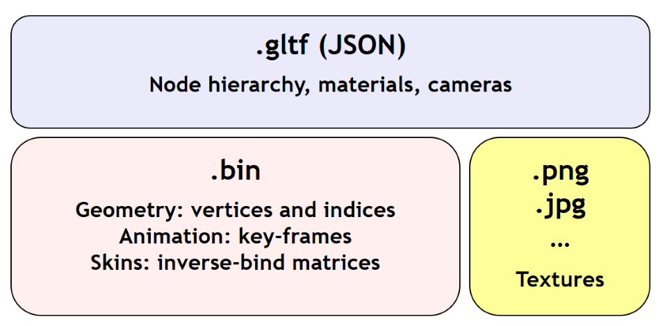
</p>

## Design Goals

*This section is non-normative.*

glTF has been designed to meet the following goals:

* *Compact file sizes.* While web developers like to work with clear text as much as possible, clear text encoding is simply not practical for transmitting 3D data due to sheer size. The glTF JSON file itself is clear text, but it is compact and rapid to parse. All large data such as geometry and animations are stored in binary files that are much smaller than equivalent text representations.
* *Fast loading.* glTF data structures have been designed to mirror the GPU API data as closely as possible, both in the JSON and binary files, to reduce load times. For example, binary data for meshes could be viewed as JavaScript Typed Arrays and be loaded directly into GPU buffers with a simple data copy; no parsing or further processing is required.
* *Runtime-independence.* glTF makes no assumptions about the target application or 3D engine. glTF specifies no runtime behaviors other than rendering and animation.
* *Complete 3D scene representation.* Exporting single objects from a modeling package is not sufficient for many applications. Often, authors want to load entire scenes, including nodes, transformations, transform hierarchy, meshes, materials, cameras, and animations into their applications. glTF strives to preserve all of this information for use in the downstream application.
* *Extensibility.* While the initial base specification supports a rich feature set, there will be many opportunities for growth and improvement. glTF defines a mechanism that allows the addition of both general-purpose and vendor-specific extensions.

The design of glTF takes a pragmatic approach. The format is meant to mirror the GPU APIs as closely as possible, but if it did only that, there would be no cameras, animations, or other features typically found in both modeling tools and runtime systems, and much semantic information would be lost in the translation. By supporting these common constructs, glTF content can not only load and render, but it can be immediately usable in a wider range of applications and require less duplication of effort in the content pipeline.

The following are outside the scope of the initial design of glTF:

* *glTF is not a streaming format.* The binary data in glTF is inherently streamable, and the buffer design allows for fetching data incrementally. But there are no other streaming constructs in the format, and no conformance requirements for an implementation to stream data versus downloading it in its entirety before rendering.
* *glTF is not intended to be human-readable,* though by virtue of being represented in JSON, it is developer-friendly.

While version 2.0 of glTF does not define compression for geometry and other rich data, the [KHR_draco_mesh_compression extension](https://github.com/KhronosGroup/glTF/blob/master/extensions/2.0/Khronos/KHR_draco_mesh_compression/README.md) provides that option. Future extensions may include compression methods for textures and animation data.

## Versioning

Any updates made to glTF in a minor version will be backwards and forwards compatible. Backwards compatibility will ensure that any client implementation that supports loading a glTF 2.x asset will also be able to load a glTF 2.0 asset. Forwards compatibility will allow a client implementation that only supports glTF 2.0 to load glTF 2.x assets while gracefully ignoring any new features it does not understand.

A minor version update can introduce new features but will not change any previously existing behavior. Existing functionality can be deprecated in a minor version update, but it will not be removed. 

Major version updates are not expected to be compatible with previous versions.

## File Extensions and MIME Types

* `*.gltf` files use `model/gltf+json`
* `*.bin` files use `application/octet-stream`
* Texture files use the official `image/*` type based on the specific image format. For compatibility with modern web browsers, the following image formats are supported: `image/jpeg`, `image/png`.

## JSON Encoding

To simplify client-side implementation, glTF has additional restrictions on JSON format and encoding.

1. JSON must use UTF-8 encoding without BOM.
   > **Implementation Note:** glTF exporters must not add a byte order mark to the beginning of JSON text. In the interests of interoperability, client implementations may ignore the presence of a byte order mark rather than treating it as an error. See [RFC8259, section 8](https://tools.ietf.org/html/rfc8259#section-8) for more information.

2. All strings defined in this spec (properties names, enums) use only ASCII charset and must be written as plain text, e.g., `"buffer"` instead of `"\u0062\u0075\u0066\u0066\u0065\u0072"`.

   > **Implementation Note:** This allows generic glTF client implementations to not have full Unicode support. Application-specific strings (e.g., values of `"name"` properties or content of `extras` fields) may use any symbols.
3. Names (keys) within JSON objects must be unique, i.e., duplicate keys aren't allowed.

## URIs

glTF uses URIs to reference buffers and image resources. Clients must support at least these two URI types:

- **Data URIs** that embed resources in the JSON. They use syntax defined by [RFC&nbsp;2397](https://tools.ietf.org/html/rfc2397).
  > **Implementation Note:** Data URIs could be [decoded with JavaScript](https://developer.mozilla.org/en-US/docs/Web/API/WindowBase64/Base64_encoding_and_decoding) or consumed directly by web browsers in HTML tags.

- **Relative URI paths** — or `path-noscheme` as defined by RFC&nbsp;3986, [Section 4.2](https://tools.ietf.org/html/rfc3986#section-4.2) — without scheme, authority, or parameters. Reserved characters must be percent-encoded, per RFC&nbsp;3986, [Section 2.2](https://tools.ietf.org/html/rfc3986#section-2.2).
  > **Implementation Note:** Clients can optionally support additional URI components. For example `http://` or `file://` schemes, authorities/hostnames, absolute paths, and query or fragment parameters. Assets containing these additional URI components may be less portable.

 > **Implementation Note:** This allows the application to decide the best approach for delivery: if different assets share many of the same geometries, animations, or textures, separate files may be preferred to reduce the total amount of data requested. With separate files, applications can progressively load data and do not need to load data for parts of a model that are not visible. If an application cares more about single-file deployment, embedding data may be preferred even though it increases the overall size due to base64 encoding and does not support progressive or on-demand loading. Alternatively, an asset could use GLB container to store JSON and binary data in one file without base64 encoding. See [GLB File Format Specification](#glb-file-format-specification) for details.

Applications should consider applying syntax-based normalization to URIs as defined by [RFC&nbsp;3986, Section&nbsp;6.2.2.](https://tools.ietf.org/html/rfc3986#section-6.2.2), [RFC&nbsp;3987, Section&nbsp;5.3.2.](https://tools.ietf.org/html/rfc3987#section-5.3.2), and applicable schema rules (e.g., [RFC&nbsp;7230, Section&nbsp;2.7.3.](https://tools.ietf.org/html/rfc7230#section-2.7.3) for HTTP) on export and/or import.

> **Implementation Note:** While the spec does not explicitly disallow non-normalized URIs, their use may be unsupported or lead to unwanted side-effects — such as security warnings or cache misses — on some platforms.

# Concepts

<p align="center">
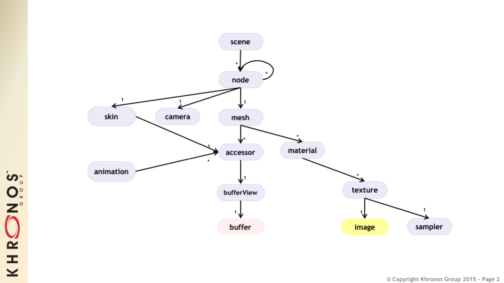<br/>
The top-level arrays in a glTF asset.  See the <a href="#properties-reference">Properties Reference</a>.
</p>

## Asset

Each glTF asset must have an `asset` property. In fact, it's the only required top-level property for JSON to be a valid glTF. The `asset` object must contain glTF version which specifies the target glTF version of the asset. Additionally, an optional `minVersion` property can be used to specify the minimum glTF version support required to load the asset. The `minVersion` property allows asset creators to specify a minimum version that a client implementation must support in order to load the asset. This is very similar to the `extensionsRequired` concept, where an asset should only be loaded if the client supports the specified extension. Additional metadata can be stored in optional properties such as `generator` or `copyright`.  For example,

```json
{
    "asset": {
        "version": "2.0",
        "generator": "collada2gltf@f356b99aef8868f74877c7ca545f2cd206b9d3b7",
        "copyright": "2017 (c) Khronos Group"
    }
}
```

> **Implementation Note:** Client implementations should first check whether a `minVersion` property is specified and ensure both major and minor versions can be supported. If no `minVersion` is specified, then clients should check the `version` property and ensure the major version is supported. Clients that load [GLB format](#glb-file-format-specification) should also check for the `minVersion` and `version` properties in the JSON chunk as the version specified in the GLB header only refers to the GLB container version.


## Indices and Names

Entities of a glTF asset are referenced by their indices in corresponding arrays, e.g., a `bufferView` refers to a `buffer` by specifying the buffer's index in `buffers` array.  For example:

```json
{
    "buffers": [
        {
            "byteLength": 1024,
            "uri": "path-to.bin"
        }
    ],
    "bufferViews": [
        {
            "buffer": 0,
            "byteLength": 512,
            "byteOffset": 0
        }
    ]
}
```

In this example, `buffers` and `bufferViews` have only one element each. The bufferView refers to the buffer using the buffer's index: `"buffer": 0`.

Whereas indices are used for internal glTF references, _names_ are used for application-specific uses such as display. Any top-level glTF object can have a `name` string property for this purpose. These property values are not guaranteed to be unique as they are intended to contain values created when the asset was authored.

For property names, glTF uses [camel case](http://en.wikipedia.org/wiki/CamelCase) `likeThis`. Camel case is a common naming convention in JSON and WebGL.

## Coordinate System and Units

glTF uses a right-handed coordinate system, that is, the cross product of +X and +Y yields +Z. glTF defines +Y as up. The front of a glTF asset faces +Z.

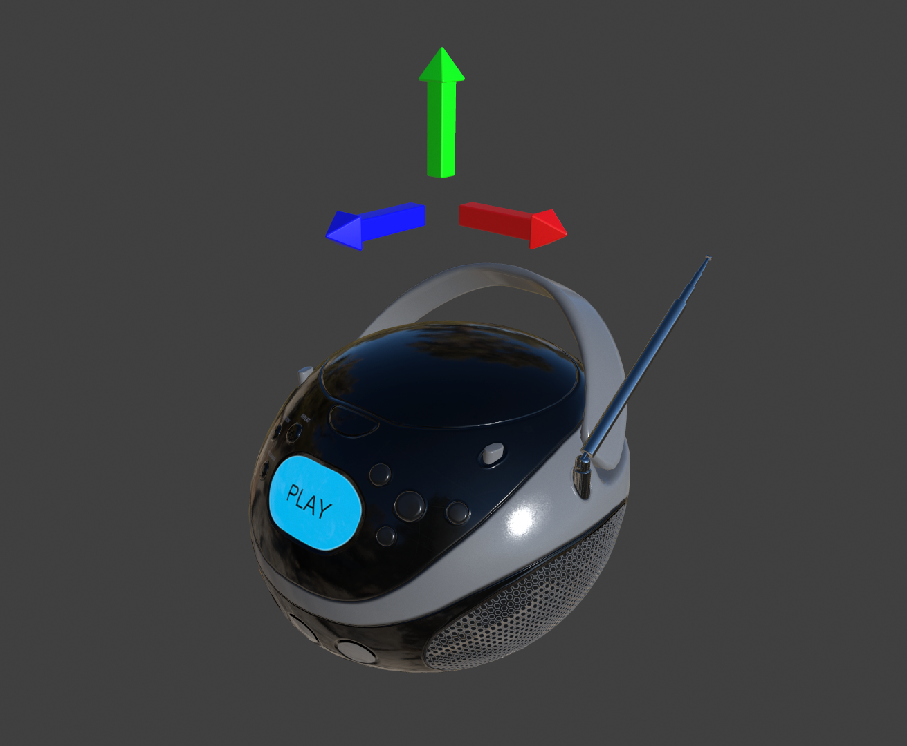

The units for all linear distances are meters.

All angles are in radians.

Positive rotation is counterclockwise.

The [node transformations](#transformations) and [animation channel paths](#animations) are 3D vectors or quaternions with the following data types and semantics:

* translation: A 3D vector containing the translation along the x, y and z axes
* rotation: A quaternion (x, y, z, w), where w is the scalar
* scale: A 3D vector containing the scaling factors along the x, y and z axes


## Scenes

The glTF asset contains zero or more *scenes*, the set of visual objects to render. Scenes are defined in a `scenes` array. An additional property, `scene` (note singular), identifies which of the scenes in the array is to be displayed at load time.

All nodes listed in `scene.nodes` array must be root nodes (see the next section for details).

When `scene` is undefined, runtime is not required to render anything at load time.

> **Implementation Note:** This allows applications to use glTF assets as libraries of individual entities such as materials or meshes.   

The following example defines a glTF asset with a single scene, that contains a single node.

```json
{
    "nodes": [
        {
            "name": "singleNode"
        }
    ],
    "scenes": [
        {
            "name": "singleScene",
            "nodes": [
                0
            ]
        }
    ],
    "scene": 0
}
```

### Nodes and Hierarchy

The glTF asset can define *nodes*, that is, the objects comprising the scene to render.

Nodes have an optional `name` property.

Nodes also have transform properties, as described in the next section.

Nodes are organized in a parent-child hierarchy known informally as the *node hierarchy*. A node is called a *root node* when it doesn't have a parent.

The node hierarchy is defined using a node's `children` property, as in the following example:

```json
{
    "nodes": [
        {
            "name": "Car",
            "children": [1, 2, 3, 4]
        },
        {
            "name": "wheel_1"
        },
        {
            "name": "wheel_2"
        },
        {
            "name": "wheel_3"
        },
        {
            "name": "wheel_4"
        }        
    ]
}
```

The node named `Car` has four children. Each of those nodes could in turn have its own children, creating a hierarchy of nodes.

> For Version 2.0 conformance, the glTF node hierarchy is not a directed acyclic graph (DAG) or *scene graph*, but a disjoint union of strict trees. That is, no node may be a direct descendant of more than one node. This restriction is meant to simplify implementation and facilitate conformance.

### Transformations

Any node can define a local space transformation either by supplying a `matrix` property, or any of `translation`, `rotation`, and `scale`  properties (also known as *TRS properties*). `translation` and `scale` are `FLOAT_VEC3` values in the local coordinate system. `rotation` is a `FLOAT_VEC4` unit quaternion value, `(x, y, z, w)`, in the local coordinate system.

When `matrix` is defined, it must be decomposable to TRS. This implies that transformation matrices cannot skew or shear.

TRS properties are converted to matrices and postmultiplied in the `T * R * S` order to compose the transformation matrix; first the scale is applied to the vertices, then the rotation, and then the translation.

When a node is targeted for animation (referenced by an `animation.channel.target`), only TRS properties may be present; `matrix` will not be present. 

> **Implementation Note:** If the determinant of the transform is a negative value, the winding order of the mesh triangle faces should be reversed. This supports negative scales for mirroring geometry.

> **Implementation Note:** Non-invertible transformations (e.g., scaling one axis to zero) could lead to lighting and/or visibility artifacts.

In the example below, node named `Box` defines non-default rotation and translation.

```json
{
    "nodes": [
        {
            "name": "Box",
            "rotation": [
                0,
                0,
                0,
                1
            ],
            "scale": [
                1,
                1,
                1
            ],
            "translation": [
                -17.7082,
                -11.4156,
                2.0922
            ]
        }
    ]
}
```

The next example defines the transformation for a node with attached camera using the `matrix` property rather than using the individual TRS values:

```json
{
    "nodes": [
        {
            "name": "node-camera",
            "camera": 1,
            "matrix": [
                -0.99975,
                -0.00679829,
                0.0213218,
                0,
                0.00167596,
                0.927325,
                0.374254,
                0,
                -0.0223165,
                0.374196,
                -0.927081,
                0,
                -0.0115543,
                0.194711,
                -0.478297,
                1
            ]
        }
    ]
}
```

## Binary Data Storage

### Buffers and Buffer Views

A *buffer* is data stored as a binary blob. The buffer can contain a combination of geometry, animation, and skins.

Binary blobs allow efficient creation of GPU buffers and textures since they require no additional parsing, except perhaps decompression. An asset can have any number of buffer files for flexibility for a wide array of applications.

> **Implementation Note:** While there's no upper limit on buffer's size, implementations should be aware that JSON parsers may support integers only up to 2<sup>53</sup> when running on certain platforms. Also there's an implicit limit of 2<sup>32</sup>-1 bytes when a buffer is stored as [GLB](#glb-file-format-specification) binary chunk.

Buffer data is little endian.

All buffers are stored in the asset's `buffers` array.

The following example defines a buffer. The `byteLength` property specifies the size of the buffer file. The `uri` property is the URI to the buffer data. Buffer data may also be stored within the glTF file as base64-encoded data and reference via data URI.

```json
{
   "buffers": [
       {
           "byteLength": 102040,
           "uri": "duck.bin"
       }
   ]
}
```

A *bufferView* represents a subset of data in a buffer, defined by a byte offset into the buffer specified in the `byteOffset` property and a total byte length specified by the `byteLength` property of the buffer view.

When a buffer view contain vertex indices or attributes, they must be its only content, i.e., it's invalid to have more than one kind of data in the same buffer view.

> **Implementation Note:** This allows a runtime to upload buffer view data to the GPU without any additional processing. When `bufferView.target` is defined, runtime must use it to determine data usage, otherwise it could be inferred from mesh' accessor objects.

The following example defines two buffer views: the first is an ELEMENT_ARRAY_BUFFER, which holds the indices for an indexed triangle set, and the second is an ARRAY_BUFFER that holds the vertex data for the triangle set.

```json
{
    "bufferViews": [
        {
            "buffer": 0,
            "byteLength": 25272,
            "byteOffset": 0,
            "target": 34963
        },
        {
            "buffer": 0,
            "byteLength": 76768,
            "byteOffset": 25272,
            "byteStride": 32,
            "target": 34962
        }
    ]
}
```

When a buffer view is used for vertex attribute data, it may have a `byteStride` property. This property defines the stride in bytes between each vertex.

Buffers and buffer views do not contain type information. They simply define the raw data for retrieval from the file. Objects within the glTF file (meshes, skins, animations) access buffers or buffer views via *accessors*.

#### GLB-stored Buffer

glTF asset could use GLB file container to pack all resources into one file. glTF Buffer referring to GLB-stored `BIN` chunk, must have `buffer.uri` property undefined, and it must be the first element of `buffers` array; byte length of `BIN` chunk could be up to 3 bytes bigger than JSON-defined `buffer.byteLength` to satisfy GLB padding requirements.

> **Implementation Note:**  Not requiring strict equality of chunk's and buffer's lengths simplifies glTF to GLB conversion a bit: implementations don't need to update `buffer.byteLength` after applying GLB padding.

In the following example, the first buffer objects refers to GLB-stored data, while the second points to external resource:

```json
{
    "buffers": [
        {
            "byteLength": 35884
        },
        {
            "byteLength": 504,
            "uri": "external.bin"
        }
  ]
}
```

See [GLB File Format Specification](#glb-file-format-specification) for details on GLB File Format.

### Accessors

All large data for meshes, skins, and animations is stored in buffers and retrieved via accessors.

An *accessor* defines a method for retrieving data as typed arrays from within a `bufferView`. The accessor specifies a component type (e.g. `5126 (FLOAT)`) and a data type (e.g. `VEC3`), which when combined define the complete data type for each array element. The accessor also specifies the location and size of the data within the `bufferView` using the properties `byteOffset` and `count`. The latter specifies the number of elements within the `bufferView`, *not* the number of bytes. Elements could be, e.g., vertex indices, vertex attributes, animation keyframes, etc.

All accessors are stored in the asset's `accessors` array.

The following fragment shows two accessors, the first is a scalar accessor for retrieving a primitive's indices, and the second is a 3-float-component vector accessor for retrieving the primitive's position data.

```json
{
    "accessors": [
        {
            "bufferView": 0,
            "byteOffset": 0,
            "componentType": 5123,
            "count": 12636,
            "max": [
                4212
            ],
            "min": [
                0
            ],
            "type": "SCALAR"
        },
        {
            "bufferView": 1,
            "byteOffset": 0,
            "componentType": 5126,
            "count": 2399,
            "max": [
                0.961799,
                1.6397,
                0.539252
            ],
            "min": [
                -0.692985,
                0.0992937,
                -0.613282
            ],
            "type": "VEC3"
        }
    ]
}
```

#### Floating-Point Data

Data of `5126 (FLOAT)` componentType must use IEEE-754 single precision format. 

Values of `NaN`, `+Infinity`, and `-Infinity` are not allowed.

#### Accessor Element Size

The following tables can be used to compute the size of element accessible by accessor.

| `componentType` | Size in bytes |
|:---------------:|:-------------:|
| `5120` (BYTE) | 1 |
| `5121`(UNSIGNED_BYTE) | 1 |
| `5122` (SHORT) | 2 |
| `5123` (UNSIGNED_SHORT) | 2 |
| `5125` (UNSIGNED_INT) | 4 |
| `5126` (FLOAT) | 4 |

| `type` | Number of components |
|:------:|:--------------------:|
| `"SCALAR"` | 1 |
| `"VEC2"` | 2 |
| `"VEC3"` | 3 |
| `"VEC4"` | 4 |
| `"MAT2"` | 4 |
| `"MAT3"` | 9 |
| `"MAT4"` | 16 |

Element size, in bytes, is
`(size in bytes of the 'componentType') * (number of components defined by 'type')`.

For example:

```json
{
    "accessors": [
        {
            "bufferView": 1,
            "byteOffset": 7032,
            "componentType": 5126,
            "count": 586,
            "type": "VEC3"
        }
    ]
}
```

In this accessor, the `componentType` is `5126` (FLOAT), so each component is four bytes.  The `type` is `"VEC3"`, so there are three components.  The size of each element is 12 bytes (`4 * 3`).

#### Accessors Bounds

`accessor.min` and `accessor.max` properties are arrays that contain per-component minimum and maximum values, respectively. Exporters and loaders must treat these values as having the same data type as accessor's `componentType`, i.e., use integers (JSON number without fractional part) for integer types and use floating-point decimals for `5126` (FLOAT).

> **Implementation Note:** JavaScript client implementations should convert JSON-parsed floating-point doubles to single precision, when `componentType` is `5126` (FLOAT). This could be done with `Math.fround` function.

While these properties are not required for all accessor usages, there are cases when minimum and maximum must be defined. Refer to other sections of this specification for details. 

#### Sparse Accessors

Sparse encoding of arrays is often more memory-efficient than dense encoding when describing incremental changes with respect to a reference array.
This is often the case when encoding morph targets (it is, in general, more efficient to describe a few displaced vertices in a morph target than transmitting all morph target vertices).

glTF 2.0 extends the accessor structure to enable efficient transfer of sparse arrays.
Similarly to a standard accessor, a sparse accessor initializes an array of typed elements from data stored in a `bufferView` . On top of that, a sparse accessor includes a `sparse` dictionary describing the elements that deviate from their initialization value. The `sparse` dictionary contains the following mandatory properties:
- `count`: number of displaced elements.
- `indices`: strictly increasing array of integers of size `count` and specific `componentType` that stores the indices of those elements that deviate from the initialization value.
- `values`: array of displaced elements corresponding to the indices in the `indices` array.

The following fragment shows an example of `sparse` accessor with 10 elements deviating from the initialization array.

```json
{
    "accessors": [
        {
            "bufferView": 0,
            "byteOffset": 0,
            "componentType": 5123,
            "count": 12636,
            "type": "VEC3",
            "sparse": {
                "count": 10,
                "indices": {
                    "bufferView": 1,
                    "byteOffset": 0,
                    "componentType": 5123
                },
                "values": {
                    "bufferView": 2,
                    "byteOffset": 0
                }
            }
        }
    ]
}
```
A sparse accessor differs from a regular one in that `bufferView` property isn't required. When it's omitted, the sparse accessor is initialized as an array of zeros of size `(size of the accessor element) * (accessor.count)` bytes.
A sparse accessor `min` and `max` properties correspond, respectively, to the minimum and maximum component values once the sparse substitution is applied.

When neither `sparse` nor `bufferView` is defined, `min` and `max` properties could have any values. This is intended for use cases when binary data is supplied by external means (e.g., via extensions).

#### Data Alignment

The offset of an `accessor` into a `bufferView` (i.e., `accessor.byteOffset`) and the offset of an `accessor` into a `buffer` (i.e., `accessor.byteOffset + bufferView.byteOffset`) must be a multiple of the size of the accessor's component type.

When `byteStride` of referenced `bufferView` is not defined, it means that accessor elements are tightly packed, i.e., effective stride equals the size of the element. When `byteStride` is defined, it must be a multiple of the size of the accessor's component type. `byteStride` must be defined, when two or more accessors use the same `bufferView`.

Each `accessor` must fit its `bufferView`, i.e., `accessor.byteOffset + STRIDE * (accessor.count - 1) + SIZE_OF_ELEMENT` must be less than or equal to `bufferView.length`.

For performance and compatibility reasons, each element of a vertex attribute must be aligned to 4-byte boundaries inside `bufferView` (i.e., `accessor.byteOffset` and `bufferView.byteStride` must be multiples of 4).

Accessors of matrix type have data stored in column-major order; start of each column must be aligned to 4-byte boundaries. To achieve this, three `type`/`componentType` combinations require special layout:

**MAT2, 1-byte components**
```
| 00| 01| 02| 03| 04| 05| 06| 07| 
|===|===|===|===|===|===|===|===|
|m00|m10|---|---|m01|m11|---|---|
```

**MAT3, 1-byte components**
```
| 00| 01| 02| 03| 04| 05| 06| 07| 08| 09| 0A| 0B|
|===|===|===|===|===|===|===|===|===|===|===|===|
|m00|m10|m20|---|m01|m11|m21|---|m02|m12|m22|---|
```

**MAT3, 2-byte components**
```
| 00| 01| 02| 03| 04| 05| 06| 07| 08| 09| 0A| 0B| 0C| 0D| 0E| 0F| 10| 11| 12| 13| 14| 15| 16| 17|
|===|===|===|===|===|===|===|===|===|===|===|===|===|===|===|===|===|===|===|===|===|===|===|===|
|m00|m00|m10|m10|m20|m20|---|---|m01|m01|m11|m11|m21|m21|---|---|m02|m02|m12|m12|m22|m22|---|---|
```

Alignment requirements apply only to start of each column, so trailing bytes could be omitted if there's no further data. 

> **Implementation Note:** For JavaScript, this allows a runtime to efficiently create a single ArrayBuffer from a glTF `buffer` or an ArrayBuffer per `bufferView`, and then use an `accessor` to turn a typed array view (e.g., `Float32Array`) into an ArrayBuffer without copying it because the byte offset of the typed array view is a multiple of the size of the type (e.g., `4` for `Float32Array`).

Consider the following example:

```json
{
    "bufferViews": [
        {
            "buffer": 0,
            "byteLength": 17136,
            "byteOffset": 620,
            "target": 34963
        }
    ],
    "accessors": [
        {
            "bufferView": 0,
            "byteOffset": 4608,
            "componentType": 5123,
            "count": 5232,
            "type": "VEC2"
        }
    ]
}
```
Accessing binary data defined by example above could be done like this:

```js
const accessorTypeToNumComponentsMap = {
		'SCALAR': 1,
		'VEC2': 2,
		'VEC3': 3,
		'VEC4': 4,
		'MAT2': 4,
		'MAT3': 9,
		'MAT4': 16
};
var typedView = new Uint16Array(buffer, accessor.byteOffset + accessor.bufferView.byteOffset, accessor.count * accessorTypeToNumComponentsMap[accessor.type]);
```

The size of the accessor component type is two bytes (the `componentType` is unsigned short). The accessor's `byteOffset` is also divisible by two. Likewise, the accessor's offset into buffer `0` is `5228 ` (`620 + 4608`), which is divisible by two.


## Geometry

Any node can contain one mesh, defined in its `mesh` property. Mesh can be skinned using a information provided in referenced `skin` object. Mesh can have morph targets.

### Meshes

In glTF, meshes are defined as arrays of *primitives*. Primitives correspond to the data required for GPU draw calls. Primitives specify one or more `attributes`, corresponding to the vertex attributes used in the draw calls. Indexed primitives also define an `indices` property. Attributes and indices are defined as references to accessors containing corresponding data. Each primitive also specifies a material and a primitive type that corresponds to the GPU primitive type (e.g., triangle set).

> **Implementation note:** Splitting one mesh into *primitives* could be useful to limit number of indices per draw call.

If `material` is not specified, then a [default material](#default-material) is used.

The following example defines a mesh containing one triangle set primitive:

```json
{
    "meshes": [
        {
            "primitives": [
                {
                    "attributes": {
                        "NORMAL": 23,
                        "POSITION": 22,
                        "TANGENT": 24,
                        "TEXCOORD_0": 25
                    },
                    "indices": 21,
                    "material": 3,
                    "mode": 4
                }
            ]
        }
    ]
}
```

Each attribute is defined as a property of the `attributes` object. The name of the property corresponds to an enumerated value identifying the vertex attribute, such as `POSITION`. The value of the property is the index of an accessor that contains the data.

Valid attribute semantic property names include `POSITION`, `NORMAL`, `TANGENT`, `TEXCOORD_0`, `TEXCOORD_1`, `COLOR_0`, `JOINTS_0`, and `WEIGHTS_0`.  Application-specific semantics must start with an underscore, e.g., `_TEMPERATURE`.

Valid accessor type and component type for each attribute semantic property are defined below.

|Name|Accessor Type(s)|Component Type(s)|Description|
|----|----------------|-----------------|-----------|
|`POSITION`|`"VEC3"`|`5126`&nbsp;(FLOAT)|XYZ vertex positions|
|`NORMAL`|`"VEC3"`|`5126`&nbsp;(FLOAT)|Normalized XYZ vertex normals|
|`TANGENT`|`"VEC4"`|`5126`&nbsp;(FLOAT)|XYZW vertex tangents where the *w* component is a sign value (-1 or +1) indicating handedness of the tangent basis|
|`TEXCOORD_0`|`"VEC2"`|`5126`&nbsp;(FLOAT)<br>`5121`&nbsp;(UNSIGNED_BYTE)&nbsp;normalized<br>`5123`&nbsp;(UNSIGNED_SHORT)&nbsp;normalized|UV texture coordinates for the first set|
|`TEXCOORD_1`|`"VEC2"`|`5126`&nbsp;(FLOAT)<br>`5121`&nbsp;(UNSIGNED_BYTE)&nbsp;normalized<br>`5123`&nbsp;(UNSIGNED_SHORT)&nbsp;normalized|UV texture coordinates for the second set|
|`COLOR_0`|`"VEC3"`<br>`"VEC4"`|`5126`&nbsp;(FLOAT)<br>`5121`&nbsp;(UNSIGNED_BYTE)&nbsp;normalized<br>`5123`&nbsp;(UNSIGNED_SHORT)&nbsp;normalized|RGB or RGBA vertex color|
|`JOINTS_0`|`"VEC4"`|`5121`&nbsp;(UNSIGNED_BYTE)<br>`5123`&nbsp;(UNSIGNED_SHORT)|See [Skinned Mesh Attributes](#skinned-mesh-attributes)|
|`WEIGHTS_0`|`"VEC4"`|`5126`&nbsp;(FLOAT)<br>`5121`&nbsp;(UNSIGNED_BYTE)&nbsp;normalized<br>`5123`&nbsp;(UNSIGNED_SHORT)&nbsp;normalized|See [Skinned Mesh Attributes](#skinned-mesh-attributes)|

`POSITION` accessor **must** have `min` and `max` properties defined.

`TEXCOORD`, `COLOR`, `JOINTS`, and `WEIGHTS` attribute semantic property names must be of the form `[semantic]_[set_index]`, e.g., `TEXCOORD_0`, `TEXCOORD_1`, `COLOR_0`. Client implementations must support at least two UV texture coordinate sets, one vertex color, and one joints/weights set. Extensions can add additional property names, accessor types, and/or accessor component types.

All indices for indexed attribute semantics must start with 0 and be continuous positive integers: `TEXCOORD_0`, `TEXCOORD_1`, etc. Indices must not use leading zeroes to pad the number of digits, and clients are not required to support more indexed semantics than described above.

All attribute accessors for a given primitive must have the same `count`; when `indices` property is not defined, it indicates the number of vertices to render; when `indices` property is defined, it indicates the upper (exclusive) bound on the index values in the `indices` accessor.

> **Implementation note:** Each primitive corresponds to one WebGL draw call (engines are, of course, free to batch draw calls). When a primitive's `indices` property is defined, it references the accessor to use for index data, and GL's `drawElements` function should be used. When the `indices` property is not defined, GL's `drawArrays` function should be used with a count equal to the count property of any of the accessors referenced by the `attributes` property (they are all equal for a given primitive).

> **Implementation note:** When positions are not specified, client implementations should skip primitive's rendering unless its positions are provided by other means (e.g., by extension). This applies to both indexed and non-indexed geometry.

> **Implementation note:** When normals are not specified, client implementations should calculate flat normals.

> **Implementation note:** When tangents are not specified, client implementations should calculate tangents using default MikkTSpace algorithms.  For best results, the mesh triangles should also be processed using default MikkTSpace algorithms.

> **Implementation note:** Vertices of the same triangle should have the same `tangent.w` value. When vertices of the same triangle have different `tangent.w` values, tangent space is considered undefined.

> **Implementation note:** When normals and tangents are specified, client implementations should compute the bitangent by taking the cross product of the normal and tangent xyz vectors and multiplying against the w component of the tangent: `bitangent = cross(normal, tangent.xyz) * tangent.w`

#### Morph Targets

Morph Targets are defined by extending the Mesh concept.

A Morph Target is a morphable Mesh where primitives' attributes are obtained by adding the original attributes to a weighted sum of targets attributes.

For instance, the Morph Target vertices `POSITION` for the primitive at index *i* are computed in this way:
```
primitives[i].attributes.POSITION + 
  weights[0] * primitives[i].targets[0].POSITION +
  weights[1] * primitives[i].targets[1].POSITION +
  weights[2] * primitives[i].targets[2].POSITION + ...
```
Morph Targets are implemented via the `targets` property defined in the Mesh `primitives`. Each target in the `targets` array is a dictionary mapping a primitive attribute to an accessor containing Morph Target displacement data. Currently only three attributes — `POSITION`, `NORMAL`, and `TANGENT` — are commonly supported. If morph targets contain application-specific semantics, their names must be prefixed with an underscore (e.g. `_TEMPERATURE`) like the associated attribute semantic. All primitives are required to list the same number of `targets` in the same order.

Valid accessor type and component type for each attribute semantic property are defined below. Note that the *w* component for handedness is omitted when targeting `TANGENT` data since handedness cannot be displaced.

|Name|Accessor Type(s)|Component Type(s)|Description|
|----|----------------|-----------------|-----------|
|`POSITION`|`"VEC3"`|`5126`&nbsp;(FLOAT)|XYZ vertex position displacements|
|`NORMAL`|`"VEC3"`|`5126`&nbsp;(FLOAT)|XYZ vertex normal displacements|
|`TANGENT`|`"VEC3"`|`5126`&nbsp;(FLOAT)|XYZ vertex tangent displacements|

`POSITION` accessor **must** have `min` and `max` properties defined.

All Morph Target's accessors **must** have the same `count` as the accessors of the original primitive.

A Morph Target may also define an optional `mesh.weights` property that stores the default targets weights. In the absence of a `node.weights` property, the primitives attributes are resolved using these weights. When this property is missing, the default targets weights are assumed to be zero.

The following example extends the Mesh defined in the previous example to a morphable one by adding two Morph Targets:
```json
{
    "primitives": [
        {
            "attributes": {
                "NORMAL": 23,
                "POSITION": 22,
                "TANGENT": 24,
                "TEXCOORD_0": 25
            },
            "indices": 21,
            "material": 3,
            "targets": [
                {
                    "NORMAL": 33,
                    "POSITION": 32,
                    "TANGENT": 34
                },
                {
                    "NORMAL": 43,
                    "POSITION": 42,
                    "TANGENT": 44
                }
            ]
        }
    ],
    "weights": [0, 0.5]
}
```

After applying morph targets to vertex positions and normals, tangent space may need to be recalculated. See [Appendix A](#appendix-a-tangent-space-recalculation) for details.

> **Implementation note:** The number of morph targets is not limited in glTF. A conformant client implementation must support at least eight morphed attributes. This means that it has to support at least eight morph targets that contain a `POSITION` attribute, or four morph targets that contain a `POSITION` and a `NORMAL` attribute, or two morph targets that contain `POSITION`, `NORMAL` and `TANGENT` attributes. For assets that contain a higher number of morphed attributes, renderers may choose to either fully support them (for example, by performing the morph computations in software), or to only use the eight attributes of the morph targets with the highest weights. 


### Skins

All skins are stored in the `skins` array of the asset. Each skin is defined by the `inverseBindMatrices` property (which points to an accessor with IBM data), used to bring coordinates being skinned into the same space as each joint; and a `joints` array property that lists the nodes indices used as joints to animate the skin. The order of joints is defined in the `skin.joints` array and it must match the order of `inverseBindMatrices` data. The `skeleton` property (if present) points to the node that is the common root of a joints hierarchy or to a direct or indirect parent node of the common root.

> **Implementation Note:** The matrix defining how to pose the skin's geometry for use with the joints ("Bind Shape Matrix") should be premultiplied to mesh data or to Inverse Bind Matrices. 

> **Implementation Note:** Client implementations should apply only the transform of the skeleton root node to the skinned mesh while ignoring the transform of the skinned mesh node. In the example below, the translation of `node_0` and the scale of `node_1` are applied while the translation of `node_3` and rotation of `node_4` are ignored.

```json
{
    "nodes": [
        {
            "name": "node_0",
            "children": [ 1 ],
            "translation": [ 0.0, 1.0, 0.0 ]
        },
        {
            "name": "node_1",
            "children": [ 2 ],
            "scale": [ 0.5, 0.5, 0.5 ]
        },
        {
            "name": "node_2"
        },
        {
            "name": "node_3",
            "children": [ 4 ],
            "translation": [ 1.0, 0.0, 0.0 ]
        },
        {
            "name": "node_4",
            "mesh": 0,
            "rotation": [ 0.0, 1.0, 0.0, 0.0 ],
            "skin": 0
        }
    ],
    "skins": [
        {
            "name": "skin_0",
            "inverseBindMatrices": 0,
            "joints": [ 1, 2 ],
            "skeleton": 1
        }
    ]
}
```

#### Skinned Mesh Attributes

The mesh for a skin is defined with vertex attributes that are used in skinning calculations in the vertex shader. The `JOINTS_0` attribute data contains the indices of the joints from corresponding `joints` array that should affect the vertex. The `WEIGHTS_0` attribute data defines the weights indicating how strongly the joint should influence the vertex. The following mesh skin defines `JOINTS_0` and `WEIGHTS_0` vertex attributes for a triangle mesh primitive:

```json
{
    "meshes": [
        {
            "name": "skinned-mesh_1",
            "primitives": [
                {
                    "attributes": {
                        "JOINTS_0": 179,
                        "NORMAL": 165,
                        "POSITION": 163,
                        "TEXCOORD_0": 167,
                        "WEIGHTS_0": 176
                    },
                    "indices": 161,
                    "material": 1,
                    "mode": 4
                }
            ]
        }
    ]
}
```

The number of joints that influence one vertex is limited to 4 per set, so referenced accessors must have `VEC4` type and following component formats:

* **`JOINTS_0`**: `UNSIGNED_BYTE` or `UNSIGNED_SHORT`
* **`WEIGHTS_0`**: `FLOAT`, or normalized `UNSIGNED_BYTE`, or normalized `UNSIGNED_SHORT`

The joint weights for each vertex must be non-negative, and normalized to have a linear sum of `1.0`. No joint may have more than one non-zero weight for a given vertex.

In the event that of any of the vertices are influenced by more than four joints, the additional joint and weight information will be found in subsequent sets. For example `JOINTS_1` and `WEIGHTS_1` if present will reference the accessor for up to 4 additional joints that influence the vertices. Note that client implementations are only required to support a single set of up to four weights and joints, however not supporting all weight and joint sets present in the file may have an impact on the model's animation.

All joint values must be within the range of joints in the skin. Unused joint values (i.e. joints with a weight of zero) should be set to zero.

#### Joint Hierarchy

The joint hierarchy used for controlling skinned mesh pose is simply the glTF node hierarchy, with each node designated as a joint. Each skin's joints must have a common root, which may or may not be a joint node itself. When a skin is referenced by a node within a scene, the common root must belong to the same scene.

For more details of vertex skinning implementation, refer to [glTF Overview](figures/gltfOverview-2.0.0b.png).

> **Implementation Note:** A node definition does not specify whether the node should be treated as a joint. Client implementations may wish to traverse the `skins` array first, marking each joint node.

> **Implementation Note:** A joint may have regular nodes attached to it, even a complete node sub graph with meshes. It's often used to have an entire geometry attached to a joint without having it being skinned by the joint. (ie. a sword attached to a hand joint). Note that the node transform is the local transform of the node relative to the joint, like any other node in the glTF node hierarchy as described in the [Transformation](#transformations) section.

### Instantiation

A mesh is instantiated by `node.mesh` property. The same mesh could be used by many nodes, which could have different transformations. For example:

```json
{
    "nodes": [
        {
            "mesh": 11
        },
        {
            "mesh": 11,
            "translation": [
                -20,
                -1,
                0
            ]            
        }
    ]
}

```

A Morph Target is instanced within a node using:
- The Morph Target referenced in the `mesh` property.
- The Morph Target `weights` overriding the `weights` of the Morph Target referenced in the `mesh` property.
The example below instatiates a Morph Target with non-default weights.

```json
{
    "nodes": [
        {
            "mesh": 11,
            "weights": [0, 0.5]
        }
    ]
}
```

A skin is instanced within a node using a combination of the node's `mesh` and `skin` properties. The mesh for a skin instance is defined in the `mesh` property. The `skin` property contains the index of the skin to instance.

```json
{
    "skins": [
        {
            "inverseBindMatrices": 29,
            "joints": [1, 2] 
        }
    ],
    "nodes": [
        {
            "name":"Skinned mesh node",
            "mesh": 0,
            "skin": 0
        },
        {
            "name":"Skeleton root joint",
            "children": [2],
            "rotation": [
                0,
                0,
                0.7071067811865475,
                0.7071067811865476
            ],
            "translation": [
                4.61599,
                -2.032e-06,
                -5.08e-08
            ]
        },
        {
            "name":"Head",
            "translation": [
                8.76635,
                0,
                0
            ]
        }
    ]
}
```

## Texture Data

glTF separates texture access into three distinct types of objects: Textures, Images, and Samplers.

### Textures

All textures are stored in the asset's `textures` array. A texture is defined by an image resource, denoted by the `source` property and a sampler index (`sampler`).

```json
{
    "textures": [
        {
            "sampler": 0,
            "source": 2
        }
    ]
}
```

> **Implementation Note** glTF 2.0 supports only 2D textures.

### Images

Images referred to by textures are stored in the `images` array of the asset. 

Each image contains one of
- a URI to an external file in one of the supported images formats, or
- a URI with embedded base64-encoded data, or
- a reference to a `bufferView`; in that case `mimeType` must be defined.

The following example shows an image pointing to an external PNG image file and another image referencing a `bufferView` with JPEG data.

```json
{
    "images": [
        {
            "uri": "duckCM.png"
        },
        {
            "bufferView": 14,
            "mimeType": "image/jpeg" 
        }
    ]
}
```
> **Implementation Note:** When image data is provided by `uri` and `mimeType` is defined, client implementations should prefer JSON-defined MIME Type over one provided by transport layer.

The origin of the UV coordinates (0, 0) corresponds to the upper left corner of a texture image.
This is illustrated in the following figure, where the respective UV coordinates are shown for all four corners of a normalized UV space:
<p align="center">
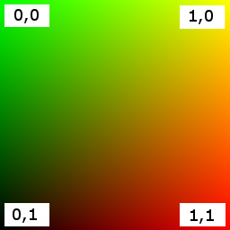<br/>
</p>

Any colorspace information (such as ICC profiles, intents, etc) from PNG or JPEG containers must be ignored.

> **Implementation Note:** This increases portability of an asset, since not all image decoding libraries fully support custom color conversions. To achieve correct rendering, WebGL runtimes must disable such conversions by setting `UNPACK_COLORSPACE_CONVERSION_WEBGL` flag to `NONE`.

### Samplers

Samplers are stored in the `samplers` array of the asset. Each sampler specifies filter and wrapping options corresponding to the GL types. The following example defines a sampler with linear mag filtering, linear mipmap min filtering, and repeat wrapping in S (U) and T (V).


```json
{
    "samplers": [
        {
            "magFilter": 9729,
            "minFilter": 9987,
            "wrapS": 10497,
            "wrapT": 10497
        }
    ]
}
```

> **Default Filtering Implementation Note:** When filtering options are defined, runtime must use them. Otherwise, it is free to adapt filtering to performance or quality goals.

> **Mipmapping Implementation Note**: When a sampler's minification filter (`minFilter`) uses mipmapping (`NEAREST_MIPMAP_NEAREST`, `NEAREST_MIPMAP_LINEAR`, `LINEAR_MIPMAP_NEAREST`, or `LINEAR_MIPMAP_LINEAR`), any texture referencing the sampler needs to have mipmaps, e.g., by calling GL's `generateMipmap()` function.

> **Non-Power-Of-Two Texture Implementation Note**: glTF does not guarantee that a texture's dimensions are a power-of-two.  At runtime, if a texture's width or height is not a power-of-two, the texture needs to be resized so its dimensions are powers-of-two if the `sampler` the texture references
> * Has a wrapping mode (either `wrapS` or `wrapT`) equal to `REPEAT` or `MIRRORED_REPEAT`, or
> * Has a minification filter (`minFilter`) that uses mipmapping (`NEAREST_MIPMAP_NEAREST`, `NEAREST_MIPMAP_LINEAR`, `LINEAR_MIPMAP_NEAREST`, or `LINEAR_MIPMAP_LINEAR`).

## Materials

glTF defines materials using a common set of parameters that are based on widely used material representations from Physically-Based Rendering (PBR). Specifically, glTF uses the metallic-roughness material model. Using this declarative representation of materials enables a glTF file to be rendered consistently across platforms. 

<p>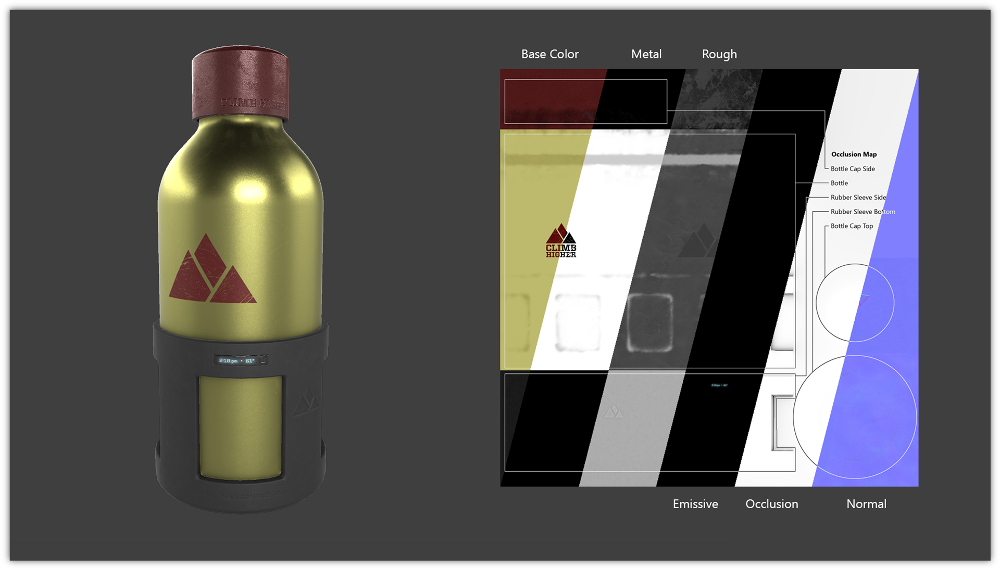</p>

### Metallic-Roughness Material 

All parameters related to the metallic-roughness material model are defined under the `pbrMetallicRoughness` property of `material` object. The following example shows how a material like gold can be defined using the metallic-roughness parameters: 

```json
{
    "materials": [
        {
            "name": "gold",
            "pbrMetallicRoughness": {
                "baseColorFactor": [ 1.000, 0.766, 0.336, 1.0 ],
                "metallicFactor": 1.0,
                "roughnessFactor": 0.0
            }
        }
    ]
}
```

The metallic-roughness material model is defined by the following properties:
* `baseColor` - The base color of the material
* `metallic` - The metalness of the material
* `roughness` - The roughness of the material

The base color has two different interpretations depending on the value of metalness. When the material is a metal, the base color is the specific measured reflectance value at normal incidence (F0). For a non-metal the base color represents the reflected diffuse color of the material. In this model it is not possible to specify a F0 value for non-metals, and a linear value of 4% (0.04) is used. 

The value for each property (`baseColor`, `metallic`, `roughness`) can be defined using factors or textures. The `metallic` and `roughness` properties are packed together in a single texture called `metallicRoughnessTexture`. If a texture is not given, all respective texture components within this material model are assumed to have a value of `1.0`. If both factors and textures are present the factor value acts as a linear multiplier for the corresponding texture values. The `baseColorTexture` is in sRGB space and must be converted to linear space before it is used for any computations.

For example, assume a value of `[0.9, 0.5, 0.3, 1.0]` in linear space is obtained from an RGBA `baseColorTexture`, and assume that `baseColorFactor` is given as `[0.2, 1.0, 0.7, 1.0]`.
Then, the result would be 
```
[0.9 * 0.2, 0.5 * 1.0, 0.3 * 0.7, 1.0 * 1.0] = [0.18, 0.5, 0.21, 1.0]
```

The following equations show how to calculate bidirectional reflectance distribution function (BRDF) inputs (*c<sub>diff</sub>*, *F<sub>0</sub>*, *&alpha;*) from the metallic-roughness material properties. In addition to the material properties, if a primitive specifies a vertex color using the attribute semantic property `COLOR_0`, then this value acts as an additional linear multiplier to `baseColor`.

`const dielectricSpecular = rgb(0.04, 0.04, 0.04)`
<br>
`const black = rgb(0, 0, 0)`

*c<sub>diff</sub>* = `lerp(baseColor.rgb * (1 - dielectricSpecular.r), black, metallic)`
<br>
*F<sub>0</sub>* = `lerp(dieletricSpecular, baseColor.rgb, metallic)`
<br>
*&alpha;* = `roughness ^ 2`

All implementations should use the same calculations for the BRDF inputs. Implementations of the BRDF itself can vary based on device performance and resource constraints. See [Appendix B](#appendix-b-brdf-implementation) for more details on the BRDF calculations.

### Additional Maps

The material definition also provides for additional maps that can also be used with the metallic-roughness material model as well as other material models which could be provided via glTF extensions.

Materials define the following additional maps:
- **normal** : A tangent space normal map.
- **occlusion** : The occlusion map indicating areas of indirect lighting.
- **emissive** : The emissive map controls the color and intensity of the light being emitted by the material.

The following examples shows a material that is defined using `pbrMetallicRoughness` parameters as well as additional texture maps:

```json
{
    "materials": [
        {
            "name": "Material0",
            "pbrMetallicRoughness": {
                "baseColorFactor": [ 0.5, 0.5, 0.5, 1.0 ],
                "baseColorTexture": {
                    "index": 1,
                    "texCoord": 1
                },
                "metallicFactor": 1,
                "roughnessFactor": 1,
                "metallicRoughnessTexture": {
                    "index": 2,
                    "texCoord": 1
                }
            },
            "normalTexture": {
                "scale": 2,
                "index": 3,
                "texCoord": 1
            },
            "emissiveFactor": [ 0.2, 0.1, 0.0 ]
        }
    ]
}
```

>**Implementation Note:** If an implementation is resource-bound and cannot support all the maps defined it should support these additional maps in the following priority order.  Resource-bound implementations should drop maps from the bottom to the top.
>
>| Map       | Rendering impact when map is not supported |
>|-----------|--------------------------------------------|
>| Normal    | Geometry will appear less detailed than authored. |
>| Occlusion | Model will appear brighter in areas that should be darker. |
>| Emissive  | Model with lights will not be lit. For example, the headlights of a car model will be off instead of on. |

### Alpha Coverage

The `alphaMode` property defines how the alpha value of the main factor and texture should be interpreted. The alpha value is defined in the `baseColor` for metallic-roughness material model. 

`alphaMode` can be one of the following values:
* `OPAQUE` - The rendered output is fully opaque and any alpha value is ignored.
* `MASK` - The rendered output is either fully opaque or fully transparent depending on the alpha value and the specified alpha cutoff value. This mode is used to simulate geometry such as tree leaves or wire fences.
* `BLEND` - The rendered output is combined with the background using the normal painting operation (i.e. the Porter and Duff over operator). This mode is used to simulate geometry such as guaze cloth or animal fur. 

 When `alphaMode` is set to `MASK` the `alphaCutoff` property specifies the cutoff threshold. If the alpha value is greater than or equal to the `alphaCutoff` value then it is rendered as fully opaque, otherwise, it is rendered as fully transparent. `alphaCutoff` value is ignored for other modes.

>**Implementation Note for Real-Time Rasterizers:** Real-time rasterizers typically use depth buffers and mesh sorting to support alpha modes. The following describe the expected behavior for these types of renderers.
>* `OPAQUE` - A depth value is written for every pixel and mesh sorting is not required for correct output.
>* `MASK` - A depth value is not written for a pixel that is discarded after the alpha test. A depth value is written for all other pixels. Mesh sorting is not required for correct output.
>* `BLEND` - Support for this mode varies. There is no perfect and fast solution that works for all cases. Implementations should try to achieve the correct blending output for as many situations as possible. Whether depth value is written or whether to sort is up to the implementation. For example, implementations can discard pixels which have zero or close to zero alpha value to avoid sorting issues.

### Double Sided

The `doubleSided` property specifies whether the material is double sided. When this value is false, back-face culling is enabled. When this value is true, back-face culling is disabled and double sided lighting is enabled. The back-face must have its normals reversed before the lighting equation is evaluated.

### Default Material

The default material, used when a mesh does not specify a material, is defined to be a material with no properties specified. All the default values of [`material`](#reference-material) apply. Note that this material does not emit light and will be black unless some lighting is present in the scene.

### Point and Line Materials

*This section is non-normative.*

This specification does not define size and style of non-triangular primitives (such as POINTS or LINES) at this time, and applications may use various techniques to render these primitives as appropriate. However, the following recommendations are provided for consistency:

* POINTS and LINES should have widths of 1px in viewport space.
* For LINES with `NORMAL` and `TANGENT` properties, render with standard lighting including normal maps.
* For POINTS or LINES with no `TANGENT` property, render with standard lighting but ignore any normal maps on the material.
* For POINTS or LINES with no `NORMAL` property, don't calculate lighting and instead output the `COLOR` value for each pixel drawn.

## Cameras

A camera defines the projection matrix that transforms from view to clip coordinates. The projection can be perspective or orthographic. Cameras are contained in nodes and thus can be transformed. Their world-space transformation matrix is used for calculating view-space transformation. The camera is defined such that the local +X axis is to the right, the lens looks towards the local -Z axis, and the top of the camera is aligned with the local +Y axis. If no transformation is specified, the location of the camera is at the origin.

Cameras are stored in the asset's `cameras` array. Each camera defines a `type` property that designates the type of projection (perspective or orthographic), and either a `perspective` or `orthographic` property that defines the details.

Depending on the presence of `zfar` property, perspective cameras could use finite or infinite projection.

The following example defines two perspective cameras with supplied values for Y field of view, aspect ratio, and clipping information.

```json
{
    "cameras": [
        {
            "name": "Finite perspective camera",
            "type": "perspective",
            "perspective": {
                "aspectRatio": 1.5,
                "yfov": 0.660593,
                "zfar": 100,
                "znear": 0.01
            }      
        },
        {
            "name": "Infinite perspective camera",
            "type": "perspective",
            "perspective": {
                "aspectRatio": 1.5,
                "yfov": 0.660593,
                "znear": 0.01
            }
        }
    ]
}
```

### Projection Matrices

Runtimes are expected to use the following projection matrices.

#### Infinite perspective projection
<p>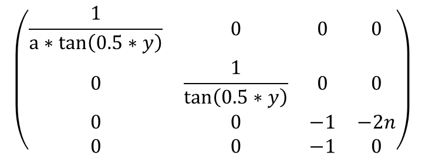</p>
where

- `a` equals `camera.perspective.aspectRatio`;
- `y` equals `camera.perspective.yfov`;
- `n` equals `camera.perspective.znear`.

#### Finite perspective projection
<p>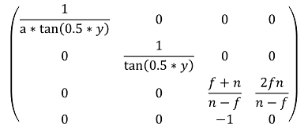</p>
where

- `a` equals `camera.perspective.aspectRatio`;
- `y` equals `camera.perspective.yfov`;
- `f` equals `camera.perspective.zfar`;
- `n` equals `camera.perspective.znear`.

#### Orthographic projection
<p>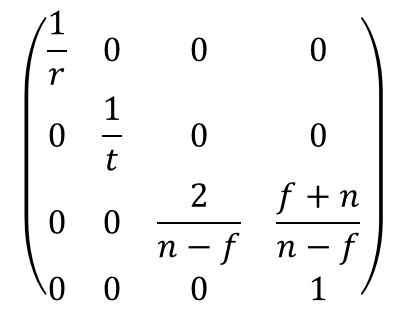</p>
where

- `r` equals `camera.orthographic.xmag`;
- `t` equals `camera.orthographic.ymag`;
- `f` equals `camera.orthographic.zfar`;
- `n` equals `camera.orthographic.znear`.

## Animations

glTF supports articulated and skinned animation via key frame animations of nodes' transforms. Key frame data is stored in buffers and referenced in animations using accessors.
glTF 2.0 also supports animation of instantiated Morph Targets in a similar fashion.

> **Note:** glTF 2.0 only supports animating node transforms and Morph Targets weights. A future version of the specification may support animating arbitrary properties, such as material colors and texture transform matrices.

> **Note:** glTF 2.0 defines only animation storage, so this specification doesn't define any particular runtime behavior, such as: order of playing, auto-start, loops, mapping of timelines, etc...

> **Implementation Note:** glTF 2.0 does not specifically define how an animation will be used when imported but, as a best practice, it is recommended that each animation is self contained as an action. For example, "Walk" and "Run" animations might each contain multiple channels targeting a model's various bones. The client implementation may choose when to play any of the available animations.

All animations are stored in the `animations` array of the asset. An animation is defined as a set of channels (the `channels` property) and a set of samplers that specify accessors with key frame data and interpolation method (the `samplers` property).

The following examples show expected animations usage.

```json
{
    "animations": [
        {
            "name": "Animate all properties of one node with different samplers",
            "channels": [
                {
                    "sampler": 0,
                    "target": {
                        "node": 1,
                        "path": "rotation"
                    }
                },
                {
                    "sampler": 1,
                    "target": {
                        "node": 1,
                        "path": "scale"
                    }
                },
                {
                    "sampler": 2,
                    "target": {
                        "node": 1,
                        "path": "translation"
                    }
                }
            ],
            "samplers": [
                {
                    "input": 4,
                    "interpolation": "LINEAR",
                    "output": 5
                },
                {
                    "input": 4,
                    "interpolation": "LINEAR",
                    "output": 6
                },
                {
                    "input": 4,
                    "interpolation": "LINEAR",
                    "output": 7
                }
            ]
        },
        {
            "name": "Animate two nodes with different samplers",
            "channels": [
                {
                    "sampler": 0,
                    "target": {
                        "node": 0,
                        "path": "rotation"
                    }
                },
                {
                    "sampler": 1,
                    "target": {
                        "node": 1,
                        "path": "rotation"
                    }
                }
            ],
            "samplers": [
                {
                    "input": 0,
                    "interpolation": "LINEAR",
                    "output": 1
                },
                {
                    "input": 2,
                    "interpolation": "LINEAR",
                    "output": 3
                }
            ]
        },
        {
            "name": "Animate two nodes with the same sampler",
            "channels": [
                {
                    "sampler": 0,
                    "target": {
                        "node": 0,
                        "path": "rotation"
                    }
                },
                {
                    "sampler": 0,
                    "target": {
                        "node": 1,
                        "path": "rotation"
                    }
                }
            ],
            "samplers": [
                {
                    "input": 0,
                    "interpolation": "LINEAR",
                    "output": 1
                }
            ]
        },
        {
            "name": "Animate a node rotation channel and the weights of a Morph Target it instantiates",
            "channels": [
                {
                    "sampler": 0,
                    "target": {
                        "node": 1,
                        "path": "rotation"
                    }
                },
                {
                    "sampler": 1,
                    "target": {
                        "node": 1,
                        "path": "weights"
                    }
                }
            ],
            "samplers": [
                {
                    "input": 4,
                    "interpolation": "LINEAR",
                    "output": 5
                },
                {
                    "input": 4,
                    "interpolation": "LINEAR",
                    "output": 6
                }
            ]
        }
    ]
}
```

*Channels* connect the output values of the key frame animation to a specific node in the hierarchy. A channel's `sampler` property contains the index of one of the samplers present in the containing animation's `samplers` array. The `target` property is an object that identifies which node to animate using its `node` property, and which property of the node to animate using `path`. Non-animated properties must keep their values during animation.

When `node` isn't defined, channel should be ignored. Valid path names are `"translation"`, `"rotation"`, `"scale"`, and `"weights"`.

Each of the animation's *samplers* defines the `input`/`output` pair: a set of floating point scalar values representing linear time in seconds; and a set of vectors or scalars representing animated property. All values are stored in a buffer and accessed via accessors; refer to the table below for output accessor types. Interpolation between keys is performed using the interpolation method specified in the `interpolation` property. Supported `interpolation` values include `LINEAR`, `STEP`, and `CUBICSPLINE`. See [Appendix C](#appendix-c-spline-interpolation) for additional information about spline interpolation.

The inputs of each sampler are relative to `t=0`, defined as the beginning of the parent `animations` entry. Before and after the provided input range, output should be "clamped" to the nearest end of the input range. For example, if the earliest sampler input for an animation is `t=10`, a client implementation should begin playback of that animation at `t=0` with output clamped to the first output value. Samplers within a given animation are _not_ required to have the same inputs.

|`channel.path`|Accessor Type|Component Type(s)|Description|
|----|----------------|-----------------|-----------|
|`"translation"`|`"VEC3"`|`5126`&nbsp;(FLOAT)|XYZ translation vector|
|`"rotation"`|`"VEC4"`|`5126`&nbsp;(FLOAT)<br>`5120`&nbsp;(BYTE)&nbsp;normalized<br>`5121`&nbsp;(UNSIGNED_BYTE)&nbsp;normalized<br>`5122`&nbsp;(SHORT)&nbsp;normalized<br>`5123`&nbsp;(UNSIGNED_SHORT)&nbsp;normalized|XYZW rotation quaternion|
|`"scale"`|`"VEC3"`|`5126`&nbsp;(FLOAT)|XYZ scale vector|
|`"weights"`|`"SCALAR"`|`5126`&nbsp;(FLOAT)<br>`5120`&nbsp;(BYTE)&nbsp;normalized<br>`5121`&nbsp;(UNSIGNED_BYTE)&nbsp;normalized<br>`5122`&nbsp;(SHORT)&nbsp;normalized<br>`5123`&nbsp;(UNSIGNED_SHORT)&nbsp;normalized|Weights of morph targets|

Implementations must use following equations to get corresponding floating-point value `f` from a normalized integer `c` and vise-versa:

|`accessor.componentType`|int-to-float|float-to-int|
|-----------------------------|--------|----------------|
| `5120`&nbsp;(BYTE)          |`f = max(c / 127.0, -1.0)`|`c = round(f * 127.0)`|
| `5121`&nbsp;(UNSIGNED_BYTE) |`f = c / 255.0`|`c = round(f * 255.0)`|
| `5122`&nbsp;(SHORT)         |`f = max(c / 32767.0, -1.0)`|`c = round(f * 32767.0)`|
| `5123`&nbsp;(UNSIGNED_SHORT)|`f = c / 65535.0`|`c = round(f * 65535.0)`|

Animation Sampler's `input` accessor **must** have `min` and `max` properties defined.

> **Implementation Note:** Animations with non-linear time inputs, such as time warps in Autodesk 3ds Max or Maya, are not directly representable with glTF animations. glTF is a runtime format and non-linear time inputs are expensive to compute at runtime. Exporter implementations should sample a non-linear time animation into linear inputs and outputs for an accurate representation.

A Morph Target animation frame is defined by a sequence of scalars of length equal to the number of targets in the animated Morph Target. These scalar sequences must lie end-to-end as a single stream in the output accessor, whose final size will equal the number of Morph Targets times the number of animation frames.

Morph Target animation is by nature sparse, consider using [Sparse Accessors](#sparse-accessors) for storage of Morph Target animation. When used with `CUBICSPLINE` interpolation, tangents (a<sub>k</sub>, b<sub>k</sub>) and values (v<sub>k</sub>) are grouped within keyframes:

a<sub>1</sub>,a<sub>2</sub>,...a<sub>n</sub>,v<sub>1</sub>,v<sub>2</sub>,...v<sub>n</sub>,b<sub>1</sub>,b<sub>2</sub>,...b<sub>n</sub>

See [Appendix C](#appendix-c-spline-interpolation) for additional information about spline interpolation.

glTF animations can be used to drive articulated or skinned animations. Skinned animation is achieved by animating the joints in the skin's joint hierarchy.

## Specifying Extensions

glTF defines an extension mechanism that allows the base format to be extended with new capabilities. Any glTF object can have an optional `extensions` property, as in the following example:

```json
{
    "material": [
        {
            "extensions": {
                "KHR_materials_common": {
                    "technique": "LAMBERT"
                }
            }
        }
    ]
}
```

All extensions used in a glTF asset must be listed in the top-level `extensionsUsed` array object, e.g.,

```json
{
    "extensionsUsed": [
        "KHR_materials_common",
        "VENDOR_physics"
    ]
}
```

All glTF extensions required to load and/or render an asset must be listed in the top-level `extensionsRequired` array, e.g.,

```json
{
    "extensionsRequired": [
        "WEB3D_quantized_attributes"
    ]
}
```

`extensionsRequired` is a subset of `extensionsUsed`. All values in `extensionsRequired` must also exist in `extensionsUsed`.

For more information on glTF extensions, consult the [extensions registry specification](../../extensions/README.md).

# GLB File Format Specification

glTF provides two delivery options that can also be used together:

* glTF JSON points to external binary data (geometry, key frames, skins), and images.
* glTF JSON embeds base64-encoded binary data, and images inline using data URIs.

For these resources, glTF requires either separate requests or extra space due to base64-encoding. Base64-encoding requires extra processing to decode and increases the file size (by ~33% for encoded resources). While gzip mitigates the file size increase, decompression and decoding still add significant loading time.

To solve this, a container format, _Binary glTF_ is introduced. In Binary glTF, a glTF asset (JSON, .bin, and images) can be stored in a binary blob. 

This binary blob (which can be a file, for example) has the following structure:
* A 12-byte preamble, entitled the `header`.
* One or more `chunks` that contains JSON content and binary data.

The `chunk` containing JSON can refer to external resources as usual, and can also reference resources stored within other `chunks`.

For example, an application that wants to download textures on demand may embed everything except images in the Binary glTF. Embedded base64-encoded resources are also still supported, but it would be inefficient to use them.

### File Extension

The file extension to be used with Binary glTF is `.glb`.

### MIME Type

Use `model/gltf-binary`.

## Binary glTF Layout

Binary glTF is little endian. Figure 1 shows an example of a Binary glTF asset.

**Figure 1**: Binary glTF layout.

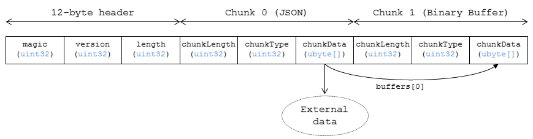

The following sections describe the structure more in detail.

### Header

The 12-byte header consists of three 4-byte entries:

```
uint32 magic
uint32 version
uint32 length
```

* `magic` equals `0x46546C67`. It is ASCII string `glTF`, and can be used to identify data as Binary glTF.

* `version` indicates the version of the Binary glTF container format. This specification defines version 2.

* `length` is the total length of the Binary glTF, including Header and all Chunks, in bytes.

> **Implementation Note:** Client implementations that load GLB format should also check for the [asset version properties](#asset) in the JSON chunk, as the version specified in the GLB header only refers to the GLB container version.

### Chunks

Each chunk has the following structure:
```
uint32 chunkLength
uint32 chunkType
ubyte[] chunkData
```

* `chunkLength` is the length of `chunkData`, in bytes.

* `chunkType` indicates the type of chunk. See Table 1 for details.

* `chunkData` is a binary payload of chunk.

The start and the end of each chunk must be aligned to 4-byte boundary. See chunks definitions for padding schemes. Chunks must appear in exactly the order given in the Table 1.

**Table 1**: Chunk types

|  | Chunk Type | ASCII | Description | Occurrences |
|----|------------|-------|-------------------------|-------------|
| 1. | 0x4E4F534A | JSON | Structured JSON content | 1 |
| 2. | 0x004E4942 | BIN | Binary buffer | 0 or 1 |

Client implementations must ignore chunks with unknown types to enable glTF extensions to reference additional chunks with new types following the first two chunks.

#### Structured JSON Content

This chunk holds the structured glTF content description, as it would be provided within a .gltf file.

> **Implementation Note:** In a JavaScript implementation, the `TextDecoder` API can be used to extract the glTF content from the ArrayBuffer, and then the JSON can be parsed with `JSON.parse` as usual.

This chunk must be the very first chunk of Binary glTF asset. By reading this chunk first, an implementation is able to progressively retrieve resources from subsequent chunks. This way, it is also possible to read only a selected subset of resources from a Binary glTF asset (for instance, the coarsest LOD of a mesh).

This chunk must be padded with trailing `Space` chars (`0x20`) to satisfy alignment requirements.  

#### Binary buffer

This chunk contains the binary payload for geometry, animation key frames, skins, and images. See glTF specification for details on referencing this chunk from JSON.

This chunk must be the second chunk of the Binary glTF asset.

This chunk must be padded with trailing zeros (`0x00`) to satisfy alignment requirements.

# Properties Reference

## Objects
* [`accessor`](#reference-accessor)
   * [`sparse`](#reference-sparse)
      * [`indices`](#reference-indices)
      * [`values`](#reference-values)
* [`animation`](#reference-animation)
   * [`animation sampler`](#reference-animation-sampler)
   * [`channel`](#reference-channel)
      * [`target`](#reference-target)
* [`asset`](#reference-asset)
* [`buffer`](#reference-buffer)
* [`bufferView`](#reference-bufferview)
* [`camera`](#reference-camera)
   * [`orthographic`](#reference-orthographic)
   * [`perspective`](#reference-perspective)
* [`extension`](#reference-extension)
* [`extras`](#reference-extras)
* [`glTF`](#reference-gltf) (root object)
* [`image`](#reference-image)
* [`material`](#reference-material)
   * [`normalTextureInfo`](#reference-normaltextureinfo)
   * [`occlusionTextureInfo`](#reference-occlusiontextureinfo)
   * [`pbrMetallicRoughness`](#reference-pbrmetallicroughness)
* [`mesh`](#reference-mesh)
   * [`primitive`](#reference-primitive)
* [`node`](#reference-node)
* [`sampler`](#reference-sampler)
* [`scene`](#reference-scene)
* [`skin`](#reference-skin)
* [`texture`](#reference-texture)
* [`textureInfo`](#reference-textureinfo)


---------------------------------------
<a name="reference-accessor"></a>
### accessor

A typed view into a bufferView.  A bufferView contains raw binary data.  An accessor provides a typed view into a bufferView or a subset of a bufferView similar to how WebGL's `vertexAttribPointer()` defines an attribute in a buffer.

**Properties**

|   |Type|Description|Required|
|---|----|-----------|--------|
|**bufferView**|`integer`|The index of the bufferView.|No|
|**byteOffset**|`integer`|The offset relative to the start of the bufferView in bytes.|No, default: `0`|
|**componentType**|`integer`|The datatype of components in the attribute.| :white_check_mark: Yes|
|**normalized**|`boolean`|Specifies whether integer data values should be normalized.|No, default: `false`|
|**count**|`integer`|The number of attributes referenced by this accessor.| :white_check_mark: Yes|
|**type**|`string`|Specifies if the attribute is a scalar, vector, or matrix.| :white_check_mark: Yes|
|**max**|`number` `[1-16]`|Maximum value of each component in this attribute.|No|
|**min**|`number` `[1-16]`|Minimum value of each component in this attribute.|No|
|**sparse**|`object`|Sparse storage of attributes that deviate from their initialization value.|No|
|**name**|`string`|The user-defined name of this object.|No|
|**extensions**|`object`|Dictionary object with extension-specific objects.|No|
|**extras**|`any`|Application-specific data.|No|

Additional properties are allowed.

* **JSON schema**: [accessor.schema.json](schema/accessor.schema.json)

#### accessor.bufferView

The index of the bufferView. When not defined, accessor must be initialized with zeros; [`sparse`](#reference-sparse) property or extensions could override zeros with actual values.

* **Type**: `integer`
* **Required**: No
* **Minimum**: ` >= 0`

#### accessor.byteOffset

The offset relative to the start of the bufferView in bytes.  This must be a multiple of the size of the component datatype.

* **Type**: `integer`
* **Required**: No, default: `0`
* **Minimum**: ` >= 0`
* **Related WebGL functions**: `vertexAttribPointer()` offset parameter

#### accessor.componentType :white_check_mark: 

The datatype of components in the attribute.  All valid values correspond to WebGL enums.  The corresponding typed arrays are `Int8Array`, `Uint8Array`, `Int16Array`, `Uint16Array`, `Uint32Array`, and `Float32Array`, respectively.  5125 (UNSIGNED_INT) is only allowed when the accessor contains indices, i.e., the accessor is only referenced by `primitive.indices`.

* **Type**: `integer`
* **Required**: Yes
* **Allowed values**:
   * `5120` BYTE
   * `5121` UNSIGNED_BYTE
   * `5122` SHORT
   * `5123` UNSIGNED_SHORT
   * `5125` UNSIGNED_INT
   * `5126` FLOAT
* **Related WebGL functions**: `vertexAttribPointer()` type parameter

#### accessor.normalized

Specifies whether integer data values should be normalized (`true`) to [0, 1] (for unsigned types) or [-1, 1] (for signed types), or converted directly (`false`) when they are accessed. This property is defined only for accessors that contain vertex attributes or animation output data.

* **Type**: `boolean`
* **Required**: No, default: `false`
* **Related WebGL functions**: `vertexAttribPointer()` normalized parameter

#### accessor.count :white_check_mark: 

The number of attributes referenced by this accessor, not to be confused with the number of bytes or number of components.

* **Type**: `integer`
* **Required**: Yes
* **Minimum**: ` >= 1`

#### accessor.type :white_check_mark: 

Specifies if the attribute is a scalar, vector, or matrix.

* **Type**: `string`
* **Required**: Yes
* **Allowed values**:
   * `"SCALAR"`
   * `"VEC2"`
   * `"VEC3"`
   * `"VEC4"`
   * `"MAT2"`
   * `"MAT3"`
   * `"MAT4"`

#### accessor.max

Maximum value of each component in this attribute.  Array elements must be treated as having the same data type as accessor's `componentType`. Both min and max arrays have the same length.  The length is determined by the value of the type property; it can be 1, 2, 3, 4, 9, or 16.

`normalized` property has no effect on array values: they always correspond to the actual values stored in the buffer. When accessor is sparse, this property must contain max values of accessor data with sparse substitution applied.

* **Type**: `number` `[1-16]`
* **Required**: No

#### accessor.min

Minimum value of each component in this attribute.  Array elements must be treated as having the same data type as accessor's `componentType`. Both min and max arrays have the same length.  The length is determined by the value of the type property; it can be 1, 2, 3, 4, 9, or 16.

`normalized` property has no effect on array values: they always correspond to the actual values stored in the buffer. When accessor is sparse, this property must contain min values of accessor data with sparse substitution applied.

* **Type**: `number` `[1-16]`
* **Required**: No

#### accessor.sparse

Sparse storage of attributes that deviate from their initialization value.

* **Type**: `object`
* **Required**: No

#### accessor.name

The user-defined name of this object.  This is not necessarily unique, e.g., an accessor and a buffer could have the same name, or two accessors could even have the same name.

* **Type**: `string`
* **Required**: No

#### accessor.extensions

Dictionary object with extension-specific objects.

* **Type**: `object`
* **Required**: No
* **Type of each property**: extension

#### accessor.extras

Application-specific data.

* **Type**: `any`
* **Required**: No


---------------------------------------
<a name="reference-animation"></a>
### animation

A keyframe animation.

**Properties**

|   |Type|Description|Required|
|---|----|-----------|--------|
|**channels**|channel `[1-*]`|An array of channels, each of which targets an animation's sampler at a node's property. Different channels of the same animation can't have equal targets.| :white_check_mark: Yes|
|**samplers**|animation sampler `[1-*]`|An array of samplers that combines input and output accessors with an interpolation algorithm to define a keyframe graph (but not its target).| :white_check_mark: Yes|
|**name**|`string`|The user-defined name of this object.|No|
|**extensions**|`object`|Dictionary object with extension-specific objects.|No|
|**extras**|`any`|Application-specific data.|No|

Additional properties are allowed.

* **JSON schema**: [animation.schema.json](schema/animation.schema.json)

#### animation.channels :white_check_mark: 

An array of channels, each of which targets an animation's sampler at a node's property. Different channels of the same animation can't have equal targets.

* **Type**: channel `[1-*]`
* **Required**: Yes

#### animation.samplers :white_check_mark: 

An array of samplers that combines input and output accessors with an interpolation algorithm to define a keyframe graph (but not its target).

* **Type**: animation sampler `[1-*]`
* **Required**: Yes

#### animation.name

The user-defined name of this object.  This is not necessarily unique, e.g., an accessor and a buffer could have the same name, or two accessors could even have the same name.

* **Type**: `string`
* **Required**: No

#### animation.extensions

Dictionary object with extension-specific objects.

* **Type**: `object`
* **Required**: No
* **Type of each property**: extension

#### animation.extras

Application-specific data.

* **Type**: `any`
* **Required**: No


---------------------------------------
<a name="reference-animation-sampler"></a>
### animation sampler

Combines input and output accessors with an interpolation algorithm to define a keyframe graph (but not its target).

**Properties**

|   |Type|Description|Required|
|---|----|-----------|--------|
|**input**|`integer`|The index of an accessor containing keyframe input values, e.g., time.| :white_check_mark: Yes|
|**interpolation**|`string`|Interpolation algorithm.|No, default: `"LINEAR"`|
|**output**|`integer`|The index of an accessor, containing keyframe output values.| :white_check_mark: Yes|
|**extensions**|`object`|Dictionary object with extension-specific objects.|No|
|**extras**|`any`|Application-specific data.|No|

Additional properties are allowed.

* **JSON schema**: [animation.sampler.schema.json](schema/animation.sampler.schema.json)

#### animation sampler.input :white_check_mark: 

The index of an accessor containing keyframe input values, e.g., time. That accessor must have componentType `FLOAT`. The values represent time in seconds with `time[0] >= 0.0`, and strictly increasing values, i.e., `time[n + 1] > time[n]`.

* **Type**: `integer`
* **Required**: Yes
* **Minimum**: ` >= 0`

#### animation sampler.interpolation

Interpolation algorithm.

* **Type**: `string`
* **Required**: No, default: `"LINEAR"`
* **Allowed values**:
   * `"LINEAR"` The animated values are linearly interpolated between keyframes. When targeting a rotation, spherical linear interpolation (slerp) should be used to interpolate quaternions. The number output of elements must equal the number of input elements.
   * `"STEP"` The animated values remain constant to the output of the first keyframe, until the next keyframe. The number of output elements must equal the number of input elements.
   * `"CUBICSPLINE"` The animation's interpolation is computed using a cubic spline with specified tangents. The number of output elements must equal three times the number of input elements. For each input element, the output stores three elements, an in-tangent, a spline vertex, and an out-tangent. There must be at least two keyframes when using this interpolation.

#### animation sampler.output :white_check_mark: 

The index of an accessor containing keyframe output values. When targeting TRS target, the `accessor.componentType` of the output values must be `FLOAT`. When targeting morph weights, the `accessor.componentType` of the output values must be `FLOAT` or normalized integer where each output element stores values with a count equal to the number of morph targets.

* **Type**: `integer`
* **Required**: Yes
* **Minimum**: ` >= 0`

#### animation sampler.extensions

Dictionary object with extension-specific objects.

* **Type**: `object`
* **Required**: No
* **Type of each property**: extension

#### animation sampler.extras

Application-specific data.

* **Type**: `any`
* **Required**: No


---------------------------------------
<a name="reference-asset"></a>
### asset

Metadata about the glTF asset.

**Properties**

|   |Type|Description|Required|
|---|----|-----------|--------|
|**copyright**|`string`|A copyright message suitable for display to credit the content creator.|No|
|**generator**|`string`|Tool that generated this glTF model.  Useful for debugging.|No|
|**version**|`string`|The glTF version that this asset targets.| :white_check_mark: Yes|
|**minVersion**|`string`|The minimum glTF version that this asset targets.|No|
|**extensions**|`object`|Dictionary object with extension-specific objects.|No|
|**extras**|`any`|Application-specific data.|No|

Additional properties are allowed.

* **JSON schema**: [asset.schema.json](schema/asset.schema.json)

#### asset.copyright

A copyright message suitable for display to credit the content creator.

* **Type**: `string`
* **Required**: No

#### asset.generator

Tool that generated this glTF model.  Useful for debugging.

* **Type**: `string`
* **Required**: No

#### asset.version :white_check_mark: 

The glTF version that this asset targets.

* **Type**: `string`
* **Required**: Yes

#### asset.minVersion

The minimum glTF version that this asset targets.

* **Type**: `string`
* **Required**: No

#### asset.extensions

Dictionary object with extension-specific objects.

* **Type**: `object`
* **Required**: No
* **Type of each property**: extension

#### asset.extras

Application-specific data.

* **Type**: `any`
* **Required**: No


---------------------------------------
<a name="reference-buffer"></a>
### buffer

A buffer points to binary geometry, animation, or skins.

**Properties**

|   |Type|Description|Required|
|---|----|-----------|--------|
|**uri**|`string`|The uri of the buffer.|No|
|**byteLength**|`integer`|The total byte length of the buffer view.| :white_check_mark: Yes|
|**name**|`string`|The user-defined name of this object.|No|
|**extensions**|`object`|Dictionary object with extension-specific objects.|No|
|**extras**|`any`|Application-specific data.|No|

Additional properties are allowed.

* **JSON schema**: [buffer.schema.json](schema/buffer.schema.json)

#### buffer.uri

The uri of the buffer.  Relative paths are relative to the .gltf file.  Instead of referencing an external file, the uri can also be a data-uri.

* **Type**: `string`
* **Required**: No
* **Format**: uriref

#### buffer.byteLength :white_check_mark: 

The total byte length of the buffer view.

* **Type**: `integer`
* **Required**: Yes
* **Minimum**: ` >= 1`

#### buffer.name

The user-defined name of this object.  This is not necessarily unique, e.g., an accessor and a buffer could have the same name, or two accessors could even have the same name.

* **Type**: `string`
* **Required**: No

#### buffer.extensions

Dictionary object with extension-specific objects.

* **Type**: `object`
* **Required**: No
* **Type of each property**: extension

#### buffer.extras

Application-specific data.

* **Type**: `any`
* **Required**: No


---------------------------------------
<a name="reference-bufferview"></a>
### bufferView

A view into a buffer generally representing a subset of the buffer.

**Properties**

|   |Type|Description|Required|
|---|----|-----------|--------|
|**buffer**|`integer`|The index of the buffer.| :white_check_mark: Yes|
|**byteOffset**|`integer`|The offset into the buffer in bytes.|No, default: `0`|
|**byteLength**|`integer`|The length of the bufferView in bytes.| :white_check_mark: Yes|
|**byteStride**|`integer`|The stride, in bytes.|No|
|**target**|`integer`|The target that the GPU buffer should be bound to.|No|
|**name**|`string`|The user-defined name of this object.|No|
|**extensions**|`object`|Dictionary object with extension-specific objects.|No|
|**extras**|`any`|Application-specific data.|No|

Additional properties are allowed.

* **JSON schema**: [bufferView.schema.json](schema/bufferView.schema.json)

#### bufferView.buffer :white_check_mark: 

The index of the buffer.

* **Type**: `integer`
* **Required**: Yes
* **Minimum**: ` >= 0`

#### bufferView.byteOffset

The offset into the buffer in bytes.

* **Type**: `integer`
* **Required**: No, default: `0`
* **Minimum**: ` >= 0`

#### bufferView.byteLength :white_check_mark: 

The length of the bufferView in bytes.

* **Type**: `integer`
* **Required**: Yes
* **Minimum**: ` >= 1`

#### bufferView.byteStride

The stride, in bytes, between vertex attributes.  When this is not defined, data is tightly packed. When two or more accessors use the same bufferView, this field must be defined.

* **Type**: `integer`
* **Required**: No
* **Minimum**: ` >= 4`
* **Maximum**: ` <= 252`
* **Related WebGL functions**: `vertexAttribPointer()` stride parameter

#### bufferView.target

The target that the GPU buffer should be bound to.

* **Type**: `integer`
* **Required**: No
* **Allowed values**:
   * `34962` ARRAY_BUFFER
   * `34963` ELEMENT_ARRAY_BUFFER
* **Related WebGL functions**: `bindBuffer()`

#### bufferView.name

The user-defined name of this object.  This is not necessarily unique, e.g., an accessor and a buffer could have the same name, or two accessors could even have the same name.

* **Type**: `string`
* **Required**: No

#### bufferView.extensions

Dictionary object with extension-specific objects.

* **Type**: `object`
* **Required**: No
* **Type of each property**: extension

#### bufferView.extras

Application-specific data.

* **Type**: `any`
* **Required**: No


---------------------------------------
<a name="reference-camera"></a>
### camera

A camera's projection.  A node can reference a camera to apply a transform to place the camera in the scene.

**Properties**

|   |Type|Description|Required|
|---|----|-----------|--------|
|**orthographic**|`object`|An orthographic camera containing properties to create an orthographic projection matrix.|No|
|**perspective**|`object`|A perspective camera containing properties to create a perspective projection matrix.|No|
|**type**|`string`|Specifies if the camera uses a perspective or orthographic projection.| :white_check_mark: Yes|
|**name**|`string`|The user-defined name of this object.|No|
|**extensions**|`object`|Dictionary object with extension-specific objects.|No|
|**extras**|`any`|Application-specific data.|No|

Additional properties are allowed.

* **JSON schema**: [camera.schema.json](schema/camera.schema.json)

#### camera.orthographic

An orthographic camera containing properties to create an orthographic projection matrix.

* **Type**: `object`
* **Required**: No

#### camera.perspective

A perspective camera containing properties to create a perspective projection matrix.

* **Type**: `object`
* **Required**: No

#### camera.type :white_check_mark: 

Specifies if the camera uses a perspective or orthographic projection.  Based on this, either the camera's [`perspective`](#reference-perspective) or [`orthographic`](#reference-orthographic) property will be defined.

* **Type**: `string`
* **Required**: Yes
* **Allowed values**:
   * `"perspective"`
   * `"orthographic"`

#### camera.name

The user-defined name of this object.  This is not necessarily unique, e.g., an accessor and a buffer could have the same name, or two accessors could even have the same name.

* **Type**: `string`
* **Required**: No

#### camera.extensions

Dictionary object with extension-specific objects.

* **Type**: `object`
* **Required**: No
* **Type of each property**: extension

#### camera.extras

Application-specific data.

* **Type**: `any`
* **Required**: No


---------------------------------------
<a name="reference-channel"></a>
### channel

Targets an animation's sampler at a node's property.

**Properties**

|   |Type|Description|Required|
|---|----|-----------|--------|
|**sampler**|`integer`|The index of a sampler in this animation used to compute the value for the target.| :white_check_mark: Yes|
|**target**|`object`|The index of the node and TRS property to target.| :white_check_mark: Yes|
|**extensions**|`object`|Dictionary object with extension-specific objects.|No|
|**extras**|`any`|Application-specific data.|No|

Additional properties are allowed.

* **JSON schema**: [animation.channel.schema.json](schema/animation.channel.schema.json)

#### channel.sampler :white_check_mark: 

The index of a sampler in this animation used to compute the value for the target, e.g., a node's translation, rotation, or scale (TRS).

* **Type**: `integer`
* **Required**: Yes
* **Minimum**: ` >= 0`

#### channel.target :white_check_mark: 

The index of the node and TRS property to target.

* **Type**: `object`
* **Required**: Yes

#### channel.extensions

Dictionary object with extension-specific objects.

* **Type**: `object`
* **Required**: No
* **Type of each property**: extension

#### channel.extras

Application-specific data.

* **Type**: `any`
* **Required**: No


---------------------------------------
<a name="reference-extension"></a>
### extension

Dictionary object with extension-specific objects.

Additional properties are allowed.

* **JSON schema**: [extension.schema.json](schema/extension.schema.json)


---------------------------------------
<a name="reference-extras"></a>
### extras

Application-specific data.

> **Implementation Note:** Although extras may have any type, it is common for applications to
store and access custom data as key/value pairs. As best practice, extras should be an Object
rather than a primitive value for best portability.

---------------------------------------
<a name="reference-gltf"></a>
### glTF

The root object for a glTF asset.

**Properties**

|   |Type|Description|Required|
|---|----|-----------|--------|
|**extensionsUsed**|`string` `[1-*]`|Names of glTF extensions used somewhere in this asset.|No|
|**extensionsRequired**|`string` `[1-*]`|Names of glTF extensions required to properly load this asset.|No|
|**accessors**|accessor `[1-*]`|An array of accessors.|No|
|**animations**|animation `[1-*]`|An array of keyframe animations.|No|
|**asset**|`object`|Metadata about the glTF asset.|Yes|
|**buffers**|buffer `[1-*]`|An array of buffers.|No|
|**bufferViews**|bufferView `[1-*]`|An array of bufferViews.|No|
|**cameras**|camera `[1-*]`|An array of cameras.|No|
|**images**|image `[1-*]`|An array of images.|No|
|**materials**|material `[1-*]`|An array of materials.|No|
|**meshes**|mesh `[1-*]`|An array of meshes.|No|
|**nodes**|node `[1-*]`|An array of nodes.|No|
|**samplers**|sampler `[1-*]`|An array of samplers.|No|
|**scene**|`integer`|The index of the default scene.|No|
|**scenes**|scene `[1-*]`|An array of scenes.|No|
|**skins**|skin `[1-*]`|An array of skins.|No|
|**textures**|texture `[1-*]`|An array of textures.|No|
|**extensions**|`object`|Dictionary object with extension-specific objects.|No|
|**extras**|`any`|Application-specific data.|No|

Additional properties are allowed.

* **JSON schema**: [glTF.schema.json](schema/glTF.schema.json)

#### glTF.extensionsUsed

Names of glTF extensions used somewhere in this asset.

* **Type**: `string` `[1-*]`
   * Each element in the array must be unique.
* **Required**: No

#### glTF.extensionsRequired

Names of glTF extensions required to properly load this asset.

* **Type**: `string` `[1-*]`
   * Each element in the array must be unique.
* **Required**: No

#### glTF.accessors

An array of accessors.  An accessor is a typed view into a bufferView.

* **Type**: accessor `[1-*]`
* **Required**: No

#### glTF.animations

An array of keyframe animations.

* **Type**: animation `[1-*]`
* **Required**: No

#### glTF.asset :white_check_mark: 

Metadata about the glTF asset.

* **Type**: `object`
* **Required**: Yes

#### glTF.buffers

An array of buffers.  A buffer points to binary geometry, animation, or skins.

* **Type**: buffer `[1-*]`
* **Required**: No

#### glTF.bufferViews

An array of bufferViews.  A bufferView is a view into a buffer generally representing a subset of the buffer.

* **Type**: bufferView `[1-*]`
* **Required**: No

#### glTF.cameras

An array of cameras.  A camera defines a projection matrix.

* **Type**: camera `[1-*]`
* **Required**: No

#### glTF.images

An array of images.  An image defines data used to create a texture.

* **Type**: image `[1-*]`
* **Required**: No

#### glTF.materials

An array of materials.  A material defines the appearance of a primitive.

* **Type**: material `[1-*]`
* **Required**: No

#### glTF.meshes

An array of meshes.  A mesh is a set of primitives to be rendered.

* **Type**: mesh `[1-*]`
* **Required**: No

#### glTF.nodes

An array of nodes.

* **Type**: node `[1-*]`
* **Required**: No

#### glTF.samplers

An array of samplers.  A sampler contains properties for texture filtering and wrapping modes.

* **Type**: sampler `[1-*]`
* **Required**: No

#### glTF.scene

The index of the default scene.

* **Type**: `integer`
* **Required**: No
* **Minimum**: ` >= 0`

#### glTF.scenes

An array of scenes.

* **Type**: scene `[1-*]`
* **Required**: No

#### glTF.skins

An array of skins.  A skin is defined by joints and matrices.

* **Type**: skin `[1-*]`
* **Required**: No

#### glTF.textures

An array of textures.

* **Type**: texture `[1-*]`
* **Required**: No

#### glTF.extensions

Dictionary object with extension-specific objects.

* **Type**: `object`
* **Required**: No
* **Type of each property**: extension

#### glTF.extras

Application-specific data.

* **Type**: `any`
* **Required**: No


---------------------------------------
<a name="reference-image"></a>
### image

Image data used to create a texture. Image can be referenced by URI or [`bufferView`](#reference-bufferview) index. `mimeType` is required in the latter case.

**Properties**

|   |Type|Description|Required|
|---|----|-----------|--------|
|**uri**|`string`|The uri of the image.|No|
|**mimeType**|`string`|The image's MIME type.|No|
|**bufferView**|`integer`|The index of the bufferView that contains the image. Use this instead of the image's uri property.|No|
|**name**|`string`|The user-defined name of this object.|No|
|**extensions**|`object`|Dictionary object with extension-specific objects.|No|
|**extras**|`any`|Application-specific data.|No|

Additional properties are allowed.

* **JSON schema**: [image.schema.json](schema/image.schema.json)

#### image.uri

The uri of the image.  Relative paths are relative to the .gltf file.  Instead of referencing an external file, the uri can also be a data-uri.  The image format must be jpg or png.

* **Type**: `string`
* **Required**: No
* **Format**: uriref

#### image.mimeType

The image's MIME type. Required if `bufferView` is defined.

* **Type**: `string`
* **Required**: No
* **Allowed values**:
   * `"image/jpeg"`
   * `"image/png"`

#### image.bufferView

The index of the bufferView that contains the image. Use this instead of the image's uri property.

* **Type**: `integer`
* **Required**: No
* **Minimum**: ` >= 0`

#### image.name

The user-defined name of this object.  This is not necessarily unique, e.g., an accessor and a buffer could have the same name, or two accessors could even have the same name.

* **Type**: `string`
* **Required**: No

#### image.extensions

Dictionary object with extension-specific objects.

* **Type**: `object`
* **Required**: No
* **Type of each property**: extension

#### image.extras

Application-specific data.

* **Type**: `any`
* **Required**: No


---------------------------------------
<a name="reference-indices"></a>
### indices

Indices of those attributes that deviate from their initialization value.

**Properties**

|   |Type|Description|Required|
|---|----|-----------|--------|
|**bufferView**|`integer`|The index of the bufferView with sparse indices. Referenced bufferView can't have ARRAY_BUFFER or ELEMENT_ARRAY_BUFFER target.| :white_check_mark: Yes|
|**byteOffset**|`integer`|The offset relative to the start of the bufferView in bytes. Must be aligned.|No, default: `0`|
|**componentType**|`integer`|The indices data type.| :white_check_mark: Yes|
|**extensions**|`object`|Dictionary object with extension-specific objects.|No|
|**extras**|`any`|Application-specific data.|No|

Additional properties are allowed.

* **JSON schema**: [accessor.sparse.indices.schema.json](schema/accessor.sparse.indices.schema.json)

#### indices.bufferView :white_check_mark: 

The index of the bufferView with sparse indices. Referenced bufferView can't have ARRAY_BUFFER or ELEMENT_ARRAY_BUFFER target.

* **Type**: `integer`
* **Required**: Yes
* **Minimum**: ` >= 0`

#### indices.byteOffset

The offset relative to the start of the bufferView in bytes. Must be aligned.

* **Type**: `integer`
* **Required**: No, default: `0`
* **Minimum**: ` >= 0`

#### indices.componentType :white_check_mark: 

The indices data type.  Valid values correspond to WebGL enums: `5121` (UNSIGNED_BYTE), `5123` (UNSIGNED_SHORT), `5125` (UNSIGNED_INT).

* **Type**: `integer`
* **Required**: Yes
* **Allowed values**:
   * `5121` UNSIGNED_BYTE
   * `5123` UNSIGNED_SHORT
   * `5125` UNSIGNED_INT

#### indices.extensions

Dictionary object with extension-specific objects.

* **Type**: `object`
* **Required**: No
* **Type of each property**: extension

#### indices.extras

Application-specific data.

* **Type**: `any`
* **Required**: No


---------------------------------------
<a name="reference-material"></a>
### material

The material appearance of a primitive.

**Properties**

|   |Type|Description|Required|
|---|----|-----------|--------|
|**name**|`string`|The user-defined name of this object.|No|
|**extensions**|`object`|Dictionary object with extension-specific objects.|No|
|**extras**|`any`|Application-specific data.|No|
|**pbrMetallicRoughness**|`object`|A set of parameter values that are used to define the metallic-roughness material model from Physically-Based Rendering (PBR) methodology. When not specified, all the default values of [`pbrMetallicRoughness`](#reference-pbrmetallicroughness) apply.|No|
|**normalTexture**|`object`|The normal map texture.|No|
|**occlusionTexture**|`object`|The occlusion map texture.|No|
|**emissiveTexture**|`object`|The emissive map texture.|No|
|**emissiveFactor**|`number` `[3]`|The emissive color of the material.|No, default: `[0,0,0]`|
|**alphaMode**|`string`|The alpha rendering mode of the material.|No, default: `"OPAQUE"`|
|**alphaCutoff**|`number`|The alpha cutoff value of the material.|No, default: `0.5`|
|**doubleSided**|`boolean`|Specifies whether the material is double sided.|No, default: `false`|

Additional properties are allowed.

* **JSON schema**: [material.schema.json](schema/material.schema.json)

#### material.name

The user-defined name of this object.  This is not necessarily unique, e.g., an accessor and a buffer could have the same name, or two accessors could even have the same name.

* **Type**: `string`
* **Required**: No

#### material.extensions

Dictionary object with extension-specific objects.

* **Type**: `object`
* **Required**: No
* **Type of each property**: extension

#### material.extras

Application-specific data.

* **Type**: `any`
* **Required**: No

#### material.pbrMetallicRoughness

A set of parameter values that are used to define the metallic-roughness material model from Physically-Based Rendering (PBR) methodology. When not specified, all the default values of [`pbrMetallicRoughness`](#reference-pbrmetallicroughness) apply.

* **Type**: `object`
* **Required**: No

#### material.normalTexture

A tangent space normal map. The texture contains RGB components in linear space. Each texel represents the XYZ components of a normal vector in tangent space. Red [0 to 255] maps to X [-1 to 1]. Green [0 to 255] maps to Y [-1 to 1]. Blue [128 to 255] maps to Z [1/255 to 1]. The normal vectors use OpenGL conventions where +X is right and +Y is up. +Z points toward the viewer. In GLSL, this vector would be unpacked like so: `vec3 normalVector = tex2D(normalMap, texCoord) * 2 - 1`. Client implementations should normalize the normal vectors before using them in lighting equations.

* **Type**: `object`
* **Required**: No

#### material.occlusionTexture

The occlusion map texture. The occlusion values are sampled from the R channel. Higher values indicate areas that should receive full indirect lighting and lower values indicate no indirect lighting. These values are linear. If other channels are present (GBA), they are ignored for occlusion calculations.

* **Type**: `object`
* **Required**: No

#### material.emissiveTexture

The emissive map controls the color and intensity of the light being emitted by the material. This texture contains RGB components in sRGB color space. If a fourth component (A) is present, it is ignored.

* **Type**: `object`
* **Required**: No

#### material.emissiveFactor

The RGB components of the emissive color of the material. These values are linear. If an emissiveTexture is specified, this value is multiplied with the texel values.

* **Type**: `number` `[3]`
   * Each element in the array must be greater than or equal to `0` and less than or equal to `1`.
* **Required**: No, default: `[0,0,0]`

#### material.alphaMode

The material's alpha rendering mode enumeration specifying the interpretation of the alpha value of the main factor and texture.

* **Type**: `string`
* **Required**: No, default: `"OPAQUE"`
* **Allowed values**:
   * `"OPAQUE"` The alpha value is ignored and the rendered output is fully opaque.
   * `"MASK"` The rendered output is either fully opaque or fully transparent depending on the alpha value and the specified alpha cutoff value.
   * `"BLEND"` The alpha value is used to composite the source and destination areas. The rendered output is combined with the background using the normal painting operation (i.e. the Porter and Duff over operator).

#### material.alphaCutoff

Specifies the cutoff threshold when in `MASK` mode. If the alpha value is greater than or equal to this value then it is rendered as fully opaque, otherwise, it is rendered as fully transparent. A value greater than 1.0 will render the entire material as fully transparent. This value is ignored for other modes.

* **Type**: `number`
* **Required**: No, default: `0.5`
* **Minimum**: ` >= 0`

#### material.doubleSided

Specifies whether the material is double sided. When this value is false, back-face culling is enabled. When this value is true, back-face culling is disabled and double sided lighting is enabled. The back-face must have its normals reversed before the lighting equation is evaluated.

* **Type**: `boolean`
* **Required**: No, default: `false`


---------------------------------------
<a name="reference-mesh"></a>
### mesh

A set of primitives to be rendered.  A node can contain one mesh.  A node's transform places the mesh in the scene.

**Properties**

|   |Type|Description|Required|
|---|----|-----------|--------|
|**primitives**|primitive `[1-*]`|An array of primitives, each defining geometry to be rendered with a material.| :white_check_mark: Yes|
|**weights**|`number` `[1-*]`|Array of weights to be applied to the Morph Targets.|No|
|**name**|`string`|The user-defined name of this object.|No|
|**extensions**|`object`|Dictionary object with extension-specific objects.|No|
|**extras**|`any`|Application-specific data.|No|

Additional properties are allowed.

* **JSON schema**: [mesh.schema.json](schema/mesh.schema.json)

#### mesh.primitives :white_check_mark: 

An array of primitives, each defining geometry to be rendered with a material.

* **Type**: primitive `[1-*]`
* **Required**: Yes

#### mesh.weights

Array of weights to be applied to the Morph Targets.

* **Type**: `number` `[1-*]`
* **Required**: No

#### mesh.name

The user-defined name of this object.  This is not necessarily unique, e.g., an accessor and a buffer could have the same name, or two accessors could even have the same name.

* **Type**: `string`
* **Required**: No

#### mesh.extensions

Dictionary object with extension-specific objects.

* **Type**: `object`
* **Required**: No
* **Type of each property**: extension

#### mesh.extras

Application-specific data.

* **Type**: `any`
* **Required**: No


---------------------------------------
<a name="reference-node"></a>
### node

A node in the node hierarchy.  When the node contains [`skin`](#reference-skin), all `mesh.primitives` must contain `JOINTS_0` and `WEIGHTS_0` attributes.  A node can have either a `matrix` or any combination of `translation`/`rotation`/`scale` (TRS) properties. TRS properties are converted to matrices and postmultiplied in the `T * R * S` order to compose the transformation matrix; first the scale is applied to the vertices, then the rotation, and then the translation. If none are provided, the transform is the identity. When a node is targeted for animation (referenced by an animation.channel.target), only TRS properties may be present; `matrix` will not be present.

**Properties**

|   |Type|Description|Required|
|---|----|-----------|--------|
|**camera**|`integer`|The index of the camera referenced by this node.|No|
|**children**|`integer` `[1-*]`|The indices of this node's children.|No|
|**skin**|`integer`|The index of the skin referenced by this node.|No|
|**matrix**|`number` `[16]`|A floating-point 4x4 transformation matrix stored in column-major order.|No, default: `[1,0,0,0,0,1,0,0,0,0,1,0,0,0,0,1]`|
|**mesh**|`integer`|The index of the mesh in this node.|No|
|**rotation**|`number` `[4]`|The node's unit quaternion rotation in the order (x, y, z, w), where w is the scalar.|No, default: `[0,0,0,1]`|
|**scale**|`number` `[3]`|The node's non-uniform scale, given as the scaling factors along the x, y, and z axes.|No, default: `[1,1,1]`|
|**translation**|`number` `[3]`|The node's translation along the x, y, and z axes.|No, default: `[0,0,0]`|
|**weights**|`number` `[1-*]`|The weights of the instantiated Morph Target. Number of elements must match number of Morph Targets of used mesh.|No|
|**name**|`string`|The user-defined name of this object.|No|
|**extensions**|`object`|Dictionary object with extension-specific objects.|No|
|**extras**|`any`|Application-specific data.|No|

Additional properties are allowed.

* **JSON schema**: [node.schema.json](schema/node.schema.json)

#### node.camera

The index of the camera referenced by this node.

* **Type**: `integer`
* **Required**: No
* **Minimum**: ` >= 0`

#### node.children

The indices of this node's children.

* **Type**: `integer` `[1-*]`
   * Each element in the array must be unique.
   * Each element in the array must be greater than or equal to `0`.
* **Required**: No

#### node.skin

The index of the skin referenced by this node. When a skin is referenced by a node within a scene, all joints used by the skin must belong to the same scene.

* **Type**: `integer`
* **Required**: No
* **Minimum**: ` >= 0`

#### node.matrix

A floating-point 4x4 transformation matrix stored in column-major order.

* **Type**: `number` `[16]`
* **Required**: No, default: `[1,0,0,0,0,1,0,0,0,0,1,0,0,0,0,1]`
* **Related WebGL functions**: `uniformMatrix4fv()` with the transpose parameter equal to false

#### node.mesh

The index of the mesh in this node.

* **Type**: `integer`
* **Required**: No
* **Minimum**: ` >= 0`

#### node.rotation

The node's unit quaternion rotation in the order (x, y, z, w), where w is the scalar.

* **Type**: `number` `[4]`
   * Each element in the array must be greater than or equal to `-1` and less than or equal to `1`.
* **Required**: No, default: `[0,0,0,1]`

#### node.scale

The node's non-uniform scale, given as the scaling factors along the x, y, and z axes.

* **Type**: `number` `[3]`
* **Required**: No, default: `[1,1,1]`

#### node.translation

The node's translation along the x, y, and z axes.

* **Type**: `number` `[3]`
* **Required**: No, default: `[0,0,0]`

#### node.weights

The weights of the instantiated Morph Target. Number of elements must match number of Morph Targets of used mesh.

* **Type**: `number` `[1-*]`
* **Required**: No

#### node.name

The user-defined name of this object.  This is not necessarily unique, e.g., an accessor and a buffer could have the same name, or two accessors could even have the same name.

* **Type**: `string`
* **Required**: No

#### node.extensions

Dictionary object with extension-specific objects.

* **Type**: `object`
* **Required**: No
* **Type of each property**: extension

#### node.extras

Application-specific data.

* **Type**: `any`
* **Required**: No


---------------------------------------
<a name="reference-normaltextureinfo"></a>
### normalTextureInfo

Reference to a texture.

**Properties**

|   |Type|Description|Required|
|---|----|-----------|--------|
|**index**|`integer`|The index of the texture.| :white_check_mark: Yes|
|**texCoord**|`integer`|The set index of texture's TEXCOORD attribute used for texture coordinate mapping.|No, default: `0`|
|**scale**|`number`|The scalar multiplier applied to each normal vector of the normal texture.|No, default: `1`|
|**extensions**|`object`|Dictionary object with extension-specific objects.|No|
|**extras**|`any`|Application-specific data.|No|

Additional properties are allowed.

* **JSON schema**: [material.normalTextureInfo.schema.json](schema/material.normalTextureInfo.schema.json)

#### normalTextureInfo.index :white_check_mark: 

The index of the texture.

* **Type**: `integer`
* **Required**: Yes
* **Minimum**: ` >= 0`

#### normalTextureInfo.texCoord

This integer value is used to construct a string in the format TEXCOORD_<set index> which is a reference to a key in mesh.primitives.attributes (e.g. A value of 0 corresponds to TEXCOORD_0).

* **Type**: `integer`
* **Required**: No, default: `0`
* **Minimum**: ` >= 0`

#### normalTextureInfo.scale

The scalar multiplier applied to each normal vector of the texture. This value scales the normal vector using the formula: `scaledNormal =  normalize((<sampled normal texture value> * 2.0 - 1.0) * vec3(<normal scale>, <normal scale>, 1.0))`. This value is ignored if normalTexture is not specified. This value is linear.

* **Type**: `number`
* **Required**: No, default: `1`

#### normalTextureInfo.extensions

Dictionary object with extension-specific objects.

* **Type**: `object`
* **Required**: No
* **Type of each property**: extension

#### normalTextureInfo.extras

Application-specific data.

* **Type**: `any`
* **Required**: No


---------------------------------------
<a name="reference-occlusiontextureinfo"></a>
### occlusionTextureInfo

Reference to a texture.

**Properties**

|   |Type|Description|Required|
|---|----|-----------|--------|
|**index**|`integer`|The index of the texture.| :white_check_mark: Yes|
|**texCoord**|`integer`|The set index of texture's TEXCOORD attribute used for texture coordinate mapping.|No, default: `0`|
|**strength**|`number`|A scalar multiplier controlling the amount of occlusion applied.|No, default: `1`|
|**extensions**|`object`|Dictionary object with extension-specific objects.|No|
|**extras**|`any`|Application-specific data.|No|

Additional properties are allowed.

* **JSON schema**: [material.occlusionTextureInfo.schema.json](schema/material.occlusionTextureInfo.schema.json)

#### occlusionTextureInfo.index :white_check_mark: 

The index of the texture.

* **Type**: `integer`
* **Required**: Yes
* **Minimum**: ` >= 0`

#### occlusionTextureInfo.texCoord

This integer value is used to construct a string in the format TEXCOORD_<set index> which is a reference to a key in mesh.primitives.attributes (e.g. A value of 0 corresponds to TEXCOORD_0).

* **Type**: `integer`
* **Required**: No, default: `0`
* **Minimum**: ` >= 0`

#### occlusionTextureInfo.strength

A scalar multiplier controlling the amount of occlusion applied. A value of 0.0 means no occlusion. A value of 1.0 means full occlusion. This value affects the resulting color using the formula: `occludedColor = lerp(color, color * <sampled occlusion texture value>, <occlusion strength>)`. This value is ignored if the corresponding texture is not specified. This value is linear.

* **Type**: `number`
* **Required**: No, default: `1`
* **Minimum**: ` >= 0`
* **Maximum**: ` <= 1`

#### occlusionTextureInfo.extensions

Dictionary object with extension-specific objects.

* **Type**: `object`
* **Required**: No
* **Type of each property**: extension

#### occlusionTextureInfo.extras

Application-specific data.

* **Type**: `any`
* **Required**: No


---------------------------------------
<a name="reference-orthographic"></a>
### orthographic

An orthographic camera containing properties to create an orthographic projection matrix.

**Properties**

|   |Type|Description|Required|
|---|----|-----------|--------|
|**xmag**|`number`|The floating-point horizontal magnification of the view.| :white_check_mark: Yes|
|**ymag**|`number`|The floating-point vertical magnification of the view.| :white_check_mark: Yes|
|**zfar**|`number`|The floating-point distance to the far clipping plane. `zfar` must be greater than `znear`.| :white_check_mark: Yes|
|**znear**|`number`|The floating-point distance to the near clipping plane.| :white_check_mark: Yes|
|**extensions**|`object`|Dictionary object with extension-specific objects.|No|
|**extras**|`any`|Application-specific data.|No|

Additional properties are allowed.

* **JSON schema**: [camera.orthographic.schema.json](schema/camera.orthographic.schema.json)

#### orthographic.xmag :white_check_mark: 

The floating-point horizontal magnification of the view.

* **Type**: `number`
* **Required**: Yes

#### orthographic.ymag :white_check_mark: 

The floating-point vertical magnification of the view.

* **Type**: `number`
* **Required**: Yes

#### orthographic.zfar :white_check_mark: 

The floating-point distance to the far clipping plane. `zfar` must be greater than `znear`.

* **Type**: `number`
* **Required**: Yes
* **Minimum**: ` > 0`

#### orthographic.znear :white_check_mark: 

The floating-point distance to the near clipping plane.

* **Type**: `number`
* **Required**: Yes
* **Minimum**: ` >= 0`

#### orthographic.extensions

Dictionary object with extension-specific objects.

* **Type**: `object`
* **Required**: No
* **Type of each property**: extension

#### orthographic.extras

Application-specific data.

* **Type**: `any`
* **Required**: No


---------------------------------------
<a name="reference-pbrmetallicroughness"></a>
### pbrMetallicRoughness

A set of parameter values that are used to define the metallic-roughness material model from Physically-Based Rendering (PBR) methodology.

**Properties**

|   |Type|Description|Required|
|---|----|-----------|--------|
|**baseColorFactor**|`number` `[4]`|The material's base color factor.|No, default: `[1,1,1,1]`|
|**baseColorTexture**|`object`|The base color texture.|No|
|**metallicFactor**|`number`|The metalness of the material.|No, default: `1`|
|**roughnessFactor**|`number`|The roughness of the material.|No, default: `1`|
|**metallicRoughnessTexture**|`object`|The metallic-roughness texture.|No|
|**extensions**|`object`|Dictionary object with extension-specific objects.|No|
|**extras**|`any`|Application-specific data.|No|

Additional properties are allowed.

* **JSON schema**: [material.pbrMetallicRoughness.schema.json](schema/material.pbrMetallicRoughness.schema.json)

#### pbrMetallicRoughness.baseColorFactor

The RGBA components of the base color of the material. The fourth component (A) is the alpha coverage of the material. The `alphaMode` property specifies how alpha is interpreted. These values are linear. If a baseColorTexture is specified, this value is multiplied with the texel values.

* **Type**: `number` `[4]`
   * Each element in the array must be greater than or equal to `0` and less than or equal to `1`.
* **Required**: No, default: `[1,1,1,1]`

#### pbrMetallicRoughness.baseColorTexture

The base color texture. This texture contains RGB(A) components in sRGB color space. The first three components (RGB) specify the base color of the material. If the fourth component (A) is present, it represents the alpha coverage of the material. Otherwise, an alpha of 1.0 is assumed. The `alphaMode` property specifies how alpha is interpreted. The stored texels must not be premultiplied.

* **Type**: `object`
* **Required**: No

#### pbrMetallicRoughness.metallicFactor

The metalness of the material. A value of 1.0 means the material is a metal. A value of 0.0 means the material is a dielectric. Values in between are for blending between metals and dielectrics such as dirty metallic surfaces. This value is linear. If a metallicRoughnessTexture is specified, this value is multiplied with the metallic texel values.

* **Type**: `number`
* **Required**: No, default: `1`
* **Minimum**: ` >= 0`
* **Maximum**: ` <= 1`

#### pbrMetallicRoughness.roughnessFactor

The roughness of the material. A value of 1.0 means the material is completely rough. A value of 0.0 means the material is completely smooth. This value is linear. If a metallicRoughnessTexture is specified, this value is multiplied with the roughness texel values.

* **Type**: `number`
* **Required**: No, default: `1`
* **Minimum**: ` >= 0`
* **Maximum**: ` <= 1`

#### pbrMetallicRoughness.metallicRoughnessTexture

The metallic-roughness texture. The metalness values are sampled from the B channel. The roughness values are sampled from the G channel. These values are linear. If other channels are present (R or A), they are ignored for metallic-roughness calculations.

* **Type**: `object`
* **Required**: No

#### pbrMetallicRoughness.extensions

Dictionary object with extension-specific objects.

* **Type**: `object`
* **Required**: No
* **Type of each property**: extension

#### pbrMetallicRoughness.extras

Application-specific data.

* **Type**: `any`
* **Required**: No


---------------------------------------
<a name="reference-perspective"></a>
### perspective

A perspective camera containing properties to create a perspective projection matrix.

**Properties**

|   |Type|Description|Required|
|---|----|-----------|--------|
|**aspectRatio**|`number`|The floating-point aspect ratio of the field of view.|No|
|**yfov**|`number`|The floating-point vertical field of view in radians.| :white_check_mark: Yes|
|**zfar**|`number`|The floating-point distance to the far clipping plane.|No|
|**znear**|`number`|The floating-point distance to the near clipping plane.| :white_check_mark: Yes|
|**extensions**|`object`|Dictionary object with extension-specific objects.|No|
|**extras**|`any`|Application-specific data.|No|

Additional properties are allowed.

* **JSON schema**: [camera.perspective.schema.json](schema/camera.perspective.schema.json)

#### perspective.aspectRatio

The floating-point aspect ratio of the field of view. When this is undefined, the aspect ratio of the canvas is used.

* **Type**: `number`
* **Required**: No
* **Minimum**: ` > 0`

#### perspective.yfov :white_check_mark: 

The floating-point vertical field of view in radians.

* **Type**: `number`
* **Required**: Yes
* **Minimum**: ` > 0`

#### perspective.zfar

The floating-point distance to the far clipping plane. When defined, `zfar` must be greater than `znear`. If `zfar` is undefined, runtime must use infinite projection matrix.

* **Type**: `number`
* **Required**: No
* **Minimum**: ` > 0`

#### perspective.znear :white_check_mark: 

The floating-point distance to the near clipping plane.

* **Type**: `number`
* **Required**: Yes
* **Minimum**: ` > 0`

#### perspective.extensions

Dictionary object with extension-specific objects.

* **Type**: `object`
* **Required**: No
* **Type of each property**: extension

#### perspective.extras

Application-specific data.

* **Type**: `any`
* **Required**: No


---------------------------------------
<a name="reference-primitive"></a>
### primitive

Geometry to be rendered with the given material.

**Related WebGL functions**: `drawElements()` and `drawArrays()`

**Properties**

|   |Type|Description|Required|
|---|----|-----------|--------|
|**attributes**|`object`|A dictionary object, where each key corresponds to mesh attribute semantic and each value is the index of the accessor containing attribute's data.| :white_check_mark: Yes|
|**indices**|`integer`|The index of the accessor that contains the indices.|No|
|**material**|`integer`|The index of the material to apply to this primitive when rendering.|No|
|**mode**|`integer`|The type of primitives to render.|No, default: `4`|
|**targets**|`object` `[1-*]`|An array of Morph Targets, each  Morph Target is a dictionary mapping attributes (only `POSITION`, `NORMAL`, and `TANGENT` supported) to their deviations in the Morph Target.|No|
|**extensions**|`object`|Dictionary object with extension-specific objects.|No|
|**extras**|`any`|Application-specific data.|No|

Additional properties are allowed.

* **JSON schema**: [mesh.primitive.schema.json](schema/mesh.primitive.schema.json)

#### primitive.attributes :white_check_mark: 

A dictionary object, where each key corresponds to mesh attribute semantic and each value is the index of the accessor containing attribute's data.

* **Type**: `object`
* **Required**: Yes
* **Type of each property**: `integer`

#### primitive.indices

The index of the accessor that contains mesh indices.  When this is not defined, the primitives should be rendered without indices using `drawArrays()`.  When defined, the accessor must contain indices: the [`bufferView`](#reference-bufferview) referenced by the accessor should have a [`target`](#reference-target) equal to 34963 (ELEMENT_ARRAY_BUFFER); `componentType` must be 5121 (UNSIGNED_BYTE), 5123 (UNSIGNED_SHORT) or 5125 (UNSIGNED_INT), the latter may require enabling additional hardware support; `type` must be `"SCALAR"`. For triangle primitives, the front face has a counter-clockwise (CCW) winding order.

Values of the index accessor must not include the maximum value for the given component type, which triggers primitive restart in several graphics APIs and would require client implementations to rebuild the index buffer. Primitive restart values are disallowed and all index values must refer to actual vertices. As a result, the index accessor's values must not exceed the following maxima: BYTE `< 255`, UNSIGNED_SHORT `< 65535`, UNSIGNED_INT `< 4294967295`.

* **Type**: `integer`
* **Required**: No
* **Minimum**: ` >= 0`

#### primitive.material

The index of the material to apply to this primitive when rendering.

* **Type**: `integer`
* **Required**: No
* **Minimum**: ` >= 0`

#### primitive.mode

The type of primitives to render. All valid values correspond to WebGL enums.

* **Type**: `integer`
* **Required**: No, default: `4`
* **Allowed values**:
   * `0` POINTS
   * `1` LINES
   * `2` LINE_LOOP
   * `3` LINE_STRIP
   * `4` TRIANGLES
   * `5` TRIANGLE_STRIP
   * `6` TRIANGLE_FAN

#### primitive.targets

An array of Morph Targets, each  Morph Target is a dictionary mapping attributes (only `POSITION`, `NORMAL`, and `TANGENT` supported) to their deviations in the Morph Target.

* **Type**: `object` `[1-*]`
* **Required**: No

#### primitive.extensions

Dictionary object with extension-specific objects.

* **Type**: `object`
* **Required**: No
* **Type of each property**: extension

#### primitive.extras

Application-specific data.

* **Type**: `any`
* **Required**: No


---------------------------------------
<a name="reference-sampler"></a>
### sampler

Texture sampler properties for filtering and wrapping modes.

**Related WebGL functions**: `texParameterf()`

**Properties**

|   |Type|Description|Required|
|---|----|-----------|--------|
|**magFilter**|`integer`|Magnification filter.|No|
|**minFilter**|`integer`|Minification filter.|No|
|**wrapS**|`integer`|s wrapping mode.|No, default: `10497`|
|**wrapT**|`integer`|t wrapping mode.|No, default: `10497`|
|**name**|`string`|The user-defined name of this object.|No|
|**extensions**|`object`|Dictionary object with extension-specific objects.|No|
|**extras**|`any`|Application-specific data.|No|

Additional properties are allowed.

* **JSON schema**: [sampler.schema.json](schema/sampler.schema.json)

#### sampler.magFilter

Magnification filter.  Valid values correspond to WebGL enums: `9728` (NEAREST) and `9729` (LINEAR).

* **Type**: `integer`
* **Required**: No
* **Allowed values**:
   * `9728` NEAREST
   * `9729` LINEAR
* **Related WebGL functions**: `texParameterf()` with pname equal to TEXTURE_MAG_FILTER

#### sampler.minFilter

Minification filter.  All valid values correspond to WebGL enums.

* **Type**: `integer`
* **Required**: No
* **Allowed values**:
   * `9728` NEAREST
   * `9729` LINEAR
   * `9984` NEAREST_MIPMAP_NEAREST
   * `9985` LINEAR_MIPMAP_NEAREST
   * `9986` NEAREST_MIPMAP_LINEAR
   * `9987` LINEAR_MIPMAP_LINEAR
* **Related WebGL functions**: `texParameterf()` with pname equal to TEXTURE_MIN_FILTER

#### sampler.wrapS

S (U) wrapping mode.  All valid values correspond to WebGL enums.

* **Type**: `integer`
* **Required**: No, default: `10497`
* **Allowed values**:
   * `33071` CLAMP_TO_EDGE
   * `33648` MIRRORED_REPEAT
   * `10497` REPEAT
* **Related WebGL functions**: `texParameterf()` with pname equal to TEXTURE_WRAP_S

#### sampler.wrapT

T (V) wrapping mode.  All valid values correspond to WebGL enums.

* **Type**: `integer`
* **Required**: No, default: `10497`
* **Allowed values**:
   * `33071` CLAMP_TO_EDGE
   * `33648` MIRRORED_REPEAT
   * `10497` REPEAT
* **Related WebGL functions**: `texParameterf()` with pname equal to TEXTURE_WRAP_T

#### sampler.name

The user-defined name of this object.  This is not necessarily unique, e.g., an accessor and a buffer could have the same name, or two accessors could even have the same name.

* **Type**: `string`
* **Required**: No

#### sampler.extensions

Dictionary object with extension-specific objects.

* **Type**: `object`
* **Required**: No
* **Type of each property**: extension

#### sampler.extras

Application-specific data.

* **Type**: `any`
* **Required**: No


---------------------------------------
<a name="reference-scene"></a>
### scene

The root nodes of a scene.

**Properties**

|   |Type|Description|Required|
|---|----|-----------|--------|
|**nodes**|`integer` `[1-*]`|The indices of each root node.|No|
|**name**|`string`|The user-defined name of this object.|No|
|**extensions**|`object`|Dictionary object with extension-specific objects.|No|
|**extras**|`any`|Application-specific data.|No|

Additional properties are allowed.

* **JSON schema**: [scene.schema.json](schema/scene.schema.json)

#### scene.nodes

The indices of each root node.

* **Type**: `integer` `[1-*]`
   * Each element in the array must be unique.
   * Each element in the array must be greater than or equal to `0`.
* **Required**: No

#### scene.name

The user-defined name of this object.  This is not necessarily unique, e.g., an accessor and a buffer could have the same name, or two accessors could even have the same name.

* **Type**: `string`
* **Required**: No

#### scene.extensions

Dictionary object with extension-specific objects.

* **Type**: `object`
* **Required**: No
* **Type of each property**: extension

#### scene.extras

Application-specific data.

* **Type**: `any`
* **Required**: No


---------------------------------------
<a name="reference-skin"></a>
### skin

Joints and matrices defining a skin.

**Properties**

|   |Type|Description|Required|
|---|----|-----------|--------|
|**inverseBindMatrices**|`integer`|The index of the accessor containing the floating-point 4x4 inverse-bind matrices.  The default is that each matrix is a 4x4 identity matrix, which implies that inverse-bind matrices were pre-applied.|No|
|**skeleton**|`integer`|The index of the node used as a skeleton root.|No|
|**joints**|`integer` `[1-*]`|Indices of skeleton nodes, used as joints in this skin.| :white_check_mark: Yes|
|**name**|`string`|The user-defined name of this object.|No|
|**extensions**|`object`|Dictionary object with extension-specific objects.|No|
|**extras**|`any`|Application-specific data.|No|

Additional properties are allowed.

* **JSON schema**: [skin.schema.json](schema/skin.schema.json)

#### skin.inverseBindMatrices

The index of the accessor containing the floating-point 4x4 inverse-bind matrices.  The default is that each matrix is a 4x4 identity matrix, which implies that inverse-bind matrices were pre-applied.

* **Type**: `integer`
* **Required**: No
* **Minimum**: ` >= 0`

#### skin.skeleton

The index of the node used as a skeleton root. The node must be the closest common root of the joints hierarchy or a direct or indirect parent node of the closest common root.

* **Type**: `integer`
* **Required**: No
* **Minimum**: ` >= 0`

#### skin.joints :white_check_mark: 

Indices of skeleton nodes, used as joints in this skin.  The array length must be the same as the `count` property of the `inverseBindMatrices` accessor (when defined).

* **Type**: `integer` `[1-*]`
   * Each element in the array must be unique.
   * Each element in the array must be greater than or equal to `0`.
* **Required**: Yes

#### skin.name

The user-defined name of this object.  This is not necessarily unique, e.g., an accessor and a buffer could have the same name, or two accessors could even have the same name.

* **Type**: `string`
* **Required**: No

#### skin.extensions

Dictionary object with extension-specific objects.

* **Type**: `object`
* **Required**: No
* **Type of each property**: extension

#### skin.extras

Application-specific data.

* **Type**: `any`
* **Required**: No


---------------------------------------
<a name="reference-sparse"></a>
### sparse

Sparse storage of attributes that deviate from their initialization value.

**Properties**

|   |Type|Description|Required|
|---|----|-----------|--------|
|**count**|`integer`|Number of entries stored in the sparse array.| :white_check_mark: Yes|
|**indices**|`object`|Index array of size `count` that points to those accessor attributes that deviate from their initialization value. Indices must strictly increase.| :white_check_mark: Yes|
|**values**|`object`|Array of size `count` times number of components, storing the displaced accessor attributes pointed by [`indices`](#reference-indices). Substituted values must have the same `componentType` and number of components as the base accessor.| :white_check_mark: Yes|
|**extensions**|`object`|Dictionary object with extension-specific objects.|No|
|**extras**|`any`|Application-specific data.|No|

Additional properties are allowed.

* **JSON schema**: [accessor.sparse.schema.json](schema/accessor.sparse.schema.json)

#### sparse.count :white_check_mark: 

The number of attributes encoded in this sparse accessor.

* **Type**: `integer`
* **Required**: Yes
* **Minimum**: ` >= 1`

#### sparse.indices :white_check_mark: 

Index array of size `count` that points to those accessor attributes that deviate from their initialization value. Indices must strictly increase.

* **Type**: `object`
* **Required**: Yes

#### sparse.values :white_check_mark: 

Array of size `count` times number of components, storing the displaced accessor attributes pointed by [`indices`](#reference-indices). Substituted values must have the same `componentType` and number of components as the base accessor.

* **Type**: `object`
* **Required**: Yes

#### sparse.extensions

Dictionary object with extension-specific objects.

* **Type**: `object`
* **Required**: No
* **Type of each property**: extension

#### sparse.extras

Application-specific data.

* **Type**: `any`
* **Required**: No


---------------------------------------
<a name="reference-target"></a>
### target

The index of the node and TRS property that an animation channel targets.

**Properties**

|   |Type|Description|Required|
|---|----|-----------|--------|
|**node**|`integer`|The index of the node to target.|No|
|**path**|`string`|The name of the node's TRS property to modify, or the "weights" of the Morph Targets it instantiates. For the "translation" property, the values that are provided by the sampler are the translation along the x, y, and z axes. For the "rotation" property, the values are a quaternion in the order (x, y, z, w), where w is the scalar. For the "scale" property, the values are the scaling factors along the x, y, and z axes.| :white_check_mark: Yes|
|**extensions**|`object`|Dictionary object with extension-specific objects.|No|
|**extras**|`any`|Application-specific data.|No|

Additional properties are allowed.

* **JSON schema**: [animation.channel.target.schema.json](schema/animation.channel.target.schema.json)

#### target.node

The index of the node to target.

* **Type**: `integer`
* **Required**: No
* **Minimum**: ` >= 0`

#### target.path :white_check_mark: 

The name of the node's TRS property to modify, or the "weights" of the Morph Targets it instantiates. For the "translation" property, the values that are provided by the sampler are the translation along the x, y, and z axes. For the "rotation" property, the values are a quaternion in the order (x, y, z, w), where w is the scalar. For the "scale" property, the values are the scaling factors along the x, y, and z axes.

* **Type**: `string`
* **Required**: Yes
* **Allowed values**:
   * `"translation"`
   * `"rotation"`
   * `"scale"`
   * `"weights"`

#### target.extensions

Dictionary object with extension-specific objects.

* **Type**: `object`
* **Required**: No
* **Type of each property**: extension

#### target.extras

Application-specific data.

* **Type**: `any`
* **Required**: No


---------------------------------------
<a name="reference-texture"></a>
### texture

A texture and its sampler.

**Related WebGL functions**: `createTexture()`, `deleteTexture()`, `bindTexture()`, `texImage2D()`, and `texParameterf()`

**Properties**

|   |Type|Description|Required|
|---|----|-----------|--------|
|**sampler**|`integer`|The index of the sampler used by this texture. When undefined, a sampler with repeat wrapping and auto filtering should be used.|No|
|**source**|`integer`|The index of the image used by this texture. When undefined, it is expected that an extension or other mechanism will supply an alternate texture source, otherwise behavior is undefined.|No|
|**name**|`string`|The user-defined name of this object.|No|
|**extensions**|`object`|Dictionary object with extension-specific objects.|No|
|**extras**|`any`|Application-specific data.|No|

Additional properties are allowed.

* **JSON schema**: [texture.schema.json](schema/texture.schema.json)

#### texture.sampler

The index of the sampler used by this texture. When undefined, a sampler with repeat wrapping and auto filtering should be used.

* **Type**: `integer`
* **Required**: No
* **Minimum**: ` >= 0`

#### texture.source

The index of the image used by this texture. When undefined, it is expected that an extension or other mechanism will supply an alternate texture source, otherwise behavior is undefined.

* **Type**: `integer`
* **Required**: No
* **Minimum**: ` >= 0`

#### texture.name

The user-defined name of this object.  This is not necessarily unique, e.g., an accessor and a buffer could have the same name, or two accessors could even have the same name.

* **Type**: `string`
* **Required**: No

#### texture.extensions

Dictionary object with extension-specific objects.

* **Type**: `object`
* **Required**: No
* **Type of each property**: extension

#### texture.extras

Application-specific data.

* **Type**: `any`
* **Required**: No


---------------------------------------
<a name="reference-textureinfo"></a>
### textureInfo

Reference to a texture.

**Properties**

|   |Type|Description|Required|
|---|----|-----------|--------|
|**index**|`integer`|The index of the texture.| :white_check_mark: Yes|
|**texCoord**|`integer`|The set index of texture's TEXCOORD attribute used for texture coordinate mapping.|No, default: `0`|
|**extensions**|`object`|Dictionary object with extension-specific objects.|No|
|**extras**|`any`|Application-specific data.|No|

Additional properties are allowed.

* **JSON schema**: [textureInfo.schema.json](schema/textureInfo.schema.json)

#### textureInfo.index :white_check_mark: 

The index of the texture.

* **Type**: `integer`
* **Required**: Yes
* **Minimum**: ` >= 0`

#### textureInfo.texCoord

This integer value is used to construct a string in the format `TEXCOORD_<set index>` which is a reference to a key in mesh.primitives.attributes (e.g. A value of `0` corresponds to `TEXCOORD_0`). Mesh must have corresponding texture coordinate attributes for the material to be applicable to it.

* **Type**: `integer`
* **Required**: No, default: `0`
* **Minimum**: ` >= 0`

#### textureInfo.extensions

Dictionary object with extension-specific objects.

* **Type**: `object`
* **Required**: No
* **Type of each property**: extension

#### textureInfo.extras

Application-specific data.

* **Type**: `any`
* **Required**: No


---------------------------------------
<a name="reference-values"></a>
### values

Array of size `accessor.sparse.count` times number of components storing the displaced accessor attributes pointed by `accessor.sparse.indices`.

**Properties**

|   |Type|Description|Required|
|---|----|-----------|--------|
|**bufferView**|`integer`|The index of the bufferView with sparse values. Referenced bufferView can't have ARRAY_BUFFER or ELEMENT_ARRAY_BUFFER target.| :white_check_mark: Yes|
|**byteOffset**|`integer`|The offset relative to the start of the bufferView in bytes. Must be aligned.|No, default: `0`|
|**extensions**|`object`|Dictionary object with extension-specific objects.|No|
|**extras**|`any`|Application-specific data.|No|

Additional properties are allowed.

* **JSON schema**: [accessor.sparse.values.schema.json](schema/accessor.sparse.values.schema.json)

#### values.bufferView :white_check_mark: 

The index of the bufferView with sparse values. Referenced bufferView can't have ARRAY_BUFFER or ELEMENT_ARRAY_BUFFER target.

* **Type**: `integer`
* **Required**: Yes
* **Minimum**: ` >= 0`

#### values.byteOffset

The offset relative to the start of the bufferView in bytes. Must be aligned.

* **Type**: `integer`
* **Required**: No, default: `0`
* **Minimum**: ` >= 0`

#### values.extensions

Dictionary object with extension-specific objects.

* **Type**: `object`
* **Required**: No
* **Type of each property**: extension

#### values.extras

Application-specific data.

* **Type**: `any`
* **Required**: No


# Acknowledgments
* Sarah Chow, Cesium
* Tom Fili, Cesium
* Darryl Gough
* Eric Haines, Autodesk
* Yu Chen Hou
* Scott Hunter, Analytical Graphics, Inc.
* Brandon Jones, Google
* Sean Lilley, Cesium
* Juan Linietsky, Godot Engine
* Matthew McMullan
* Mohamad Moneimne, University of Pennsylvania
* Kai Ninomiya, formerly Cesium
* Cedric Pinson, Sketchfab
* Jeff Russell, Marmoset
* Miguel Sousa, Fraunhofer IGD
* Timo Sturm, Fraunhofer IGD
* Rob Taglang, Cesium
* Maik Thöner, Fraunhofer IGD
* Steven Vergenz, AltspaceVR
* Corentin Wallez, Google
* Alex Wood, Analytical Graphics, Inc


# Appendix A: Tangent Space Recalculation

**TODO**

# Appendix B: BRDF Implementation

*This section is non-normative.*

The glTF spec is designed to allow applications to choose different lighting implementations based on their requirements.

An implementation sample is available at https://github.com/KhronosGroup/glTF-Sample-Viewer/ and provides an example of a WebGL implementation of a standard BRDF based on the glTF material parameters.

As previously defined

`const dielectricSpecular = rgb(0.04, 0.04, 0.04)`
<br>
`const black = rgb(0, 0, 0)`

*c<sub>diff</sub>* = `lerp(baseColor.rgb * (1 - dielectricSpecular.r), black, metallic)`
<br>
*F<sub>0</sub>* = `lerp(dieletricSpecular, baseColor.rgb, metallic)`
<br>
*&alpha;* = `roughness ^ 2`

Additionally,  
*V* is the normalized vector from the shading location to the eye  
*L* is the normalized vector from the shading location to the light  
*N* is the surface normal in the same space as the above values  
*H* is the half vector, where *H* = normalize(*L*+*V*)  

The core lighting equation the sample uses is the Schlick BRDF model from [An Inexpensive BRDF Model for Physically-based Rendering](https://www.cs.virginia.edu/~jdl/bib/appearance/analytic%20models/schlick94b.pdf)

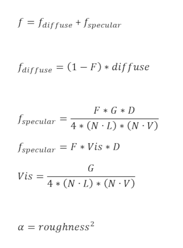

Below are common implementations for the various terms found in the lighting equation.

### Surface Reflection Ratio (F)

**Fresnel Schlick**

Simplified implementation of Fresnel from [An Inexpensive BRDF Model for Physically based Rendering](https://www.cs.virginia.edu/~jdl/bib/appearance/analytic%20models/schlick94b.pdf) by Christophe Schlick.

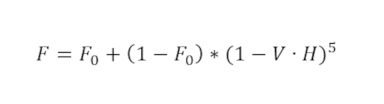

### Geometric Occlusion (G)

**Smith Joint GGX**

[Understanding the Masking-Shadowing Function in Microfacet-Based BRDFs](http://jcgt.org/published/0003/02/03/paper.pdf) by Eric Heitz.

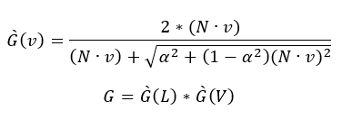

### Microfacet Distribution (D)

**Trowbridge-Reitz**

Implementation of microfacet distrubtion from [Average Irregularity Representation of a Roughened Surface for Ray Reflection](https://www.osapublishing.org/josa/abstract.cfm?uri=josa-65-5-531) by T. S. Trowbridge, and K. P. Reitz

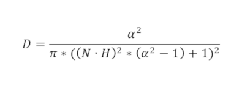

### Diffuse Term (diffuse)

**Lambert**

Implementation of diffuse from [Lambert's Photometria](https://archive.org/details/lambertsphotome00lambgoog) by Johann Heinrich Lambert

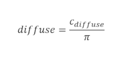

# Appendix C: Spline Interpolation

Animations in glTF support spline interpolation with a cubic spline.

The keyframes of a cubic spline in glTF have input and output values where each input value corresponds to three output values of the same type: in-tangent, data point, and out-tangent.

Given a set of keyframes

&nbsp;&nbsp;&nbsp;&nbsp;Input *t*<sub>*k*</sub> with Output in-tangent ***a***<sub>k</sub>, point ***v***<sub>*k*</sub>, and out-tangent ***b***<sub>k</sub> for *k* = 1,...,*n*

a spline segment between two keyframes is represented in a cubic Hermite spline form:

&nbsp;&nbsp;&nbsp;&nbsp;***p***(*t*) = (2*t*<sup>3</sup> - 3*t*<sup>2</sup> + 1)***p***<sub>0</sub> + (*t<sup>3</sup>* - 2*t*<sup>2</sup> + *t*)***m***<sub>0</sub> + (-2*t*<sup>3</sup> + 3*t*<sup>2</sup>)***p***<sub>1</sub> + (*t*<sup>3</sup> - *t*<sup>2</sup>)***m***<sub>1</sub>

where

&nbsp;&nbsp;&nbsp;&nbsp;*t* is a value between 0 and 1  
&nbsp;&nbsp;&nbsp;&nbsp;***p***<sub>0</sub> is the starting point at *t* = 0  
&nbsp;&nbsp;&nbsp;&nbsp;***m***<sub>0</sub> is the scaled starting tangent at *t* = 0  
&nbsp;&nbsp;&nbsp;&nbsp;***p***<sub>1</sub> is the ending point at *t* = 1  
&nbsp;&nbsp;&nbsp;&nbsp;***m***<sub>1</sub> is the scaled ending tangent at *t* = 1  
&nbsp;&nbsp;&nbsp;&nbsp;***p***(*t*) is the resulting point value  

and where at input offset *t*<sub>*current*</sub> with keyframe index *k*

&nbsp;&nbsp;&nbsp;&nbsp;*t* = (*t*<sub>*current*</sub> - *t*<sub>*k*</sub>) / (*t*<sub>*k*+1</sub> - *t*<sub>*k*</sub>)  
&nbsp;&nbsp;&nbsp;&nbsp;***p***<sub>0</sub> = ***v***<sub>*k*</sub>  
&nbsp;&nbsp;&nbsp;&nbsp;***m***<sub>0</sub> = (*t*<sub>*k*+1</sub> - *t*<sub>*k*</sub>)***b***<sub>k</sub>  
&nbsp;&nbsp;&nbsp;&nbsp;***p***<sub>1</sub> = ***v***<sub>*k*+1</sub>  
&nbsp;&nbsp;&nbsp;&nbsp;***m***<sub>1</sub> = (*t*<sub>*k*+1</sub> - *t*<sub>*k*</sub>)***a***<sub>k+1</sub>  

The scalar-point multiplications are per point component.

When the sampler targets a node's rotation property, the resulting ***p***(*t*) quaternion must be normalized before applying the result to the node's rotation.

> **Implementation Note:** When writing out rotation output values, exporters should take care to not write out values which can result in an invalid quaternion with all zero values. This can be achieved by ensuring the output values never have both -***q*** and ***q*** in the same spline.

> **Implementation Note:** The first in-tangent ***a***<sub>1</sub> and last out-tangent ***b***<sub>*n*</sub> should be zeros as they are not used in the spline calculations.

# Appendix D: Full Khronos Copyright Statement

Copyright 2013-2017 The Khronos Group Inc. 

Some parts of this Specification are purely informative and do not define requirements
necessary for compliance and so are outside the Scope of this Specification. These
parts of the Specification are marked as being non-normative, or identified as 
**Implementation Notes**.
 
Where this Specification includes normative references to external documents, only the
specifically identified sections and functionality of those external documents are in
Scope. Requirements defined by external documents not created by Khronos may contain
contributions from non-members of Khronos not covered by the Khronos Intellectual
Property Rights Policy.

This specification is protected by copyright laws and contains material proprietary 
to Khronos. Except as described by these terms, it or any components 
may not be reproduced, republished, distributed, transmitted, displayed, broadcast 
or otherwise exploited in any manner without the express prior written permission 
of Khronos. 

This specification has been created under the Khronos Intellectual Property Rights 
Policy, which is Attachment A of the Khronos Group Membership Agreement available at
www.khronos.org/files/member_agreement.pdf. Khronos grants a conditional 
copyright license to use and reproduce the unmodified specification for any purpose, 
without fee or royalty, EXCEPT no licenses to any patent, trademark or other 
intellectual property rights are granted under these terms. Parties desiring to 
implement the specification and make use of Khronos trademarks in relation to that 
implementation, and receive reciprocal patent license protection under the Khronos 
IP Policy must become Adopters and confirm the implementation as conformant under 
the process defined by Khronos for this specification; 
see https://www.khronos.org/adopters.

Khronos makes no, and expressly disclaims any, representations or warranties, 
express or implied, regarding this specification, including, without limitation: 
merchantability, fitness for a particular purpose, non-infringement of any 
intellectual property, correctness, accuracy, completeness, timeliness, and 
reliability. Under no circumstances will Khronos, or any of its Promoters, 
Contributors or Members, or their respective partners, officers, directors, 
employees, agents or representatives be liable for any damages, whether direct, 
indirect, special or consequential damages for lost revenues, lost profits, or 
otherwise, arising from or in connection with these materials.

Vulkan is a registered trademark and Khronos, OpenXR, SPIR, SPIR-V, SYCL, WebGL, 
WebCL, OpenVX, OpenVG, EGL, COLLADA, glTF, NNEF, OpenKODE, OpenKCAM, StreamInput, 
OpenWF, OpenSL ES, OpenMAX, OpenMAX AL, OpenMAX IL, OpenMAX DL, OpenML and DevU are 
trademarks of The Khronos Group Inc. ASTC is a trademark of ARM Holdings PLC, 
OpenCL is a trademark of Apple Inc. and OpenGL and OpenML are registered trademarks 
and the OpenGL ES and OpenGL SC logos are trademarks of Silicon Graphics 
International used under license by Khronos. All other product names, trademarks, 
and/or company names are used solely for identification and belong to their 
respective owners.
