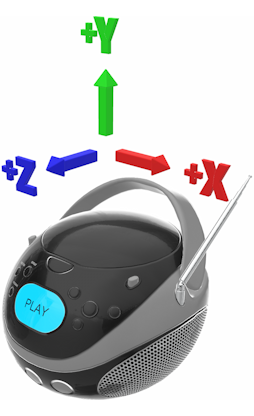

// Copyright (c) 2013-2021 Khronos Group.
//
// SPDX-License-Identifier: CC-BY-4.0

// :regtitle: is explained in
// https://discuss.asciidoctor.org/How-to-add-markup-to-author-information-in-document-title-td6488.html
= glTF{tmtitle} 2.0 Specification
:tmtitle: pass:q,r[^™^]
:regtitle: pass:q,r[^®^]
The Khronos{regtitle} 3D Formats Working Group
Version 2.0.0
:data-uri:
:icons: font
:toc2:
:toclevels: 10
:sectnumlevels: 10
:max-width: 100%
:numbered:
:source-highlighter: coderay
:title-logo-image: image:../figures/gltf.png[Logo,pdfwidth=4in,align=right]
:stem:

// This causes cross references to chapters, sections, and tables to be
// rendered as "Section A.B" (for example) rather than rendering the reference
// as the text of the section title.  It also enables cross references to
// [source] blocks as "Listing N", but only if the [source] block has a title.
:xrefstyle: short
:listing-caption: Listing

// Table of contents is inserted here
toc::[]

:leveloffset: 1

[[copyright-statement]]
= Copyright Statement

Copyright 2013-2021 The Khronos Group Inc.

Some parts of this Specification are purely informative and do not define requirements
necessary for compliance and so are outside the Scope of this Specification. These
parts of the Specification are marked as being non-normative, or identified as
*Implementation Notes*.

Where this Specification includes normative references to external documents, only the
specifically identified sections and functionality of those external documents are in
Scope. Requirements defined by external documents not created by Khronos may contain
contributions from non-members of Khronos not covered by the Khronos Intellectual
Property Rights Policy.

This specification is protected by copyright laws and contains material proprietary
to Khronos. Except as described by these terms, it or any components
may not be reproduced, republished, distributed, transmitted, displayed, broadcast
or otherwise exploited in any manner without the express prior written permission
of Khronos.

This specification has been created under the Khronos Intellectual Property Rights
Policy, which is Attachment A of the Khronos Group Membership Agreement available at
https://www.khronos.org/files/member_agreement.pdf. Khronos grants a conditional
copyright license to use and reproduce the unmodified specification for any purpose,
without fee or royalty, EXCEPT no licenses to any patent, trademark or other
intellectual property rights are granted under these terms. Parties desiring to
implement the specification and make use of Khronos trademarks in relation to that
implementation, and receive reciprocal patent license protection under the Khronos
IP Policy must become Adopters and confirm the implementation as conformant under
the process defined by Khronos for this specification;
see https://www.khronos.org/adopters.

Khronos makes no, and expressly disclaims any, representations or warranties,
express or implied, regarding this specification, including, without limitation:
merchantability, fitness for a particular purpose, non-infringement of any
intellectual property, correctness, accuracy, completeness, timeliness, and
reliability. Under no circumstances will Khronos, or any of its Promoters,
Contributors or Members, or their respective partners, officers, directors,
employees, agents or representatives be liable for any damages, whether direct,
indirect, special or consequential damages for lost revenues, lost profits, or
otherwise, arising from or in connection with these materials.

Khronos® and Vulkan® are registered trademarks, and ANARI™, WebGL™, glTF™, NNEF™, OpenVX™,
SPIR™, SPIR-V™, SYCL™, OpenVG™ and 3D Commerce™ are trademarks of The Khronos Group Inc.
OpenXR™ is a trademark owned by The Khronos Group Inc. and is registered as a trademark in
China, the European Union, Japan and the United Kingdom. OpenCL™ is a trademark of Apple Inc.
and OpenGL® is a registered trademark and the OpenGL ES™ and OpenGL SC™ logos are trademarks
of Hewlett Packard Enterprise used under license by Khronos. ASTC is a trademark of
ARM Holdings PLC. All other product names, trademarks, and/or company names are used solely
for identification and belong to their respective owners.

[[introduction]]
= Introduction

[[introduction-general]]
== General

This document, referred to as the "`glTF Specification`" or just the "`Specification`" hereafter, describes the glTF file format.

glTF is an API-neutral runtime asset delivery format.  glTF bridges the gap between 3D content creation tools and modern graphics applications by providing an efficient, extensible, interoperable format for the transmission and loading of 3D content.

[[introduction-conventions]]
== Document Conventions

The glTF Specification is intended for use by both implementors of the asset exporters or converters (e.g. digital content creation tools) and application developers seeking to import or load glTF assets, forming a contract between these parties.

Specification text may address either party; typically the intended audience can be inferred from context, though some sections are defined to address only one of these parties.

Any requirements, prohibitions, recommendations or options defined by <<introduction-normative-terminology, normative terminology>> are imposed only on the audience of that text.

[[introduction-informative-language]]
=== Informative Language

Some language in the specification is purely informative, intended to give background or suggestions to implementors or developers.

If an entire chapter or section contains only informative language, its title is suffixed with "`(Informative)`".

All NOTEs are implicitly informative.

[[introduction-normative-terminology]]
=== Normative Terminology

The key words **MUST**, **MUST NOT**, **REQUIRED**, **SHALL**, **SHALL NOT**, **SHOULD**, **SHOULD NOT**, **RECOMMENDED**,  **MAY**, and **OPTIONAL** in this document are to be interpreted as described in <<bcp14,BCP 14>>.

These key words are highlighted in the specification for clarity.

Unless otherwise noted in the section heading, all sections and appendices in this document are normative.

[[introduction-technical-terminology]]
=== Technical Terminology

The glTF Specification makes use of common engineering and graphics terms such as *Vertex*, *Normal*, *Texture*, etc. to identify and describe certain GPU constructs and their attributes, states, and behaviors.

[[introduction-normative-references]]
=== Normative References

References to external documents are considered normative references if the Specification uses any of the normative terms defined in <<introduction-normative-terminology>> to refer to them or their requirements, either as a whole or in part.

The following documents are referenced by normative sections of the specification:

==== External Specifications

* [[bcp14]]
Bradner, S., _Key words for use in RFCs to Indicate Requirement Levels_, BCP 14, RFC 2119, March 1997. Leiba, B., _Ambiguity of Uppercase vs Lowercase in RFC 2119 Key Words_, BCP 14, RFC 8174, May 2017.
<https://www.rfc-editor.org/info/bcp14>

* [[utf8]]
The Unicode Consortium, _The Unicode Standard_
<https://www.unicode.org/versions/latest/>

* [[json]]
Bray, T., Ed., _The JavaScript Object Notation (JSON) Data Interchange Format_, STD 90, RFC 8259, DOI 10.17487/RFC8259, December 2017, <https://www.rfc-editor.org/info/rfc8259>

* [[ieee-754]]
ISO/IEC 60559:2020
_Floating-point arithmetic_
<https://www.iso.org/standard/80985.html>

* [[png]]
ISO/IEC 15948:2004
_Portable Network Graphics (PNG): Functional specification_
<https://www.iso.org/standard/29581.html>
+
[NOTE]
.Note
====
A free version of this standard is available from W3C: https://www.w3.org/TR/PNG/
====

* [[jpeg]]
ISO/IEC 10918-1:1994
_Digital compression and coding of continuous-tone still images: Requirements and guidelines_
<https://www.iso.org/standard/18902.html>
+
[NOTE]
.Note
====
An earlier edition of this standard called ITU Recommendation T.81 is available from W3C: https://www.w3.org/Graphics/JPEG/itu-t81.pdf
====

* [[jfif]]
ISO/IEC 10918-5:2013
_Digital compression and coding of continuous-tone still images: JPEG File Interchange Format (JFIF)_
<https://www.iso.org/standard/54989.html>
+
[NOTE]
.Note
====
An earlier edition of this standard is available from W3C: https://www.w3.org/Graphics/JPEG/jfif3.pdf
====

* [[exif]]
CIPA DC-008-Translation-2019
_Exchangeable image file format for digital still cameras_
<https://www.cipa.jp/std/documents/download_e.html?DC-008-Translation-2019-E>

* [[data-uri]]
Masinter, L., _The "data" URL scheme_, RFC 2397, DOI 10.17487/RFC2397, August 1998, <https://www.rfc-editor.org/info/rfc2397>

* [[uri]]
Berners-Lee, T., Fielding, R., and L. Masinter, _Uniform Resource Identifier (URI): Generic Syntax_, STD 66, RFC 3986, DOI 10.17487/RFC3986, January 2005, <https://www.rfc-editor.org/info/rfc3986>

* [[iri]]
Duerst, M. and M. Suignard, _Internationalized Resource Identifiers (IRIs)_, RFC 3987, DOI 10.17487/RFC3987, January 2005, <https://www.rfc-editor.org/info/rfc3987>

* [[http]]
Fielding, R., Ed., and J. Reschke, Ed., _Hypertext Transfer Protocol (HTTP/1.1): Message Syntax and Routing_, RFC 7230, DOI 10.17487/RFC7230, June 2014, <https://www.rfc-editor.org/info/rfc7230>

* [[srgb]]
IEC 61966-2-1:1999
_Default RGB colour space - sRGB_
https://webstore.iec.ch/publication/6169
+
[NOTE]
.Note
====
The encoding characteristics of sRGB are freely available from ICC: https://www.color.org/chardata/rgb/srgb.xalter
====

* [[bt709]]
Recommendation ITU-R BT.709-6 _Parameter values for the HDTV standards for production and international programme exchange_
https://www.itu.int/rec/R-REC-BT.709-6-201506-I

* [[mikktspace]]
_MikkTSpace_
https://github.com/mmikk/MikkTSpace

* [[compositing]]
Thomas Porter and Tom Duff. 1984. _Compositing digital images._ SIGGRAPH Comput. Graph. 18, 3 (July 1984), 253–259. DOI: https://doi.org/10.1145/964965.808606
+
[NOTE]
.Note
====
A free version of this paper is available from Pixar: https://graphics.pixar.com/library/Compositing/
====

==== Media Type Registrations

* [[gltf-json]]
IANA.
_model/gltf+json Media Type_.
https://www.iana.org/assignments/media-types/model/gltf+json

* [[gltf-binary]]
IANA.
_model/gltf-binary Media Type_.
https://www.iana.org/assignments/media-types/model/gltf-binary

* [[gltf-buffer]]
IANA.
_application/gltf-buffer Media Type_.
https://www.iana.org/assignments/media-types/application/gltf-buffer

* [[octet-stream]]
IANA.
_application/octet-stream Media Type_.
https://www.iana.org/assignments/media-types/application/octet-stream

* [[image-jpeg]]
Freed, N. and N. Borenstein, _Multipurpose Internet Mail Extensions (MIME) Part Two: Media Types_, RFC 2046, DOI 10.17487/RFC2046, November 1996, <https://www.rfc-editor.org/info/rfc2046>

* [[image-png]]
IANA.
_image/png Media Type_.
https://www.iana.org/assignments/media-types/image/png

[[motivation]]
== Motivation (Informative)

Traditional 3D modeling formats have been designed to store data for offline use, primarily to support authoring workflows on desktop systems. Industry-standard 3D interchange formats allow for sharing assets between different modeling tools, and within the content pipeline in general. However, neither of these types of formats is optimized for download speed or fast loading at runtime. Files tend to grow very large, and applications need to do a significant amount of processing to load such assets into GPU-accelerated applications.

Applications seeking high performance rarely load modeling formats directly; instead, they process models offline as part of a custom content pipeline, converting the assets into a proprietary format optimized for their runtime application.  This has led to a fragmented market of incompatible proprietary runtime formats and duplicated efforts in the content creation pipeline. 3D assets exported for one application cannot be reused in another application without going back to the original modeling, tool-specific source and performing another proprietary export step.

With the advent of mobile- and web-based 3D computing, new classes of applications have emerged that require fast, dynamic loading of standardized 3D assets. Digital marketing solutions, e-commerce product visualizations, and online model-sharing sites are just a few of the connected 3D applications being built today using GPU APIs. Beyond the need for efficient delivery, many of these online applications can benefit from a standard, interoperable format to enable sharing and reuse of assets between users, between applications, and within heterogeneous, distributed content pipelines.

glTF solves these problems by providing a vendor- and runtime-neutral format that can be loaded and rendered with minimal processing. The format combines an easily parsable JSON scene description with one or more binary resources representing geometry, animations, and other rich data. Binary data is stored in such a way that it can be in most cases loaded directly into GPU buffers without additional parsing or other manipulation. Using this approach, glTF is able to faithfully preserve full hierarchical scenes with nodes, meshes, cameras, materials, and animations, while enabling efficient delivery and fast loading.

[[gltf-basics]]
== glTF Basics

A glTF asset is represented by:

* A JSON-formatted file (`.gltf`) containing a full scene description: node hierarchy, materials, cameras, as well as descriptor information for meshes, animations, and other constructs.
* Binary files (`.bin`) containing geometry, animation, and other buffer-based data.
* Image files (`.jpg`, `.png`) containing texture images.

Binary and image resources **MAY** also be embedded directly in JSON using <<data-uri,Data URI>> or stored side-by-side with JSON in <<glb-file-format-specification,GLB>> container.

A valid glTF asset **MUST** specify its version.

image:figures/files.png[pdfwidth=4in,align=left]

[[design-goals]]
== Design Goals (Informative)

glTF has been designed to meet the following goals:

* *Compact file sizes.* While web developers like to work with clear text as much as possible, clear text encoding is simply not practical for transmitting 3D data due to sheer size. The glTF JSON file itself is clear text, but it is compact and rapid to parse. All large data such as geometry and animations are stored in binary files that are much smaller than equivalent text representations.
* *Fast loading.* glTF data structures have been designed to mirror the GPU API data as closely as possible, both in the JSON and binary files, to reduce load times. For example, binary data for meshes could be viewed as JavaScript Typed Arrays and be loaded directly into GPU buffers with a simple data copy; no parsing or further processing is required.
* *Runtime-independence.* glTF makes no assumptions about the target application or 3D engine. glTF specifies no runtime behaviors other than rendering and animation.
* *Complete 3D scene representation.* Exporting single objects from a modeling package is not sufficient for many applications. Often, authors want to load entire scenes, including nodes, transformations, transform hierarchy, meshes, materials, cameras, and animations into their applications. glTF strives to preserve all of this information for use in the downstream application.
* *Extensibility.* While the initial base specification supports a rich feature set, there will be many opportunities for growth and improvement. glTF defines a mechanism that allows the addition of both general-purpose and vendor-specific extensions.

The design of glTF takes a pragmatic approach. The format is meant to mirror the GPU APIs as closely as possible, but if it did only that, there would be no cameras, animations, or other features typically found in both modeling tools and runtime systems, and much semantic information would be lost in the translation. By supporting these common constructs, glTF content can not only load and render, but it can be immediately usable in a wider range of applications and require less duplication of effort in the content pipeline.

The following are outside the scope of the initial design of glTF:

* *glTF is not a streaming format.* The binary data in glTF is inherently streamable, and the buffer design allows for fetching data incrementally. But there are no other streaming constructs in the format, and no conformance requirements for an implementation to stream data versus downloading it in its entirety before rendering.
* *glTF is not intended to be human-readable,* though by virtue of being represented in JSON, it is developer-friendly.

While version 2.0 of glTF does not define compression for geometry and other rich data, there are extensions providing such options.

* https://github.com/KhronosGroup/glTF/blob/master/extensions/2.0/Khronos/KHR_draco_mesh_compression/README.md[KHR_draco_mesh_compression] for geometry.
* https://github.com/KhronosGroup/glTF/blob/master/extensions/2.0/Khronos/KHR_texture_basisu/README.md[KHR_texture_basisu] for GPU-compatible block-compressed textures.

Future extensions may include more compression methods including those for animation data.

[[versioning]]
== Versioning (Informative)

This section is marked as informative as there is no binding responsibility on implementations of the glTF — these guarantees are however a contract between the 3D Formats Working Group and developers using this Specification.

Any updates made to glTF in a minor version must be backwards and forwards compatible. Backwards compatibility means that any client implementation that supports loading a glTF 2.x asset will also be able to load a glTF 2.0 asset. Forwards compatibility means that a client implementation that only supports glTF 2.0 is able to load glTF 2.x assets while gracefully ignoring any new features it does not understand.

A minor version update may introduce new features but must not change any previously existing behavior. Existing functionality may be deprecated in a minor version update, but it must not be removed.

Major version updates may be incompatible with previous versions.

[[file-extensions-and-media-types]]
== File Extensions and Media Types

* <<json,JSON>> glTF files **SHOULD** use `.gltf` extension and <<gltf-json,`model/gltf+json`>> Media Type.
* glTF files stored in <<glb-file-format-specification,GLB>> container **SHOULD** use `.glb` extension and <<gltf-binary,`model/gltf-binary`>> Media Type.
* Files representing binary buffers **SHOULD** use either:
** `.bin` file extension with <<octet-stream,`application/octet-stream`>> Media Type;
** `.bin`, `.glbin`, or `.glbuf` file extensions with <<gltf-buffer,`application/gltf-buffer`>> Media Type.

* <<png,PNG>> images **SHOULD** use `.png` file extension with <<image-png,`image/png`>> Media Type;
** PNG images **SHOULD NOT** contain animations, non-square pixel ratios, or embedded ICC profiles. Such features, if present, **MUST** be ignored by client implementations.

* <<jpeg,JPEG>> images **SHOULD** use `.jpeg` or `.jpg` file extensions with <<image-jpeg,`image/jpeg`>> Media Type
** JPEG images **MUST** be compatible with <<jfif,JPEG File Interchange Format>>.
** JPEG images **SHOULD NOT** contain embedded ICC profiles. If present, embedded ICC profiles **MUST** be ignored by client implementations.
** <<exif,Exchangeable image file format (Exif)>> chunks **MAY** be ignored by client implementations.
+
[NOTE]
.Implementation Note
====
Certain Exif chunks, e.g. "`Orientation`", may severely impact asset's portability.
====

[[json-encoding]]
== JSON Encoding

Although glTF Specification does not define any subset of the <<json,JSON>> format, implementations **SHOULD** be aware of its peculiar properties that could affect asset interoperability.

1. glTF JSON data **SHOULD** be written with UTF-8 encoding without BOM. This requirement is not applied when a glTF implementation does not control string encoding. glTF implementations **SHOULD** adhere to <<json,RFC 8259>>, Section 8.1. with regards to treating BOM presence.

2. ASCII characters stored in glTF JSON **SHOULD** be written without JSON escaping.
+
[NOTE]
.Example
====
`"buffer"` instead of `"\u0062\u0075\u0066\u0066\u0065\u0072"`.
====

3. Non-ASCII characters stored in glTF JSON **MAY** be escaped.
+
[NOTE]
.Example
====
These two examples represent the same glTF JSON data.

[source,json]
-----
{
    "asset": {
        "version": "2.0"
    },
    "nodes": [
        {
            "name": "куб"
        },
        {
            "name": "立方體"
        }
    ]
}
-----

[source,json]
-----
{
    "asset": {
        "version": "2.0"
    },
    "nodes": [
        {
            "name": "\u043a\u0443\u0431"
        },
        {
            "name": "\u7acb\u65b9\u9ad4"
        }
    ]
}
-----

====

4. Property names (keys) within JSON objects **SHOULD** be unique. glTF client implementations **SHOULD** override lexically preceding values for the same key.

5. Some of glTF properties are defined as integers in the schema. Such values **MAY** be stored as decimals with a zero fractional part or by using exponent notation. Regardless of encoding, such properties **MUST NOT** contain any non-zero fractional value.
+
[NOTE]
.Example
====
`100`, `100.0`, and `1e2` represent the same value. See <<json,RFC 8259>>, Section 6 for more details.
====

6. Non-integer numbers **SHOULD** be written in a way that preserves original values when these numbers are read back, i.e. they **SHOULD NOT** be altered by JSON serialization / deserialization roundtrip.
+
[NOTE]
.Implementation Note
====
This is typically achieved with algorithms like Grisu2 used by common JSON libraries.
====

[[uris]]
== URIs

glTF assets use <<uri,URIs>> or <<iri,IRIs>> to reference buffers and image resources. Assets **MAY** contain at least these two URI types:

- **Data URIs** that embed binary resources in the glTF JSON as defined by the <<data-uri,RFC 2397>>. The Data URI's `mediatype` field **MUST** match the encoded content.
+
[NOTE]
.Implementation Note
====
Base64 encoding used in Data URI increases the payload's byte length by 33%.
====

- **Relative paths** -- `path-noscheme` or `ipath-noscheme` as defined by <<uri,RFC 3986>>, Section 4.2 or <<iri,RFC 3987>>, Section 2.2 -- without scheme, authority, or parameters. Reserved characters (as defined by <<uri,RFC 3986>>, Section 2.2. and <<iri,RFC 3987>>, Section 2.2.) **MUST** be percent-encoded.

Client implementations **MAY** optionally support additional URI components. For example `http://` or `file://` schemes, authorities, hostnames, absolute paths, and query or fragment parameters. Assets containing these additional URI components would be less portable.

[NOTE]
.Implementation Note
====
This allows the application to decide the best approach for delivery: if different assets share many of the same geometries, animations, or textures, separate files may be preferred to reduce the total amount of data requested. With separate files, applications may progressively load data and do not need to load data for parts of a model that are not visible. If an application cares more about single-file deployment, embedding data may be preferred even though it increases the overall size due to base64 encoding and does not support progressive or on-demand loading. Alternatively, an asset could use GLB container to store JSON and binary data in one file without base64 encoding. See <<glb-file-format-specification,GLB File Format Specification>> for details.
====

URIs **SHOULD** undergo syntax-based normalization as defined by <<uri,RFC 3986>>, Section 6.2.2, <<iri,RFC 3987>>, Section 5.3.2, and applicable schema rules (e.g., <<http,RFC 7230>>, Section 2.7.3 for HTTP) on export and/or import.

[NOTE]
.Implementation Note
====
While the specification does not explicitly disallow non-normalized URIs, their use may be unsupported or lead to unwanted side-effects -- such as security warnings or cache misses -- on some platforms.
====

[[concepts]]
= Concepts

[[concepts-general]]
== General

image:figures/dictionary-objects.png[pdfwidth=4in,align=left]

The image above shows relations between top-level arrays in a glTF asset.  See the <<properties-reference, Properties Reference>>.

[[asset]]
== Asset

Each glTF asset **MUST** have an `asset` property. The `asset` object **MUST** contain a `version` property which specifies the target glTF version of the asset. Additionally, an optional `minVersion` property **MAY** be used to specify the minimum glTF version support required to load the asset. The `minVersion` property allows asset creators to specify a minimum version that a client implementation **MUST** support in order to load the asset. This is very similar to the `extensionsRequired` concept described in <<specifying-extensions>>, where an asset **SHOULD NOT** be loaded if the client does not support the specified extension. Additional metadata **MAY** be stored in optional properties such as `generator` or `copyright`.  For example,

[source,json]
----
{
    "asset": {
        "version": "2.0",
        "generator": "collada2gltf@f356b99aef8868f74877c7ca545f2cd206b9d3b7",
        "copyright": "2017 (c) Khronos Group"
    }
}
----

[NOTE]
.Implementation Note
====
Client implementations should first check whether a `minVersion` property is specified and ensure both major and minor versions can be supported. If no `minVersion` is specified, then clients should check the `version` property and ensure the major version is supported. Clients that load <<glb-file-format-specification,GLB format>> should also check for the `minVersion` and `version` properties in the JSON chunk as the version specified in the GLB header only refers to the GLB container version.
====

[[indices-and-names]]
== Indices and Names

Entities of a glTF asset are referenced by their indices in corresponding arrays, e.g., a `bufferView` refers to a `buffer` by specifying the buffer's index in `buffers` array.  For example:

[source,json]
----
{
    "buffers": [
        {
            "byteLength": 1024,
            "uri": "path-to.bin"
        }
    ],
    "bufferViews": [
        {
            "buffer": 0,
            "byteLength": 512,
            "byteOffset": 0
        }
    ]
}
----

In this example, `buffers` and `bufferViews` arrays have only one element each. The bufferView refers to the buffer using the buffer's index: `"buffer": 0`.

Indices **MUST** be non-negative integer numbers. Indices **MUST** always point to existing elements.

Whereas indices are used for internal glTF references, optional _names_ are used for application-specific uses such as display. Any top-level glTF object **MAY** have a `name` string property for this purpose. These property values are not guaranteed to be unique as they are intended to contain values created when the asset was authored.

For property names, glTF usually uses camel case, `likeThis`.

[[coordinate-system-and-units]]
== Coordinate System and Units

glTF uses a right-handed coordinate system. glTF defines +Y as up, -X as right, the front of a glTF asset faces +Z.

The units for all linear distances are meters.

All angles are in radians.

Positive rotation is counterclockwise.

Red, Green, and Blue primary colors use <<bt709,Recommendation ITU-R BT.709>> chromaticity coordinates.

[NOTE]
.Implementation Note
====
Chromaticity coordinates define the interpretation of each primary color channel of the color model. In the context of a typical display, color primaries describe the color of the red, green and blue phosphors or filters. Unless a wide color gamut output is explicitly used, client implementations usually do not need to convert colors. Future specification versions or extensions may allow other color primaries (such as P3).
====

[[scenes]]
== Scenes

[[scenes-overview]]
=== Overview

glTF 2.0 assets **MAY** contain zero or more _scenes_, the set of visual objects to render. Scenes are defined in a `scenes` array. All nodes listed in `scene.nodes` array **MUST** be root nodes (see the next section for details).

An additional root-level property, `scene` (note singular), identifies which of the scenes in the array **SHOULD** be displayed at load time. When `scene` is undefined, client implementations **MAY** delay rendering until a particular scene is requested.

A glTF asset that does not contain any scenes **SHOULD** be treated as a library of individual entities such as materials or meshes.

The following example defines a glTF asset with a single scene, that contains a single node.

[source,json]
----
{
    "nodes": [
        {
            "name": "singleNode"
        }
    ],
    "scenes": [
        {
            "name": "singleScene",
            "nodes": [
                0
            ]
        }
    ],
    "scene": 0
}
----

[[nodes-and-hierarchy]]
=== Nodes and Hierarchy

glTF assets **MAY** define _nodes_, that is, the objects comprising the scene to render.

Nodes **MAY** have transform properties, as described later.

Nodes are organized in a parent-child hierarchy known informally as the _node hierarchy_. A node is called a _root node_ when it doesn't have a parent.

The node hierarchy **MUST** be a set of disjoint strict trees. That is node hierarchy **MUST NOT** contain cycles and each node **MUST** have zero or one parent node.

The node hierarchy is defined using a node's `children` property, as in the following example:

[source,json]
----
{
    "nodes": [
        {
            "name": "Car",
            "children": [1, 2, 3, 4]
        },
        {
            "name": "wheel_1"
        },
        {
            "name": "wheel_2"
        },
        {
            "name": "wheel_3"
        },
        {
            "name": "wheel_4"
        }
    ]
}
----

The node named `Car` has four children. Each of those nodes could in turn have its own children, creating a hierarchy of nodes.

[[transformations]]
=== Transformations

Any node **MAY** define a local space transformation either by supplying a `matrix` property, or any of `translation`, `rotation`, and `scale`  properties (also known as _TRS properties_). `translation` and `scale` are 3D vectors in the local coordinate system. `rotation` is a unit quaternion value, XYZW, in the local coordinate system, where W is the scalar.

When `matrix` is defined, it **MUST** be decomposable to TRS properties.
[NOTE]
.Implementation Note
====
Transformation matrices cannot skew or shear.
====

When a node is targeted for animation (referenced by an `animation.channel.target`), only TRS properties **MAY** be present; `matrix` **MUST NOT** be present.

To compose the local transformation matrix, TRS properties **MUST** be converted to matrices and postmultiplied in the `T * R * S` order; first the scale is applied to the vertices, then the rotation, and then the translation.

[NOTE]
.Implementation Note
====
Non-invertible transformations (e.g., scaling one axis to zero) could lead to lighting and/or visibility artifacts.
====

In the example below, node named `Box` defines non-default rotation and translation.

[source,json]
----
{
    "nodes": [
        {
            "name": "Box",
            "rotation": [
                0,
                0,
                0,
                1
            ],
            "scale": [
                1,
                1,
                1
            ],
            "translation": [
                -17.7082,
                -11.4156,
                2.0922
            ]
        }
    ]
}
----

The next example defines the transformation for a node with attached camera using the `matrix` property rather than using the individual TRS values:

[source,json]
----
{
    "nodes": [
        {
            "name": "node-camera",
            "camera": 1,
            "matrix": [
                -0.99975,
                -0.00679829,
                0.0213218,
                0,
                0.00167596,
                0.927325,
                0.374254,
                0,
                -0.0223165,
                0.374196,
                -0.927081,
                0,
                -0.0115543,
                0.194711,
                -0.478297,
                1
            ]
        }
    ]
}
----

[[binary-data-storage]]
== Binary Data Storage

[[buffers-and-buffer-views]]
=== Buffers and Buffer Views

[[buffers-and-buffer-views-overview]]
==== Overview

A *buffer* is arbitrary data stored as a binary blob. The buffer **MAY** contain any combination of geometry, animation, skins, and images.

Binary blobs allow efficient creation of GPU buffers and textures since they require no additional parsing, except perhaps decompression.

glTF assets **MAY** have any number of buffer resources. Buffers are defined in the asset's `buffers` array.

While there's no hard upper limit on buffer's size, glTF assets **SHOULD NOT** use buffers bigger than 2^53^ bytes because some JSON parsers may be unable to parse their `byteLength` correctly. Buffers stored as <<glb-file-format-specification,GLB>> binary chunk have an implicit limit of 2^32^-1 bytes.

All buffer data defined in this specification (i.e. geometry attributes, geometry indices, sparse accessor data, animation inputs and outputs, inverse bind matrices) **MUST** use little endian byte order.

The following example defines a buffer. The `byteLength` property specifies the size of the buffer file. The `uri` property is the URI to the buffer data.
[source,json]
----
{
   "buffers": [
       {
           "byteLength": 102040,
           "uri": "duck.bin"
       }
   ]
}
----

The byte length of the referenced resource **MUST** be greater than or equal to the `buffer.byteLength` property.

Buffer data **MAY** alternatively be embedded in the glTF file via `data:` URI with base64 encoding. When `data:` URI is used for buffer storage, its `mediatype` field **MUST** be set to `application/octet-stream` or `application/gltf-buffer`.

A _buffer view_ represents a contiguous segment of data in a buffer, defined by a byte offset into the buffer specified in the `byteOffset` property and a total byte length specified by the `byteLength` property of the buffer view.

Buffer views used for images, vertex indices, vertex attributes, or inverse bind matrices **MUST** contain only one kind of data, i.e. the same buffer view **MUST NOT** be used both for vertex indices and vertex attributes.

When a buffer view is used by vertex indices or attribute accessors it **SHOULD** specify `bufferView.target` with a value of _element array buffer_ or _array buffer_ respectively.

[NOTE]
.Implementation Note
====
This allows client implementations to early designate each buffer view to a proper processing step, e.g, buffer views with vertex indices and attributes would be copied to the appropriate GPU buffers, while buffer views with image data would be passed to format-specific image decoders.
====

The following example defines two buffer views: the first holds the indices for an indexed triangle set, and the second holds the vertex data for the triangle set.

[source,json]
----
{
    "bufferViews": [
        {
            "buffer": 0,
            "byteLength": 25272,
            "byteOffset": 0,
            "target": 34963
        },
        {
            "buffer": 0,
            "byteLength": 76768,
            "byteOffset": 25272,
            "byteStride": 32,
            "target": 34962
        }
    ]
}
----

When a buffer view is used for vertex attribute data, it **MAY** have a `byteStride` property. This property defines the stride in bytes between each vertex. Buffer views with other types of data **MUST NOT** not define `byteStride`.

Buffers and buffer views do not contain type information. They simply define the raw data for retrieval from the file. Objects within the glTF asset (meshes, skins, animations) access buffers or buffer views via *accessors*.

[[glb-stored-buffer]]
==== GLB-stored Buffer

glTF asset **MAY** use GLB file container to pack glTF JSON and one glTF buffer into one file. Data for such buffer is provided via GLB-stored `BIN` chunk.

A buffer with data provided by the GLB-stored `BIN` chunk, **MUST** be the first element of `buffers` array and it **MUST** have its `buffer.uri` property undefined.

Any glTF buffer with undefined `buffer.uri` property that is not the first element of `buffers` array does not refer to the GLB-stored BIN chunk, and the behavior of such buffers is left undefined to accommodate future extensions and specification versions.

Byte length of `BIN` chunk **MAY** be up to 3 bytes bigger than JSON-defined `buffer.byteLength` value to satisfy GLB padding requirements.

[NOTE]
.Implementation Note
====
Not requiring strict equality of chunk's and buffer's lengths slightly simplifies glTF to GLB conversion: `buffer.byteLength` does not need to be updated after applying GLB padding.
====

In the following example, the first buffer objects refers to GLB-stored data, while the second points to external resource:

[source,json]
----
{
    "buffers": [
        {
            "byteLength": 35884
        },
        {
            "byteLength": 504,
            "uri": "external.bin"
        }
  ]
}
----

See <<glb-file-format-specification,GLB File Format Specification>> for details on GLB File Format.

[[accessors]]
=== Accessors

[[accessors-overview]]
==== Overview

All binary data for meshes, skins, and animations is stored in buffers and retrieved via accessors.

An _accessor_ defines a method for retrieving data as typed arrays from within a `bufferView`. The accessor specifies a component type (e.g. _float_) and a data type (e.g. `VEC3` for 3D vectors), which when combined define the complete data type for each array element. The accessor also specifies the location and size of the data within the `bufferView` using the properties `byteOffset` and `count`. The latter specifies the number of elements within the `bufferView`, _not_ the number of bytes. Elements could be, e.g., vertex indices, vertex attributes, animation keyframes, etc.

All accessors are stored in the asset's `accessors` array.

The following fragment shows two accessors, the first is a scalar accessor for retrieving a primitive's indices, and the second is a 3-float-component vector accessor for retrieving the primitive's position data.

[source,json]
----
{
    "accessors": [
        {
            "bufferView": 0,
            "byteOffset": 0,
            "componentType": 5123,
            "count": 12636,
            "max": [
                4212
            ],
            "min": [
                0
            ],
            "type": "SCALAR"
        },
        {
            "bufferView": 1,
            "byteOffset": 0,
            "componentType": 5126,
            "count": 2399,
            "max": [
                0.961799,
                1.6397,
                0.539252
            ],
            "min": [
                -0.692985,
                0.0992937,
                -0.613282
            ],
            "type": "VEC3"
        }
    ]
}
----

[[accessor-data-types]]
==== Accessor Data Types

[options="header"]
|====
| `componentType` | Data Type | Signed | Bits
| `5120` | _signed byte_ | Signed, two's complement | 8
| `5121` | _unsigned byte_ | Unsigned | 8
| `5122` | _signed short_ | Signed, two's complement | 16
| `5123` | _unsigned short_ | Unsigned | 16
| `5125` | _unsigned int_ | Unsigned | 32
| `5126` | _float_ | Signed | 32
|====

Signed 32-bit integer components are not supported.

Floating-point data **MUST** use <<ieee-754,IEEE-754>> single precision format.

Values of `NaN`, `+Infinity`, and `-Infinity` **MUST NOT** be present.

[options="header"]
|====
| `type`     | Number of components
| `"SCALAR"` | 1
| `"VEC2"`   | 2
| `"VEC3"`   | 3
| `"VEC4"`   | 4
| `"MAT2"`   | 4
| `"MAT3"`   | 9
| `"MAT4"`   | 16
|====

Element size, in bytes, is
`(size in bytes of the 'componentType') * (number of components defined by 'type')`.

For example:

[source,json]
----
{
    "accessors": [
        {
            "bufferView": 1,
            "byteOffset": 7032,
            "componentType": 5126,
            "count": 585,
            "type": "VEC3"
        }
    ]
}
----

In this accessor, the `componentType` is `5126` (_float_), so each component is four bytes.  The `type` is `"VEC3"`, so there are three components.  The size of each element is 12 bytes (`4 * 3`). Thus the accessor takes 7020 bytes (`[7032 ... 14051]` inclusive range of the buffer view).

[[sparse-accessors]]
==== Sparse Accessors

Sparse encoding of arrays is often more memory-efficient than dense encoding when describing incremental changes with respect to a reference array.
This is often the case when encoding morph targets (it is, in general, more efficient to describe a few displaced vertices in a morph target than transmitting all morph target vertices).

Similarly to a standard accessor, a sparse accessor initializes an array of typed elements from data stored in a `bufferView`. When `accessor.bufferView` is undefined, the sparse accessor is initialized as an array of zeros of size `(size of the accessor element) * (accessor.count)` bytes.

On top of that, a sparse accessor includes a `sparse` JSON object describing the elements that deviate from their initialization values. The `sparse` object contains the following **REQUIRED** properties:

- `count`: number of displaced elements.

- `indices`: object describing the location and the component type of indices of deviating values. The indices **MUST** form a strictly increasing sequence.

- `values`: object describing the location of displaced elements corresponding to the indices referred from the `indices`.

The following fragment shows an example of `sparse` accessor with 10 elements deviating from the initialization array.

[source,json]
----
{
    "accessors": [
        {
            "bufferView": 0,
            "byteOffset": 0,
            "componentType": 5123,
            "count": 12636,
            "type": "VEC3",
            "sparse": {
                "count": 10,
                "indices": {
                    "bufferView": 1,
                    "byteOffset": 0,
                    "componentType": 5123
                },
                "values": {
                    "bufferView": 2,
                    "byteOffset": 0
                }
            }
        }
    ]
}
----

[[data-alignment]]
==== Data Alignment

The offset of an `accessor` into a `bufferView` (i.e., `accessor.byteOffset`) and the offset of an `accessor` into a `buffer` (i.e., `accessor.byteOffset + bufferView.byteOffset`) **MUST** be a multiple of the size of the accessor's component type.

When `byteStride` of the referenced `bufferView` is not defined, it means that accessor elements are tightly packed, i.e., effective stride equals the size of the element. When `byteStride` is defined, it **MUST** be a multiple of the size of the accessor's component type.

When two or more vertex attribute accessors use the same `bufferView`, its `byteStride` **MUST** be defined.

Each accessor **MUST** fit its `bufferView`, i.e.,

[source]
----
accessor.byteOffset + EFFECTIVE_BYTE_STRIDE * (accessor.count - 1) + SIZE_OF_COMPONENT * NUMBER_OF_COMPONENTS
----

**MUST** be less than or equal to `bufferView.length`.

For performance and compatibility reasons, each element of a vertex attribute **MUST** be aligned to 4-byte boundaries inside a `bufferView` (i.e., `accessor.byteOffset` and `bufferView.byteStride` **MUST** be multiples of 4).

Accessors of matrix type have data stored in column-major order; start of each column **MUST** be aligned to 4-byte boundaries. Specifically, when `ROWS * SIZE_OF_COMPONENT` (where `ROWS` is the number of rows of the matrix) is not a multiple of 4, then `(ROWS * SIZE_OF_COMPONENT) % 4` padding bytes **MUST** be inserted at the end of each column.

Only the following three accessor configurations require padding.

*MAT2, 1-byte components*

----
| 00| 01| 02| 03| 04| 05| 06| 07|
|===|===|===|===|===|===|===|===|
|m00|m10|---|---|m01|m11|---|---|
----

*MAT3, 1-byte components*

----
| 00| 01| 02| 03| 04| 05| 06| 07| 08| 09| 0A| 0B|
|===|===|===|===|===|===|===|===|===|===|===|===|
|m00|m10|m20|---|m01|m11|m21|---|m02|m12|m22|---|
----

*MAT3, 2-byte components*

----
| 00| 01| 02| 03| 04| 05| 06| 07| 08| 09| 0A| 0B| 0C| 0D| 0E| 0F| 10| 11| 12| 13| 14| 15| 16| 17|
|===|===|===|===|===|===|===|===|===|===|===|===|===|===|===|===|===|===|===|===|===|===|===|===|
|m00|m00|m10|m10|m20|m20|---|---|m01|m01|m11|m11|m21|m21|---|---|m02|m02|m12|m12|m22|m22|---|---|
----

Alignment requirements apply only to the start of each column, so trailing bytes **MAY** be omitted if there's no further data.

[NOTE]
.Implementation Note
====
Alignment requirements allow client implementations to more efficiently process binary buffers because creating aligned data views usually does not require extra copying.
====

Consider the following example:

[source,json]
----
{
    "bufferViews": [
        {
            "buffer": 0,
            "byteLength": 17136,
            "byteOffset": 620
        }
    ],
    "accessors": [
        {
            "bufferView": 0,
            "byteOffset": 4608,
            "componentType": 5123,
            "count": 42,
            "type": "VEC2"
        }
    ]
}
----

In this example, the accessor describes tightly-packed two-component unsigned short values.

The corresponding segment of the underlying buffer would start from byte 5228
[source]
----
start = accessor.byteOffset + accessor.bufferView.byteOffset
----

and continue until byte 5396 exclusive
[source]
----
end = 2 * 2 * accessor.count + start
----

The unsigned short view for the resulting buffer range could be created without copying: 84 scalar values starting from byte offset 5228.

When accessor values are not tightly-packed (i.e. `bufferView.byteStride` is greater than element's byte length), iteration over the created data view would need to take interleaved values into account (e.g. skip them).

[[accessors-bounds]]
==== Accessors Bounds

`accessor.min` and `accessor.max` properties are arrays that contain per-component minimum and maximum values, respectively. The length of these arrays **MUST** be equal to the number of accessor's components.

Values stored in glTF JSON **MUST** match actual minimum and maximum binary values stored in buffers. The `accessor.normalized` flag has no effect on these properties.

A sparse accessor `min` and `max` properties correspond, respectively, to the minimum and maximum component values once the sparse substitution is applied.

When neither `sparse` nor `bufferView` is defined, `min` and `max` properties **MAY** have any values. This is intended for use cases when binary data is supplied by external means (e.g., via extensions).

For floating-point components, JSON-stored minimum and maximum values represent single precision floats and **SHOULD** be rounded to single precision before usage to avoid any potential boundary mismatches.

[NOTE]
.ECMAScript Implementation Note
====
`Math.fround` function could be used to achieve that.
====

Animation input and vertex position attribute accessors **MUST** have `accessor.min` and `accessor.max` defined. For all other accessors, these properties are optional.

[[geometry]]
== Geometry

[[geometry-overview]]
=== Overview

Any node **MAY** contain one mesh, defined in its `mesh` property. Mesh **MAY** be skinned using an information provided in a referenced `skin` object. Mesh **MAY** have morph targets.

[[meshes]]
=== Meshes

[[meshes-overview]]
==== Overview

Meshes are defined as arrays of _primitives_. Primitives correspond to the data required for GPU draw calls. Primitives specify one or more `attributes`, corresponding to the vertex attributes used in the draw calls. Indexed primitives also define an `indices` property. Attributes and indices are defined as references to accessors containing corresponding data. Each primitive **MAY** also specify a `material` and a `mode` that corresponds to the GPU topology type (e.g., triangle set).

[NOTE]
.Implementation Note
====
Splitting one mesh into several *primitives* could be useful to limit number of indices per draw call or to assign different materials to different parts of the mesh.
====

If `material` is undefined, then a <<default-material,default material>> **MUST** be used.

The following example defines a mesh containing one indexed triangle set primitive:

[source,json]
----
{
    "meshes": [
        {
            "primitives": [
                {
                    "attributes": {
                        "NORMAL": 23,
                        "POSITION": 22,
                        "TANGENT": 24,
                        "TEXCOORD_0": 25
                    },
                    "indices": 21,
                    "material": 3,
                    "mode": 4
                }
            ]
        }
    ]
}
----

Each attribute is defined as a property of the `attributes` object. The name of the property corresponds to an enumerated value identifying the vertex attribute, such as `POSITION`. The value of the property is the index of an accessor that contains the data.

The specification defines the following attribute semantics: `POSITION`, `NORMAL`, `TANGENT`, `TEXCOORD_0`, `TEXCOORD_1`, `COLOR_0`, `JOINTS_0`, and `WEIGHTS_0`.

Application-specific attribute semantics **MUST** start with an underscore, e.g., `_TEMPERATURE`. Application-specific attribute semantics **MUST NOT** use __unsigned int__ component type.

Valid accessor type and component type for each attribute semantic property are defined below.

[options="header",cols="15%,20%,35%,30%"]
|====
| Name        | Accessor Type(s)| Component Type(s)| Description
| `POSITION`  | `"VEC3"`        | _float_                     | XYZ vertex positions
| `NORMAL`    | `"VEC3"`        | _float_                     | Normalized XYZ vertex normals
| `TANGENT`   | `"VEC4"`        | _float_                     | XYZW vertex tangents where the W component is a sign value (-1 or +1) indicating handedness of the tangent basis
| `TEXCOORD_0`| `"VEC2"`        | _float_ +
                                  _unsigned byte_ normalized +
                                  _unsigned short_ normalized | UV texture coordinates for the first set
| `TEXCOORD_1`| `"VEC2"`        | _float_ +
                                  _unsigned byte_ normalized +
                                  _unsigned short_ normalized | UV texture coordinates for the second set
| `COLOR_0`   | `"VEC3"` +
                `"VEC4"`        | _float_ +
                                  _unsigned byte_ normalized +
                                  _unsigned short_ normalized | RGB or RGBA vertex color linear multiplier
| `JOINTS_0`  | `"VEC4"`        | _unsigned byte_
                                  _unsigned short_            | See <<skinned-mesh-attributes,Skinned Mesh Attributes>>
| `WEIGHTS_0` | `"VEC4"`        | _float_ +
                                  _unsigned byte_ normalized +
                                  _unsigned short_ normalized | See <<skinned-mesh-attributes,Skinned Mesh Attributes>>
|====

`POSITION` accessor **MUST** have its `min` and `max` properties defined.

`TEXCOORD`, `COLOR`, `JOINTS`, and `WEIGHTS` attribute semantic property names **MUST** be of the form `[semantic]_[set_index]`, e.g., `TEXCOORD_0`, `TEXCOORD_1`, `COLOR_0`. All indices for indexed attribute semantics **MUST** start with 0 and be consecutive positive integers: `TEXCOORD_0`, `TEXCOORD_1`, etc. Indices **MUST NOT** use leading zeroes to pad the number of digits (e.g. `TEXCOORD_01`).

Client implementations **SHOULD** support at least two UV texture coordinate sets, one vertex color, and one joints/weights set.

All attribute accessors for a given primitive **MUST** have the same `count`. When `indices` property is not defined, attribute accessors' `count` indicates the number of vertices to render; when `indices` property is defined, it indicates the upper (exclusive) bound on the index values in the `indices` accessor, i.e. all index values **MUST** be less than attribute accessors' `count`.

`indices` accessor **MUST NOT** contain the maximum possible value for the component type used (i.e. 255 for unsigned bytes, 65535 for unsigned shorts, 4294967295 for unsigned ints).

[NOTE]
.Implementation Note
====
The maximum values trigger primitive restart in some graphics APIs and would require client implementations to rebuild the index buffer.
====

When `indices` property is not defined, the number of vertex indices to render is defined by `count` of attribute accessors (with the implied values from range `[0..count)`); when `indices` property is defined, the number of vertex indices to render is defined by `count` of accessor referred to by `indices`. In either case, the number of vertex indices **MUST** be valid for the topology type used:

* For _points_, it **MUST** be non-zero.
* For _line loops_ and _line strips_, it **MUST** be 2 or greater.
* For _triangle strips_ and _triangle fans_, it **MUST** be 3 or greater.
* For _lines_, it **MUST** be divisible by 2 and non-zero.
* For _triangles_, it **MUST** be divisible by 3 and non-zero

The topology types are defined as follows.

* **Points**
+
Each vertex defines a single point primitive, according to the equation:

  {empty}:: [eq]#p~i~ = {v~i~}#

* **Line Strips**
+
One line primitive is defined by each vertex and the following vertex, according to the equation:

  {empty}:: [eq]#p~i~ = {v~i~, v~i+1~}#

* **Line Loops**
+
Loops are the same as line strips except that a final segment is added from the final specified vertex to the first vertex.

* **Lines**
+
Each consecutive pair of vertices defines a single line primitive, according to the equation:

  {empty}:: [eq]#p~i~ = {v~2i~, v~2i+1~}#

* **Triangles**
+
Each consecutive set of three vertices defines a single triangle primitive, according to the equation:

  {empty}:: [eq]#p~i~ = {v~3i~, v~3i+1~, v~3i+2~}#

* **Triangle Strips**
+
One triangle primitive is defined by each vertex and the two vertices that follow it, according to the equation:

  {empty}:: [eq]#p~i~ = {v~i~, v~i+(1+i%2)~, v~i+(2-i%2)~}#

* **Triangle Fans**
+
Triangle primitives are defined around a shared common vertex, according to the equation:

  {empty}:: [eq]#p~i~ = {v~i+1~, v~i+2~, v~0~}#

When positions are not specified, client implementations **SHOULD** skip primitive's rendering unless its positions are provided by other means (e.g., by an extension). This applies to both indexed and non-indexed geometry.

When tangents are not specified, client implementations **SHOULD** calculate tangents using default <<mikktspace,MikkTSpace>> algorithms.

When normals are not specified, client implementations **SHOULD** assume flat normals and the provided tangents (if present) **SHOULD** be ignored.

Vertices of the same triangle **SHOULD** have the same `tangent.w` value. When vertices of the same triangle have different `tangent.w` values, its tangent space is considered undefined.

The bitangent vectors **MUST** be computed by taking the cross product of the normal and tangent XYZ vectors and multiplying it against the W component of the tangent: `bitangent = cross(normal.xyz, tangent.xyz) * tangent.w`

Extensions **MAY** add additional property names, accessor types and/or component types.

[[morph-targets]]
==== Morph Targets

Morph targets are defined by extending the Mesh concept.

A morph target is a morphable Mesh where primitives' attributes are obtained by adding the original attributes to a weighted sum of targets attributes.

For instance, the morph target vertices `POSITION` for the primitive at index *i* are computed in this way:

[source,c]
----
primitives[i].attributes.POSITION +
  weights[0] * primitives[i].targets[0].POSITION +
  weights[1] * primitives[i].targets[1].POSITION +
  weights[2] * primitives[i].targets[2].POSITION + ...
----

Morph targets are specified via the `targets` property defined in the Mesh `primitives`. Each target in the `targets` array is a plain JSON object mapping a primitive attribute to an accessor containing morph target displacement data.

Client implementations **SHOULD** support at least three attributes -- `POSITION`, `NORMAL`, and `TANGENT` -- for morphing. If morph targets contain application-specific semantics, their names **MUST** be prefixed with an underscore (e.g. `_TEMPERATURE`) like the associated attribute semantic.

All primitives **MUST** have the same number of morph targets in the same order.

Accessor type and component type for each morphed attribute semantic property **MUST** follow the table below. Note that the W component for handedness is omitted when targeting `TANGENT` data since handedness cannot be displaced.

[options="header"]
|====
| Name       | Accessor Type | Component Type | Description
| `POSITION` | `"VEC3"`      | _float_        | XYZ vertex position displacements
| `NORMAL`   | `"VEC3"`      | _float_        | XYZ vertex normal displacements
| `TANGENT`  | `"VEC3"`      | _float_        | XYZ vertex tangent displacements
|====

`POSITION` accessor **MUST** have `min` and `max` properties defined.

All morph target's accessors **MUST** have the same `count` as the accessors of the original primitive.

A mesh with morph targets **MAY** also define an optional `mesh.weights` property that stores the default targets weights. These weights **MUST** be used when `node.weights` is undefined. When `mesh.weights` is undefined, the default targets weights are zeros.

The following example extends the Mesh defined in the previous example to a morphable one by adding two morph targets:

[source,json]
----
{
    "primitives": [
        {
            "attributes": {
                "NORMAL": 23,
                "POSITION": 22,
                "TANGENT": 24,
                "TEXCOORD_0": 25
            },
            "indices": 21,
            "material": 3,
            "targets": [
                {
                    "NORMAL": 33,
                    "POSITION": 32,
                    "TANGENT": 34
                },
                {
                    "NORMAL": 43,
                    "POSITION": 42,
                    "TANGENT": 44
                }
            ]
        }
    ],
    "weights": [0, 0.5]
}
----

The number of morph targets is not limited. Client implementations **SHOULD** support at least eight morphed attributes. This means that they **SHOULD** support eight morph targets when each morph target has one attribute, four morph targets where each morph target has two attributes, or two morph targets where each morph target has three or four attributes.

For assets that contain a higher number of morphed attributes, client implementations **MAY** choose to only use the eight attributes of the morph targets with the highest weights.

[NOTE]
.Implementation Note
====
A significant number of authoring and client implementations associate names with morph targets. While the glTF 2.0 specification currently does not provide a way to specify names, most tools use an array of strings, `mesh.extras.targetNames`, for this purpose. The `targetNames` array and all primitive `targets` arrays must have the same length.
====

[[skins]]
=== Skins

[[skins-overview]]
==== Overview

Skins are stored in the `skins` array of the asset. Each skin is defined by an **OPTIONAL** `inverseBindMatrices` property (which points to an accessor with inverse bind matrices data), used to bring coordinates being skinned into the same space as each joint; and a **REQUIRED** `joints` array property that lists the node indices used as joints to animate the skin.

The order of joints is defined in the `skin.joints` array and it **MUST** match the order of `inverseBindMatrices` accessor elements (when the latter is present). The `skeleton` property (if present) points to the node that is the common root of a joints hierarchy or to a direct or indirect parent node of the common root.

[NOTE]
.Implementation Note
====
Although the `skeleton` property is not needed for computing skinning transforms, it may be used to provide a specific "pivot point" for the skinned geometry.
====

An accessor referenced by `inverseBindMatrices` **MUST** have floating-point components of `"MAT4"` type. The number of elements of the accessor referenced by `inverseBindMatrices` **MUST** greater than or equal to the number of `joints` elements.

[NOTE]
.Implementation Note
====
The matrix defining how to pose the skin's geometry for use with the joints (also known as "Bind Shape Matrix") should be premultiplied to mesh data or to Inverse Bind Matrices.
====

Only the transform of the skeleton root node is applied to the skinned mesh while the transform of the skinned mesh node **MUST** be ignored.

In the example below, the translation of `node_0` and the scale of `node_1` are applied while the translation of `node_3` and rotation of `node_4` are ignored.

[source,json]
----
{
    "nodes": [
        {
            "name": "node_0",
            "children": [ 1 ],
            "translation": [ 0.0, 1.0, 0.0 ]
        },
        {
            "name": "node_1",
            "children": [ 2 ],
            "scale": [ 0.5, 0.5, 0.5 ]
        },
        {
            "name": "node_2"
        },
        {
            "name": "node_3",
            "children": [ 4 ],
            "translation": [ 1.0, 0.0, 0.0 ]
        },
        {
            "name": "node_4",
            "mesh": 0,
            "rotation": [ 0.0, 1.0, 0.0, 0.0 ],
            "skin": 0
        }
    ],
    "skins": [
        {
            "name": "skin_0",
            "inverseBindMatrices": 0,
            "joints": [ 1, 2 ],
            "skeleton": 1
        }
    ]
}
----

[[skinned-mesh-attributes]]
==== Skinned Mesh Attributes

The mesh for a skin is defined with vertex attributes that are used in skinning calculations in the vertex shader. The `JOINTS_0` attribute data contains the indices of the joints from the corresponding `skin.joints` array that affect the vertex. The `WEIGHTS_0` attribute data defines the weights indicating how strongly the joint influences the vertex. The following mesh skin defines `JOINTS_0` and `WEIGHTS_0` vertex attributes for a triangle mesh primitive:

[source,json]
----
{
    "meshes": [
        {
            "name": "skinned-mesh_1",
            "primitives": [
                {
                    "attributes": {
                        "JOINTS_0": 179,
                        "NORMAL": 165,
                        "POSITION": 163,
                        "TEXCOORD_0": 167,
                        "WEIGHTS_0": 176
                    },
                    "indices": 161,
                    "material": 1,
                    "mode": 4
                }
            ]
        }
    ]
}
----

The number of joints that influence one vertex is limited to 4 per set, so referenced accessors **MUST** have `VEC4` type and following component types:

* *`JOINTS_0`*: _unsigned byte_ or _unsigned short_
* *`WEIGHTS_0`*: _float_, or _normalized unsigned byte_, or _normalized unsigned short_

The joint weights for each vertex **MUST** be non-negative.

Joints **MUST NOT** contain more than one non-zero weight for a given vertex.

When the weights are stored using _float_ component type, their linear sum **SHOULD** be as close as reasonably possible to `1.0` for a given vertex.

When the weights are stored using _normalized unsigned byte_, or _normalized unsigned short_ component types, their linear sum before normalization **MUST** be `255` or `65535` respectively. Without these requirements, vertices would be deformed significantly because the weight error would get multiplied by the joint position. For example, an error of `1/255` in the weight sum would result in an unacceptably large difference in the joint position.

[NOTE]
.Implementation Note
====
The threshold in the official validation tool is set to `2e-7` times the number of non-zero weights per vertex.
====

[NOTE]
.Implementation Note
====
Since the allowed threshold is much lower than minimum possible step for quantized component types, weight sum should be renormalized after quantization.
====

When any of the vertices are influenced by more than four joints, the additional joint and weight information are stored in subsequent sets. For example `JOINTS_1` and `WEIGHTS_1` if present will reference the accessor for up to 4 additional joints that influence the vertices. Client implementations **MAY** support only a single set of up to four weights and joints, however not supporting all weight and joint sets present in the file may have an impact on the asset's animation.

All joint values **MUST** be within the range of joints in the skin. Unused joint values (i.e. joints with a weight of zero) **SHOULD** be set to zero.

[[joint-hierarchy]]
==== Joint Hierarchy

The joint hierarchy used for controlling skinned mesh pose is simply the node hierarchy, with each node designated as a joint. Each skin's joints **MUST** have a common root, which may or may not be a joint node itself. When a skin is referenced by a node within a scene, the common root **MUST** belong to the same scene.

[NOTE]
.Implementation Note
====
For more details of vertex skinning implementation, refer to https://github.com/KhronosGroup/glTF/blob/master/specification/2.0/figures/gltfOverview-2.0.0b.png[glTF Overview].
====

[NOTE]
.Implementation Note
====
A node definition does not specify whether the node is a joint. Client implementations may need to traverse the `skins` array first, marking each joint node.
====

A joint **MAY** have regular nodes attached to it, even a complete node sub graph with meshes. It's often used to have an entire geometry attached to a joint without having it being skinned by the joint. (i.e. a sword attached to a hand joint). Note that the node transform is the local transform of the node relative to the joint, like any other node in the glTF node hierarchy as described in the <<transformations,Transformation>> section.

[[instantiation]]
=== Instantiation

A mesh is instantiated by `node.mesh` property. The same mesh could be used by many nodes, which could have different transformations. For example:

[source,json]
----
{
    "nodes": [
        {
            "mesh": 11
        },
        {
            "mesh": 11,
            "translation": [
                -20,
                -1,
                0
            ]
        }
    ]
}

----

When a mesh primitive uses any triangle-based topology (i.e. _triangles_, _triangle strip_, or _triangle fan_), the determinant of the node's global transform defines the winding order of that primitive. If the determinant is a positive value, the winding order triangle faces is counter-clockwise; in the opposite case, the winding order is clockwise.

[NOTE]
.Implementation Note
====
Switching the winding order to clockwise enables mirroring geometry via negative scale transformations.
====

When an instantiated mesh has morph targets, it **MUST** use morph weights specified with the `node.weights` property. When the latter is undefined, `mesh.weights` property **MUST** used instead. When both of these fields are undefined, the mesh is instantiated in a non-morphed state (i.e. with all morph weights set to zeros).

The example below instantiates a Morph Target with non-default weights.

[source,json]
----
{
    "nodes": [
        {
            "mesh": 11,
            "weights": [0, 0.5]
        }
    ]
}
----

A skin is instantiated within a node using a combination of the node's `mesh` and `skin` properties. The mesh for a skin instance is defined in the `mesh` property. The `skin` property contains the index of the skin to instance.

[source,json]
----
{
    "skins": [
        {
            "inverseBindMatrices": 29,
            "joints": [1, 2]
        }
    ],
    "nodes": [
        {
            "name":"Skinned mesh node",
            "mesh": 0,
            "skin": 0
        },
        {
            "name":"Skeleton root joint",
            "children": [2],
            "rotation": [
                0,
                0,
                0.7071067811865475,
                0.7071067811865476
            ],
            "translation": [
                4.61599,
                -2.032e-06,
                -5.08e-08
            ]
        },
        {
            "name":"Head",
            "translation": [
                8.76635,
                0,
                0
            ]
        }
    ]
}
----

[[texture-data]]
== Texture Data

[[texture-data-overview]]
=== Overview

glTF 2.0 separates texture access into three distinct types of objects: Textures, Images, and Samplers.

[[textures]]
=== Textures

Textures are stored in the asset's `textures` array. A texture is defined by an image index, denoted by the `source` property and a sampler index (`sampler`). glTF 2.0 supports only static 2D textures.

[source,json]
----
{
    "textures": [
        {
            "sampler": 0,
            "source": 2
        }
    ]
}
----

When `texture.source` is undefined, the image **SHOULD** be provided by an extension or application-specific means, otherwise the texture object is undefined.

[NOTE]
.Implementation Note
====
Client implementations may render such textures with a predefined placeholder image or being filled with some error color (usually magenta).
====

When `texture.sampler` is undefined, a sampler with repeat wrapping (in both directions) and auto filtering **MUST** be used.

[[images]]
=== Images

Images referred to by textures are stored in the `images` array of the asset.

Each image contains one of

- a URI (or IRI) to an external file in one of the supported image formats, or
- a Data URI with embedded data, or
- a reference to a `bufferView`; in that case `mimeType` **MUST** be defined.

The following example shows an image pointing to an external PNG image file and another image referencing a `bufferView` with JPEG data.

[source,json]
----
{
    "images": [
        {
            "uri": "duckCM.png"
        },
        {
            "bufferView": 14,
            "mimeType": "image/jpeg"
        }
    ]
}
----

Client implementations **MAY** need to manually determine the media type of some images. In such a case, the following table **SHOULD** be used to check the values of the first few bytes.

[options="header"]
|====
| Media Type   | Pattern Length | Pattern Bytes
| `image/png`  | 8              | `0x89 0x50 0x4E 0x47 0x0D 0x0A 0x1A 0x0A`
| `image/jpeg` | 3              | `0xFF 0xD8 0xFF`
|====

The image data **MUST** match the `image.mimeType` property when the latter is defined.

The origin of the UV coordinates (0, 0) corresponds to the upper left corner of a texture image. This is illustrated in the following figure, where the respective UV coordinates are shown for all four corners of a normalized UV space:

image:figures/texcoords.jpg[pdfwidth=4in,align=left]

Any colorspace information (such as ICC profiles, intents, gamma values, etc.) from PNG or JPEG images **MUST** be ignored. Effective transfer function (encoding) is defined by a glTF object that refers to the image (in most cases it's a texture that is used by a material).

[NOTE]
.Web Implementation Note
====
To ignore embedded colorspace information when using WebGL API, set `UNPACK_COLORSPACE_CONVERSION_WEBGL` flag to `NONE`.

To ignore embedded colorspace information when using ImageBitmap API, set `colorSpaceConversion` option to `none`.
====

[[samplers]]
=== Samplers

==== Overview
Samplers are stored in the `samplers` array of the asset. Each sampler specifies filtering and wrapping modes.

Client implementations **SHOULD** follow specified filtering modes. When the latter are undefined, client implementations **MAY** set their own default texture filtering settings.

Client implementations **MUST** follow specified wrapping modes.

==== Filtering

Filtering modes control texture's magnification and minification.

Magnification modes include:

* _Nearest_. For each requested texel coordinates, the sampler selects a texel with the nearest coordinates. This process is sometimes called "nearest neighbor".

* _Linear_. For each requested texel coordinates, the sampler computes a weighted sum of several adjacent texels. This process is sometimes called "bilinear interpolation".

Minification modes include:

* _Nearest_. For each requested texel coordinates, the sampler selects a texel with the nearest (in Manhattan distance) coordinates from the original image. This process is sometimes called "nearest neighbor".

* _Linear_. For each requested texel coordinates, the sampler computes a weighted sum of several adjacent texels from the original image. This process is sometimes called "bilinear interpolation".

* _Nearest-mipmap-nearest_. For each requested texel coordinates, the sampler first selects one of pre-minified versions of the original image, and then selects a texel with the nearest (in Manhattan distance) coordinates from it.

* _Linear-mipmap-nearest_. For each requested texel coordinates, the sampler first selects one of pre-minified versions of the original image, and then computes a weighted sum of several adjacent texels from it.

* _Nearest-mipmap-linear_. For each requested texel coordinates, the sampler first selects two pre-minified versions of the original image, selects a texel with the nearest (in Manhattan distance) coordinates from each of them, and performs final linear interpolation between these two intermediate results.

* _Linear-mipmap-linear_. For each requested texel coordinates, the sampler first selects two pre-minified versions of the original image, computes a weighted sum of several adjacent texels from each of them, and performs final linear interpolation between these two intermediate results. This process is sometimes called "trilinear interpolation".

To properly support mipmap modes, client implementations **SHOULD** generate mipmaps at runtime. When runtime mipmap generation is not possible, client implementations **SHOULD** override the minification filtering mode as follows:

[options="header"]
|====
| Mipmap minification mode   | Fallback mode
| _Nearest-mipmap-nearest_ +
  _Nearest-mipmap-linear_    | _Nearest_
| _Linear-mipmap-nearest_ +
  _Linear-mipmap-linear_     | _Linear_
|====

==== Wrapping

Wrapping defines how to handle out of range texture coordinates, independently for both directions. Supported modes include:

* _Repeat_. Only the fractional part of texture coordinates is used.
+
[NOTE]
.Example
====
`2.2` maps to `0.2`; `-0.4` maps to `0.6`. 
====

* _Mirrored Repeat_. This mode works as _repeat_ but flips the direction when the integer part (truncated towards −∞) is odd.
+
[NOTE]
.Example
====
`2.2` maps to `0.2`; `-0.4` is treated as `0.4`. 
====

* _Clamp to edge_. Texture coordinates with values outside the image are clamped to the closest existing image texel at the edge.

==== Example 

The following example defines a sampler with _linear_ magnification filtering, _linear-mipmap-linear_ minification filtering, and _repeat_ wrapping in both directions.

[source,json]
----
{
    "samplers": [
        {
            "magFilter": 9729,
            "minFilter": 9987,
            "wrapS": 10497,
            "wrapT": 10497
        }
    ]
}
----

==== Non-power-of-two Textures

Client implementations **SHOULD** resize non power-of-two textures (so that their horizontal and vertical sizes are powers of two) when running on certain platforms that have limited support for such texture dimensions.

[NOTE]
.Implementation Note
====
Specifically if the `sampler` the texture references

* Has a wrapping mode (either `wrapS` or `wrapT`) equal to _repeat_ or _mirrored repeat_, or

* Has a minification filter (`minFilter`) that uses mipmapping.
====

[[materials]]
== Materials

[[materials-overview]]
=== Overview

glTF defines materials using a common set of parameters that are based on widely used material representations from Physically-Based Rendering (PBR). Specifically, glTF uses the metallic-roughness material model. Using this declarative representation of materials enables a glTF file to be rendered consistently across platforms.

image:figures/materials.png[pdfwidth=4in,align=left]

[[metallic-roughness-material]]
=== Metallic-Roughness Material

All parameters related to the metallic-roughness material model are defined under the `pbrMetallicRoughness` property of `material` object. The following example shows how to define a gold-like material using the metallic-roughness parameters:

[source,json]
----
{
    "materials": [
        {
            "name": "gold",
            "pbrMetallicRoughness": {
                "baseColorFactor": [ 1.000, 0.766, 0.336, 1.0 ],
                "metallicFactor": 1.0,
                "roughnessFactor": 0.0
            }
        }
    ]
}
----

The metallic-roughness material model is defined by the following properties:

* _base color_ - The base color of the material.
* _metalness_ - The metalness of the material; values range from `0.0` (non-metal) to `1.0` (metal); see <<appendix-b-brdf-implementation, Appendix B>> for the interpretation of intermediate values.
* _roughness_ - The roughness of the material; values range from `0.0` (smooth) to `1.0` (rough).

The _base color_ has two different interpretations depending on the value of _metalness_. When the material is a metal, the base color is the specific measured reflectance value at normal incidence (F0). For a non-metal the base color represents the reflected diffuse color of the material. In this model it is not possible to specify a F0 value for non-metals, and a linear value of 4% (0.04) is used.

The value for each property **MAY** be defined using factors and / or textures (e.g. `baseColorTexture` and `baseColorFactor`). If a texture is not given, all respective texture components within this material model **MUST** be assumed to have a value of `1.0`. If both factors and textures are present, the factor value acts as a linear multiplier for the corresponding texture values. A texture binding is defined by an `index` of a _texture_ object and an optional index of texture coordinates.

[source,json]
----
{
    "materials": [
        {
            "pbrMetallicRoughness": {
                "baseColorTexture": {
                    "index": 0,
                    "texCoord": 1
                },
            }
        }
    ],
    "textures": [
        {
            "source": 0
        }
    ],
    "images": [
        {
            "uri": "base_color.png"
        }
    ]
}
----

The _base color_ texture **MUST** contain 8-bit values encoded with the <<srgb, sRGB opto-electronic transfer function>> so RGB values **MUST** be decoded to real linear values before they are used for any computations. To achieve correct filtering, the transfer function **SHOULD** be decoded before performing linear interpolation.

The textures for _metalness_ and _roughness_ properties are packed together in a single texture called `metallicRoughnessTexture`. Its _green_ channel contains roughness values and its _blue_ channel contains metalness values. This texture **MUST** be encoded with linear transfer function and **MAY** use more than 8 bits per channel.

For example, assume an 8-bit RGBA value of `[64, 124, 231, 255]` is sampled from `baseColorTexture` and assume that `baseColorFactor` is given as `[0.2, 1.0, 0.7, 1.0]`. Then, the final _base color_ value would be (after decoding the transfer function and multiplying by the factor)

[source,c]
----
[0.051 * 0.2, 0.202 * 1.0, 0.799 * 0.7, 1.0 * 1.0] = [0.0102, 0.202, 0.5593, 1.0]
----

In addition to the material properties, if a primitive specifies a vertex color using the attribute semantic property `COLOR_0`, then this value acts as an additional linear multiplier to _base color_.

Implementations of the BRDF itself **MAY** vary based on device performance and resource constraints. See <<appendix-b-brdf-implementation,Appendix B>> for more details on the BRDF calculations.

[[additional-textures]]
=== Additional Textures

The material definition also provides for additional textures that **MAY** also be used with the metallic-roughness material model as well as other material models which could be provided via glTF extensions.

The following additional textures are supported:

- *normal* : A tangent space normal texture. The texture encodes XYZ components of a normal vector in tangent space as RGB values stored with linear transfer function. Normal textures **SHOULD NOT** contain _alpha_ channel as it not used anyway. After dequantization, texel values **MUST** be mapped as follows: _red_ [0.0 .. 1.0] to X [-1 .. 1], _green_ [0.0 .. 1.0] to Y [-1 .. 1], _blue_ (0.5 .. 1.0] maps to Z (0 .. 1]. Normal textures **SHOULD NOT** contain blue values less than or equal to `0.5`.
+
[NOTE]
.Implementation Note
====
This mapping is usually implemented as `sampledValue * 2.0 - 1.0`.
====
+
The texture binding for normal textures **MAY** additionally contain a scalar `scale` value that linearly scales X and Y components of the normal vector.
+
Normal vectors **MUST** be normalized before being used in lighting equations. When scaling is used, vector normalization happens after scaling.

- *occlusion* : The occlusion texture; it indicates areas that receive less diffuse lighting from ambient sources. Direct lighting is not affected. The _red_ channel of the texture encodes the occlusion value, where `0.0` means fully-occluded area (no indirect lighting) and `1.0` means not occluded area (full indirect lighting). Other texture channels (if present) do not affect occlusion.
+
The texture binding for occlusion maps **MAY** optionally contain a scalar `strength` value that is used to reduce the occlusion effect. When present, it affects the occlusion value as `1.0 + strength * (occlusionTexture - 1.0)`.

- *emissive* : The emissive texture and factor control the color and intensity of the light being emitted by the material. The texture **MUST** contain 8-bit values encoded with the <<srgb, sRGB opto-electronic transfer function>> so RGB values **MUST** be decoded to real linear values before they are used for any computations. To achieve correct filtering, the transfer function **SHOULD** be decoded before performing linear interpolation.
+
For implementations where a physical light unit is needed, the units for the multiplicative product of the emissive texture and factor are candela per square meter (**cd / m^2^**), sometimes called *nits*.
+
[NOTE]
.Implementation Note
====
Because the value is specified per square meter, it indicates the brightness of any given point along the surface.  However, the exact conversion from physical light units to the brightness of rendered pixels requires knowledge of the camera's exposure settings, which are left as an implementation detail unless otherwise defined by a glTF extension.

Many rendering engines simplify this calculation by assuming that an emissive factor of `1.0` results in a fully exposed pixel.
====

The following example shows a material that is defined using `pbrMetallicRoughness` parameters as well as additional textures:

[source,json]
----
{
    "materials": [
        {
            "name": "Material0",
            "pbrMetallicRoughness": {
                "baseColorFactor": [ 0.5, 0.5, 0.5, 1.0 ],
                "baseColorTexture": {
                    "index": 1,
                    "texCoord": 1
                },
                "metallicFactor": 1,
                "roughnessFactor": 1,
                "metallicRoughnessTexture": {
                    "index": 2,
                    "texCoord": 1
                }
            },
            "normalTexture": {
                "scale": 2,
                "index": 3,
                "texCoord": 1
            },
            "emissiveFactor": [ 0.2, 0.1, 0.0 ]
        }
    ]
}
----

If a client implementation is resource-bound and cannot support all the textures defined it **SHOULD** support these additional textures in the following priority order.  Resource-bound implementations **SHOULD** drop textures from the bottom to the top.

[options="header",cols="20%,80%"]
|====
| Texture   | Rendering impact when feature is not supported
| Normal    | Geometry will appear less detailed than authored.
| Occlusion | Model will appear brighter in areas that are intended to be darker.
| Emissive  | Model with lights will not be lit. For example, the headlights of a car model will be off instead of on.
|====

[[alpha-coverage]]
=== Alpha Coverage

The `alphaMode` property defines how the alpha value is interpreted. The alpha value is taken from the fourth component of the _base color_ for metallic-roughness material model.

`alphaMode` can be one of the following values:

* `OPAQUE` - The rendered output is fully opaque and any alpha value is ignored.
* `MASK` - The rendered output is either fully opaque or fully transparent depending on the alpha value and the specified _alpha cutoff_ value.
+
[NOTE]
.Note
====
This mode is used to simulate geometry such as tree leaves or wire fences.
====
* `BLEND` - The rendered output is combined with the background using the "`over`" operator as described in <<compositing,Compositing digital images>>.
+
[NOTE]
.Note
====
This mode is used to simulate geometry such as guaze cloth or animal fur.
====

When `alphaMode` is set to `MASK` the `alphaCutoff` property specifies the cutoff threshold. If the alpha value is greater than or equal to the `alphaCutoff` value then it is rendered as fully opaque, otherwise, it is rendered as fully transparent. `alphaCutoff` value is ignored for other modes.

[NOTE]
.Implementation Note for Real-Time Rasterizers
====
Real-time rasterizers typically use depth buffers and mesh sorting to support alpha modes. The following describe the expected behavior for these types of renderers.

* `OPAQUE` - A depth value is written for every pixel and mesh sorting is not required for correct output.
* `MASK` - A depth value is not written for a pixel that is discarded after the alpha test. A depth value is written for all other pixels. Mesh sorting is not required for correct output.
* `BLEND` - Support for this mode varies. There is no perfect and fast solution that works for all cases. Client implementations should try to achieve the correct blending output for as many situations as possible. Whether depth value is written or whether to sort is up to the implementation. For example, implementations may discard pixels which have zero or close to zero alpha value to avoid sorting issues.
====

[[double-sided]]
=== Double Sided

The `doubleSided` property specifies whether the material is double sided.

When this value is false, back-face culling is enabled, i.e. only front-facing triangles are rendered.

When this value is true, back-face culling is disabled and double sided lighting is enabled. The back-face **MUST** have its normals reversed before the lighting equation is evaluated.

[[default-material]]
=== Default Material

The default material, used when a mesh does not specify a material, is defined to be a material with no properties specified. All the default values of <<reference-material,`material`>> apply.

[NOTE]
.Implementation Note
====
This material does not emit light and will be black unless some lighting is present in the scene.
====

[[point-and-line-materials]]
=== Point and Line Materials

This specification does not define size and style of non-triangular primitives (such as _points_ or _lines_), and applications **MAY** use various techniques to render these primitives as appropriate. However, the following conventions are **RECOMMENDED** for consistency:

* Points and Lines **SHOULD** have widths of 1px in viewport space.
* Lines with `NORMAL` and `TANGENT` attributes **SHOULD** be rendered with standard lighting including normal maps.
* Points or Lines with no `TANGENT` attribute **SHOULD** be rendered with standard lighting but ignoring any normal maps on the material.
* Points or Lines with no `NORMAL` property **SHOULD** be rendered without lighting and instead use the `COLOR` value for each pixel drawn.

[[cameras]]
== Cameras

[[cameras-overview]]
=== Overview

Cameras are stored in the asset's `cameras` array. Each camera defines a `type` property that designates the type of projection (perspective or orthographic), and either a `perspective` or `orthographic` property that defines the details. A camera is instantiated within a node using `node.camera` property.

A camera object defines the projection matrix that transforms from view to clip coordinates.

A node containing the camera instance defines the view matrix that transforms from world to view coordinates.

[[view-matrix]]
=== View Matrix

The camera is defined such that the local +X axis is to the right, the "`lens`" looks towards the local -Z axis, and the top of the camera is aligned with the local +Y axis.

The view matrix is derived from the world transform of the node containing the camera with the scaling ignored. If no transformation is specified, the location of the camera is at the origin.

[[projection-matrices]]
=== Projection Matrices

[[projection-matrices-overview]]
==== Overview

The projection can be perspective or orthographic.

There are two subtypes of perspective projections: finite and infinite. When `zfar` property is undefined, the camera defines an infinite projection. Otherwise the camera defines a finite projection.

The following example defines two perspective cameras with supplied values for Y field of view, aspect ratio, and clipping information.

[source,json]
----
{
    "cameras": [
        {
            "name": "Finite perspective camera",
            "type": "perspective",
            "perspective": {
                "aspectRatio": 1.5,
                "yfov": 0.660593,
                "zfar": 100,
                "znear": 0.01
            }
        },
        {
            "name": "Infinite perspective camera",
            "type": "perspective",
            "perspective": {
                "aspectRatio": 1.5,
                "yfov": 0.660593,
                "znear": 0.01
            }
        }
    ]
}
----

Client implementations **SHOULD** use the following projection matrices.

[[infinite-perspective-projection]]
==== Infinite perspective projection

[latexmath]
++++
\begin{bmatrix}
1 \over { a \times \tan(0.5 \times y) } & 0 & 0 & 0 \\
0 & 1 \over { \tan(0.5 \times y) } & 0 & 0 \\
0 & 0 & -1 & -2n \\
0 & 0 & -1 & 0
\end{bmatrix}
++++

where

- `a` equals `camera.perspective.aspectRatio`;
- `y` equals `camera.perspective.yfov`;
- `n` equals `camera.perspective.znear`.

[[finite-perspective-projection]]
==== Finite perspective projection

[latexmath]
++++
\begin{bmatrix}
1 \over { a \times \tan(0.5 \times y) } & 0 & 0 & 0 \\
0 & 1 \over { \tan(0.5 \times y) } & 0 & 0 \\
0 & 0 & { f + n } \over { n - f } & { 2 f n } \over { n - f } \\
0 & 0 & -1 & 0
\end{bmatrix}
++++

where

- `a` equals `camera.perspective.aspectRatio`;
- `y` equals `camera.perspective.yfov`;
- `f` equals `camera.perspective.zfar`;
- `n` equals `camera.perspective.znear`.

[[orthographic-projection]]
==== Orthographic projection

[latexmath]
++++
\begin{bmatrix}
1 \over r & 0 & 0 & 0 \\
0 & 1 \over t & 0 & 0 \\
0 & 0 & 2 \over { n - f } & { f + n } \over { n - f } \\
0 & 0 & 0 & 1
\end{bmatrix}
++++

where

- `r` equals `camera.orthographic.xmag`;
- `t` equals `camera.orthographic.ymag`;
- `f` equals `camera.orthographic.zfar`;
- `n` equals `camera.orthographic.znear`.

[[animations]]
== Animations

glTF supports articulated and skinned animation via key frame animations of nodes' transforms. Key frame data is stored in buffers and referenced in animations using accessors.

glTF 2.0 also supports animation of instantiated morph targets in a similar fashion.

[NOTE]
.Note
====
glTF 2.0 only supports animating node transforms and morph target weights. Extensions or a future version of the specification may support animating arbitrary properties, such as material colors and texture transform matrices.
====

[NOTE]
.Note
====
glTF 2.0 defines only storage of animation keyframes, so this specification doesn't define any particular runtime behavior, such as: order of playing, auto-start, loops, mapping of timelines, etc... When loading a glTF 2.0 asset, client implementations may select an animation entry and pause it on the first frame, play it automatically, or ignore all animations until further user requests. When a playing animation is stopped, client implementations may reset the scene to the initial state or freeze it at the current frame.
====

[NOTE]
.Implementation Note
====
glTF 2.0 does not specifically define how an animation will be used when imported but, as a best practice, it is recommended that each animation is self contained as an action. For example, "Walk" and "Run" animations might each contain multiple channels targeting a model's various bones. The client implementation may choose when to play any of the available animations.
====

All animations are stored in the `animations` array of the asset. An animation is defined as a set of channels (the `channels` property) and a set of samplers that specify accessors with key frame data and interpolation method (the `samplers` property).

The following examples show expected animations usage.

[source,json]
----
{
    "animations": [
        {
            "name": "Animate all properties of one node with different samplers",
            "channels": [
                {
                    "sampler": 0,
                    "target": {
                        "node": 1,
                        "path": "rotation"
                    }
                },
                {
                    "sampler": 1,
                    "target": {
                        "node": 1,
                        "path": "scale"
                    }
                },
                {
                    "sampler": 2,
                    "target": {
                        "node": 1,
                        "path": "translation"
                    }
                }
            ],
            "samplers": [
                {
                    "input": 4,
                    "interpolation": "LINEAR",
                    "output": 5
                },
                {
                    "input": 4,
                    "interpolation": "LINEAR",
                    "output": 6
                },
                {
                    "input": 4,
                    "interpolation": "LINEAR",
                    "output": 7
                }
            ]
        },
        {
            "name": "Animate two nodes with different samplers",
            "channels": [
                {
                    "sampler": 0,
                    "target": {
                        "node": 0,
                        "path": "rotation"
                    }
                },
                {
                    "sampler": 1,
                    "target": {
                        "node": 1,
                        "path": "rotation"
                    }
                }
            ],
            "samplers": [
                {
                    "input": 0,
                    "interpolation": "LINEAR",
                    "output": 1
                },
                {
                    "input": 2,
                    "interpolation": "LINEAR",
                    "output": 3
                }
            ]
        },
        {
            "name": "Animate two nodes with the same sampler",
            "channels": [
                {
                    "sampler": 0,
                    "target": {
                        "node": 0,
                        "path": "rotation"
                    }
                },
                {
                    "sampler": 0,
                    "target": {
                        "node": 1,
                        "path": "rotation"
                    }
                }
            ],
            "samplers": [
                {
                    "input": 0,
                    "interpolation": "LINEAR",
                    "output": 1
                }
            ]
        },
        {
            "name": "Animate a node rotation channel and the weights of a Morph Target it instantiates",
            "channels": [
                {
                    "sampler": 0,
                    "target": {
                        "node": 1,
                        "path": "rotation"
                    }
                },
                {
                    "sampler": 1,
                    "target": {
                        "node": 1,
                        "path": "weights"
                    }
                }
            ],
            "samplers": [
                {
                    "input": 4,
                    "interpolation": "LINEAR",
                    "output": 5
                },
                {
                    "input": 4,
                    "interpolation": "LINEAR",
                    "output": 6
                }
            ]
        }
    ]
}
----

_Channels_ connect the output values of the key frame animation to a specific node in the hierarchy. A channel's `sampler` property contains the index of one of the samplers present in the containing animation's `samplers` array. The `target` property is an object that identifies which node to animate using its `node` property, and which property of the node to animate using `path`. Non-animated properties **MUST** keep their values during animation.

When `node` isn't defined, channel **SHOULD** be ignored. Valid path names are `"translation"`, `"rotation"`, `"scale"`, and `"weights"`.

Each of the animation's *samplers* defines the `input`/`output` pair: a set of floating point scalar values representing linear time in seconds; and a set of vectors or scalars representing the animated property. All values are stored in a buffer and accessed via accessors; refer to the table below for output accessor types. Interpolation between keys is performed using the interpolation method specified in the `interpolation` property. Supported `interpolation` values include `LINEAR`, `STEP`, and `CUBICSPLINE`. See <<appendix-c-spline-interpolation,Appendix C>> for additional information about spline interpolation.

The inputs of each sampler are relative to `t = 0`, defined as the beginning of the parent `animations` entry. Before and after the provided input range, output **MUST** be clamped to the nearest end of the input range.

[NOTE]
.Implementation Note
====
For example, if the earliest sampler input for an animation is `t = 10`, a client implementation must begin playback of that animation channel at `t = 0` with output clamped to the first available output value.
====

Samplers within a given animation are **MAY** have different inputs.

[options="header",cols="15%,15%,35%,35%"]
|====
| `channel.path`  | Accessor Type | Component Type(s)           | Description
| `"translation"` | `"VEC3"`      | _float_                     | XYZ translation vector
| `"rotation"`    | `"VEC4"`      | _float_ +
                                    _signed byte_ normalized +
                                    _unsigned byte_ normalized +
                                    _signed short_ normalized +
                                    _unsigned short_ normalized | XYZW rotation quaternion
| `"scale"`       | `"VEC3"`      | _float_ |XYZ scale vector
| `"weights"`     | `"SCALAR"`    | _float_ +
                                    _signed byte_ normalized +
                                    _unsigned byte_ normalized +
                                    _signed short_ normalized +
                                    _unsigned short_ normalized | Weights of morph targets
|====

Implementations **MUST** use following equations to decode real floating-point value `f` from a normalized integer `c` and vise-versa:

[options="header"]
|====
| `accessor.componentType` | int-to-float                 | float-to-int
| _signed byte_            | `f = max(c / 127.0, -1.0)`   | `c = round(f * 127.0)`
| _unsigned byte_          | `f = c / 255.0`              | `c = round(f * 255.0)`
| _signed short_           | `f = max(c / 32767.0, -1.0)` | `c = round(f * 32767.0)`
| _unsigned short_         | `f = c / 65535.0`            | `c = round(f * 65535.0)`
|====

Animation sampler's `input` accessor **MUST** have its `min` and `max` properties defined.

[NOTE]
.Implementation Note
====
Animations with non-linear time inputs, such as time warps in Autodesk 3ds Max or Maya, are not directly representable with glTF animations. glTF is a runtime format and non-linear time inputs are expensive to compute at runtime. Exporter implementations should sample a non-linear time animation into linear inputs and outputs for an accurate representation.
====

A morph target animation frame is defined by a sequence of scalars of length equal to the number of targets in the animated morph target. These scalar sequences **MUST** lie end-to-end as a single stream in the output accessor, whose final size is equal to the number of morph targets times the number of animation frames.

Morph target animation is by nature sparse, consider using <<sparse-accessors,Sparse Accessors>> for storage of morph target animation. When used with `CUBICSPLINE` interpolation, tangents (a~k~, b~k~) and values (v~k~) are grouped within keyframes:

a~1~,a~2~,...a~n~,v~1~,v~2~,...v~n~,b~1~,b~2~,...b~n~

See <<appendix-c-spline-interpolation,Appendix C>> for additional information about spline interpolation.

Skinned animation is achieved by animating the joints in the skin's joint hierarchy.

[[specifying-extensions]]
== Specifying Extensions

glTF defines an extension mechanism that allows the base format to be extended with new capabilities. Any glTF object **MAY** have an optional `extensions` property, as in the following example:

[source,json]
----
{
    "material": [
        {
            "extensions": {
                "KHR_materials_sheen": {
                    "sheenColorFactor": [
                        1.0,
                        0.329,
                        0.1
                    ],
                    "sheenRoughnessFactor": 0.8
                }
            }
        }
    ]
}
----

All extensions used in a glTF asset **MUST** be listed in the top-level `extensionsUsed` array object, e.g.,

[source,json]
----
{
    "extensionsUsed": [
        "KHR_materials_sheen",
        "VENDOR_physics"
    ]
}
----

All glTF extensions required to load and/or render an asset **MUST** be listed in the top-level `extensionsRequired` array, e.g.,

[source,json]
----
{
    "extensionsRequired": [
        "KHR_texture_transform"
    ],
    "extensionsUsed": [
        "KHR_texture_transform"
    ]
}
----

`extensionsRequired` is a subset of `extensionsUsed`. All values in `extensionsRequired` **MUST** also exist in `extensionsUsed`.

[NOTE]
.Note
====
For more information on developing glTF extensions, consult the https://github.com/KhronosGroup/glTF/blob/master/extensions/README.md[extensions registry specification].
====

[[glb-file-format-specification]]
= GLB File Format Specification

[[glb-file-format-specification-general]]
== General (Informative)

glTF provides two delivery options that can also be used together:

* glTF JSON points to external binary data (geometry, key frames, skins), and images.
* glTF JSON embeds base64-encoded binary data, and images inline using data URIs.

For these resources, loading glTF usually requires either separate requests or extra space due to base64-encoding. Base64-encoding requires extra processing to decode and increases the file size (by ~33% for encoded resources). While transport-layer gzip mitigates the file size increase, decompression and decoding still add significant loading time.

To solve this, a container format, _Binary glTF_ is introduced. In Binary glTF, a glTF asset (JSON, .bin, and images) can be stored in a binary blob.

For example, an application that wants to download textures on demand may embed everything except images in the Binary glTF. Embedded base64-encoded resources are also still supported, but it would be inefficient to use them.

[[glb-file-format-specification-structure]]
== Structure

This binary blob (which can be a file, for example) has the following structure:

* A 12-byte preamble, called the _header_.
* One or more _chunks_ that contain JSON content and binary data.

The _chunk_ containing JSON **MAY** refer to external resources as usual, and **MAY** also reference resources stored within other _chunks_.

[[glb-file-format-specification-file-extension]]
== File Extension & Media Type

The file extension to be used with Binary glTF is `.glb`.

The registered media type is `model/gltf-binary`.

[[binary-gltf-layout]]
== Binary glTF Layout

[[binary-gltf-layout-overview]]
=== Overview

Binary glTF is little endian. Figure 1 shows an example of a Binary glTF asset.

*Figure 1*: Binary glTF layout.

image:figures/glb2.png[pdfwidth=4in,align=left]

The following sections describe the structure more in detail.

[[header]]
=== Header

The 12-byte header consists of three 4-byte entries:

[source,c]
----
uint32 magic
uint32 version
uint32 length
----

* `magic` **MUST** be equal to equal `0x46546C67`. It is ASCII string `glTF`, and can be used to identify data as Binary glTF.
* `version` indicates the version of the Binary glTF container format. This specification defines version 2.
+
Client implementations that load GLB format **MUST** also check for the <<asset,asset version properties>> in the JSON chunk, as the version specified in the GLB header only refers to the GLB container version.
* `length` is the total length of the Binary glTF, including _header_ and all _chunks_, in bytes.

[[chunks]]
=== Chunks

[[chunks-overview]]
==== Overview

Each chunk has the following structure:

[source,c]
----
uint32 chunkLength
uint32 chunkType
ubyte[] chunkData
----

* `chunkLength` is the length of `chunkData`, in bytes.
* `chunkType` indicates the type of chunk. See <<table-chunktypes>> for details.
* `chunkData` is a binary payload of chunk.

The start and the end of each chunk **MUST** be aligned to 4-byte boundary. See chunks definitions for padding schemes. Chunks **MUST** appear in exactly the order given in <<table-chunktypes>>.

[[table-chunktypes]]
.Chunk types
[options="header"]
|====
|    | Chunk Type | ASCII | Description             | Occurrences
| 1. | 0x4E4F534A | JSON  | Structured JSON content | 1
| 2. | 0x004E4942 | BIN   | Binary buffer           | 0 or 1
|====

Client implementations **MUST** ignore chunks with unknown types to enable glTF extensions to reference additional chunks with new types following the first two chunks.

[[structured-json-content]]
==== Structured JSON Content

This chunk holds the glTF JSON, as it would be provided within a .gltf file.

[NOTE]
.ECMAScript Implementation Note
====
In a JavaScript implementation, the `TextDecoder` API can be used to extract the glTF content from the ArrayBuffer, and then the JSON can be parsed with `JSON.parse` as usual.
====

This chunk **MUST** be the very first chunk of Binary glTF asset. By reading this chunk first, an implementation is able to progressively retrieve resources from subsequent chunks. This way, it is also possible to read only a selected subset of resources from a Binary glTF asset.

This chunk **MUST** be padded with trailing `Space` chars (`0x20`) to satisfy alignment requirements.

[[binary-buffer]]
==== Binary buffer

This chunk contains the binary payload for geometry, animation key frames, skins, and images. See <<glb-stored-buffer,GLB-stored Buffer>> for details on referencing this chunk from JSON.

This chunk **MUST** be the second chunk of the Binary glTF asset.

This chunk **MUST** be padded with trailing zeros (`0x00`) to satisfy alignment requirements.

When the binary buffer is empty or when it is stored by other means, this chunk **SHOULD** be omitted.

[[properties-reference]]
= Properties Reference

// Generated with wetzel
include::PropertiesReference.adoc[]

[[acknowledgments]]
= Acknowledgments

[[editors]]
== Editors

* Saurabh Bhatia, Microsoft
* Patrick Cozzi, Cesium
* Alexey Knyazev, Individual Contributor
* Tony Parisi, Unity

[[working-group-and-alumni]]
== Khronos 3D Formats Working Group and Alumni (Informative)

* Remi Arnaud, Starbreeze Studios
* Mike Bond, Adobe
* Leonard Daly, Individual Contributor
* Emiliano Gambaretto, Adobe
* Tobias Häußler, Dassault Systèmes
* Gary Hsu, Microsoft
* Marco Hutter, Individual Contributor
* Uli Klumpp, Individual Contributor
* Max Limper, Fraunhofer IGD
* Ed Mackey, Analytical Graphics, Inc.
* Don McCurdy, Google
* Scott Nagy, Microsoft
* Norbert Nopper, UX3D
* Fabrice Robinet, Individual Contributor (Previous Editor and Incubator)
* Bastian Sdorra, Dassault Systèmes
* Neil Trevett, NVIDIA
* Jan Paul Van Waveren, Oculus
* Amanda Watson, Oculus

[[special-thanks]]
== Special Thanks

* Sarah Chow, Cesium
* Tom Fili, Cesium
* Darryl Gough
* Eric Haines, Autodesk
* Yu Chen Hou
* Scott Hunter, Analytical Graphics, Inc.
* Brandon Jones, Google
* Sean Lilley, Cesium
* Juan Linietsky, Godot Engine
* Matthew McMullan
* Mohamad Moneimne, University of Pennsylvania
* Kai Ninomiya, formerly Cesium
* Cedric Pinson, Sketchfab
* Jeff Russell, Marmoset
* Miguel Sousa, Fraunhofer IGD
* Timo Sturm, Fraunhofer IGD
* Rob Taglang, Cesium
* Maik Thöner, Fraunhofer IGD
* Steven Vergenz, AltspaceVR
* Corentin Wallez, Google
* Alex Wood, Analytical Graphics, Inc
* Jon Leech

[appendix]
[[appendix-a-json-schema-reference]]
= JSON Schema Reference (Informative)

// Generated with wetzel
include::JsonSchemaReference.adoc[]

[appendix]
[[appendix-b-brdf-implementation]]
= BRDF Implementation

[[appendix-b-brdf-implementation-general]]
== General

In this chapter we present the bidirectional scattering distribution function (BRDF) of the glTF 2.0 metallic-roughness material. The BRDF describes the reflective properties of the surface of a physically-based material. For a pair of directions, the BRDF returns how much light from the incoming direction is scattered from the surface in the outgoing direction.

[NOTE]
.Note
====
See <<Pharr2016,Pharr et al. (2016), Chapter 5.6 "Surface Reflection">>, for an introduction to radiometry and the BRDF.
====

The BRDF of the metallic-roughness material is a linear interpolation of a metallic BRDF and a dielectric BRDF. The BRDFs share the parameters for roughness and base color. The blending factor `metallic` describes the metalness of the material.

[source,c]
----
material = mix(dielectric_brdf, metal_brdf, metallic)
         = (1.0 - metallic) * dielectric_brdf + metallic * metal_brdf
----

[NOTE]
.Note
====
Such a material model based on a linear interpolation of metallic and dielectric components was introduced by <<Burley2012,Burley (2012)>> and adapted by many renderers, resulting in a wide-range of applications supporting it.

Usually, a material is either metallic or dielectric. A texture provided for `metallic` with either `1.0` or `0.0` separates metallic from dielectric regions on the mesh. There are situations in which there is no clear separation. It may happen that due to anti-alising or mip-mapping there is a portion of metal and a portion of dielectric within a texel. Futhermore, a material composed of several semi-transparent layers may be represented as a blend between several single-layered materials (layering via parameter blending).
====

In this chapter, we will first sketch the logical structure of the material. We use an abstract notation that describes the material as a directed acyclic graph (DAG). The vertices correspond to the basic building blocks of the material model: BRDFs, mixing operators, input parameters, and constants. In the second part we will provide a sample implementation as a set of equations and source code for the BRDFs and mixing operators. In contrast to the logical structure the implementation is not normative.

[[material-structure]]
== Material Structure

[[metals]]
=== Metals

Metallic surfaces reflect back most of the illumination, only a small portion of the light is absorbed by the material.

[NOTE]
.Note
====
See <<Pharr2016,Pharr et al. (2016), Chapter 8.2 "Specular Reflection and Transmission">>.
====

This effect is described by the Fresnel term `conductor_fresnel` with the wavelength-dependent refractive index and extinction coefficient. To make parameterization simple, the metallic-roughness material combines the two quantities into a single, user-defined color value `baseColor` that defines the reflection color at normal incidence, also referred to as `f0`. The reflection color at grazing incidence is called `f90`. It is set to `1.0` because the grazing angle reflectance for any material approaches pure white in the limit. The conductor Fresnel term modulates the contribution of a specular BRDF parameterized by the `roughness` parameter.

[source,c]
----
metal_brdf =
  conductor_fresnel(
    f0 = baseColor,
    bsdf = specular_brdf(
      α = roughness ^ 2))
----

[[dielectrics]]
=== Dielectrics

Unlike metals, dielectric materials transmit most of the incident illumination into the interior of the object and the Fresnel term is parameterized only by the refractive index.

[NOTE]
.Note
====
See <<Pharr2016,Pharr et al. (2016), Chapter 8.2 "Specular Reflection and Transmission">>.
====

This makes dielectrics like glass, oil, water or air transparent. Other dielectrics, like the majority of plastic materials, are filled with particles that absorb or scatter most or all of the transmitted light, reducing the transparency and giving the surface its colorful appearance.

As a result, dielectric materials are modeled as a Fresnel-weighted combination of a specular BRDF, simulating the reflection at the surface, and a diffuse BRDF, simulating the transmitted portion of the light that is absorbed and scattered inside the object. The reflection roughness is given by the squared `roughness` of the material. The color of the diffuse BRDF comes from the `baseColor`. The amount of reflection compared to transmission is directional-dependent and as such determined by the Fresnel term. Its index of refraction is set to a fixed value of `1.5`, a good compromise for the majority of opaque, dielectric materials.

[source,c]
----
dielectric_brdf =
  fresnel_mix(
    ior = 1.5,
    base = diffuse_brdf(
      color = baseColor),
    layer = specular_brdf(
      α = roughness ^ 2))
----

[[microfacet-surfaces]]
=== Microfacet Surfaces

The metal BRDF and the dielectric BRDF are based on a microfacet model.

[NOTE]
.Note
====
The theory behind microfacet models was developed in early works by <<TorranceSparrow1967,Torrance and Sparrow (1967)>>, <<CookTorrance1982,Cook and Torrance (1982)>> and others.
====

A microfacet model describes the orientation of tiny facets (microfacets) on the surface as a statistical distribution. The distribution determines the orientation of the facets as a random perturbation around the normal direction of the surface. The perturbation strength depends on the `roughness` parameter and varies between `0.0` (smooth surface) and `1.0` (rough surface). A number of distribution functions have been proposed in the last decades.

We use the Trowbridge-Reitz / GGX microfacet distribution that describes the microsurface as being composed of perfectly specular, infinitesimal oblate ellipsoids, whose half-height in the normal direction is α times the radius in the tangent plane. α = 1 gives spheres, which results in uniform reflection in all directions. This reflection behavior corresponds to a rough surface. α = 0 gives a perfectly specular surface.

[NOTE]
.Note
====
The Trowbridge-Reitz distribution was first described by <<TrowbridgeReitz1975,Trowbridge and Reitz (1975)>>. Later <<Walter2007,Walter et al. (2007)>> independently developed the same distribution and called it "GGX". They show that it is a better fit for measured data than the Beckmann distribution used by <<CookTorrance1982,Cook and Torrance (1982)>> due to its stronger tails.
====

We use the mapping α = `roughness`^2^ which results in more perceptually linear changes in the roughness.

[NOTE]
.Note
====
This mapping was suggested by <<Burley2012,Burley (2012)>>. 
====

The distribution only describes the proportion of each normal on the microsurface. It does not describe how the normals are organized. For this we need a microsurface profile.

[NOTE]
.Note
====
The difference between distribution and profile is detailed by <<Heitz2014,Heitz (2014)>>, where he in addition provides an extensive study of common microfacet profiles. Based on this work, we suggest using the Smith microsurface profile (originally developed by <<Smith1967,Smith (1967)>>) and its corresponding masking-shadowing function. Heitz describes the Smith profile as the most accurate model for reflection from random height fields. It assumes that height and normal between neighboring points are not correlated, implying a random set of microfacets instead of a continuous surface.

Microfacet models often do not consider multiple scattering. The shadowing term suppresses light that intersects the microsurface a second time. <<Heitz2016,Heitz et al. (2016)>> extended the Smith-based microfacet models to include a multiple scattering component, which significantly improves accuracy of predictions of the model. We suggest to incorporate multiple scattering whenever possible, either by making use of the unbiased stochastic evaluation introduced by Heitz, or one of the approximations presented later, for example by <<KullaConty2017,Kulla and Conty (2017)>> or <<Turquin2019,Turquin (2019)>>.
====

[[complete-model]]
=== Complete Model

The BRDFs and mixing operators used in the metallic-roughness material are summarized in the following image.

image:figures/pbr.png[pdfwidth=4in,align=left]

The glTF Specification is designed to allow applications to choose different lighting implementations based on their requirements. Some implementations **MAY** focus on an accurate simulation of light transport while others **MAY** choose to deliver real-time performance. Therefore, any implementation that adheres to the rules for mixing BRDFs is conformant to the glTF Specification.

In a physically-accurate light simulation, the BRDFs **MUST** follow some basic principles: the BRDF has to be positive, reciprocal and energy conserving. This ensures that the visual output of the simulation is independent of the underlying rendering algorithm, as long as it is unbiased.

The unbiased light simulation with physically realistic BRDFs will be the ground-truth for approximations in real-time renderers that are often biased, but still give visually pleasing results. Usually, these renderers take shortcuts to solve the rendering equation, like the split-sum approximation for image based lighting, or simplify the math to save instructions and reduce register pressure. However, there are many ways to achieve good approximations, depending on the platform (mobile or web applications, desktop applications on low or high-end hardware, VR) different constraints have to be taken into account.

[[implementation]]
== Implementation (Informative)

[[implementation-overview]]
=== Overview

An implementation sample is available at https://github.com/KhronosGroup/glTF-Sample-Viewer/ and provides an example of a WebGL implementation of a standard BRDF based on the glTF material parameters. In order to achieve high performance in real-time applications, this implementation takes some short-cuts and uses non-physical simplifications that break energy-conservation and reciprocity.

We use the following notation:

* *V* is the normalized vector from the shading location to the eye
* *L* is the normalized vector from the shading location to the light
* *N* is the surface normal in the same space as the above values
* *H* is the half vector, where *H* = normalize(*L* + *V*)

[[specular-brdf]]
=== Specular BRDF

The specular reflection `specular_brdf(α)` is a microfacet BRDF

[latexmath]
++++
\text{MicrofacetBRDF} = \frac{G D}{4 \, \left|N \cdot L \right| \, \left| N \cdot V \right|}
++++

with the Trowbridge-Reitz/GGX microfacet distribution

[latexmath]
++++
D = \frac{\alpha^2 \, \chi^{+}(N \cdot H)}{\pi ((N \cdot H)^2 (\alpha^2 - 1) + 1)^2}
++++

and the separable form of the Smith joint masking-shadowing function

[latexmath]
++++
G = \frac{2 \, \left| N \cdot L \right| \, \chi^{+}(H \cdot L)}{\left| N \cdot L \right| + \sqrt{\alpha^2 + (1 - \alpha^2) (N \cdot L)^2}} \frac{2 \, \left| N \cdot V \right| \, \chi^{+}(H \cdot V)}{\left| N \cdot V \right| + \sqrt{\alpha^2 + (1 - \alpha^2) (N \cdot V)^2}}
++++

where χ^+^(*x*) denotes the Heaviside function: 1 if *x* > 0 and 0 if *x* <= 0. See <<Heitz2014,Heitz (2014)>> for a derivation of the formulas.

Introducing the visibility function

[latexmath]
++++
V = \frac{G}{4 \, \left| N \cdot L \right| \, \left| N \cdot V \right|}
++++

simplifies the original microfacet BRDF to

[latexmath]
++++
\text{MicrofacetBRDF} = V D
++++

with

[latexmath]
++++
V = \frac{\, \chi^{+}(H \cdot L)}{\left| N \cdot L\right| + \sqrt{\alpha^2 + (1 - \alpha^2) (N \cdot L)^2}} \frac{\, \chi^{+}(H \cdot V)}{\left| N \cdot V \right| + \sqrt{\alpha^2 + (1 - \alpha^2) (N \cdot V)^2}}
++++

Thus we have the function

[source,c]
----
function specular_brdf(α) {
  return V * D
}
----

[[diffuse-brdf]]
=== Diffuse BRDF

The diffuse reflection `diffuse_brdf(color)` is a Lambertian BRDF

[latexmath]
++++
\text{LambertianBRDF} = \frac{1}{\pi}
++++

multiplied with the `color`.

[source,c]
----
function diffuse_brdf(color) {
  return (1/pi) * color
}
----

[[fresnel]]
=== Fresnel

An inexpensive approximation for the Fresnel term that can be used for conductors and dielectrics was developed by <<Schlick1994,Schlick (1994)>>:

[latexmath]
++++
F = f_0 + (1 - f_0) (1 - \left| V \cdot H \right| )^5
++++

The conductor Fresnel `conductor_fresnel(f0, bsdf)` applies a view-dependent tint to a BSDF:

[source,c]
----
function conductor_fresnel(f0, bsdf) {
  return bsdf * (f0 + (1 - f0) * (1 - abs(VdotH))^5)
}
----

For the dielectric BRDF a diffuse component `base` and a specular component `layer` are combined via `fresnel_mix(ior, base, layer)`. The `f0` color is now derived from the index of refraction `ior`.

[source,c]
----
function fresnel_mix(ior, base, layer) {
  f0 = ((1-ior)/(1+ior))^2
  fr = f0 + (1 - f0)*(1 - abs(VdotH))^5
  return mix(base, layer, fr)
}
----

[[metal-brdf-and-dielectric-brdf]]
=== Metal BRDF and Dielectric BRDF

Now that we have an implementation for all the functions used in the glTF metallic-roughness material model, we are able to connect the functions according to the graph shown in section <<complete-model,"`Complete Model`">>. By substituting the mixing functions (`fresnel_mix`, `conductor_fresnel`) for the implementation, we arrive at the following BRDFs for the metal and the dielectric component:

[source,c]
----
metal_brdf = specular_brdf(roughness^2) * (baseColor.rgb + (1 - baseColor.rgb) * (1 - abs(VdotH))^5)
dielectric_brdf = mix(diffuse_brdf(baseColor.rgb), specular_brdf(roughness^2), 0.04 + (1 - 0.04) * (1 - abs(VdotH))^5)
----

Note that the dielectric index of refraction `ior = 1.5` is now `f0 = 0.04`.

Metal and dielectric are mixed according to the metalness:

[source,c]
----
material = mix(dielectric_brdf, metal_brdf, metallic)
----

Taking advantage of the fact that `roughness` is shared between metal and dielectric and that the Schlick Fresnel is used, we can simplify the mix and arrive at the final BRDF for the material:

[source,c]
----
const dielectricSpecular = 0.04
const black = 0

c_diff = lerp(baseColor.rgb * (1 - dielectricSpecular), black, metallic)
f0 = lerp(0.04, baseColor.rgb, metallic)
α = roughness^2

F = f0 + (1 - f0) * (1 - abs(VdotH))^5

f_diffuse = (1 - F) * (1 / π) * c_diff
f_specular = F * D(α) * G(α) / (4 * abs(VdotN) * abs(LdotN))

material = f_diffuse + f_specular
----

[[discussion]]
=== Discussion

[[masking-shadowing-term-and-multiple-scattering]]
==== Masking-Shadowing Term and Multiple Scattering

The model for specular reflection can be improved in several ways. <<Heitz2014,Heitz (2014)>> notes that a more accurate form of the masking-shadowing function takes the correlation between masking and shadowing due to the height of the microsurface into account. This correlation is accounted for in the height-correlated masking and shadowing function. Another improvement in accuracy can be achieved by modeling multiple scattering, see Section <<microfacet-surfaces,Microfacet Surfaces>>.

[[schlicks-fresnel-approximation]]
==== Schlick's Fresnel Approximation

Although Schlick's Fresnel is a good approximation for a wide range of metallic and dielectric materials, there are a couple of reasons to use a more sophisticated solution for the Fresnel term.

Metals often exhibit a "dip" in reflectance near grazing angles which is not present in the Schlick Fresnel. <<LazanyiSzirmayKalos2005,Lazányi and Szirmay-Kalos (2005)>> extend the Schlick Fresnel with an error term to account for it. <<Hoffman2019,Hoffman (2019)>> improves the parameterization of this term by introducing an artist-friendly "f82" color, the color at an angle of about 82°. An additional color parameter for metals was also introduced by <<Gulbrandsen2014,Gulbrandsen (2014)>>. Gulbrandson calls it "edge tint" and uses it in the full Fresnel equations instead of Schlick's approximation. Even though the full Fresnel equations should give a more accurate result, Hoffman shows that it is worse than Schlick's approximation in the context of RGB renderers. As we target RGB renderers and do not provide an additional color parameter for metals in glTF, we suggest to use the original Schlick Fresnel for metals.

The index of refraction of most dielectrics is 1.5. For that reason the dielectric Fresnel term uses a fixed `f0 = 0.04`. The Schlick Fresnel approximates the full Fresnel equations well for an index of refraction in the range [1.2, 2.2]. The main reason for a material to fall outside this range is transparency and nested objects. If a transparent object overlaps another transparent object and both have the same (or similar) index of refraction, the resulting ratio at the boundary is 1 (or close to 1). According to the full Fresnel equations, there is no (or almost no) reflection in this case. The reflection intensity computed from the Schlick Fresnel approximation will be too high. Implementations that care about accuracy in case of nested dielectrics are encouraged to use the full Fresnel equations for dielectrics. For metals Schlick's approximation is still a good choice.

[[coupling-diffuse-and-specular-reflection]]
==== Coupling Diffuse and Specular Reflection

While the coupling of diffuse and specular components in `fresnel_mix` as proposed in this section is simple and cheap to compute, it is not very accurate and breaks a fundamental property that a physically-based BRDF must fulfill: energy conservation. Energy conservation means that a BRDF must not reflect more light than it receives. Several fixes have been proposed, each with its own trade-offs regarding performance and quality.

<<Burley2012,Burley (2012)>> notes that a common solution found in many models calculates the diffuse Fresnel factor by evaluating the Fresnel term twice with view and light direction instead of the half vector: `(1-F(NdotL)) * (1-F(NdotV))`. While this is energy-conserving, he notes that this weighting results in significant darkening at grazing angles, an effect they couldn't observe in their measurements. They propose some changes to the diffuse BRDF to make it better predict the measurements, but even the fixed version is still not energy conserving mathematically.

More recently, <<Jakob2014,Jakob et al. (2014)>> developed a generic framework for computing BSDFs of layered materials, including multiple scattering within layers. Amongst much more complicated scenarios it also solves the special case of coupling diffuse and specular components, but it is too heavy for textured materials, even in offline rendering.

<<KullaConty2017,Kulla and Conty (2017)>> found a solution tailored to the special case of coupling diffuse and specular components which is easy to compute. It requires the directional albedo of the Fresnel-weighted specular BRDF to be precomputed and tabulated, but they found that the function is smooth and a low-resolution 3D texture (16³ pixels) is sufficient. Their coupled diffuse-specular model is not only energy-*con*serving, but also energy-*pre*serving, meaning that if neither the specular nor the diffuse component absorb any energy, all energy is reflected.

[[references]]
== References

* [[Burley2012]] https://disneyanimation.com/publications/physically-based-shading-at-disney/[Burley, B. (2012): Physically-Based Shading at Disney.]
* [[CookTorrance1982]] https://graphics.pixar.com/library/ReflectanceModel/paper.pdf[Cook, R. L., and K. E. Torrance (1982): A Reflectance Model for Computer Graphics. ACM Transactions on Graphics 1 (1), 7-24.]
* [[Gulbrandsen2014]] http://jcgt.org/published/0003/04/03/paper-lowres.pdf[Gulbrandsen, O. (2014): Artist Friendly Metallic Fresnel]
* [[Heitz2014]] http://jcgt.org/published/0003/02/03/paper.pdf[Heitz, E. (2014): Understanding the Masking-Shadowing Function in Microfacet-Based BRDFs]
* [[Heitz2016]] https://eheitzresearch.wordpress.com/240-2/[Heitz, E., J. Hanika, E. d'Eon, and C. Dachsbacher (2016): Multiple-Scattering Microfacet BSDFs with the Smith Model]
* [[Hoffman2019]] https://renderwonk.com/publications/mam2019/[Naty Hoffman (2019): Fresnel Equations Considered Harmful]
* [[Jakob2014]] https://research.cs.cornell.edu/layered-sg14/[Jakob, W., E. d'Eon, O. Jakob, S. Marschner (2014): A Comprehensive Framework for Rendering Layered Materials]
* [[KullaConty2017]] https://blog.selfshadow.com/publications/s2017-shading-course/imageworks/s2017_pbs_imageworks_slides_v2.pdf[Kulla, C., and A. Conty (2017): Revisiting Physically Based Shading at Imageworks]
* [[LazanyiSzirmayKalos2005]] http://wscg.zcu.cz/WSCG2005/Papers_2005/Short/H29-full.pdf[Lazanyi, I. and L. Szirmay-Kalos (2005): Fresnel term approximations for metals]
* [[Pharr2016]] http://www.pbr-book.org/[Pharr, M., W. Jakob, and G. Humphreys (2016): Physically Based Rendering: From Theory To Implementation, 3rd edition. ]
* [[Schlick1994]] https://citeseerx.ist.psu.edu/viewdoc/download?doi=10.1.1.50.2297&rep=rep1&type=pdf[Schlick, C. (1994): An Inexpensive BRDF Model for Physically-based Rendering. Computer Graphics Forum 13, 233-246.]
* [[Smith1967]] Smith, B. (1967):  Geometrical shadowing of a random rough surface. IEEE Transactions on Antennas and Propagation 15 (5), 668-671.
* [[TorranceSparrow1967]] https://www.graphics.cornell.edu/~westin/pubs/TorranceSparrowJOSA1967.pdf[Torrance, K. E., E. M. Sparrow (1967): Theory for Off-Specular Reflection From Roughened Surfaces. Journal of the Optical Society of America 57 (9), 1105-1114.]
* [[TrowbridgeReitz1975]] Trowbridge, T., and K. P. Reitz (1975): Average irregularity representation of a rough surface for ray reflection. Journal of the Optical Society of America 65 (5), 531-536.
* [[Turquin2019]] https://blog.selfshadow.com/publications/turquin/ms_comp_final.pdf[Turquin E. (2019): Practical multiple scattering compensation for microfacet models]
* [[Walter2007]] https://www.cs.cornell.edu/~srm/publications/EGSR07-btdf.html[Walter, B., S. Marschner, H. Li, and K. Torrance (2007): Microfacet models for refraction through rough surfaces.]

[appendix]
[[appendix-c-spline-interpolation]]
= Spline Interpolation

glTF animations support cubic spline interpolation.

The keyframes of a cubic spline in glTF have input and output values where each input value corresponds to three output values of the same type: in-tangent, data point, and out-tangent.

Given a set of keyframes

{nbsp}{nbsp}{nbsp}{nbsp} Input _t_~_k_~ with Output in-tangent *a*~_k_~, point *v*~_k_~, and out-tangent *b*~_k_~ for _k_ = 1,...,_n_

a spline segment between two keyframes is represented in a cubic Hermite spline form:

{nbsp}{nbsp}{nbsp}{nbsp} *p*(_t_) = (2 _t_^3^ - 3 _t_^2^ + 1) *p*~0~ + (_t_^3^ - 2 _t_^2^ + _t_) *m*~0~ + (-2 _t_^3^ + 3 _t_^2^) *p*~1~ + (_t_^3^ - _t_^2^) *m*~1~

where

{nbsp}{nbsp}{nbsp}{nbsp} _t_ is a value between 0 and 1

{nbsp}{nbsp}{nbsp}{nbsp} *p*~0~ is the starting point at _t_ = 0

{nbsp}{nbsp}{nbsp}{nbsp} *m*~0~ is the scaled starting tangent at _t_ = 0

{nbsp}{nbsp}{nbsp}{nbsp} *p*~1~ is the ending point at _t_ = 1

{nbsp}{nbsp}{nbsp}{nbsp} *m*~1~ is the scaled ending tangent at _t_ = 1

{nbsp}{nbsp}{nbsp}{nbsp} *p*(_t_) is the resulting point value

and where at input offset _t_~_current_~ with keyframe index _k_

{nbsp}{nbsp}{nbsp}{nbsp} _t_ = (_t_~_current_~ - _t_~_k_~) / (_t_~_k_+1~ - _t_~_k_~)

{nbsp}{nbsp}{nbsp}{nbsp} *p*~0~ = *v*~_k_~

{nbsp}{nbsp}{nbsp}{nbsp} *m*~0~ = (_t_~_k_+1~ - _t_~_k_~) *b*~_k_~

{nbsp}{nbsp}{nbsp}{nbsp} *p*~1~ = *v*~_k_+1~

{nbsp}{nbsp}{nbsp}{nbsp} *m*~1~ = (_t_~_k_+1~ - _t_~_k_~) *a*~_k_+1~

The scalar-point multiplications are per point component.

When the sampler targets a node's rotation property, the resulting *p*(_t_) quaternion **MUST** be normalized before applying the result to the node's rotation.

When writing out rotation output values, exporters **SHOULD** take care to not write out values which can result in an invalid quaternion with all zero values.

[NOTE]
.Implementation Note
====
This can be achieved by ensuring the output values never have both -*q* and *q* in the same spline.
====

The first in-tangent *a*~1~ and last out-tangent *b*~*n*~ **SHOULD** be zeros as they are not used in the spline calculations.
