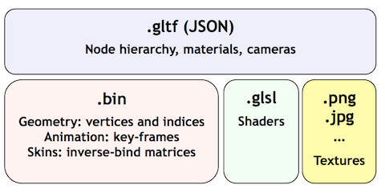
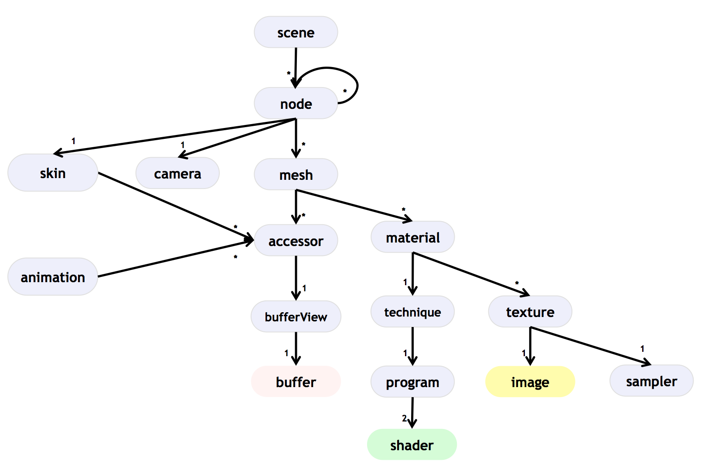

<p align="center">

</p>

*Version 1.0*

The GL Transmission Format (glTF) is a runtime asset delivery format for GL APIs: WebGL, OpenGL ES, and OpenGL.  glTF bridges the gap between 3D content creation tools and modern GL applications by providing an efficient, extensible, interoperable format for the transmission and loading of 3D content.

Last Updated: January 13, 2016

Editors

* Patrick Cozzi, Cesium
* Tony Parisi, WEVR

Contributors

* Fabrice Robinet, Individual Contributor (Previous Editor and Incubator)
* Remi Arnaud, Starbreeze Studios
* Uli Klumpp, Individual Contributor
* Neil Trevett, NVIDIA

Copyright (C) 2013-2016 The Khronos Group Inc. All Rights Reserved. glTF is a trademark of The Khronos Group Inc. 

# Contents

* [Introduction](#introduction)
  * [Motivation](#motivation)
  * [glTF Basics](#glTFbasics)
  * [Design Goals](#designgoals)
  * [File Extensions and MIME Types](#mimetypes)
* [Concepts](#concepts)
  * [IDs and Names](#ids-and-names)
  * [Scenes](#scenes)
  * [Accessing Binary Data](#binary-data)
  * [Geometry and Meshes](#geometry-and-meshes)
  * [Materials and Shading](#materials-and-shading)
  * [Cameras](#cameras)
  * [Lights](#lights)
  * [Animations](#animations)
  * [Metadata](#metadata)
  * [Specifying Extensions](#specifying-extensions)
* [Properties Reference](#properties)
* [Acknowledgements](#acknowledgements)
* [Appendix A: Default Material](#appendix-a)
* [Appendix B: Full Khronos Trademark Statement](#appendix-b)

<a name="introduction"></a>
# Introduction

*This section is non-normative.*

The GL Transmission Format (glTF) is a runtime asset delivery format for GL APIs: WebGL, OpenGL ES, and OpenGL.  glTF bridges the gap between 3D content creation tools and modern GL applications by providing an efficient, extensible, interoperable format for the transmission and loading of 3D content.

<a name="motivation"></a>
## Motivation

Traditional 3D modeling formats have been designed to store data for offline use, primarily to support authoring workflows on desktop systems. Industry-standard 3D interchange formats allow for sharing assets between different modeling tools, and within the content pipeline in general. However, neither of these types of formats is optimized for download speed or fast loading at runtime. Files tend to grow very large, and applications need to do a significant amount of processing to load such assets into GL-based applications.

Applications seeking high performance rarely load modeling formats directly; instead, they process models offline as part of a custom content pipeline, converting the assets into a proprietary format optimized for their runtime application.  This has led to a fragmented market of incompatible proprietary runtime formats and duplicated efforts in the content creation pipeline. 3D assets exported for one application cannot be reused in another application without going back to the original modeling, tool-specific source and performing another proprietary export step.

With the advent of mobile- and web-based 3D computing, new classes of applications have emerged that require fast, dynamic loading of standardized 3D assets. Digital marketing solutions, e-commerce product visualizations, and online model-sharing sites are just a few of the connected 3D applications being built today using WebGL or OpenGL ES. Beyond the need for efficient delivery, many of these online applications can benefit from a standard, interoperable format to enable sharing and reuse of assets between users, between applications, and within heterogeneous, distributed content pipelines.

glTF solves these problems by providing a vendor- and runtime-neutral format that can be loaded and rendered with minimal processing. The format combines an easily parseable JSON scene description with one or more binary files representing geometry, animations, and other rich data. Binary data is stored in such a way that it can be loaded directly into GL buffers without additional parsing or other manipulation. Using this approach, glTF is able to faithfully preserve full hierarchical scenes with nodes, meshes, cameras, materials, and animations, while enabling efficient delivery and fast loading.

<a name="glTFbasics"></a>

## glTF Basics

glTF assets are JSON files plus supporting external data. Specifically, a glTF asset is represented by:

* A JSON-formatted file (`.gltf`) containing a full scene description: node hierarchy, materials, cameras, as well as descriptor information for meshes, shaders, animations, and other constructs
* Binary files (`.bin`) containing geometry and animation data, and other buffer-based data
* Image files (`.jpg`, `.png`, etc.) for textures
* GLSL text files (`.glsl`) for GLSL shader source code

Assets defined in other formats, such as images and GLSL shader source code, may be stored in external files referenced via URI or embedded directly into the JSON using  [data URIs](https://developer.mozilla.org/en/data_URIs).

<p align="center">

</p>

<a name="designgoals"></a>

## Design Goals

glTF has been designed to meet the following goals:

* *Compact file sizes.* While web developers like to work with clear text as much as possible, clear text encoding is simply not practical for transmitting 3D data due to sheer size. The glTF JSON file itself is clear text, but it is compact and rapid to parse. All large data such as geometry and animations are stored in binary files that are much smaller than equivalent text representations.
* *Fast loading.* glTF data structures have been designed to mirror the GL API data as closely as possible, both in the JSON and binary files, to reduce load times. For example, binary data for meshes can be loaded directly into WebGL typed arrays with a simple data copy; no parsing or further processing is required.
* *Runtime-independence.* glTF makes no assumptions about the target application or 3D engine. glTF specifies no runtime behaviors other than rendering and animation.
* *Complete 3D scene representation.* Exporting single objects from a modeling package is not sufficient for many applications. Often, authors want to load entire scenes, including nodes, transformations, transform hierarchy, meshes, materials, cameras, and animations into their applications. glTF strives to preserve all of this information for use in the downstream application.
* *Extensibility.* While the initial base specification supports a rich feature set, there will be many opportunities for growth and improvement. glTF defines a mechanism that allows the addition of both general-purpose and vendor-specific extensions.

The design of glTF takes a pragmatic approach. The format is meant to mirror the GL APIs as closely as possible, but if it did only that, there would be no cameras, animations, or other features typically found in both modeling tools and runtime systems, and much semantic information would be lost in the translation. By supporting these common constructs, glTF content can not only load and render, but it can be immediately usable in a wider range of applications and require less duplication of effort in the content pipeline.

The following are outside the scope of the initial design of glTF:

* *glTF is not a streaming format.* The binary data in glTF is inherently streamable, and the buffer design allows for fetching data incrementally. But there are no other streaming constructs in the format, and no conformance requirements for an implementation to stream data versus downloading it in its entirety before rendering.
* *glTF is not intended to be human-readable,* though by virtue of being represented in JSON, it is developer-friendly.

Version 1.0 of glTF does not define compression for geometry and other rich data. However, the design team believes that compression is a very important part of a transmission standard, and there is already work underway to define compression extensions.

> The 3D Formats Working Group is developing partnerships to define the codec options for geometry compression.  glTF defines the node hierarchy, materials, animations, and geometry, and will reference the external compression specs.

<a name="mimetypes"></a>
## File Extensions and MIME Types

* `*.gltf` files use `model/gltf+json`
* `*.bin` files use `application/octet-stream`
* `*.glsl` files use `text/plain`
* Texture files use the official `image/*` type based on the specific image format. For compatibility with modern web browsers, the following image formats are supported: .jpg, .png, .bmp, and .gif. 

## URIs

glTF uses URIs to reference buffers, shaders, and image resources. These URIs may point to external files or be data URIs that embed resources in the JSON. Embedded resources are base64 encoded using [RFC-4648](https://tools.ietf.org/html/rfc4648) so they can easily be decoded with JavaScript's `atob`.

This allows the application to decide the best approach for delivery: if different assets share many of the same geometries, animations, textures, or shaders, separate files may be preferred to reduce the total amount of data requested. With separate files, applications can progressively load data and do not need to load data for parts of a model that are not visible. If an application cares more about single-file deployment, embedding data may be preferred even though it increases the overall size due to base64 encoding and does not support progressive or on-demand loading.

<a name="concepts"></a>
# Concepts

*This section is non-normative.*

<p align="center">
<br/>
The top-level dictionary objects in a glTF asset.  See the <a href="#properties">Properties Reference</a>.
</p>

<a name="file-structure"></a>

<a name="ids-and-names"></a>
## IDs and Names

_IDs_ are internal string identifiers used to reference parts of a glTF asset, e.g., a `bufferView` refers to a `buffer` by specifying the buffer's ID.  For example:

```javascript
"buffers": {
    "a-buffer-id": {
        "byteLength": 1024,
        "type": "arraybuffer",
        "uri": "path-to.bin"
    }
},
"bufferViews": {
    "a-bufferView-id": {
        "buffer": "a-buffer-id",
        "byteLength": 512,
        "byteOffset": 0
    }
}
```

In this example, `"a-buffer-id"` and `"a-bufferView-id"` are IDs.  The bufferView refers to the buffer using the buffer's ID: `"buffer": "a-buffer-id"`.

IDs for top-level glTF dictionary objects (`accessors`, `animations`, `buffers`, `bufferViews`, `cameras`, `images`, `materials`, `meshes`, `nodes`, `programs`, `samplers`, `scenes`, `shaders`, `skins`, `techniques`, and `textures`) are in the same namespace and are unique. 

For example, the following is **not** allowed:

```javascript
"buffers": {
    "an-id": {
        // ...
    }
},
"bufferViews": {
    "an-id": { // Not allowed since this ID is already used
        // ...
    }
}
```

IDs for non top-level glTF dictionary objects (e.g., `animation.samplers`) are each in their own namespace.  IDs are unique within the object as enforced by JSON.  For example, the following **is** allowed:

```javascript
"animations": {
    "animation-0": {
        // ...
        "samplers": {
            "animation-sampler-id": {
                // ...
            }
        }
    },
    "animation-1": {
        // ...
        "samplers": {
            "animation-sampler-id": { // Does not collide with the sampler ID in the other animation
                // ...
            }
        }
    }
}
```

Whereas IDs are used for internal glTF references, _names_ are used for application-specific uses such as display.  glTF objects that are commonly accessed from an application have a `name` string property for this purpose.  These property values are not guaranteed to be unique as they are intended to contain values created when the asset was authored.

For property names, glTF uses [camel case](http://en.wikipedia.org/wiki/CamelCase) `likeThis`.  Camel case is a common naming convention in JSON and WebGL.

It is recommended that container formats reference a glTF object by ID by concatenating the asset's path, `#`, and the ID, e.g., `asset.gltf#material_id`.

<a name="scenes"></a>
## Scenes

The glTF asset contains one or more *scenes*, the set of visual objects to render. Scenes are defined in a dictionary object `scenes`. An additional property, `scene` (note singular), identifies which of the scenes in the dictionary is to be displayed at load time. 

The following example defines a glTF asset with a single scene, `defaultScene`, that contains a single node, `node_1`.

```javascript
"scene": "defaultScene",
"scenes": {
    "defaultScene": {
        "nodes": [
            "node_1"
        ]
    }
},
```

### Nodes and Hierarchy

The glTF asset defines one or more *nodes*, that is, the objects comprising the scene to render. 

Each node can contain one or more meshes, a skin instance, a joint name, or a camera, defined in the `meshes`, `skeletons`, `skin`, `jointName`, and `camera` properties, respectively.

Nodes have an optional `name` property.

Nodes also have transform properties, as described in the next section.

Nodes are organized in a parent-child hierarchy known informally as the *node hierarchy*. 

The node hierarchy is defined using a node's `children` property, as in the following example:

```javascript
    "node-box": {
        "children": [
            "node_1",
            "node-camera_1"
        ],
        "name": "Box"
    },
```

The node `node-box` has two children, `node_1` and `node-camera_1`. Each of those nodes could in turn have its own children, creating a hierarchy of nodes.

>For Version 1.0 conformance, the glTF node hierarchy is not a directed acyclic graph (DAG) or *scene graph*, but a strict tree. That is, no node may be a direct or indirect descendant of more than one node. This restriction is meant to simplify implementation and facilitate conformance. The restriction may be lifted after Version 1.0.


### Transforms

Any node can define a local space transformation either by supplying a `matrix` property, or any of `translation`, `rotation`, and `scale`  properties (also known as *TRS properties*). `translation` and `scale` are `FLOAT_VEC3` values in the local coordinate system. `rotation` is a `FLOAT_VEC4` unit quaternion value, `(x, y, z, w)`, in the local coordinate system.

In the example below, `node-box` defines non-default rotation and translation.

```javascript
    "node-box": {
        "children": [
            "node_1",
            "node-camera_1"
        ],
        "name": "Box",
        "rotation": [
            0,
            0,
            1,
            0
        ],
        "scale": [
            1,
            1,
            1
        ],
        "translation": [
            -17.7082,
            -11.4156,
            2.0922
        ]
    },
```

The next example defines the transformation for a camera node using the `matrix` property rather than using the individual TRS values:

```javascript
    "node-camera_1": {
        "camera": "camera_1",
        "children": [],
        "matrix": [
            -0.99975,
            -0.00679829,
            0.0213218,
            0,
            0.00167596,
            0.927325,
            0.374254,
            0,
            -0.0223165,
            0.374196,
            -0.927081,
            0,
            -0.0115543,
            0.194711,
            -0.478297,
            1
        ],
        "name": "Camera01"
    },
```

### Coordinate System and Units

glTF uses a right-handed coordinate system, that is, the cross product of x and y yields z. glTF defines the y axis as up.

The units for all linear distances are meters.

All angles are in radians.

<a name="accessing-binary-data"></a>
## Accessing Binary Data


### Buffers and Buffer Views

A *buffer* is data stored as a binary blob. The buffer can contain a combination of geometry, animation, and skins. 

Binary blobs allow efficient creation of GL buffers and
textures since they require no additional parsing, except perhaps decompression. An asset can have any number of buffer files for flexibility for a wide array of applications.

Buffer data is little endian.

All buffers are stored in the asset's `buffers` dictionary property.

The following example defines a buffer. The `byteLength` property specifies the size of the buffer file. The `type` property specifies how the data is stored, either as a binary array buffer or text. The `uri` property is the URI to the buffer data. Buffer data may also be stored within the glTF file as base64-encoded data and reference via data URI. 

```javascript
    "buffers": {
        "duck": {
            "byteLength": 102040,
            "type": "arraybuffer",
            "uri": "duck.bin"
        }
    },
```

A *bufferView* represents a subset of data in a buffer, defined by an integer offset into the buffer specified in the `byteOffset` property, a `byteLength` property to specify length of the buffer view. The bufferView also defines a `target` property to indicate the target data type, either ARRAY_BUFFER, ELEMENT_ARRAY_BUFFER, or an object describing animation or skinning target data. This enables the implementation to readily create and populate the buffers in memory.

The following example defines two buffer views: an ELEMENT_ARRAY_BUFFER view `bufferView_29`, which holds the indices for an indexed triangle set, and `bufferView_30`, an ARRAY_BUFFER that holds the vertex data for the triangle set.


```javascript
    "bufferViews": {
        "bufferView_29": {
            "buffer": "duck",
            "byteLength": 25272,
            "byteOffset": 0,
            "target": 34963
        },
        "bufferView_30": {
            "buffer": "duck",
            "byteLength": 76768,
            "byteOffset": 25272,
            "target": 34962
        }
    },
```

buffers and bufferViews do not contain type information. They simply define the raw data for retrieval from the file. Objects within the glTF file (meshes, skins, animations) never access buffers or bufferViews directly, but rather via *accessors*.


### Accessors

All large data for meshes, skins, and animations is stored in buffers and retrieved via accessors.

An *accessor* defines a method for retrieving data as typed arrays from within a bufferView. The accessor specifies a component type (e.g. `FLOAT`) and a data type (e.g. `VEC3`), which when combined define the complete data type for each array element. The accessor also specifies the location and size of the data within the bufferView using the properties `byteOffset` and `count`. count specifies the number of attributes within the bufferView, *not* the number of bytes.

All accessors are stored in the asset's `accessors` dictionary property.

The following fragment shows two accessors, a scalar accessor for retrieving a primitive's indices and a 3-float-component vector accessor for retrieving the primitive's position data.

```javascript
"accessors": {
    "accessor_21": {
        "bufferView": "bufferView_29",
        "byteOffset": 0,
        "byteStride": 0,
        "componentType": 5123,
        "count": 12636,
        "type": "SCALAR"
    },
    "accessor_23": {
        "bufferView": "bufferView_30",
        "byteOffset": 0,
        "byteStride": 12,
        "componentType": 5126,
        "count": 2399,
        "max": [
            0.961799,
            1.6397,
            0.539252
        ],
        "min": [
            -0.692985,
            0.0992937,
            -0.613282
        ],
        "type": "VEC3"
    },
```

#### Accessor Attribute Size

The following tables can be used to compute the size of an accessor's attribute type.

| `componentType` | Size in bytes |
|:-:|:-:|
| `5120` (BYTE) | 1 |
| `5121`(UNSIGNED_BYTE) | 1 |
| `5122` (SHORT) | 2 |
| `5123` (UNSIGNED_SHORT) | 2 |
| `5126` (FLOAT) | 4 |

| `type` | Number of components |
|:-:|:-:|
| `"SCALAR"` | 1 |
| `"VEC2"` | 2 |
| `"VEC3"` | 3 |
| `"VEC4"` | 4 |
| `"MAT2"` | 4 |
| `"MAT3"` | 9 |
| `"MAT4"` | 16 |

The size of an accessor's attribute type, in bytes, is 
`(size in bytes of the 'componentType') * (number of components defined by 'type')`.

For example:

```javascript
"accessor_1": {
    "bufferView": "bufferView_1",
    "byteOffset": 7032,
    "byteStride": 12,
    "componentType": 5126, // FLOAT
    "count": 586,
    "type": "VEC3"
}
```

In this accessor, the `componentType` is `5126` (FLOAT), so each component is four bytes.  The `type` is `"VEC3"`, so there are three components.  The size of the attribute type is 12 bytes (`4 * 3`).

#### BufferView and Accessor Byte Alignment

The offset of an `accessor` into a `bufferView` (i.e., `accessor.byteOffset`) and the offset of an `accessor` into a `buffer` (i.e., `accessor.byteOffset + bufferView.byteOffset`) must be a multiple of the size of the accessor's attribute type.

> **Implementation Note:** This allows a runtime to efficiently create a single arraybuffer from a glTF `buffer` or an arraybuffer per `bufferView`, and then use an `accessor` to turn a typed array view (e.g., `Float32Array`) into an arraybuffer without copying it because the byte offset of the typed array view is a multiple of the size of the type (e.g., `4` for `Float32Array`).

Consider the following example:

```javascript
"bufferView_1": {
    "buffer": "buffer_1",
    "byteLength": 17136,
    "byteOffset": 620,
    "target": 34963
},
"accessor_1": {
    "bufferView": "bufferView_1",
    "byteOffset": 4608,
    "byteStride": 0,
    "componentType": 5123, // UNSIGNED_SHORT
    "count": 5232,
    "type": "SCALAR"
}
```
The size of the accessor attribute type is two bytes (the `componentType` is unsigned short and the `type` is scalar).  The accessor's `byteOffset` is also divisible by two.  Likewise, the accessor's offset into `buffer_1` is `5228 ` (`620 + 4608`), which is divisible by two.


<a name="geometry-and-meshes"></a>

## Geometry and Meshes

Any node can contain one or more meshes, defined in its `meshes` property. Any node can contain one skinned mesh instance, defined using a combination of the properties `meshes`, `skeletons`, and `skin`. A node can either contain meshes or a single skinned mesh instance, but not both.

### Meshes

In glTF, meshes are defined as arrays of *primitives*. Primitives correspond to the data required for GL draw calls. Primitives specify one or more `attributes`, corresponding to the vertex attributes used in the draw calls. Indexed primitives also define an `indices` property. Attributes and indices are defined as accessors. Each primitive also specifies a material and a primitive type that corresponds to the GL primitive type (e.g., triangle set).

The following example defines a mesh containing one triangle set primitive:

```javascript
    "primitives": [
        {
            "attributes": {
                "NORMAL": "accessor_25",
                "POSITION": "accessor_23",
                "TEXCOORD_0": "accessor_27"
            },
            "indices": "accessor_21",
            "material": "blinn3-fx",
            "primitive": 4
        }
    ]
```

Each attribute is defined as a property of the `attributes` object. The name of the property corresponds to an enumerated value identifying the vertex attribute, such as `POSITION`. This value will be mapped to a specific named attribute within the GLSL shader for the mesh, as defined in the material technique's `parameters` dictionary property (see Materials and Shading, below). The value of the property is the ID  of an accessor that contains the data.

Valid attribute semantics include `POSITION`, `NORMAL`, `TEXCOORD`, `COLOR`, `JOINT`, `JOINTMATRIX`, and `WEIGHT`.  Attribute semantics can be of the form `[semantic]_[set_index]`, e.g., `TEXCOORD_0`, `TEXCOORD_1`, etc.

> **Implementation note:** Each primitive corresponds to one WebGL draw call (engines are, of course, free to batch draw calls). When a primitive's `indices` property is defined, it references the accessor to use for index data, and GL's `drawElements` function should be used. When the `indices` property is not defined, GL's `drawArrays` function should be used with a count equal to the count property of any of the accessors referenced by the `attributes` property (they are all equal for a given primitive).

                    
                    
### Skins

All skins are stored in the `skins` dictionary property of the asset, by name. Each skin is defined by a `bindShapeMatrix` property, which describes how to pose the skin's geometry for use with the joints; the `inverseBindMatrices` property, used to bring coordinates being skinned into the same space as each joint; and a `jointNames` array property that lists the joints used to animate the skin. Each joint name must correspond to the joint of a node in the hierarchy, as designated by the node's `jointName` property.
  

```javascript
    "skins": {
        "skin_1": {
            "bindShapeMatrix": [
                0,
                -0.804999,
                0.172274,
                0,
                0,
                0.172274,
                0.804999,
                0,
                -0.823226,
                0,
                0,
                0,
                -127.093,
                -393.418,
                597.2,
                1
            ],
            "inverseBindMatrices": "bind-matrices_1",
            "jointNames": [
                "Bone1",
                "Bone2",
            ]
        }
    },
```

#### Skin Instances

A skin is instanced within a node using a combination of the node's `meshes`, `skeletons`, and `skin` properties. The meshes for a skin instance are defined in the `meshes` property. The `skeletons` property contains one or more skeletons, each of which is the root of a node hierarchy. The `skin` property contains the ID of the skin to instance. The example below defines a skin instance that uses a single mesh and skeleton.

```javascript
    "node_1": {
        "children": [],
        "meshes": [
            "skinned-mesh_1"
        ],
        "skeletons": [
            "skeleton-root_1"
        ],
        "skin": "skin_1"
```

#### Skinned Mesh Attributes

The mesh for a skin is defined with vertex attributes that are used in skinning calculations in the vertex shader. The following mesh skin defines `JOINT` and `WEIGHT` vertex attributes for a triangle mesh primitive:

```javascript
    "meshes": {
        "skinned-mesh_1": {
            "name": "skinned-mesh_1",
            "primitives": [
                {
                    "attributes": {
                        "JOINT": "accessor_179",
                        "NORMAL": "accessor_165",
                        "POSITION": "accessor_163",
                        "TEXCOORD_0": "accessor_167",
                        "WEIGHT": "accessor_176"
                    },
                    "indices": "accessor_161",
                    "material": "material_1",
                    "primitive": 4
                }
            ]
        }
    },
```


#### Joint Hierarchy

The joint hierarchy used in animation is simply the glTF node hierarchy, with each node designated as a joint using the `jointName` property. Any joints listed in the skin's `jointNames` property must correspond to a node that has the same `jointName` property. The following example defines a joint hierarchy of two joints with `root-node` at the root, identified as a joint using the joint name `Bone1`.

```javascript
    "nodes": {
        "root-node": {
            "children": [
                "child-node"
            ],
            "jointName": "Bone1",
            "name": "root",
            "rotation": [
                0,
                0,
                0.7071067811865475,
                0.7071067811865476
            ],
            "scale": [
                1,
                1,
                1
            ],
            "translation": [
                4.61599,
                -2.032e-06,
                -5.08e-08
            ]
        },
        "child-node": {
            "children": [],
            "jointName": "Bone2",
            "name": "head",
            "rotation": [
                0,
                0,
                0,
                1
            ],
            "scale": [
                1,
                1,
                1
            ],
            "translation": [
                8.76635,
                0,
                0
            ]
        },
```


<a name="materials-and-shading"></a>
## Materials and Shading

A material is defined as an instance of a shading technique along with parameterized values, e.g., light colors, specularity, or shininess. Shading techniques use JSON properties to describe data types and semantics for GLSL vertex and fragment shader programs.

Materials are stored in the assets `materials` dictionary property, which contains one or more material definitions. The following example shows a Blinn shader with ambient color, diffuse texture, emissive color, shininess, and specular color.

```javascript
"materials": {
    "blinn-1": {
        "technique": "technique1",
        "values": {
            "ambient": [
                0,
                0,
                0,	
                1
            ],
            "diffuse": "texture_file2",
            "emission": [
                0,
                0,
                0,
                1
            ],
            "shininess": 38.4,
            "specular": [
                0,
                0,
                0,
                1
            ]
        }
        "name": "blinn1"
    }
},
```

The `technique` property is optional; if it is not supplied, and no extension is present that defines material properties, then the object will be rendered using a default material with 50% gray emissive color.  See [Appendix A](#appendix-a).

**non-normative**: In practice, most assets will have a `technique` property or an extension that defines material properties.  The default material simply allows an asset to not have to define an explicit technique when an extension is used.

### Techniques

A technique describes the shading used for a material. The asset's techniques are stored in the `techniques` dictionary property.

The following example shows a technique and the properties it defines. This section describes each property in detail.

```javascript
"techniques": {
    "technique1": {
    	 // parameter definitions
        "parameters": {
            "ambient": {
                "type": 35666
            },
            "diffuse": {
                "type": 35678
            },
            "light0Color": {
                "type": 35665,
                "value": [
                    1,
                    1,
                    1
                ]
            },
            "light0Transform": {
                "semantic": "MODELVIEW",
                "node": "directionalLight1",
                "type": 35676
            }
            // more parameters
        },
    	// program, attributes and uniforms definitions
	    "attributes": {
	        "a_normal": "normal",
	        "a_position": "position",
	        "a_texcoord0": "texcoord0"
	    },
	    "program": "program_0",
	    "uniforms": {
	        "u_ambient": "ambient",
	        "u_diffuse": "diffuse",
	        "u_emission": "emission",
	        "u_light0Color": "light0Color",
	        "u_light0Transform": "light0Transform",
	        "u_modelViewMatrix": "modelViewMatrix",
	        "u_normalMatrix": "normalMatrix",
	        "u_projectionMatrix": "projectionMatrix",
	        "u_shininess": "shininess",
	        "u_specular": "specular"
	    },
		// render states
		"states": {
		    "enable": [
		        2884,
		        2929
		    ]
		}
        
```

#### Parameters

Each technique has zero or more parameters; each parameter is defined by a type (GL types such as a floating point number, vector, texture, etc.), a default value, and potentially a semantic describing how the runtime is to interpret the data to pass to the shader. When a material instances a technique, the name of each supplied value in its `values` property corresponds to one of the parameters defined in the technique. 

The above example illustrates several parameters. The property `ambient` is defined as a `FLOAT_VEC4` type; `diffuse` is defined as a `SAMPLER_2D`; and `light0color` is defined as a `FLOAT_VEC3` with a default color value of white. 


#### Semantics

Technique parameters may also optionally define a *semantic*, an enumerated value describing how the runtime is to interpret the data to be passed to the shader. 

In the above example, the parameter `light0Transform` defines the `MODELVIEW` semantic, which corresponds to the world space position of the node referenced in the property `node`, in this case the node `directionalight1`, which refers to a node that contains a light source.

If no `node` property is supplied for a semantic, the semantic is implied in a context-specific manner: either to the node which is being rendered, or in the case of camera-specific semantics, to the current camera. In the following fragment, which defines a parameter named `projectionMatrix` that is derived from the implementation's projection matrix, the semantic would be applied to the camera. 

```javascript
"projectionMatrix": {
    "semantic": "PROJECTION",
    "type": 35676
}
```

Table 1. Uniform Semantics

| Semantic                     | Type         | Description |
|:----------------------------:|:------------:|-------------|
| `LOCAL`                      | `FLOAT_MAT4` | Transforms from the node's coordinate system to its parent's.  This is the node's matrix property (or derived matrix from translation, rotation, and scale properties). |
| `MODEL`                      | `FLOAT_MAT4` | Transforms from model to world coordinates using the transform's node and all of its ancestors. |
| `VIEW`                       | `FLOAT_MAT4` | Transforms from world to view coordinates using the active camera node. |
| `PROJECTION`                 | `FLOAT_MAT4` | Transforms from view to clip coordinates using the active camera node. |
| `MODELVIEW`                  | `FLOAT_MAT4` | Combined `MODEL` and `VIEW`. |
| `MODELVIEWPROJECTION`        | `FLOAT_MAT4` | Combined `MODEL`, `VIEW`, and `PROJECTION`. |
| `MODELINVERSE`               | `FLOAT_MAT4` | Inverse of `MODEL`. |
| `VIEWINVERSE`                | `FLOAT_MAT4` | Inverse of `VIEW`. |
| `PROJECTIONINVERSE`          | `FLOAT_MAT4` | Inverse of `PROJECTION`. |
| `MODELVIEWINVERSE`           | `FLOAT_MAT4` | Inverse of `MODELVIEW`. |
| `MODELVIEWPROJECTIONINVERSE` | `FLOAT_MAT4` | Inverse of `MODELVIEWPROJECTION`. |
| `MODELINVERSETRANSPOSE`      | `FLOAT_MAT3` | The inverse-transpose of `MODEL` without the translation.  This translates normals in model coordinates to world coordinates. |
| `MODELVIEWINVERSETRANSPOSE`  | `FLOAT_MAT3` | The inverse-transpose of `MODELVIEW` without the translation.  This translates normals in model coordinates to eye coordinates. |
| `VIEWPORT`                   | `FLOAT_VEC4` | The viewport's x, y, width, and height properties stored in the `x`, `y`, `z`, and `w` components, respectively.  For example, this is used to scale window coordinates to [0, 1]: `vec2 v = gl_FragCoord.xy / viewport.zw;` |


#### Program Instances

The `program` property of a technique creates an instance of a shader program. The value of the property is the ID of a program defined in the asset's `programs` dictionary object (see next section). A shader program may be instanced multiple times within the glTF asset.

Attributes and uniforms passed to the program instance's shader code are defined in the `attributes` and `uniforms` properties of the technique, respectively. The following example shows the definitions for a technique's program instance, attributes and techniques:


```javascript
    "attributes": {
        "a_normal": "normal",
        "a_position": "position",
        "a_texcoord0": "texcoord0"
    },
    "program": "program_0",
    "uniforms": {
        "u_ambient": "ambient",
        "u_diffuse": "diffuse",
        "u_emission": "emission",
        "u_light0Color": "light0Color",
        "u_light0Transform": "light0Transform",
        "u_modelViewMatrix": "modelViewMatrix",
        "u_normalMatrix": "normalMatrix",
        "u_projectionMatrix": "projectionMatrix",
        "u_shininess": "shininess",
        "u_specular": "specular"
    },
```

The `attributes` property specifies the vertex attributes of the data that will be passed to the shader. Each attribute's name is a string that corresponds to the attribute name in the GLSL source code. Each attribute's value is a string that references a parameter defined in the technique's `parameters` property, where the type and semantic of the attribute is defined.

The `uniforms` property specifies the uniform variables that will be passed to the shader. Each uniform's name is a string that corresponds to the uniform name in the GLSL source code. Each uniform's value is a string that references a parameter defined in the technique's `parameters` property, where the type and semantic of the uniform is defined.

#### Render States

Render states define the fixed-function GL state when a primitive is rendered. The technique's `states` property contains two properties:

* `enable`: an array of integers corresponding to Boolean GL states that should be enabled using GL's `enable` function.
* `functions`: a dictionary object containing properties corresponding to the names of GL state functions to call.  Each property is an array, where the elements correspond to the arguments of the GL function.

Valid values for elements in the `enable` array are `3042` (`BLEND`), `2884` (`CULL_FACE`), `2929` (`DEPTH_TEST`), `32823` (`POLYGON_OFFSET_FILL`), `32926` (`SAMPLE_ALPHA_TO_COVERAGE`), and `3089` (`SCISSOR_TEST`).  If any of these values are not in the array, the GL state should be disabled (which is the GL default state).  If the `enable` array is not defined in the `pass`, all of these Boolean GL states are disabled.

Each property in `functions` indicates a GL function to call and the arguments to provide.  Valid property names are `"blendColor"`, `"blendEquationSeparate"`, `"blendFuncSeparate"`, `"colorMask"`, `"cullFace"`, `"depthFunc"`, `"depthMask"`, `"depthRange"`, `"frontFace"`, `"lineWidth"`, `"polygonOffset"`, and `"scissor"`.  If a property is not defined, the GL state for that function should be set to the default value(s) shown in the example below.

The following example `states` object indicates to enable all Boolean states (see the `enable` array) and use the default values for all the GL state functions (which could be omitted).

```javascript
"states": {
    "enable": [
        3042,  // BLEND
        2884,  // CULL_FACE
        2929,  // DEPTH_TEST
        32823, // POLYGON_OFFSET_FILL
        32926, // SAMPLE_ALPHA_TO_COVERAGE
        3089   // SCISSOR_TEST
    ], // empty by default
    "functions": {
      "blendColor": [0.0, 0.0, 0.0, 0.0], // (red, green, blue, alpha)
      "blendEquationSeparate": [
          32774, // FUNC_ADD (rgb)
          32774  // FUNC_ADD (alpha)
      ],
      "blendFuncSeparate": [
          1,     // ONE (srcRGB)
          1,     // ONE (srcAlpha)
          0,     // ZERO (dstRGB)
          0      // ZERO (dstAlpha)
      ],
      "colorMask": [true, true, true, true], // (red, green, blue, alpha)
      "cullFace": [1029], // BACK
      "depthFunc": [LESS], // 513
      "depthMask": [true],
      "depthRange": [0.0, 1.0], // (zNear, zFar)
      "frontFace": [2305], // CCW
      "lineWidth": [1.0],
      "polygonOffset": [0.0, 0.0], // (factor, units)
      "scissor": [0, 0, 0, 0], // (x, y, width, height)
    }
}
```

The following example shows a typical `"states"` object for closed opaque geometry.  Culling and the depth test are enabled, and all other GL states are set to the default value (disabled).
```javascript
	"states": {
	    "enable": [
	        2884,
	        2929
	    ]
	}
```

> **Implementation Note**: It is recommended that a runtime use the minimal number of GL state function calls.  This generally means ordering draw calls by technique, and then making GL state function calls only for the states that vary between techniques.


#### Programs

GLSL shader programs are stored in the asset's `programs` property. This property contains one or more objects, one for each program.

Each shader program includes an `attributes` property, which specifies the vertex attributes that will be passed to the shader, and the properties `fragmentShader` and `vertexShader`, which reference the files for the fragment and vertex shader GLSL source code, respectively. 

```javascript
    "programs": {
        "program_0": {
            "attributes": [
                "a_normal",
                "a_position",
                "a_texcoord0"
            ],
            "fragmentShader": "duck0FS",
            "vertexShader": "duck0VS"
        }
    },
```

#### Shaders

Shader source files are stored in the asset's `shaders` dictionary property, which contains one or more shader source files. Each shader specifies a `type` (vertex or fragment, defined as GL enum types) and a `uri` to the file. Shader URIs may be URIs to external files or data URIs, allowing the shader content to be embedded as base64-encoded data in the asset.

```javascript
"shaders": {
    "duck0FS": {
        "type": 35632,
        "uri": "duck0FS.glsl"
    },
    "duck0VS": {
        "type": 35633,
        "uri": "duck0VS.glsl"
    }
},
```    

#### Textures

Textures can be used as uniform inputs to shaders. The following material definition specifies a diffuse texture using the `diffuse` parameter.

```javascript
"materials": {
    "material-1": {
        "technique": "technique1",
        "values": {
            "diffuse": "texture_file2",
        }
        "name": "material_1"
    }
},
```


All textures are stored in the asset's `textures` dictionary property. A texture is defined by an image file, denoted by the `source` property; `format` and `internalFormat` specifiers, corresponding to the GL texture format types; a `target` type for the sampler; a sampler identifier (`sampler`), and a `type` property defining the internal data format. Refer to the GL definition of `texImage2D()` for more details.

```javascript
"textures": {
    "texture_file2": {
        "format": 6408,
        "internalFormat": 6408,
        "sampler": "sampler_0",
        "source": "file2",
        "target": 3553,
        "type": 5121
    }
}
```

#### Images
 
Images referred to by textures are stored in the `images` dictionary property of the asset. Each image contains a URI to an external file in one of the supported images formats. Image data may also be stored within the glTF file as base64-encoded data and referenced via data URI. For example:

```javascript
"images": {
    "file2": {
        "uri": "duckCM.png"
    }
},
```

#### Samplers

Samplers are stored in the `samplers` dictionary property of the asset. Each sampler specifies filter and wrapping options corresponding to the GL types. The following example defines a sampler with linear mag filtering, linear mipmap min filtering, and repeat wrapping in S and T.


```javascript
"samplers": {
    "sampler_0": {
        "magFilter": 9729,
        "minFilter": 9987,
        "wrapS": 10497,
        "wrapT": 10497
    }
},
```

> **Mipmapping Implementation Note**: When a sampler's minification filter (`minFilter`) uses mipmapping (`NEAREST_MIPMAP_NEAREST`, `NEAREST_MIPMAP_LINEAR`, `LINEAR_MIPMAP_NEAREST`, or `LINEAR_MIPMAP_LINEAR`), any texture referencing the sampler needs to have mipmaps, e.g., by calling GL's `generateMipmap()` function.


> **Non-Power-Of-Two Texture Implementation Note**: glTF does not guarantee that a texture's dimensions are a power-of-two.  At runtime, if a texture's width or height is not a power-of-two, the texture needs to be resized so its dimensions are powers-of-two if the `sampler` the texture references
> * Has a wrapping mode (either `wrapS` or `wrapT`) equal to `REPEAT` or `MIRRORED_REPEAT`, or
> * Has a minification filter (`minFilter`) that uses mipmapping (`NEAREST_MIPMAP_NEAREST`, `NEAREST_MIPMAP_LINEAR`, `LINEAR_MIPMAP_NEAREST`, or `LINEAR_MIPMAP_LINEAR`).

<a name="cameras"></a>
## Cameras

A camera defines the projection matrix that transforms from view to clip coordinates. The projection can be perspective or orthographic. Cameras are contained in nodes and thus can be transformed. Their world-space positions can be used in shader calculations, and their projection matrices can be used in shader semantics such as PROJECTION.

Cameras are stored in the asset's `cameras` dictionary property. Each camera defines a `type` property that designates the type of projection (perspective or orthographic), and either a `perspective` or `orthographic` property that defines the details.

The following example defines a perspective camera with supplied values for Y field of view, aspect ratio, and near and far clipping planes.

```javascript
"cameras": {
    "camera_0": {
        "perspective": {
            "aspect_ratio": 1.5,
            "yfov": 0.660593,
            "zfar": 100,
            "znear": 0.01
        },
        "type": "perspective"
    }
}
```

<a name="animations"></a>
## Animations

glTF supports articulated and skinned animation via key frame animations of nodes' transforms. Key frame data is stored in buffers and referenced in animations using accessors.

> Note: glTF 1.0 only supports animating node transforms. A future version of the specification may support animating arbitrary properties, such as material colors and texture transform matrices.

All animations are stored in the `animations` dictionary property of the asset. An animation is defined as a set of channels (the `channels` property), a set of parameterized inputs (`parameters`) representing the key frame data, and samplers that interpolate between the key frames (the `samplers` property). All parameters must have the same number of elements.

The following example defines an animating camera node. 

```javascript
        "animation_0": {
            "channels": [
                {
                    "sampler": "animation_0_scale_sampler",
                    "target": {
                        "id": "node-cam01-box",
                        "path": "scale"
                    }
                },
                {
                    "sampler": "animation_0_translation_sampler",
                    "target": {
                        "id": "node-cam01-box",
                        "path": "translation"
                    }
                },
                {
                    "sampler": "animation_0_rotation_sampler",
                    "target": {
                        "id": "node-cam01-box",
                        "path": "rotation"
                    }
                }
            ],
            "count": 901,
            "parameters": {
                "TIME": "animAccessor_0",
                "rotation": "animAccessor_3",
                "scale": "animAccessor_1",
                "translation": "animAccessor_2"
            },
            "samplers": {
                "animation_0_rotation_sampler": {
                    "input": "TIME",
                    "interpolation": "LINEAR",
                    "output": "rotation"
                },
                "animation_0_scale_sampler": {
                    "input": "TIME",
                    "interpolation": "LINEAR",
                    "output": "scale"
                },
                "animation_0_translation_sampler": {
                    "input": "TIME",
                    "interpolation": "LINEAR",
                    "output": "translation"
                }
            }
        },
```

*Channels* connect the output values of the key frame animation to a specific node in the hierarchy. A channel's `sampler` property contains the ID of one of the samplers present in the containing animation's `samplers` property. The `target` property is an object that identifies which node to animate using its `id` property, and which property of the node to animate using `path`. Valid path names are `"translation"`, `"rotation"`, and `"scale."`

The animation's *parameters* define the inputs to the animation: a set of floating point scalar values representing time (the `"TIME"` input); and sets of three-component floating-point vectors representing translation or scale, or four-component floating-point vectors representing rotation. Each of these inputs is stored in a buffer and accessed via an accessor.

Interpolation between keys is defined using *samplers*, which take an input value, such as time, and generate an output value based on the inputs defined in the `parameters` property, using the interpolation formula specified in the `interpolation` property.

> Note: glTF 1.0 animation samplers support only linear interpolation.

glTF animations can be used to drive articulated or skinned animations. Skinned animation is achieved by animating the joints in the skin's joint hierarachy. (See the section on Skins above.)

        
<a name="metadata"></a>
## Metadata

Asset metadata is described in the `asset` property. The asset metadata contains the following properties:

* a `copyright` property denoting authorship
* a `generator` property describing the tool, if any, that generated the asset
* a `premultipliedAlpha` property specifying if the shaders were generated with premultiplied alpha (see WebGL `getContext()` with premultipliedAlpha)
* a profile designation
* a `version` property denoting the specification version

Only the `version` property is required. For example,

```javascript
"asset": {
    "generator": "collada2gltf@f356b99aef8868f74877c7ca545f2cd206b9d3b7",
    "premultipliedAlpha": true,
    "profile" : {
        "api" : "WebGL",
        "version" : "1.0.3",
        "extras" : {
            "Application specific" : "The extra object can contain any properties."
        }  
    },
    "version": 0.8
}
```

<a name="specifying-extensions"></a>
## Specifying Extensions

glTF defines an extension mechanism that allows the base format to be extended with new capabilities. Any glTF object can have an optional `extensions` property, as in the following example:

```javascript
"a_shader": {
    "extensions": {
        "binary_glTF": {
            "bufferView": // ...
        }
    }
}
```

All extensions used in a model are listed in the top-level `extensionsUsed` dictionary object, e.g.,

```javascript
"extensionsUsed": [
   "EXT_binary_glTF"
]
```

For more information on glTF extensions, consult the [extensions registry specification](../extensions/README.md).

<a name="properties"></a>
# Properties Reference

* [`accessor`](#reference-accessor)
* [`animation`](#reference-animation)
   * [`channel`](#reference-animation.channel)
      * [`target`](#reference-animation.channel.target)
   * [`sampler`](#reference-animation.sampler)
* [`asset`](#reference-asset)
   * [`profile`](#reference-asset.profile)
* [`buffer`](#reference-buffer)
* [`bufferView`](#reference-bufferView)
* [`camera`](#reference-camera)
   * [`orthographic`](#reference-camera.orthographic)
   * [`perspective`](#reference-camera.perspective)
* [`glTF`](#reference-glTF) (root object for an asset)
* [`image`](#reference-image)
* [`material`](#reference-material)
* [`mesh`](#reference-mesh)
   * [`primitive`](#reference-mesh.primitive)
* [`node`](#reference-node)
* [`program`](#reference-program)
* [`sampler`](#reference-sampler)
* [`scene`](#reference-scene)
* [`shader`](#reference-shader)
* [`skin`](#reference-skin)
* [`technique`](#reference-technique)
   * [`parameters`](#reference-technique.parameters)
   * [`states`](#reference-technique.states)
      * [`functions`](#reference-technique.states.functions)
* [`texture`](#reference-texture)

This property reference applies to the WebGL 1.0.3 profile.  See `version` and `api` properties on ['asset.profile'](#reference-asset.profile).

> In the future, other profiles, such as OpenGL, are expected.

<!-- ======================================================================= -->
<a name="reference-accessor"></a>
## accessor

A typed view into a [`bufferView`](#reference-bufferView).  A bufferView contains raw binary data.  An accessor provides a typed view into a bufferView or a subset of a bufferView similar to how WebGL's `vertexAttribPointer()` defines an attribute in a buffer.

**Properties**

|   |Type|Description|Required|
|---|----|-----------|--------|
|**bufferView**|`string`|The ID of the [`bufferView`](#reference-bufferView).| :white_check_mark: Yes|
|**byteOffset**|`integer`|The offset relative to the start of the [`bufferView`](#reference-bufferView) in bytes.| :white_check_mark: Yes|
|**byteStride**|`integer`|The stride, in bytes, between attributes referenced by this accessor.|No, default: `0`|
|**componentType**|`integer`|The datatype of components in the attribute.| :white_check_mark: Yes|
|**count**|`integer`|The number of attributes referenced by this accessor.| :white_check_mark: Yes|
|**type**|`string`|Specifies if the attribute is a scalar, vector, or matrix.| :white_check_mark: Yes|
|**max**|`number[1-16]`|Maximum value of each component in this attribute.|No|
|**min**|`number[1-16]`|Minimum value of each component in this attribute.|No|
|**name**|`string`|The user-defined name of this object.|No|
|**extensions**|`object`|Dictionary object with extension-specific objects.|No|
|**extras**|`any`|Application-specific data.|No|

Additional properties are not allowed.

* **JSON schema**: [accessor.schema.json](schema/accessor.schema.json)
* **Example**: [accessors.json](schema/examples/accessors.json)

### accessor.bufferView :white_check_mark: 

The ID of the [`bufferView`](#reference-bufferView).

* **Type**: `string`
* **Required**: Yes
* **Minimum Length**`: >= 1`

### accessor.byteOffset :white_check_mark: 

The offset relative to the start of the [`bufferView`](#reference-bufferView) in bytes.  This must be a multiple of the size of the data type.

* **Type**: `integer`
* **Required**: Yes
* **Minimum**:` >= 0`
* **Related WebGL functions**: `vertexAttribPointer()` offset parameter

### accessor.byteStride

The stride, in bytes, between attributes referenced by this accessor.  When this is zero, the attributes are tightly packed.

* **Type**: `integer`
* **Required**: No, default: `0`
* **Minimum**:` >= 0`
* **Maximum**:` <= 255`
* **Related WebGL functions**: `vertexAttribPointer()` stride parameter

### accessor.componentType :white_check_mark: 

The datatype of components in the attribute.  Valid values correspond to WebGL enums: `5120` (BYTE), `5121` (UNSIGNED_BYTE), `5122` (SHORT), `5123` (UNSIGNED_SHORT), and `5126` (FLOAT).  The corresponding typed arrays are `Int8Array`, `Uint8Array`, `Int16Array`, `Uint16Array`, and `Float32Array`, respectively.

* **Type**: `integer`
* **Required**: Yes
* **Allowed values**: `5120`, `5121`, `5122`, `5123`, `5126`

### accessor.count :white_check_mark: 

The number of attributes referenced by this accessor, not to be confused with the number of bytes or number of components.

* **Type**: `integer`
* **Required**: Yes
* **Minimum**:` >= 1`

### accessor.type :white_check_mark: 

Specifies if the attribute is a scalar, vector, or matrix, and the number of elements in the vector or matrix.

* **Type**: `string`
* **Required**: Yes
* **Allowed values**: `"SCALAR"`, `"VEC2"`, `"VEC3"`, `"VEC4"`, `"MAT2"`, `"MAT3"`, `"MAT4"`

### accessor.max

Maximum value of each component in this attribute.  When both min and max arrays are defined, they have the same length.  The length is determined by the value of the type property.

* **Type**: `number[1-16]`
* **Required**: No

### accessor.min

Minimum value of each component in this attribute.  When both min and max arrays are defined, they have the same length.  The length is determined by the value of the type property.

* **Type**: `number[1-16]`
* **Required**: No

### accessor.name

The user-defined name of this object.  This is not necessarily unique, e.g., an accessor and a buffer could have the same name, or two accessors could even have the same name.

* **Type**: `string`
* **Required**: No

### accessor.extensions

Dictionary object with extension-specific objects.

* **Type**: `object`
* **Required**: No
* **Type of each property**: `object`

### accessor.extras

Application-specific data.

* **Type**: `any`
* **Required**: No


<!-- ======================================================================= -->
<a name="reference-animation"></a>
## animation

A keyframe animation.

**Properties**

|   |Type|Description|Required|
|---|----|-----------|--------|
|**channels**|[`animation.channel[]`](#reference-animation.channel)|An array of channels, each of which targets an animation's sampler at a node's property.|No, default: `[]`|
|**parameters**|`object`|A dictionary object of strings whose values are IDs of accessors with keyframe data, e.g., time, translation, rotation, etc.|No, default: `{}`|
|**samplers**|`object`|A dictionary object of [`animation.sampler`](#reference-animation.sampler) objects that combines input and output parameters with an interpolation algorithm to define a keyframe graph (but not its target).|No, default: `{}`|
|**name**|`string`|The user-defined name of this object.|No|
|**extensions**|`object`|Dictionary object with extension-specific objects.|No|
|**extras**|`any`|Application-specific data.|No|

Additional properties are not allowed.

* **JSON schema**: [animation.schema.json](schema/animation.schema.json)
* **Example**: [animations.json](schema/examples/animations.json)

### animation.channels

An array of channels, each of which targets an animation's sampler at a node's property.

* **Type**: [`animation.channel[]`](#reference-animation.channel)
* **Required**: No, default: `[]`

### animation.parameters

A dictionary object of strings whose values are IDs of accessors with keyframe data, e.g., time, translation, rotation, etc.

* **Type**: `object`
* **Required**: No, default: `{}`
* **Type of each property**: `string`

### animation.samplers

A dictionary object of [`animation.sampler`](#reference-animation.sampler) objects that combines input and output parameters with an interpolation algorithm to define a keyframe graph (but not its target).

* **Type**: `object`
* **Required**: No, default: `{}`
* **Type of each property**: `object`

### animation.name

The user-defined name of this object.  This is not necessarily unique, e.g., an animation and a buffer could have the same name, or two animations could even have the same name.

* **Type**: `string`
* **Required**: No

### animation.extensions

Dictionary object with extension-specific objects.

* **Type**: `object`
* **Required**: No
* **Type of each property**: `object`

### animation.extras

Application-specific data.

* **Type**: `any`
* **Required**: No


<!-- ======================================================================= -->
<a name="reference-animation.channel"></a>
## animation.channel

Targets an animation's sampler at a node's property.

**Properties**

|   |Type|Description|Required|
|---|----|-----------|--------|
|**sampler**|`string`|The ID of a sampler in this animation used to compute the value for the target.| :white_check_mark: Yes|
|**target**|[`animation.channel.target`](#reference-animation.channel.target)|The ID of the node and TRS property to target.| :white_check_mark: Yes|
|**extensions**|`object`|Dictionary object with extension-specific objects.|No|
|**extras**|`any`|Application-specific data.|No|

Additional properties are not allowed.

**JSON schema**: [animation.channel.schema.json](schema/animation.channel.schema.json)

### channel.sampler :white_check_mark: 

The ID of a sampler in this animation used to compute the value for the target, e.g., a node's translation, rotation, or scale (TRS).

* **Type**: `string`
* **Required**: Yes
* **Minimum Length**`: >= 1`

### channel.target :white_check_mark: 

The ID of the node and TRS property to target.

* **Type**: [`animation.channel.target`](#reference-animation.channel.target)
* **Required**: Yes

### channel.extensions

Dictionary object with extension-specific objects.

* **Type**: `object`
* **Required**: No
* **Type of each property**: `object`

### channel.extras

Application-specific data.

* **Type**: `any`
* **Required**: No


<!-- ======================================================================= -->
<a name="reference-animation.channel.target"></a>
## animation.channel.target

The ID of the node and TRS property that an animation channel targets.

**Properties**

|   |Type|Description|Required|
|---|----|-----------|--------|
|**id**|`string`|The ID of the node to target.| :white_check_mark: Yes|
|**path**|`string`|The name of the node's TRS property to modify.| :white_check_mark: Yes|
|**extensions**|`object`|Dictionary object with extension-specific objects.|No|
|**extras**|`any`|Application-specific data.|No|

Additional properties are not allowed.

**JSON schema**: [animation.channel.target.schema.json](schema/animation.channel.target.schema.json)

### target.id :white_check_mark: 

The ID of the node to target.

* **Type**: `string`
* **Required**: Yes
* **Minimum Length**`: >= 1`

### target.path :white_check_mark: 

The name of the node's TRS property to modify.

* **Type**: `string`
* **Required**: Yes
* **Allowed values**: `"translation"`, `"rotation"`, `"scale"`

### target.extensions

Dictionary object with extension-specific objects.

* **Type**: `object`
* **Required**: No
* **Type of each property**: `object`

### target.extras

Application-specific data.

* **Type**: `any`
* **Required**: No


<!-- ======================================================================= -->
<a name="reference-animation.sampler"></a>
## animation.sampler

Combines input and output parameters with an interpolation algorithm to define a keyframe graph (but not its target).

**Properties**

|   |Type|Description|Required|
|---|----|-----------|--------|
|**input**|`string`|The ID of a parameter in this animation to use as keyframe input, e.g., time.| :white_check_mark: Yes|
|**interpolation**|`string`|Interpolation algorithm.|No, default: `"LINEAR"`|
|**output**|`string`|The ID of a parameter in this animation to use as keyframe output.| :white_check_mark: Yes|
|**extensions**|`object`|Dictionary object with extension-specific objects.|No|
|**extras**|`any`|Application-specific data.|No|

Additional properties are not allowed.

**JSON schema**: [animation.sampler.schema.json](schema/animation.sampler.schema.json)

### sampler.input :white_check_mark: 

The ID of a parameter in this animation to use as keyframe input.  This parameter must have type `FLOAT`.  The values represent time in seconds with `time[0] >= 0.0`, and monotonically increasing values, i.e., `time[n + 1] >= time[n]`.

* **Type**: `string`
* **Required**: Yes
* **Minimum Length**`: >= 1`

### sampler.interpolation

Interpolation algorithm.  When an animation targets a node's rotation, and the animation's interpolation is `"LINEAR"`, spherical linear interpolation (slerp) should be used to interpolate quaternions.

* **Type**: `string`
* **Required**: No, default: `"LINEAR"`
* **Allowed values**: `"LINEAR"`

### sampler.output :white_check_mark: 

The ID of a parameter in this animation to use as keyframe output.

* **Type**: `string`
* **Required**: Yes
* **Minimum Length**`: >= 1`

### sampler.extensions

Dictionary object with extension-specific objects.

* **Type**: `object`
* **Required**: No
* **Type of each property**: `object`

### sampler.extras

Application-specific data.

* **Type**: `any`
* **Required**: No


<!-- ======================================================================= -->
<a name="reference-asset"></a>
## asset

Metadata about the glTF asset.

**Properties**

|   |Type|Description|Required|
|---|----|-----------|--------|
|**copyright**|`string`|A copyright message suitable for display to credit the content creator.|No|
|**generator**|`string`|Tool that generated this glTF model.  Useful for debugging.|No|
|**premultipliedAlpha**|`boolean`|Specifies if the shaders were generated with premultiplied alpha.|No, default: `false`|
|**profile**|[`asset.profile`](#reference-asset.profile)|Specifies the target rendering API and version, e.g., WebGL 1.0.3.|No, default: `{}`|
|**version**|`string`|The glTF version.| :white_check_mark: Yes|
|**extensions**|`object`|Dictionary object with extension-specific objects.|No|
|**extras**|`any`|Application-specific data.|No|

Additional properties are not allowed.

* **JSON schema**: [asset.schema.json](schema/asset.schema.json)
* **Example**: [asset.json](schema/examples/asset.json)

### asset.copyright

A copyright message suitable for display to credit the content creator.

* **Type**: `string`
* **Required**: No

### asset.generator

Tool that generated this glTF model.  Useful for debugging.

* **Type**: `string`
* **Required**: No

### asset.premultipliedAlpha

Specifies if the shaders were generated with premultiplied alpha.

* **Type**: `boolean`
* **Required**: No, default: `false`
* **Related WebGL functions**: `getContext()` with premultipliedAlpha

### asset.profile

Specifies the target rendering API and version, e.g., WebGL 1.0.3.

* **Type**: [`asset.profile`](#reference-asset.profile)
* **Required**: No, default: `{}`

### asset.version :white_check_mark: 

The glTF version.

* **Type**: `string`
* **Required**: Yes

### asset.extensions

Dictionary object with extension-specific objects.

* **Type**: `object`
* **Required**: No
* **Type of each property**: `object`

### asset.extras

Application-specific data.

* **Type**: `any`
* **Required**: No


<!-- ======================================================================= -->
<a name="reference-asset.profile"></a>
## asset.profile

Specifies the target rendering API and version, e.g., WebGL 1.0.3.

**Properties**

|   |Type|Description|Required|
|---|----|-----------|--------|
|**api**|`string`|Specifies the target rendering API.|No, default: `"WebGL"`|
|**version**|`string`|The API version.|No, default: `"1.0.3"`|
|**extensions**|`object`|Dictionary object with extension-specific objects.|No|
|**extras**|`any`|Application-specific data.|No|

Additional properties are not allowed.

**JSON schema**: [asset.profile.schema.json](schema/asset.profile.schema.json)

### profile.api

Specifies the target rendering API.

* **Type**: `string`
* **Required**: No, default: `"WebGL"`

### profile.version

The API version.

* **Type**: `string`
* **Required**: No, default: `"1.0.3"`

### profile.extensions

Dictionary object with extension-specific objects.

* **Type**: `object`
* **Required**: No
* **Type of each property**: `object`

### profile.extras

Application-specific data.

* **Type**: `any`
* **Required**: No


<!-- ======================================================================= -->
<a name="reference-buffer"></a>
## buffer

A buffer points to binary geometry, animation, or skins.

**Properties**

|   |Type|Description|Required|
|---|----|-----------|--------|
|**uri**|`string`|The uri of the buffer.| :white_check_mark: Yes|
|**byteLength**|`integer`|The length of the buffer in bytes.|No, default: `0`|
|**type**|`string`|XMLHttpRequest `responseType`.|No, default: `"arraybuffer"`|
|**name**|`string`|The user-defined name of this object.|No|
|**extensions**|`object`|Dictionary object with extension-specific objects.|No|
|**extras**|`any`|Application-specific data.|No|

Additional properties are not allowed.

* **JSON schema**: [buffer.schema.json](schema/buffer.schema.json)
* **Example**: [buffers.json](schema/examples/buffers.json)

### buffer.uri :white_check_mark: 

The uri of the buffer.  Relative paths are relative to the .gltf file.  Instead of referencing an external file, the uri can also be a data-uri.

* **Type**: `string`
* **Required**: Yes
* **Format**: uri

### buffer.byteLength

The length of the buffer in bytes.

* **Type**: `integer`
* **Required**: No, default: `0`
* **Minimum**:` >= 0`

### buffer.type

XMLHttpRequest `responseType`.

* **Type**: `string`
* **Required**: No, default: `"arraybuffer"`
* **Allowed values**: `"arraybuffer"`, `"text"`

### buffer.name

The user-defined name of this object.  This is not necessarily unique, e.g., a buffer and a bufferView could have the same name, or two buffers could even have the same name.

* **Type**: `string`
* **Required**: No

### buffer.extensions

Dictionary object with extension-specific objects.

* **Type**: `object`
* **Required**: No
* **Type of each property**: `object`

### buffer.extras

Application-specific data.

* **Type**: `any`
* **Required**: No


<!-- ======================================================================= -->
<a name="reference-bufferView"></a>
## bufferView

A view into a [`buffer`](#reference-buffer) generally representing a subset of the buffer.

**Properties**

|   |Type|Description|Required|
|---|----|-----------|--------|
|**buffer**|`string`|The ID of the [`buffer`](#reference-buffer).| :white_check_mark: Yes|
|**byteOffset**|`integer`|The offset into the [`buffer`](#reference-buffer) in bytes.| :white_check_mark: Yes|
|**byteLength**|`integer`|The length of the bufferView in bytes.|No, default: `0`|
|**target**|`integer`|The target that the WebGL buffer should be bound to.|No|
|**name**|`string`|The user-defined name of this object.|No|
|**extensions**|`object`|Dictionary object with extension-specific objects.|No|
|**extras**|`any`|Application-specific data.|No|

Additional properties are not allowed.

* **JSON schema**: [bufferView.schema.json](schema/bufferView.schema.json)
* **Example**: [bufferViews.json](schema/examples/bufferViews.json)

### bufferView.buffer :white_check_mark: 

The ID of the [`buffer`](#reference-buffer).

* **Type**: `string`
* **Required**: Yes
* **Minimum Length**`: >= 1`

### bufferView.byteOffset :white_check_mark: 

The offset into the [`buffer`](#reference-buffer) in bytes.

* **Type**: `integer`
* **Required**: Yes
* **Minimum**:` >= 0`

### bufferView.byteLength

The length of the bufferView in bytes.

* **Type**: `integer`
* **Required**: No, default: `0`
* **Minimum**:` >= 0`

### bufferView.target

The target that the WebGL buffer should be bound to.  Valid values correspond to WebGL enums: `34962` (ARRAY_BUFFER) and `34963` (ELEMENT_ARRAY_BUFFER).  When this is not provided, the bufferView contains animation or skin data.

* **Type**: `integer`
* **Required**: No
* **Allowed values**: `34962`, `34963`
* **Related WebGL functions**: `bindBuffer()`

### bufferView.name

The user-defined name of this object.  This is not necessarily unique, e.g., a bufferView and a buffer could have the same name, or two bufferViews could even have the same name.

* **Type**: `string`
* **Required**: No

### bufferView.extensions

Dictionary object with extension-specific objects.

* **Type**: `object`
* **Required**: No
* **Type of each property**: `object`

### bufferView.extras

Application-specific data.

* **Type**: `any`
* **Required**: No


<!-- ======================================================================= -->
<a name="reference-camera"></a>
## camera

A camera's projection.  A node can reference a camera ID to apply a transform to place the camera in the scene.

**Properties**

|   |Type|Description|Required|
|---|----|-----------|--------|
|**orthographic**|[`camera.orthographic`](#reference-camera.orthographic)|An orthographic camera containing properties to create an orthographic projection matrix.|No|
|**perspective**|[`camera.perspective`](#reference-camera.perspective)|A perspective camera containing properties to create a perspective projection matrix.|No|
|**type**|`string`|Specifies if the camera uses a perspective or orthographic projection.| :white_check_mark: Yes|
|**name**|`string`|The user-defined name of this object.|No|
|**extensions**|`object`|Dictionary object with extension-specific objects.|No|
|**extras**|`any`|Application-specific data.|No|

Additional properties are not allowed.

* **JSON schema**: [camera.schema.json](schema/camera.schema.json)
* **Example**: [cameras.json](schema/examples/cameras.json)

### camera.orthographic

An orthographic camera containing properties to create an orthographic projection matrix.

* **Type**: [`camera.orthographic`](#reference-camera.orthographic)
* **Required**: No

### camera.perspective

A perspective camera containing properties to create a perspective projection matrix.

* **Type**: [`camera.perspective`](#reference-camera.perspective)
* **Required**: No

### camera.type :white_check_mark: 

Specifies if the camera uses a perspective or orthographic projection.  Based on this, either the camera's `perspective` or `orthographic` property will be defined.

* **Type**: `string`
* **Required**: Yes
* **Allowed values**: `"perspective"`, `"orthographic"`

### camera.name

The user-defined name of this object.  This is not necessarily unique, e.g., a camera and a buffer could have the same name, or two cameras could even have the same name.

* **Type**: `string`
* **Required**: No

### camera.extensions

Dictionary object with extension-specific objects.

* **Type**: `object`
* **Required**: No
* **Type of each property**: `object`

### camera.extras

Application-specific data.

* **Type**: `any`
* **Required**: No


<!-- ======================================================================= -->
<a name="reference-camera.orthographic"></a>
## camera.orthographic

An orthographic camera containing properties to create an orthographic projection matrix.

**Properties**

|   |Type|Description|Required|
|---|----|-----------|--------|
|**xmag**|`number`|The floating-point horizontal magnification of the view.| :white_check_mark: Yes|
|**ymag**|`number`|The floating-point vertical magnification of the view.| :white_check_mark: Yes|
|**zfar**|`number`|The floating-point distance to the far clipping plane.| :white_check_mark: Yes|
|**znear**|`number`|The floating-point distance to the near clipping plane.| :white_check_mark: Yes|
|**extensions**|`object`|Dictionary object with extension-specific objects.|No|
|**extras**|`any`|Application-specific data.|No|

Additional properties are not allowed.

**JSON schema**: [camera.orthographic.schema.json](schema/camera.orthographic.schema.json)

### orthographic.xmag :white_check_mark: 

The floating-point horizontal magnification of the view.

* **Type**: `number`
* **Required**: Yes

### orthographic.ymag :white_check_mark: 

The floating-point vertical magnification of the view.

* **Type**: `number`
* **Required**: Yes

### orthographic.zfar :white_check_mark: 

The floating-point distance to the far clipping plane.

* **Type**: `number`
* **Required**: Yes
* **Minimum**:` >= 0`

### orthographic.znear :white_check_mark: 

The floating-point distance to the near clipping plane.

* **Type**: `number`
* **Required**: Yes
* **Minimum**:` >= 0`

### orthographic.extensions

Dictionary object with extension-specific objects.

* **Type**: `object`
* **Required**: No
* **Type of each property**: `object`

### orthographic.extras

Application-specific data.

* **Type**: `any`
* **Required**: No


<!-- ======================================================================= -->
<a name="reference-camera.perspective"></a>
## camera.perspective

A perspective camera containing properties to create a perspective projection matrix.

**Properties**

|   |Type|Description|Required|
|---|----|-----------|--------|
|**aspectRatio**|`number`|The floating-point aspect ratio of the field of view.|No|
|**yfov**|`number`|The floating-point vertical field of view in radians.| :white_check_mark: Yes|
|**zfar**|`number`|The floating-point distance to the far clipping plane.| :white_check_mark: Yes|
|**znear**|`number`|The floating-point distance to the near clipping plane.| :white_check_mark: Yes|
|**extensions**|`object`|Dictionary object with extension-specific objects.|No|
|**extras**|`any`|Application-specific data.|No|

Additional properties are not allowed.

**JSON schema**: [camera.perspective.schema.json](schema/camera.perspective.schema.json)

### perspective.aspectRatio

The floating-point aspect ratio of the field of view.  When this is undefined, the aspect ratio of the canvas is used.

* **Type**: `number`
* **Required**: No
* **Minimum**:` >= 0`

### perspective.yfov :white_check_mark: 

The floating-point vertical field of view in radians.

* **Type**: `number`
* **Required**: Yes
* **Minimum**:` >= 0`

### perspective.zfar :white_check_mark: 

The floating-point distance to the far clipping plane.  zfar must be greater than znear.

* **Type**: `number`
* **Required**: Yes
* **Minimum**:` > 0`

### perspective.znear :white_check_mark: 

The floating-point distance to the near clipping plane.  zfar must be greater than znear.

* **Type**: `number`
* **Required**: Yes
* **Minimum**:` > 0`

### perspective.extensions

Dictionary object with extension-specific objects.

* **Type**: `object`
* **Required**: No
* **Type of each property**: `object`

### perspective.extras

Application-specific data.

* **Type**: `any`
* **Required**: No


<!-- ======================================================================= -->
<a name="reference-glTF"></a>
## glTF

The root object for a glTF asset.

**Properties**

|   |Type|Description|Required|
|---|----|-----------|--------|
|**accessors**|`object`|A dictionary object of [`accessor`](#reference-accessor) objects.|No, default: `{}`|
|**animations**|`object`|A dictionary object of keyframe [`animation`](#reference-animation) objects.|No, default: `{}`|
|**asset**|[`asset`](#reference-asset)|Metadata about the glTF asset.|No, default: `{}`|
|**buffers**|`object`|A dictionary object of [`buffer`](#reference-buffer) objects.|No, default: `{}`|
|**bufferViews**|`object`|A dictionary object of [`bufferView`](#reference-bufferView) objects.|No, default: `{}`|
|**cameras**|`object`|A dictionary object of [`camera`](#reference-camera) objects.|No, default: `{}`|
|**images**|`object`|A dictionary object of [`image`](#reference-image) objects.|No, default: `{}`|
|**materials**|`object`|A dictionary object of [`material`](#reference-material) objects.|No, default: `{}`|
|**meshes**|`object`|A dictionary object of [`mesh`](#reference-mesh) objects.|No, default: `{}`|
|**nodes**|`object`|A dictionary object of [`node`](#reference-node) objects.|No, default: `{}`|
|**programs**|`object`|A dictionary object of [`program`](#reference-program) objects.|No, default: `{}`|
|**samplers**|`object`|A dictionary object of [`sampler`](#reference-sampler) objects.|No, default: `{}`|
|**scene**|`string`|The ID of the default scene.|No|
|**scenes**|`object`|A dictionary object of [`scene`](#reference-scene) objects.|No, default: `{}`|
|**shaders**|`object`|A dictionary object of [`shader`](#reference-shader) objects.|No, default: `{}`|
|**skins**|`object`|A dictionary object of [`skin`](#reference-skin) objects.|No, default: `{}`|
|**techniques**|`object`|A dictionary object of [`technique`](#reference-technique) objects.|No, default: `{}`|
|**textures**|`object`|A dictionary object of [`texture`](#reference-texture) objects.|No, default: `{}`|
|**extensionsUsed**|`string[]`|Names of extensions used somewhere in this asset.|No, default: `[]`|
|**extensions**|`object`|Dictionary object with extension-specific objects.|No|
|**extras**|`any`|Application-specific data.|No|

Additional properties are not allowed.

**JSON schema**: [glTF.schema.json](schema/glTF.schema.json)

### glTF.accessors

A dictionary object of [`accessor`](#reference-accessor) objects.  The name of each accessor is an ID in the global glTF namespace that is used to reference the accessor.  An accessor is a typed view into a bufferView.

* **Type**: `object`
* **Required**: No, default: `{}`
* **Type of each property**: `object`

### glTF.animations

A dictionary object of keyframe [`animation`](#reference-animation) objects.  The name of each animation is an ID in the global glTF namespace that is used to reference the animation.

* **Type**: `object`
* **Required**: No, default: `{}`
* **Type of each property**: `object`

### glTF.asset

Metadata about the glTF asset.

* **Type**: [`asset`](#reference-asset)
* **Required**: No, default: `{}`

### glTF.buffers

A dictionary object of [`buffer`](#reference-buffer) objects.  The name of each buffer is an ID in the global glTF namespace that is used to reference the buffer.  A buffer points to binary geometry, animation, or skins.

* **Type**: `object`
* **Required**: No, default: `{}`
* **Type of each property**: `object`

### glTF.bufferViews

A dictionary object of [`bufferView`](#reference-bufferView) objects.  The name of each bufferView is an ID in the global glTF namespace that is used to reference the bufferView.  A bufferView is a view into a buffer generally representing a subset of the buffer.

* **Type**: `object`
* **Required**: No, default: `{}`
* **Type of each property**: `object`

### glTF.cameras

A dictionary object of [`camera`](#reference-camera) objects.  The name of each camera is an ID in the global glTF namespace that is used to reference the camera.  A camera defines a projection matrix.

* **Type**: `object`
* **Required**: No, default: `{}`
* **Type of each property**: `object`

### glTF.images

A dictionary object of [`image`](#reference-image) objects.  The name of each image is an ID in the global glTF namespace that is used to reference the image.  An image defines data used to create a texture.

* **Type**: `object`
* **Required**: No, default: `{}`
* **Type of each property**: `object`

### glTF.materials

A dictionary object of [`material`](#reference-material) objects.  The name of each material is an ID in the global glTF namespace that is used to reference the material.  A material defines the appearance of a primitive.

* **Type**: `object`
* **Required**: No, default: `{}`
* **Type of each property**: `object`

### glTF.meshes

A dictionary object of [`mesh`](#reference-mesh) objects.  The name of each mesh is an ID in the global glTF namespace that is used to reference the mesh.  A mesh is a set of primitives to be rendered.

* **Type**: `object`
* **Required**: No, default: `{}`
* **Type of each property**: `object`

### glTF.nodes

A dictionary object of [`node`](#reference-node) objects in the node hierarchy.  The name of each node is an ID in the global glTF namespace that is used to reference the node.

* **Type**: `object`
* **Required**: No, default: `{}`
* **Type of each property**: `object`

### glTF.programs

A dictionary object of shader [`program`](#reference-program) objects.  The name of each program is an ID in the global glTF namespace that is used to reference the program.

* **Type**: `object`
* **Required**: No, default: `{}`
* **Type of each property**: `object`

### glTF.samplers

A dictionary object of [`sampler`](#reference-sampler) objects.  The name of each sampler is an ID in the global glTF namespace that is used to reference the sampler.  A sampler contains properties for texture filtering and wrapping modes.

* **Type**: `object`
* **Required**: No, default: `{}`
* **Type of each property**: `object`

### glTF.scene

The ID of the default scene.

* **Type**: `string`
* **Required**: No
* **Minimum Length**`: >= 1`

### glTF.scenes

A dictionary object of [`scene`](#reference-scene) objects.  The name of each scene is an ID in the global glTF namespace that is used to reference the scene.

* **Type**: `object`
* **Required**: No, default: `{}`
* **Type of each property**: `object`

### glTF.shaders

A dictionary object of [`shader`](#reference-shader) objects.  The name of each shader is an ID in the global glTF namespace that is used to reference the shader.

* **Type**: `object`
* **Required**: No, default: `{}`
* **Type of each property**: `object`

### glTF.skins

A dictionary object of [`skin`](#reference-skin) objects.  The name of each skin is an ID in the global glTF namespace that is used to reference the skin.  A skin is defined by joints and matrices.

* **Type**: `object`
* **Required**: No, default: `{}`
* **Type of each property**: `object`

### glTF.techniques

A dictionary object of [`technique`](#reference-technique) objects.  The name of each technique is an ID in the global glTF namespace that is used to reference the technique.  A technique is a template for a material appearance.

* **Type**: `object`
* **Required**: No, default: `{}`
* **Type of each property**: `object`

### glTF.textures

A dictionary object of [`texture`](#reference-texture) objects.  The name of each texture is an ID in the global glTF namespace that is used to reference the texture.

* **Type**: `object`
* **Required**: No, default: `{}`
* **Type of each property**: `object`

### glTF.extensionsUsed

Names of extensions used somewhere in this asset.

* **Type**: `string[]`
   * Each element in the array must be unique.
* **Required**: No, default: `[]`
* **Related WebGL functions**: `getSupportedExtensions()` and `getExtension()`

### glTF.extensions

Dictionary object with extension-specific objects.

* **Type**: `object`
* **Required**: No
* **Type of each property**: `object`

### glTF.extras

Application-specific data.

* **Type**: `any`
* **Required**: No


<!-- ======================================================================= -->
<a name="reference-image"></a>
## image

Image data used to create a texture.

**Properties**

|   |Type|Description|Required|
|---|----|-----------|--------|
|**uri**|`string`|The uri of the image.| :white_check_mark: Yes|
|**name**|`string`|The user-defined name of this object.|No|
|**extensions**|`object`|Dictionary object with extension-specific objects.|No|
|**extras**|`any`|Application-specific data.|No|

Additional properties are not allowed.

* **JSON schema**: [image.schema.json](schema/image.schema.json)
* **Example**: [images.json](schema/examples/images.json)

### image.uri :white_check_mark: 

The uri of the image.  Relative paths are relative to the .gltf file.  Instead of referencing an external file, the uri can also be a data-uri.  The image format must be jpg, png, bmp, or gif.

* **Type**: `string`
* **Required**: Yes
* **Format**: uri

### image.name

The user-defined name of this object.  This is not necessarily unique, e.g., an image and a buffer could have the same name, or two images could even have the same name.

* **Type**: `string`
* **Required**: No

### image.extensions

Dictionary object with extension-specific objects.

* **Type**: `object`
* **Required**: No
* **Type of each property**: `object`

### image.extras

Application-specific data.

* **Type**: `any`
* **Required**: No


<!-- ======================================================================= -->
<a name="reference-material"></a>
## material

The material appearance of a primitive.

**Properties**

|   |Type|Description|Required|
|---|----|-----------|--------|
|**technique**|`string`|The ID of the [`technique`](#reference-technique).|No|
|**values**|`object`|A dictionary object of parameter values.|No, default: `{}`|
|**name**|`string`|The user-defined name of this object.|No|
|**extensions**|`object`|Dictionary object with extension-specific objects.|No|
|**extras**|`any`|Application-specific data.|No|

Additional properties are not allowed.

* **JSON schema**: [material.schema.json](schema/material.schema.json)
* **Example**: [materials.json](schema/examples/materials.json)

### material.technique

The ID of the technique.  If this is not supplied, and no extension is present that defines material properties, then the primitive should be rendered using a default material with 50% gray emissive color.  See [Appendix A](#appendix-a).

* **Type**: `string`
* **Required**: No
* **Minimum Length**`: >= 1`

### material.values

A dictionary object of parameter values.  Parameters with the same name as the technique's parameter override the technique's parameter value.

* **Type**: `object`
* **Required**: No, default: `{}`
* **Type of each property**: `number`, `boolean`, `string`, `number[]`, `boolean[]`, or `string[]`

### material.name

The user-defined name of this object.  This is not necessarily unique, e.g., a material and a buffer could have the same name, or two materials could even have the same name.

* **Type**: `string`
* **Required**: No

### material.extensions

Dictionary object with extension-specific objects.

* **Type**: `object`
* **Required**: No
* **Type of each property**: `object`

### material.extras

Application-specific data.

* **Type**: `any`
* **Required**: No


<!-- ======================================================================= -->
<a name="reference-mesh"></a>
## mesh

A set of primitives to be rendered.  A node can contain one or more meshes.  A node's transform places the mesh in the scene.

**Properties**

|   |Type|Description|Required|
|---|----|-----------|--------|
|**primitives**|[`mesh.primitive[]`](#reference-mesh.primitive)|An array of primitives, each defining geometry to be rendered with a material.|No, default: `[]`|
|**name**|`string`|The user-defined name of this object.|No|
|**extensions**|`object`|Dictionary object with extension-specific objects.|No|
|**extras**|`any`|Application-specific data.|No|

Additional properties are not allowed.

* **JSON schema**: [mesh.schema.json](schema/mesh.schema.json)
* **Example**: [meshes.json](schema/examples/meshes.json)

### mesh.primitives

An array of primitives, each defining geometry to be rendered with a material.

* **Type**: [`mesh.primitive[]`](#reference-mesh.primitive)
* **Required**: No, default: `[]`

### mesh.name

The user-defined name of this object.  This is not necessarily unique, e.g., a mesh and a buffer could have the same name, or two meshes could even have the same name.

* **Type**: `string`
* **Required**: No

### mesh.extensions

Dictionary object with extension-specific objects.

* **Type**: `object`
* **Required**: No
* **Type of each property**: `object`

### mesh.extras

Application-specific data.

* **Type**: `any`
* **Required**: No


<!-- ======================================================================= -->
<a name="reference-mesh.primitive"></a>
## mesh.primitive

Geometry to be rendered with the given material.

**Related WebGL functions**: `drawElements()` and `drawArrays()`

**Properties**

|   |Type|Description|Required|
|---|----|-----------|--------|
|**attributes**|`object`|A dictionary object of strings, where each string is the ID of the [`accessor`](#reference-accessor) containing an attribute.|No, default: `{}`|
|**indices**|`string`|The ID of the accessor that contains the indices.|No|
|**material**|`string`|The ID of the material to apply to this primitive when rendering.| :white_check_mark: Yes|
|**mode**|`integer`|The type of primitives to render.|No, default: `4`|
|**extensions**|`object`|Dictionary object with extension-specific objects.|No|
|**extras**|`any`|Application-specific data.|No|

Additional properties are not allowed.

**JSON schema**: [mesh.primitive.schema.json](schema/mesh.primitive.schema.json)

### primitive.attributes

A dictionary object of strings, where each string is the ID of the accessor containing an attribute.

* **Type**: `object`
* **Required**: No, default: `{}`
* **Type of each property**: `string`

### primitive.indices

The ID of the accessor that contains the indices.  When this is not defined, the primitives should be rendered without indices using `drawArrays()`.

* **Type**: `string`
* **Required**: No
* **Minimum Length**`: >= 1`

### primitive.material :white_check_mark: 

The ID of the material to apply to this primitive when rendering.

* **Type**: `string`
* **Required**: Yes
* **Minimum Length**`: >= 1`

### primitive.mode

The type of primitives to render.  Allowed values are 0 (`POINTS`), 1 (`LINES`), 2 (`LINE_LOOP`), 3 (`LINE_STRIP`), 4 (`TRIANGLES`), 5 (`TRIANGLE_STRIP`), and 6 (`TRIANGLE_FAN`).

* **Type**: `integer`
* **Required**: No, default: `4`
* **Allowed values**: `0`, `1`, `2`, `3`, `4`, `5`, `6`

### primitive.extensions

Dictionary object with extension-specific objects.

* **Type**: `object`
* **Required**: No
* **Type of each property**: `object`

### primitive.extras

Application-specific data.

* **Type**: `any`
* **Required**: No


<!-- ======================================================================= -->
<a name="reference-node"></a>
## node

A node in the node hierarchy.  A node can have either the `camera`, `meshes`, or `skeletons`/`skin`/`meshes` properties defined.

In the later case, all `primitives` in the referenced `meshes` contain `JOINT` and `WEIGHT` attributes and the referenced [`material`](#reference-material)/[`technique`](#reference-technique) from each `primitive` has parameters with `JOINT` and `WEIGHT` semantics.

A node can have either a `matrix` or any combination of `translation`/`rotation`/`scale` (TRS) properties.  If none are provided, the transform is the identity.

**Properties**

|   |Type|Description|Required|
|---|----|-----------|--------|
|**camera**|`string`|The ID of the [`camera`](#reference-camera) referenced by this node.|No|
|**children**|`string[]`|The IDs of this node's children.|No, default: `[]`|
|**skeletons**|`string[]`|The ID of skeleton nodes.|No|
|**skin**|`string`|The ID of the [`skin`](#reference-skin) referenced by this node.|No|
|**jointName**|`string`|Name used when this node is a joint in a skin.|No|
|**matrix**|`number[16]`|A floating-point 4x4 transformation matrix stored in column-major order.|No, default: `[1,0,0,0,0,1,0,0,0,0,1,0,0,0,0,1]`|
|**meshes**|`string[]`|The IDs of the [`mesh`](#reference-mesh) objects in this node.|No|
|**rotation**|`number[4]`|The node's unit quaternion rotation in the order (x, y, z, w), where w is the scalar.|No, default: `[0,0,0,0.1]`|
|**scale**|`number[3]`|The node's non-uniform scale.|No, default: `[1,1,1]`|
|**translation**|`number[3]`|The node's translation.|No, default: `[0,0,0]`|
|**name**|`string`|The user-defined name of this object.|No|
|**extensions**|`object`|Dictionary object with extension-specific objects.|No|
|**extras**|`any`|Application-specific data.|No|

Additional properties are not allowed.

* **JSON schema**: [node.schema.json](schema/node.schema.json)
* **Example**: [nodes.json](schema/examples/nodes.json)

### node.camera

The ID of the camera referenced by this node.

* **Type**: `string`
* **Required**: No
* **Minimum Length**`: >= 1`

### node.children

The IDs of this node's children.

* **Type**: `string[]`
   * Each element in the array must be unique.
   * Each element in the array must have length greater than or equal to `1`.
* **Required**: No, default: `[]`

### node.skeletons

The ID of skeleton nodes.  Each node defines a subtree, which has a `jointName` of the corresponding element in the referenced `skin.joints`.

* **Type**: `string[]`
   * Each element in the array must be unique.
   * Each element in the array must have length greater than or equal to `1`.
* **Required**: No

### node.skin

The ID of the skin referenced by this node.

* **Type**: `string`
* **Required**: No
* **Minimum Length**`: >= 1`

### node.jointName

Name used when this node is a joint in a skin.

* **Type**: `string`
* **Required**: No
* **Minimum Length**`: >= 1`

### node.matrix

A floating-point 4x4 transformation matrix stored in column-major order.

* **Type**: `number[16]`
* **Required**: No, default: `[1,0,0,0,0,1,0,0,0,0,1,0,0,0,0,1]`
* **Related WebGL functions**: `uniformMatrix4fv()` with the transpose parameter equal to false

### node.meshes

The IDs of the meshes in this node.  Multiple meshes are allowed so each can share the same transform matrix.

* **Type**: `string[]`
   * Each element in the array must be unique.
   * Each element in the array must have length greater than or equal to `1`.
* **Required**: No

### node.rotation

The node's unit quaternion rotation in the order (x, y, z, w), where w is the scalar.

* **Type**: `number[4]`
* **Required**: No, default: `[0,0,0,1]`

### node.scale

The node's non-uniform scale.

* **Type**: `number[3]`
* **Required**: No, default: `[1,1,1]`

### node.translation

The node's translation.

* **Type**: `number[3]`
* **Required**: No, default: `[0,0,0]`

### node.name

The user-defined name of this object.  This is not necessarily unique, e.g., a node and a buffer could have the same name, or two nodes could even have the same name.

* **Type**: `string`
* **Required**: No

### node.extensions

Dictionary object with extension-specific objects.

* **Type**: `object`
* **Required**: No
* **Type of each property**: `object`

### node.extras

Application-specific data.

* **Type**: `any`
* **Required**: No


<!-- ======================================================================= -->
<a name="reference-program"></a>
## program

A shader program, including its vertex and fragment shader, and names of vertex shader attributes.

**Related WebGL functions**: `attachShader()`, `bindAttribLocation()`, `createProgram()`, `deleteProgram()`, `getProgramParameter()`, `getProgramInfoLog()`, `linkProgram()`, `useProgram()`, and `validateProgram()`

**Properties**

|   |Type|Description|Required|
|---|----|-----------|--------|
|**attributes**|`string[]`|Names of GLSL vertex shader attributes.|No, default: `[]`|
|**fragmentShader**|`string`|The ID of the fragment [`shader`](#reference-shader).| :white_check_mark: Yes|
|**vertexShader**|`string`|The ID of the vertex [`shader`](#reference-shader).| :white_check_mark: Yes|
|**name**|`string`|The user-defined name of this object.|No|
|**extensions**|`object`|Dictionary object with extension-specific objects.|No|
|**extras**|`any`|Application-specific data.|No|

Additional properties are not allowed.

* **JSON schema**: [program.schema.json](schema/program.schema.json)
* **Example**: [programs.json](schema/examples/programs.json)

### program.attributes

Names of GLSL vertex shader attributes.

* **Type**: `string[]`
   * Each element in the array must have length between `1` and `256`.
* **Required**: No, default: `[]`
* **Related WebGL functions**: `bindAttribLocation()`

### program.fragmentShader :white_check_mark: 

The ID of the fragment [`shader`](#reference-shader).

* **Type**: `string`
* **Required**: Yes
* **Minimum Length**`: >= 1`

### program.vertexShader :white_check_mark: 

The ID of the vertex [`shader`](#reference-shader).

* **Type**: `string`
* **Required**: Yes
* **Minimum Length**`: >= 1`

### program.name

The user-defined name of this object.  This is not necessarily unique, e.g., a program and a buffer could have the same name, or two programs could even have the same name.

* **Type**: `string`
* **Required**: No

### program.extensions

Dictionary object with extension-specific objects.

* **Type**: `object`
* **Required**: No
* **Type of each property**: `object`

### program.extras

Application-specific data.

* **Type**: `any`
* **Required**: No


<!-- ======================================================================= -->
<a name="reference-sampler"></a>
## sampler

Texture sampler properties for filtering and wrapping modes.

**Related WebGL functions**: `texParameterf()`

**Properties**

|   |Type|Description|Required|
|---|----|-----------|--------|
|**magFilter**|`integer`|Magnification filter.|No, default: `9729`|
|**minFilter**|`integer`|Minification filter.|No, default: `9986`|
|**wrapS**|`integer`|s wrapping mode.|No, default: `10497`|
|**wrapT**|`integer`|t wrapping mode.|No, default: `10497`|
|**name**|`string`|The user-defined name of this object.|No|
|**extensions**|`object`|Dictionary object with extension-specific objects.|No|
|**extras**|`any`|Application-specific data.|No|

Additional properties are not allowed.

* **JSON schema**: [sampler.schema.json](schema/sampler.schema.json)
* **Example**: [samplers.json](schema/examples/samplers.json)

### sampler.magFilter

Magnification filter.  Valid values correspond to WebGL enums: `9728` (NEAREST) and `9729` (LINEAR).

* **Type**: `integer`
* **Required**: No, default: `9729`
* **Allowed values**: `9728`, `9729`
* **Related WebGL functions**: `texParameterf()` with pname equal to TEXTURE_MAG_FILTER

### sampler.minFilter

Minification filter.  Valid values correspond to WebGL enums: `9728` (NEAREST), `9729` (LINEAR), `9984` (NEAREST_MIPMAP_NEAREST), `9985` (LINEAR_MIPMAP_NEAREST), `9986` (NEAREST_MIPMAP_LINEAR), and `9987` (LINEAR_MIPMAP_LINEAR).

* **Type**: `integer`
* **Required**: No, default: `9986`
* **Allowed values**: `9728`, `9729`, `9984`, `9985`, `9986`, `9987`
* **Related WebGL functions**: `texParameterf()` with pname equal to TEXTURE_MIN_FILTER

### sampler.wrapS

s wrapping mode.  Valid values correspond to WebGL enums: `33071` (CLAMP_TO_EDGE), `33648` (MIRRORED_REPEAT), and `10497` (REPEAT).

* **Type**: `integer`
* **Required**: No, default: `10497`
* **Allowed values**: `33071`, `33648`, `10497`
* **Related WebGL functions**: `texParameterf()` with pname equal to TEXTURE_WRAP_S

### sampler.wrapT

t wrapping mode.  Valid values correspond to WebGL enums: `33071` (CLAMP_TO_EDGE), `33648` (MIRRORED_REPEAT), and `10497` (REPEAT).

* **Type**: `integer`
* **Required**: No, default: `10497`
* **Allowed values**: `33071`, `33648`, `10497`
* **Related WebGL functions**: `texParameterf()` with pname equal to TEXTURE_WRAP_T

### sampler.name

The user-defined name of this object.  This is not necessarily unique, e.g., a sampler and a buffer could have the same name, or two samplers could even have the same name.

* **Type**: `string`
* **Required**: No

### sampler.extensions

Dictionary object with extension-specific objects.

* **Type**: `object`
* **Required**: No
* **Type of each property**: `object`

### sampler.extras

Application-specific data.

* **Type**: `any`
* **Required**: No


<!-- ======================================================================= -->
<a name="reference-scene"></a>
## scene

The root nodes of a scene.

**Properties**

|   |Type|Description|Required|
|---|----|-----------|--------|
|**nodes**|`string[]`|The IDs of each root [`node`](#reference-node).|No, default: `[]`|
|**name**|`string`|The user-defined name of this object.|No|
|**extensions**|`object`|Dictionary object with extension-specific objects.|No|
|**extras**|`any`|Application-specific data.|No|

Additional properties are not allowed.

* **JSON schema**: [scene.schema.json](schema/scene.schema.json)
* **Example**: [scenes.json](schema/examples/scenes.json)

### scene.nodes

The IDs of each root [`node`](#reference-node).

* **Type**: `string[]`
   * Each element in the array must be unique.
   * Each element in the array must have length greater than or equal to `1`.
* **Required**: No, default: `[]`

### scene.name

The user-defined name of this object.  This is not necessarily unique, e.g., a scene and a buffer could have the same name, or two scenes could even have the same name.

* **Type**: `string`
* **Required**: No

### scene.extensions

Dictionary object with extension-specific objects.

* **Type**: `object`
* **Required**: No
* **Type of each property**: `object`

### scene.extras

Application-specific data.

* **Type**: `any`
* **Required**: No


<!-- ======================================================================= -->
<a name="reference-shader"></a>
## shader

A vertex or fragment shader.

**Related WebGL functions**: `createShader()`, `deleteShader()`, `shaderSource()`, `compileShader()`, `getShaderParameter()`, and `getShaderInfoLog()`

**Properties**

|   |Type|Description|Required|
|---|----|-----------|--------|
|**uri**|`string`|The uri of the GLSL source.| :white_check_mark: Yes|
|**type**|`integer`|The shader stage.| :white_check_mark: Yes|
|**name**|`string`|The user-defined name of this object.|No|
|**extensions**|`object`|Dictionary object with extension-specific objects.|No|
|**extras**|`any`|Application-specific data.|No|

Additional properties are not allowed.

* **JSON schema**: [shader.schema.json](schema/shader.schema.json)
* **Example**: [shaders.json](schema/examples/shaders.json)

### shader.uri :white_check_mark: 

The uri of the GLSL source.  Relative paths are relative to the .gltf file.  Instead of referencing an external file, the uri can also be a data-uri.

* **Type**: `string`
* **Required**: Yes
* **Format**: uri

### shader.type :white_check_mark: 

The shader stage.  Allowed values are `35632` (FRAGMENT_SHADER) and `35633` (VERTEX_SHADER).

* **Type**: `integer`
* **Required**: Yes
* **Allowed values**: `35632`, `35633`

### shader.name

The user-defined name of this object.  This is not necessarily unique, e.g., a shader and a buffer could have the same name, or two shaders could even have the same name.

* **Type**: `string`
* **Required**: No

### shader.extensions

Dictionary object with extension-specific objects.

* **Type**: `object`
* **Required**: No
* **Type of each property**: `object`

### shader.extras

Application-specific data.

* **Type**: `any`
* **Required**: No


<!-- ======================================================================= -->
<a name="reference-skin"></a>
## skin

Joints and matrices defining a skin.

**Properties**

|   |Type|Description|Required|
|---|----|-----------|--------|
|**bindShapeMatrix**|`number[16]`|Floating-point 4x4 transformation matrix stored in column-major order.|No, default: `[1,0,0,0,0,1,0,0,0,0,1,0,0,0,0,1]`|
|**inverseBindMatrices**|`string`|The ID of the accessor containing the floating-point 4x4 inverse-bind matrices.| :white_check_mark: Yes|
|**jointNames**|`string[]`|Joint names of the joints (nodes with a `jointName` property) in this skin.| :white_check_mark: Yes|
|**name**|`string`|The user-defined name of this object.|No|
|**extensions**|`object`|Dictionary object with extension-specific objects.|No|
|**extras**|`any`|Application-specific data.|No|

Additional properties are not allowed.

* **JSON schema**: [skin.schema.json](schema/skin.schema.json)
* **Example**: [skins.json](schema/examples/skins.json)

### skin.bindShapeMatrix

Floating-point 4x4 transformation matrix stored in column-major order.

* **Type**: `number[16]`
* **Required**: No, default: `[1,0,0,0,0,1,0,0,0,0,1,0,0,0,0,1]`

### skin.inverseBindMatrices :white_check_mark: 

The ID of the accessor containing the floating-point 4x4 inverse-bind matrices.

* **Type**: `string`
* **Required**: Yes
* **Minimum Length**`: >= 1`

### skin.jointNames :white_check_mark: 

Joint names of the joints (nodes with a `jointName` property) in this skin.  The array length is the same as the `count` property of the `inverseBindMatrices` accessor, and the same as the length of any skeleton array referencing the skin.

* **Type**: `string[]`
   * Each element in the array must be unique.
   * Each element in the array must have length greater than or equal to `1`.
* **Required**: Yes

### skin.name

The user-defined name of this object.  This is not necessarily unique, e.g., a skin and a buffer could have the same name, or two skins could even have the same name.

* **Type**: `string`
* **Required**: No

### skin.extensions

Dictionary object with extension-specific objects.

* **Type**: `object`
* **Required**: No
* **Type of each property**: `object`

### skin.extras

Application-specific data.

* **Type**: `any`
* **Required**: No


<!-- ======================================================================= -->
<a name="reference-technique"></a>
## technique

A template for material appearances.

**Properties**

|   |Type|Description|Required|
|---|----|-----------|--------|
|**parameters**|`object`|A dictionary object of [`technique.parameters`](#reference-technique.parameters) objects.|No, default: `{}`|
|**attributes**|`object`|A dictionary object of strings that maps GLSL attribute names to technique parameter IDs.|No, default: `{}`|
|**program**|`string`|The ID of the program.| :white_check_mark: Yes|
|**uniforms**|`object`|A dictionary object of strings that maps GLSL uniform names to technique parameter IDs.|No, default: `{}`|
|**states**|[`technique.states`](#reference-technique.states)|Fixed-function rendering states.|No, default: `{}`|
|**name**|`string`|The user-defined name of this object.|No|
|**extensions**|`object`|Dictionary object with extension-specific objects.|No|
|**extras**|`any`|Application-specific data.|No|

Additional properties are not allowed.

* **JSON schema**: [technique.schema.json](schema/technique.schema.json)
* **Example**: [techniques.json](schema/examples/techniques.json)

### technique.parameters

A dictionary object of [`technique.parameters`](#reference-technique.parameters) objects.  Each parameter defines an attribute or uniform input, and an optional semantic and value.

* **Type**: `object`
* **Required**: No, default: `{}`
* **Type of each property**: `object`

### technique.attributes

A dictionary object of strings that maps GLSL attribute names to technique parameter IDs.

* **Type**: `object`
* **Required**: No, default: `{}`
* **Type of each property**: `string`

### technique.program :white_check_mark: 

The ID of the program.

* **Type**: `string`
* **Required**: Yes
* **Minimum Length**`: >= 1`

### technique.uniforms

A dictionary object of strings that maps GLSL uniform names to technique parameter IDs.

* **Type**: `object`
* **Required**: No, default: `{}`
* **Type of each property**: `string`

### technique.states

Fixed-function rendering states.

* **Type**: [`technique.states`](#reference-technique.states)
* **Required**: No, default: `{}`

### technique.name

The user-defined name of this object.  This is not necessarily unique, e.g., a technique and a buffer could have the same name, or two techniques could even have the same name.

* **Type**: `string`
* **Required**: No

### technique.extensions

Dictionary object with extension-specific objects.

* **Type**: `object`
* **Required**: No
* **Type of each property**: `object`

### technique.extras

Application-specific data.

* **Type**: `any`
* **Required**: No


<!-- ======================================================================= -->
<a name="reference-technique.parameters"></a>
## technique.parameters

An attribute or uniform input to a [`technique`](#reference-technique), and an optional semantic and value.

**Properties**

|   |Type|Description|Required|
|---|----|-----------|--------|
|**count**|`integer`|When defined, the parameter is an array of count elements of the specified type.  Otherwise, the parameter is not an array.|No|
|**node**|`string`|The id of the [`node`](#reference-node) whose transform is used as the parameter's value.|No|
|**type**|`integer`|The datatype.| :white_check_mark: Yes|
|**semantic**|`string`|Identifies a parameter with a well-known meaning.|No|
|**value**|`number`, `boolean`, `string`, `number[]`, `boolean[]`, or `string[]`|The value of the parameter.|No|
|**extensions**|`object`|Dictionary object with extension-specific objects.|No|
|**extras**|`any`|Application-specific data.|No|

Additional properties are not allowed.

**JSON schema**: [technique.parameters.schema.json](schema/technique.parameters.schema.json)

### parameter.count

When defined, the parameter is an array of count elements of the specified type.  Otherwise, the parameter is not an array.  When defined, `value` is an array with length equal to count, times the number of components in the type, e.g., `3` for `FLOAT_VEC3`.

* **Type**: `integer`
* **Required**: No
* **Minimum**:` >= 1`

### parameter.node

The id of the [`node`](#reference-node) whose transform is used as the parameter's value.  When this is defined, `type` must be `35676` (FLOAT_MAT4).

* **Type**: `string`
* **Required**: No
* **Minimum Length**`: >= 1`

### parameter.type :white_check_mark: 

The datatype.  Allowed values are `5120` (BYTE), `5121` (UNSIGNED_BYTE), `5122` (SHORT), `5123` (UNSIGNED_SHORT), `5124` (INT), `5125` (UNSIGNED_INT), `5126` (FLOAT), `35664` (FLOAT_VEC2), `35665` (FLOAT_VEC3), `35666` (FLOAT_VEC4), `35667` (INT_VEC2), `35668` (INT_VEC3), `35669` (INT_VEC4), `35670` (BOOL), `35671` (BOOL_VEC2), `35672` (BOOL_VEC3), `35673` (BOOL_VEC4), `35674` (FLOAT_MAT2), `35675` (FLOAT_MAT3), `35676` (FLOAT_MAT4), and `35678` (SAMPLER_2D).

* **Type**: `integer`
* **Required**: Yes
* **Allowed values**: `5120`, `5121`, `5122`, `5123`, `5124`, `5125`, `5126`, `35664`, `35665`, `35666`, `35667`, `35668`, `35669`, `35670`, `35671`, `35672`, `35673`, `35674`, `35675`, `35676`, `35678`

### parameter.semantic

Identifies a parameter with a well-known meaning.  Uniform semantics include `"LOCAL"` (FLOAT_MAT4), `"MODEL"` (FLOAT_MAT4), `"VIEW"` (FLOAT_MAT4), `"PROJECTION"` (FLOAT_MAT4), `"MODELVIEW"` (FLOAT_MAT4), `"MODELVIEWPROJECTION"` (FLOAT_MAT4), `"MODELINVERSE"` (FLOAT_MAT4), `"VIEWINVERSE"` (FLOAT_MAT4), `"PROJECTIONINVERSE"` (FLOAT_MAT4), `"MODELVIEWINVERSE"` (FLOAT_MAT4), `"MODELVIEWPROJECTIONINVERSE"` (FLOAT_MAT4), `"MODELINVERSETRANSPOSE"` (FLOAT_MAT3), `"MODELVIEWINVERSETRANSPOSE"` (FLOAT_MAT3), `"VIEWPORT"` (FLOAT_VEC4).  Attribute semantics include `"POSITION"`, `"NORMAL"`, `"TEXCOORD"`, `"COLOR"`, `"JOINT"`, `"JOINTMATRIX"`, and `"WEIGHT"`.  Attribute semantics can be of the form `[semantic]_[set_index]`, e.g., `"TEXCOORD_0"`.

* **Type**: `string`
* **Required**: No

### parameter.value

The value of the parameter.  A [`material`](#reference-material) value with the same name, when specified, overrides this value.

* **Type of each property**: `number`, `boolean`, `string`, `number[]`, `boolean[]`, or `string[]`
* **Required**: No

### parameter.extensions

Dictionary object with extension-specific objects.

* **Type**: `object`
* **Required**: No
* **Type of each property**: `object`

### parameter.extras

Application-specific data.

* **Type**: `any`
* **Required**: No


<!-- ======================================================================= -->
<a name="reference-technique.states"></a>
## states

Fixed-function rendering states.

**Properties**

|   |Type|Description|Required|
|---|----|-----------|--------|
|**enable**|`integer[]`|WebGL states to enable.|No, default: `[]`|
|**functions**|[`technique.states.functions`](#reference-technique.states.functions)|Arguments for fixed-function rendering state functions other than `enable()`/`disable()`.|No|
|**extensions**|`object`|Dictionary object with extension-specific objects.|No|
|**extras**|`any`|Application-specific data.|No|

Additional properties are not allowed.

**JSON schema**: [technique.states.schema.json](schema/technique.states.schema.json)

### states.enable

WebGL states to enable.  States not in the array are disabled.  Valid values for each element correspond to WebGL enums: `3042` (BLEND), `2884` (CULL_FACE), `2929` (DEPTH_TEST), `32823` (POLYGON_OFFSET_FILL), `32926` (SAMPLE_ALPHA_TO_COVERAGE), and `3089` (SCISSOR_TEST).

* **Type**: `integer[]`
   * Each element in the array must be unique.
   * Each element in the array must be one of the following values: `3042`, `2884`, `2929`, `32823`, `32926`, `3089`.
* **Required**: No, default: `[]`
* **Related WebGL functions**: `enable()` and `disable()`

### states.functions

Arguments for fixed-function rendering state functions other than `enable()`/`disable()`.

* **Type**: [`technique.states.functions`](#reference-technique.states.functions)
* **Required**: No

### states.extensions

Dictionary object with extension-specific objects.

* **Type**: `object`
* **Required**: No
* **Type of each property**: `object`

### states.extras

Application-specific data.

* **Type**: `any`
* **Required**: No


<!-- ======================================================================= -->
<a name="reference-technique.states.functions"></a>
## functions

Arguments for fixed-function rendering state functions other than `enable()`/`disable()`.

**Properties**

|   |Type|Description|Required|
|---|----|-----------|--------|
|**blendColor**|`number[4]`|Floating-point values passed to `blendColor()`. [red, green, blue, alpha]|No, default: `[0,0,0,0]`|
|**blendEquationSeparate**|`integer[2]`|Integer values passed to `blendEquationSeparate()`.|No, default: `[32774,32774]`|
|**blendFuncSeparate**|`integer[4]`|Integer values passed to `blendFuncSeparate()`.|No, default: `[1,1,0,0]`|
|**colorMask**|`boolean[4]`|Boolean values passed to `colorMask()`. [red, green, blue, alpha].|No, default: `[true,true,true,true]`|
|**cullFace**|`integer[1]`|Integer value passed to `cullFace()`.|No, default: `[1029]`|
|**depthFunc**|`integer[1]`|Integer values passed to `depthFunc()`.|No, default: `[513]`|
|**depthMask**|`boolean[1]`|Boolean value passed to `depthMask()`.|No, default: `[true]`|
|**depthRange**|`number[2]`|Floating-point values passed to `depthRange()`. [zNear, zFar]|No, default: `[0,1]`|
|**frontFace**|`integer[1]`|Integer value passed to `frontFace()`.|No, default: `[2305]`|
|**lineWidth**|`number[1]`|Floating-point value passed to `lineWidth()`.|No, default: `[1]`|
|**polygonOffset**|`number[2]`|Floating-point value passed to `polygonOffset()`.  [factor, units]|No, default: `[0,0]`|
|**scissor**|`number[4]`|Floating-point value passed to `scissor()`.  [x, y, width, height].|No, default: `[0,0,0,0]`|
|**extensions**|`object`|Dictionary object with extension-specific objects.|No|
|**extras**|`any`|Application-specific data.|No|

Additional properties are not allowed.

**JSON schema**: [technique.states.functions.schema.json](schema/technique.states.functions.schema.json)

### functions.blendColor

Floating-point values passed to `blendColor()`. [red, green, blue, alpha]

* **Type**: `number[4]`
* **Required**: No, default: `[0,0,0,0]`
* **Related WebGL functions**: `blendColor()`

### functions.blendEquationSeparate

Integer values passed to `blendEquationSeparate()`. [rgb, alpha]. Valid values correspond to WebGL enums: `32774` (FUNC_ADD), `32778` (FUNC_SUBTRACT), and `32779` (FUNC_REVERSE_SUBTRACT).

* **Type**: `integer[2]`
   * Each element in the array must be one of the following values: `32774`, `32778`, `32779`.
* **Required**: No, default: `[32774,32774]`
* **Related WebGL functions**: `blendEquationSeparate()`

### functions.blendFuncSeparate

Integer values passed to `blendFuncSeparate()`. [srcRGB, srcAlpha, dstRGB, dstAlpha]. Valid values correspond to WebGL enums: `0` (ZERO), `1` (ONE), `768` (SRC_COLOR), `769` (ONE_MINUS_SRC_COLOR), `774` (DST_COLOR), `775` (ONE_MINUS_DST_COLOR), `770` (SRC_ALPHA), `771` (ONE_MINUS_SRC_ALPHA), `772` (DST_ALPHA), `773` (ONE_MINUS_DST_ALPHA), `32769` (CONSTANT_COLOR), `32770` (ONE_MINUS_CONSTANT_COLOR), `32771` (CONSTANT_ALPHA), `32772` (ONE_MINUS_CONSTANT_ALPHA), and `776` (SRC_ALPHA_SATURATE).

* **Type**: `integer[4]`
   * Each element in the array must be one of the following values: `0`, `1`, `768`, `769`, `774`, `775`, `770`, `771`, `772`, `773`, `32769`, `32770`, `32771`, `32772`, `776`.
* **Required**: No, default: `[1,1,0,0]`
* **Related WebGL functions**: `blendFuncSeparate()`

### functions.colorMask

Boolean values passed to `colorMask()`. [red, green, blue, alpha].

* **Type**: `boolean[4]`
* **Required**: No, default: `[true,true,true,true]`
* **Related WebGL functions**: `colorMask()`

### functions.cullFace

Integer value passed to `cullFace()`. Valid values correspond to WebGL enums: `1028` (FRONT), `1029` (BACK), and `1032` (FRONT_AND_BACK).

* **Type**: `integer[1]`
   * Each element in the array must be one of the following values: `1028`, `1029`, `1032`.
* **Required**: No, default: `[1029]`
* **Related WebGL functions**: `cullFace()`

### functions.depthFunc

Integer values passed to `depthFunc()`. Valid values correspond to WebGL enums: `512` (NEVER), `513` (LESS), `515` (LEQUAL), `514` (EQUAL), `516` (GREATER), `517` (NOTEQUAL), `518` (GEQUAL), and `519` (ALWAYS).

* **Type**: `integer[1]`
   * Each element in the array must be one of the following values: `512`, `513`, `515`, `514`, `516`, `517`, `518`, `519`.
* **Required**: No, default: `[513]`
* **Related WebGL functions**: `depthFunc()`

### functions.depthMask

Boolean value passed to `depthMask()`.

* **Type**: `boolean[1]`
* **Required**: No, default: `[true]`
* **Related WebGL functions**: `depthMask()`

### functions.depthRange

Floating-point values passed to `depthRange()`. [zNear, zFar]

* **Type**: `number[2]`
* **Required**: No, default: `[0,1]`
* **Related WebGL functions**: `depthRange()`

### functions.frontFace

Integer value passed to `frontFace()`.  Valid values correspond to WebGL enums: `2304` (CW) and `2305` (CCW).

* **Type**: `integer[1]`
   * Each element in the array must be one of the following values: `2304`, `2305`.
* **Required**: No, default: `[2305]`
* **Related WebGL functions**: `frontFace()`

### functions.lineWidth

Floating-point value passed to `lineWidth()`.

* **Type**: `number[1]`
   * Each element in the array must be greater than `0`.
* **Required**: No, default: `[1]`
* **Related WebGL functions**: `lineWidth()`

### functions.polygonOffset

Floating-point value passed to `polygonOffset()`.  [factor, units]

* **Type**: `number[2]`
* **Required**: No, default: `[0,0]`
* **Related WebGL functions**: `polygonOffset()`

### functions.scissor

Floating-point value passed to `scissor()`.  [x, y, width, height].  The default is the dimensions of the canvas when the WebGL context is created.  width and height must be greater than zero.

* **Type**: `number[4]`
* **Required**: No, default: `[0,0,0,0]`
* **Related WebGL functions**: `scissor()`

### functions.extensions

Dictionary object with extension-specific objects.

* **Type**: `object`
* **Required**: No
* **Type of each property**: `object`

### functions.extras

Application-specific data.

* **Type**: `any`
* **Required**: No


<!-- ======================================================================= -->
<a name="reference-texture"></a>
## texture

A texture and its [`sampler`](#reference-sampler).

**Related WebGL functions**: `createTexture()`, `deleteTexture()`, `bindTexture()`, `texImage2D()`, and `texParameterf()`

**Properties**

|   |Type|Description|Required|
|---|----|-----------|--------|
|**format**|`integer`|The texture's format.|No, default: `6408`|
|**internalFormat**|`integer`|The texture's internal format.|No, default: `6408`|
|**sampler**|`string`|The ID of the [`sampler`](#reference-sampler) used by this texture.| :white_check_mark: Yes|
|**source**|`string`|The ID of the [`image`](#reference-image) used by this texture.| :white_check_mark: Yes|
|**target**|`integer`|The target that the WebGL texture should be bound to.|No, default: `3553`|
|**type**|`integer`|Texel datatype.|No, default: `5121`|
|**name**|`string`|The user-defined name of this object.|No|
|**extensions**|`object`|Dictionary object with extension-specific objects.|No|
|**extras**|`any`|Application-specific data.|No|

Additional properties are not allowed.

* **JSON schema**: [texture.schema.json](schema/texture.schema.json)
* **Example**: [textures.json](schema/examples/textures.json)

### texture.format

The texture's format.  Valid values correspond to WebGL enums: `6406` (ALPHA), `6407` (RGB), `6408` (RGBA), `6409` (LUMINANCE), and `6410` (LUMINANCE_ALPHA).

* **Type**: `integer`
* **Required**: No, default: `6408`
* **Allowed values**: `6406`, `6407`, `6408`, `6409`, `6410`
* **Related WebGL functions**: `texImage2D()` format parameter

### texture.internalFormat

The texture's internal format.  Valid values correspond to WebGL enums: `6406` (ALPHA), `6407` (RGB), `6408` (RGBA), `6409` (LUMINANCE), and `6410` (LUMINANCE_ALPHA).  Defaults to same value as format.

* **Type**: `integer`
* **Required**: No, default: `6408`
* **Allowed values**: `6406`, `6407`, `6408`, `6409`, `6410`
* **Related WebGL functions**: `texImage2D()` internalFormat parameter

### texture.sampler :white_check_mark: 

The ID of the [`sampler`](#reference-sampler) used by this texture.

* **Type**: `string`
* **Required**: Yes
* **Minimum Length**`: >= 1`

### texture.source :white_check_mark: 

The ID of the [`image`](#reference-image) used by this texture.

* **Type**: `string`
* **Required**: Yes
* **Minimum Length**`: >= 1`

### texture.target

The target that the WebGL texture should be bound to.  Valid values correspond to WebGL enums: `3553` (TEXTURE_2D).

* **Type**: `integer`
* **Required**: No, default: `3553`
* **Allowed values**: `3553`
* **Related WebGL functions**: `bindTexture()`

### texture.type

Texel datatype.  Valid values correspond to WebGL enums: `5121` (UNSIGNED_BYTE), `33635` (UNSIGNED_SHORT_5_6_5), `32819` (UNSIGNED_SHORT_4_4_4_4), and `32820` (UNSIGNED_SHORT_5_5_5_1).

* **Type**: `integer`
* **Required**: No, default: `5121`
* **Allowed values**: `5121`, `33635`, `32819`, `32820`
* **Related WebGL functions**: `texImage2D()` type parameter

### texture.name

The user-defined name of this object.  This is not necessarily unique, e.g., a texture and a buffer could have the same name, or two textures could even have the same name.

* **Type**: `string`
* **Required**: No

### texture.extensions

Dictionary object with extension-specific objects.

* **Type**: `object`
* **Required**: No
* **Type of each property**: `object`

### texture.extras

Application-specific data.

* **Type**: `any`
* **Required**: No


<a name="acknowledgements"></a>
# Acknowledgments

* Sarah Chow, Cesium
* Tom Fili, Cesium
* Scott Hunter, Analytical Graphics, Inc.
* Brandon Jones, Google
* Ed Mackey, Analytical Graphics, Inc.


<a name="appendix-a"></a>
# Appendix A: Default Material

If `material.technique` is not supplied, and no extension is present that defines material properties, then the object will be rendered using a default material with 50% gray emissive color.  The following glTF is an example of the default material.

```javascript
"materials": {
    "Effect1": {
        "values": {
            "emission": [
                0.8,
                0.8,
                0.8,
                1
            ]
        },
        "technique": "technique0"
    }
},
"programs": {
    "program0": {
        "attributes": [
            "a_normal",
            "a_position",
            "a_texcoord_0"
        ],
        "fragmentShader": "fragmentShader0",
        "vertexShader": "vertexShader0"
    }
},
"shaders": {
    "vertexShader0": {
        "type": 35633,
        "uri": "data:text/plain;base64,..." // see below
    },
    "fragmentShader0": {
        "type": 35632,
        "uri": "data:text/plain;base64,..." // see blow
    }
},
"techniques": {
    "technique0": {
        "attributes": {
            "a_normal": "normal",
            "a_position": "position"
        },
        "parameters": {
            "modelViewMatrix": {
                "semantic": "MODELVIEW",
                "type": 35676
            },
            "normalMatrix": {
                "semantic": "MODELVIEWINVERSETRANSPOSE",
                "type": 35675
            },
            "projectionMatrix": {
                "semantic": "PROJECTION",
                "type": 35676
            },
            "emission": {
                "type": 35666
            },
            "normal": {
                "semantic": "NORMAL",
                "type": 35665
            },
            "position": {
                "semantic": "POSITION",
                "type": 35665
            }
        },
        "program": "program0",
        "states": {
            "enable": [
                2884,
                2929
            ]
        },
        "uniforms": {
            "u_modelViewMatrix": "modelViewMatrix",
            "u_normalMatrix": "normalMatrix",
            "u_projectionMatrix": "projectionMatrix",
            "u_emission": "emission"
        }
    }
}
```

Vertex Shader:
```glsl
precision highp float;

uniform mat4 u_modelViewMatrix;
uniform mat3 u_normalMatrix;
uniform mat4 u_projectionMatrix;

attribute vec3 a_normal;
attribute vec3 a_position;

void main(void)
{
    gl_Position = u_projectionMatrix * u_modelViewMatrix * vec4(a_position,1.0);
}
```

Fragment Shader:
```glsl
precision highp float;

uniform vec4 u_emission;

void main(void)
{
    gl_FragColor = u_emission;
}
```

<a name="appendix-b"></a>
# Appendix B: Full Khronos Trademark Statement

Copyright (C) 2013-2016 The Khronos Group Inc. All Rights Reserved. This specification is protected by copyright laws and contains material proprietary to the Khronos Group, Inc. It or any components may not be reproduced, republished, distributed, transmitted, displayed, broadcast, or otherwise exploited in any manner without the express prior written permission of Khronos Group. You may use this specification for implementing the functionality therein, without altering or removing any trademark, copyright or other notice from the specification, but the receipt or possession of this specification does not convey any rights to reproduce, disclose, or distribute its contents, or to manufacture, use, or sell anything that it may describe, in whole or in part. Khronos Group grants express permission to any current Promoter, Contributor or Adopter member of Khronos to copy and redistribute UNMODIFIED versions of this specification in any fashion, provided that NO CHARGE is made for the specification and the latest available update of the specification for any version of the API is used whenever possible. Such distributed specification may be reformatted AS LONG AS the contents of the specification are not changed in any way. The specification may be incorporated into a product that is sold as long as such product includes significant independent work developed by the seller. A link to the current version of this specification on the Khronos Group website should be included whenever possible with specification distributions. Khronos Group makes no, and expressly disclaims any, representations or warranties, express or implied, regarding this specification, including, without limitation, any implied warranties of merchantability or fitness for a particular purpose or non-infringement of any intellectual property. Khronos Group makes no, and expressly disclaims any, warranties, express or implied, regarding the correctness, accuracy, completeness, timeliness, and reliability of the specification. Under no circumstances will the Khronos Group, or any of its Promoters, Contributors or Members or their respective partners, officers, directors, employees, agents, or representatives be liable for any damages, whether direct, indirect, special or consequential damages for lost revenues, lost profits, or otherwise, arising from or in connection with these materials. Khronos, Vulkan, SYCL, SPIR, WebGL, EGL, COLLADA, StreamInput, OpenVX, OpenKCam, glTF, OpenKODE, OpenVG, OpenWF, OpenSL ES, OpenMAX, OpenMAX AL, OpenMAX IL and OpenMAX DL are trademarks and WebCL is a certification mark of The Khronos Group Inc. OpenCL is a trademark of Apple Inc. and OpenGL and OpenML are registered trademarks and the OpenGL ES and OpenGL SC logos are trademarks of Silicon Graphics International used under license by Khronos. All other product names, trademarks, and/or company names are used solely for identification and belong to their respective owners.
