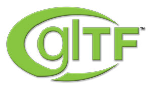

<p align="center">

</p>

Version 0.8

glTF is the runtime asset format for WebGL, OpenGL ES, and OpenGL.

_This is a draft specification; it is incomplete and may change before ratification.  We've made it available early in the spirit of transparency to receive early community feedback.  Please create [issues](https://github.com/KhronosGroup/glTF/issues) with your feedback._

Editors

* Patrick Cozzi, Analytical Graphics, Inc. and University of Pennsylvania
* Remi Arnaud, AMD
* Tony Parisi, Vizi

Previous Editor and Incubator: Fabrice Robinet, Individual Contributor

# Contents

* <a href="#motivation">Motivation</a>
* Schema
   * <a href="accessor.schema.json">`accessor`</a>
   * <a href="animation.schema.json">`animation`</a>
   * <a href="animationChannel.schema.json">`animation/channel`</a>
   * <a href="animationChannelTarget.schema.json">`animation/channel/target`</a>
   * <a href="animationParameter.schema.json">`animation/parameter`</a>
   * <a href="animationSampler.schema.json">`animation/sampler`</a>
   * <a href="asset.schema.json">`asset`</a>
   * <a href="buffer.schema.json">`buffer`</a>
   * <a href="bufferView.schema.json">`bufferView`</a>
   * <a href="camera.schema.json">`camera`</a>
   * <a href="cameraOrthographic.schema.json">`camera/orthographic`</a>
   * <a href="cameraPerspective.schema.json">`camera/perspective`</a>
   * <a href="extension.schema.json">`extension`</a>
   * <a href="extras.schema.json">`extras`</a>
   * <a href="glTF.schema.json">`glTF`</a> (root property for model)
   * <a href="image.schema.json">`image`</a>
   * <a href="light.schema.json">`light`</a>
   * <a href="lightAmbient.schema.json">`light/ambient`</a>
   * <a href="lightDirectional.schema.json">`light/directional`</a>
   * <a href="lightPoint.schema.json">`light/point`</a>
   * <a href="lightSpot.schema.json">`light/spot`</a>
   * <a href="material.schema.json">`material`</a>
   * <a href="materialInstanceTechnique.schema.json">`material/instanceTechnique`</a>
   * <a href="materialInstanceTechniqueValues.schema.json">`material/instanceTechnique/values`</a>
   * <a href="mesh.schema.json">`mesh`</a>
   * <a href="meshPrimitive.schema.json">`mesh/primitive`</a>
   * <a href="meshPrimitiveAttribute.schema.json">`mesh/primitive/attribute`</a>
   * <a href="node.schema.json">`node`</a>
   * <a href="nodeInstanceSkin.schema.json">`node/instanceSkin`</a>
   * <a href="program.schema.json">`program`</a>
   * <a href="sampler.schema.json">`sampler`</a>
   * <a href="scene.schema.json">`scene`</a>
   * <a href="shader.schema.json">`shader`</a>
   * <a href="skin.schema.json">`skin`</a>
   * <a href="technique.schema.json">`technique`</a>
   * <a href="techniqueParameters.schema.json">`technique/parameters`</a>
   * <a href="techniquePass.schema.json">`technique/pass`</a>
   * <a href="techniquePassDetails.schema.json">`technique/pass/details`</a>
   * <a href="techniquePassDetailsCommonProfile.schema.json">`technique/pass/details/commonProfile`</a>
   * <a href="techniquePassDetailsCommonProfileTexcoordBindings.schema.json">`technique/pass/details/commonProfile/texcoordBindings`</a>
   * <a href="techniquePassInstanceProgram.schema.json">`technique/pass/instanceProgram`</a>
   * <a href="techniquePassInstanceProgramAttribute.schema.json">`technique/pass/instanceProgram/attribute`</a>
   * <a href="techniquePassInstanceProgramUniform.schema.json">`technique/pass/instanceProgram/uniform`</a>
   * <a href="techniquePassStates.schema.json">`technique/pass/states`</a>
   * <a href="texture.schema.json">`texture`</a>

<!--TODO
* <a href="#designprinciples">Design Principles</a>
* <a href="#conventions">Conventions</a>
* <a href="#schema">Schema</a> - by category
   * Camera
      * <a href="#camera">`camera`</a>
      * <a href="#orthographic">`orthographic`</a>
      * <a href="#perspective">`perspective`</a>
   * Metadata
      * <a href="#asset">`asset`</a>
      * <a href="#geographicLocation">`geographicLocation`</a>
      * <a href="#profile">`profile`</a>   
      * <a href="#version">`version`</a>   
   * Shading
      * <a href="#image">`image`</a>
      * <a href="#material">`material`</a>
      * <a href="#parameters">`parameters`</a>
      * <a href="#pass">`pass`</a>
      * <a href="#program">`program`</a>   
      * <a href="#shader">`shader`</a>
      * <a href="#states">`states`</a>
      * <a href="#technique">`technique`</a>
      * <a href="#uniform">`uniform`</a>
   * Geometry
      * <a href="#meshAttribute">`attribute (mesh)`</a>
      * <a href="#attribute">`attribute (program)`</a>
      * <a href="#buffer">`buffer`</a>
      * <a href="#indices">`indices`</a>
      * <a href="#mesh">`mesh`</a>
      * <a href="#node">`node`</a>
      * <a href="#primitive">`primitive`</a>  
      * <a href="#semantics">`semantics`</a>
* <a href="#schema">Schema</a> - alphabetical
   * <a href="#meshAttribute">`attribute (mesh)`</a>
   * <a href="#asset">`asset`</a>
   * <a href="#attribute">`attribute (program)`</a>
   * <a href="#buffer">`buffer`</a>
   * <a href="#bufferView">`bufferView`</a>
   * <a href="#camera">`camera`</a>
   * <a href="#geographicLocation">`geographicLocation`</a>
   * <a href="#image">`image`</a>
   * <a href="#indices">`indices`</a>
   * <a href="#material">`material`</a>
   * <a href="#mesh">`mesh`</a>
   * <a href="#node">`node`</a>
   * <a href="#orthographic">`orthographic`</a>
   * <a href="#parameters">`parameters`</a>
   * <a href="#pass">`pass`</a>
   * <a href="#perspective">`perspective`</a>
   * <a href="#primitive">`primitive`</a>   
   * <a href="#profile">`profile`</a>   
   * <a href="#program">`program`</a>
   * <a href="#semantics">`semantics`</a>
   * <a href="#shader">`shader`</a>
   * <a href="#states">`states`</a>
   * <a href="#technique">`technique`</a>
   * <a href="#uniform">`uniform`</a>
   * <a href="#version">`version`</a>
* <a href="#about_shaders">Note about shaders</a>
* <a href="#assetvalidation">Asset Validation</a>
* <a href="#comparison">Comparison between COLLADA and glTF</a>
* <a href="#acknowledgments">Acknowledgments</a>
* <a href="#references">References</a>
-->

<!-- ----------------------------------------------------------------------- -->
<a name="motivation">

# Motivation

glTF, the GL Transmission Format, is the runtime asset format for the GL APIs: WebGL, OpenGL ES, and OpenGL.  glTF bridges the gap between formats used by modeling tools and the GL APIs.

There are industry-standard interchange formats, namely COLLADA, that allow sharing assets between modeling tools and within the content pipeline in general.  However, these formats are not optimized for size or runtime use and neither are modeling-tool-specific formats.  At runtime, an application wishing to render an asset needs to do a significant amount of processing to transform the asset's content into data appropriate for the GL APIs.

Applications seeking high-performance, such as games, rarely load interchange or modeling-tool-specific formats directly; instead, they process the model offline as part of a content pipeline to convert the asset to a proprietary format optimized for their runtime application.  This has lead to a fragmented market of incompatible proprietary runtime formats and duplicate efforts in content pipeline tools.  glTF solves this by providing an extensible open-standard runtime format that can be rendered with minimal processing, along with open-source pipeline tools, that, while not part of the glTF specification, provide the ecosystem of freely-available tools necessary to facilitate adoption of glTF.  In particular, [COLLADA2GLTF](https://github.com/KhronosGroup/glTF/tree/master/converter/COLLADA2GLTF) converts COLLADA assets to glTF.


Another perspective that motivates glTF is that 3D is the last media type without a standard codec.  Audio has mp3.  Video has H.264.  Images have png and jpg.  What does 3D content have?  The variety of use cases and complexity of 3D asset types have left 3D without a standard codec.  A cross-vendor standard will allow for portable, reusable content, unified asset repositories and archives, and enable optimized codec implementations in hardware and software. 

> Non-normative: the COLLADA Working Group is developing partnerships to define the codec options for geometry compression.  glTF defines the node hierarchy, materials, animations, and geometry, and will reference the external compression specs. 

Concretely, a glTF asset is represented by:
* JSON-formatted file (`.gltf`) containing the node hierarchy, materials, and cameras
* Binary files (`.bin`) containing geometry and animations
* Image files (`.jpg`, `.png`, etc.) for textures
* GLSL text files (`.glsl`) for GLSL source code for individual stages

Binary, image, and GLSL files can also be embedded directly into the JSON using [data URIs](https://developer.mozilla.org/en/data_URIs).

**MIME types**

* `*.gltf` files use `model/vnd.gltf+json`
* `*.bin` files use `application/octet-stream`
* `*.glsl` files use `text/plain`
* Texture files use the official `image/*` type based on the specific image format.

For a simple example, see the converted [COLLADA duck model](https://github.com/KhronosGroup/glTF/tree/master/model/duck).

Finally, glTF is not part of COLLADA, that is, it is not a COLLADA profile.  It is its own specification with many designs borrowed from COLLADA and simplified.

<!--TODO

<a name="designprinciples">

# Design Principles

glTF strives to live up to the following design principles. 

* <a href="#designprinciples.webfriendly">Web Friendly</a>
* <a href="#designprinciples.streamlined">Streamlined for Rendering</a>
* <a href="#designprinciples.mapwell">Map Well to the GL APIs</a>
* <a href="#designprinciples.easiertorender">Easier to Render than to Author</a>
* <a href="#designprinciples.minimalrepresentation">Minimal Representation</a>
* <a href="#designprinciples.reasonableflexibility">Reasonable Flexibility</a>
* <a href="#designprinciples.extensibility">Extensibility</a>
* <a href="#designprinciples.allowsconformancetesting">Allows Conformance Testing</a>
* <a href="#designprinciples.crossplatformandcrossdevice">Cross-Platform and Cross-Device</a>

<a name="designprinciples.webfriendly">
## Web Friendly

glTF is strives to be web friendly.  glTF:
* Uses JSON, which is trivial to parse in JavaScript.
* Only uses image formats that are supported by the JavaScript `Image` object.
* Requires minimal JavaScript processing before rendering.
* Maps well to web APIs like WebGL and typed and arrays.
* Allows incremental streaming.

_TODO: the above discussion does not account for compressed textures yet, which will require additional formats._

<a name="designprinciples.streamlined">
## Streamlined for Rendering

glTF is a runtime asset format; not an interchange format.  Its primary use case is rendering; therefore it is designed for runtime efficiency with consideration for:
* Size
* Speed
* Ease of runtime application development, i.e., easy to render

To achieve this:
* glTF uses [JSON](http://www.json.org/) for the node hierarchy, materials, and cameras.  JSON is compact, especially compared to XML, and minifies and compresses well.  For WebGL users, JSON parases in a single line of JavaScript using `JSON.parse`.  Free JSON libraries are also available for all major languages.
* glTF stores geometry using binary, which allows efficient creation of GL buffers - as opposed to COLLADA, for example, where geometry is stored in XML.  With the exception of potential decompression, geometry from glTF can be provided to GL directly with [`bufferData`](http://www.khronos.org/opengles/sdk/docs/man/xhtml/glBufferData.xml) or [`bufferSubData`](http://www.khronos.org/opengles/sdk/docs/man/xhtml/glBufferSubData.xml).
* glTF provides a streamlined set of features, relying on a content pipeline to do as much preprocessing as possible so the runtime application can efficiently load and render assets.  In particular:
   * glTF only supports variations of triangle, line, and point primitives.  It does not support more complex primitives found in modeling-tool formats like polygons and splines.  Instead, complex primitives are converted to triangles in the content pipeline.
   * glTF only supports one index per vertex, which is what the GL APIs support.  Modeling-tool formats commonly use one index per attribute, which can reduce the total amount of vertex data, but requires processing before rendering.  For glTF, this "deindexing" happens as part of the content pipeline.
   * glTF only supports `UNSIGNED_SHORT` indices.  Modeling-tool formats commonly use `UNSIGNED_INT` indices, which are not supported by WebGL or OpenGL ES without an extension.  In glTF, meshes are split so indices fit within `UNSIGNED_SHORT` as part of the content pipeline.
   * The modern GL APIs require vertex and fragment shaders.  glTF includes GLSL shaders (as well as potential metadata describing the shaders) that can be used directly.  Modeling-tool formats commonly define higher-level material properties only, which the application then needs to generate shaders for.  In glTF, this generation is part of the content pipeline.
   * For easy use with WebGL applications, glTF only support image formats natively supported by modern web browsers: `.jpg`, `.png`, `.bmp`, and `.gif`.  Some modeling-tool formats allow any image format making it difficult to write a renderer that is likely to work for all assets.  In glTF, images are converted to a known format as part of the content pipeline.

_TODO: the above discussion does not account for compressed textures yet, which will require additional formats._

_TODO: add discussion for `Normalize the "Up" axis of all scenes to allow easy resource sharing.`_

_TODO: pipeline diagram and opitonal optimization diagram._

<a name="designprinciples.mapwell">
## Map Well to the GL APIs

To make it easy for applications to implement, glTF is designed with the GL APIs in mind; in particular, the limitations of WebGL.

glTF tries to balance the tradeoffs between simplicity and completeness.  For example, although geometry, images, and shaders map easily to the GL APIs, they do not provide enough.  To make glTF broadly useful, glTF includes a node hierarchy, materials, and animations.  Leaving out the node hierarchy would hinder interaction with individual model nodes. Likewise leaving out materials and animations would leave out key functionality common to most applications.

To help map between glTF and GL:
* glTF properties commonly map to GL functions and function arguments.  For example, the <a href="#states">`states`</a> glTF property naming maps directly to GL functions.
* This specification contains cross-references to the OpenGL ES SDK (which WebGL also references).  For example, see the <a href="#shader">`shader`</a> glTF property.
* To reduce the burden on the application developer, glTF does not include all the flexibility of the GL APIs.  Features not relavant to assets or in widespread use are not included, especially if they can be supported in the content pipeline.  For example, in glTF:
   * All attributes must be backed by buffers, i.e., nothing maps to [`vertexAttrib`](http://www.khronos.org/opengles/sdk/docs/man/xhtml/glVertexAttrib.xml).
   * Geometry is defined with indices, implying [`drawElements`](http://www.khronos.org/opengles/sdk/docs/man/xhtml/glDrawElements.xml), not [`drawArrays`](http://www.khronos.org/opengles/sdk/docs/man/xhtml/glDrawArrays.xml), should be used to issue draw calls.  This is because most assets are defined with indexed triangle lists.  Triangle soup, strips, and fans can be converted to indexed triangle lists in the content pipeline.

<a name="designprinciples.easiertorender">
## Easier to Render than to Author

glTF is streamlined for rendering.  When a tradeoff needs to be made, glTF strives for the simplicity of the runtime application over the simplicity of the tool generating glTF, e.g., the content pipeline.  For example:
   * glTF does not support polygons.  Polygons are triangulated when glTF is written.
   * glTF only contains one <a href="#asset">`asset`</a> property for the asset's metadata, e.g., copyright.  When creating a glTF asset from an COLLADA asset, If the asset has several `asset` elements, the tool must handle it, so the application does not have to.

To relieve the burden on the content pipeline, [COLLADA2GLTF](https://github.com/KhronosGroup/glTF/tree/master/converter/COLLADA2GLTF) is an open-source COLLADA to glTF pipeline for integrating into existing pipelines or for use as a reference implementation for other glTF generation tools.  COLLADA was chosen because of its widespread use as an interchange format.

<a name="designprinciples.minimalrepresentation">
## Minimal Representation

glTF strives to keep the asset representation minimal.  That is, a glTF asset should only include data needed to render the model.

For example, it is common for a modeling-tool format to store several `technique` objects for a particular `material`.  Then at runtime, the application selects the `technique` based on the capabilities of the current platform.  glTF supports using multiple techniques for material LOD, that is, switching techniques based on the view parameters, occlusion, or other common LOD select criteria.  Although technique selection could also be based on the platform, the preferred method is to determine the technique as part of the content pipeline in advance or negotiate it via a REST API.  In the case of the REST API, when requesting the glTF asset, the client would include information about the current platform, which the server would use to return an asset with an appropriate `technique` perhaps from a static database of glTF assets or by generating the asset on the fly.

_TODO: More info on glTF and REST APIs.  Perhaps an image._

<a name="designprinciples.codenotjustspec">
## Code Not Just Spec

Formally, glTF is this specification.  However, a specification alone is not enough to drive adoption.  An open ecosystem of tools is needed to bridge the gap between specification and implementation.

In particlar, [COLLADA2GLTF](https://github.com/KhronosGroup/glTF/tree/master/converter/COLLADA2GLTF) is an open-source COLLADA to glTF pipeline for integrating into existing pipelines or for use as a reference implementation for other glTF generation tools.  For runtime applications, there is an open-source [JavaScript loader, WebGL renderer, and Three.js renderer](https://github.com/KhronosGroup/glTF/tree/master/webgl). 

<a name="designprinciples.reasonableflexibility">
## Reasonable Flexibility

glTF is streamlined for rendering so it doesn't have as many options or as much metadata as a modeling-tool format.  However, different applications still have different needs within the rendering use case.  glTF strives to be flexible in areas where flexibility is needed, but at the same time does not allow too much flexibility that would significantly burden application developers.  For example:

* glTF allows any number of binary files to store geometry and animations.  A user could store everything in one file to reduce the number of requests for a single asset or could store data common to several assets in a common binary file to reduce the amount of data requested across several models.  This flexibility allows applications to optimize for their use case, which glTF can't predict, but does not make glTF significantly more difficult to render.  
* glTF allows binary, image, and GLSL files to be separate from the main JSON file or embedded in the JSON using [data URIs](https://developer.mozilla.org/en/data_URIs).  For WebGL developers using `XMLHTTPRequest`, the code to load binary, image, or GLSL data is the same regardless of if the URL is an external file or embedded data URI.  Therefore, allowing this flexibility does not burden the application developer, but it allows the application to decide what the best approach.  If assets share many of the same geometry, animation, textures, or shaders, separate files may be preferred to reduce the total amount of data requested.  If an application cares more about single-file deployment, embedding data may be preferred even though it increases the overall size due to base64 encoding.  With separate files, applications can progressively load data and do not need to load data for parts of a model that are not visisble.
* glTF includes GLSL shaders and potential metadata describing the shaders, e.g., if it was generated from the COLLADA Common Profile.  Applications are free to use the provided shader directly or use the metadata to better integrate the asset into their application, e.g., model viewers may use the shaders where as deferred shading engines may use the metadata.

<a name="designprinciples.extensibility">
## Extensibility

glTF is streamlined for rendering so it does not include features tightly coupled with a particular application or niche vertical market.  Instead, glTF provides the foundations common to rendering assets - a node hierarchy, materials, animations, and geometry - and provides extensibility via <a href="#conventions-extra">`extra`</a> properties.  This allows applications to add specific metadata to glTF assets without burdening other application developers to support features.

<a name="designprinciples.allowsconformancetesting">
## Allows Conformance Testing

To ensure compatibility of glTF content among content pipelines and applications, glTF allows for validation.  A schema, written using [JSON Schema 03](http://tools.ietf.org/html/draft-zyp-json-schema-03), describing the JSON for glTF is part of this specification.

This allows validating an asset against the glTF schema using a tool like the glTF Validator (based on [JSV](https://github.com/garycourt/JSV)).  See <a href="#assetvalidation">Asset Validation</a>.

### Related Issues

* [#50](https://github.com/KhronosGroup/glTF/issues/50) - Improved glTF validator

<a name="designprinciples.crossplatformandcrossdevice">
## Cross-Platform and Cross-Device

Like the GL APIs, glTF strives to be cross-platform and cross-device.  JSON is platform-agnostic.  glTF explicitly defines the endianness of binary data as little endian.  Libraries that load the glTF referenced image formats are readily avilable on all platforms.

glTF assets also have a <a href="#profile">`profile`</a> that indicates what GL API it targets, e.g., `WebGL 1.0`.

_TODO: Deeper discussion here?_

<a name="designprinciples.other">
## Other

These are observations; not necessarily design principles.

### Readability

glTF is often human-readable, but doesn't strive to be.  Without minification and compression, JSON is even easier to read than XML since it is less cluttered.  Likewise, without optimization, minification, and compression, separate GLSL files are readable.

However, glTF assets aren't always readable.  For example, a simple shader embedded in JSON with a data URI becomes hard to read: `"data:,void%20main()%7Bgl_FragColor%3Dvec4(1.0)%3B"`.  Once minification occurs, the JSON and GLSL become unreadable.

<a name="conventions">
# Conventions

## Endianness

Binary data for geometry and animations is stored in little endian.  This does not require byte swapping on modern platforms running Windows, Linux, Mac, Android, and iOS.

## Naming

glTF uses [camel case](http://en.wikipedia.org/wiki/CamelCase) `likeThis` for the most part.  Camel case is a common naming convention in JSON and WebGL.

## Angles

glTF uses radians for angles to match GLSL and most math libraries.

## `name` Properties

An object's `name` property is the user-facing name that the application uses to access parts of the asset. 

In glTF, objects that are commonly accessed from an application, including resource objects (buffers, textures, and shaders), have optional `name` properties.  These objects are:

   * <a href="#buffer">`buffer`</a>
   * <a href="#camera">`camera`</a>
   * <a href="#image">`image`</a>
   * <a href="#material">`material`</a>
   * <a href="#mesh">`mesh`</a>
   * <a href="#node">`node`</a>
   * <a href="#shader">`shader`</a>

<a name="conventions-extra">
## `extra` Properties

glTF allows application-specific metadata on every object using the `extra` property.  For example:

```javascript
{
    // ... object properties in glTF schema
    "extra" : {
       "Application specific" : "The extra object can contain any properties."
    }    
}
```

Alternatively, glTF could allow application-specific properties anywhere, but this has the potential to break backwards compatibility in future versions, e.g., if an asset uses a property name that is then used in a future version of glTF.  Therefore, glTF does not allow additional properties on any objects, except `extra`.

### _Open Questions_

* _COLLADA2JSON_
   * _Needs to output `extra` objects_.
* _Loader_
   * _Needs to pass through `extra` objects_.
   * _Should fill out all optional properties so that the user receives complete objects with default values, e.g., render state._

<a name="schema">
# Schema

<a name="meshAttribute">
## `attribute (mesh)`

* Schema: [meshAttribute.schema.json](meshAttribute.schema.json)
* Example: [meshAttribute.json](examples/meshAttribute/meshAttribute.json) - every property with example values.

### Details

* To satisfy Section 6.3 (Buffer Offset and Stride Requirements) of [WebGL 1.0](https://www.khronos.org/registry/webgl/specs/1.0/), `byteOffset` and `byteStride` must be a multiple of the size of `type`.
* To satisfy Section 6.9 (Vertex Attribute Data Stride) of [WebGL 1.0](https://www.khronos.org/registry/webgl/specs/1.0/), `byteStride` cannot exceed 255.
* `min` and `max` properties are useful for creating bounding box or bounding sphere, and client-side compression/quantization.

### Related GL Functions

* [`vertexAttribPointer`](http://www.khronos.org/opengles/sdk/docs/man/xhtml/glVertexAttribPointer.xml)

### _Open Questions_

* _COLLADA2JSON_
   * _Add checking for Sections 6.3 and 6.9 above._
   
<a name="asset">
## `asset`

* Schema: [asset.schema.json](asset.schema.json)
* Examples:
   * [asset.json](examples/glTF/asset.json) - bare glTF model with an asset property.
   * [asset.json](examples/asset/asset.json) - every property with example values.

### Details

The design of `asset` in COLLADA is focused on asset interchange for assets potentially authored by multiple artists.  In glTF, `asset` is used to credit all artists for display purposes.

### Related GL Functions

None.

### Related Issues

* [#22](https://github.com/KhronosGroup/glTF/issues/22) - unify scenes axis-up
* [#23](https://github.com/KhronosGroup/glTF/issues/23) - should glTF specify unit property?
* [#24](https://github.com/KhronosGroup/glTF/issues/24) - glTF should specify more aspects of assets

<a name="attribute">
## `attribute`

* Schema: [attribute.schema.json](attribute.schema.json)
* Example: [attribute.json](examples/attribute/attribute.json) - every property with example values.

### Details

_TODO_

### Related GL Functions

* [`bindAttribLocation`](http://www.khronos.org/opengles/sdk/docs/man/xhtml/glBindAttribLocation.xml)
* [`getAttribLocation`](http://www.khronos.org/opengles/sdk/docs/man/xhtml/glGetAttribLocation.xml)
* [`getProgramParameter`](http://www.khronos.org/opengles/sdk/docs/man/xhtml/glGetProgramiv.xml) with `ACTIVE_ATTRIBUTES`

### _Open Questions_

* _Schema_
   * Create list of built-in semantics. [#45](https://github.com/KhronosGroup/collada2json/issues/45).
   * Create list of allowed types.
* _COLLADA2JSON_
   * 

<a name="buffer">
## `buffer`

* Schema: [buffer.schema.json](buffer.schema.json)
* Examples:
   * [buffers.json](examples/glTF/buffers.json) - bare glTF model with a buffer.
   * [buffer.json](examples/buffer/buffer.json) - every property with example values.

### Details

Instead of referencing an external binary file, the URL may be a base64 [data URI](https://developer.mozilla.org/en/data_URIs) to facilitate storing all model assets in a single .json for easy deployment, drag and drop, etc.  This can be negotiated via a REST API.

_TODO: Even though data URIs are part of the [spec](https://dvcs.w3.org/hg/xhr/raw-file/tip/Overview.html#data:-urls-and-http), they do not work with `XMLHttpRequest` in Chrome. We need to get this [bug](http://code.google.com/p/chromium/issues/detail?id=46806) fixed._

### Related Typed Array Functions

* [`ArrayBuffer`](http://www.khronos.org/registry/typedarray/specs/latest/#5)

### Related GL Functions

* [`bindBuffer`](http://www.khronos.org/opengles/sdk/docs/man/xhtml/glBindBuffer.xml)
* [`bufferData`](http://www.khronos.org/opengles/sdk/docs/man/xhtml/glBufferData.xml)
* [`bufferSubData`](http://www.khronos.org/opengles/sdk/docs/man/xhtml/glBufferSubData.xml)
* `createBuffer` / [`genBuffers`](http://www.khronos.org/opengles/sdk/docs/man/xhtml/glGenBuffers.xml)
* `deleteBuffer` / [`deleteBuffers`](http://www.khronos.org/opengles/sdk/docs/man/xhtml/glDeleteBuffers.xml)

### Related Issues

   * Convert `bool_array` to `0.0` or `1.0`?
   * Use `int_array` attributes `minInclusive` or `maxInclusive` to determine WebGL int datatype?
   

<a name="bufferView">
## `bufferView`

* Schema: [bufferView.schema.json](bufferView.schema.json)
* Examples:
   * [buffers.json](examples/glTF/buffers.json) - bare glTF model with a bufferView.
   * [bufferView.json](examples/bufferView/bufferView.json) - every property with example values.

### Details

### Related Typed Array Functions

* [`ArrayBufferView`](http://www.khronos.org/registry/typedarray/specs/latest/#6)

<a name="camera">
## `camera`

* Schema:
   * [camera.schema.json](camera.schema.json)
   * [perspective.schema.json](perspective.schema.json)
   * [orthographic.schema.json](orthographic.schema.json).
* Examples
   * [cameras.json](examples/glTF/cameras.json) - bare glTF model with two cameras.
   * [camera.json](examples/camera/camera.json) - every property with example values.
   * [orthographic.json](examples/orthographic/orthographic.json) - orthographic camera using all properties.
   * [perspective.json](examples/perspective/perspective.json) - perspective camera using all properties.

### Details

For `orthographic`, the following properties are required:
* `xmag` or `ymag`
   
For `perspective`, the following properties are required:
* `aspectRatio`
* `yfov`

### Related GL Functions

See <a href="#orthographic">`orthographic`</a> and <a href="#perspective">`perspective`</a>.

### _Open Questions_

* _COLLADA2JSON_
   * _Loader and writer need to be updated to reflect the new organization and required properties, not all COLLADA properties._
   * _`yfov` is degrees; it should be radians since this is a final-stage format._

<a name="geographicLocation">
## `geographicLocation`

* Schema: [geographicLocation.schema.json](geographicLocation.schema.json)
* Example: [geographicLocation.json](examples/geographicLocation/geographicLocation.json) - every property with example values.

### Details

_TODO_

### Related GL Functions

None.

### _Open Questions_

_TODO_

<a name="image">
## `image`

* Schema: [image.schema.json](image.schema.json)
* Examples
   * [images.json](examples/glTF/images.json) - bare glTF model with two images.
   * [image.json](examples/image/image.json) - every property with example values.

### Details

For compatibility with modern web browsers, the following image formats are supported: `.jpg`, `.png`, `.bmp`, and `.gif`.  The URL may be a [data URI](https://developer.mozilla.org/en/data_URIs) to facilitate storing all model assets in a single .json for easy deployment, drag and drop, etc.  This can be negotiated via a REST API.

### Related GL Functions

* [`bindTexture`](http://www.khronos.org/opengles/sdk/docs/man/xhtml/glBindTexture.xml)
* `createTexture` / [`genTextures`](http://www.khronos.org/opengles/sdk/docs/man/xhtml/glGenTextures.xml)
* `deleteTexture` / [`deleteTextures`](http://www.khronos.org/opengles/sdk/docs/man/xhtml/glDeleteTextures.xml)
* [`generateMipmap`](http://www.khronos.org/opengles/sdk/docs/man/xhtml/glGenerateMipmap.xml)
* [`texImage2D`](http://www.khronos.org/opengles/sdk/docs/man/xhtml/glTexImage2D.xml)
* [`texSubImage2D`](http://www.khronos.org/opengles/sdk/docs/man/xhtml/glTexSubImage2D.xml)

### Related Issues

* [#15](https://github.com/KhronosGroup/glTF/issues/15) - Support for extensions
* [#16](https://github.com/KhronosGroup/glTF/issues/16) - Support for precomputed mips
* [#17](https://github.com/KhronosGroup/glTF/issues/17) - Supprot for render targets
* [#18](https://github.com/KhronosGroup/glTF/issues/18) - convert images for destination Profile

<a name="indices">
## `indices`

* Schema: [indices.schema.json](indices.schema.json)
* Example: [indices.json](examples/indices/indices.json) - every property with example values.

### Details

* Since `indices` is a required property of [`primitive`](#primitive), indices are always used to describe geometry, which implies that [`drawElements`](http://www.khronos.org/opengles/sdk/docs/man/xhtml/glDrawElements.xml), not [`drawArrays`](http://www.khronos.org/opengles/sdk/docs/man/xhtml/glDrawArrays.xml), should be used to issue draw calls.

### Related GL Functions

* [`drawElements`](http://www.khronos.org/opengles/sdk/docs/man/xhtml/glDrawElements.xml)

Also see <a href="#buffer">buffer</a>.

### Related Issues

* [#14](https://github.com/KhronosGroup/glTF/issues/14) - support for models without indices ?

<a name="material">
## `material`

* Schema: [material.schema.json](material.schema.json)
* Examples
   * [materials.json](examples/glTF/materials.json) - bare glTF model with two images.
   * [material.json](examples/material/material.json) - every property with example values.

### Details

* A material can have multiple techniques to support shader LOD, i.e., use simpler shaders for distant objects.  Traditionally, techniques are also used to support multiple platforms, e.g., high-end vs. low-end GPUs.  We recommend negotiating via a REST API, instead of streaming multiple techniques.

### Related GL Functions

See <a name="parameters">`parameters`</a>.

### _Open Questions_

* _Schema_
   * _Write schema for `parameters`._
   
<a name="mesh">
## `mesh`

* Schema: [mesh.schema.json](mesh.schema.json)
* Example:  [mesh.json](examples/mesh/mesh.json) - every property with example values.

### Details

_TODO_

### Related GL Functions

See <a href="#meshAttribute">`attributes (mesh)`</a> and <a href="#primitives">`primitives`</a>.

### Related Issues

* [#11](https://github.com/KhronosGroup/glTF/issues/11) - Splines should be converted

<a name="node">
## `node`

* Schema: [node.schema.json](node.schema.json)
* Examples
   * [nodes.json](examples/glTF/nodes.json) - bare glTF model with two nodes.
   * [meshes.json](examples/node/meshes.json) - an interior node with a mesh (and children).
   * [meshes_leaf.json](examples/node/meshes_leaf.json) - a leaf node with a mesh.

### Details

_TODO_

### Related GL Functions

* [`uniformMatrix[234]fv`](http://www.khronos.org/opengles/sdk/docs/man/xhtml/glUniform.xml)

Also see <a href="#mesh">`mesh`</a> subproperties See <a href="#accessors">`accessors`</a> and <a href="#primitives">`primitives`</a>.

### Related Issues

* [#12](https://github.com/KhronosGroup/glTF/issues/12) - Convert all transformation elements to matrices
* [#13](https://github.com/KhronosGroup/glTF/issues/13) - Should we keep one or more mesh,camera,light per node.

<a name="orthographic">
## `orthographic`

* Schema: [orthographic.schema.json](orthographic.schema.json)
* Example: [orthographic.json](examples/orthographic/orthographic.json) - every property with example values.

### Details

_TODO_

### Related GL Functions

* [`uniformMatrix4fv`](http://www.khronos.org/opengles/sdk/docs/man/xhtml/glUniform.xml)

### _Open Questions_

_TODO_

<a name="parameters">
## `parameters`

* Schema: [parameters.schema.json](parameters.schema.json)
* Example: [parameters.json](examples/parameters/parameters.json) - every property with example values.

### Details

_TODO_

### Related GL Functions

* [`activeTexture`](http://www.khronos.org/opengles/sdk/docs/man/xhtml/glActiveTexture.xml)
* [`bindTexture`](http://www.khronos.org/opengles/sdk/docs/man/xhtml/glBindTexture.xml)
* [`texParameterf`](http://www.khronos.org/opengles/sdk/docs/man/xhtml/glTexParameter.xml)
* [`texParameteri`](http://www.khronos.org/opengles/sdk/docs/man/xhtml/glTexParameter.xml)
* [`uniform[1234][fi]`](http://www.khronos.org/opengles/sdk/docs/man/xhtml/glUniform.xml)
* [`uniform[1234][fi]v`](http://www.khronos.org/opengles/sdk/docs/man/xhtml/glUniform.xml)
* [`uniformMatrix[234]fv`](http://www.khronos.org/opengles/sdk/docs/man/xhtml/glUniform.xml)

### _Open Questions_

_TODO_

<a name="pass">
## `pass`

* Schema: [pass.schema.json](pass.schema.json)
* Examples: [pass.json](examples/pass/pass.json) - every property with example values.

### Details

_TODO_

### Related GL Functions

See <a href="#program">`program`</a> and <a href="#states">`states`</a>.

### _Open Questions_

* _Schema_
   * 
* _COLLADA2JSON_
   *

<a name="perspective">
## `perspective`

* Schema: [perspective.schema.json](perspective.schema.json)
* Example: [perspective.json](examples/perspective/perspective.json) - every property with example values.

### Details

_TODO_

### Related GL Functions

* [`uniformMatrix4fv`](http://www.khronos.org/opengles/sdk/docs/man/xhtml/glUniform.xml)

### _Open Questions_

_TODO_
   
<a name="primitive">
## `primitive`

* Schema: [primitive.schema.json](primitive.schema.json)
* Example: [primitive.json](examples/primitive/primitive.json) - every property with example values.

### Details

* To satisfy Section 6.3 (Buffer Offset and Stride Requirements) of [WebGL 1.0](https://www.khronos.org/registry/webgl/specs/1.0/), `byteOffset` must be a multiple of the size of `type`.

### Related GL Functions

* [`disableVertexAttribArray`](http://www.khronos.org/opengles/sdk/docs/man/xhtml/glEnableVertexAttribArray.xml)
* [`enableVertexAttribArray`](http://www.khronos.org/opengles/sdk/docs/man/xhtml/glEnableVertexAttribArray.xml)

Also see:
   * <a href="#indices">`indices`</a> subproperty
   * <a href="#parameters">`parameters`</a> subproperty of <a href="#material">`material`</a> and <a href="#technique">`technique`</a>.

### _Open Questions_

* _Schema_
   * `indices` `type` could also be `UNSIGNED_BYTE`, but it's rarely used.
* _COLLADA2JSON_
   * _Add checking for Section 6.3 above._

<a name="profile">
## `profile`

_TODO_

<a name="program">
## `program`

* Schema: [program.schema.json](program.schema.json)
* Examples: [program.json](examples/program/program.json) - every property with example values.

### Details

_TODO_

### Related GL Functions

* [`createProgram`](http://www.khronos.org/opengles/sdk/docs/man/xhtml/glCreateProgram.xml)
* [`deleteProgram`](http://www.khronos.org/opengles/sdk/docs/man/xhtml/glDeleteProgram.xml)
* [`attachShader`](http://www.khronos.org/opengles/sdk/docs/man/xhtml/glAttachShader.xml)
* [`linkProgram`](http://www.khronos.org/opengles/sdk/docs/man/xhtml/glLinkProgram.xml)
* [`useProgram`](http://www.khronos.org/opengles/sdk/docs/man/xhtml/glUseProgram.xml)
* [`validateProgram`](http://www.khronos.org/opengles/sdk/docs/man/xhtml/glValidateProgram.xml)

Also see <a href="#attributes">`attributes`</a> and <a href="#uniforms">`uniforms`</a> subproperties of <a href="#shader">`shader`</a>.

### Related Issues

* [#25](https://github.com/KhronosGroup/glTF/issues/25) - naming for vertex and fragment shaders

<a name="semantics">
## `semantics`

* Schema: [semantics.schema.json](semantics.schema.json)
* Example: [semantics.json](examples/semantics/semantics.json) - every property with example values.

### Details

The following set of semantic is not exhaustive.  
An asset could be created with custom semantic.  
It is fine as long as the semantic from the mesh attribute is consistent with one from the program attribute.  
In some situations implementing the following set can be mandatory to be able to generate shaders, see <a href="#about_shaders">Note about shaders</a> for more details.

Within the scope of a primitive a semantic points to a mesh attribute.
When multiple sets are available for a given 'semantic', by convention both are concatenated as `semantic`_`set`.
Specifying the set for index 0 is optional.  

### Related Issues

* [#26](https://github.com/KhronosGroup/glTF/issues/26) - semantic for mesh attributes. what is mandatory ? what is a suggestion ?


#### Semantics

General and Tangent Space

| Semantic Name | Typical datatypes | Description |
|:-----------|:-----------|:------------|
| `POSITION` | `vec2` or `vec3` | Geometric coordinate vector. |
| `NORMAL` | `vec3` | Normal vector. |
| `BINORMAL` | `vec3` | Geometric binormal (bitangent) vector. |
| `TANGENT` | `vec3` | Geometric tangent vector. |
| `TEXCOORD` | `float`, `vec2`, and `vec3` | Texture coordinate vector. |
| `COLOR` | `vec3` and `vec4` | Color.  RGB or RGBA. |

_TODO: Flush out semantics below._

Skinning and Morph Targets

| Semantic Name | Typical datatypes | Description |
|:-----------|:-----------|:------------|
| `INV_BIND_MATRIX` |  | Inverse of local-to-world matrix. |
| `JOINT` |  | Skin influence identifier. |
| `WEIGHT` |  | Skin influence weighting value. |
| `MORPH_TARGET` |  | Morph targets for mesh morphing. |
| `MORPH_WEIGHT` |  | Weights for mesh morphing. |
| `TEXBINORMAL` |  | Texture binormal (bitangent) vector. |
| `TEXTANGENT` |  | Texture tangent vector  |

Other  

| Semantic Name | Typical datatypes | Description |
|:-----------|:-----------|:------------|
| `TEXBINORMAL` |  | Texture binormal (bitangent) vector. |
| `TEXTANGENT` |  | Texture tangent vector  |

<a name="shader">
## `shader`

* Schema: [shader.schema.json](shader.schema.json)
* Examples
   * [shaders.json](examples/glTF/shaders.json) - bare glTF model with two shaders.
   * [shader.json](examples/shader/shader.json) - every property with example values.
   * [dataUri.json](examples/shader/dataUri.json) - using a data URI for a shader source.

### Details

GLSL source can be in external plain-text .glsl files.  The URL may also be a plain-text [data URI](https://developer.mozilla.org/en/data_URIs) to facilitate storing all model assets in a single .json for easy deployment, drag and drop, etc.  Using a data URI reduces the number of requests for a single model.  However, if several models are loaded that use the same shader, using separate .glsl files may be better due to HTTP caching.  This can be negotiated via a REST API.

_TODO: Even though data URIs are part of the [spec](https://dvcs.w3.org/hg/xhr/raw-file/tip/Overview.html#data:-urls-and-http), they do not work with `XMLHttpRequest` in Chrome. We need to get this [bug](http://code.google.com/p/chromium/issues/detail?id=46806) fixed._

### Related GL Functions

* [`createShader`](http://www.khronos.org/opengles/sdk/docs/man/xhtml/glCreateShader.xml)
* [`compileShader`](http://www.khronos.org/opengles/sdk/docs/man/xhtml/glCompileShader.xml)
* [`deleteShader`](http://www.khronos.org/opengles/sdk/docs/man/xhtml/glDeleteShader.xml)
* [`shaderSource`](http://www.khronos.org/opengles/sdk/docs/man/xhtml/glShaderSource.xml)

Also see <a href="#program">`program`</a>.

<a name="states">
## `states`

* Schema: [states.schema.json](states.schema.json)
   * All properties are optional and default to values from the [WebGL 1.0 spec](https://www.khronos.org/registry/webgl/specs/1.0/).
* Examples:
   * [states.json](examples/states/states.json) - every state with its default value.
   * [closedOpaqueObject.json](examples/states/closedOpaqueObject.json) - typical state for rendering a closed, opaque object: depth testing and backface culling.
   * [depthTest.json](examples/states/depthTest.json) - state with depth testing enabled.
   * [translucency.json](examples/states/translucency.json) - typical state for rendering a translucency object with alpha blending.

### Details

Like COLLADA, glTF includes:
* `blendEquation` and `blendEquationSeparate`
* `both blendFunc` and `blendFuncSeparate`
* `stencilFunc` and `stencilFuncSeparate`
* `stencilOp` and `stencilOpSeparate`

The separate version of a property takes precedence over its counterpart.  For example, if both `blendEquation` and `blendEquationSeparate` are provided, `blendEquationSeparate` takes precedence.

To satisfy Section 6.8 (Stencil Separate Mask and Reference Values) of [WebGL 1.0](https://www.khronos.org/registry/webgl/specs/1.0/), when `stencilFuncSeparate` is used, `ref` and `mask` must be the same for front- and back-facing geometry.
To satisfy Section 6.10 (Viewport Depth Range) of [WebGL 1.0](https://www.khronos.org/registry/webgl/specs/1.0/), `zNear` cannot be greater than `zFar`.

### Related GL Functions

* [`blendEquation`](http://www.khronos.org/opengles/sdk/docs/man/xhtml/glBlendEquation.xml)
* [`blendEquationSeparate`](http://www.khronos.org/opengles/sdk/docs/man/xhtml/glBlendEquationSeparate.xml)
* [`blendFunc`](http://www.khronos.org/opengles/sdk/docs/man/xhtml/glBlendFunc.xml)
* [`blendFuncSeparate`](http://www.khronos.org/opengles/sdk/docs/man/xhtml/glBlendFuncSeparate.xml)
* [`colorMask`](http://www.khronos.org/opengles/sdk/docs/man/xhtml/glColorMask.xml)
* [`cullFace`](http://www.khronos.org/opengles/sdk/docs/man/xhtml/glCullFace.xml)
* [`depthFunc`](http://www.khronos.org/opengles/sdk/docs/man/xhtml/glDepthFunc.xml)
* [`depthMask`](http://www.khronos.org/opengles/sdk/docs/man/xhtml/glDepthMask.xml)
* [`depthRange`](http://www.khronos.org/opengles/sdk/docs/man/xhtml/glDepthRangef.xml)
* [`enable`](http://www.khronos.org/opengles/sdk/docs/man/xhtml/glEnable.xml) and [`disable`](http://www.khronos.org/opengles/sdk/docs/man/xhtml/glDisable.xml) with `BLEND`, `CULL_FACE`, `DEPTH_TEST`, `DITHER`, `POLYGON_OFFSET_FILL`, `SAMPLE_ALPHA_TO_COVERAGE`, `SAMPLE_COVERAGE`, `SCISSOR_TEST`, or `STENCIL_TEST`
* [`frontFace`](http://www.khronos.org/opengles/sdk/docs/man/xhtml/glFrontFace.xml)
* [`lineWidth`](http://www.khronos.org/opengles/sdk/docs/man/xhtml/glLineWidth.xml)
* `gl_PointSize`
* [`polygonOffset`](http://www.khronos.org/opengles/sdk/docs/man/xhtml/glPolygonOffset.xml)
* [`sampleCoverage`](http://www.khronos.org/opengles/sdk/docs/man/xhtml/glSampleCoverage.xml)
* [`scissor`](http://www.khronos.org/opengles/sdk/docs/man/xhtml/glScissor.xml)
* [`stencilFunc`](http://www.khronos.org/opengles/sdk/docs/man/xhtml/glStencilFunc.xml)
* [`stencilFuncSeparate`](http://www.khronos.org/opengles/sdk/docs/man/xhtml/glStencilFuncSeparate.xml)
* [`stencilMask`](http://www.khronos.org/opengles/sdk/docs/man/xhtml/glStencilMask.xml)
* [`stencilOp`](http://www.khronos.org/opengles/sdk/docs/man/xhtml/glStencilOp.xml)
* [`stencilOpSeparate`](http://www.khronos.org/opengles/sdk/docs/man/xhtml/glStencilOpSeparate.xml)

### _Open Questions_

* _Schema_
   * _Do we agree about separate precedence above?_
   * _I don't know anyone who uses `dither_enable` nowadays.  Is this something we want to include?_
   * _Currently, only a `lineWidth` of `1.0` is supported on most browsers on Windows because that is all that ANGLE supports._
   * _Need to look at OpenGL and OpenGL ES, which I think still includes `point_size_enable`._
* _COLLADA2JSON_
   * _Add to loader and writer.  Writer needs to derive state from common profile._

<a name="technique">
## `technique`

* Schema: [technique.schema.json](technique.schema.json)
* Examples
   * [techniques.json](examples/glTF/techniques.json) - bare glTF model with two images.
   * [technique.json](examples/technique/technique.json) - every property with example values.

### Details

_TODO_

### Related GL Functions

See <a name="parameters">`parameters`</a>.

### Related Issues

* [#7](https://github.com/KhronosGroup/glTF/issues/7) - Add Schema for parameter


<a name="uniform">
## `uniform`

* Schema: [uniform.schema.json](uniform.schema.json)
* Example: [uniform.json](examples/uniform/uniform.json) - every property with example values.

### Details

_TODO_

### Related GL Functions

* [`getActiveUniform`](http://www.khronos.org/opengles/sdk/docs/man/xhtml/glGetActiveUniform.xml)
* [`getUniformLocation`](http://www.khronos.org/opengles/sdk/docs/man/xhtml/glGetUniformLocation.xml)
* [`getProgramParameter`](http://www.khronos.org/opengles/sdk/docs/man/xhtml/glGetProgramiv.xml) with `ACTIVE_UNIFORMS`
* [`uniform[1234][fi]`](http://www.khronos.org/opengles/sdk/docs/man/xhtml/glUniform.xml)
* [`uniform[1234][fi]v`](http://www.khronos.org/opengles/sdk/docs/man/xhtml/glUniform.xml)
* [`uniformMatrix[234]fv`](http://www.khronos.org/opengles/sdk/docs/man/xhtml/glUniform.xml)

### Related Issues

* Create list of built-in semantics. [#45](https://github.com/KhronosGroup/collada2json/issues/45).

<a name="version">
## `version`

_TODO_

<a name="about_shaders">
# Note about About shaders 

Within glTF assets, shaders are always provided.
This said, shader implementation is up to the glTF adopter.
Consequently, none of the techniques, semantic except `POSITION` and attributes are imposed by glTF.
Using `POSITION` for attributes to be transformed then projected on screen is required.


However, for heavier clients and especially the ones relying on deferred lighting, provided shaders might not be always usable.
By supporting the following set of parameters and semantics, a client can re-generate the shaders to fit a specific architecture.

The following parameters are typically used by the common lighting models, like Lambert, Phong and Blinn-Phong.
By gathering the set of parameter names going through uniforms and attributes of a program.
An engine  should be able to re-generate a lighting model shader.
Additionally, to get more guidance, the following technique names can be provided: 

| name |
|:-----------|
| `Lambert` | 
| `Phong` |
| `Blinn-Phong` |

Since the same lighting model may still lead to different shaders. names can be especially handy when shader re-generation is needed.
For instance, the diffuse component of the lighting might be a color or a texture,  then, resulting shaders and techniqueID might differ.

| parameter | Typical datatypes | Description |
|:-----------|:-----------|:------------|
| `ambient` | `vec3` or `SAMPLER_2D`  | ambient color or texture |
| `diffuse` | `vec3` or `SAMPLER_2D`   | diffuse color or texture |
| `emission` | `vec3` or `SAMPLER_2D`   | emission color or texture |
| `specular` | `vec3` or `SAMPLER_2D`   | specular color or texture |
| `transparent` | `vec3` or `SAMPLER_2D`   | transparent color or texture |
| `shininess ` | `float` | shininess. |
| `indexOfRefraction ` | `float` |  |
| `reflectivity ` | `float` |  |

[TODO] add normal map

| Semantic Name | Typical datatypes | Description |
|:-----------|:-----------|:------------|
| `POSITION` | `vec2` or `vec3` | Position vector |
| `NORMAL` | `vec3` | Normal vector. |
| `TEXCOORD` | `float`, `vec2`, and `vec3` | Texture coordinate vector. |

[TODO]example:

<a name="assetvalidation">
# Asset Validation

The glTF schema is written using [JSON Schema 03](http://tools.ietf.org/html/draft-zyp-json-schema-03).

An asset can be validated against the schema using the glTF Validator (based on [JSV](https://github.com/garycourt/JSV)).  Setup a local webserver to point the root of your local copy of this repo, and browse to index.html.  For example:
```
http://localhost/specification/
```

There are a few query parameters.

Use `schema` to provide the schema to validate against:
```
http://localhost/specification/?schema=states.schema.json
```

Use `json` to provide the asset's JSON to validate:
```
http://localhost/specification/?json=examples/states/translucency.json
```

Use `validate` to immediately validate the json with the schema:
```
http://localhost/specification/?validate=true
```

The most common use is something like:
```
http://localhost/specification/?schema=states.schema.json&json=examples/states/translucency.json&validate=true
```

Also, JSON in general can be valdiated with [JSONLint](http://jsonlint.com/), which can be useful for validating the glTF schema itself.

<a name="comparison">
# Comparison between COLLADA and glTF

This section describes the most relevant differences between COLLADA and glTF for glTF users.

See <a href="#designprinciples">Design Principles</a> and <a href="#conventions">Conventions</a> for more motivation on the design of glTF.

## Format

COLLADA is XML; glTF uses JSON for its readability, conciseness, and built-in support in browsers.

## Geometry

COLLADA stores geometry in XML; glTF uses external binary blogs (or optionally embedded data URIs) for efficiency and better mapping to GL APIs.

## Naming

COLLADA uses underscores `like_this`; glTF uses [camel case](http://en.wikipedia.org/wiki/CamelCase) `likeThis`.  Camel case is a common naming convention in JSON and WebGL.

## Angles

COLLADA uses degrees for angles; glTF uses radians to match GLSL and most math libraries.

## `id` and `name` attributes

COLLADA `id` attributes map to the name of an object, and the COLLADA `name` attribute maps to the `name` property of an object, for example:
```
<node id="nodeId" name="nodeName"> 
</node>
``` 
becomes
```javascript
"nodeId" : {
    "name" : "nodeName"
}
```

TODO: What's in COLLADA, but not in this version of glTF
* No `profile`.  Instead, this can be negotiated via a REST API.  (platform, product name, etc.)

## Schema

### `accessor`

Minor
   
#### [COLLADA 1.5](http://www.khronos.org/files/collada_spec_1_5.pdf) References

* `accessor`. Pages 5-5 to 5-10.
   
### `asset`

* `asset` is only defined on the root glTF property; in COLLADA, it is available as a child of many elements.  In practice, it is usually only a child of the `COLLADA` root node.
* `asset` just contains `copyright` that can be used to credit the model author(s), and `geographicLocation`.  If an application needs more information, it can be stored in the `extra` property.

#### [COLLADA 1.5](http://www.khronos.org/files/collada_spec_1_5.pdf) References

* `asset`. Pages 5-17 to 5-19
* `contributor`. Pages 5-27 to 5-28.
* `geographic_location`. Pages 5-40 to 5-41.

### `attribute`

_TODO_

#### [COLLADA 1.5](http://www.khronos.org/files/collada_spec_1_5.pdf) References

_TODO_

### `buffer`

* Vertices and indices are stored in binary, not XML.
* From the buffer's perspective, vertices and indices are untyped unlike `float_array`, etc. in COLLADA.  The `accessor` specifies the type later for the subset it references.
* glTF does not support `float_array` attributes `digits` and `magnitude`.  In glTF, all floats are stored in IEEE-754 32-bit floating point.
* glTF does not support `int_array` attributes `minInclusive` or `maxInclusive`.  The `accessor` specifies the type, e.g., unsigned short or unsigned int, later for the subset it references.
* glTF does not support `IDREF_array` (5-44), `Name_array` (5-94 to 5-95), or `SIDREF_array` (5-130).
* Also see <a href="#mesh">`mesh`</a>.

#### [COLLADA 1.5](http://www.khronos.org/files/collada_spec_1_5.pdf) References

* `geometry`.  Pages 5-42 to 5-43.
* `mesh`. Pages 5-89 to 5-91.
* `source`. Pages 5-137 to  5-138.
* `bool_array`. Page 5-20.
* `float_array`. Page 5-37.
* `int_array`. Page 5-69.

### `camera`

In order to better map to OpenGL, OpenGL ES, and WebGL, glTF differs from COLLADA in the following ways:

* No `imager`.  COLLADA Pages 5-45 to 5-46.
* No `optics`.  COLLADA Pages 5-100 to 5-101.  `orthographic` and `perspective` are directly part of the camera.
   * A glTF camera represents a single camera; it doesn't have techniques.  This can be negotiated via a REST API.
* In COLLADA, both `orthographic` and `perspective` allow several different options for required properties.  glTF provides only one set of required properties for `orthographic` and `perspective` cameras, which map most commonly to computing orthographic and perspective projection matrices.  See above.

#### [COLLADA 1.5](http://www.khronos.org/files/collada_spec_1_5.pdf) References

* `camera`.  Pages 5-21 to 5-22.
* `orthographic`.  Pages 5-102 to 5-103.
* `perspective`.  Pages 5-108 to 5-109.

### `geographicLocation`

_TODO_

#### [COLLADA 1.5](http://www.khronos.org/files/collada_spec_1_5.pdf) References

_TODO_

### `image`

glTF 1.0 does not support:
* `image`: `renderable`, `create_2d`, `create_3d`, and `create_cube`.
* `init_from`: `array_index`, `mip_index`, `depth`, and `face`.

#### [COLLADA 1.5](http://www.khronos.org/files/collada_spec_1_5.pdf) References

* `library_images`.  Page 8-75.
* `image`.  Page 8-58 to 8-60.
* `init_from`.  Pages 8-62 to 8-63.

### `indices`

_TODO_

#### [COLLADA 1.5](http://www.khronos.org/files/collada_spec_1_5.pdf) References

_TODO_

### `material`

_TODO_

#### [COLLADA 1.5](http://www.khronos.org/files/collada_spec_1_5.pdf) References

_TODO_

### `node`

In order to better map to OpenGL, OpenGL ES, and WebGL, glTF differs from COLLADA in the following ways:
* Only a single transform is supported, and it must be a 4x4 matrix.  COLLADA transformation elements such as `lookat` and `rotate` must be converted to a 4x4 matrix.  If several COLLADA transformation elements are used, they must be concatenated into a single 4x4 matrix.

#### [COLLADA 1.5](http://www.khronos.org/files/collada_spec_1_5.pdf) References

* `node`.  Pages 5-98 to 5-99.

### `orthographic`

_TODO_

#### [COLLADA 1.5](http://www.khronos.org/files/collada_spec_1_5.pdf) References

_TODO_

### `parameters`

_TODO_

#### [COLLADA 1.5](http://www.khronos.org/files/collada_spec_1_5.pdf) References

_TODO_

### `pass`

_TODO_

#### [COLLADA 1.5](http://www.khronos.org/files/collada_spec_1_5.pdf) References

_TODO_

### `perspective`

_TODO_

#### [COLLADA 1.5](http://www.khronos.org/files/collada_spec_1_5.pdf) References

_TODO_

### `primitive`

TODO
   
#### [COLLADA 1.5](http://www.khronos.org/files/collada_spec_1_5.pdf) References

* 

### `program`

_TODO_

#### [COLLADA 1.5](http://www.khronos.org/files/collada_spec_1_5.pdf) References

_TODO_

### `shader`

_TODO_

#### [COLLADA 1.5](http://www.khronos.org/files/collada_spec_1_5.pdf) References

_TODO_

### `states`

Render states are based on the GLES2 profile in [COLLADA 1.5](http://www.khronos.org/files/collada_spec_1_5.pdf), Pages 8-120 to 8-125.  In order to better map to OpenGL, OpenGL ES, and WebGL, glTF differs from COLLADA in the following ways:

* Removed `point_size_enable`; instead, we just assign to `gl_PointSize` in WebGL based on `pointSize`.
* `scissor` `width` and `height` default to zero, not "When a GL context is first attached to a window, width and height are set to the dimensions of that window."
* Added `sampleCoverageEnable`.
* To satisfy Section 6.8 (Stencil Separate Mask and Reference Values) of the WebGL 1.0 Spec, there is no `stencil_mask_separate`.
   
#### [COLLADA 1.5](http://www.khronos.org/files/collada_spec_1_5.pdf) References

* `states`. Pages 8-120 to 8-125.

### `technique`

_TODO_

#### [COLLADA 1.5](http://www.khronos.org/files/collada_spec_1_5.pdf) References

_TODO_

### `uniform`

_TODO_

#### [COLLADA 1.5](http://www.khronos.org/files/collada_spec_1_5.pdf) References

_TODO_

<a name="attribute">
## `attribute`

* glTF does not include semantics for `CONTINUITY`, `IMAGE`, `INPUT`, `IN_TANGENT`, `INTERPOLATION`, `LINEAR_STEPS`, `OUTPUT`, `OUT_TANGENT`, `TEXBINORMAL`, `TEXTANGENT`, `UV`, and `VERTEX`.

#### [COLLADA 1.5](http://www.khronos.org/files/collada_spec_1_5.pdf) References

* `input`. Pages 5-47 to 5-49.

-->

<!-- ----------------------------------------------------------------------- -->
<a name="acknowledgments">
# Acknowledgments

* Brandon Jones, for the first version of Three.js loader and all his support in the early days of this project.
* Tom Fili, Analytical Graphics, Inc.
* Scott Hunter, Analytical Graphics, Inc.
* Ed Mackey, Analytical Graphics, Inc.

<!-- ----------------------------------------------------------------------- -->
<a name="references">
# References

* [WebGL 1.0.2 spec](https://www.khronos.org/registry/webgl/specs/1.0/)
* [COLLADA 1.5 spec](http://www.khronos.org/files/collada_spec_1_5.pdf)
